%% mathjax-macros
\ba: \mathbf{a}
\bv: \mathbf{v}
\bu: \mathbf{u}
\bo: \mathbf{o}
\bq: \mathbf{q}
\bI: \mathbf{I}
\bA: \mathbf{A}
\E: \mathbb{E}
%% end-mathjax-macros

# Emergence of Human to Robot Transfer in Vision-Language-Action Models

> **论文信息**
> - 作者：Simar Kareer$^{1,2*}$, Karl Pertsch$^{1}$, James Darpinian$^{1}$, Judy Hoffman$^{2}$, Danfei Xu$^{2}$, Sergey Levine$^{1}$, Chelsea Finn$^{1}$, Suraj Nair$^{1}$
> - 机构：$^{1}$Physical Intelligence, $^{2}$Georgia Institute of Technology
> - 投稿方向：ICRA / CoRL / ICML 类会议（IEEE 双栏格式）
> - arXiv ID：2512.22414
> - 代码：未公开

---

## 一、核心问题

**机器人能否直接从人类视频中学习操作技能，而无需人工设计的显式对齐（explicit alignment）？**

现有方法要么只能通过 VLM 预训练权重*间接*利用人类知识（如 R3M、VIP），要么需要手工设计的对齐机制（如关键点映射、AR/VR 叠加、隐空间对齐）来桥接人类和机器人域。这些方法在数据规模增大时变得不通用、不优雅。

本文的核心假设：**从人类视频中直接学习技能的能力，会随着 VLA 预训练数据多样性（覆盖的场景、任务、机器人形态数量）的增加而自然涌现（emerge）**——就像 LLM 中随着规模增长涌现出的 in-context learning 和 instruction following 能力一样。

---

## 二、核心思路 / 方法

### 2.1 总体框架：$\pi_{0.5}$ + ego

本文提出 **$\pi_{0.5}+\text{ego}$**，将人类视频视为 VLA 训练中的"又一个 embodiment"，与机器人数据使用**完全相同的训练目标**，不做任何显式对齐。

核心理念：
- 机器人数据：预测末端执行器（end-effector）轨迹 + 高层子任务语言标签
- 人类数据：完全相同的目标——从 3D 手部关键点计算"虚拟末端执行器"轨迹 + 密集语言标注

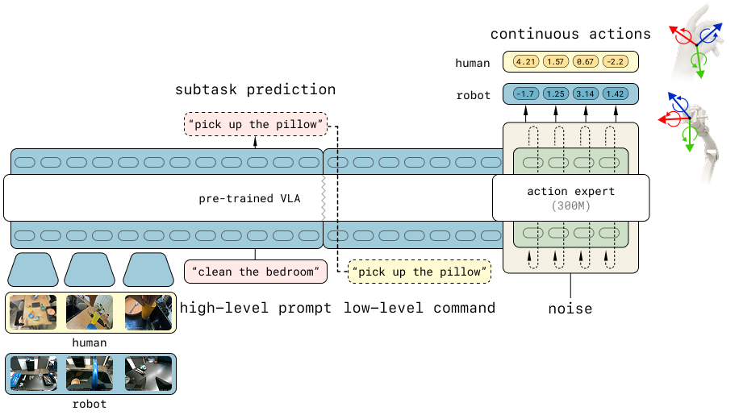

*图1：模型架构。基于 $\pi_{0.5}$ VLA，使用高层子任务预测和低层动作预测两个目标在人类和机器人数据上联合微调。低层动作预测基于跨 human/robot 对齐的相对末端执行器动作。*

**架构说明**：
- Backbone：Vision-Language Model（VLM）作为基础
- 动作表示：同时使用离散 FAST token（通过 next-token prediction）和连续动作（通过 flow matching loss）
- 两个训练目标：
  1. **低层动作预测**：给定观测和子任务语言，预测未来 $H$ 步末端执行器位姿序列 $\pi_\theta(a_{t:t+H} | o_t, l^\text{subtask}_t)$
  2. **高层子任务预测**：给定观测和任务指令，预测当前子任务语言描述 $\pi_\theta(l^\text{subtask}_t | o_t, l_t)$（类似 Chain-of-Thought）

### 2.2 人类数据采集管线

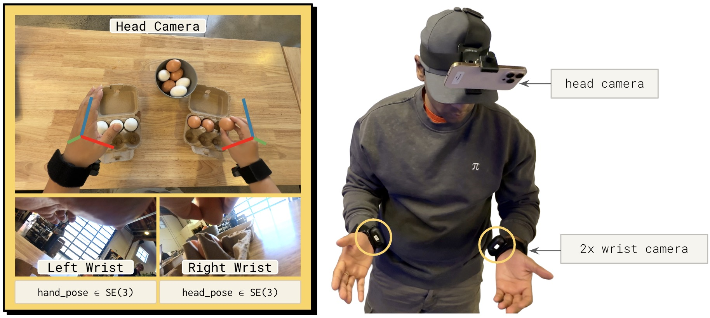

*图2：数据采集设备。人类采集者佩戴头戴式高清摄像头，可选佩戴腕部摄像头（左右手腕各一个），获取三个同步视频流。*

**采集设备**：
- 头戴式高清摄像头，记录第一人称视角
- 可选：腕部摄像头（左右手腕各一个），提供类似机器人 wrist camera 的视角
- 设计原则：尽量不干扰操作者，保证可扩展性

**数据处理流程**：

```
人类视频采集
    │
    ├─→ Visual SLAM → 头部摄像头 6D 位姿 e_t ∈ R^6（世界坐标系）
    │
    ├─→ 3D Hand Tracking → 双手 17 个关键点 h^{e_t}_t ∈ R^{3×17}（头部坐标系）
    │
    ├─→ 虚拟末端执行器位姿：
    │    取手掌 + 中指 + 无名指关键点 span 的 6-DoF 位姿
    │
    ├─→ 相对动作计算：
    │    a_i = 未来 i 步位姿相对于当前步 s_0 的相对变换
    │
    └─→ 语言标注：密集子任务描述（每只手臂的动作）
```

**动作空间对齐**：

| 组成部分 | 机器人数据 | 人类数据 |
|---------|-----------|---------|
| 左臂末端执行器 | 6-DoF + gripper | 6-DoF（无 gripper） |
| 右臂末端执行器 | 6-DoF + gripper | 6-DoF（无 gripper） |
| 底座移动 | 2 维 | 6 维（头部相机位姿投影） |
| **总维度** | **H × 16** | **H × 18** |

人类数据没有 gripper action（难以从手部关键点估计抓取开合程度），该维度完全依赖机器人数据学习。

### 2.3 训练混合比例

微调时，人类数据与"最近邻机器人任务"的数据按 **50:50** 比例混合。这样既保留模型原有能力，又引入人类数据中的新概念。

---

## 三、实验与结果

### 3.1 人类→机器人迁移基准测试

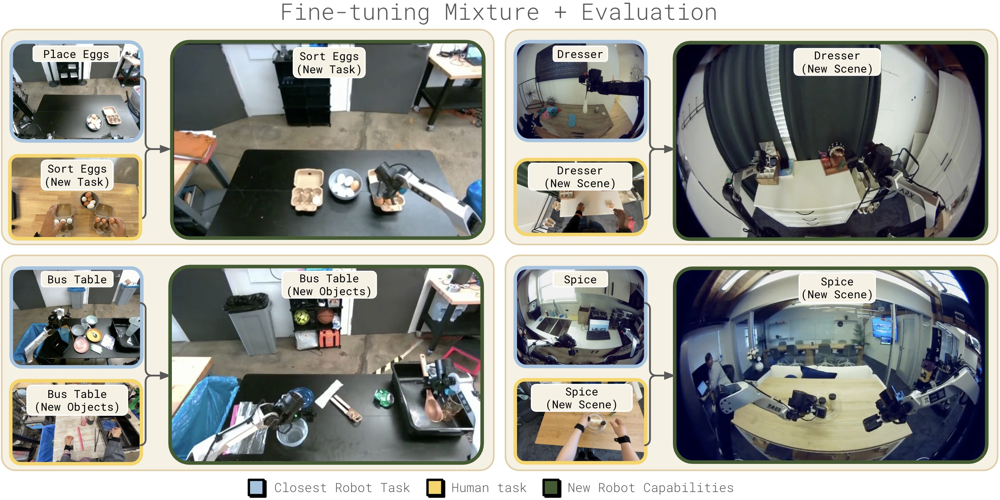

*图3：训练数据混合与基准测试。微调混合数据中人类数据和最近邻机器人任务数据各占一半。四个测试任务分别覆盖场景泛化（Spice 归类调味瓶到调料架、Dresser 归置首饰到梳妆台）、物体泛化（Bussing 清理桌上的厨房用具）和任务泛化（Sort Eggs 按颜色分拣鸡蛋到两个蛋盒）。每个任务中，人类数据引入了机器人数据中未曾见过的新概念。*

四个测试任务，分别测试三种泛化维度：

| 任务 | 泛化维度 | 机器人数据 | 人类数据引入 | 评分方式 |
|------|---------|-----------|------------|---------|
| **Spice** | 场景泛化 | 多个 Airbnb 厨房的调料架整理 | 未见厨房的人类操作 | 二值成功率 |
| **Dresser** | 场景泛化 | 多个 Airbnb 卧室的梳妆台整理 | 未见卧室的人类操作 | 二值成功率 |
| **Bussing** | 物体泛化 | 收拾桌上的垃圾和餐具 | 引入厨房工具等新物体 | 正确放置物品数 |
| **Sort Eggs** | 任务泛化 | 将鸡蛋放入蛋盒（无排序） | 按颜色将鸡蛋分到两个蛋盒 | 正确分类鸡蛋数 |

### 3.2 主要结果

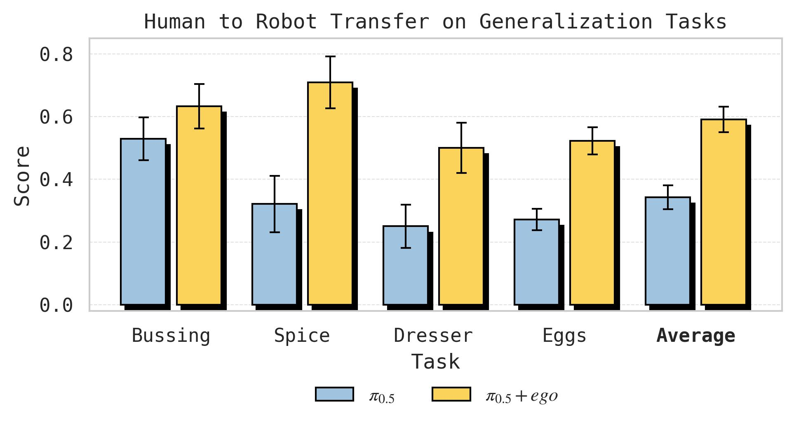

*图4：$\pi_{0.5}$ 人类→机器人迁移微调结果。在静态和移动任务套件中，每个任务分别测试仅出现在人类数据中的场景/物体/任务级泛化。三个泛化维度上均观察到显著的人类→机器人迁移，目标任务的分数接近翻倍。*

**子图 (a) Scene Transfer — Spice**：从 32% → 71%，提升 39 个百分点。引入人类数据后，机器人在未见厨房中将调味瓶正确放到调料架上的能力大幅提升。

**子图 (b) Scene Transfer — Dresser**：从 25% → 50%，成功率翻倍。人类数据帮助模型理解在陌生卧室中如何将项链放入首饰盒、发夹放入收纳盒。

**子图 (c) Object Transfer — Bussing**：从 53 → 63（归一化分数），提升约 19%。模型从人类数据中学会了处理训练时未见的厨房工具类物体。

**子图 (d) Task Transfer — Sort Eggs**：从 57% → 78% 分拣准确率，且平均多正确放置 4 个鸡蛋。纯机器人策略只会随机放鸡蛋，没有"排序"概念；加入人类排序视频后，模型学会了按颜色分类。

### 3.3 核心发现：迁移随预训练多样性涌现

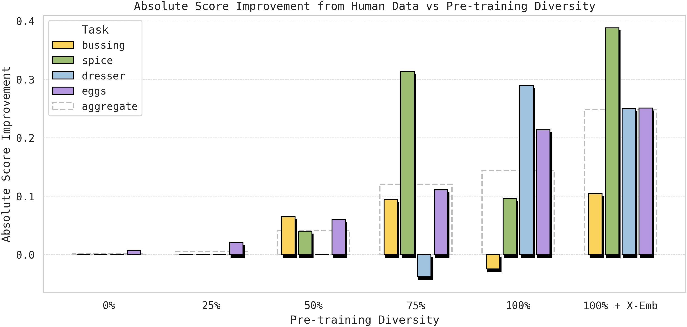

*图5：各任务从人类数据中获得的性能增益。纵轴表示使用人类数据微调与仅使用机器人数据微调之间的性能差异，即人类数据带来的"提升"。横轴表示不同的预训练多样性水平。随着预训练从 0%（仅 VLM）→ 100% + 跨形态数据，所有四个任务上人类数据带来的增益均显著增长，表明人类→机器人迁移是预训练多样性的涌现属性。*

**预训练初始化梯度**：
- **0%**：仅 VLM base 初始化（无机器人预训练）
- **25%/50%/75%/100%**：在越来越多的 [场景-任务] 组合上预训练的 VLA
- **100% + X-emb**：$\pi_{0.5}$ 完整预训练，额外包含跨多种机器人形态的数据

**关键观察**：
- 0% 和 25% 预训练时，人类数据基本无增益甚至负迁移
- 75% 和 100% 时，人类数据带来显著增益
- 100% + X-emb（跨形态预训练）进一步提升迁移效果

**每个任务的 Scaling 趋势**：

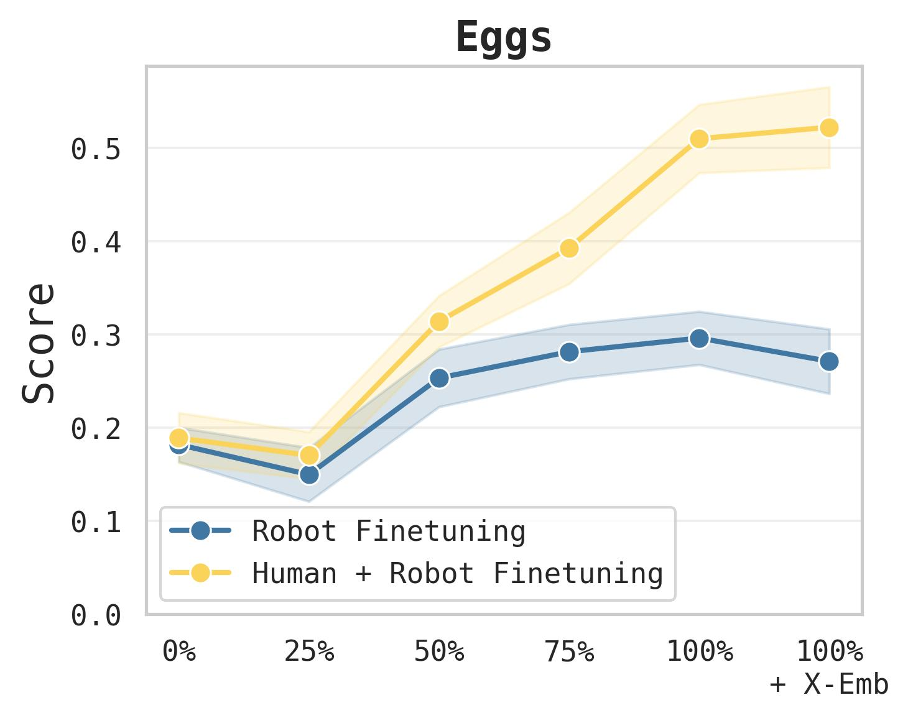

*图6：Sort Eggs 任务泛化性能随预训练多样性的变化。纯机器人微调的性能迅速饱和（蓝线），即使预训练多样性增加也无法获得排序能力——因为该任务在机器人数据中根本不存在。而人类+机器人联合微调（黄线）的性能随预训练多样性急剧上升，说明更广泛的预训练使模型能够更有效地从人类数据中迁移知识。*

- **Sort Eggs**：机器人-only 策略快速平台饱和——因为"排序"概念在机器人数据中从未出现。但 Human+Robot 策略随预训练多样性急剧上升，说明更广泛的预训练释放了从人类数据中迁移排序知识的能力。
- **Dresser**：50% 之前的预训练阶段，人类数据甚至产生负迁移；但 75% → 100% + X-emb 之间，人类数据带来持续的叠加增益。

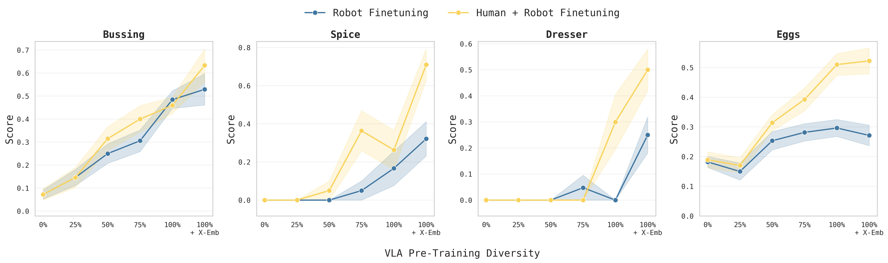

*图7：各任务完整 scaling 曲线。每个子图展示一个任务的机器人-only（蓝线）和人类+机器人（黄线）在不同预训练多样性下的性能。关键观察：(1) 部分任务中，预训练多样性增加并不提升 zero-shot 泛化（蓝线持平），但显著提升人类数据迁移效率（黄线上升）；(2) 在 Sort Eggs 中，蓝线完全无法获得排序能力，而黄线持续上升——说明预训练多样性的作用不是直接完成任务，而是增强从人类数据中吸收知识的能力。*

**一个反直觉的发现**：在某些区间（如 Spice 50%→75%，Dresser 75%→100%），zero-shot 泛化（蓝线）只略微提升甚至持平，但人类数据迁移（黄线）大幅增加。这说明**预训练多样性提升的不一定是模型"自己完成任务"的能力，而是模型"从新数据中学习"的能力**。

### 3.4 表征分析：Embodiment-Agnostic 表征随预训练涌现

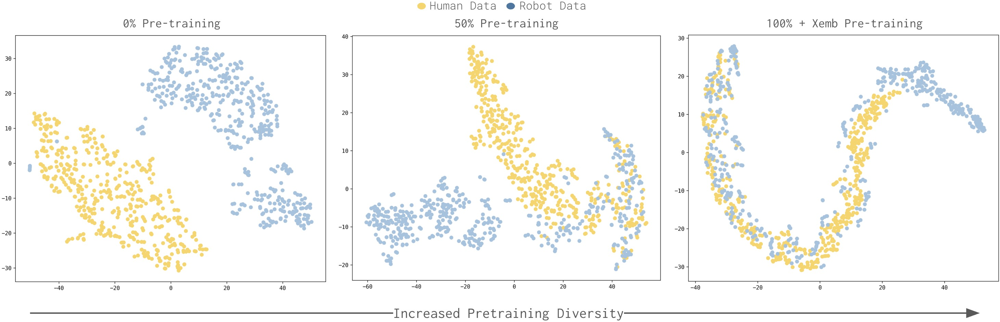

*图8：VLA 对人类和机器人数据的表征可视化。对 VLM backbone 最后一层的输出 token 做 mean-pool 后使用 t-SNE 降维可视化，蓝色点代表人类数据，红色点代表机器人数据。随着预训练多样性增加（从左到右），两类数据的表征从完全分离逐步趋于重叠，说明模型学会了构建跨 embodiment 的统一表征。*

**分析方法**：将人类和机器人观测分别输入联合微调后的 VLA，取前 200 个输出 embedding 做 mean-pool（大致对应"任务"语义），用 t-SNE 可视化。

**关键发现**：
- **无预训练（0%）**：人类和机器人表征完全分离——模型分别拟合两个分布
- **随预训练多样性增加**：表征逐渐融合、重叠，模型形成了 embodiment-agnostic 的统一表征
- 这与前人工作形成对比：之前的工作在小数据上发现 co-training 后表征仍然是分离的，需要额外设计对齐方法；本文发现在足够多样化的预训练后，**纯 co-training 就能产生对齐的表征**

### 3.5 人类数据 vs 其他机器人数据

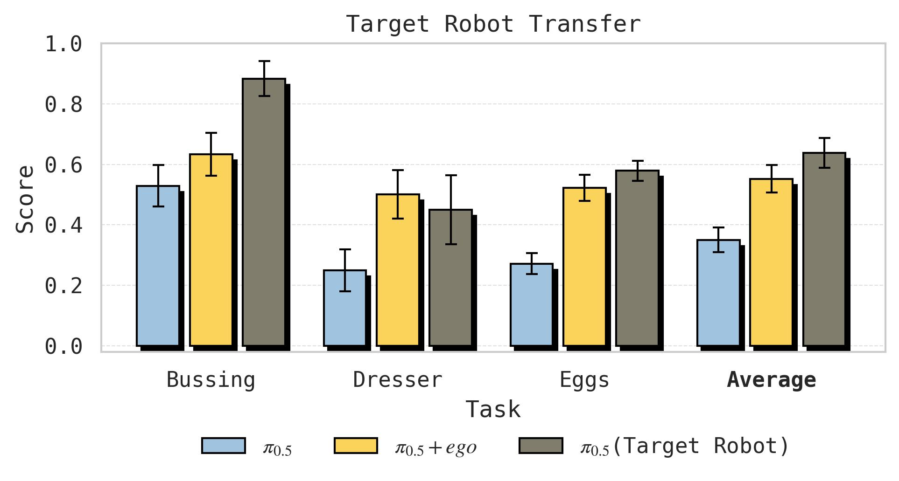

*图9：人类数据（黄色）与目标机器人数据（灰色）对比。对于 Sort Eggs 和 Dresser，使用人类数据微调的效果与使用目标机器人自身数据的差距很小；对于 Bussing，目标机器人数据明显优于人类数据（65% vs 25% 增益）。这说明人类数据的迁移效率因任务而异，细粒度操作任务中人类与机器人之间的显式形态差异可能造成更大的迁移损失。*

- **Sort Eggs 和 Dresser**：人类数据几乎达到了 target robot data（在目标机器人上采集同任务的演示数据）的效果
- **Bussing**：target robot data 远超人类数据（增益 65% vs 25%），说明某些任务中人类和机器人的物理差异导致的迁移损失更大

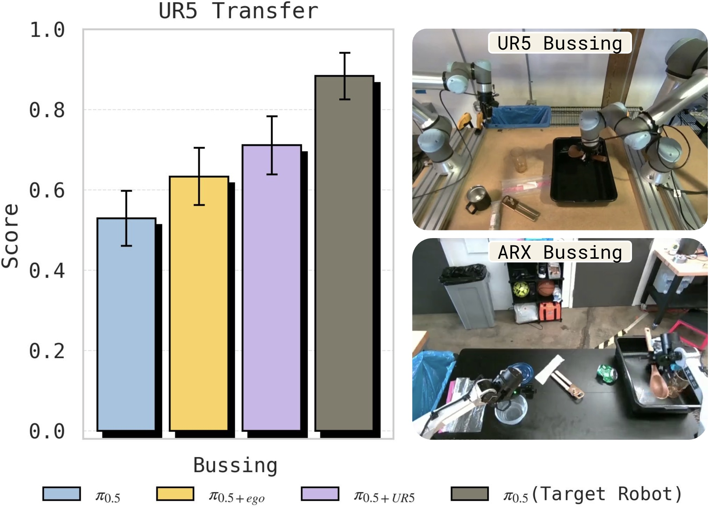

*图10：Bussing 任务上人类数据与 UR5→ARX 跨形态机器人迁移对比。两者都在基线之上带来了提升，但也都未达到目标机器人数据的水平，表明人类→机器人迁移与跨形态机器人→机器人迁移具有相似的性质。*

在 Bussing 任务上，收集 UR5 机器人的 400 条演示（7.45 小时）并迁移到 ARX 机器人。人类→ARX 与 UR5→ARX 的迁移趋势相似——都超过基线但都不及 target robot data——说明**人类数据迁移与跨形态机器人迁移本质上是同一类问题**。

### 3.6 迁移发生在哪个层次？

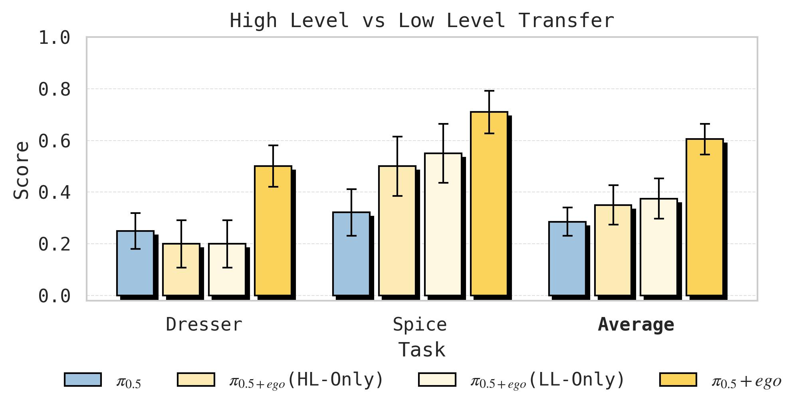

*图11：高层子任务预测（HL）与低层动作预测（LL）的迁移消融。对 Spice 和 Dresser 两个移动任务，分别测试四种组合：纯机器人 HL+LL、人类 HL + 机器人 LL、机器人 HL + 人类 LL、人类 HL+LL。结果表明仅在一个层次上使用人类数据效果有限，同时在 HL 和 LL 上使用人类数据效果最优，说明迁移同时发生在语义理解和动作执行两个层面。*

**四种条件消融**：
1. Robot-only HL + Robot-only LL（全部机器人数据）
2. Co-trained HL + Robot-only LL（人类数据仅用于高层）
3. Robot-only HL + Co-trained LL（人类数据仅用于低层）
4. Co-trained HL + Co-trained LL（人类数据同时用于两层）

**发现**：
- **仅 HL 迁移**：低层策略不理解新的高层指令（如 "pick up the spice bottle" 被误解为捡起已经在托盘上的瓶子）
- **仅 LL 迁移**：高层策略产生错误的指令（如一直重复 "pick up spice bottle" 即使瓶子已被拿起）
- **HL + LL 联合**：效果最佳，说明人类数据的价值同时体现在语义理解和动作执行两个层面

### 3.7 腕部摄像头的消融

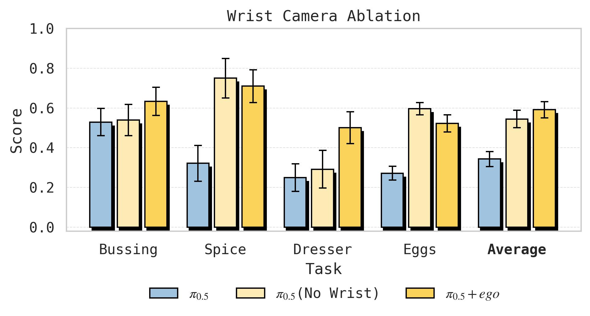

*图12：人类佩戴腕部摄像头的消融实验。Bussing 和 Dresser 从腕部摄像头中获益明显——这些任务涉及需要近距离观察手部交互的精细操作；Spice 和 Sort Eggs 则基本不受影响，这些任务对手部细节的依赖较低。结果支持"应保留腕部摄像头以最大化任务覆盖范围"的结论。*

发现因任务而异：
- **Bussing 和 Dresser**：腕部摄像头有显著增益——这些任务依赖对手部交互的近距离观察
- **Spice 和 Sort Eggs**：腕部摄像头几乎无影响——这些任务对腕部视角的依赖较低
- **建议**：采集人类数据时保留腕部摄像头，以最大化任务覆盖范围

---

## 四、关键洞察与技术亮点

1. **涌现性（Emergence）是本文最核心的概念**：人类→机器人迁移不是通过设计更好的对齐算法实现的，而是通过扩大预训练数据的多样性——场景数、任务数、机器人形态数——自然涌现的。这为"不需要花哨方法，只需要更多样化的数据"提供了强有力的实证。

2. **Embodiment-Agnostic 表征**：t-SNE 可视化提供了机制层面的解释——多样化预训练使模型学会将不同形态的观测映射到共享的表征空间，这是迁移得以发生的根本原因。

3. **人类数据作为"又一个 embodiment"**：相比之前工作中复杂的对齐方法，本文的极简配方（相同目标、相同 pipeline、50:50 混合）既优雅又有效，体现了"let the model figure it out" 的设计哲学。

4. **"学习能力"比"任务能力"更重要**：某些情况下预训练多样性不提升 zero-shot 性能，但提升从人类数据中学习的能力——这是一种元能力的提升。

5. **迁移发生在两个层次**：高层语义理解（子任务预测）和低层动作执行（轨迹预测）都从人类数据中获益，且两者互补——只迁移一个层次会导致策略失调。

---

## 五、局限性

1. **数据规模有限**：人工采集数据仅 10 小时级别（每任务 3–5 小时），且是 episodic 式的重复演示。如何利用被动收集的大规模日常人类活动数据仍是开放问题。
2. **没有 gripper action**：人类数据无法提供抓取力度/开合程度的信息，这些必须从机器人数据中学习。
3. **任务种类有限**：仅测试了 4 个 task，虽然覆盖了三个泛化维度，但能否推广到更多样化的操作任务仍需验证。
4. **没有代码开源**：无法直接复现和扩展。

---

## 六、关键概念速查

| 概念 | 简要说明 |
|------|---------|
| **VLA (Vision-Language-Action)** | 基于 VLM 的机器人策略模型，输入视觉+语言，输出动作 |
| **Co-training** | 多个数据源（如人类+机器人）使用统一目标联合训练 |
| **Embodiment-Agnostic** | 与具体机器人/人类形态无关的表征 |
| **FAST tokens** | 离散化动作 token，将连续动作空间分桶，通过 next-token prediction 训练 |
| **Flow Matching** | 连续动作预测的生成式目标，学习从噪声到动作分布的 flow |
| **Subtask Prediction** | 预测当前应该执行的原子操作的语言描述，类似 Chain-of-Thought |
| **Cross-Embodiment Transfer** | 知识在不同机器人形态间迁移，本文将人类视为一种"形态" |
| **Emergence** | 某种能力在达到一定规模/多样性后突然出现，而非逐步增长 |
