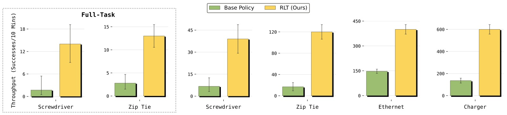
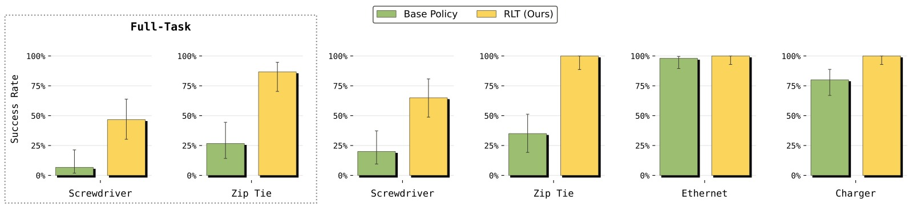
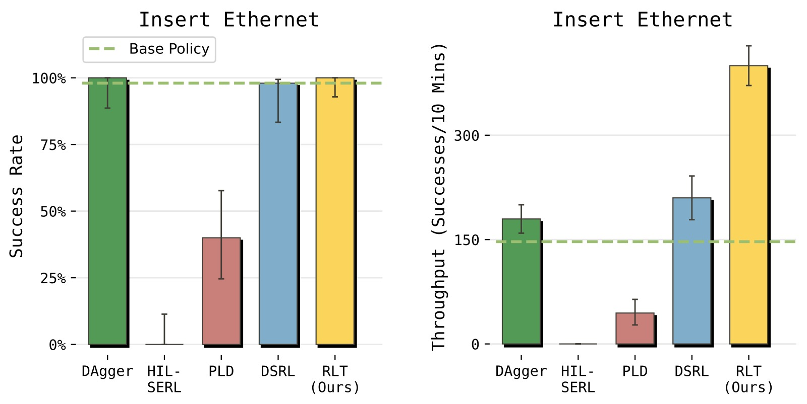
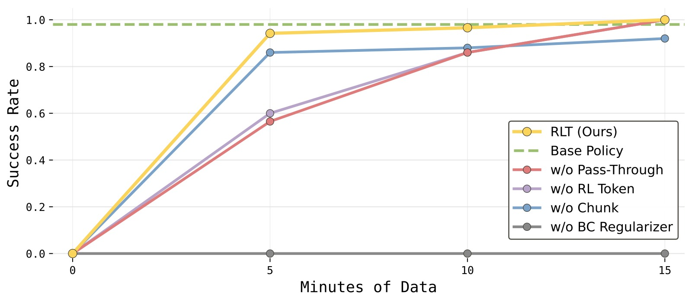

# RL Token: Bootstrapping Online RL with Vision-Language-Action Models

> **论文信息**
> - 作者：Charles Xu, Jost Tobias Springenberg, Michael Equi, Ali Amin, Adnan Esmail, Sergey Levine, Liyiming Ke
> - 机构：Physical Intelligence
> - 通讯作者：Liyiming Ke
> - 投稿方向：RSS (under review)
> - arXiv ID：2604.23073
> - 代码：未公开
> - 基础模型：π_{0.6}

---

## 一、核心问题

VLA（Vision-Language-Action）模型虽然能从大规模数据中学习多样化的操作技能，但在执行精度要求极高的任务时，往往在"最后一毫米"出现问题：动作偏慢、需要反复尝试和停顿、关键阶段的微小误差累积导致失败。一个自然的解决方案是用强化学习（RL）对 VLA 进行微调——让机器人在目标任务上"练习"，自动改进最关键的环节。

然而，**现实世界中的 RL 微调面临两难**：

1. **全模型 RL 方法**（如 PPO 微调整个 VLA）：计算和样本效率太低，难以在几小时内产生可用的改进策略。
2. **轻量级 RL 方法**（如 SERL、RL^100）：训练小模型效率高，但丢弃了 VLA 的泛化能力和行为先验，需要从零探索。

**核心挑战**：如何在保持 VLA 泛化能力的同时，实现轻量级在线 RL 的速度和样本效率？

---

## 二、核心思路 / 方法

### 2.1 总体思路：分工协作

论文提出 **RLT（Reinforcement Learning from RL Token）**，核心思想是让 VLA 和 RL 各司其职：

- **冻结的 VLA**：提供广泛的感知理解、行为先验（参考动作）和紧凑的状态表示。
- **轻量级 actor-critic**：在 VLA 提供的基础上，通过在线 RL 对动作进行局部精调。

> 在线 RL 不再是"从零开始的高维动作空间搜索"，而是**在 VLA 已有行为基础上的局部优化**。

*图1：RLT 方法总览。方法分为两个阶段：(a) **RL Token 训练阶段**——在 VLA 内部添加一个 encoder-decoder 模块，训练出一个紧凑的 RL Token 表示（绿色），该 token 从 VLA 的中间层特征中提取任务相关信息；(b) **在线 RL 阶段**——冻结 VLA 和 RL Token，仅训练一个轻量级的 actor 和 critic 网络。Actor 接收 RL Token + 本体感知状态 + VLA 参考动作，输出精调后的 action chunk。Critic 评估当前状态-动作对的价值。整个 RL 过程只需几小时的真实机器人训练。*

### 2.2 RL Token：压缩 VLA 知识为紧凑表示

直接使用 VLA 的全量高维特征做 RL 状态表示是不可行的——参数太多、维度太高。RLT 引入一个 **encoder-decoder 结构**来训练一个紧凑的"RL Token"表示。

**具体做法**：

1. 获取 VLA 最后一层的所有 token embeddings $\mathbf{z}_{1:M}$（包括图像、语言、本体感知等 token）
2. 在序列末尾追加一个可学习的 `<rl>` token embedding $\mathbf{e}_\texttt{rl}$
3. 通过一个轻量级 encoder transformer $g_\phi$ 处理整个序列，取 `<rl>` 位置的输出 $\mathbf{z}_{\text{rl}}$ 作为 RL Token
4. 用一个 decoder transformer $d_\phi$ + 线性投影 $h_\phi$，以自回归方式从 $\mathbf{z}_{\text{rl}}$ 重建原始 token embeddings
5. 通过最小化重建误差（MSE）训练 encoder-decoder，$\mathbf{z}_{\text{rl}}$ 成为一个信息瓶颈

$$\mathcal{L}_{\text{ro}} = \mathbb{E}_{\mathcal{D}}\left[ \sum_{i=1}^{M} \left\| h_\phi(d_\phi([\mathbf{z}_{\text{rl}},\,\bar{\mathbf{z}}_{1:i-1}]))_i - \bar{\mathbf{z}}_i \right\|^2 \right]$$

其中 $\bar{\mathbf{z}}_i = \mathrm{sg}(\mathbf{z}_i)$ 表示对 VLA embeddings 做 stop-gradient。

*图2：RL Token 提取的详细架构。左半部分展示 VLA 的标准流程：多相机图像 + 语言指令 → VLM Backbone → Action Expert（扩散模型）→ 生成 action chunk。右半部分展示 RL Token 的 encoder-decoder 训练：从 VLA backbone 输出的 token embeddings 经过一个 encoder transformer，在 `<rl>` token 位置输出压缩表示 $\mathbf{z}_{\text{rl}}$（即 RL Token）；decoder 再以自回归方式从 RL Token 重建原始 token 序列。这个 bottleneck 设计迫使 RL Token 保留任务关键信息，同时维度远小于原始 VLA 特征，使得下游 RL 可以高效进行。*

**关键设计意图**：
- Encoder-decoder 的瓶颈结构迫使 RL Token 保留任务关键信息
- 训练在小规模任务演示数据上进行，可与 VLA 的 SFT 联合训练
- 训练完成后冻结，RL Token 维度远小于原始 VLA 特征，适合轻量 RL

### 2.3 在线 RL：在 VLA 参考动作上精调

在线 RL 阶段，VLA 和 RL Token 均被冻结，只训练轻量级的 actor $\pi_\theta$ 和 critic $Q_\psi$。

**状态表示**：$\mathbf{x} = (\mathbf{z}_\text{rl}, \mathbf{s}^\text{p})$，即 RL Token + 本体感知状态（关节角度、末端位姿等）。

**Action Chunk**：RL 策略操作在 action chunk $\mathbf{a}_{t:t+C-1} \in \mathbb{R}^{C \times d}$ 上，其中 $C=10$（vs VLA 的 $H=50$）。更短的 chunk 使策略更具反应性，同时缩短了 TD 学习的有效 horizon。

**Actor 设计**——四个关键组件：

**① 参考动作条件化（Reference Action Pass-Through）**：
Actor 不直接从状态生成动作，而是接收 VLA 采样的参考动作 chunk $\tilde{\mathbf{a}}_{1:C}$ 作为额外输入：

$$\pi_\theta(\mathbf{a}_{1:C} \mid \mathbf{x}, \tilde{\mathbf{a}}_{1:C}) = \mathcal{N}(\mu_\theta(\mathbf{x}, \tilde{\mathbf{a}}_{1:C}), \sigma^2 \mathbf{I})$$

这使 RL 成为"在 VLA 建议上的编辑"，而非从零生成。同时保留了 VLA 多模态动作分布中的模式信息。

**② BC 正则化（Policy Regularization）**：
Actor 的训练目标不仅最大化 Q 值，还增加了一个 L2 正则化项，惩罚偏离 VLA 参考动作：

$$\mathcal{L}_{\pi}(\theta) = \mathbb{E}\left[ -Q_\psi(\mathbf{x}, \mathbf{a}_{1:C}) + \beta \|\mathbf{a}_{1:C} - \tilde{\mathbf{a}}_{1:C}\|_2^2 \right]$$

这类似于 KL-regularized RL，将在线 RL 转化为"围绕 VLA 动作分布的局部优化"，避免无约束探索导致的不稳定。

**③ 参考动作 Dropout**：
为防止 actor 偷懒直接复制参考动作，训练时随机将 50% 样本的参考动作替换为零向量。这迫使 actor 保持独立的动作生成能力，同时有参考时仍可利用 VLA 的先验。

**④ Critic 训练**：使用标准 TD3 风格的 off-policy TD 学习，在 action chunk 级别进行价值估计。

### 2.4 完整系统：两阶段训练 + 关键阶段聚焦

**训练流程**：

1. **RL Token 预训练**：在任务特定演示数据上训练 encoder-decoder，同时可选地 SFT 微调 VLA。
2. **Warmup**：用 VLA 基策略收集少量 episode 预填充 replay buffer。
3. **在线 RL 循环**：
   - 收集经验（VLA 参考动作 → actor 精调 → 执行）
   - 可选的人工干预（遥操作接管，覆盖 actor 输出）
   - 异步 off-policy 更新（更新数据比 5:1）
4. **关键阶段聚焦（Critical Phase Focus）**：人工指定任务中精度要求最高的阶段，RL 仅在该阶段激活，其余部分由 VLA 基策略完成。

---

## 三、训练目标

总结上述，RLT 有三个训练目标：

| 阶段 | 损失函数 | 训练参数 |
|------|---------|---------|
| RL Token 预训练 | $\mathcal{L}_{\text{ro}}$ — 自回归重建 MSE | Encoder-decoder $\phi$（可选 + VLA $\theta_{\text{vla}}$） |
| Critic 训练 | $\mathcal{L}_Q$ — TD 误差 MSE（TD3 风格，双 Q 网络） | Critic $\psi$ |
| Actor 训练 | $\mathcal{L}_\pi = -Q + \beta\|\mathbf{a} - \tilde{\mathbf{a}}\|^2$ | Actor $\theta$ |

---

## 四、实验与结果

### 4.1 任务设置

在四个真实机器人操作任务上评估，每个任务都有一处对精度要求极高的"关键阶段"：

| 任务 | 难度特征 | 关键阶段时长 |
|------|---------|------------|
| **螺丝安装** (Screw Installation) | 亚毫米对齐，电动螺丝刀，力控 | 5–20s |
| **扎带紧固** (Zip Tie Fastening) | 双手协调，可变形物体，毫米精度 | 5–20s |
| **以太网插入** (Ethernet Insertion) | 精确位置+角度对齐，接触动力学 | 5–20s |
| **充电器插入** (Charger Insertion) | 厘米级对齐，插脚不可见 | 5–20s |

*图3：四个实验任务的示意。(顶部) 螺丝安装——机器人用电动螺丝刀将 M3 螺丝拧入螺纹座；(中上) 扎带紧固——双手将扎带尾部穿入锁定槽；(中下) 以太网插入——将 RJ45 连接器插入嵌入式端口；(底部) 充电器插入——将充电器对准并插入电源插排。每个任务都包含一个精度要求极高的关键阶段，也是 VLA 基策略最容易减速或失败的环节。*

### 4.2 Q1：RLT 是否提升了 VLA 基策略？

**是的**。RLT 在所有四个任务的关键阶段都实现了显著提升：

- **充电器和以太网**（基策略已较好）：速度提升约 **3×**
- **螺丝安装**（基策略较弱）：成功率从 **20% → 65%**
- **扎带紧固**：成功率大幅提升
- **全任务评估**（包含抓取、搬运等前置阶段）：成功率提升 **40%（螺丝）** 和 **60%（扎带）**

*图4：RLT 对 VLA 基策略吞吐量的提升。横轴展示四个任务（螺丝安装→扎带紧固→以太网插入→充电器插入），纵轴为每 10 分钟成功完成次数（Throughput）。蓝色柱为 VLA 基策略，橙色柱为 RLT 策略。(a) 螺丝安装：VLA 基策略吞吐极低（接近 0），RLT 显著提升了成功完成频率；(b) 扎带紧固：类似趋势，RLT 大幅超越基策略；(c) 以太网插入：基策略已有一定成功率，RLT 在此基础上进一步提升吞吐；(d) 充电器插入：基策略吞吐适中，RLT 仍实现了显著改善。整体来看，任务难度越高（基策略越差），RLT 的相对增益越明显。*

*图5：RLT 对 VLA 基策略成功率的提升。横轴为四个任务，纵轴为成功率（Success Rate）。(a) 螺丝安装：基策略约 20%，RLT 提升至约 65%；(b) 扎带紧固：基策略约 50%，RLT 提升至约 80%；(c) 以太网插入：基策略已达约 95%+ 的高成功率，RLT 保持高成功率的同时大幅提升速度（见图 4）；(d) 充电器插入：类似以太网，基策略成功率较高，RLT 维持甚至略有提升。关键结论：对于基策略已能胜任的任务，RLT 在保成功的同时提速；对于基策略困难的任务，RLT 同时提升成功率和速度。*

### 4.3 Q2：RLT 与其他 RL 方法对比如何？

在以太网任务上对比四种基线方法：

*图6：RLT 与四种基线方法在以太网任务上的对比。横轴为不同方法（Base VLA → HIL-SERL → PLD → DSRL → Dagger → RLT），纵轴为归一化吞吐量。(a) **Base VLA**：基策略吞吐量作为参考基线；(b) **HIL-SERL**：单步 RL 方法，在 50Hz 高频控制 + 稀疏奖励下完全无法学习，吞吐量接近 0——因为数百步的 horizon 使价值函数无法有效传播奖励信号；(c) **PLD（Probe-Learn-Distill）**：同为单步 residual RL，表现也很差；(d) **DSRL**：在扩散噪声空间中学习的 RL，成功率高但吞吐量显著低于 RLT——因为其策略被强力约束在 VLA 的扩散分布内，无法探索出更快的策略；(e) **DAgger**：模仿学习方法，成功率高但速度受限于人类演示速度；(f) **RLT（本方法）**：成功率和基策略持平，同时将完成步数减少约 2×（即速度翻倍）。关键结论：单步 RL 方法在长 horizon 任务上失效；约束过强的 RL 方法（DSRL）改善有限；RLT 通过 action chunk + BC 正则化 + 参考动作条件化实现了速度与成功率的双赢。*

- **HIL-SERL & PLD**（单步 RL）：在 50Hz、数百步 horizon、稀疏奖励的设定下**完全失败**。
- **DSRL**（扩散噪声空间 RL）：成功率高，但速度提升远不如 RLT——策略被约束在 VLA 的扩散分布内。
- **DAgger**（模仿学习）：成功率高，但速度受限于人类演示速度。
- **RLT**：成功率与基策略持平，速度翻倍（完成步数减半）。

### 4.4 Q3：各组件的消融贡献

在以太网任务上的消融实验（关键阶段）：

*图7：以太网任务上各组件的消融实验——吞吐量学习曲线。横轴为训练时长（分钟），纵轴为每 10 分钟吞吐量。五条曲线分别对应：(1) **RLT (Full)**——绿色，吞吐量最高且学习最快，仅需约 5 分钟数据即超越替代方案；(2) **w/o Pass-Through**——浅蓝色，去除参考动作条件化，学习速度明显变慢，训练过程中经历更多失败，但最终达到接近 RLT 的吞吐量；(3) **w/o RL Token**——紫色，将 RL Token 替换为 ImageNet 预训练的 ResNet-10，吞吐量降低约 50%，直接证明 RL Token 编码了操作相关的结构化信息；(4) **w/o BC Regularizer**——红色，去除 VLA 正则化项（β=0），性能下降最大，因 actor 失去行为锚定后需在完整动作空间中盲目探索；(5) **w/o Chunk**——橙色，单步 action（C=1），同样表现很差，因为有效 horizon 变长使 TD 学习的信用分配变得极其困难。*

*图8：消融实验——成功率学习曲线。横轴为训练时长（分钟），纵轴为成功率。(1) **RLT (Full)**——快速匹配 VLA 基策略的高成功率，同时提升吞吐量；(2) **w/o Pass-Through**——成功率学习较慢，训练过程中有更多失败；(3) **w/o RL Token**——成功率提升缓慢；(4) 其他消融的成功率均不理想。关键结论：四个组件（RL Token、action chunk、BC 正则化、参考动作条件化）对最终性能都有正向贡献，缺一不可。*

| 消融项 | 效果 |
|--------|------|
| **w/o RL Token**（替换为 ResNet-10） | 吞吐量下降 **50%** |
| **w/o Chunk**（单步 action） | 显著下降——horizon 过长，TD 学习失效 |
| **w/o BC Regularizer**（β=0） | **性能下降最大**——无约束探索导致崩溃 |
| **w/o Pass-Through**（不输入参考动作） | 学习变慢，训练中更多失败，最终可追平 |

### 4.5 Q4：RLT 是否产生了更优的策略？

最有趣的结果在以太网任务上：

*图9：以太网任务关键阶段的速度分布直方图。横轴为 episode 长度（步数，越短越快），纵轴为密度。三组分布：(1) **绿色（Teleoperated Demos）**——人类遥操作演示的速度分布；(2) **蓝色（Base VLA）**——基策略的速度分布，整体偏右（更慢），有明显长尾，反映 VLA 在接近端口时的"试探-后撤-重试"行为模式；(3) **黄色（RLT Policy）**——RLT 策略的速度分布，整体显著偏左（更快），分布更集中。最惊人的发现是：**RLT 的一半 episode 比所有人类遥操作演示都快**（黄色分布左半部分在绿色分布最小值左侧）。VLA 基策略通常在接近端口时"试探→后撤→调整→重试"（probing behavior），而 RLT 学会了"对准即插"的流畅动作，甚至失败时也会施加压力并轻微摇动连接器利用机械柔顺性——这种行为在演示数据中完全不存在，纯粹由在线 RL 探索发现。*

- **VLA 基策略**：接近端口时表现出"试探→后撤→调整→重试"行为，偶尔循环多次。
- **RLT 策略**：接近端口→一次性流畅插入。甚至失败时也会施加压力并轻微摇动连接器，利用机械柔顺性实现插入。
- **惊人发现**：RLT 策略在关键阶段的一半 episode **比所有人类遥操作演示都快**。这种"摇动插入"的策略在演示数据中不存在，完全是 RL 探索发现的涌现行为。

---

## 五、关键洞察与技术亮点

1. **"RL Token" 作为 VLA-RL 接口**：通过 encoder-decoder 的信息瓶颈训练，从 VLA 高维特征中提取紧凑、任务相关的表示。对比直接用 ResNet-10，RL Token 的吞吐量高出 50%。

2. **Action Chunk 缩短有效 horizon**：在 50Hz 控制频率下，$C=10$ 的 action chunk 将 250-1000 步的关键阶段 horizon 缩短到 25-100 个决策步，使 TD 学习的信用分配成为可能。单步方法在同样设定下完全失效。

3. **"局部精调"优于"无约束探索"**：BC 正则化 + 参考动作条件化将 RL 转化为 VLA 行为的局部优化。消融实验证明，去除 BC 正则化是性能损失最大的单因素。

4. **参考动作 Dropout**：简单但有效的技巧——训练时随机 50% 丢弃参考动作，既防止 actor 偷懒复制，又在推理时保留 VLA 指导。

5. **涌现行为**：RL 不仅提速，还发现了演示数据中不存在的新策略（如摇动连接器利用柔顺性），证明 RL 的价值不在于模仿人类，而在于通过试错发现更优解。

6. **关键阶段聚焦**：将 RL 限制在任务中精度要求最高的阶段，其余部分由 VLA 基策略处理。这大大降低了 RL 的搜索空间和训练难度。

---

## 六、局限性

- **依赖人工监督**：训练过程中需要人工提供 success/failure 标签、干预纠正、以及切换基策略/RL 策略的时机。部分环节可以自动化（如奖励模型和进度预测）。
- **RL Token 的任务特异性**：目前 RL Token 在任务特定数据上训练，跨任务和跨机器人平台的迁移能力未验证。
- **尚未闭环**：RL 收集的高质量数据尚未用于改进 VLA 本身——一个自然的方向是将 RL 数据蒸馏回 VLA（data flywheel）。
- **关键阶段需人为指定**：目前需要人工划定哪些阶段由 RL 接管。

---

## 七、关键概念速查

| 概念 | 说明 |
|------|------|
| **RLT** | Reinforcement Learning from RL Token |
| **RL Token** | 通过 encoder-decoder 瓶颈从 VLA 特征中提取的紧凑表示 |
| **Action Chunk** | 一次预测多步动作（$C=10$），缩短有效 horizon |
| **Reference Action Pass-Through** | Actor 接收 VLA 采样的参考动作作为额外输入 |
| **BC Regularizer** | L2 正则化惩罚 RL 动作偏离 VLA 参考动作 |
| **Reference Action Dropout** | 训练时随机 50% 零化参考动作，防止 actor 偷懒 |
| **Critical Phase** | 任务中精度要求最高、VLA 最容易失败的阶段 |
| **π_{0.6}** | Physical Intelligence 的 VLA 基础模型 |
| **TD3** | Twin Delayed DDPG，双 Q 网络 + 延迟策略更新 |
| **Off-policy RL** | 可从任意策略产生的数据中学习，关键于样本效率 |
