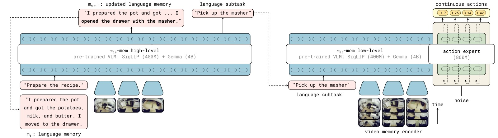
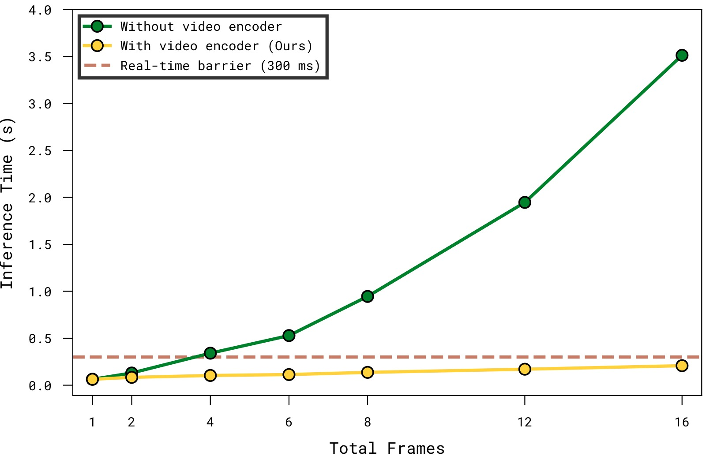
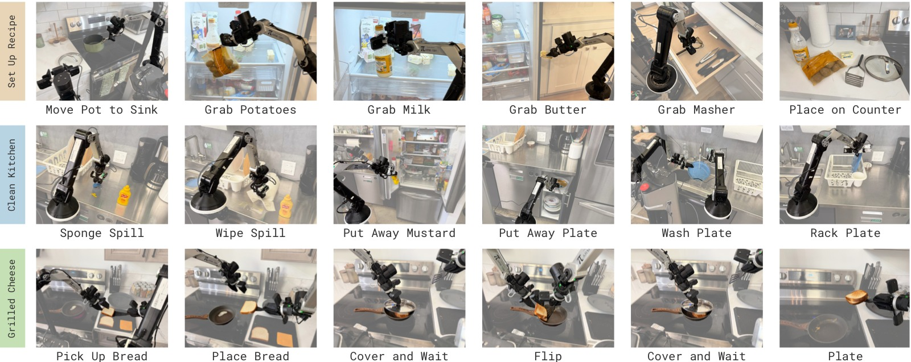
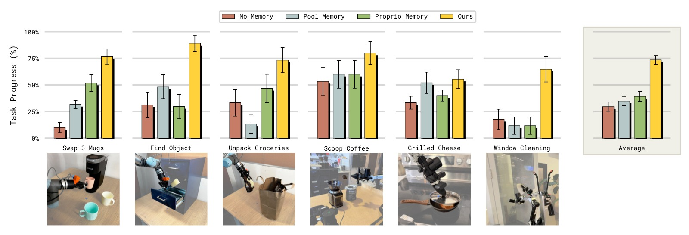

# MEM: Multi-Scale Embodied Memory for Vision Language Action Models

> **论文信息**
> - 作者：Marcel Torne*, Karl Pertsch*, Homer Walke, Kyle Vedder, Suraj Nair, Brian Ichter, Allen Z. Ren, Haohuan Wang, Jiaming Tang, Kyle Stachowicz, Karan Dhabalia, Michael Equi, Quan Vuong, Jost Tobias Springenberg, Sergey Levine, Chelsea Finn, Danny Driess
> - 通讯作者：Danny Driess（Physical Intelligence）
> - 机构：Physical Intelligence, Stanford University, UC Berkeley, MIT
> - arXiv ID：2603.03596v2
> - 项目页面：https://pi.website/research/memory
> - 代码：未公开

---

## 一、核心问题

机器人策略在执行长周期（long-horizon）任务时需要记忆能力，但这涉及多个时间尺度的不同需求：

- **短期记忆**（秒级）：处理遮挡、理解场景动态、快速调整操作策略（如抓取失败后换一种方式）
- **长期记忆**（分钟级）：跟踪任务进度，记住"已经完成了哪些步骤"这种语义信息

传统做法是将过去观测序列直接输入策略，但对于跨越数十分钟的任务，这会导致计算量和推理延迟爆炸。更重要的是，长期和短期记忆对"表示形式"的需求根本不同——前者需要稠密的视觉信息，后者只需要少数几个 bit 的语义信息。

**核心挑战：如何用异构的表示形式高效地赋予 VLA（Vision Language Action Model）多尺度记忆能力？**

---

## 二、核心思路 / 方法

MEM 提出了一种**混合模态记忆架构**，将记忆分解为两个互补的组件：

### 2.1 整体架构

*图1：MEM 记忆系统的整体架构。MEM 为 VLA（如 π₀.₆）配备长周期记忆，包含两个关键组件：(1) 高层策略（High-Level Policy）通过更新**语言记忆** $m_t$ 来跟踪长周期的语义事件（左侧），(2) 低层策略（Low-Level Policy）使用基于短期观测的记忆，通过**视频编码器**高效编码（右侧）。*

MEM 将动作预测分解为两级策略：

$$\pi(a_{t:t+H}, l_{t+1}, m_{t+1} | o_{t-T:t}, m_t, g) \approx \pi_\text{LL}(a_{t:t+H} | o_{t-K:t}, l_{t+1}, g) \cdot \pi_\text{HL}(l_{t+1}, m_{t+1} | o_t, m_t, g)$$

- **高层策略 $\pi_\text{HL}$**：基于当前观测和语言记忆 $m_t$，输出子任务指令 $l_{t+1}$ 和更新后的语言记忆 $m_{t+1}$
- **低层策略 $\pi_\text{LL}$**：基于近期观测序列（$K \ll T$ 帧）和子任务指令，输出连续动作 chunk

关键创新：高层策略不仅输出子任务指令，还**同时预测更新后的语言记忆 $m_{t+1}$**，模型主动决定何时以及如何更新记忆。

### 2.2 语言记忆（Language Memory）— 长期

语言记忆 $m_t$ 是对过去语义事件的摘要。模型被训练为在收到新观测后更新摘要，例如：

> $m_t$: `I placed a plate in the cabinet and moved to the counter.`
> ↓
> $m_{t+1}$: `I placed a plate in the cabinet, moved to the counter, and picked up a bowl.`

**训练数据生成**：给定带有子任务语言标注 $l_{0:T}$ 的机器人 episode，将子任务指令和成功/失败标记传给预训练 LLM，让 LLM 总结与未来任务执行相关的信息。LLM 被指示在适当时**删除或压缩**信息（例如，"把浅绿色碗、深蓝色碗和亮黄色碗放进右上柜子" → "把三个碗放进了右上柜子"）。压缩有助于保持语言记忆简洁（推理更快），并减少训练-推理的分布偏移。

### 2.3 视频编码器（Video Encoder）— 短期

*图2：高效视频编码器架构。在标准 ViT 中，每隔 4 层插入时间注意力——白色箭头表示空间注意力（每个观测帧内部），黑色箭头表示因果时间注意力（跨观测帧）。上层丢弃过去时间步的 token，第 0 帧的输出表示压缩了整个历史信息。因子化的空间-时间注意力将计算复杂度从 $\mathcal{O}(n^2K^2)$ 降低到 $\mathcal{O}(Kn^2 + nK^2)$。*

视频编码器的核心设计：

1. **空间-时间分离注意力**：标准 ViT 每 4 层插入因果时间注意力，注意力被分离为独立的空间注意力和时间注意力操作
2. **Token 压缩**：上层丢弃过去时间步的 patch token，仅保留当前帧的输出传给 VLA backbone，使 token 数与非记忆 VLA 保持一致
3. **零新参数**：不引入新的可学习参数，仅修改注意力模式和添加固定的正弦时间位置编码
4. **初始化兼容**：支持从预训练 VLM 的 ViT 权重初始化，当 $K=1$（单帧）时与原始 VLM 完全等价

*图3：推理延迟随输入帧数增长。简单将多帧观测逐帧编码传入 VLA backbone 会迅速导致推理延迟超出实时阈值（虚线）。横轴为观测帧数，纵轴为推理延迟（ms），数据在 π₀.₆ VLA 上使用 4 路相机输入、NVIDIA H100 GPU 测得。纯 ViT 方案在 6 帧时延迟已接近 400ms → 超出实时控制要求；MEM 视频编码器在 18 帧时仍保持在 ~250ms 以内，满足实时推理要求。*

### 2.4 与 π₀.₆ VLA 的整合

MEM 在 π₀.₆ VLA 上实现，模型初始化自 Gemma3-4B VLM，使用离散 FAST action token 预测和 860M 参数的 flow-matching action expert。

- **输入**：最多 4 路相机流，448×448 px 分辨率
- **本体感知状态**：用线性投影映射到 backbone embedding 空间，每个时间步只产生少量 token
- **预训练**：混合数据包括遥操作机器人演示、策略 rollout 数据、人类纠正、视觉语言任务、**视频-语言任务**（如视频字幕）
- **后训练**：灵活扩展记忆范围，从预训练的 6 帧（5 秒）扩展到 18 帧（54 秒）
- **推理**：使用 real-time chunking (RTC) 实现异步实时推理

---

## 三、训练目标

论文未明确定义单一的训练损失函数。训练采用的是标准的语言建模损失（用于 FAST action token 预测）加上 flow-matching 损失（用于 action expert），梯度不从 action expert 回传到 VLM backbone。

语言记忆的训练目标是让高层策略学会预测 $m_{t+1}$（使用 LLM 生成的伪标签监督）。视频编码器的训练目标隐含在整体策略性能中——通过空间-时间注意力的设计使其能够有效利用多帧信息。

---

## 四、实验与结果

### 4.1 长周期挑战任务

*图4：两个长周期挑战任务场景。**（上行）Recipe Setup（菜谱备料）**：机器人需根据详细提示从冰箱、柜子、抽屉等位置取回菜谱所需的所有食材和厨具，要求记忆已取物品、关闭已开柜门。42 种菜谱训练，5 种未见过菜谱+未见过厨房评估。**（下行）Clean Up Kitchen（厨房清洁）**：机器人需收物品进冰箱、擦台面、用肥皂和水洗碗并放入沥水架。要求记住清洁步骤进度（是否已加肥皂、正反面是否都洗了）、已清洁的表面、已关闭的柜门。任务持续时间最长可达 15 分钟。*

*图5：长周期任务的策略性能对比（Progress Score，满分 1.0）。**Recipe Setup** 任务上，π₀.₆ 无记忆仅得 ~0.05 分——几乎完全无法完成；π₀.₆ + MEM 达 ~0.75 分。**Clean Up Kitchen** 任务上，无记忆策略得分 ~0.10，MEM 达 ~0.55 分。消融分析揭示：去除视频记忆（w/o Video Mem）在 Clean Kitchen 上骤降至 ~0.15，证明短期观测记忆对理解"洗了多久""擦了哪里"至关重要；去除语言记忆（w/o Language Mem）在 Recipe Setup 上降至 ~0.35，证明长期语义记忆对跟踪菜谱步骤是关键。"Naive 语言记忆"（简单拼接所有历史子任务指令，无压缩）在两个任务上均显著差于 MEM（Recipe Setup ~0.45 vs 0.75），核心原因是训练-推理分布偏移：训练数据中每条子任务指令仅出现一次，而推理时策略可能反复失败导致同一指令重复出现。*

### 4.2 In-Context 操作策略自适应

*图6：In-context 自适应能力测试。**左：Chopstick Pick Up（筷子拾取）**——在不同高度的桌子上拾取扁平的筷子，低桌面高度下易出现误抓取。无记忆策略在失败后反复尝试相同方式，成功率仅 ~15%；MEM 策略观察短期记忆中失败的抓取尝试后调整高度，成功率达 ~70%。**右：Open Refrigerator（开冰箱门）**——冰箱门开合方向不明确。无记忆策略反复拉同一方向，≤4 次尝试内成功率 ~20%；MEM 策略记住之前失败的开门方向后切换策略，成功率达 ~80%。两类任务均用同样的人类干预数据训练，但有记忆的模型能有效利用失败历史调整行为。*

### 4.3 分析与对比实验

*图7：各类记忆方法在核心记忆能力任务上的对比。共测试 6 个任务（Success Rate 0-1），涵盖三类核心能力：**(a) 部分可观测性**——Find Object（记住人把物体藏进哪个抽屉）、Unpack Groceries（记住购物袋里还剩多少物品未取出）、Three-Way Swap Mugs（记住哪几个杯子已经放到咖啡机下）；**(b) 计数**——Scoop Coffee（记住加了几勺咖啡豆，目标恰好 2 勺）；**(c) 空间/时序记忆**——Grilled Cheese（记住烤了多久，掌握翻面时机）、Window Cleaning（记住窗户哪些区域已擦过）。对比方法包括：π₀.₆ 无记忆、Pool Memory（平均池化压缩所有历史帧到单个 token）、Proprio Memory（仅使用关节状态历史）。MEM 是唯一在所有任务上均表现优异的方案。Pool Memory 在需要长时记忆的 Unpack Groceries 上显著低于 MEM（~0.35 vs ~0.75），因为平均池化会丢失空间细节和时间顺序；Proprio Memory 在需要记住环境状态的任务（Find Object ~0.25 vs MEM ~0.75）上完全失效。*

*图8：预训练视频记忆的影响。对比在多种机器人+非机器人视频数据上预训练视频编码器（Ours）vs 仅在目标任务后训练时引入视频编码器（Ours post-train only）。6 个记忆任务中，预训练版本全面领先，差距最大的是 Unpack Groceries（~0.75 vs ~0.35）和 Scoop Coffee（~0.90 vs ~0.55）。这说明**多样化预训练数据**对培养模型有效利用记忆的能力至关重要。Ours（post-train only）仍优于 Pool Memory，证明视频编码器的设计即使不预训练也比简单的池化方案更有效。*

*图9：在不需要记忆的灵巧操作任务上，MEM 与 π₀.₆ 无记忆版本性能持平（共 8 个任务，包括 Table Bussing、Shirt Folding、Clean Up Counter、Make Bed、Kitchen Cleanup、Batch Folding、Box Building 等）。此前大量工作报告添加记忆会导致策略性能退化（归因于 causal confusion），MEM 由于使用了大规模多样化预训练数据（包含不同最优性、速度和控制频率的 episode 及互联网视频），有效避免了虚假关联，在不牺牲基础操作能力的前提下获得了记忆能力。*

---

## 五、关键洞察与技术亮点

1. **混合模态记忆是必然选择**：单一模态无法同时满足短期（需要精细视觉信息）和长期（需要高效语义压缩）记忆的需求。视频 → 秒级，语言 → 分钟级，两者互补。

2. **语言记忆的主动更新机制**：不同于被动拼接历史指令，MEM 让模型主动决定何时更新记忆——成功的子任务才写入记忆，失败的尝试被压缩/忽略。这天然地解决了训练-推理分布偏移问题。

3. **零参数视频编码器**：不引入新参数，仅修改注意力模式。这使其可以无缝从预训练 VLM 的 ViT 权重初始化，且单帧时等价于原始模型。

4. **预训练是关键**：在多样化机器人+非机器人视频数据上预训练视频编码器，效果远超仅在目标任务上后训练时引入。模型需要从数据中学习"如何使用记忆"这一通用能力。

5. **记忆不导致退化**：与多篇先前工作不同，MEM 添加记忆后基础操作性能不下降，归因于大规模多样化预训练数据避免了 causal confusion。

---

## 六、局限性

- 语言记忆目前依赖 LLM 生成伪标签训练，质量受限于 LLM 能力
- 记忆范围局限于单个 episode（最多 15 分钟），未跨越 episode 边界
- 代码未开源，复现困难
- 视频编码器需要在包含视频-语言任务的大规模混合数据上预训练，训练成本高

---

## 七、关键概念速查

| 概念 | 说明 |
|------|------|
| **MEM** | Multi-Scale Embodied Memory，本文提出的多尺度具身记忆系统 |
| **Language Memory $m_t$** | 自然语言格式的长期语义记忆，由高层策略主动维护和更新 |
| **Video Encoder** | 高效短期视觉记忆编码器，使用空间-时间分离注意力 |
| **π₀.₆** | Physical Intelligence 的通用 VLA 模型，MEM 的基座模型 |
| **FAST** | 离散动作 token 预测方法，将连续动作离散化为 token |
| **High-Level Policy $\pi_\text{HL}$** | 预测子任务指令和语言记忆更新的高层策略 |
| **Low-Level Policy $\pi_\text{LL}$** | 基于近期观测和子任务指令输出动作的低层策略 |
| **RTC (Real-Time Chunking)** | 异步实时推理方法，允许动作执行与下一个 chunk 推理并行 |
| **Causal Confusion** | 有记忆的策略学到"复制历史动作"的虚假关联而非真正利用观测信息 |
| **Space-Time Separable Attention** | 将注意力分离为空间注意力和时间注意力，降低复杂度 |
