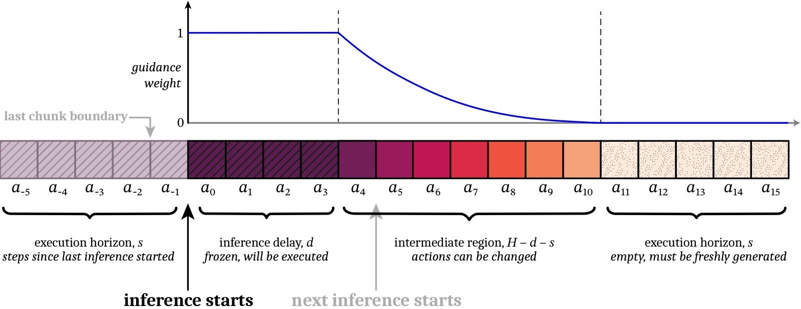
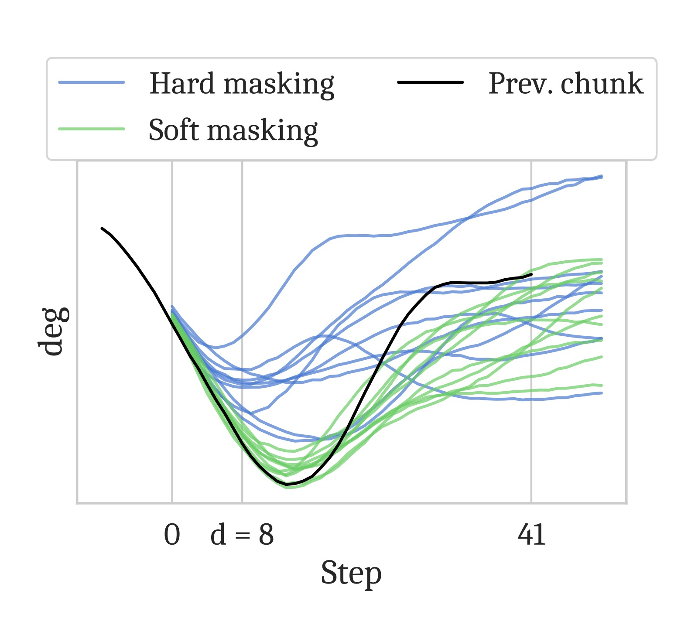
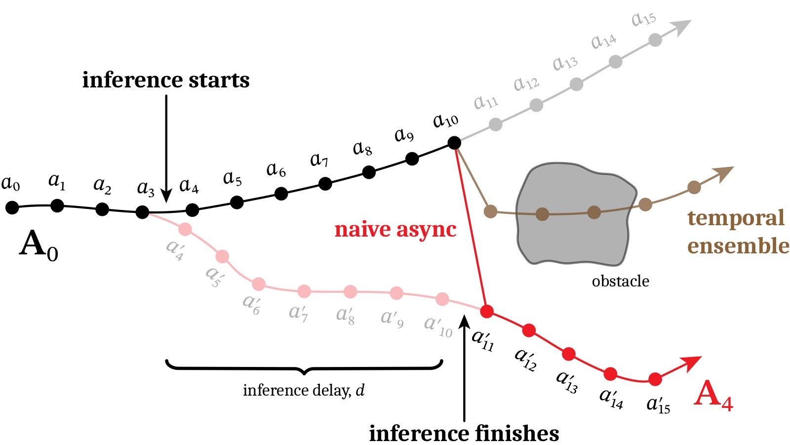
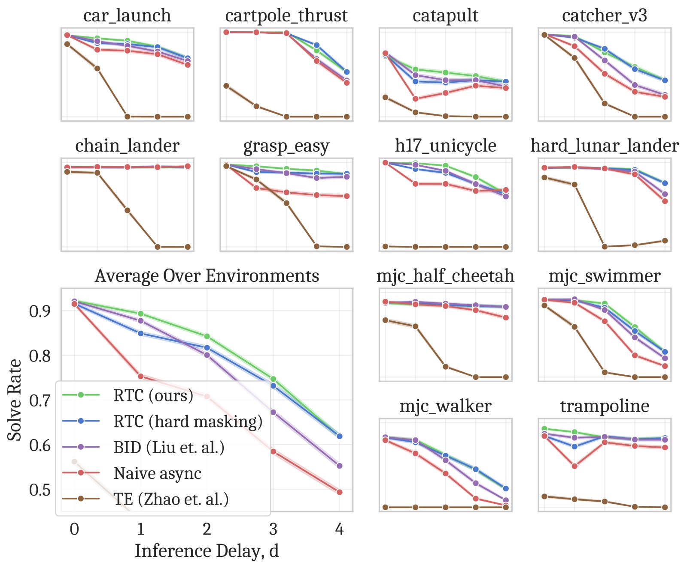
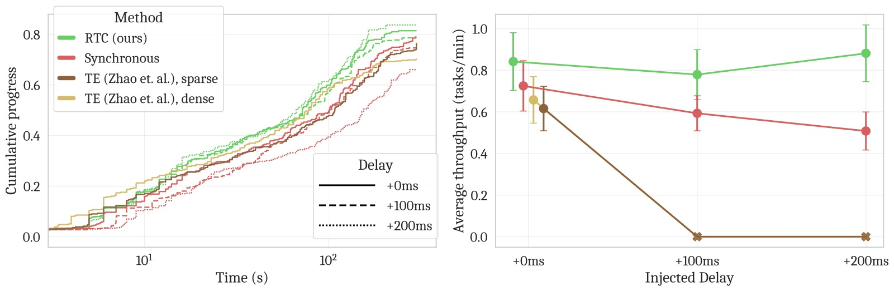

%% mathjax-macros
\ba: \mathbf{a}
\bA: \mathbf{A}
\bo: \mathbf{o}
\bv: \mathbf{v}
\bW: \mathbf{W}
\bY: \mathbf{Y}
\E: \mathbb{E}
%% end-mathjax-macros

# Real-Time Execution of Action Chunking Flow Policies

> **论文信息**
> - 作者：Kevin Black, Manuel Y. Galliker, Sergey Levine
> - 机构：Physical Intelligence, UC Berkeley
> - 投稿方向：NeurIPS 2025
> - arXiv ID：2506.07339
> - 代码：开源（仿真 benchmark 代码在补充材料中，真实机器人运行时代码为专有）
> - 项目主页：https://pi.website/research/real_time_chunking

---

## 一、核心问题

现代 VLA 模型（如 π₀、π₀.₅）面临一个工程与理论的双重挑战：**模型太大，推理不够快**。

具体来说：
- π₀ 的 PaliGemma-3B 骨干在 RTX 4090 上 **KV cache prefill 就需要 46ms**，加上网络延迟（远程推理）轻松超过控制周期（50Hz → 20ms）
- 现有做法是 **action chunking**——一次推理预测 50 步动作，执行前 25 步，然后暂停等待下一个 chunk
- 暂停引入分布外（OOD）的停顿 → 机器人运动不流畅、抖动

问题本质：**如何在推理延迟 > 控制周期的约束下，生成平滑、连续的动作流？**

---

## 二、核心思路 / 方法

### 2.1 核心洞察：将实时执行建模为 Inpainting

RTC (Real-Time Chunking) 的核心思想非常巧妙：**在上一帧动作还在执行时，提前开始推理下一帧，并通过 inpainting 确保新 chunk 与上一帧"兼容"**。

类比图像处理：在空白画布上填充缺失区域，使其与已存在的区域平滑过渡。



*图1：RTC 算法的图解。推理在 $a_{-1}$ 之后开始（异步），延迟 $d=4$。因此 $a_{0:3}$ 被"冻结"（权重为 1）——这些动作一定会被执行，新 chunk 必须与它们一致。中间区域 $a_{4:10}$ 与上一帧重叠—权重指数衰减，允许一定灵活性。最后 $s=5$ 步完全无重叠，需全新生成。执行 horizon $s$ 满足 $d \leq s \leq H-d$。*

### 2.2 RTC 算法三步

**(1) Inpainting via Pseudoinverse Guidance (ΠGDM)**

在流匹配的每一步去噪过程中，添加一个基于梯度的引导项，鼓励生成结果匹配目标值（上一帧的冻结动作）：

$$\bv_{\Pi\text{GDM}}(\bA^\tau_t,\bo_t,\tau) = \bv(\bA^\tau_t,\bo_t,\tau) + \min\left(\beta,\frac{1-\tau}{\tau \cdot r^2_\tau}\right)(\bY - \widehat{\bA^1_t})^\top \diag(\bW) \frac{\partial \widehat{\bA^1_t}}{\partial \bA^\tau_t}$$

其中：
- $\widehat{\bA^1_t}$ = 当前噪声动作的去噪估计
- $\bY$ = 上一帧的剩余动作（目标值）
- $\bW$ = 软掩码（soft mask）权重
- $\beta$ = 引导权重裁剪（论文新增，防止小步数去噪时的不稳定）

**(2) 软掩码（Soft Masking）**

仅冻结前 $d$ 步（硬掩码）通常不足以保证 chunk 间连贯性：

$$\bW_i = \begin{cases}
  1 & i < d \\
  c_i \frac{e^{c_i}-1}{e-1} & d \leq i < H-s \\
  0 & i \geq H-s
\end{cases}$$

- 冻结区（$i<d$）：权重 1（完全匹配，因这些动作必定执行）
- 过渡区（$d \leq i < H-s$）：指数衰减（有上一帧信息但允许修正）
- 新区（$i \geq H-s$）：权重 0（完全自由生成）



*图2：硬掩码（naive inpainting）与软掩码的对比。硬掩码只用前 $d$ 步做 guidance，在 $d$ 较小时 guidance 信号太弱，新 chunk 仍可能切换到不同策略导致不连续。软掩码通过对所有 $H-s$ 个重叠步赋不同权重（而非只有前 $d$ 步），提供了更强的连贯性约束，但又允许后续步逐步偏离以纳入新观测。*

**(3) 异步推理循环**

```
┌──────────────────────────────────────────────────────────┐
│  控制器线程 (50Hz)          │  推理线程 (后台)              │
│                            │                             │
│  执行 chunk 的动作...       │                             │
│  每 20ms 调用 GetAction():  │  在 chunk 执行到第 s-d 步时: │
│    1. 记录观测 bo           │    1. 取当前观测 bo          │
│    2. 返回当前 chunk 的     │    2. 取上一帧剩余动作        │
│       下一个动作 a_{t-1}    │    3. 运行 GuidedInference   │
│    3. 通知推理线程           │       (inpainting + 软掩码)  │
│                            │    4. 生成新 chunk           │
│                            │    5. 替换旧 chunk           │
└──────────────────────────────────────────────────────────┘
```



*图3：chunk 间"分岔"（bifurcation）问题的示意。上一帧（黑色）计划从障碍物上方通过，新 chunk（红色）选择从下方通过。但由于推理延迟 $d=7$，无法及时切换到新策略——在 $a_{10}$ 直接跳到 $a_{11}'$ 会产生 OOD 的巨大加速度。Temporal ensembling（插值）缓解了加速度但不产生有效动作。RTC 通过 inpainting 确保新 chunk 在冻结步上与旧 chunk 一致，从而消除分岔。*

### 2.3 训练无关 + 即插即用

RTC 是**纯推理时算法**——不需要重新训练模型，适用于任何扩散/流匹配策略。只需将 `GetAction` 和 `InferenceLoop` 集成到现有控制循环中。

---

## 三、实验与结果

### 3.1 仿真 Benchmark（12 个高动态任务）

在 Kinetix 力控仿真器中创建了 12 个高动态任务（投掷、接球、平衡等），与通常的准静态仿真 benchmark 不同：
- 力控环境 → 没有"保持位置"的概念 → 推理延迟必然要求异步执行
- 动作添加高斯噪声 → 闭环修正确有必要
- 12 个环境 × 2048 次 rollout / 数据点



*图4：仿真实验结果。(左) 执行 horizon 与成功率的关系（固定延迟 $d=1$）——RTC 和 BID (Bidirectional Decoding) 是仅有的两个能充分利用闭环修正的方法，成功率随 horizon 减小严格递增。(右) 推理延迟与成功率的关系（固定 horizon $s=\max(d,1)$）——RTC 对延迟最具鲁棒性，各延迟下均优于所有基线，且随延迟增加的性能下降最小。软掩码在低延迟和小 horizon 下的增益明显。BID 需要采样 64 个 chunk（32 强模型 + 32 弱模型），计算量远大于 RTC。*

**(1) RTC 对推理延迟最具鲁棒性**
- 所有延迟下均优于 baseline
- 与 BID 的差距随延迟增大而拉大

**(2) 软掩码 > 硬掩码**
- 在低延迟和小执行 horizon 时增益最明显

**(3) RTC 充分利用闭环修正**
- 减少执行 horizon 带来严格递增的性能提升（naive 方法做不到）

### 3.2 真实世界实验（6 个双臂操作任务）

使用 π₀.₅ VLA 作为基础策略，在 3 种延迟水平（正常、+100ms、+200ms）下评估：

| 任务 | 描述 | 步骤 |
|------|------|:--:|
| Light candle | 拿火柴→划火柴→点蜡烛→丢火柴 | 5 |
| Plug ethernet | 拿起网线→插入服务器→重复另一端 | 6 |
| Make bed (mobile) | 整理毯子+枕头 | 3 |
| Shirt folding | 折叠摊平的 T 恤 | 1 |
| Batch folding | 从篮子取皱衣服→展平→折叠→堆叠 | 4 |
| Dishes in sink (mobile) | 将 4 个物体放入水槽 | 8 |



*图5：真实世界实验结果。(上) 每个任务的累积进度曲线——横轴为控制器步数（去除暂停 × 50Hz = 有效执行时间），纵轴为任务完成步骤。RTC 在几乎所有任务上都**更快地完成子步骤**（曲线更陡），即使去除推理暂停后依然如此。(左下) 包括推理暂停的 wall-clock 时间 vs 累积进度（对数横轴）——RTC 明显更快。(右下) 延迟 vs 平均吞吐量（任务完成比例 / 总时长）——RTC 在所有延迟下均最优：(1) 正常延迟——RTC 略优于同步；(2) +100ms——RTC 明显领先，同步下降显著；(3) +200ms——RTC 几乎不受影响，而 TE 两种变体因振荡太大触发了机器人保护性停止。*

**关键发现**：

**(1) RTC 完全不受推理延迟影响**
- +200ms 延迟下性能无退化，而同步方法线性退化
- TE 变体在 +100ms 和 +200ms 时无法运行（振荡触发保护停止）

**(2) RTC 比同步推理更快完成任务——即使去除推理暂停**
- 这说明 RTC 不仅节省等待时间，还能减少**错误和重试**

**(3) RTC 在精度敏感任务上优势最大**
- Light candle（无重试机会，最高精度要求）：RTC 的最终成功率明显更高
- 其他可重试任务：RTC 完成同样步骤的用时更短

---

## 四、关键洞察与技术亮点

### 4.1 Inpainting 作为实时控制的桥梁

将"异步执行"转化为"inpainting 问题"是这篇论文最优雅的洞察。Action chunking → 相邻 chunk 有重叠 → 用上一帧的剩余动作"修补"新 chunk → 与图像 inpainting 完全同构。

### 4.2 软掩码的必要性

仅冻结前 $d$ 步（硬掩码）在理论上是正确的——因为只有这 $d$ 步是"确定要执行"的。但实践中，这样做的 guidance 信号太弱（尤其 $d$ 小时），新 chunk 容易学不到上一帧的策略方向。对所有重叠步做指数衰减的软 guidance 是论文的关键工程创新。

### 4.3 训练无关

不需要重新训练任何模型。对任何一个现有的 flow/diffusion VLA 都即插即用。这在实践中非常重要——训练大数据 VLA 的成本极高。

### 4.4 吞吐量作为评估指标

论文提出了"平均吞吐量"（任务完成比例 / 总时长）作为速度和精度的综合指标，优于只看最终成功率或只看速度。

---

## 五、局限性

1. **仅适用于扩散/流匹配策略**：不能用于自回归 VLA
2. **计算开销**：inpainting 的 VJP（向量-雅可比乘积）增加了推理成本（约 +28% latency）
3. **真实世界任务可更动态**：足式 locomotion 等更高动态性任务可从实时执行中获益更多，但未验证
4. **π₀.₅ 的运行时代码为专有**，仿真 benchmark 代码开源

---

## 六、关键概念速查

| 术语 | 解释 |
|------|------|
| **RTC / Real-Time Chunking** | 本文提出的异步 action chunking 算法 |
| **Inpainting** | 通过引导从上一帧"修补"新 chunk 的连续区域 |
| **ΠGDM** | Pseudoinverse Guidance for Diffusion Models，基于矩阵伪逆的梯度引导方法 |
| **Soft Masking** | 指数衰减权重，在重叠区软引导而非硬冻结 |
| **Bifurcation** | 相邻 chunk 选择不同策略导致的动作不连续 |
| **$d$** | 推理延迟（控制器步数）= $\lfloor \delta / \Delta t \rfloor$ |
| **$H$** | 预测 horizon（一次推理输出的动作步数） |
| **$s$** | 执行 horizon（每个 chunk 实际执行的步数） |
| **Temporal Ensembling (TE)** | ACT 提出的将多帧重叠动作加权平均的方法 |
| **BID** | Bidirectional Decoding，用拒绝采样保持 chunk 间连续性 |

---

## 七、RTC vs 其他方法的示意

```
延迟为 0 时:
  Synchronous:    [=== 25 actions ===]---[=== 25 actions ===]---
  RTC:            [=== 25 actions ===][=== 25 actions ===]...
  (RTC = synchronous 当 d=0)

延迟为 10 步时:
  Synchronous:    [=== 25 actions ===]----PAUSE----[=== 25 actions ===]---
  Naive async:    [=== 25 actions ===][=== 25 actions ===]...  ← 跳跃!
  TE:             [avg(重叠帧)=========]  ← 平滑但不一定有效
  RTC:            [=== 25 actions ===][=== 25 actions ===]...  ← 平滑 + 有效
                   ↑                   ↑
                  新 chunk 通过 inpainting 确保与上一帧连续
```

---

*笔记生成日期：2026-05-14*
