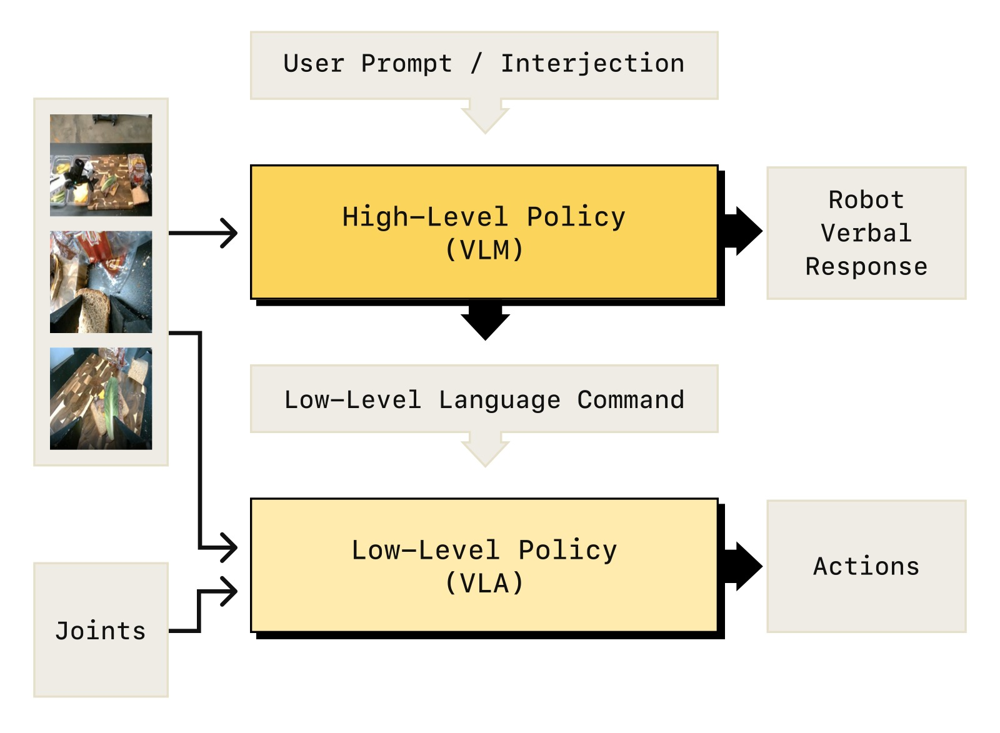
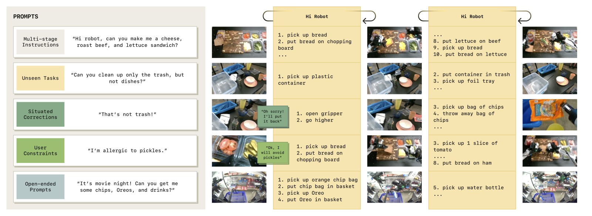
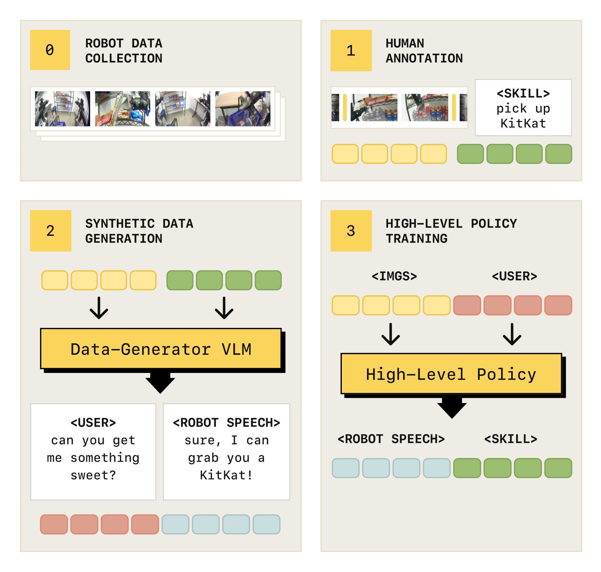
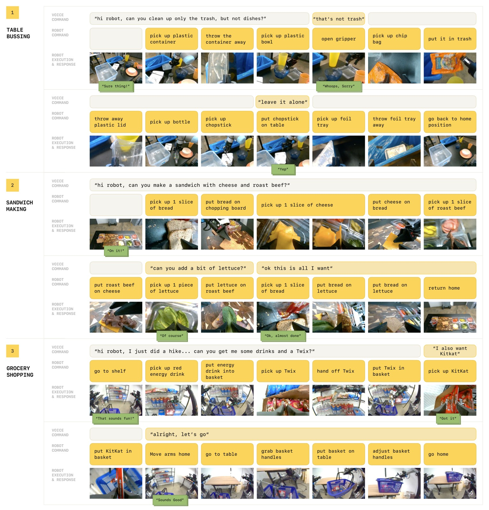
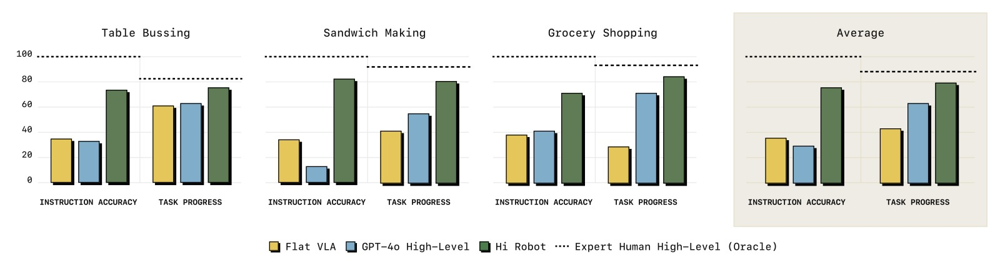
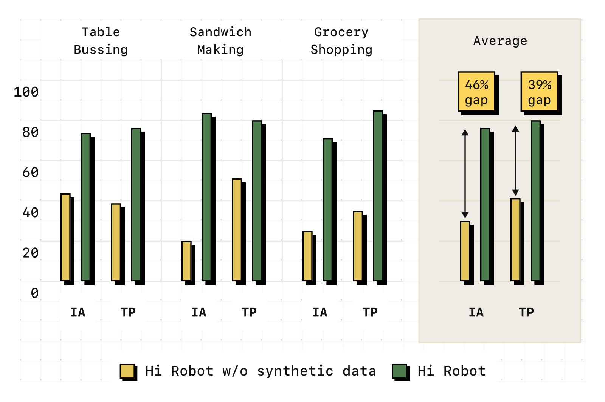
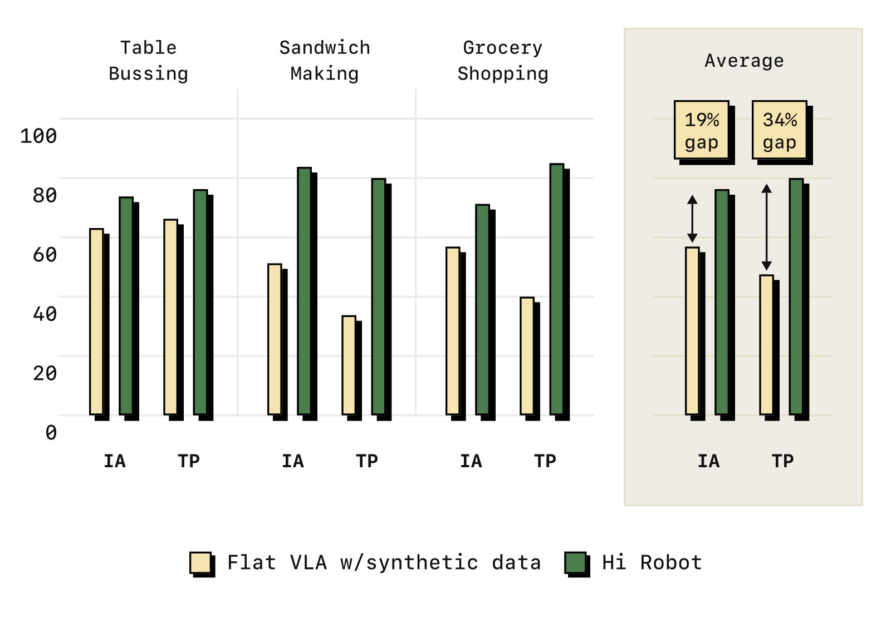
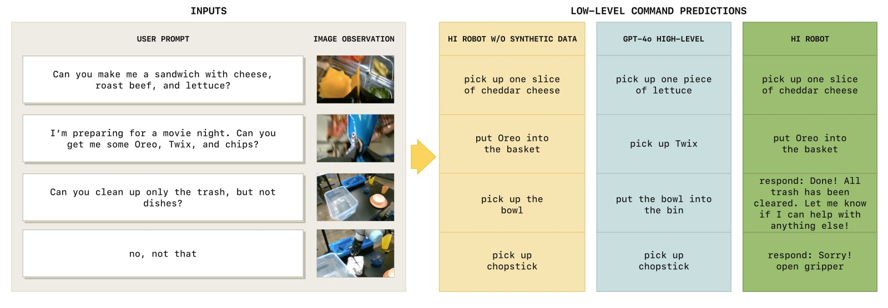

%% mathjax-macros
\bx: \mathbf{x}
\ba: \mathbf{a}
\bv: \mathbf{v}
\bu: \mathbf{u}
\bo: \mathbf{o}
\bq: \mathbf{q}
\bI: \mathbf{I}
\bA: \mathbf{A}
\E: \mathbb{E}
%% end-mathjax-macros

# Hi Robot: Open-Ended Instruction Following with Hierarchical Vision-Language-Action Models

> **论文信息**
> - 作者：Lucy Xiaoyang Shi, Brian Ichter, Michael Equi, Liyiming Ke, Karl Pertsch, Quan Vuong, James Tanner, Anna Walling, Haohuan Wang, Niccolo Fusai, Adrian Li-Bell, Danny Driess, Lachy Groom, Sergey Levine, Chelsea Finn
> - 通讯作者：research@physicalintelligence.company
> - 机构：Physical Intelligence, Stanford University, UC Berkeley
> - 投稿方向：ICML 2025
> - arXiv ID：2502.19417
> - 代码：未开源（论文中未提供代码仓库）
> - 项目主页：https://www.pi.website/research/hirobot

---

## 一、核心问题

当前 VLA 模型（如 π₀、RT-2、OpenVLA）虽然能遵循简单指令（"pick up the cup"），但面对真实世界中的复杂语言交互时完全无能为力。考虑以下场景：

- "能不能给我做一个素食三明治？最好不要加番茄。另外，如果你有火腿或烤牛肉，给我朋友单独做一个有肉的三明治。"
- 中途纠正："那不是垃圾，放回去"
- 动态约束："只收黄色的东西"

这些场景需要的能力远超"执行原子指令"——机器人需要：
1. **解析复杂提示**：理解组合语义、隐含约束、否定指令
2. **实时融合反馈**：在任务执行中动态调整行为
3. **情境化推理**：将语言反馈与视觉观测结合（"那不是垃圾"需要看到抓的是什么）

论文将此类比为 Kahneman 的 **System 1 / System 2** 认知模型：
- System 1（快、自动）：执行简单技能
- System 2（慢、推理）：解析复杂指令、理解反馈、决策下一步

现有方法只解决了 System 1 层面的问题。

---

## 二、核心思路 / 方法

### 2.1 Hi Robot 总体架构

Hi Robot 的核心设计是**层次化 VLA 系统**：高层 VLM 负责"想"，低层 VLA 负责"做"。

```
用户复杂指令 ℓ_t
      │
      ▼
┌──────────────────────────────────────┐
│        高层策略 π_hi (VLM)            │
│  System 2: 解析复杂指令、用户反馈        │
│  ┌────────────────────────────────┐   │
│  │ 输入: 图像 I¹,...,Iⁿ + 指令 ℓ  │   │
│  │ 输出: 中间语言指令 ĉ (1-3秒技能) │   │
│  │      + 可选语音回应 u          │   │
│  └────────────────────────────────┘   │
│  调用频率: 每 1 秒或收到用户输入时       │
└──────────────┬───────────────────────┘
               │ ĉ_t ("pick up the lettuce")
               ▼
┌──────────────────────────────────────┐
│        低层策略 π_lo (VLA)            │
│  System 1: 将原子指令转化为动作         │
│  输入: 图像 I¹,...,Iⁿ + 指令 ĉ + 状态 q │
│  输出: 动作块 A_t = [a_t,...,a_{t+H-1}] │
│  基于 π₀ (PaliGemma 3B + Flow Matching) │
│  调用频率: 50Hz (高频控制)              │
└──────────────┬───────────────────────┘
               │
               ▼
         机器人动作
```



*图1：Hi Robot 层次化策略架构。高层 VLM 处理开放指令和图像（基座相机+腕部相机），生成低层语言指令 ĉ（如 "grasp the cup"）；低层 VLA 基于 π₀，使用 ĉ、图像和机器人状态，通过流匹配输出连续动作块。两者都基于 PaliGemma-3B 初始化——高层做 next-token prediction 输出文本，低层加 action expert 做 flow matching 输出动作。两个策略运行在不同频率：高层约 1Hz（或由用户输入触发），低层 50Hz。*



*图2：Hi Robot 的能力展示。它能够：(a) 遵循多阶段指令——如"清理只黄色物品"；(b) 实时适应纠正——用户说"那不是垃圾"后立即放回碗；(c) 完成未见过的长周期任务——如根据食谱要求制作三明治；(d) 在需要时做出语音回应——如确认理解用户的膳食偏好。*

### 2.2 合成数据生成（关键创新）

训练高层 VLM 需要大量"复杂指令 → 原子技能"的配对数据，但人工标注这些数据的成本极高。Hi Robot 提出了一种**可扩展的合成数据生成方案**：

```
┌──────────────┐     ┌─────────────────────┐     ┌──────────────────────┐
│ 遥操作示范数据  │ ──► │  segment 为短技能     │ ──► │ D_labeled:            │
│ D_demo        │     │  ĉ ("pick lettuce") │     │ (ĉ, I¹,...,Iⁿ) 元组  │
└──────────────┘     └─────────────────────┘     └──────────┬───────────┘
                                                           │
                                                           ▼
                                              ┌─────────────────────────┐
                                              │ 大型 VLM p_gen 生成       │
                                              │ 输入: 图像 + 技能标签 ĉ   │
                                              │ + 上下文历史              │
                                              │ 输出:                    │
                                              │  - 合成用户指令 ℓ        │
                                              │    "Can you add some     │
                                              │     lettuce for me?"    │
                                              │  - 机器人语音回应 u       │
                                              │  - 场景分类标签           │
                                              └──────────┬──────────────┘
                                                         │
                                                         ▼
                                              ┌─────────────────────────┐
                                              │ D_syn:                  │
                                              │ (ℓ, ĉ, u, I¹,...,Iⁿ)    │
                                              │ 覆盖多种场景类型:          │
                                              │ - 否定任务 (不要做X)       │
                                              │ - 情境纠正 (调整之前指令)   │
                                              │ - 特定约束 (饮食偏好等)    │
                                              └─────────────────────────┘
```



*图3：高层策略训练数据的采集与生成流程。Step 1——人类遥操作员收集机器人示范数据，带有粗粒度语言标注（如 "make a sandwich"）。Step 2——将完整 episode 分割为 1-3 秒的短技能片段 ĉ_t（如 "pick up one piece of lettuce"），并启发式提取基本运动原语。Step 3——使用大型 VLM p_gen 为每个 (图像, 技能标签) 对，合成可能的用户指令 ℓ（如 "Can you add some lettuce for me?"）、机器人语音回应 u，以及场景类型标签。p_gen 利用视觉上下文和世界知识生成多样化交互——例如在制作三明治时推断出饮食约束（"我乳糖不耐受"→ "好的，我不放奶酪"），在购物场景中推断隐含请求（"我想要甜的"→ 建议巧克力或糖果）。为保持多步任务的一致性，p_gen 还接收先前的技能标签历史 ĉ_0,...,ĉ_{t-1}，生成符合任务进展的连贯指令。*

这一设计的精妙之处：
- **零人工标注成本**：仅需对演示数据做一次 skill segmentation，其余全靠 VLM 自动生成
- **利用了 VLM 的世界知识**：模型可以推断饮食约束（"lactose intolerant" → 不放奶酪）、推理隐含偏好（"something sweet" → 巧克力）
- **结构化分类保证多样性**：通过场景类型（否定任务、情境纠正、特定约束）和回应类型（确认、澄清、错误处理）的分类标签，引导生成多样化交互
- **上下文一致性**：条件化于先前的技能标签历史，确保多步交互的连贯性

### 2.3 训练

- **高层策略**：PaliGemma-3B → 在 $D_{syn} \cup D_{labeled}$ 上做 next-token prediction 微调
- **低层策略**：PaliGemma-3B → π₀ 的 flow matching VLA，在 $D_{labeled} \cup D_{demo}$ 上训练
- 高层训练效率：8×H100，约 2 小时

### 2.4 实时推理

- 高层 VLM 推理：每 1 秒一次，或在用户发言时触发
- 低层 VLA 推理：50Hz 高频控制（通过 action chunking，每 0.5-0.8 秒推理一次）
- 使用 Whisper large-v2 做语音转文字，Cartetia API 做文字转语音
- 推理硬件：1-2 块 NVIDIA RTX 4090

---

## 三、实验与结果

### 3.1 任务设置

三个复杂领域：

| 任务 | 机器人 | 挑战 |
|------|--------|------|
| **Table Bussing** (清理桌子) | UR5e 单臂 | 区分垃圾/餐具；语义约束 ("只收黄色东西")；动态纠正 ("那不是垃圾") |
| **Sandwich Making** (制作三明治) | ARX 双臂 | 灵巧操作食材；饮食约束 ("素食"、"对泡菜过敏")；中途停止 ("够了，不要更多") |
| **Grocery Shopping** (杂货购物) | Mobile ARX 双臂移动 | 移动操作；模糊语义 ("给我拿点甜的")；数量推理 ("给我 Twix 和 Skittles") |



*图4：三个评估任务域的概览。(a) Table Bussing——UR5e 单臂清理桌子，将垃圾放入垃圾桶、餐具放入碗篮。评估包括复杂约束提示（"只收垃圾不收餐具"、"收所有黄色的东西"）和即时纠正（"那不是垃圾"、"这个不用收"）。(b) Sandwich Making——ARX 双臂制作三明治，使用最多 6 种配料+面包。评估包括组合请求（"做一个有奶酪、烤牛肉、生菜的三明治"）、约束（"素食"、"对泡菜过敏"）、中途纠正（"够了"）。(c) Grocery Shopping——Mobile ARX 双臂移动机器人从货架挑选商品放入篮子。评估包括模糊语义（"拿点甜的"、"拿点喝的"）、具体品牌（"拿 Twix 和 Skittles"）、中途追加（"我还要 KitKat"）。*

### 3.2 主要结果对比



*图5：Hi Robot 与 GPT-4o（SayCan 式 VLM 高层的升级版）、Flat VLA（无高层的 π₀）的定量对比。在三个任务上分别评估指令准确率（IA）和任务进度（TP），每任务 20 次试验。Hi Robot 在所有 6 个指标上全面领先：(1) IA 比 GPT-4o 平均高 40% 以上——GPT-4o 虽然模型更大但缺乏物理 grounding，常输出无意义指令（如 "pick up bermuda triangle"）或将所有物体标记为 "plate"；(2) Flat VLA 无法处理复杂多阶段指令和实时反馈；(3) Expert Human 高层作为 oracle 基线，展示了低层策略的物理能力上限——Hi Robot 正接近这一上限。*

**关键发现**：

**(1) Hi Robot 在开放指令遵循上远超基线：**
- 正确识别并处理约束（"不加番茄"、"素食"、"只收黄色东西"）
- GPT-4o 在物理交互开始后失去上下文，发出无意义指令
- Flat VLA 本质上无法处理复杂指令

**(2) 强情境推理和实时反馈适应：**
- 用户中途修改请求（"够了"、"我还要 KitKat"）时，Hi Robot 立即调整低层指令
- GPT-4o 无法维持一致的内部状态：在夹爪仍被占用时命令捡新物体，或过早切换任务
- Flat VLA 完全不响应实时反馈

**(3) 跨任务、跨机器人、跨约束有效：**
- 在单臂、双臂、移动双臂平台上均有效
- 处理从易碎奶酪片到高瓶子的各种物体
- 遵守动态约束（"不加番茄"、"只收垃圾"）

### 3.3 消融实验

**(A) 合成数据的关键作用**



*图6：去除合成数据的消融结果。仅使用人工标注数据（无 D_syn）训练的高层策略，在指令准确率（IA）和任务进度（TP）上均大幅下降。具体表现：忽略澄清（"这不是垃圾"）、包含禁止项（泡菜）、缺乏对组合式语言的理解。合成数据提供的"否定任务"、"情境纠正"、"具体约束"等多样化交互场景，是模型获得灵活语言理解能力的关键。*

**(B) 层次结构 vs 平坦策略**



*图7：层次化 vs 平坦策略的消融。即使使用相同的训练数据（含合成数据），Flat VLA 的性能也远不如层次化的 Hi Robot。原因：平坦策略一次处理整个任务，容易退化为默认行为（清空所有物品、"收所有东西"），无法在每步重新检查提示中的约束条件。而 Hi Robot 的高层在每个时间步重新生成中间指令，有效地将全局约束传播到每个局部决策中。*

### 3.4 定性对比



*图8：高层指令生成的定性对比。(a) GPT-4o 经常错误识别物体（将一切标记为 "plate" 或 "spoon"），导致低层执行完全错误的行为；(b) GPT-4o 跳过了任务——忽略了用户"不加番茄"的约束，仍然指令拿取番茄；(c) GPT-4o 忽略用户意图——用户说"只收垃圾"，但 GPT-4o 仍指令收取餐具。相比之下，Hi Robot 持续生成与机器人动作和用户请求对齐的指令。无合成数据的消融版本对齐视觉观测良好（看到什么说什么），但忽略了用户约束。*

---

## 四、关键洞察与技术亮点

### 4.1 System 1 / System 2 的 VLA 实现

这是论文最核心的概念贡献。与认知科学中 Kahneman 的双过程理论的精确对应：
- **System 1（低层 VLA）**：快速、自动、基于模式识别——看到"pick up the cup"直接输出动作
- **System 2（高层 VLM）**：缓慢、深思熟虑、需要推理——解析"做一个素食三明治，不要番茄"→ 推断需要哪些配料 → 依次下达各步原子指令

两个系统使用几乎相同的模型架构（都是 PaliGemma-3B），区别仅在于输出格式（文本 vs 流匹配动作）。这种统一性暗示未来可以将两个角色合并到一个模型中。

### 4.2 合成数据的"倒推生成法"

传统上，我们收集"指令→技能"的配对数据。Hi Robot 反其道而行——先有技能标签，再倒推出"什么样的指令可能会产生这个技能"。这类似于 LLM 训练中的"逆向指令生成"技术，但在具身场景中通过视觉条件化变得更加复杂。

### 4.3 语言作为中间表示层

Hi Robot 的高层和低层之间使用**自然语言**作为接口（ĉ_t），而不是某种隐式向量。这带来了重要优势：
- **可解释性**：可以检查高层输出了什么指令
- **可调试性**：可以人工替换高层输出来诊断低层问题
- **模块化**：高层和低层可以独立升级和替换

### 4.4 物理 grounding 对高层推理的必要性

GPT-4o 作为一个更强大的 VLM，在 Hi Robot 框架中的表现反而很差——因为它没有被针对机器人 affordance 进行微调。多模态能力本身不足以实现物理 grounding——模型需要看到过机器人执行这些技能的例子才能正确调用。

---

## 五、局限性

1. **缺乏长程记忆**：当前系统不维护长时间记忆，难以处理需要回忆历史指令的复杂推理
2. **高低层独立训练**：两个模型对彼此的能力没有明确认知——高层不知道低层实际能执行哪些技能
3. **Prompt engineering 依赖**：合成数据生成质量依赖于精细的 prompt 工程
4. **对象偏好偏差**：低层策略有时偏向靠近夹爪的物体（如忽略"乳糖不耐受"约束去抓奶酪），训练数据中的分布偏差影响行为
5. **无出错恢复**：掉落的物体等 OOD 情况无法恢复
6. **未开源模型权重**：论文未提供训练好的模型 checkpoint

---

## 六、关键概念速查

| 术语 | 解释 |
|------|------|
| **Hi Robot** | Hierarchical Interactive Robot system，本文提出的层次化人机交互系统 |
| **π_hi / 高层策略** | 基于 VLM 的 System 2 推理层，将复杂指令分解为原子技能 |
| **π_lo / 低层策略** | 基于 VLA（π₀）的 System 1 执行层，将原子技能转为动作 |
| **System 1 / System 2** | Kahneman 的认知双过程模型：快直觉 vs 慢推理 |
| **ĉ_t / 中间语言指令** | 高层输出给低层的原子指令（1-3秒的技能描述） |
| **D_syn / 合成数据** | 用大型 VLM 从 (图像, 技能标签) 对逆向生成的多样的交互数据 |
| **D_labeled** | 人类将演示数据 segment 为短技能标签得到的标注数据集 |
| **PaliGemma-3B** | 两者共用 VLM 骨干（高层做 NLP，低层加流匹配输出动作） |
| **Whisper** | OpenAI 语音识别模型，用于将用户语音转为文本输入 |
| **情境化 grounding** | 将语言反馈与当前视觉观测结合的能力（如 "that's not trash" 需要看到抓的是什么） |
| **指令准确率 (IA)** | 高层策略预测的指令是否符合用户意图和当前观测 |
| **任务进度 (TP)** | 正确操作的对象占总需要操作对象的比例 |

---

## 七、推理调用流程

```
用户说: "Can you make me a vegetarian sandwich? No tomatoes please."
                    │
                    ▼
       ┌─────────────────────────┐
       │  Whisper: 语音 → 文本     │
       │  ℓ = "make vegetarian    │
       │       sandwich, no tomato"│
       └────────────┬────────────┘
                    │
                    ▼
       ┌─────────────────────────┐
       │  高层 VLM 推理 (~60ms)   │
       │                         │
       │  观察: 面包、生菜、奶酪、  │
       │        火腿、番茄在工作台上  │
       │  推理: "素食 → 不放火腿"   │
       │        "不要番茄"         │
       │  输出: ĉ = "pick up one   │
       │         slice of bread"  │
       │        u = "Sure, I'll   │
       │         make a vegetarian │
       │         sandwich, no      │
       │         tomatoes!"        │
       └────────────┬────────────┘
                    │
                    ▼
       ┌─────────────────────────┐
       │  低层 VLA 推理 (~73ms)   │
       │  输入: ĉ + 图像 + 关节角  │
       │  通过流匹配输出 50 步动作   │
       │  执行: 移动到面包位置 →    │
       │        抓取一片面包       │
       └────────────┬────────────┘
                    │
                    ▼
       ┌─────────────────────────┐
       │  1 秒后，高层再次推理:     │
       │  ĉ = "pick up lettuce"   │
       │  → 抓取生菜               │
       │  再过 1 秒:               │
       │  ĉ = "pick up cheese"    │
       │  → 抓取奶酪               │
       │  ...直到三明治完成         │
       └─────────────────────────┘
                    │
       ┌─ 如果用户中途打断 ────────┐
       │  "that's too much cheese" │
       │  → 高层推理: stop current  │
       │    action, adjust amount  │
       │  → 低层: 放回多余奶酪      │
       └─────────────────────────┘
```

---

## 八、与相关方法的对比

```
                    高层推理能力
                         ▲
                         │
         Hi Robot (本文)  │   ★ 端到端 VLM 微调
         (VLM+VLA,        │   (高层+低层都是 VLM)
          合成数据训练)     │
                         │
                         │        GPT-4o 高层
                         │        (API VLM, 大但无
                         │         物理 grounding)
                         │
                         │   SayCan / Code-as-Policies
                         │   (LLM 规划 + 预定义技能)
                         │
                         │
    Flat VLA (π₀, RT-2) │   VoxPoser / MOKA
    (无高层，单步指令)     │   (VLM 参数化技能,
                         │    无实时语言交互)
                         │
                         └──────────────────────────────►
                           低层灵巧性 / 物理能力
```

Hi Robot 的独特位置：**高层推理 + 低层灵巧性的真正融合**。之前方法要么只有其中一侧，要么两侧的连接过于薄弱。

---

*笔记生成日期：2026-05-14*
