%% mathjax-macros
\ba: \mathbf{a}
\bv: \mathbf{v}
\bu: \mathbf{u}
\bo: \mathbf{o}
\bq: \mathbf{q}
\bI: \mathbf{I}
\bA: \mathbf{A}
\E: \mathbb{E}
%% end-mathjax-macros

# π₀.₅: a Vision-Language-Action Model with Open-World Generalization

> **论文信息**
> - 作者：Physical Intelligence (Kevin Black, Noah Brown, James Darpinian, Karan Dhabalia, Danny Driess, 等)
> - 投稿方向：arXiv 预印本 (2025.04.23)
> - arXiv ID：2504.16054
> - 代码：未开源
> - 项目主页：https://pi.website/blog/pi05

---

## 一、核心问题

之前的 VLA 模型（如 π₀、RT-2）虽然能执行复杂灵巧任务，但存在一个根本局限：**只能在训练数据覆盖的环境中工作**。当机器人被部署到全新的家庭环境中（新的厨房布局、新的物体、新的背景），性能会急剧下降。

问题在于：
- 要训练一个能"清理厨房"的移动操作机器人，需要覆盖所有可能的环境——这不可能通过暴力扩大数据收集来实现
- 灵巧操作任务本身就很难，加上环境泛化的要求，难度是指数级的

π₀.₅ 的核心主张是：**通过 co-training 从异构数据源中迁移知识，可以让机器人泛化到全新的环境**——就像人类能从书本、他人经验、其他领域的技能中综合学习一样。

---

## 二、核心思路 / 方法

### 2.1 总体设计哲学

π₀.₅ 的关键洞察：VLAs 无法仅凭自身的机器人数据泛化到新环境，但可以通过**联合训练多种异构数据源**获得这个能力。

| 数据源 | 占比 (预训练) | 说明 |
|--------|:----------:|------|
| **MM** (Mobile Manipulator) | ~2.4% | 约 100 个家庭的移动操作数据，约 400 小时 |
| **ME** (Multi-Environment) | — | 非移动机械臂在更多家庭环境中的数据 |
| **CE** (Cross-Embodiment) | — | 实验室条件下多机器人多任务数据 + OXE |
| **HL** (High-Level) | — | 子任务语义标注（如 "pick up the plate"） |
| **WD** (Web Data) | — | 图像描述、VQA、物体定位等网络数据 |
| **VI** (Verbal Instruction) | 后训练 ~11% | 人类专家用语言"遥控"机器人的示范 |

**关键数字：预训练阶段 97.6% 的训练样本不来自移动操作机器人**——但模型最终能控制移动机器人在全新家庭中完成任务。

### 2.2 模型架构

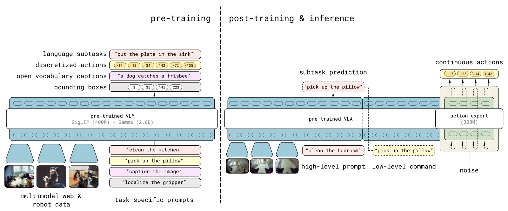

*图1：π₀.₅ 的两阶段训练架构。预训练阶段（上）：将多种数据源（MM/ME/CE 机器人数据 + HL 高层子任务预测 + WD 网络数据）统一为离散 token 进行训练，行动使用 FAST tokenizer。后训练阶段（下）：加入 flow matching 动作专家（action expert），专注于移动操作的连续动作生成，同时保留高层文本输出能力。推理时，模型先预测高层子任务（"pick up the plate"），再基于子任务预测低层连续动作。这种设计与 chain-of-thought 类似，但高层推理以较低频率运行。*

π₀.₅ 基于 π₀ 的架构，核心设计：

**(1) 统一的多模态 Transformer**

模型可以灵活地同表示两种输出：
- **文本输出**：高层子任务预测（如 "pick up the cutting board"）、网络数据的 VQA 答案
- **动作输出**：通过 flow matching 生成连续动作 chunk

分布分解为：
$$\pi_\theta(\ba_{t:t+H}, \rawtext \vert \bo_t, \lang) = \pi_\theta(\ba_{t:t+H} \vert \bo_t, \rawtext)\pi_\theta(\rawtext \vert \bo_t, \lang)$$

其中 $\rawtext$ 是模型文本输出（子任务标签），$\lang$ 是任务指令。

**(2) 离散 + 连续的混合动作表示**

这是 π₀.₅ 的一个独特设计——模型同时被训练为：
- 通过 FAST tokenizer（DCT+BPE）**自回归生成离散** action tokens（预训练阶段，训练效率高）
- 通过 flow matching **非自回归生成连续**动作（后训练阶段，推理快）

联合损失函数：
$$\mathbb{E}_{\mathcal{D}, \tau, \omega} \Big[H(x_{1:M}, f^\lang_\theta) + \alpha \| \omega - \ba_{t:t+H} - f^a_\theta(\ba^{\tau, \omega}_{t:t+H}, \bo_t, \lang) \|^2 \Big]$$

- 第一项：文本 token（含 FAST action tokens）的交叉熵损失
- 第二项：flow matching 动作专家的 MSE 损失（$\alpha=10.0$）

**(3) 分层推理**

推理时：
1. 高层：自回归生成子任务文本 $\rawtext$（如 "pick up the plate"）
2. 低层：基于 $\rawtext$ + 观测，通过 10 步 flow matching 生成连续动作

这与 Hi Robot 类似，但关键区别：**同一个模型**同时做高层和低层推理（Hi Robot 需要训练两个模型）。

### 2.3 机器人系统

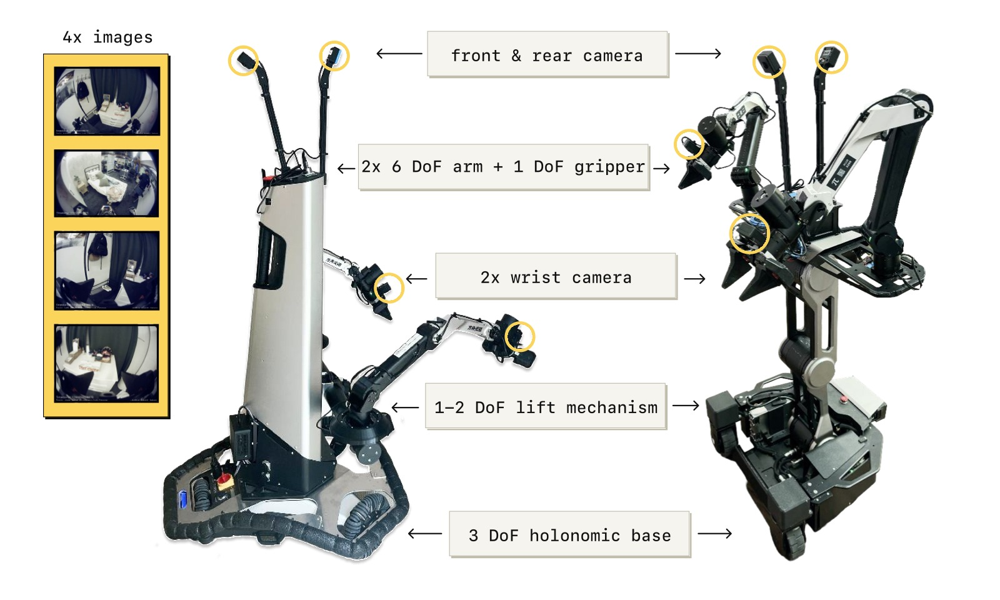

*图2：两种移动操作机器人平台。每个平台有 4 个摄像头（前向、后向、两个腕部）、两个 6-DoF 机械臂加平行爪夹爪、全方位移动底盘和躯干升降机构。状态和动作空间为 18-19 维。π₀.₅ 直接以 50Hz 控制关节、夹爪、躯干升降和底盘速度，通过简单的 PD 控制器执行，无需轨迹规划或碰撞检测。*

### 2.4 预训练与后训练数据

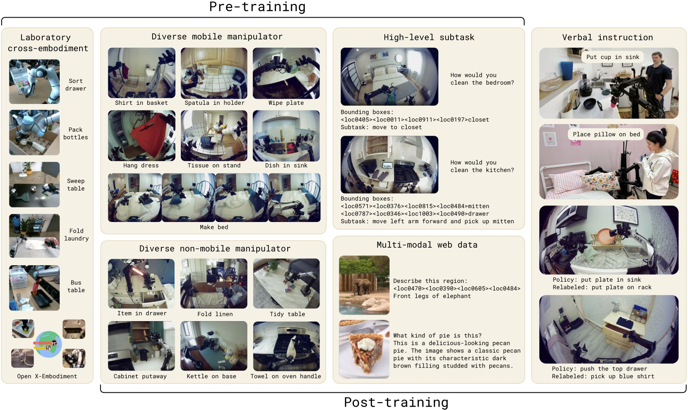

*图3：预训练和后训练中各数据源的示例。(MM) 移动操作数据——在约 100 个家庭中执行清洁、整理任务；(ME) 多环境非移动数据——可搬运的轻型臂在更多家庭中收集数据，因轻便而覆盖面更广；(CE) 跨具身实验室数据——在简化桌面环境下多种机器人的多样任务；(HL) 高层子任务预测——手动标注子任务描述和边界框；(WD) 网络数据——图像描述、VQA、物体定位；(VI) 语言指令——人类专家用语言"遥控"机器人的示范数据。后训练阶段去掉了 CE 实验室数据，专注于移动操作和多环境数据。*

---

## 三、实验与结果

### 3.1 实验设置

所有评估在训练数据**未见过的**环境中进行：
- **Mock homes**：受控的模拟家庭环境（定量比较）
- **Real homes**：3 个真实家庭（最终评估）

### 3.2 真实家庭泛化

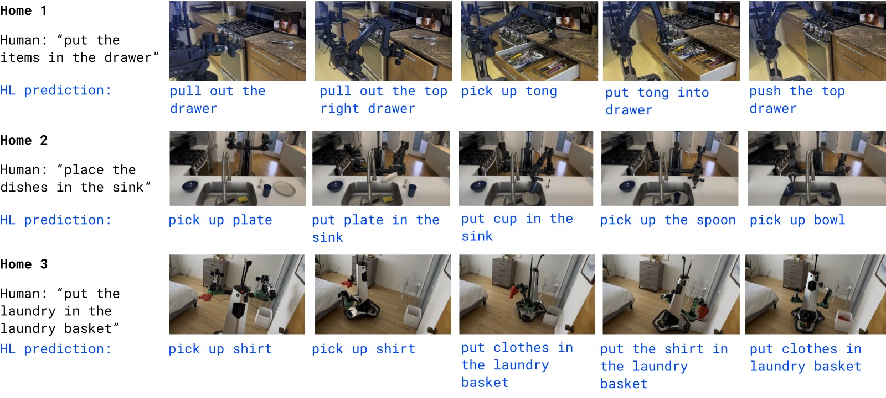

*图4：π₀.₅ 在 3 个训练数据中未见过的真实家庭中的评估示例。(a) Home 1——将物品放入抽屉；(b) Home 2——将盘子放入水槽；(c) Home 3——将衣物放入洗衣篮。每帧下方蓝色文字是 π₀.₅ 自行推理的高层子任务标签。所有任务只需一个简单的高层指令（如 "place the dishes in the sink"），高层推理过程自主决定具体步骤。任务持续 2-5 分钟，涉及多阶段操作。*

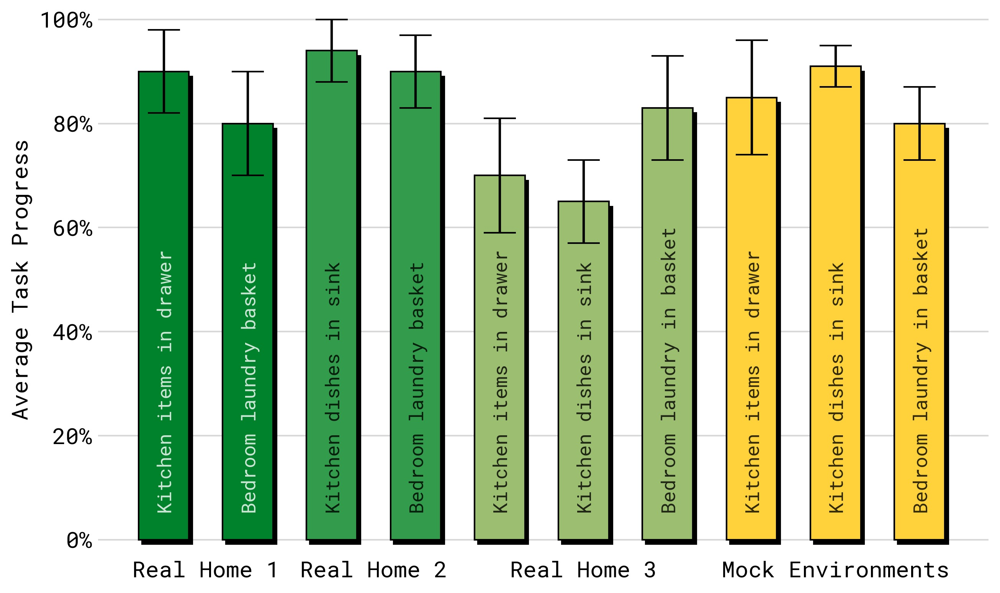

*图5：真实家庭中的量化任务进度（10 次试验平均）。三个任务（items in drawer、laundry basket、dishes in sink）在 3 个真实家庭的厨房和卧室中评估。π₀.₅ 在所有任务-环境组合上均取得一致的进展，且 mock 评估环境中的性能与真实家庭性能代表性高度相关。论文指出模型实际能执行的远不止这 3 个评估任务。*

### 3.3 环境数量对泛化的影响

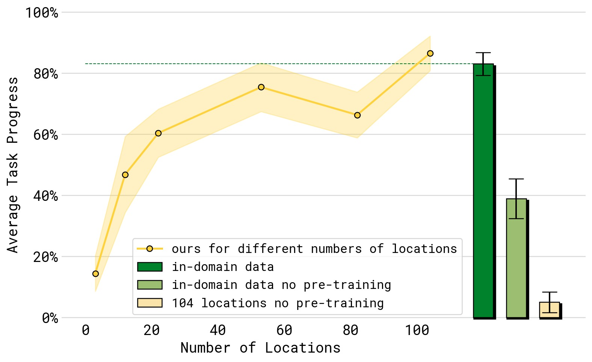

*图6：训练数据中环境数量（横轴，从 3 到 104 个）对任务性能（纵轴，dishes in sink、items in drawer、laundry basket、make bed 四项平均）的影响。性能随环境数量单调递增。绿色虚线和绿色柱为"对照组"——在测试环境中直接训练——π₀.₅ 的 104-环境模型已达到与其相似的性能，证明泛化几乎弥合了 gap。浅黄色柱（无 full co-training recipe，仅用机器人数据）和浅绿色柱（同样无 co-training）的性能远低于完整方法，证明异构数据 co-training 对泛化至关重要。*

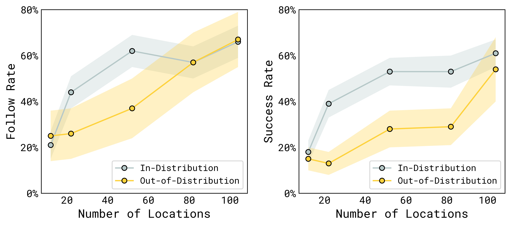

*图7：语言跟随率（左）和任务成功率（右）随训练环境数量的变化。分别测试分布内（in-distribution）和分布外（OOD）物体类别。横轴为训练环境数量（3~104），纵轴为成功率。关键发现：(1) 性能随环境数量稳步提升；(2) 分布内物体泛化更快（熟悉类别的新实例）；(3) 分布外物体（完全未见类别）的泛化需要更多环境，但随环境数增加也能持续提升——每个新环境引入的新家居物品帮助模型变得更鲁棒。*

### 3.4 Co-training Recipe 消融

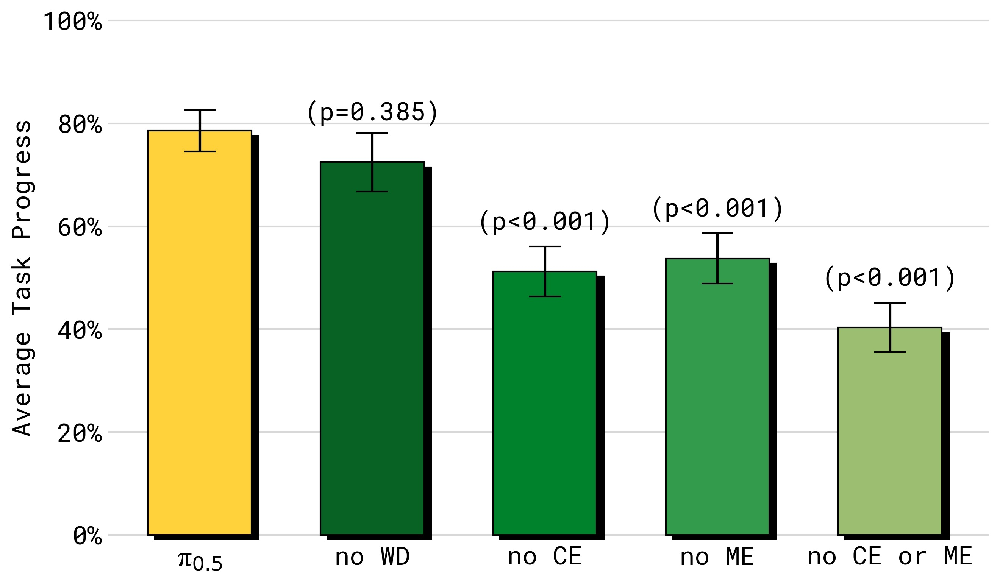

*图8：消融不同训练数据源对模拟家庭四项任务性能的影响。移除任何数据源都会降低性能：(1) no WD——去除网络数据，影响相对较小但统计不显著；(2) no ME——去除多环境非移动数据，大幅降低性能；(3) no CE——去除跨具身实验室数据，同样大幅降低；(4) no ME or CE——同时移除两个跨具身数据源，性能下降最严重。这证明跨具身迁移（来自不同机器人和不同环境的数据）对泛化至关重要。*

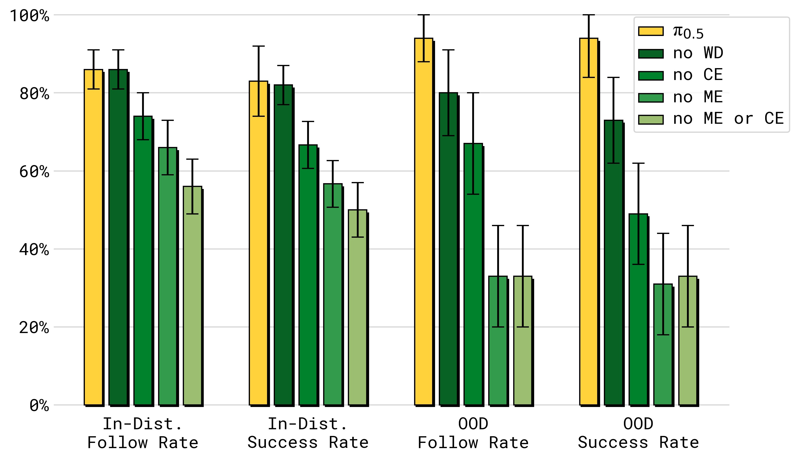

*图9：消融实验在语言跟随任务上的表现（分布内 vs 分布外物体）。与完整任务消融一致，ME 和 CE 数据对两种分布都有巨大影响。但这里一个关键区别浮出水面：**web data (WD) 对分布外（OOD）物体的语言跟随有显著贡献**——去除 WD 后 OOD 性能显著下降。原因：网络数据包含极其广泛的物理物体知识，使模型能理解和遵循涉及未见物体类别的语言指令。*

### 3.5 与 π₀ 及 π₀-FAST 的对比

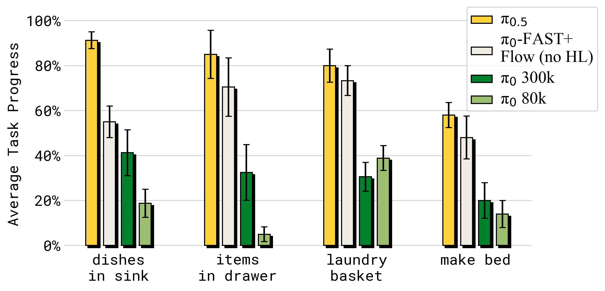

*图10：π₀.₅ 与 π₀（原始扩散 VLA）及 π₀-FAST+Flow（改进版，使用联合 FAST+Flow 训练但仅含动作数据）的对比。π₀.₅ 在所有指标上显著优于两者：(1) vs π₀——即使给 π₀ 额外的 300k 步训练，π₀.₅ 仍大幅领先；(2) vs π₀-FAST+Flow——该改进版与 π₀.₅ 使用相同的训练效率优化，但不含 HL 和 WD 数据，性能差距证明高层推理和网络数据 co-training 的价值。*

### 3.6 高层推理的重要性

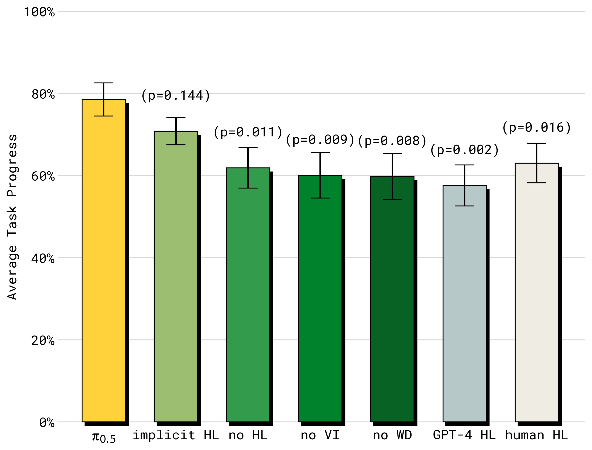

*图11：高层推理模式的消融结果。(1) Full π₀.₅ (HL+LL)——最优；(2) implicit HL——不做显式高层推理但训练中包含 HL 数据，排名第二——证明即使不做显式子任务推理，子任务预测数据本身就是强大的 co-training 信号；(3) no VI——去除语言指令数据（仅占 HL 数据的 11%），性能大幅下降——少量的高质量语言交互数据价值极高；(4) no WD——去除网络数据，显著下降——网络数据主要贡献在高层推理能力；(5) no HL——完全不使用 HL 数据，最差之一；(6) GPT-4 高层——使用 GPT-4 作为高层策略（zero-shot），效果最差——证明高层策略必须在机器人数据上微调。有趣的是，π₀.₅ Full 甚至超越了 **Human HL**（人类专家选择子任务）——说明模型的高层推理不仅跟上了人类水平，还更胜一筹。*

---

## 四、关键洞察与技术亮点

### 4.1 "不到 3% 的数据决定一切"

π₀.₅ 预训练中 97.6% 的训练样本不来自移动操作机器人，但模型最终能控制移动机器人在新家庭中工作。这验证了"知识迁移"的力量——通过正确的 co-training 配方，少量高质量目标域数据足以让模型泛化。

### 4.2 离散 + 连续混合训练

同时训练 FAST 离散 token 和 flow matching 连续动作，兼顾了训练效率（离散 token 的简单交叉熵）和推理速度（flow matching 的 10 步非自回归解码）。预训练用离散（$\alpha=0$），后训练加入连续动作专家（$\alpha=10.0$）。

### 4.3 高层子任务预测作为 co-training 信号

即使不做显式的高层推理（implicit HL ablation），仅将子任务预测作为训练目标就大幅提升了性能。这说明子任务标注扮演了类似于 chain-of-thought 监督的角色——教模型"思考"任务结构。

### 4.4 Web Data 的"双面性"

- 对低层动作执行贡献不大（no WD 在完整任务中影响不显著）
- 对语言跟随（OOD 物体）和高层推理贡献巨大
- 结论：网络数据主要通过**语义理解**路径影响泛化，而非物理技能

### 4.5 同模型高层+低层推理

与 π₀-HiRobot（训练两个独立模型）不同，π₀.₅ 使用单一模型同时完成高层推理和低层执行。这更类似于 LLM 的 chain-of-thought——通过内部文本生成实现"思考"，然后基于思考结果行动。

---

## 五、局限性

1. **仍有失败**：不熟悉的抽屉把手、物理上难以打开的柜门、遮挡导致的感知失败、高层推理偶尔"分心"（如反复开关抽屉）
2. **提示复杂度有限**：模型处理的提示相对简单，更复杂的偏好和约束需要通过更丰富的标注数据来实现
3. **缺乏长期记忆**：模型使用相对短的上下文，无法在跨房间导航或记忆物品位置等场景中表现更好
4. **特定的数据组合**：论文只探索了一种异构数据组合，其他可能的数据源组合尚未研究
5. **代码和模型未开源**

---

## 六、关键概念速查

| 术语 | 解释 |
|------|------|
| **π₀.₅** | 基于 π₀ 的 co-trained VLA，通过异构数据源实现开放世界泛化 |
| **Co-training** | 在多个不同数据源（机器人数据、网络数据、语义标注）上联合训练 |
| **MM** | Mobile Manipulator，移动操作机器人数据（约 100 个家庭，400 小时） |
| **ME** | Multi-Environment，非移动臂在多样家庭中的数据 |
| **CE** | Cross-Embodiment，实验室多机器人跨具身数据 |
| **HL** | High-Level，语义子任务预测标注 |
| **WD** | Web Data，图像描述/VQA/物体定位等网络多模态数据 |
| **VI** | Verbal Instruction，人类专家用语言"遥控"的演示 |
| **Hybrid Action** | 同时用 FAST 离散 token 和 flow matching 连续动作训练 |
| **Hierarchical Inference** | 同一模型先输出子任务文本，再基于子任务输出动作 |
| **Implicit HL** | 训练中包含 HL 数据但不做显式高层推理的 baseline |

---

## 七、推理流程

```
┌──────────────────────────────────────────────────────────────┐
│              π₀.₅ 推理流程（单次动作生成）                       │
├──────────────────────────────────────────────────────────────┤
│                                                              │
│  输入: "clean the kitchen" + 4 摄像头图像 + 机器人状态         │
│                                                              │
│  ┌─────────────────────────────────────────────────────┐     │
│  │  Step 1: 高层推理（自回归文本生成，~50ms）              │     │
│  │                                                     │     │
│  │  模型观察场景 → 推理下一个子任务                        │     │
│  │  输出: rawtext = "pick up the plate on the counter" │     │
│  │                                                     │     │
│  │  调用频率：每 1 秒或任务完成时                          │     │
│  └──────────────────────┬──────────────────────────────┘     │
│                         │                                    │
│                         ▼                                    │
│  ┌─────────────────────────────────────────────────────┐     │
│  │  Step 2: 低层推理（Flow Matching, ~73ms）             │     │
│  │                                                     │     │
│  │  输入: rawtext + 腕部/前向图像 + 机器人状态            │     │
│  │  τ=0: 随机噪声                                       │     │
│  │  × 10 流匹配步: τ → τ+0.1                           │     │
│  │  τ=1: 输出 50 步动作 chunk                          │     │
│  │                                                     │     │
│  │  调用频率：50Hz（通过 action chunking）               │     │
│  └──────────────────────┬──────────────────────────────┘     │
│                         │                                    │
│                         ▼                                    │
│  输出: 关节目标 + 夹爪 + 底盘速度 + 躯干升降 → PD 控制 → 执行  │
│                                                              │
│  高层 vs 低层: 同一个模型, 不同的输出模式                       │
└──────────────────────────────────────────────────────────────┘
```

---

## 八、π₀ 系列发展脉络

```
π₀ (2024.10)                  π₀-FAST (2025.01)            π₀.₅ (2025.04)
┌──────────────────┐      ┌──────────────────┐       ┌──────────────────────┐
│ 流匹配 VLA       │      │ 自回归 + FAST     │       │ Co-training 泛化 VLA │
│ PaliGemma 3B     │ ───► │ DCT+BPE Tokenizer│ ───►  │ 离散+连续混合训练     │
│ Action Expert    │      │ 训练 5× 更高效    │       │ 异构数据源 (MM/ME/CE/ │
│ 10k hrs data     │      │ 推理慢于 π₀      │       │   HL/WD/VI)          │
│ 零样本+微调       │      │ 性能匹敌 π₀      │       │ 全新家庭泛化          │
└──────────────────┘      └──────────────────┘       │ 同模型高层+低层推理    │
                                                      └──────────────────────┘
```

---

*笔记生成日期：2026-05-14*
