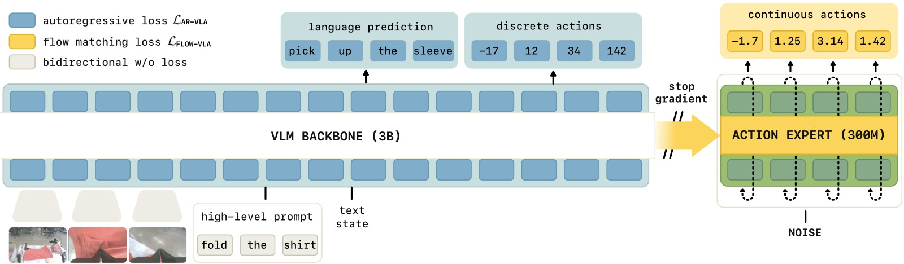
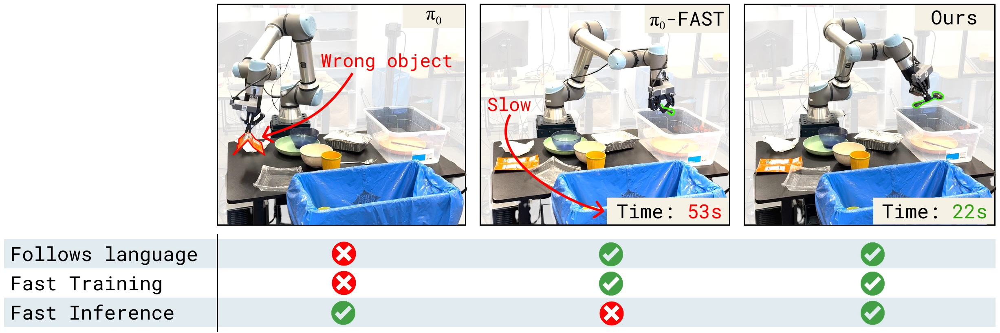
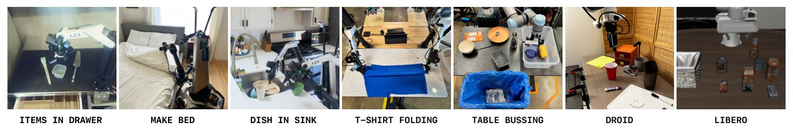
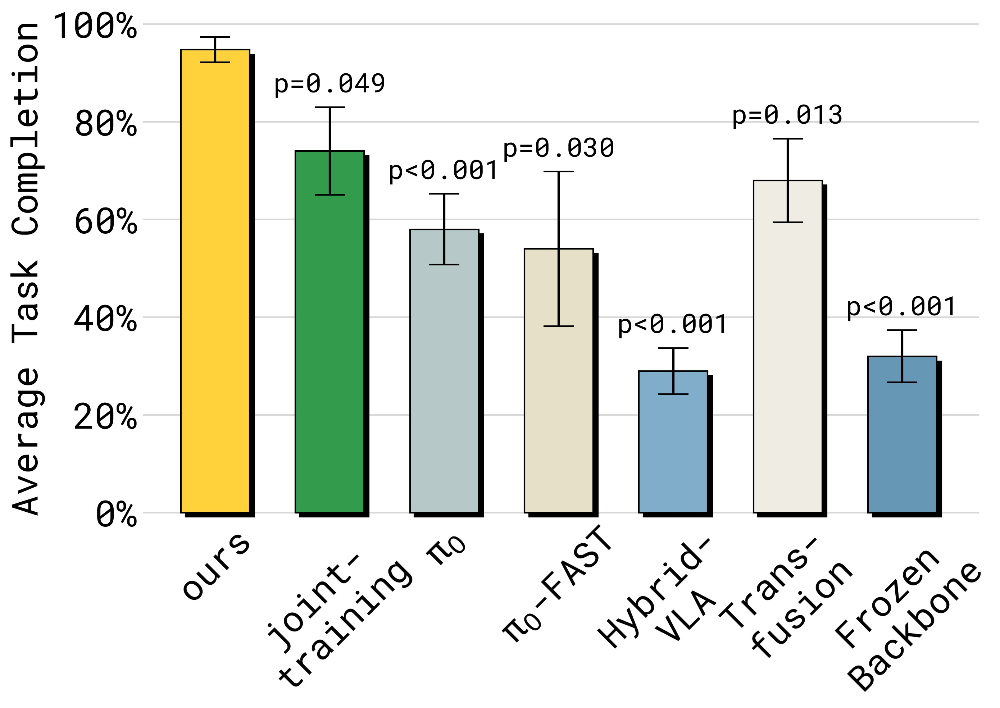
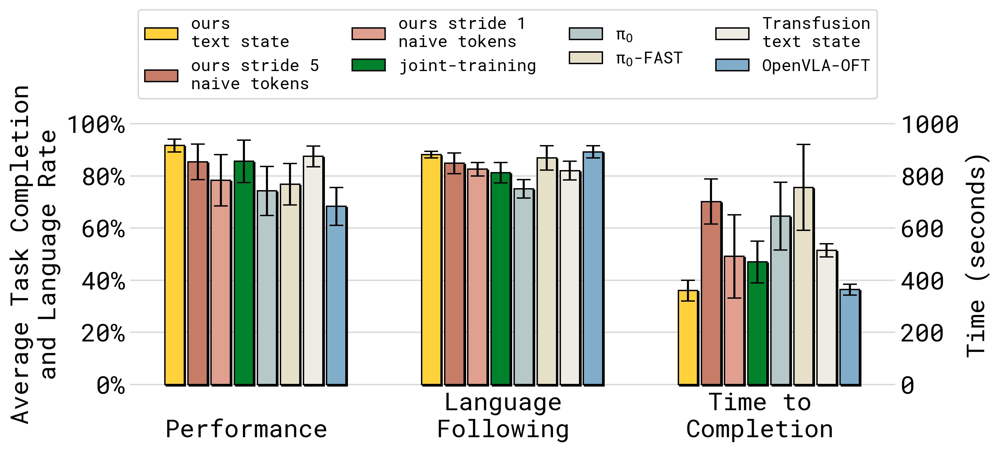
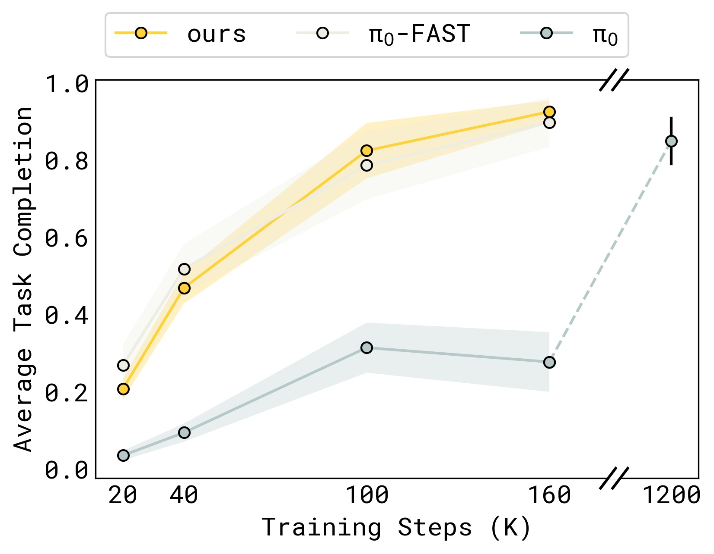
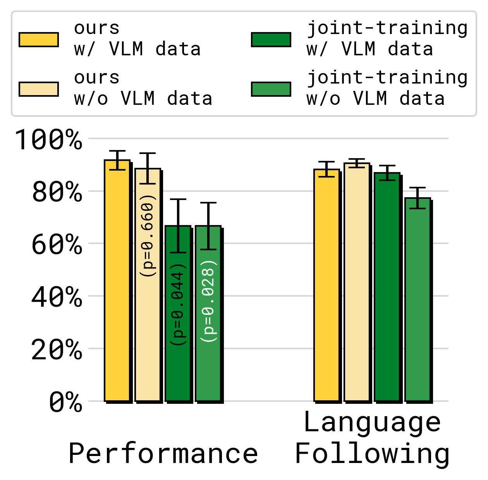
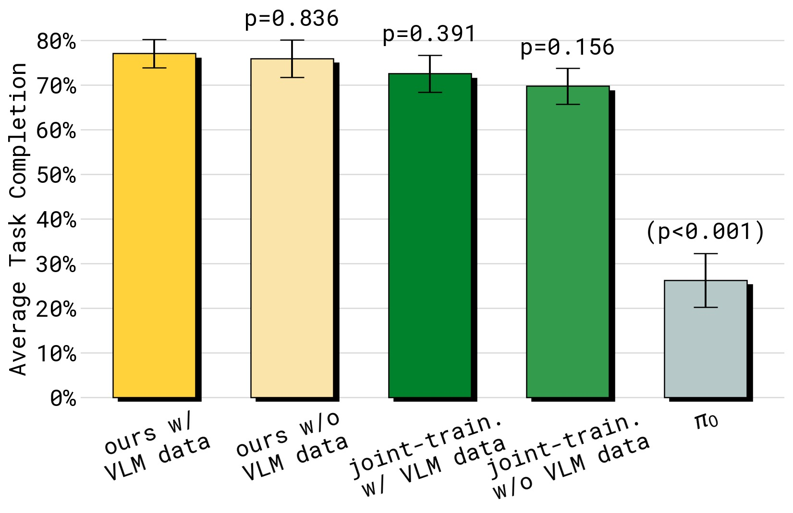
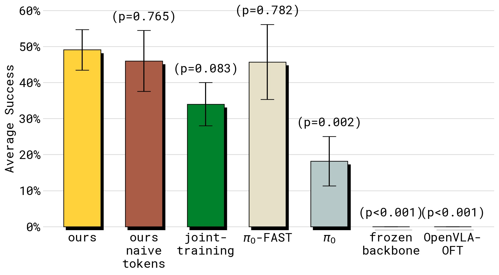

%% mathjax-macros
\ba: \mathbf{a}
\bA: \mathbf{A}
\E: \mathbb{E}
%% end-mathjax-macros

# Knowledge Insulating Vision-Language-Action Models: Train Fast, Run Fast, Generalize Better

> **论文信息**
> - 作者：Danny Driess, Jost Tobias Springenberg, Brian Ichter, Lili Yu, Adrian Li-Bell, Karl Pertsch, Allen Z. Ren, Homer Walke, Quan Vuong, Lucy Xiaoyang Shi, Sergey Levine
> - 机构：Physical Intelligence
> - 投稿方向：NeurIPS 2025 (preprint)
> - arXiv ID：2505.23705
> - 代码：未开源
> - 项目主页：https://pi.website/research/knowledge_insulation

---

## 一、核心问题

VLA 模型面临一个根本性的矛盾：

- **训练效率 + 推理速度** → 需要离散 token + 自回归解码（π₀-FAST），但推理慢（750ms/chunk）
- **快速推理 + 连续精度** → 需要 flow matching action expert（π₀），但训练慢、语言理解退化

具体来说，当你在预训练 VLM 上新增一个**随机初始化的** action expert 来做 flow matching 时，这个模块的梯度会反向传播到 VLM 骨干网络，**破坏**预训练学到的语义知识。结果是：
- 语言指令跟随能力下降（忽略指令，只看图像做动作）
- 训练收敛变慢（需要 7.5× 更多步数）
- 从网络数据迁移知识的能力丧失

反之，如果冻结 VLM 骨干（不让它学），它又没有机器人控制的表示（表现 0%）。所以问题是：**如何让 VLM 骨干学会机器人表示，同时不被 action expert 的随机梯度破坏？**

---

## 二、核心思路 / 方法

### 2.1 Knowledge Insulation（知识绝缘）

核心思想非常简洁——**梯度隔离 + 双路径训练**：



*图1：Knowledge Insulation 的核心设计。VLM 骨干通过离散 FAST action token 的 next-token prediction（交叉熵）学习机器人表示——这是一个成熟的、梯度干净的训练信号。同时，action expert 通过 flow matching 学习连续动作，但其梯度**被截断（stop-gradient）**，不会反向传播到 VLM 骨干。推理时只用 action expert 产生连续动作（快速、精确）。训练时的离散 token 仅是"表示学习辅助目标"——帮助 VLM 学会动作相关的表示，而推理时不需要它。*

### 2.2 三个设计要点

**(1) 联合训练（Joint-training）**

同一个模型同时优化两个目标：
$$\mathcal{L}_{\text{CO-VLA}}(\theta) = \mathbb{E}_{\mathcal{D}, \tau, \omega} \Big[- \sum_{j} M^\ell_j \log p_\theta(\hat{\ell}_{j+1} | x_{1:{j}}) + \alpha M^\text{act} \| \omega - a - f_\theta^a(a^{\tau, \omega})\|^2 \Big]$$

- 第一项：文本 + FAST 离散 action token 的交叉熵（表示学习 + VLM 保持）
- 第二项：flow matching 的 MSE（连续动作生成）
- $\alpha=1$（因为 stop-gradient 后两项梯度独立，不需要权衡）

**(2) Co-training with VLM Data**

在训练中混入通用 VLM 数据（图像描述、VQA、边界框预测）和机器人规划数据（子任务语言标注）。这些数据帮模型保持语义理解能力，抵抗灾难性遗忘。

**(3) Stop-Gradient（梯度截断）**

这是最关键的技术细节。在 self-attention 层中，action expert 可以"读取" VLM 骨干的特征，但梯度不能反向流过：

```
attention probabilities:
┌──────┬──────┐
│ P_bb │   0  │    ← backbone 只看 backbone
├──────┼──────┤
│ P_ab │ P_aa │    ← action expert 看 backbone + 自己
└──────┴──────┘
         ↑
    P_ab 的梯度被 sg() 截断
```

用公式表示——action expert 查询 backbone 的 key 和 value 时：
$$P_{ab} = \text{softmax}(Q_a(X_a) \cdot \text{sg}(K_b(X_b)^T))$$
$$E_a = P_{ab} \cdot \text{sg}(V_b(X_b)) + P_{aa} V_a(X_a)$$

`s(g)` = stop-gradient。Action expert 可以"看见" backbone 的输出，但不能修改它。

### 2.3 对比：Knowledge Insulation 解决了什么



*图2：三类 VLA 方法的问题展示。(a) π₀（Diffusion VLA）——忽略语言指令，抓了垃圾而不是勺子（语言跟随退化）；(b) π₀-FAST（自回归 VLA）——最终能完成任务但推理极慢（750ms/chunk），动作缓慢；(c) Knowledge Insulation（本文）——正确遵循指令、推理快速、训练收敛快。*

| 方法 | 训练速度 | 推理速度 | 语言跟随 | 泛化能力 |
|------|:------:|:------:|:------:|:------:|
| π₀ (纯 flow matching) | 慢 (7.5×) | 快 (100ms) | 差 | 差 |
| π₀-FAST (纯自回归) | 快 | 慢 (750ms) | 好 | 中 |
| Joint-training (无 stop-grad) | 快 | 快 | 中 | 中 |
| **Ours (Knowledge Insulation)** | **快** | **快 (100ms)** | **好** | **好** |
| Freeze backbone | — | 快 | 好 | 不可行 (0%) |

---

## 三、实验与结果

### 3.1 实验设置



*图3：评估任务概览。(a) Items in Drawer——单臂 ARX 将家居物品放入厨房抽屉，在未见环境中评估——需要准确语言跟随（选正确物体）+ 精确操作（开抽屉）；(b) Table Bussing——UR5e 单臂清理桌子，语义分类垃圾/餐具；(c) Shirt Folding——双臂 50Hz 高频叠衣。(d-f) 三个移动双臂任务——dishes in sink、laundry basket、items in drawer（移动版）。所有评估在未见环境进行。*

### 3.2 与 Baseline 的性能对比



*图4：Items in Drawer 任务的性能（左）和语言跟随（右）对比。子图 (a) 任务成功率——Ours 以大幅优势领先，joint-training、π₀ 等基线常因无法打开抽屉而失败；子图 (b) 语言跟随率——stop-gradient 对语言跟随的提升显著，π₀ 和 joint-training（无 stop-grad）明显更差。π₀-FAST 语言跟随好但物理性能差（推理慢 → 动作迟缓 → 打不开抽屉）。HybridVLA 在此任务上表现极差。Freeze backbone 完全不 work（0%）。*



*图5：Table Bussing 任务上多模型/架构的雷达图式对比（含任务完成率、语言跟随率、推理时间、训练步数）。Ours——最高性能、低推理时间、良好语言跟随；π₀-FAST——语言跟随好、性能不错，但需要 2 倍时间（wall clock）才能完成同样任务（推理太慢）；π₀——语言跟随差；OpenVLA-OFT——推理快但整体性能最低；Transfusion——表现不错但比 Ours 慢；Naive tokens（用 naive binning 替代 FAST）——比纯 flow matching 好但不如 FAST。*

### 3.3 训练收敛速度



*图6：Table Bussing 任务上不同方法的训练曲线（纵轴：任务成功率，横轴：训练步数）。Ours 与 π₀-FAST 收敛一样快，但 π₀（纯 flow matching）训练极慢——需要约 7.5 倍步数才能达到类似性能。这直接证明了"仅用 flow matching 训练"的瓶颈，以及离散 token 作为表示学习辅助目标的有效性。*

### 3.4 通用策略与泛化



*图7：通用策略（跨具身训练）在 Table Bussing 任务上的表现。Ours 保持了与单具身专才模型可比的性能；joint-training（无 stop-grad）在通用策略场景下性能下降更多——表明知识绝缘在跨具身大量数据训练中尤为关键。去除 VLM co-training 数据导致任务完成率略降，而去除 VLM 数据对 joint-training 的语言跟随影响最大——说明 VLM 数据在梯度无约束的情况下更重要，用于抵抗灾难性干扰。*



*图8：移动操作任务（四个任务平均）和语言泛化实验。(a) 四个移动操作任务在未见环境中的平均性能——Ours 全方位领先；(b) 语言泛化到分布外（OOD）物体——co-training VLM 数据对 OOD 泛化最关键，去除 VLM 数据导致 OOD 性能大幅下降。这验证了 VLM co-training 作为"知识桥梁"的作用——网络数据中的物体知识帮助模型识别全新类别的物体。*



*图9：Shirt Folding（50Hz 高频双臂叠衣）任务的性能对比。这是对物理精度要求最高的任务。Freeze backbone 和 OpenVLA-OFT 在此完全失败（0%）；π₀ 也表现不佳（被单具身大数据混合训练拖累）；Ours 在所有方法中明显最优。这说明 stop-gradient + 离散表示学习不仅保护语义知识，也保护了精细物理技能的习得。*

### 3.5 LIBERO Benchmark

| 方法 | Spatial | Object | Goal | 10 (Long) | 90 |
|------|:------:|:------:|:----:|:---------:|:-----:|
| Baku | — | — | — | 86.0 | 90.0 |
| MoDE | — | — | — | 94.0 | 95.0 |
| OpenVLA-OFT | 97.6 | 98.4 | **97.9** | **94.5** | — |
| π₀ | 96.8 | **98.8** | 95.8 | 85.2 | — |
| π₀-FAST | 96.4 | 96.8 | 88.6 | 60.2 | — |
| **Ours (from generalist)** | **98.0** | 97.8 | 95.6 | 85.8 | **96.0** |

在 LIBERO-Spatial 和 LIBERO-90 上达到 **SOTA**。

---

## 四、关键洞察与技术亮点

### 4.1 "不传播梯度"反而更好

这是反直觉的核心发现：当你给 VLM 新增一个随机初始化的 action expert 时，**不让它的梯度反向传播**反而是更好的策略。原因：action expert 可以"读"VLM 特征来生成动作，但 VLM 特征不应该被随机权重的不成熟梯度破坏。

### 4.2 离散 Token 作为"安全的表示学习信号"

FAST 离散 token（DCT+BPE）在这里扮演了一个巧妙的角色——不是用于推理（推理用 flow matching），而是**仅用作训练时的表示学习辅助目标**。交叉熵损失是"安全"的——它不会产生大梯度冲击 VLM 骨干。

### 4.3 Attention 级别的梯度截断

stop-gradient 不是简单的"冻结参数"——它只截断了从 action expert 到 backbone 的梯度路径，但 **backbone 仍然通过 FAST token 的交叉熵损失在学习**。这比"冻结 backbone"（0% 性能）和"完全放开"（语言退化）都要好。

### 4.4 统一框架的简洁性

过去的方法需要两阶段（先离散预训练，再加 action expert 后训练，如 π₀.₅），而 Knowledge Insulation 在**单个训练阶段**同时完成两者。训练时间增加约 20%，但由于收敛速度的提升，实际 wall-clock 时间反而更短。

---

## 五、局限性

1. **训练时的计算开销**：双路径训练增加约 20% 计算成本（但被快速收敛抵消）
2. **语言跟随仍不完美**：训练数据中的分布偏差仍会导致模型偶尔忽略语言指令
3. **仅研究了 π₀ 系列架构**：未验证在其他 VLA 架构（如 GROOT）上的效果
4. **代码和模型未开源**

---

## 六、关键概念速查

| 术语 | 解释 |
|------|------|
| **Knowledge Insulation** | 通过 stop-gradient 阻止 action expert 梯度破坏 VLM 骨干 |
| **Joint-training** | 同时用交叉熵（离散 token）和 flow matching（连续动作）训练 |
| **Stop-gradient** | 在 attention 层截断 action expert 到 backbone 的梯度流 |
| **FAST token** | DCT+BPE 压缩的动作 token，仅作训练时的表示学习辅助 |
| **Action Expert** | 独立的小型 Transformer 权重集，处理连续动作的流匹配 |
| **VLM co-training** | 将 VQA/图像描述/边界框预测等数据混入训练以保护语义知识 |
| **P_ab, P_bb, P_aa** | 注意力概率矩阵的分块：action→backbone, backbone→backbone, action→action |

---

## 七、Knowledge Insulation 梯度流示意

```
        VLM Backbone                     Action Expert
    (PaliGemma 3B, 预训练)             (300M, 随机初始化)
              │                              │
              │  ┌──────────────────┐        │
              │  │  FAST Token Loss │        │
              ├──┤  (Cross-Entropy) │        │
              │  │  → 更新 backbone │        │
              │  └──────────────────┘        │
              │                              │
              │     Attention:               │
              │  ┌─────────────────────┐     │
              │  │ P_ab = softmax(     │     │
              │  │   Q_a(X_a) ·        │     │
              │  │   sg(K_b(X_b))^T    │◄────┤  读取 backbone 特征
              │  │ )                   │     │
              │  └─────────────────────┘     │
              │         ↑                    │
              │    sg() = stop-gradient      │
              │    (梯度不能从 action expert   │
              │     反向传播到 backbone)       │
              │                              │
              │                          ┌───┴──────────────┐
              │                          │ Flow Matching Loss│
              │                          │ (MSE)             │
              │                          │ → 更新 action      │
              │                          │   expert only     │
              │                          └──────────────────┘

   结果:  ▷ backbone 学到机器人表示 (via FAST CE loss)
         ▷ action expert 学到连续动作 (via FM MSE loss)
         ▷ backbone 的语义知识被保护 (gradient blocked)
         ▷ 推理时只用 action expert → 快速 + 精确
```

---

## 八、与 π₀、π₀-FAST、π₀.₅ 的关系

```
π₀-FAST (2025.01)                   π₀ (2024.10)
动作 tokenization (DCT+BPE)         流匹配 action expert
训练快, 推理慢                       训练慢, 推理快
         │                                │
         └────────────┬───────────────────┘
                      │
              ┌───────┴───────┐
              │               │
        π₀.₅ (2025.04)   Knowledge Insulation (本文)
        两阶段训练          单阶段训练
        先离散预训练        离散 + 连续 同时
        再加 action expert  + stop-gradient
                           + VLM co-training
```

Knowledge Insulation 将 π₀.₅ 的"两阶段"做法形式化并优化为**单阶段**——同时获得了训练速度、推理速度和语言泛化的最佳组合。

---

*笔记生成日期：2026-05-14*
