%% mathjax-macros
\ba: \mathbf{a}
\bv: \mathbf{v}
\bu: \mathbf{u}
\bo: \mathbf{o}
\bq: \mathbf{q}
\bg: \mathbf{g}
\bI: \mathbf{I}
\bX: \mathbf{X}
\bA: \mathbf{A}
\E: \mathbb{E}
\lang: \ell
\rawtext: \hat{\ell}
\data: \mathcal{D}
\piref: \pi_\text{ref}
%% end-mathjax-macros

# π₀.₇: A Steerable Generalist Robotic Foundation Model with Emergent Capabilities

> **论文信息**
> - 作者：Physical Intelligence（Bo Ai, Ali Amin, ..., Ury Zhilinsky 等 100+ 人）
> - 通讯作者：Physical Intelligence
> - 投稿方向：IEEE 会议（conference），under review
> - arXiv ID：2604.15483v2
> - 代码：https://pi.website/pi07
> - 模型规模：5B 参数（4B VLM 骨干 + 860M Action Expert）

---

## 一、核心问题

机器人基础模型（VLA）虽然取得了很大进展，但**组合泛化（compositional generalization）**能力一直缺失。具体表现为：

1. **训练数据与测试性能矛盾**：先前的 VLA 如果直接用在多样、混合质量（包含失败案例、次优自主数据）的数据上训练，模型会"平均化"不同行为模式，导致性能下降。因此研究者不得不精心筛选高质量数据，但这又会丢弃大量有价值的信息。
2. **缺乏真正的"涌现"泛化**：之前的模型很难在新的任务上组合已学技能，也无法在不同机器人形态之间零样本迁移灵巧操作技能。
3. **语言指令遵循脆弱**：先前的模型在面对训练数据中存在强烈偏好的场景时，往往忽视语言指令，直接复制数据中的常见行为。

> 论文核心主张：通过**多样化的 prompt 条件化（diverse prompting）**，可以让 VLA 利用更大、更多样、质量更混合的数据集，从而涌现出组合泛化、跨形态迁移和复杂指令遵循等能力。

---

## 二、核心思路 / 方法

### 2.1 总体思想：Prompt Diversification

π₀.₇ 的关键创新不是新架构，而是**在训练时为模型提供更丰富、更多模态的上下文（context）**，不仅告诉模型"做什么"（what），还告诉它"怎么做"（how）。这些上下文包括：

1. **子任务指令（Subtask Instructions）**：细粒度的语言描述（如"打开冰箱门"），而非仅给出粗粒度的任务描述（如"清理厨房"）
2. **子目标图像（Subgoal Images）**：多视角的未来目标图像，由轻量级世界模型生成，展示"做完这一步后世界应该是什么样子"
3. **Episode 元数据（Episode Metadata）**：
   - Overall Speed：episode 的步数
   - Overall Quality：1-5 的质量评分
   - Mistake：是否出错的标签
4. **控制模式（Control Mode）**：关节空间（joint）或末端执行器（ee）

### 2.2 模型架构

```
┌─────────────────── π₀.₇ 架构 (5B 参数) ───────────────────┐
│                                                              │
│  ┌──────────────────────────────────────┐                   │
│  │          VLM 骨干 (Gemma3 4B)         │                   │
│  │  ┌─────────────────────────────────┐ │                   │
│  │  │  MEM 视觉编码器 (历史帧压缩)      │ │                   │
│  │  │  - 最多 4 视角 × 6 帧历史         │ │                   │
│  │  │  - 时空压缩 → 固定 token 数       │ │                   │
│  │  │  - 子目标图像也经同一编码器       │ │                   │
│  │  └─────────────────────────────────┘ │                   │
│  │  ┌─────────────────────────────────┐ │                   │
│  │  │  文本 Token (Task + Subtask +    │ │                   │
│  │  │    Metadata + Control Mode)      │ │                   │
│  │  │  + 本体征 token (线性投影)        │ │                   │
│  │  └─────────────────────────────────┘ │                   │
│  │         ↓ 双向注意力 + 因果注意力     │                   │
│  └──────────────────────────────────────┘                   │
│                          ↓                                   │
│  ┌──────────────────────────────────────┐                   │
│  │     Action Expert (860M Transformer)  │                   │
│  │  - Flow Matching 目标                │                   │
│  │  - 50 步 action chunk                │                   │
│  │  - Adaptive RMSNorm (时间步注入)      │                   │
│  │  - 训练时 RTC (0-12 步延迟模拟)       │                   │
│  │  - 推理时 5 步去噪 + CFG             │                   │
│  └──────────────────────────────────────┘                   │
│                          ↓                                   │
│                    50 步动作序列                              │
└──────────────────────────────────────────────────────────────┘
```

**注意力掩码设计**：
- 观测 token 与子目标图像 token 各自内部使用双向注意力
- 子目标图像 token 可额外关注观测 token
- 文本 token 使用因果注意力
- 遵循 Knowledge Insulation (KI) 训练范式：VLM 骨干用 FAST token 监督（离散 CE loss），Action Expert 的梯度不回传到 VLM 骨干

### 2.3 训练数据构成

π₀.₇ 的训练数据远超传统的"高质量演示数据"范畴：

| 数据类型 | 描述 |
|---------|------|
| 高质量演示数据 | 多机器人、多环境、双手/单手的人类遥操作数据 |
| 次优自主数据 | 先前模型（如 π*₀.₆ 的 RL 训练 rollout）的评估数据，包含失败 |
| 人工干预数据 | 策略执行中人类介入修正的数据 |
| 开源机器人数据 | Open X-Embodiment 等外部数据集 |
| 自我中心人类视频 | 人类执行日常任务的视频 |
| 非机器人网络数据 | 包括目标定位、属性预测、VQA、图像描述等 |

关键是：通过 episode metadata 标注数据质量，模型可以在训练时区分"这是高质量演示"和"这是一个失败案例"，从而避免"平均化"问题。

### 2.4 运行时推理流程

```
测试时推理流程：

┌──────────────┐    ┌──────────────┐    ┌──────────────┐
│  高层语言策略  │    │  世界模型      │    │  元数据组装   │
│  (同架构 4B)  │    │  (BAGEL 14B) │    │              │
│              │    │              │    │ Speed: 15th  │
│  → ℓ̂_t      │    │  → g_t       │    │  percentile  │
│              │    │              │    │ Quality: 5   │
│              │    │  异步生成     │    │ Mistake: false│
└──────┬───────┘    └──────┬───────┘    └──────┬───────┘
       │                   │                   │
       └───────────────────┼───────────────────┘
                           │
                    ┌──────┴──────┐
                    │   π₀.₇ VLA │
                    │  (5B)       │
                    │  5步去噪    │
                    │  +CFG       │
                    └──────┬──────┘
                           │
                    50步 action chunk
                    执行 15-25 步
```

**异步执行策略**：
- 子目标图像在高阶语义变化时或每隔 4 秒重新生成
- VLA 推理和子目标生成在不同线程异步进行
- 推理速度：最简配置 38ms，完整配置（MEM + 子目标）127ms
- 世界模型子目标生成：1.25 秒（4×H100，8-bit 量化）

---

## 三、训练目标

### 3.1 VLA 主目标

$$\max_{\theta} \; \E_{\data} \left[\log \pi_{\theta}(\ba_{t:t+H} \mid \bo_{t-T:t}, \mathcal{C}_t)\right]$$

其中上下文 $\mathcal{C}_t = \{\lang_t, \rawtext_t, \bg_t, m, c\}$ 包含任务描述、子任务指令、子目标图像、元数据和控制模式。

Action Expert 使用 Flow Matching 目标（近似下界，非闭式对数似然）。

### 3.2 世界模型训练（子目标生成）

$$\max_{\psi}\; \E_{\data_g} \left[ \mathcal{L}_\text{CFM} \left( \bg_t^{\star},\; g_\psi(\bo_t,\rawtext_t,m) \right) \right]$$

- 从 BAGEL (14B MoT) 初始化
- 训练目标图像：segment 结束帧 $\bg_t^{\star} = \bo_{t_{\mathrm{end}}}$
- 混合机器人数据、人类视频数据、开源图像编辑和视频数据集

### 3.3 Prompt Dropout 策略

训练时随机丢弃各 prompt 组件，确保推理时的灵活性：

| 组件 | Dropout 策略 |
|-----|-------------|
| 子目标图像 | 仅 25% 样本包含；其中 30% 同时丢弃 ℓ̂ |
| Episode Metadata | 15% 完全丢弃；各子项独立 5% 丢弃 |
| 历史帧 | 30% 概率丢弃全部历史 |
| 后视角图像 | 30% 丢弃 |
| Control Mode | 不丢弃 |

### 3.4 Classifier-Free Guidance (CFG)

推理时对 episode metadata 施加 CFG，引导生成高质量动作：

$$\nabla_\ba \log \pi_\theta(\ba \vert \bo_t, \mathcal{C}_t) + \beta( \nabla_\ba \log \pi_\theta(\ba \vert \bo_t, \mathcal{C}_t) - \nabla_\ba \log \pi_\theta(\ba \vert \bo_t, \mathcal{C}_t^\text{uncond}))$$

$\beta \in \{1.3, 1.7, 2.2\}$，中等强度引导，仅用于灵巧操作任务。

---

## 四、实验与结果

### 4.1 开箱即用的灵巧操作性能（Out-of-the-box Dexterity）

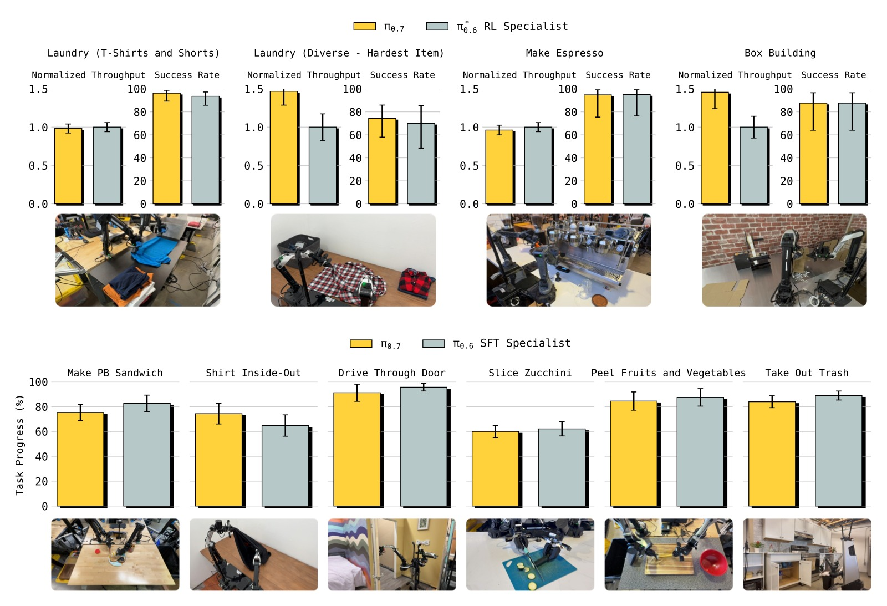

*图1：π₀.₇ 在多种高灵巧度任务上的开箱即用性能。上图对比 RL 训练后的 π*₀.₆ 专家模型（咖啡制作、盒子折叠、衣物折叠），下图对比 SFT 专家模型（花生酱三明治、翻面T恤、过门、切西葫芦、削皮果蔬、换垃圾袋）。π₀.₇ 无需任何任务特定的后训练即可匹配甚至超越专家模型。*

**关键数据**：
- **咖啡制作**：π₀.₇ 成功率接近 RL 专家，归一化吞吐量（normalized throughput）接近 1.0
- **衣物折叠**：π₀.₇ 的吞吐量**超过** RL 专家（>1.0），即一个通用模型比专用 RL 模型更快
- **盒子折叠**：同样吞吐量超过 RL 专家
- 所有 π*₀.₆ 任务上，π₀.₇ 的归一化吞吐量在 0.8-1.2 之间，成功率与专家模型可比

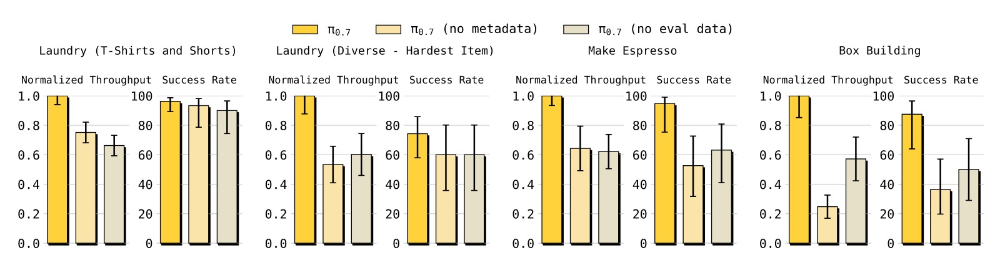

*图2：接入自主评估数据和 episode metadata 对性能的重要性消融实验（均在 π*₀.₆ 发布任务上评估）。对比三个模型：π₀.₇（完整版）、π₀.₇ (no eval data)、π₀.₇ (no metadata)。*

**消融发现**：
- **移除 metadata**：所有任务的归一化吞吐量显著下降（部分任务降至 0.4-0.6），说明即使有自主数据，没有 metadata 也无法有效利用
- **移除评估数据**：吞吐量下降约 20-40%，但因为有 metadata 仍保留一定性能
- 两者结合（完整 π₀.₇）在吞吐量上有最优表现，验证了"多样数据 + 丰富上下文"的协同效应

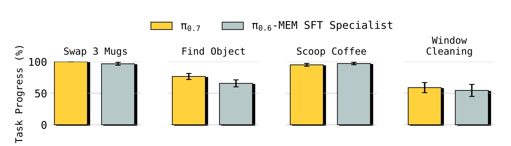

*图3：π₀.₇ 在需要显式记忆的任务上同样匹配甚至超越 MEM 论文中的任务特定精调专家模型，无需任何精调。*

### 4.2 指令遵循

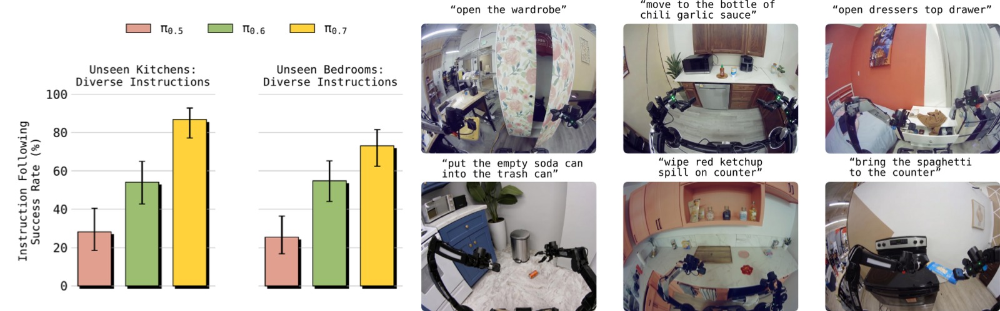

*图4：π₀.₇ 在 14 个指令遵循场景上的表现，涉及 4 个未见过的厨房和 2 个未见过的卧室环境，每个场景包含 3-6 步指令序列。报告的是指令遵循成功率（正确执行的指令占全部指令的百分比）。*

**关键发现**：
- π₀.₇ 显著超越 π₀.₅ 和 π₀.₆，在所有场景上达到高绝对成功率（多数 >80%）
- 指令场景包括：物品整理、与家具交互、清理溢出物等真实任务
- 新环境 + 开放词汇指令的组合对之前模型是巨大挑战，但 π₀.₇ 表现出色

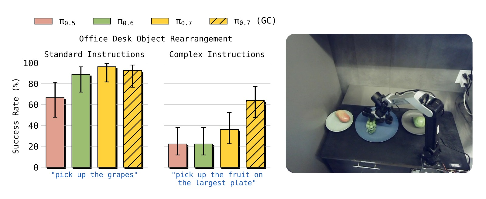

*图5：π₀.₇ 和 π₀.₇ (GC) 在复杂指称指令上的优势。将指令分为"标准"（训练数据中常见的表达方式）和"复杂"（不寻常的语言或空间指称）。复杂指令示例："pick up the object I would use to eat soup"、"pick up the fruit on the largest plate"。*

- **标准指令**：所有模型表现都较好（>80%），但 π₀.₇ 仍领先
- **复杂指令**：π₀.₅ 和 π₀.₆ 降至约 30-40%，而 π₀.₇ 达到约 60-70%
- **加入子目标图像（π₀.₇ (GC)）**：进一步提升约 10-15 个百分点，因为世界模型可以将语义理解转化为视觉提示

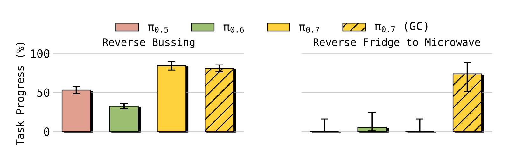

*图6："Reverse Bussing" 和 "Reverse Fridge to Microwave" 两个反常识任务。在 Reverse Bussing 中，要求把垃圾放入餐具桶、把餐具放入垃圾桶；在 Reverse Fridge to Microwave 中，要求从微波炉取出食物放入冰箱（训练数据中只有反方向）。*

- π₀.₅ 和 π₀.₆ 在这些反偏好任务上几乎完全失败（接近 0%）
- π₀.₇ 在 Reverse Bussing 上达到约 50-60% 成功率
- Reverse Fridge to Microwave 上，π₀.₇ 单独约 20%，加入子目标图像（GC）后跃升至 >60%
- 这证明 π₀.₇ 能足够的关注语言指令，克服数据中的强偏见

### 4.3 跨形态迁移（Cross-Embodiment Transfer）

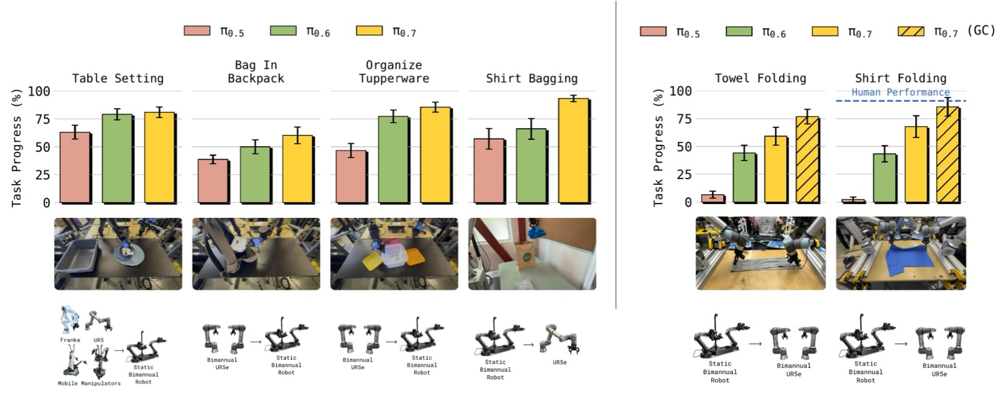

*图7：从源机器人到目标机器人的零样本迁移。左侧：较简单的物体重新排列任务。右侧：高灵巧度的衣物折叠任务。在最大形态差距的场景（Shirt Bagging 和 Shirt Folding）中，π₀.₇ 显著优于之前模型。*

**迁移任务的分层难度**：
1. **Table Setting（简单）**：数据来自多种机器人 → 所有模型都表现好
2. **Bag in Backpack / Organize Tupperware（中等）**：数据仅来自大型 UR5e，在小型双臂机器人上测试 → π₀.₅ 失败，π₀.₆ 和 π₀.₇ 仍表现好
3. **Shirt Bagging（难）**：数据来自小型双臂机器人，在**单臂** UR5e 上测试 → π₀.₇ 显著领先
4. **Shirt/Towel Folding（极难）**：高灵巧度折叠任务从轻型双臂机器人迁移到重型 UR5e 双臂平台 → 仅 π₀.₇ 成功

**与人类对比（Shirt Folding on UR5e）**：
- 10 名经验丰富的遥操作员（平均 375 小时经验，top 2%）
- 人类零样本性能：90.9% 任务进度，80.6% 成功率
- π₀.₇ (GC)：85.6% 任务进度，80% 成功率
- π₀.₇ 与经验最丰富的人类操作员处于**同一水平**

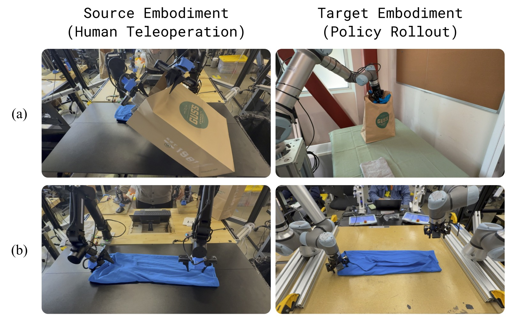

*图8：跨形态迁移中涌现的适应策略。(a) 源机器人的遥操作员用一只手撑开包口、另一只手放入物品，而 π₀.₇ 在 UR5e 上涌现出更适合单臂长臂展的"拾取-放置"策略。(b) 源机器人上操作员倾斜夹爪靠近布料，π₀.₇ 在 UR5e 上使用更垂直的抓取方式，更适合重型臂的运动学。*

### 4.4 组合任务泛化

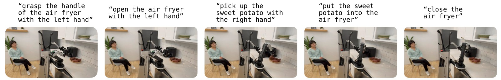

*图9：π₀.₇ 可以通过逐步语言指令"教练"执行全新任务（如使用空气炸锅烹饪红薯），即使从未见过该任务的任何动作数据。*

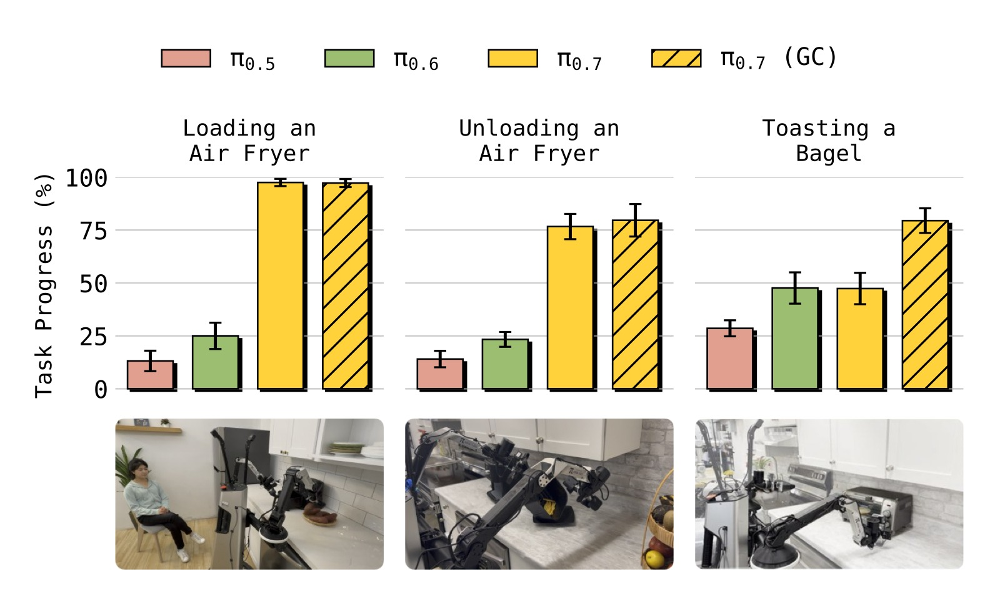

*图10：三个全新多阶段厨房任务的教练结果：(1) Loading an Air Fryer（打开空气炸锅 → 放入红薯 → 关闭），(2) Unloading an Air Fryer（拉出炸篮 → 倒出食物），(3) Toasting a Bagel（放入贝果 → 旋转旋钮 → 取盘 → 上菜）。*

- π₀.₅ 和 π₀.₆ 在这些全新任务上几乎完全失败（接近 0%）
- π₀.₇ (language) 达到约 40-60% 成功率
- π₀.₇ (GC) 进一步提升到 50-70%
- 无需收集任何新的遥操作数据！

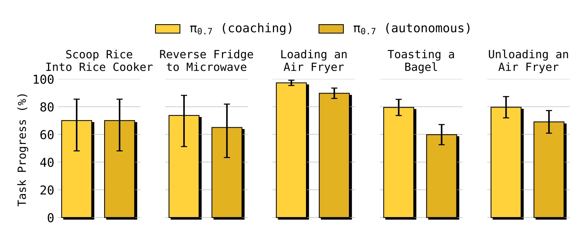

*图11：利用教练数据训练高层语言策略，实现完全自主运行。对 5 个全新任务，π₀.₇ (autonomous) 可以接近匹配人工教练的性能（π₀.₇ (coaching)），且完全不需要收集动作数据！*

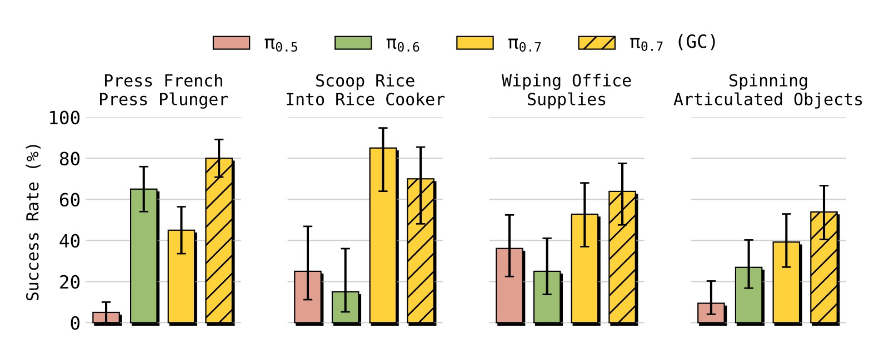

*图12：π₀.₇ 可以直接执行许多未见过的短程任务（开箱即用），包括：用米饭勺从米桶舀米放入电饭煲、旋转齿轮组和桌面风扇、用布擦拭尺子和耳机等办公用品。成功率范围 40-80%。*

### 4.5 多样化数据的扩展性研究

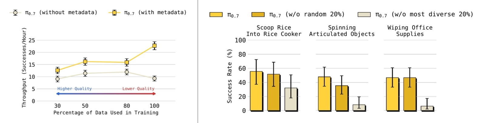

*图13：左图：π₀.₇（带 metadata）在数据量增加时持续提升性能，即使增量数据的平均质量下降；而 π₀.₇（无 metadata）在加入更多低质量数据后性能反而下降。右图：移除任务多样性最高的 20% 数据导致泛化性能显著下降，而移除随机 20% 数据影响很小。*

**关键结论**：
- **Metadata 使得"更多数据"始终有益**：数据量从 top 30% → top 50% → top 80% → 100%，带 metadata 的模型性能单调提升；无 metadata 的模型在 top 50% 后恶化
- **任务多样性驱动泛化**：移除多样性最高的 20% 数据比移除随机 20% 数据对泛化能力的损害大得多

---

## 五、关键洞察与技术亮点

### 5.1 "先想再做"的价值
在训练中即使只包含一个 latent token（比纯 action-only 多一个"思考"步骤），性能就已经优于直接输出动作——这个概念来自之前的 π₀.₅/π₀.₆ 工作，π₀.₇ 将其扩展到了多模态的"思考"。

### 5.2 子目标图像 = 行为规范的桥梁
子目标图像本质上将"做什么"转化为了"世界应该长什么样"。这解决了语言无法描述的细节问题（如"整洁折叠的 T 恤"的具体形态）。此外，世界模型从 Web 预训练中获得的语义知识可以通过子目标图像"注入"到机器人策略中。

### 5.3 Metadata 的"蒸馏"作用
通过 metadata 标注 episode 质量，π₀.₇ 可以从 RL 专家的 rollout 中学习（甚至包含失败），将专家能力蒸馏回一个通用模型。这相当于"用数据而非梯度"进行知识迁移。

### 5.4 涌现的形态适应策略
π₀.₇ 在跨形态迁移中并不只是"复刻"源机器人的动作轨迹，而是涌现出适应目标形态的新策略（如单臂替代双臂、垂直抓取替代倾斜抓取）。这说明模型从多样数据中学习了关于"任务目标"和"物理约束"的更深层理解。

### 5.5 Prompt Dropout 的关键性
通过随机 dropout 每个 prompt 组件，π₀.₇ 可以在推理时灵活使用任意子集的 prompt。这为 CFG（Classifier-Free Guidance）提供了可能——对 metadata 做 CFG 相当于"告诉模型做得更好"。

---

## 六、局限性

1. **零样本泛化成功率仍有限**：虽然 π₀.₇ 在零样本设置下表现显著超越前人，但成功率通常在 60-80% 范围，低于分布内任务（>90%）。离"任意任务的可靠部署"还有距离。

2. **"真正新颖"的难以界定**：训练数据量极大且多样，很难确定哪些任务"真正未见过"。论文坦诚承认这一点，认为这类似于 LLM 的评估困境——本质上是"组合性"本身的特点。

3. **世界模型推理成本高**：子目标图像生成需 4×H100 GPU 和约 1.25 秒延迟（虽然通过异步执行缓解），限制了实际部署场景。

4. **单任务性能可能不如 SFT 专家**：在某些任务上，π₀.₇ 只是"匹配"而非超越专用模型。

---

## 七、关键概念速查

| 概念 | 说明 |
|------|------|
| **VLA (Vision-Language-Action)** | 视觉-语言-动作模型，机器人基础模型的主流范式 |
| **Flow Matching** | 连续归一化流的简化版，用于建模多模态动作分布 |
| **MEM** | Memory-based vision encoder，将多帧历史压缩为固定 token 数 |
| **Knowledge Insulation (KI)** | 训练技巧：VLM 骨干用 CE loss，Action Expert 的梯度不回传 VLM |
| **RTC (Real-Time Chunking)** | 实时动作分块，训练时模拟推理延迟以生成平滑动作轨迹 |
| **CFG (Classifier-Free Guidance)** | 在推理时对条件/无条件输出的差值加权，引导生成更高质量动作 |
| **BAGEL** | 14B 图像理解/编辑/生成 MoT 模型，作为子目标世界模型的初始化 |
| **FAST Tokens** | 用于 KI 训练中的 VLM 骨干监督信号 |
| **SuSIE** | 子目标图像条件化策略（"See Subgoal, then Execute"） |
| **Prompt Expansion** | 将简短 prompt 扩展为丰富的多模态上下文，源自图像/视频生成领域 |
| **Coaching** | 通过逐步语言指令"教"机器人执行新任务，无需收集新的动作数据 |
