%% mathjax-macros
\ba: \mathbf{a}
\bv: \mathbf{v}
\bu: \mathbf{u}
\bo: \mathbf{o}
\bq: \mathbf{q}
\bI: \mathbf{I}
\bA: \mathbf{A}
\E: \mathbb{E}
%% end-mathjax-macros

# π₀: A Vision-Language-Action Flow Model for General Robot Control

> **论文信息**
> - 作者：Physical Intelligence (Kevin Black, Noah Brown, Danny Driess, Adnan Esmail, Michael Equi, Chelsea Finn, Niccolo Fusai, Lachy Groom, Karol Hausman, Brian Ichter, Szymon Jakubczak, Tim Jones, Liyiming Ke, Sergey Levine, Adrian Li-Bell, Mohith Mothukuri, Suraj Nair, Karl Pertsch, Lucy Xiaoyang Shi, James Tanner, Quan Vuong, Anna Walling, Haohuan Wang, Ury Zhilinsky)
> - 通讯作者：research@physicalintelligence.company
> - 投稿方向：arXiv 预印本 (2024.10.31)
> - arXiv ID：2410.24164
> - 代码：未开源（论文中未提供代码仓库链接）
> - 项目主页：https://physicalintelligence.company/blog/pi0

---

## 一、核心问题

机器人学习面临三大瓶颈：

1. **数据稀缺**：高质量机器人操控数据获取成本极高，单一任务的数据量远不足以训练通用模型。
2. **泛化能力不足**：在特定任务、特定机器人上训练的模型，难以迁移到新任务、新场景、新物体。
3. **灵巧操作的复杂性**：高精度、高频率（50Hz）的连续动作控制（如叠衣服、组装纸箱）需要模型能够表示复杂的多模态动作分布。

本文的核心主张是：**通用机器人策略（robot foundation model）可以通过大规模跨具身预训练 + 针对性后训练的两阶段范式来解决上述问题**——这与 LLM 的 pre-training / post-training 分离策略高度相似。

---

## 二、核心思路 / 方法

### 2.1 总体框架

π₀ 的训练分为两个阶段：

- **预训练阶段（Pre-training）**：在包含 10,000+ 小时机器人数据的超大规模混合数据集上训练，使模型获得广泛的物理交互知识和基本的零样本任务能力。
- **后训练阶段（Post-training）**：在高质量、任务特定的精标数据上微调，使模型掌握流畅、高效、鲁棒的任务执行策略。

直觉解释：预训练数据多样但质量参差不齐，教会模型"如何从错误中恢复"；后训练数据高质量但覆盖面窄，教会模型"如何把任务做好"。两者结合才能实现既鲁棒又高效的行为。

### 2.2 模型架构

π₀ 的架构设计围绕三个核心创新：

**（1）VLM 骨干网络初始化**

模型基于 PaliGemma（3B 参数 VLM）初始化，继承了互联网规模的语义知识和视觉理解能力。PaliGemma 使用 late fusion 架构：图像通过 ViT 编码器嵌入到与语言 token 相同的嵌入空间。

**（2）Action Expert（动作专家）—— Mixture of Experts 设计**

在标准 VLM 基础上，π₀ 增加了一个独立的"动作专家"模块（~300M 参数），总参数量约 3.3B。动作专家使用独立的 Transformer 权重处理机器人专有的输入/输出：

- 输入：本体感知状态（关节角度）$\bq_t$、噪声动作 $\bA_t^\tau$
- 输出：去噪向量场 $\bv_\theta(\bA_t^\tau, \bo_t)$

VLM 骨干和动作专家只在 self-attention 层中交互，各自使用独立的 FFN 权重。这类似于两元素的 Mixture of Experts。

**（3）Flow Matching 动作生成**

π₀ 使用条件流匹配（conditional flow matching）来建模连续动作分布，而非自回归离散化：

- 动作表示为 **action chunk**：$\bA_t = [\ba_t, \ba_{t+1}, ..., \ba_{t+H-1}]$，其中 $H=50$
- 训练目标：$\mathcal{L}^\tau(\theta) = \mathbb{E}_{p(\bA_t|\bo_t), q(\bA_t^\tau|\bA_t)} ||\bv_\theta(\bA_t^\tau, \bo_t) - \bu(\bA_t^\tau|\bA_t)||^2$
- 概率路径：$q(\bA_t^\tau | \bA_t) = \mathcal{N}(\tau \bA_t, (1-\tau)\mathbf{I})$（线性-高斯路径）
- 噪声动作：$\bA_t^\tau = \tau \bA_t + (1-\tau)\epsilon$，其中 $\epsilon \sim \mathcal{N}(\mathbf{0}, \mathbf{I})$
- 网络学习去噪向量场：$\bu(\bA_t^\tau | \bA_t) = \epsilon - \bA_t$

推理时从 $\tau=0$ 到 $\tau=1$ 用前向 Euler 积分（10 步，$\delta=0.1$）从随机噪声生成动作：
$$\bA_{t}^{\tau + \delta} = \bA_{t}^{\tau} + \delta \bv_\theta(\bA_t^\tau, \bo_t)$$

### 2.3 注意力掩码设计

使用分块因果注意力掩码（blockwise causal attention mask），分为 3 个块：

| 块 | 内容 | 注意力规则 |
|----|------|-----------|
| 块1 | $[\bI^1_t, ..., \bI^n_t, \ell_t]$（图像 + 语言指令） | 块内双向，不能看到块2和块3 |
| 块2 | $[\bq_t]$（本体感知状态） | 块内双向，不能看到块3 |
| 块3 | $[\ba^\tau_t, ..., \ba^\tau_{t+H-1}]$（噪声动作） | 块内双向，可看到所有块 |

这种设计的目的：
- 块1 不能看到新加入的输入（块2、块3），减少与 VLM 预训练的分布偏移
- 块2 不需在每次流匹配积分步中更新，其 key/value 可缓存加速推理

### 2.4 流匹配时间步采样

论文提出了一种**偏移 Beta 分布**来采样流匹配时间步 $\tau$：

$$p(\tau) = \text{Beta}\left(\frac{s-\tau}{s}; 1.5, 1\right)$$

- 强调低时间步（高噪声水平），因为动作预测不同于图像生成——观测 $\bo_t$ 对动作分布有很强的约束力，预测均值动作 $\mathbb{E}[\bA_t|\bo_t]$ 本身就是困难问题
- 高于阈值 $s=0.999$ 的时间步不采样，允许最多 1000 步积分

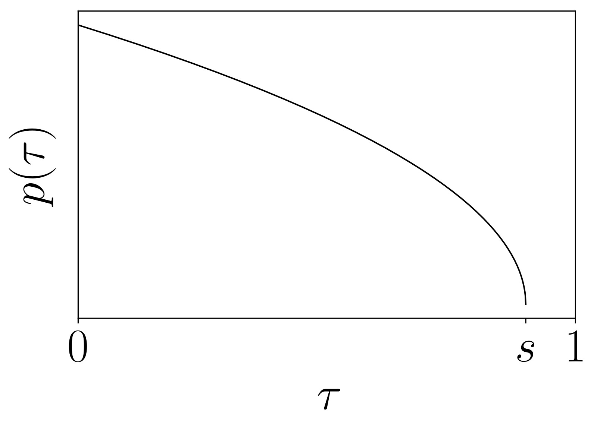

*图1：π₀ 使用的流匹配时间步采样分布。该分布从标准 Beta 分布偏移而来，强调较低的 τ 值（对应较高噪声水平）。论文使用 s=0.999，不采样高于此阈值的时间步。这一设计与图像生成中的 logit-normal 分布（强调中间时间步）形成对比，出发点是：动作预测中"预测均值动作"本身就是困难任务，而图像生成中"预测均值图像"相对简单。*

---

## 三、训练数据与配方

### 3.1 预训练数据混合

预训练混合物包含：

| 数据来源 | 规模 | 说明 |
|---------|------|------|
| π 数据集（自采） | 903M 步（106M 单臂 + 797M 双臂） | 7 种机器人、68 个任务 |
| OXE Magic Soup | ~9.1% 混合占比 | 包含 OXE、Bridge v2、DROID |
| 总计 | 10,000+ 小时 | 据论文称是迄今最大的机器人操控预训练混合物 |

数据集按 task-robot 组合用 $n^{0.43}$ 加权（$n$ 为该组合样本数），以平衡过表达和欠表达的任务。

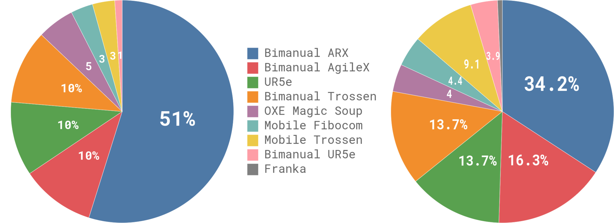

*图2：预训练数据混合的组成和权重分布。左图展示各数据集的权重占比，右图展示按步数计算的相对大小。π 数据集（自采数据）占据主导地位，其中双臂数据（797M 步）远超单臂数据（106M 步）。OXE Magic Soup 约占 9.1%，包含来自 Bridge v2、DROID 等开源数据集的数据。这种混合策略使模型能同时从高质量自采数据和多样化开源数据中受益。*

### 3.2 机器人平台

π₀ 在 7 种不同机器人配置上进行跨具身训练：

| 平台 | 自由度 | 相机数 | 特点 |
|------|--------|--------|------|
| UR5e | 7 | 2 | 单臂 + 平行爪夹爪 |
| Bimanual UR5e | 14 | 3 | 双臂 UR5e |
| Franka | 8 | 2 | 单臂 |
| Bimanual Trossen | 14 | 3 | 双臂 ViperX（ALOHA 式） |
| Bimanual ARX/AgileX | 14 | 3 | 双臂 |
| Mobile Trossen/ARX | 16 | 3 | 移动双臂（非完整约束底盘） |
| Mobile Fibocom | 17 | 3 | 移动双臂（完整约束底盘） |

动作空间统一为 18 维（最大机器人配置），较小机器人零填充。

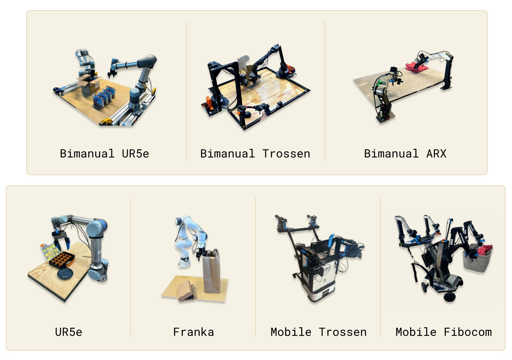

*图3：π₀ 训练涉及的 7 种机器人平台。包括单臂、双臂、固定基座和移动 manipulator。跨具身训练是 π₀ 的关键设计：不同机器人的动作空间统一填充到 18 维，缺失的相机图像被 mask。这种设计允许模型从所有平台的数据中学习共享的物理交互知识。*

### 3.3 后训练策略

后训练数据量因任务难度而异：简单任务仅需 5 小时数据，最复杂任务（如叠衣服）需要 100+ 小时。

对于需要语义推理的复杂任务（如清理餐桌），π₀ 还结合了一个**高层 VLM 策略**（类似于 SayCan），将高层任务指令分解为中间子任务的语言指令，再由 π₀ 执行。

---

## 四、实验与结果

### 4.1 零样本评估（预训练后直接使用）

在 5 个任务上评估预训练基座模型（未做任何微调）：

| 任务 | π₀ (700k步) | π₀ (160k步) | OpenVLA | Octo | π₀-small |
|------|:----------:|:----------:|:-------:|:----:|:--------:|
| 叠T恤 | **~1.0** | ~0.8 | ~0.1 | ~0.2 | ~0.6 |
| 清理桌子（简单） | **~1.0** | ~0.9 | ~0.1 | ~0.3 | ~0.7 |
| 清理桌子（困难） | **~0.9** | ~0.7 | ~0.0 | ~0.1 | ~0.4 |
| 食品装袋 | **~0.9** | ~0.7 | ~0.1 | ~0.2 | ~0.5 |
| 从烤面包机取吐司 | **~0.9** | ~0.7 | ~0.1 | ~0.2 | ~0.5 |

关键发现：
- π₀ 在所有任务上大幅领先所有基线
- 即使训练步数匹配（160k 步），π₀ 仍显著优于 OpenVLA 和 Octo
- OpenVLA 表现差的原因：自回归离散化无法支持 action chunking 和高频控制
- π₀-small（无 VLM 初始化）优于 OpenVLA/Octo，但不如完整 π₀，说明 VLM 预训练的重要性

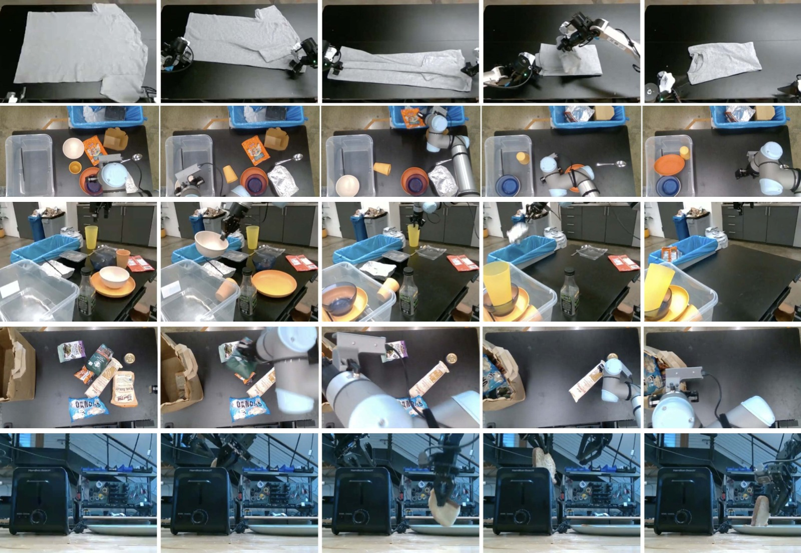

*图4：预训练后零样本评估的 5 个任务——叠T恤、清理桌子（简单）、清理桌子（困难）、食品装袋、从烤面包机取吐司。这些任务覆盖了灵巧操作（叠衣服）、语义识别（区分垃圾和餐具）、多物体操作（装袋）等多种能力维度。*

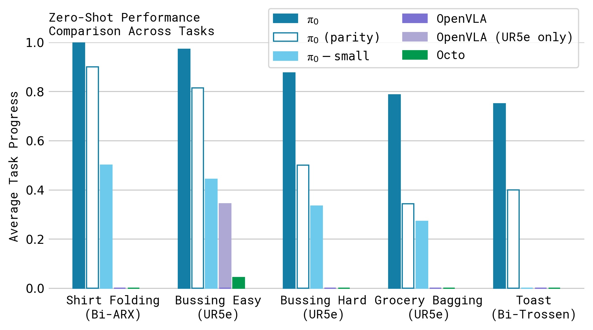

*图5：零样本评估的定量结果。横轴为不同方法，纵轴为归一化得分。π₀ 的完整版本（700k 步）在几乎所有任务上接近满分。关键对比：(1) π₀-160k（计算量匹配版）仍优于所有基线，说明架构优势；(2) OpenVLA 几乎完全失败，因为其自回归离散化架构不支持 action chunk；(3) OpenVLA-UR5e（只在 UR5e 数据上训练）略好但仍远不及 π₀，说明跨具身训练对 OpenVLA 反而是负担；(4) π₀-small 优于 Octo，说明 flow matching 架构本身就有优势。*

### 4.2 语言指令跟随

在 3 个语言条件任务上评估：

| 条件 | 说明 |
|------|------|
| π₀-flat | 仅接收任务级指令（如"把食品装袋"） |
| π₀-human | 接收人类专家的中间步骤指令 |
| π₀-HL | 接收高层 VLM 策略自主生成的中间指令 |

关键发现：
- π₀ 的语言跟随准确率显著优于 π₀-small（无 VLM 初始化）
- 人类专家指导（π₀-human）带来最大提升
- 高层 VLM 策略（π₀-HL）也能提升性能，且是全自主的
- π₀-small 无法从额外语言指令中获益（因其语言理解能力不足）

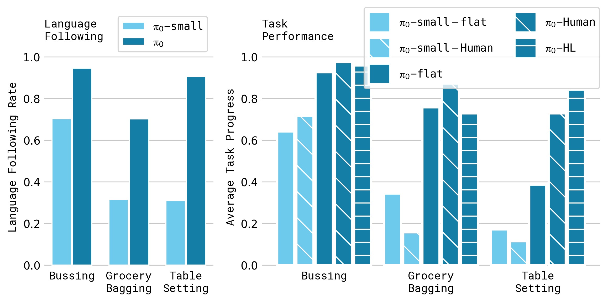

*图6：语言评估的定量结果，包含 5 种条件在 3 个任务上的对比。三个任务分别是：bussing（清理餐桌）、table setting（摆桌）、grocery bagging（食品装袋）。图中对比了 flat（仅任务指令）、human（人类专家中间指令）和 HL（高层 VLM 策略指令）三种指令模式，以及 π₀ 和 π₀-small 两种模型。π₀-human 在所有任务上最优，证明模型能有效利用细粒度语言指导。π₀-HL 次之但仍是全自主方案。π₀-small 的 flat/human 差异很小，说明无 VLM 初始化的模型语言理解能力有限。*

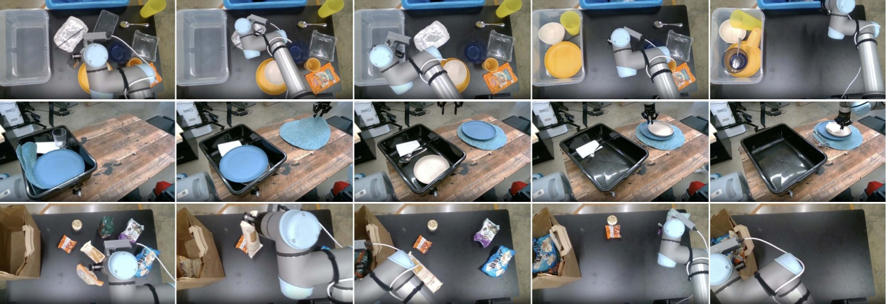

*图7：语言评估的 3 个任务的执行过程图示。(a) bussing——将餐具放入碗篮、垃圾放入垃圾桶；(b) table setting——从篮子取出物品并按规范摆放；(c) grocery bagging——将各类食品装入纸袋。每项任务都需要按照语言指令的顺序执行多步操作。*

### 4.3 学习新的灵巧任务（微调评估）

在 5 个新任务上微调（这些任务在预训练中未出现或部分出现）：

| 任务 | 难度 | π₀ 微调 | π₀ 从头训练 | 最佳基线 |
|------|------|:------:|:---------:|:------:|
| 叠碗 | 简单 | **~3.0/3** | ~2.5 | ~2.5 (ACT) |
| 叠毛巾 | 简单 | **~3.0/3** | ~2.5 | ~2.5 (DP) |
| 保鲜盒放微波炉 | 中等 | **~3.5/4** | ~3.0 | ~3.0 (DP) |
| 更换纸巾卷 | 困难 | **~3.0/4** | ~2.0 | ~2.0 (DP) |
| Franka 物品入抽屉 | 困难 | **~4.0/5** | ~2.0 | ~2.0 (ACT) |

关键发现：
- π₀ 微调在所有任务上全面优于从头训练和所有基线
- 预训练带来的增益在数据量较少时更显著（某些任务提升接近 2x）
- 与预训练数据相似度越高的任务，预训练收益越大
- 有趣的是，ACT 和 Diffusion Policy（仅在微调数据上训练）有时强于 OpenVLA/Octo 微调，说明现有 VLA 模型在灵巧操作上的迁移能力有限

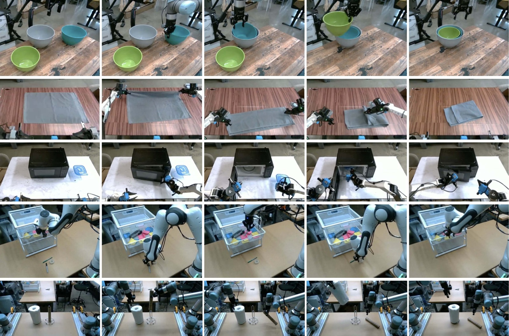

*图8：微调评估的 5 个任务。(a) 叠碗——将不同大小的碗嵌套叠放；(b) 叠毛巾；(c) 保鲜盒放微波炉——引入预训练中未见过的微波炉；(d) 更换纸巾卷——全新的物体和动作；(e) Franka 物品入抽屉——在未见过的 Franka 机器人上执行新任务。任务按与预训练数据的相似度分为"简单""中等""困难"三级。*

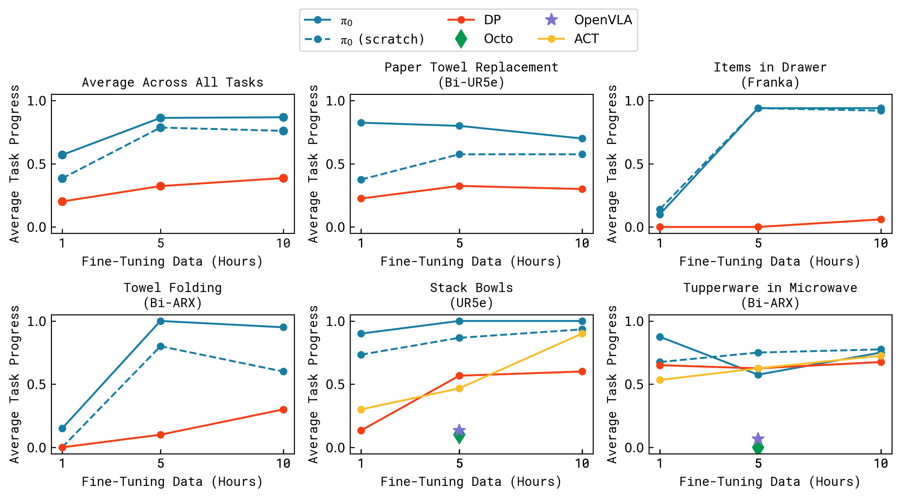

*图9：不同微调数据量（横轴）下的性能（纵轴）对比。包含 5 个任务 × 多种方法。核心趋势：(1) π₀ 预训练+微调在所有数据量下都最优；(2) 数据量越少，预训练的相对优势越大；(3) 在保鲜盒任务上，π₀ 的 1 小时微调性能已优于基线方法的 5 小时训练效果；(4) 预训练收益与任务相似度正相关——叠碗/叠毛巾（与预训练相似）收益最大，纸巾更换/Franka 抽屉（差异大）收益相对较小但仍然存在。*

### 4.4 复杂多阶段任务

在最具挑战性的任务上评估：

| 任务 | π₀ 预训练+微调 | π₀ 仅预训练 | π₀ 从头训练 |
|------|:------------:|:---------:|:---------:|
| 叠衣服（固定基座） | **~2.5/4** | ~1.0 | ~1.0 |
| 移动叠衣服 | **~2.5/4** | ~0.5 | ~1.0 |
| 烘干机取衣 | **~3.5/5** | ~1.0 | ~2.0 |
| 清理餐桌 | **~7.0/12** | ~3.0 | ~4.0 |
| 组装纸箱 | **~3.0/5** | ~0.5 | ~1.0 |
| 打包鸡蛋 | **~5.5/7** | ~2.0 | ~3.0 |
| 食品装外卖盒 | **~3.5/5** | ~1.5 | ~2.0 |

所有任务得分均 >50%，预训练+微调在所有任务上最佳，且困难任务从预训练中获益最大。

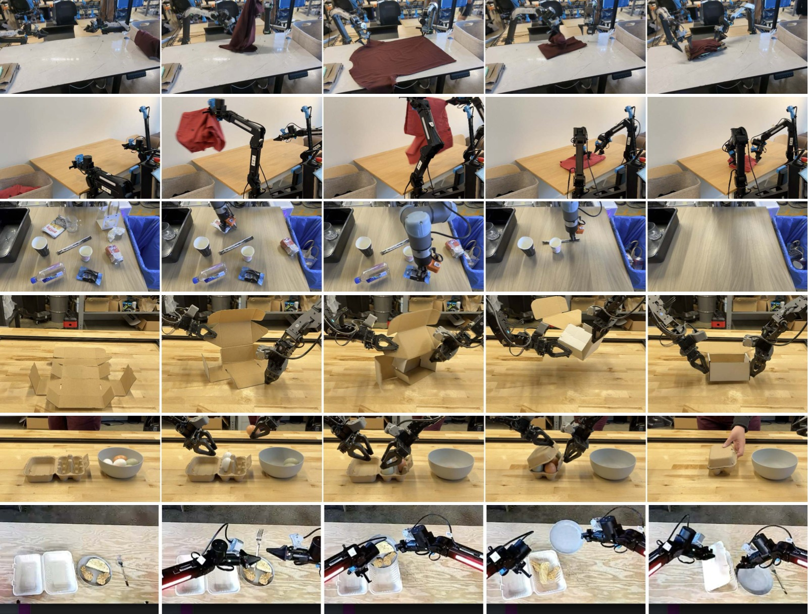

*图10：复杂多阶段任务的执行过程。(a) 固定基座叠衣服；(b) 移动机器人叠衣服；(c) 清理真实餐桌；(d) 组装纸箱；(e) 打包鸡蛋入蛋盒；(f) 食品装外卖盒。这些任务需要组合数十种基本行为（抓取、堆叠、折叠、压平），泛化到大量不同的物体配置，以及处理复杂物理属性（如可变形物体、柔性纸板）。任务时长从 5 分钟到 20+ 分钟不等。*

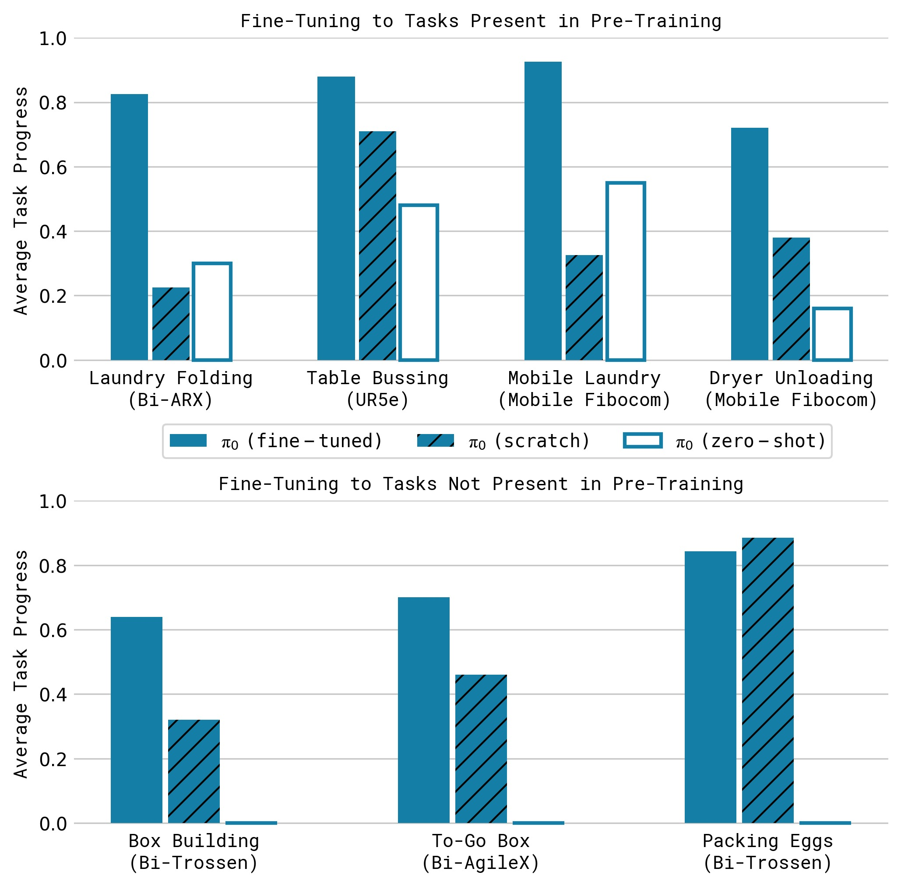

*图11：复杂多阶段任务的后训练结果（10 次试验平均得分）。三个柱体分别代表：π₀ 预训练+微调（蓝色）、仅预训练零样本（橙色）、从头训练（绿色）。核心发现：(1) 预训练+微调在全部 7 个任务上最优；(2) 困难任务（如组装纸箱、打包鸡蛋）上预训练的优势尤为显著，证明预训练在数据稀缺的高难度场景中价值最大；(3) 仅预训练（零样本）在大多数任务上表现不佳，说明后训练对于达到实用水平不可或缺。*

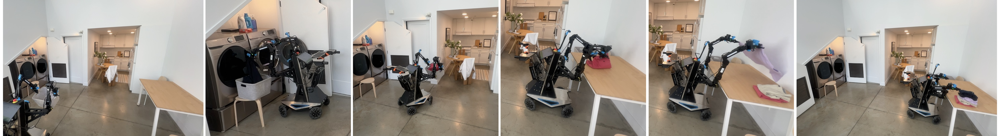

*图12：π₀ 控制移动 manipulator 完成完整的叠衣服流程——从烘干机取出衣物 → 放入洗衣篮 → 将洗衣篮运到折叠桌 → 逐件折叠衣物。这是一个持续 10-20 分钟的多阶段任务，需要结合移动导航、灵巧抓取和精细折叠等多种能力。*

---

## 五、关键洞察与技术亮点

### 5.1 Flow Matching > Autoregressive Discretization for Actions

论文的核心技术论点是：**对于高频、灵巧的机器人动作控制，流匹配（连续扩散）显著优于自回归离散化**。

原因：
- 自回归离散化（如 RT-2、OpenVLA 使用的方式）将动作空间离散为 token，每步独立预测——无法建模 action chunk 内部的时间相关性
- 流匹配在连续空间中建模，通过全双向注意力在 action token 之间传播信息，能自然地表示多模态动作分布
- Action chunking（H=50，即 1-2.5 秒的动作序列）对灵巧操作至关重要，OpenVLA 不支持此功能

### 5.2 VLM 预训练对语言跟随的贡献

π₀ 与 π₀-small 的对比直接证明了 VLM 预训练对语言指令跟随的价值：
- π₀ 可以从细粒度中间指令中获益，π₀-small 不能
- 这使 π₀ 能与高层 VLM 策略（SayCan 式）协同工作，实现全自主的复杂任务分解

### 5.3 两阶段训练范式的实证验证

论文通过大量实验证明：**预训练 + 后训练的分离策略对机器人基础模型同样有效**。

预训练的作用：提供广泛的物理先验和恢复行为
后训练的作用：注入高质量的行为策略
仅做其一（纯预训练零样本 / 纯后训练从头训练）都远不如两者结合

### 5.4 Action Expert 设计

将 VLM 骨干与动作专家分离的设计带来了多重好处：
- VLM 权重可以从 PaliGemma 直接初始化，减少分布偏移
- 动作专家可以缩小（width=1024 vs 2048）以加速推理（推理时需要 10 次前向传播）
- 通过注意力掩码实现推理时的 KV 缓存，进一步加速

### 5.5 时间步采样策略的重新思考

不同于图像生成中常用的 logit-normal 分布（强调中间时间步），π₀ 使用偏移 Beta 分布强调低时间步。其直觉是：在图像生成中，"预测一张猫的平均图片"相对容易；但在机器人控制中，"给定当前观测预测平均动作"本身就是困难任务——观测信息非常丰富，对动作分布有强约束。

---

## 六、局限性

1. **预训练数据构成缺乏系统理解**：论文将所有可用数据组合训练，但并未系统研究哪些数据类型更有价值、应该如何加权。这是一个重要的开放问题。

2. **性能不够可靠**：并非所有任务都能稳定成功，复杂任务（如组装纸箱）的绝对得分仍然较低。如何预测需要多少/何种数据才能达到接近完美的性能，目前尚不清楚。

3. **跨领域迁移的边界不明确**：论文展示了在多种机械臂和移动 manipulator 之间的迁移，但未探索与自动驾驶、腿足 locomotion 等更远领域的正向迁移是否存在。

4. **模型规模有限**：基于 3B 参数的 PaliGemma，相比当前 LLM 的规模仍然较小。更大规模模型是否能带来更强的涌现能力有待验证。

5. **代码和模型未开源**：论文未提供代码仓库或模型权重，限制了社区复现和进一步研究的可能性。

---

## 七、关键概念速查

| 术语 | 解释 |
|------|------|
| **VLA (Vision-Language-Action)** | 在 VLM 基础上增加动作输出的模型，能够根据视觉和语言输入生成机器人动作 |
| **Flow Matching** | 一种生成模型训练方法，通过学习连续时间向量场将简单分布（噪声）变换为目标数据分布；是扩散模型的一种推广 |
| **Action Chunk** | 一次预测未来 H 步动作的序列（π₀ 中 H=50），而非逐步预测，有利于建模时间一致性 |
| **Action Expert** | π₀ 中专用于处理机器人输入/输出的独立 Transformer 权重集（Mixture of Experts 的特例） |
| **Cross-Embodiment Training** | 将来自多种不同机器人平台的数据混合训练单一模型，统一动作空间通过零填充实现 |
| **PaliGemma** | Google 的 3B 参数开源 VLM，使用 Gemma 2B 语言模型 + SigLIP 图像编码器 |
| **Blockwise Causal Attention** | 分块因果注意力掩码——块内双向，块间单向（不能看未来块），用于减少 VLM 预训练的分布偏移 |
| **Temporal Ensembling** | 将多个推理调用的重叠动作块加权平均——论文发现这种方法反而损害性能，因此不使用 |
| **SayCan** | Google 提出的 LLM 规划机器人任务方法：LLM 生成候选技能，通过学习到的 affordance 函数筛选可执行的技能 |
| **OpenVLA** | 7B 参数的开源 VLA 模型，基于 Llama + DINOv2 + SigLIP，使用自回归离散化动作预测 |
| **Octo** | 93M 参数的机器人基础模型，使用扩散生成动作，但不基于 VLM |
| **ACT (Action Chunking Transformer)** | 基于 Transformer 编码器-解码器的行为克隆方法，使用 action chunking |
| **Diffusion Policy** | 使用扩散模型生成机器人动作的方法 |
| **OXE (Open X-Embodiment)** | 多机构联合收集的大规模跨具身机器人数据集 |
| **DROID** | 大规模多样化机器人操控数据集 |
| **Bridge v2** | 基于 WidowX 机器人的大规模操控数据集 |

---

## 八、推理流程示例

```
┌─────────────────────────────────────────────────────────┐
│                    推理过程（单次动作块生成）               │
├─────────────────────────────────────────────────────────┤
│                                                         │
│  输入:                                                  │
│  ┌──────┐ ┌──────┐ ┌──────┐ ┌──────────┐ ┌─────────┐  │
│  │图像1 │ │图像2 │ │图像3 │ │语言指令 ℓ │ │关节角 q │  │
│  └──┬───┘ └──┬───┘ └──┬───┘ └────┬─────┘ └────┬────┘  │
│     │        │        │         │            │        │
│     ▼        ▼        ▼         ▼            ▼        │
│  ┌──────────────────────────┐  ┌──────────────────┐    │
│  │  ViT 图像编码器 (14ms)    │  │  线性投影 → 嵌入   │    │
│  └────────────┬─────────────┘  └────────┬─────────┘    │
│               │                         │              │
│               ▼                         │              │
│  ┌──────────────────────────────────────┴──────────┐   │
│  │         VLM 骨干 (PaliGemma 3B)                  │   │
│  │         前缀前向传播 (32ms)                       │   │
│  │         → 缓存 K, V                              │   │
│  └──────────────────────┬──────────────────────────┘   │
│                         │                              │
│                         ▼                              │
│  ┌──────────────────────────────────────────────────┐  │
│  │         流匹配循环 (× 10, 共 27ms)                │  │
│  │                                                  │  │
│  │  τ=0: A^0 ~ N(0,I)  ← 随机噪声初始化              │  │
│  │    ┌──────────────────────────────────────┐      │  │
│  │    │  动作专家 (300M) 前向传播              │      │  │
│  │    │   输入: A^τ + 观测 K,V (缓存)         │      │  │
│  │    │   输出: v_θ(A^τ, o)                  │      │  │
│  │    └──────────────────────────────────────┘      │  │
│  │    A^{τ+0.1} = A^τ + 0.1 · v_θ(A^τ, o)         │  │
│  │    重复 10 次...                                 │  │
│  │  τ=1: 输出 A^1 = 最终动作块 [a_t, ..., a_{t+49}]│  │
│  └──────────────────────┬───────────────────────────┘  │
│                         │                              │
│                         ▼                              │
│  输出: 50 步动作序列 → 执行 16-25 步后重新推理          │
│                                                         │
│  总推理时间: 73ms (本地) / 86ms (远程 + WiFi)           │
│  控制频率: 20Hz (UR5e/Franka) / 50Hz (其他机器人)       │
└─────────────────────────────────────────────────────────┘
```

---

## 九、与相关工作的关系

```
                      VLM 预训练
                          │
          ┌───────────────┼───────────────┐
          │               │               │
          ▼               ▼               ▼
      RT-2/OpenVLA    π₀ (本文)     SayCan/LLM规划
    (自回归离散化)   (流匹配+连续动作)  (高层任务分解)
          │               │               │
          ▼               ▼               ▼
    动作 = token序列   动作 = 连续向量    动作 = 技能API
    低频控制 (~5Hz)   高频控制 (50Hz)   依赖底层策略
    无action chunk    支持action chunk  语言→语言
                         │
          ┌──────────────┼──────────────┐
          │              │              │
          ▼              ▼              ▼
    ACT / Diffusion  Octo (扩散)   π₀-small (无VLM)
    Policy (无VLM)   (无VLM)        (对比基线)
```

π₀ 的创新在于将 VLM 预训练、流匹配动作生成、action chunking 和跨具身训练**整合到一个统一的框架**中，并验证了两阶段训练配方（预训练+后训练）对机器人基础模型的有效性。

---

*笔记生成日期：2026-05-14*
