%% mathjax-macros
ba: \mathbf{a}
bv: \mathbf{v}
bu: \mathbf{u}
bo: \mathbf{o}
bq: \mathbf{q}
bI: \mathbf{I}
bX: \mathbf{X}
bA: \mathbf{A}
E: \mathbb{E}
lang: \ell
piref: \pi_\text{ref}
data: \mathcal{D}
%% end-mathjax-macros

# $\pi^{*}_{0.6}$: a VLA That Learns From Experience

> **论文信息**
> - 作者：Physical Intelligence（共 57 人）
> - 投稿方向：机器人基础模型 / Robot Foundation Models
> - arXiv ID：2511.14759v2
> - 项目主页：https://pi.website/blog/pistar06

---

## 一、核心问题

视觉-语言-动作（VLA）模型虽然可以通过预训练获得通用任务执行能力，但要达到实际部署所需的**鲁棒性、速度和流畅度**，仅靠模仿学习（behavior cloning）是不够的。模仿学习的核心局限在于：

- **复合误差**（compounding errors）：训练时的分布与执行时的分布不一致，小误差随步骤累积放大
- **天花板效应**：模型最多只能达到演示数据的水平，无法超越人类操作员的演示质量
- **无法自主改进**：不能在部署过程中从成功/失败经验中学习

论文要解决的核心问题是：**如何让 VLA 模型通过部署后的自主经验（autonomous experience）进行强化学习（RL），从而自我改进，超越演示数据的性能上限？**

---

## 二、核心思路 / 方法

论文提出 **RECAP**（RL with Experience and Corrections via Advantage-conditioned Policies），一个通用的 VLA 强化学习训练框架。其核心思想是通过**优势条件化（advantage conditioning）**，让 VLA 模型能够从异构数据源（演示、自主回合、人工纠正）中学习，并利用价值函数评估每个动作的"优劣程度"来改进策略。

*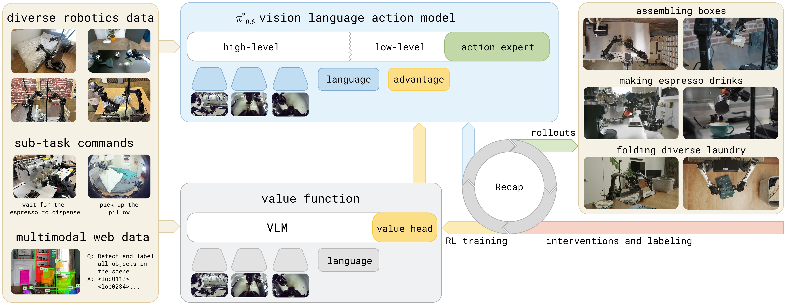*

*图1：RECAP 方法的整体流程。系统从预训练的 VLA 开始（该 VLA 已具备优势条件化能力），对于每个任务，部署模型并收集自主回合及在线人工纠正数据。在这些在线数据上微调价值函数，改进其对动作如何影响性能的估计。将 VLA 在这些更新后的优势估计上进行微调和条件化，即可持续改善策略行为。图片展示了从预训练到部署改进的完整循环：左侧起始于预训练 VLA，中间展示价值函数和策略的条件化训练，右侧示意部署阶段的数据反馈路径。*

### 2.1 整体流程（迭代式 RL 循环）

```
┌─────────────────────────────────────────────────────┐
│                   RECAP 算法概览                      │
├─────────────────────────────────────────────────────┤
│                                                      │
│  阶段 1：预训练                                       │
│  ┌──────────────┐    ┌──────────────┐               │
│  │ 训练价值函数   │    │ 训练条件策略   │               │
│  │ V_pre(多任务)  │◄──►│ π_pre(多任务)  │               │
│  └──────────────┘    └──────────────┘               │
│         │                    │                        │
│         ▼                    ▼                        │
│                                                      │
│  阶段 2：下游任务微调（每轮迭代）                        │
│  ┌──────────┐   ┌──────────┐   ┌──────────┐         │
│  │ 数据收集   │──►│ 更新 V   │──►│ 更新 π   │         │
│  │ (自主+纠正)│   │ (价值函数) │   │ (条件策略) │         │
│  └──────────┘   └──────────┘   └──────────┘         │
│       ▲                                              │
│       └──────────── 可重复 K 轮 ──────────────────────│
│                                                      │
└─────────────────────────────────────────────────────┘
```

### 2.2 优势条件化（Advantage Conditioning）——核心机制

传统 RL 方法（如 PPO）对 flow-matching 或扩散 VLA 模型的适用性差，因为这些模型无法提供可处理的 log-likelihood。

**RECAP 的解决思路**：不直接优化策略梯度，而是将策略提取转化为一个**二分类条件生成问题**。

具体做法：

1. **价值函数训练**：用蒙特卡洛回报训练一个多任务分布价值函数 $V^{\pi_{\text{ref}}}(\bo_t, \lang)$，预测到任务成功还需的步数（负值）

2. **优势计算**：
   $$A^{\pi_{\text{ref}}}(\bo_t, \ba_t, \lang) = \sum_{t'=t}^{t+N-1} r_{t'} + V^{\pi_{\text{ref}}}(\bo_{t+N}) - V^{\pi_{\text{ref}}}(\bo_t)$$

3. **优势二值化**：
   $$I_t = \mathbb{1}\big(A^{\pi_{\text{ref}}}(\bo_t, \ba_t, \lang) > \epsilon_\lang\big)$$

   其中 $\epsilon_\lang$ 是每个任务独立的优势阈值（预训练时设为 30% 分位数，微调时设为 40%）。

4. **条件化训练**：在 VLA 的输入序列中增加一个文本 token，如 `"Advantage: positive"` 或 `"Advantage: negative"`，然后以标准的监督学习目标训练：

   $$\min_\theta \: \mathbb{E}_{\mathcal{D}_{\pi_{\text{ref}}}} \Big[ -\log \pi_\theta(\ba_t | \bo_t, \lang) - \alpha \log \pi_\theta(\ba_t | I_t, \bo_t, \lang)\Big]$$

**为什么有效？**

- 训练时所有数据都被使用（不丢弃低优势数据），只是通过条件区分"好动作"和"差动作"
- 推理时直接以 `"Advantage: positive"` 为条件采样，效果等价于从改进策略中采样
- 可以进一步通过无分类器引导（CFG）在推理时调整策略锐度（$\beta > 1$）

### 2.3 数据收集策略

融合三种数据来源：

| 数据来源 | 说明 | 标签方式 |
|---------|------|---------|
| 人工演示（Demonstrations） | 预训练 + 下游任务的专家演示 | 全部标记为 positive |
| 自主回合（Autonomous Rollouts） | 策略自主执行的结果 | 根据最终成功/失败 + 价值函数判定 |
| 人工纠正（Human Interventions） | 在自主执行过程中，人工操作员实时接管纠正错误 | 所有纠正动作强制标记 positive |

> **关键洞察**：人工纠正（interventions）是 DAgger 风格的"示范纠正"，但它们本身不足以解决所有问题——操作员不能保证持续的纠正质量，也无法优化速度和流畅度。纠正的作用是**修复大错误并帮助探索**，而 RL 自主数据负责**微调行为细节**。

---

## 三、训练目标

### 3.1 奖励函数定义

使用稀疏奖励，设计使得价值函数对应于"到成功还需的步数（负值）"：

$$r_t = \begin{cases}
0 & \text{if t = T and success} \\
-C_{\text{fail}} & \text{if t = T and failure} \\
-1 & \text{otherwise}
\end{cases}$$

### 3.2 价值函数训练

价值函数 $p_\phi(V | \bo_t, \lang)$ 使用**分布式价值函数**（distributional value function），将回报离散化为 $B=201$ 个 bin：

$$\min_\phi \mathbb{E}_{\tau \in \mathcal{D}} \left[ \sum_{\bo_t \in \tau} H(R^B_t(\tau), p_\phi(V | \bo_t, \lang)) \right]$$

价值函数架构与 VLA 策略相同，但使用更小的 670M VLM 编码器（Gemma 3）。

### 3.3 Flow Matching + 自回归联合训练

模型同时输出离散 token（子任务描述 $\rawtext$、量化动作 $a^{\ell}$）和连续动作（flow matching 动作专家），损失由三部分组成：

$$\log \pi_\theta(\ba_{t:t+H}, a^{\ell}_{t:t+H}, \rawtext \vert \bo_t, \lang) = \log \pi_\theta(\rawtext \vert \bo_t, \lang) + \log \pi_\theta(a^{\ell}_{t:t+H} \vert \bo_t, \lang, \rawtext) + \log \pi_\theta(\ba_{t:t+H} \vert \bo_t, \lang, \rawtext)$$

其中连续动作部分使用流匹配（flow matching）的 ELBO 下界来近似似然。

---

## 四、实验与结果

### 4.1 实验设置

*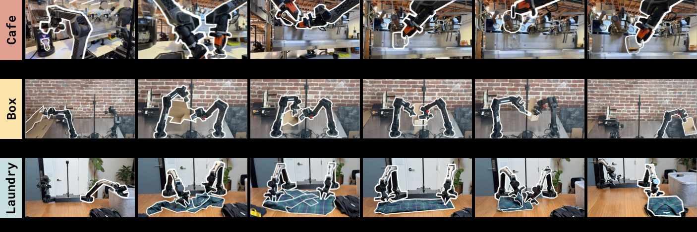*

*图2：RECAP 训练的任务。π*_{0.6} 经 RECAP 训练后可以制作浓缩咖啡、组装纸箱、折叠各种衣物。每个任务都包含现实中的多样性——压平的展开纸箱会粘连和弯曲，制作咖啡需要倾倒液体，折叠衣物需要泛化到大量不同类型的服装。*

*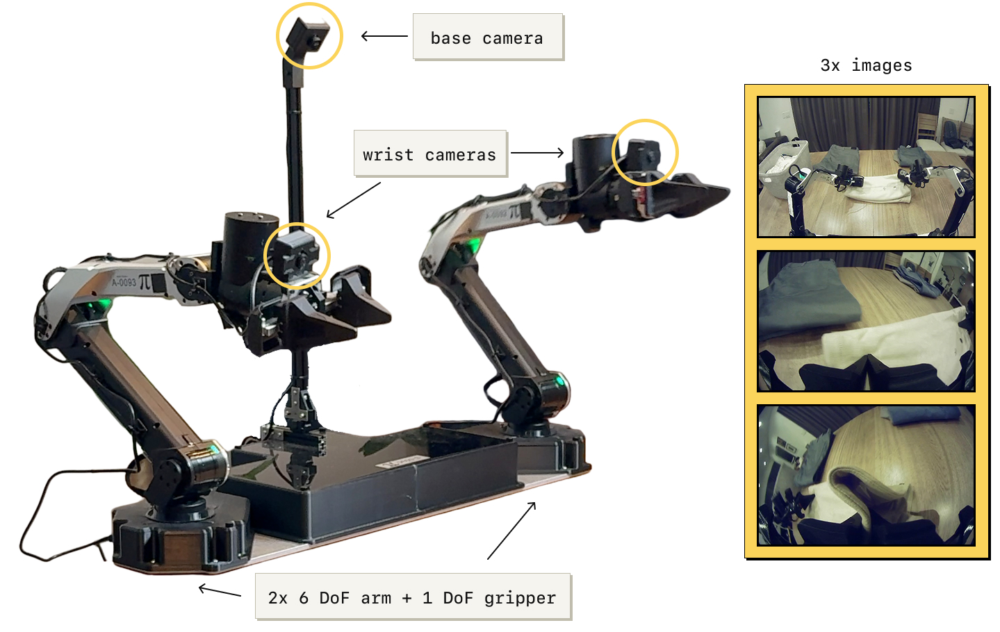*

*图3：实验所用的机器人平台。静态双目系统，两个 6-DoF 机械臂配平行夹爪，50Hz 关节位置控制。观测包括关节位置、夹爪状态以及三个摄像头图像：底座摄像头（两臂之间）和每个臂上的腕部摄像头。该平台可灵活安装（如工作台上）。*

*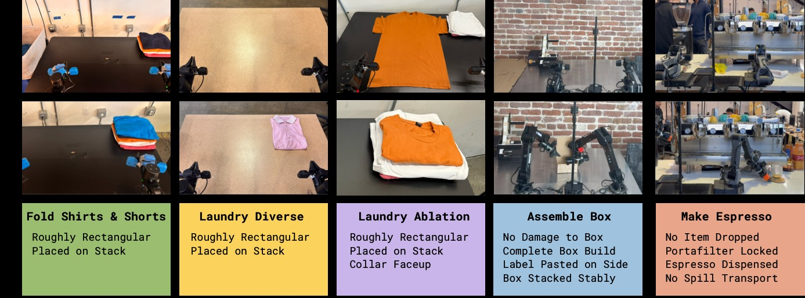*

*图4：实验使用的任务概览。包括三种洗涤折叠变体（T恤与短裤、多样化衣物、目标性失败消除）、组装纸箱、以及用商用咖啡机制作咖啡。每项任务均需要多步骤操作（5-15 分钟），包含复杂操作行为——约束力操作、倾倒液体、操作布料和纸板等。*

**机器人平台**：双目系统，两个 6-DoF 机械臂 + 平行夹爪，50Hz 控制频率，3 个摄像头（1 个底座 + 2 个腕部）。

**任务**：

| 任务 | 描述 | 时长 |
|------|------|------|
| 衣物折叠（T恤/短裤） | 从篮子取出、铺平、折叠 | ≤200s |
| 衣物折叠（多样化） | 11 种衣物类型，包括衬衫、毛衣等 | ≤500s |
| 衣物折叠（失败消除） | 固定初始位置的 T 恤，严格成功标准 | ≤200s |
| 双份意式浓缩 | 取手柄、研磨、填压、萃取、上杯 | ≤200s |
| 纸箱组装 | 从平板纸板折叠成箱、贴标签、装箱 | ≤600s |

### 4.2 主实验结果

*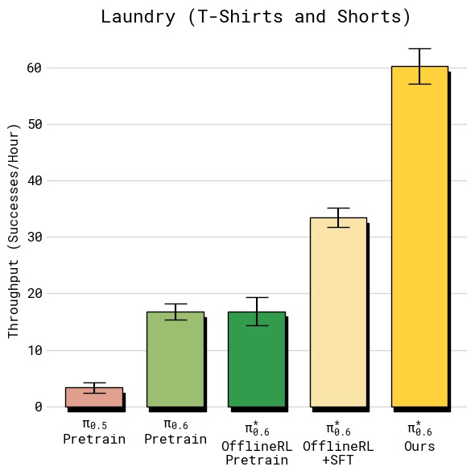*
*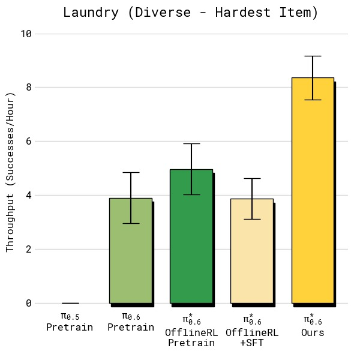*
*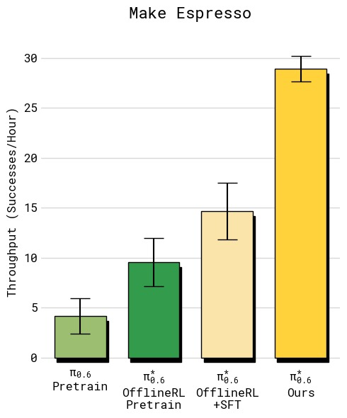*
*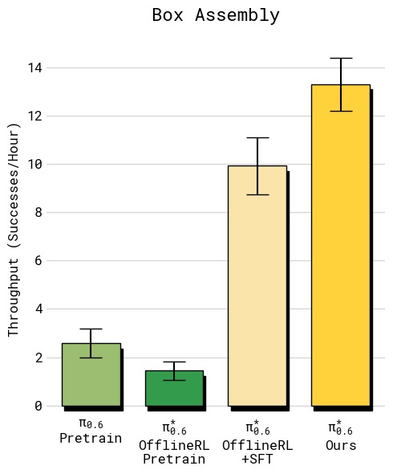*

*图5：四组任务的吞吐量对比（每小时成功完成任务数，误差线为标准误）。从左上到右下依次为：(a) T恤与短裤折叠——RECAP 达到约 12 次/小时，相比 SFT 基线提升约 33%；(b) 多样化衣物折叠——RECAP 达到约 7 次/小时，翻倍以上，提升最为显著，因为最难衣物类型（纽扣衬衫）的失败率大幅降低；(c) 浓缩咖啡制作——RECAP 达到约 24 次/小时，同样实现翻倍，主要受益于更快的执行速度和更高的成功率；(d) 纸箱组装——RECAP 达到约 9 次/小时，提升超过 2 倍。所有任务中 RECAP 均显著超越基线和 SFT 模型，体现了从自主经验中学习对吞吐量的全面改善。*

*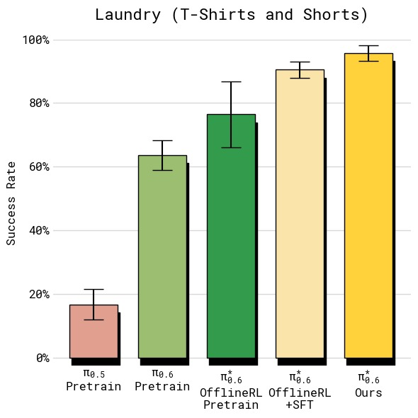*
*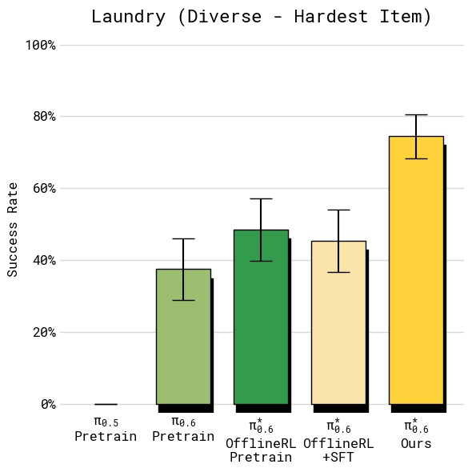*
*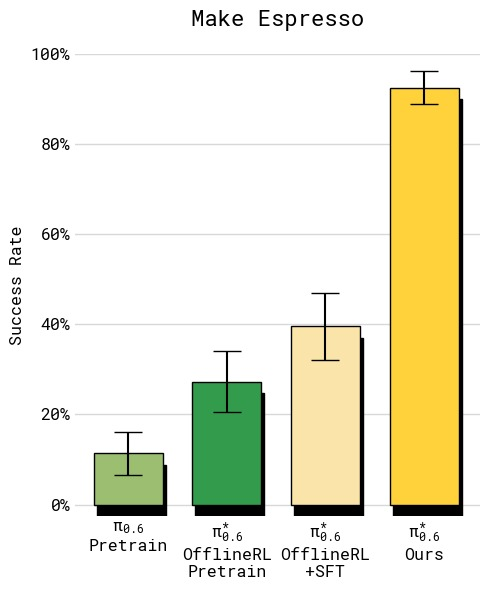*
*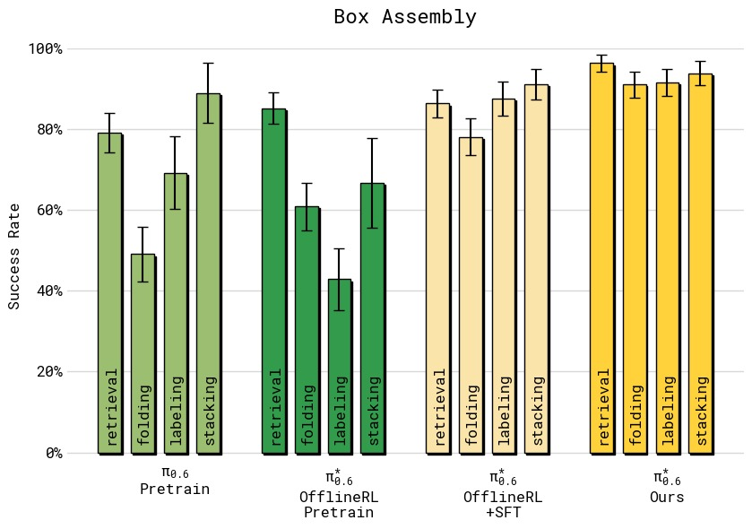*

*图6：四组任务的绝对成功率对比（误差线为标准误）。(a) T恤短裤折叠：所有方法在简单的两种衣物上成功率较高，但 RECAP 达到约 95% 的最高水平；(b) 多样化衣物（最难纽扣衬衫）：基线 π_0.5 仅约 30%，SFT 提升有限，而 RECAP 大幅跃升至约 75%，失败率降低超过 2 倍；(c) 浓缩咖啡：从 π_0.5 的约 55% 提升至 RECAP 的约 92%，实现了实际部署可用的水平；(d) 纸箱组装四阶段分解（拾取→折箱→贴标→装筐）：RECAP 在**所有阶段**都达到最高且最一致的成功率，约 90% 左右，而其他方法在各阶段差异较大，尤其在折箱和贴标环节表现不稳定。*

**吞吐量（每小时成功完成任务数）**：

*图1：各方法在五个任务上的吞吐量对比（每小时成功完成次数，误差线为标准误）*

| 任务 | $\pi_0$ | $\pi_{0.5}$ | $\pi^{*}_{0.6}$ (offline RL + SFT) | $\pi^{*}_{0.6}$ (RECAP) |
|------|---------|-------------|-----------------------------------|------------------------|
| T恤/短裤折叠 | ~6 | ~7 | ~9 | **~12** |
| 多样化衣物折叠 | ~1 | ~2 | ~3 | **~7** |
| 浓缩咖啡 | ~8 | ~10 | ~14 | **~24** |
| 纸箱组装 | ~2 | ~3 | ~4 | **~9** |

**成功率**：

*图2：各方法的绝对成功率对比*

| 任务 | $\pi_0$ | $\pi_{0.5}$ | $\pi^{*}_{0.6}$ (offline RL + SFT) | $\pi^{*}_{0.6}$ (RECAP) |
|------|---------|-------------|-----------------------------------|------------------------|
| T恤/短裤折叠 | ~60% | ~70% | ~85% | **~95%** |
| 多样化衣物折叠 | ~20% | ~30% | ~45% | **~75%** |
| 浓缩咖啡 | ~40% | ~55% | ~70% | **~92%** |
| 纸箱组装 | ~30% | ~45% | ~60% | **~90%+** |

**关键结论**：
- RECAP 在最难的任务（多样化衣物、浓缩咖啡）上**吞吐量翻倍以上**，失败率降低约 2 倍
- 在相对简单的任务（T恤折叠）上，吞吐量仍有显著提升（~33%），说明 RECAP 不仅提高成功率还提升执行速度
- 纸箱组装任务的四阶段逐段分析显示，RECAP 在所有子阶段的一致性都最高

### 4.3 多轮迭代效果

*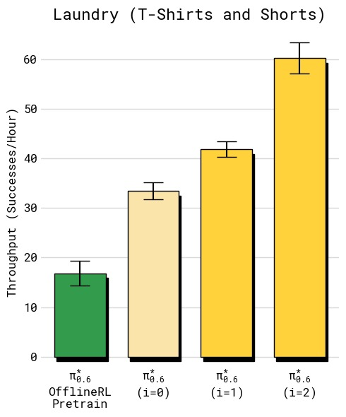*
*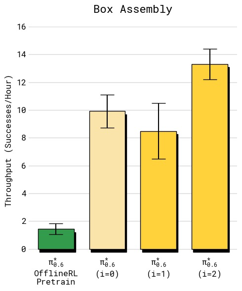*

*图7：两个任务经多轮迭代的吞吐量变化（横轴：迭代轮次，纵轴：每小时成功完成数）。(a) T恤折叠：初始 SFT 约 8 次/小时，第 1 轮 RECAP 提升至约 10 次/小时，第 2 轮进一步提升至约 12 次/小时，呈现稳定递增趋势；(b) 纸箱组装：初始约 4 次/小时，第 1 轮**不升反降**至约 3 次/小时，但在第 2 轮实现大幅跃升至约 9 次/小时。说明长周期、多步骤任务需要更多数据积累才能产生有效改善——第 1 轮收集的数据量不足以让策略学到可靠的改进，第 2 轮积累的数据才触发质变。*

*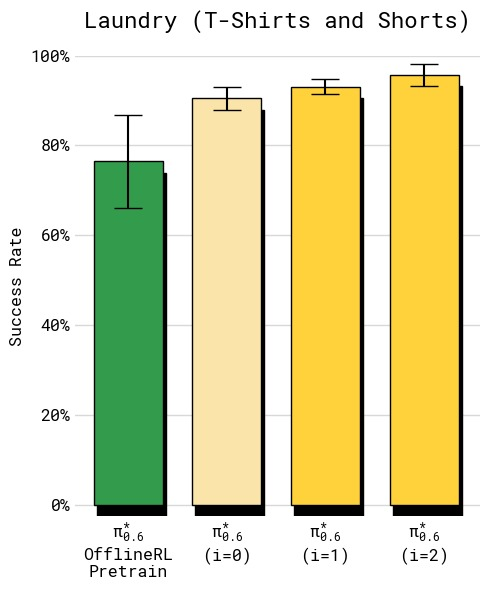*
*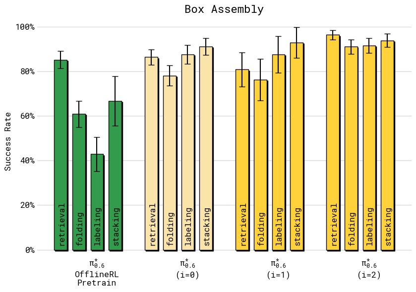*

*图8：成功率随迭代轮次的变化。(a) T恤折叠：第 1 轮已快速提升至约 90%+，第 2 轮进一步提升，但增益主要体现在吞吐量而非成功率上（策略更快但成功已近上限）；(b) 纸箱组装四阶段成功率：初始 SFT 在各阶段（取箱/折箱/贴标/装筐）参差不齐，第 1 轮有轻微改善，第 2 轮所有阶段均提升至约 85-95% 的高水平。纸箱组装最终策略将"折箱"和"贴标"的成功率从约 60% 提升至约 90%。*

| 迭代 | T恤折叠（吞吐量） | 纸箱组装（吞吐量） |
|------|-----------------|-----------------|
| 初始（SFT） | ~8 | ~4 |
| 第 1 轮 RECAP | ~10 | ~3（下降） |
| 第 2 轮 RECAP | **~12** | **~9** |

> 有趣的是，纸箱组装在第 1 轮出现吞吐量下降，但第 2 轮大幅提升——说明长周期任务需要更多数据积累才能产生显著改善。

### 4.4 对比其他策略提取方法

*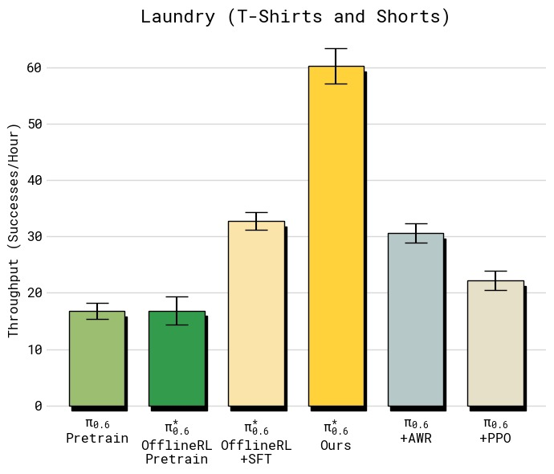*
*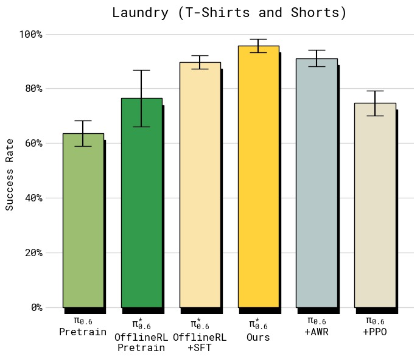*

*图9：T恤与短裤折叠任务上不同策略提取方法的对比（左：吞吐量，右：成功率）。所有基线使用**与 RECAP 相同的数据**——这实际上给了基线优势，因为数据是在运行 RECAP 过程中收集的（包含正/负优势样本）。左侧吞吐量图显示：PPO 仅约 6 次/小时，不如 SFT 基线（约 7 次/小时）；AWR 更低（约 4 次/小时），因为加权回归丢弃了大量低权重数据；RECAP 达到约 12 次/小时，是 PPO 的 2 倍、AWR 的 3 倍。右侧成功率图同样显示 RECAP 约 95%，远超 PPO（约 80%）和 AWR（约 75%）。PPO 在离线多批数据设置中极难稳定，其 trust-region 约束（η=0.01）实际上阻止了有意义的策略改进。AWR 虽然训练稳定，但高优势权重过滤导致策略退化，产生更保守更慢的行为。*

| 方法 | 吞吐量 | 成功率 |
|------|--------|--------|
| $\pi^{*}_{0.6}$ offline RL + SFT | ~7 | ~85% |
| + PPO | ~6 | ~80% |
| + AWR | ~4 | ~75% |
| + RECAP（Ours） | **~12** | **~95%** |

**分析**：
- **PPO**：在离线设置中难以稳定训练，需要极小的 trust-region（$\eta = 0.01$）限制，导致改进有限
- **AWR**：能达到合理成功率，但产生更慢的策略（吞吐量仅为 RECAP 的 1/3），因为 AWR 丢弃了大量低权重数据
- **RECAP**：通过条件化而非加权/裁剪来利用所有数据，效率最高

### 4.5 消除特定失败模式

*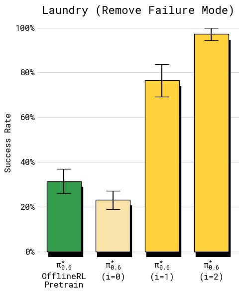*
*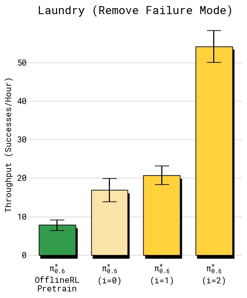*

*图10：严格标准衣物折叠上的失败模式消除实验（左：成功率，右：吞吐量）。任务设定：固定初始位置、固定 T 恤类型、严格成功标准（衣领朝上居中折叠），专门针对基线策略的一个已知失败模式（衣领朝下折叠）。成功率图显示：SFT 基线仅约 40%，第 1 轮 RECAP 跃升至约 85%，第 2 轮达到约 97%。吞吐量同样从仅约 2 次/小时提升至约 5 次/小时。此实验的两个关键结论：(1) RECAP **仅使用 RL 数据（无人工纠正）**就能有效消除特定失败模式——所有数据均为自主收集，无额外人工演示或纠正；(2) 经过两轮迭代，策略几乎彻底消灭了衣领朝下的失败（仅 3% 失败率），说明 RECAP 能将策略行为精确地塑造成期望模式。*

在严格成功标准（T 恤必须衣领朝上居中折叠）下：
- **SFT 策略**：成功率 ~40%，常见错误是衣领朝下
- **RECAP 第 1 轮**：成功率 ~85%
- **RECAP 第 2 轮**：成功率 **~97%**，吞吐量也大幅提升

> 此实验表明 RECAP 即使**仅使用自主 RL 数据（无人工纠正）**，也能有效消除特定失败行为。

---

## 五、关键洞察与技术亮点

### 5.1 为什么 Advantage Conditioning 优于 Policy Gradient？

| 方面 | PPO / 策略梯度 | RECAP（优势条件化） |
|------|---------------|-------------------|
| 数据利用率 | 需要 on-policy 数据 | 可利用所有 off-policy 历史数据 |
| 对 Flow Matching 兼容性 | 差（无易处理的 log-likelihood） | 好（条件化不依赖精确似然） |
| 训练稳定性 | 需要 trust region 约束 | 稳定的监督学习 |
| 数据丢弃 | 低优势动作被裁剪 | 所有数据都被使用（但条件不同） |
| 实现复杂度 | 复杂（多损失项 + 裁剪） | 简单（仅添加条件 token） |

### 5.2 价值函数的可视化能力

*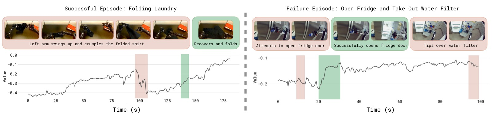*

*图12：价值函数在成功（左）和失败（右）轨迹上的可视化。横轴为时间步，纵轴为归一化的价值估计（范围 -1 到 0，0 表示成功）。上方图片显示对应帧。左侧成功轨迹：价值从约 -0.9 稳定上升到 0（任务完成），中间偶有小波动但整体趋势向上。右侧失败轨迹：价值在前期上升但在关键步骤出现骤降（红色骤降区域），最终返回极低值。颜色标记——红色突出价值下降（错误/失败），绿色突出价值增加（进展/成功）。该可视化有效展示了价值函数作为"批评者"的敏锐度：它能正确识别轨迹中哪个时刻出现问题，也能判断执行速度（斜率越快表示进展越迅速）。这种细粒度的反馈能力使得基于优势条件的策略训练成为可能。*

- 价值函数能**正确识别轨迹中的错误步骤**（红色区域表示价值下降）
- 能反映**任务完成进度**（绿色区域表示价值上升）
- 在失败轨迹中，价值函数在错误发生点出现显著下降，验证了其作为批评者的可靠性

### 5.3 "先条件化后锐化"的两阶段策略

1. **训练阶段**：通过阈值 $\epsilon_\lang$ 控制优势条件的严格程度（放松 → 更多数据被标记 positive，收紧 → 仅最优动作为 positive）
2. **推理阶段**：可通过无分类器引导（CFG）参数 $\beta > 1$ 进一步锐化策略分布

这种设计将"数据过滤"和"推理锐化"解耦，相比传统 CFG 的单一 $\beta$ 调参更可控。

### 5.4 Knowledge Insulation 的重要性

模型使用 KI（Knowledge Insulation）训练策略：
- 动作专家（action expert）的梯度不反传到 VLM 编码器
- 确保动作学习不影响视觉-语言表征的通用性
- 是实现 scalable RL 训练的关键设计决策

---

## 六、模型架构详解

*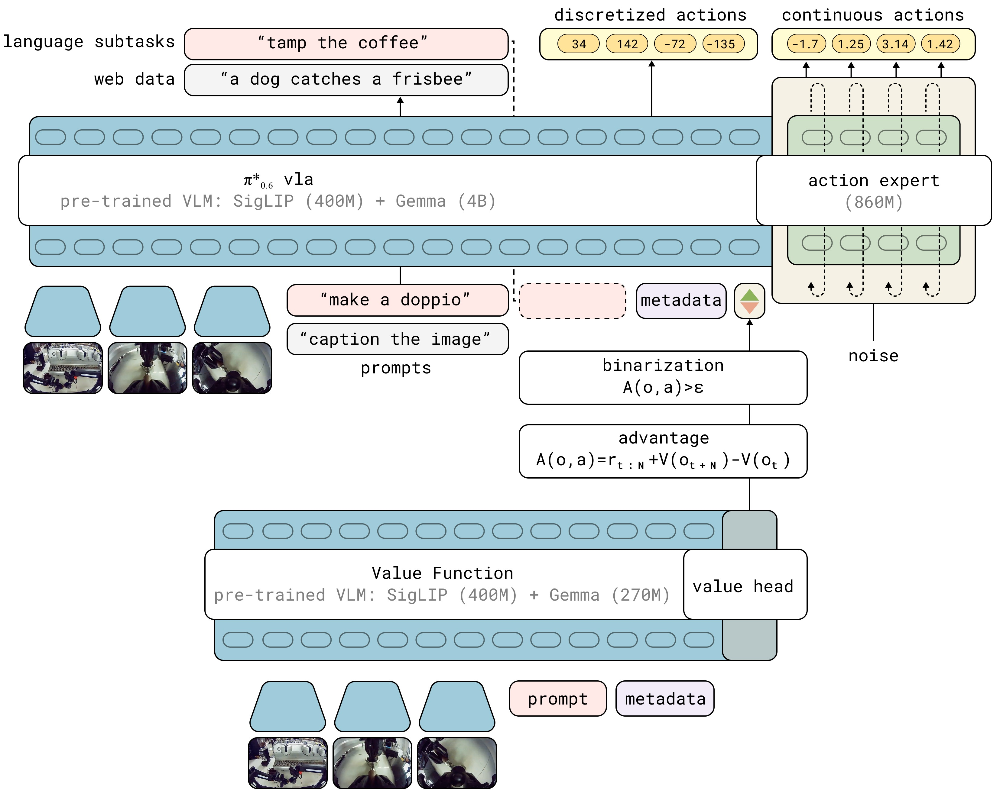*

*图11：π*_{0.6} VLA 与价值函数在 RECAP 训练中的交互关系。左侧 VLA 模型使用预训练的 VLM 编码器（Gemma 3 4B），按照 KI 训练策略（Knowledge Insulation：动作专家的梯度通过 stop gradient 与 VLM 隔离）。VLA 的输入包括多视角图像、语言指令和 advantage indicator I_t（每个动作的优势二值化标签），输出包含离散 token（子任务描述 ľ、FAST 量化的离散动作 a^ℓ）和连续动作（经由 flow matching 动作专家生成）。右侧是并行训练的价值函数（Gemma 3 670M 编码器 + 分布值头，对每个状态输出 201 个 value bin 的概率分布）。价值函数用于计算每个动作的优势值，进而决定 I_t 的标签，形成闭环。*

### 6.1 π*_{0.6} 模型架构

```
┌────────────────────────────────────────────────────────────┐
│                    π*_{0.6} VLA 模型                          │
├────────────────────────────────────────────────────────────┤
│                                                             │
│  输入                                                       │
│  ┌─────────┐  ┌─────────┐  ┌──────────┐  ┌───────────┐   │
│  │ Cam 1   │  │ Cam 2   │  │ Cam 3   │  │ 关节位置   │   │
│  │ (base)  │  │ (wrist L)│  │ (wrist R)│  │ + 夹爪    │   │
│  └────┬────┘  └────┬────┘  └────┬────┘  └─────┬─────┘   │
│       └────────────┴────────────┴──────────────┘          │
│                        │                                    │
│  ┌─────────────────────▼─────────────────────────────┐    │
│  │          VLM Backbone: Gemma 3 (4B)               │    │
│  │  ● 处理多视角图像 + 关节位置 + 语言指令            │    │
│  │  ● 输出：子任务描述 ľ (text tokens)                  │    │
│  │  ● 停止梯度：不接收动作专家的梯度回传               │    │
│  └─────────────────────┬─────────────────────────────┘    │
│                        │                                    │
│          ┌─────────────┴─────────────┐                     │
│          ▼                            ▼                    │
│  ┌─────────────────┐     ┌─────────────────────┐          │
│  │  自回归解码       │     │  自回归解码           │          │
│  │  量化动作 a^ℓ     │     │  语言输出 ľ          │          │
│  │  (FAST tokenizer) │     │  (子任务文本)         │          │
│  └─────────────────┘     └─────────────────────┘          │
│          │                        │                         │
│          └──────────┬─────────────┘                         │
│                     ▼                                       │
│  ┌──────────────────────────────────────────────────┐      │
│  │       Action Expert: Flow Matching (860M)         │      │
│  │  ● 条件：VLM 激活 + advantage indicator I_t      │      │
│  │  ● 输出：连续动作 a_{t:t+H} (50Hz, chunk)        │      │
│  │  ● 训练：flow matching MSE loss                   │      │
│  └──────────────────────────────────────────────────┘      │
│                                                             │
└─────────────────────────────────────────────────────────────┘

                   价值函数（并行训练）
┌─────────────────────────────────────────────────────────┐
│  VLM Backbone: Gemma 3 (670M)                          │
│  ● 输入：同一组观测 o_t + 语言指令 l                   │
│  ● 输出：分布 p_ϕ(V | o_t, l) (201 bins)              │
│  ● 训练：交叉熵 on Monte Carlo 回报                    │
│  ● 推理：期望值作为 V(o_t)                             │
└─────────────────────────────────────────────────────────┘
```

### 6.2 架构关键参数

| 组件 | 参数 | 说明 |
|------|------|------|
| VLM 编码器 | Gemma 3 (4B) | 处理多模态输入 |
| 动作专家 | 860M | Flow matching 生成连续动作 |
| 价值函数编码器 | Gemma 3 (670M) | 同架构但更小 |
| 动作频率 | 50 Hz | 关节位置控制 |
| 动作块大小 | H（超参数） | 预测未来 H 步动作 |
| 价值函数 bins | 201 | 回报离散化 |

### 6.3 推理流程

```
推理时（以 "Advantage: positive" 为条件）：

观测 o_t = [cam1, cam2, cam3, 关节位置]
    │
    ▼
VLM 编码 → 子任务文本 ľ ("pick up the coffee cup")
    │
    ▼
动作专家（Flow Matching denoising）→ 连续动作 a_{t:t+H}
    │
    ▼
执行，回到下一时间步
```

---

## 七、局限性

1. **非完全自主**：依赖人工标注（奖励标签）、纠正操作和场景重置。论文提到未来可用高级策略自动化这些环节。

2. **探索策略原始**：当前主要依靠策略随机性和人工纠正来探索新方案，缺乏主动探索机制。

3. **批量式离线更新**：RECAP 采用"收集一批数据→重训练→重复"的模式，而非完全在线的 RL 循环。论文指出扩展到并行的在线 RL 是未来方向。

4. **奖励信号局限**：仅使用任务级二元成功标签作为奖励信号，无法捕捉细粒度的行为质量差异（如动作平滑度、安全性等）。

---

## 八、关键概念速查

| 术语 | 缩写 | 说明 |
|------|------|------|
| Vision-Language-Action | VLA | 同时处理视觉、语言和动作输出的多模态模型 |
| Reinforcement Learning | RL | 通过与环境互动和奖励反馈来学习最优策略 |
| Advantage Conditioning | - | 以"动作是否优于平均"为条件训练策略 |
| Value Function | VF | 评估当前状态能带来多少累积奖励的函数 |
| Distributional Value Function | - | 预测价值分布而非期望值 |
| Flow Matching | - | 通过插值噪声和数据进行连续生成，不依赖精确似然 |
| Knowledge Insulation | KI | 停止动作梯度回传到 VLM 的训练策略 |
| Classifier-Free Guidance | CFG | 推理时调整条件/无条件模型权重来锐化分布 |
| DAgger | - | 在策略执行时由专家提供纠正的数据集聚合方法 |
| Advantage Weighted Regression | AWR | 用优势值加权回归进行离线 RL 训练 |
| Monte Carlo Return | MC | 从轨迹中直接计算的实际累积奖励 |
