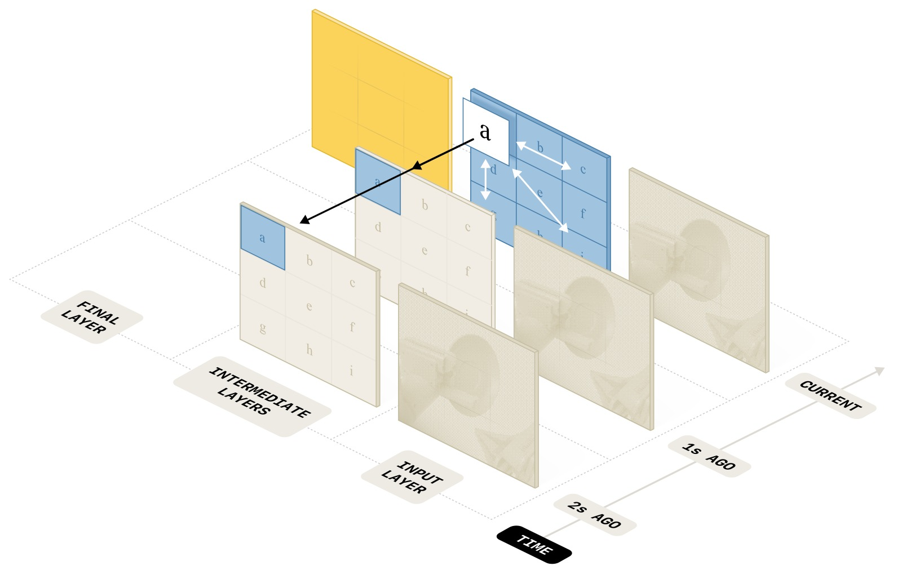
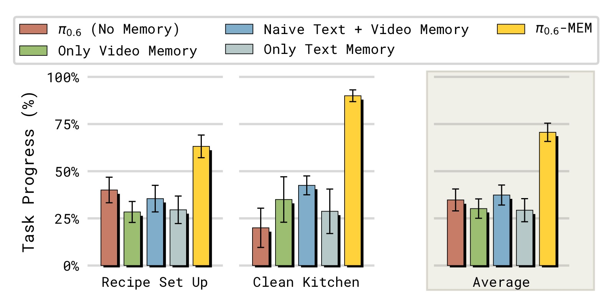
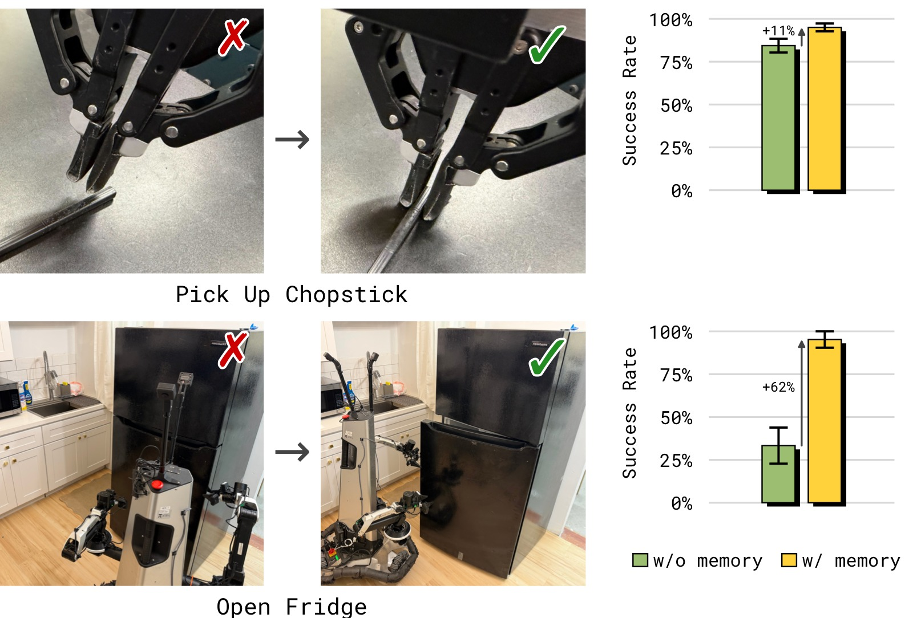
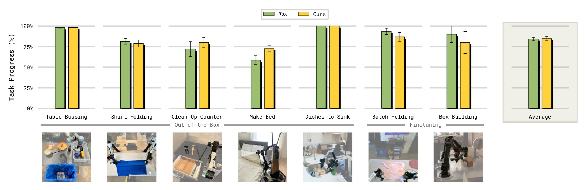
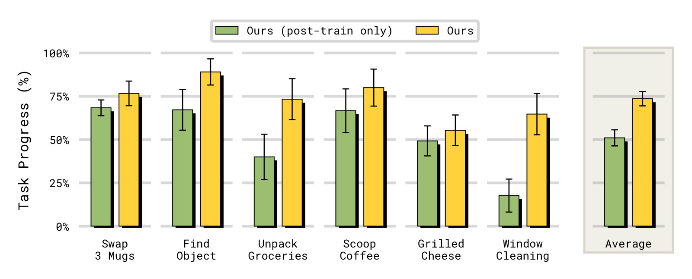

# MEM: Multi-Scale Embodied Memory for Vision Language Action Models

> **论文信息**
> - 作者：Marcel Torne*, Karl Pertsch*, Homer Walke, Kyle Vedder, Suraj Nair, Brian Ichter, Allen Z. Ren, Haohuan Wang, Jiaming Tang, Kyle Stachowicz, Karan Dhabalia, Michael Equi, Quan Vuong, Jost Tobias Springenberg, Sergey Levine, Chelsea Finn, Danny Driess
> - 通讯作者：Physical Intelligence（PI）
> - 投稿方向：投稿（under review）
> - arXiv ID：arXiv:2603.03596v2
> - 代码：https://pi.website/research/memory

---

## 一、核心问题

机器人策略在执行长时间跨度（long-horizon）任务时需要**记忆**。传统做法是将过去观测序列直接输入策略模型，但这在复杂多阶段现实任务中面临两个根本挑战：

1. **计算不可行**：将数十分钟的密集观测全部输入模型，推理延迟远超实时控制要求（通常需要在几百毫秒内完成决策）
2. **表征粒度不匹配**：不同时间尺度的记忆需要不同的表征方式——短期记忆需要精细的视觉细节（如解决遮挡、调整抓取角度），而长期记忆只需要语义层面的抽象信息（如"已经加了三种食材"）

> 核心洞察：**有效的记忆架构应该用多种模态来捕捉不同抽象层次的记忆**——短周期用密集视觉记忆，长周期用压缩的语言记忆。

---

## 二、核心思路 / 方法

MEM 提出了一个**混合模态（mixed-modal）的长时间记忆系统**，包含两个关键组件：

### 2.1 整体架构：高层-低层策略分解

MEM 将动作预测问题分解为两个层次：

$$\pi(a_{t:t+H}, l_{t+1}, m_{t+1} | o_{t-T:t}, m_t, g) \approx \pi_\text{LL}(a_{t:t+H} | o_{t-K:t}, l_{t+1}, g) \cdot \pi_\text{HL}(l_{t+1}, m_{t+1} | o_{t}, m_{t}, g)$$

其中：
- $\pi_\text{HL}$：**高层策略**，生成子任务指令 $l_{t+1}$ 和更新的语言记忆 $m_{t+1}$
- $\pi_\text{LL}$：**低层策略**，基于短期观测 $o_{t-K:t}$（$K \ll T$）和子任务指令生成连续动作
- $m_t$：**语言记忆**，对过去语义事件的压缩总结


*图1：MEM 记忆系统的整体架构。左侧为高层策略，负责维护和更新语言记忆 $m_t$（长期语义记忆）；右侧为低层策略，使用高效的视频编码器压缩短期图像记忆。两层策略通过子任务语言指令 $l_{t+1}$ 连接。*

**子图解读：** 该图分为左右两个主要部分。左侧展示语言记忆的更新机制：高层策略 $\pi_\text{HL}$ 基于当前观测 $o_t$、任务目标 $g$ 和上一时刻的语言记忆 $m_t$，预测更新后的记忆 $m_{t+1}$ 和下一个子任务指令 $l_{t+1}$。记忆更新过程如右下角示例所示——从 "I placed a plate in the cabinet" 追加为 "I placed a plate in the cabinet, moved to the counter, and picked up a bowl"。右侧展示低层策略的视频编码器：多帧历史图像通过 ViT 编码器处理，其中每隔 4 层插入时间注意力（fusion layers），最终只为当前帧输出编码表示传递给 VLA backbone，过去的 token 被丢弃以控制计算量。

### 2.2 语言记忆（Language Memory）—— 长期语义记忆

语言记忆 $m_t$ 是对过去**语义事件**的自然语言总结。核心设计：

- **模型主动更新**：高层策略 $\pi_\text{HL}$ 同时预测子任务指令和记忆更新，由模型自己决定何时以及如何更新记忆
- **LLM 标注训练数据**：将人类标注的子任务指令 $l_{0:T}$ 和每步的成功/失败标签输入大语言模型，让 LLM 总结"对未来任务执行仍有用的信息"
- **关键：压缩与丢弃**：LLM 被指示**主动压缩和丢弃信息**。例如：
  - 压缩前：`I put a light green bowl, a dark blue bowl and a bright yellow bowl into the top right cabinet`
  - 压缩后：`I placed three bowls in the top right cabinet`
- **丢弃失败尝试**：模型只记录成功的子任务结果，不记录失败的尝试。这减少了训练-推理分布偏移——训练数据中很少有重复子任务（人类演示通常一次成功），但推理时策略可能反复失败。如果不压缩，重复的子任务指令会导致分布偏移


*图2：MEM 策略在多个具有挑战性的长时间跨度灵巧操作任务上进行测试，这些任务需要保持长达 15 分钟的记忆，包括：准备食谱食材、清理厨房、制作烤芝士三明治。*

**子图解读：** 图中展示了 MEM 处理的四类长时间跨度任务场景。第一行：Recipe Setup（食谱准备），机器人需要从冰箱、橱柜、抽屉中取出食谱所需的所有食材和厨具，并放置到指定位置。这需要记住哪些物品已经取出、哪些橱柜门需要关闭。第二行：Clean Up Kitchen（清理厨房），包括用海绵擦拭台面、用纸巾擦干、将物品放回冰箱、清洗碗碟并放入晾干架。这需要记住清洁进度（哪些台面已擦）、洗涤步骤（是否已加洗洁精、碗的正反面是否都洗过）。第三行：Grilled Cheese（烤芝士三明治），需要组装三明治、煎制并计时翻面。这需要精确的计时记忆——每面煎 30 秒到 3 分钟。第四行：展示了其他需要记忆的任务，包括 Find Object（找物体）、Scoop Coffee（舀咖啡）、Unpack Groceries（取出杂货）、Three-way Swap Mugs（三杯交换）。

### 2.3 视频编码器（Video Encoder）—— 密集短期视觉记忆

短期视觉记忆需要密集的观察序列输入，但直接逐帧编码图像并输入 VLA backbone 会导致推理延迟爆炸。MEM 的解决方案是设计一个**高效的视频编码器**。


*图3：不同历史帧数下的推理延迟对比（使用 $\pi_{0.6}$ VLA，4 路相机，NVIDIA H100 GPU）。横轴为历史帧数（含当前帧），纵轴为推理延迟（ms）。*

**子图解读：** 横轴为输入模型的总帧数（每帧包含 4 路相机图像），纵轴为单次推理耗时。绿色虚线标出了实时推理的关键阈值（约 200ms，参考 $\pi_{0.6}$ 论文中的实时要求）。Naive（蓝色）方案在 3 帧时已超过 200ms，6 帧时超过 400ms，呈接近线性增长。而 MEM 的 video encoder（橙色）始终保持远低于阈值的延迟，6 帧时仅约 150ms。这是因为 video encoder 在 ViT 内部完成了时间维度的融合和压缩，传递给 VLA backbone 的 token 数与单帧情况相同，因此 backbone 部分的计算量不随历史帧数增长。

**视频编码器的核心设计：**



*图4：MEM 视频编码器的时空分离注意力机制。白色箭头表示每个观测帧内部的双向空间注意力（spatial attention），黑色箭头表示跨帧的因果时间注意力（causal temporal attention）。上层丢弃过去时间步的 token 以压缩输入。*

**子图解读：** 图中展示了 ViT 中多个层的注意力模式。每个矩形块代表一帧图像的 patch token 集合。在标准层（白色箭头），只在每帧内部进行双向空间注意力——每一帧独立处理。在 fusion 层（黑色箭头，每隔 4 层插入），除了空间注意力外，还添加了因果时间注意力——同一空间位置的 patch 会关注所有过去帧中对应位置的 patch。关键设计是：在上层（图中靠右的层），过去帧的 token 被直接丢弃（图中变暗的块），只有当前帧的 token 继续向后传递。这意味着 transformer backbone 接收的 token 数量与无记忆的单帧 VLA 完全相同，因此不会增加 backbone 的计算量。

**技术要点：**

- **时空分离注意力（space-time separable attention）**：每隔 4 层在标准空间注意力的基础上增加因果时间注意力
  - 空间注意力：每个 patch 关注同一帧内的所有 patch
  - 时间注意力：每个 patch 关注所有过去帧中同一空间位置的 patch（因果 mask）
- **计算复杂度**从 $\mathcal{O}(n^2K^2)$ 降至 $\mathcal{O}(Kn^2 + nK^2)$，其中 $n$ 是每帧 patch 数，$K$ 是帧数
- **零新增参数**：视频编码器不引入新的可学习参数，仅修改注意力模式并添加固定的正弦时间位置编码
- **单帧等价性**：$K=1$ 时（边界条件 $e(0)=0$），编码器输出与原始 VLM 完全一致，因此可以从任何预训练 VLM 的 ViT 权重初始化
- **Token 压缩**：上层仅传递当前时间步的表示，过去帧的 token 被丢弃——时间信息已被融合进当前帧的表示中

---

## 三、训练过程

### 3.1 模型初始化与架构

MEM 集成到 $\pi_{0.6}$ VLA 中：
- **Backbone**：从预训练的 Gemma3-4B VLM 初始化
- **动作预测**：离散 FAST action token 预测 + 860M 参数的 flow-matching action expert
- **输入分辨率**：448×448 px/相机，最多 4 路相机
- **本体感知状态**：通过线性投影映射到 backbone embedding 空间（每个状态一个 token），避免文本格式的状态序列占用过多 token

### 3.2 预训练（Pre-training）

- **数据混合**：机器人遥操作演示 + 策略 rollout 数据 + 人工修正 + 视觉-语言任务 + **视频-语言任务**（如视频字幕）
- **观察记忆长度**：6 帧观察（5 帧历史 + 当前帧），步长 1 秒
- **关键设计**：在预训练阶段引入视频数据，让模型学会使用记忆

### 3.3 后训练（Post-training）

- **灵活扩展记忆长度**：预训练时仅 6 帧（5 秒），后训练时可扩展到 18 帧（54 秒）
- **实时推理**：使用 inference-time RTC 或 training-time RTC 实现异步实时推理

---

## 四、实验与结果

### 4.1 长时间跨度挑战任务



*图5：长时间跨度任务的性能对比。纵轴为 Progress Score（进度分，满分 1.0），评估策略在 Recipe Setup 和 Clean Up Kitchen 两个任务上的表现。*

**子图解读：** 图中包含两个子图，分别对应两个长时间跨度任务。

**左图 — Recipe Setup（食谱准备）：** 对比了五种配置。$\pi_{0.6}$（无记忆）仅获约 0.15 的进度分，几乎无法完成任何有意义的子任务。MEM（Ours，约 0.72）表现最佳。消融实验显示：移除视频记忆（w/o video mem，约 0.52）和移除语言记忆（w/o lang mem，约 0.45）都会导致显著性能下降，证明两个记忆组件都不可或缺。Naive 语言记忆（w/o lang compression，约 0.38）比有压缩的版本更差——它简单地拼接所有历史子任务指令而非压缩总结，遭遇了训练-推理分布偏移问题：训练数据中每个子任务通常只被执行一次，但推理时策略可能反复失败重试同一子任务，导致指令序列的分布与训练时不同。

**右图 — Clean Up Kitchen（清理厨房）：** 趋势类似。MEM（Ours，约 0.78）远超 $\pi_{0.6}$ 无记忆基线（约 0.10）。这个任务不仅需要记忆（记住清洁进度、洗涤步骤），还需要多种灵巧操作（擦拭、用水、用洗洁精）。移除任一组件的性能下降与 Recipe Setup 任务一致。值得注意的是，移除视频记忆对该任务的影响尤其大——擦台面和洗碗需要持续观察来判断是否已经完成清洁，缺乏视觉记忆的策略容易"卡住"。

### 4.2 In-Context 操作策略适应



*图6：有记忆和无记忆策略在 in-context adaptation 任务上的对比。左为 Chopstick Pick Up（筷子拾取），右为 Open Refrigerator（开冰箱门）。纵轴为成功率（Success Rate）。*

**子图解读：** 该图测试了 MEM 的一个关键新能力——根据记忆中的失败经历在上下文中调整操作策略。

**左图 — Chopstick Pick Up：** 任务是在变高度的桌子上拾取扁平的筷子。桌子高度设为训练分布外的极端低值，导致策略频繁抓空。$\pi_{0.6}$ 无记忆策略成功率几乎为 0——每次推理都是独立的，策略反复用同样的方式失败而无法调整。MEM 策略成功率接近 1.0——策略看到短期记忆中"刚才抓空了"，自动调整抓取高度，在下一次尝试中成功。训练方式：收集人类在策略失败后进行纠正的干预数据（调整抓取高度后成功拾取），保留失败尝试在模型的短期记忆中。

**右图 — Open Refrigerator：** 冰箱门没有明显的铰链方向视觉线索，策略最初尝试打开的方向可能错误。成功定义为 ≤4 次抓取尝试内打开门。MEM 策略成功率约 0.85，$\pi_{0.6}$ 无记忆约 0.35。MEM 策略观察到"上一次拉的方向打不开"，在下一次尝试中切换开门方向。而无记忆策略的多次尝试是独立随机采样，无法进行有意的策略切换。

> In-context adaptation 是 MEM 赋予 VLA 的一项重要新能力——策略不仅"记住"发生了什么，更能"利用"记忆来智能地调整行为。

### 4.3 分析实验：与现有记忆方法的全面对比


*图7：不同记忆方法在核心记忆能力任务上的对比。横轴为任务（Three-way Swap Mugs、Scoop Coffee、Find Object、Unpack Groceries、Window Cleaning、Grilled Cheese），纵轴为成功率。*

**子图解读：** 该图在 6 个精心设计的记忆能力测试任务上，对比了 MEM 与多种记忆方法及无记忆基线。所有任务都需要记忆能力但挑战维度不同：

- **Three-way Swap Mugs（三杯交换）：** 测试 partial observability——每次只能放一个杯子在咖啡机下，需要记住哪些杯子已经处理过。$\pi_{0.6}$ 无记忆约 15%，Proprio Memory 约 20%，Pool Memory 约 35%，MEM 约 65%。

- **Scoop Coffee（舀咖啡，计数能力）：** 需要精确添加 2 勺咖啡豆。无记忆约 42%（接近随机——加或不加），Proprio Memory 约 55%，Pool Memory 约 75%，MEM 约 85%。对于这种只需记住少量比特信息的简单记忆任务，所有记忆方法都有帮助。

- **Find Object（找物体，空间记忆）：** 记住人把物体放进了 4 个抽屉中的哪一个。无记忆约 25%（纯随机 1/4），Pool Memory 约 42%，Proprio Memory 约 45%，MEM 约 78%。Proprio Memory 只能记住机器人自身状态，无法记住环境状态（物体位置），因此表现受限。Pool Memory 的激进平均池化压缩丢失了关键的空间细节。

- **Unpack Groceries（取出杂货，partial observability）：** 从袋子里取物品，袋内不可见，需记住还剩多少物品。无记忆约 35%，Proprio Memory 约 35%，Pool Memory 约 30%，MEM 约 72%。Proprio Memory 和 Pool Memory 在此任务上几乎无帮助——前者无法感知环境物体数量，后者的压缩损失了计数所需的细节。

- **Window Cleaning（擦窗，空间+步序记忆）：** 需要记住窗户的哪些部分已经擦过。无记忆约 8%，Pool Memory 约 22%，Proprio Memory 约 28%，MEM 约 62%。这个任务同时需要空间记忆（哪些区域已覆盖）和步序记忆（喷清洁剂→撕纸巾→擦窗→扔垃圾）。

- **Grilled Cheese（烤芝士，计时记忆）：** 需要记住每面已煎了多长时间（30 秒到 3 分钟之间翻面）。无记忆约 8%，Proprio Memory 约 18%，Pool Memory 约 28%，MEM 约 42%。这是所有方法中最难的任务——不仅需要记忆，还需要精确的时间感知和复杂的灵巧操作（组装三明治、翻面、装盘）。

**核心发现：MEM 是唯一在所有六类记忆能力测试中都表现强劲的方法。** Pool Memory 的激进压缩导致其丢失空间细节，在需要较长记忆的任务上尤其不足；Proprio Memory 仅对机器人自身状态相关记忆有效。



*图8：在不需要记忆的灵巧操作任务上，MEM 与无记忆 SOTA 方法的对比。纵轴为成功率。*

**子图解读：** 该图在 6 个测试灵巧操作但不主要需要记忆的任务上对比各方法，验证 MEM 不会因为添加记忆而降低基础操作性能。

- **Table Bussing（收拾餐桌）：** 将 12 个物品分类到回收箱和垃圾桶。$\pi_{0.6}$ 约 70%，MEM 约 72%，两者持平。
- **Shirt Folding（叠衬衫）、Make Bed（整理床铺）、Kitchen Cleanup（厨房清理）、Box Building（组装纸箱，需要精确双臂协调）、Batch Folding（批量叠衣）：** 在所有任务上 MEM 与 $\pi_{0.6}$ 表现相当。

**这是一个重要发现：** 许多先前工作报告了添加记忆后策略性能下降的问题（由于 causal confusion——策略学会简单地复制之前的动作而非基于当前观察决策）。MEM 通过大规模多样化预训练数据混合（包含不同最优性、速度、控制频率的 episode，以及互联网视频）避免了这一问题。数据的多样性防止了视频编码器学到虚假的时间相关性。

### 4.4 预训练的重要性



*图9：预训练 vs 仅后训练引入记忆。比较 MEM（完整预训练 + 后训练）、MEM Post-train Only（仅后训练引入 video encoder）、Pool Memory（平均池化基线）。纵轴为成功率。*

**子图解读：** 该图在 4 个记忆任务上对比三种配置：

- **Scoop Coffee：** MEM 约 85%，MEM Post-train Only 约 72%，Pool Memory 约 75%。仅后训练的 MEM 仍优于 Pool Memory，说明 video encoder 架构本身更有效。
- **Find Object：** MEM 约 78%，MEM Post-train Only 约 42%，Pool Memory 约 42%。仅后训练性能大幅下降，说明在多样化数据上预训练对空间记忆能力至关重要。
- **Unpack Groceries 和 Window Cleaning：** 趋势一致，MEM 完整训练显著优于仅后训练和 Pool Memory。

**核心发现：** 在多样化机器人和非机器人视频数据上预训练 video encoder 显著提升了模型利用记忆的能力——即使后训练时将记忆范围从预训练的 5 秒扩展到 1 分钟。仅在后训练时引入记忆的模型仍然从 $\pi_{0.6}$ 的预训练 checkpoint 初始化，但由于预训练阶段没有发展出记忆能力，其后训练效果大打折扣。

---

## 五、关键洞察与技术亮点

1. **多模态记忆 vs 单模态记忆**：不同时间尺度的记忆需要不同的表征模态。使用单一模态（纯图像、纯语言、纯本体感知）都会在某些能力上做出妥协。MEM 的混合模态设计是第一个覆盖全能力谱系的方法。

2. **语言记忆的压缩是必须的，不是可选的**：简单地拼接历史指令（"naive"方式）会导致训练-推理分布偏移。通过 LLM 标注并训练模型主动压缩记忆（丢弃已完成/无关的信息），既减少了分布偏移，又控制了 token 数量。

3. **Zero-parameter 视频编码器**：不引入新参数，仅修改注意力模式。这意味着可以从任何预训练 VLM 的 ViT 初始化，实现"即插即用"的记忆能力。

4. **预训练记忆是关键**：如果仅在目标任务后训练时引入记忆，性能显著低于在预训练阶段就融入记忆的模型。这暗示"使用记忆"本身是一种需要在大规模多样化数据上学习的元技能。

5. **记忆不降低基础操作性能**：与先前工作的发现相反，MEM 添加记忆后并没有在非记忆任务上出现性能退化——这归功于多样化的预训练数据阻止了虚假时间相关性的学习。

---

## 六、代码实现解读

> 论文未提供公开代码仓库。以下基于论文描述的技术细节还原核心架构。

### 6.1 整体推理流程

```
┌─────────────────────────────────────────────────────────────┐
│                     MEM VLA 推理流程                         │
├─────────────────────────────────────────────────────────────┤
│                                                             │
│  ┌──────────┐    ┌──────────────┐    ┌──────────────────┐  │
│  │ 相机流×4 │───▶│ Video Encoder│───▶│ VLA Backbone     │  │
│  │ (K 帧)   │    │ (时空注意ViT)│    │ (Gemma3-4B)      │  │
│  └──────────┘    └──────────────┘    └───────┬──────────┘  │
│                                              │              │
│  ┌──────────┐                        ┌──────▼──────────┐  │
│  │语言记忆 m_t│◀───────────────────────│ High-Level π_HL │  │
│  │(文本总结) │                        │ → l_{t+1}       │  │
│  └──────────┘                        │ → m_{t+1}       │  │
│                                      └──────┬──────────┘  │
│                                              │              │
│  ┌──────────┐                        ┌──────▼──────────┐  │
│  │ 动作块   │◀───────────────────────│ Low-Level π_LL  │  │
│  │ a_{t:t+H}│                        │ + Flow Matching │  │
│  └──────────┘                        │   Action Expert │  │
│                                      └─────────────────┘  │
└─────────────────────────────────────────────────────────────┘
```

### 6.2 Video Encoder 架构（时空分离注意力）

```
输入: K 帧 × N 个 patch，每层 l：

第 0-3 层（标准空间注意力）:
┌──────┐ ┌──────┐ ┌──────┐
│Frame1│ │Frame2│ │FrameK│   每帧内部双向空间注意力
│ ●──● │ │ ●──● │ │ ●──● │   (white arrows only)
│ │  │ │ │ │  │ │ │ │  │ │
│ ●──● │ │ ●──● │ │ ●──● │
└──────┘ └──────┘ └──────┘

第 4 层（fusion，空间 + 因果时间注意力）:
┌──────┐   ┌──────┐   ┌──────┐
│Frame1│◀──│Frame2│◀──│FrameK│  因果时间注意力
│ ●──● │   │ ●──● │   │ ●──● │  (black arrows across)
│↕│  │↕│   │↕│  │↕│   │↕│  │↕│
│ ●──● │   │ ●──● │   │ ●──● │  空间注意力继续
└──────┘   └──────┘   └──────┘  (white arrows within)

上层 (K/4 层起):
┌──────┐ ┌──────┐ ┌──────┐
│ ⬛⬛  │ │ ⬛⬛  │ │ ●──● │  只有当前帧 token 保留
│ ⬛⬛  │ │ ⬛⬛  │ │ │  │ │  过去帧被丢弃 (⬛)
│ ⬛⬛  │ │ ⬛⬛  │ │ ●──● │
└──────┘ └──────┘ └──────┘
                  ↑ 仅此传递给 VLA Backbone
```

### 6.3 时空分离注意力的数学描述

设 $\mathbf{z}^{l-1}_{p, t}$ 为第 $l$ 层、空间 patch $p$、时间步 $t$ 的输入 embedding。

1. **时间位置编码**：$\hat{\mathbf{z}}^{l-1}_{p, t} = \mathbf{z}^{l-1}_{p, t} + e(t)$，其中 $e(0)=0$（边界条件保证单帧等价性）
2. **复用 ViT 的 QKV 投影**：$\mathbf{q}, \mathbf{k}, \mathbf{v}$ 由标准投影得到
3. **空间注意力**：$\alpha^{l,a}_{p,t}(\mathcal{S}=\{1,\dots,N\}, \mathcal{T}=\{\})$ — 仅关注同帧内的空间 patch
4. **时间注意力**：$\alpha^{l,a}_{p,t}(\mathcal{S}=\{\}, \mathcal{T}=\{1,\dots,T\})$ — 仅关注同 patch 的不同时间步（因果 mask）
5. **融合**：每隔 4 层，在空间注意力的基础上叠加时间注意力

### 6.4 语言记忆训练数据生成

```
┌────────────────────────────────────────────┐
│        语言记忆训练数据生成流程              │
├────────────────────────────────────────────┤
│                                            │
│  人类标注的子任务序列:                       │
│  l_0: "pick up bowl"     (success)         │
│  l_1: "place in cabinet" (success)         │
│  l_2: "pick up plate"    (success)         │
│  l_3: "place in sink"    (success)         │
│                                            │
│          ▼                                 │
│  ┌──────────────────────┐                  │
│  │   Off-the-shelf LLM  │                  │
│  │                      │                  │
│  │ Prompt: 总结过去子任务 │                  │
│  │ 中对未来仍有用的信息，  │                  │
│  │ 主动压缩和丢弃无关细节 │                  │
│  └──────────┬───────────┘                  │
│             ▼                              │
│  m_t 序列:                                 │
│  m_1: "I picked up a bowl"                 │
│  m_2: "I placed a bowl in the cabinet"     │
│  m_3: "I placed a bowl in cabinet,         │
│         picked up a plate"                 │
│  m_4: "I placed bowl in cabinet,           │
│         plate in sink"                     │
│                                            │
│  → 用作 π_HL 训练的标签                     │
└────────────────────────────────────────────┘
```

---

## 七、局限性

论文未明确列出局限性部分，但从方法设计和实验设置中可以推断：

1. **记忆范围仍限于单次任务**：当前 MEM 的记忆跨度为单次执行任务（最多 15 分钟），尚未扩展到跨任务、跨天甚至跨周/月的持续学习场景（论文在结论中指出了这一未来方向）
2. **语言记忆依赖 LLM 标注质量**：训练数据的语言记忆由 off-the-shelf LLM 生成，LLM 的总结质量直接影响记忆系统的训练效果
3. **视频编码器的时间范围扩展是启发式的**：从预训练的 5 秒扩展到后训练的 54 秒，类似于 LLM 中的 context length extension，但缺乏理论保证
4. **需要大规模多样化预训练数据**：在较小、较单一的数据集上，MEM 可能仍会遇到先前工作中报告的 causal confusion 问题

---

## 八、关键概念速查

| 概念 | 说明 |
|------|------|
| **MEM** | Multi-Scale Embodied Memory，本文提出的多尺度具身记忆系统 |
| **Language Memory** ($m_t$) | 以自然语言形式压缩的长期语义记忆，由高层策略维护和更新 |
| **Video Encoder** | 基于时空分离注意力的高效视频编码器，实现短期密集视觉记忆 |
| **Space-Time Separable Attention** | 将全联合时空注意力分解为空间注意力 + 时间注意力，复杂度从 $\mathcal{O}(n^2K^2)$ 降至 $\mathcal{O}(Kn^2 + nK^2)$ |
| **In-Context Adaptation** | 策略利用短期记忆中的失败经历，在上下文中调整操作策略的能力 |
| **$\pi_{0.6}$ VLA** | Physical Intelligence 的通用视觉-语言-动作模型，基于 Gemma3-4B |
| **FAST Action Tokens** | 离散动作 token 预测方法，用于 VLA 的动作输出 |
| **Flow Matching Action Expert** | 860M 参数的连续动作生成模型，梯度不反传至 backbone |
| **RTC (Real-Time Chunking)** | 实时分块推理，将长序列拆分为实时可执行的短动作块 |
