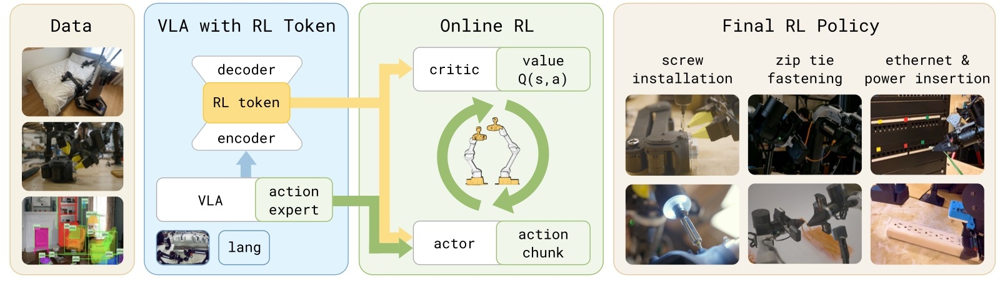
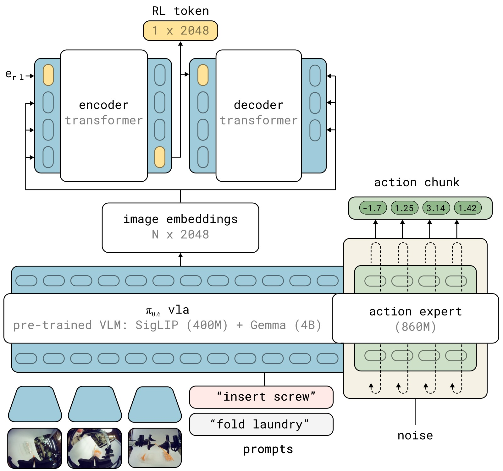
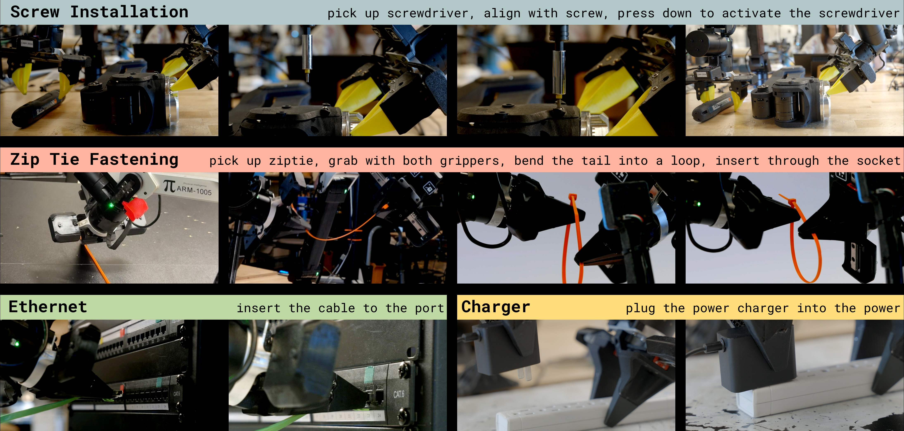
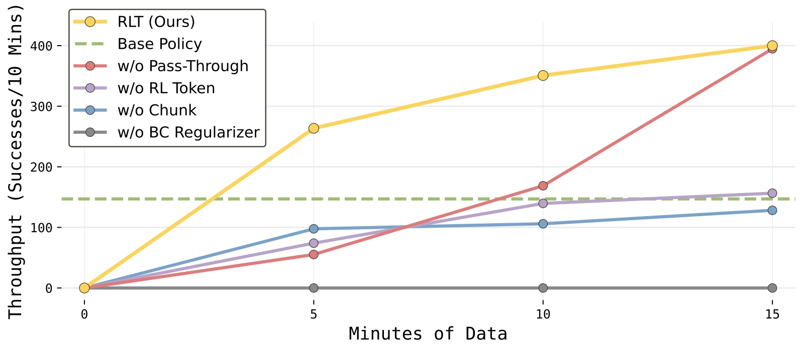
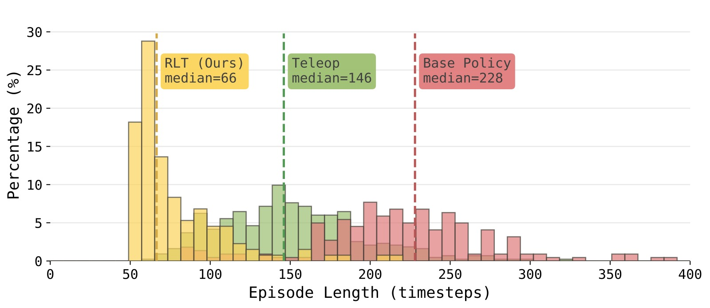

# RL Token: Bootstrapping Online RL with Vision-Language-Action Models

> **论文信息**
> - 作者：Charles Xu, Jost Tobias Springenberg, Michael Equi, Ali Amin, Adnan Esmail, Sergey Levine, Liyiming Ke
> - 通讯作者：Physical Intelligence（PI）
> - 投稿方向：投稿（under review，IEEEtran conference 格式，匿名评审）
> - arXiv ID：arXiv:2604.23073v1
> - 代码：未公开

---

## 一、核心问题

机器人 VLA（Vision-Language-Action）模型虽然在大规模预训练后展现出广泛的泛化操作能力，但在**精密任务的"最后一毫米"阶段**经常力不从心：动作速度慢、需要反复停顿和重试、关键接触阶段的微小偏差会累积为整体失败。

现有的改进方案各有利弊：

1. **全模型 RL 微调**（如 RECAP、DPPO）：更新整个 VLA 的参数，在真实机器人上数小时内难以收敛，计算和样本效率都很低
2. **小模型样本高效 RL**（如 HIL-SERL、RL$^{100}$）：在标准视觉编码器（如 ResNet）上训练小规模 RL 策略，学习速度快但完全放弃了大 VLA 模型中的丰富行为先验

> 核心洞察：**不需要在"大模型慢 RL "和"小模型快 RL"之间二选一——可以让冻结的 VLA 提供感知表征和行为先验，让轻量级 RL 网络在在线实践中做快速局部精调。**

---

## 二、核心思路 / 方法

RLT（RL Token）提出了一种简洁的"分工"架构：**冻结的 VLA 负责提供广域感知理解和参考动作建议，轻量级的 Actor-Critic 负责在关键任务阶段做在线精调**。整个方法建立在三个核心设计之上。

### 2.1 整体架构：VLA + RL Token + 轻量 RL 头



*图1：RLT 系统总览。该方法在 VLA 中引入"RL Token"——通过训练编码器-解码器从 VLA 内部特征中产生紧凑且有意义的表示。提取的表示随后用于训练轻量级 Actor-Critic 网络进行样本高效的在线 RL，使精密任务能在数小时甚至数分钟的真实机器人经验中完成精调。*

**子图解读：** 该图展示了 RLT 方法的两个阶段。第一阶段（离线，GPU 上）：在少量任务演示数据上训练一个编码器-解码器 transformer 来提取 RL Token，将 VLA 高维内部 token 嵌入压缩为紧凑表示向量；第二阶段（在线，机器人上）：冻结 VLA 和 RL Token 提取器，仅训练一个小型 MLP 构成的 Actor-Critic，以 RL Token 为状态表示、以 VLA 参考动作为条件输入，在真实交互中快速精调策略。下排从左到右展示了 RLT 策略在四个任务上的执行效果——螺丝安装、扎带紧固、以太网插入和充电器插入。

### 2.2 RL Token：用信息瓶颈压缩 VLA 知识

VLA 内部 transformer 的 token 嵌入是高维的（每层每个 token 都有嵌入向量），直接用作 RL 状态表示计算效率太低。RLT 的核心创新是训练一个**编码器-解码器（encoder-decoder）结构**，利用信息瓶颈原理将 VLA 的全部 token 嵌入压缩为一个紧凑的 RL Token。



*图2：RL Token 提取的架构细节。RLT 在预训练 VLA 上添加一个编码器-解码器 transformer。编码器将 VLA 的 token 嵌入序列加上一个可学习的 `<rl>` token 嵌入，输出 RL Token（即 `<rl>` 位置的编码器输出）；解码器以自回归方式从 RL Token 重建原始 token 嵌入，重建 MSE 作为训练损失。*

**子图解读：** 图中上半部分展示了 VLA 的标准工作流程——多路相机图像经过 VLM Backbone 得到 token 嵌入，Action Expert（diffusion 模型）基于 token 嵌入生成动作块。图中下半部分展示了 RL Token 提取模块——Encoder Transformer 接收 VLA 的 token 嵌入序列和可学习的 RL token 嵌入，输出 RL Token（z_rl）；Decoder Transformer 以 RL Token 为条件，自回归地预测原始 VLA token 嵌入。通过 stop-gradient 操作，VLA 参数在重建损失上不被更新——重建损失仅训练编码器-解码器参数 φ。训练完成后，整个编码器-解码器冻结，RL 阶段仅使用 z_rl 作为状态表示。

具体地，设 $\mathbf{z} = f(s,\ell;\theta_{\text{vla}})$ 为 VLA 最后一层的 token 嵌入序列 $\mathbf{z}_{1:M}$。在序列末尾追加一个可学习的嵌入 $\mathbf{e}_\texttt{rl}$，经过小型编码器 transformer $g_\phi$ 得到 RL Token：

$$\mathbf{z}_{\text{rl}} = g_\phi\!\bigl([\mathbf{z}_{1:M},\;\mathbf{e}_\texttt{rl}]\bigr)_{M+1}$$

解码器 $d_\phi$ 以 RL Token 为条件，自回归地重建原始嵌入（使用 stop-gradient $\bar{\mathbf{z}}_i = \mathrm{sg}(\mathbf{z}_i)$）：

$$\mathcal{L}_{\text{ro}} = \mathbb{E}_{\mathcal{D}}\!\Bigl[\,\sum_{i=1}^{M}\bigl\lVert h_\phi\bigl(d_\phi([\mathbf{z}_{\text{rl}},\,\bar{\mathbf{z}}_{1:i-1}])\bigr)_{\!i} - \bar{\mathbf{z}}_i \bigr\rVert^2\,\Bigr]$$

**为什么用瓶颈（autoencoder）结构？** 强制 z_rl 保留足够重建全部 token 的信息，信息瓶颈保证了压缩后的表示仍然富含任务相关特征——需要能重建出来的信息才被保留。

### 2.3 在线 RL 的三个关键设计

VLA 原生输出 $H=50$ 步（1 秒）的动作块 $\tilde{\mathbf{a}}_{1:H}$。RL 阶段使用更短的块长 $C=10$（0.2 秒），使策略更反应灵敏。

**设计 1 — 以 VLA 参考动作为条件的 Actor（Pass-Through）：**

Actor 不仅接收 RL 状态 $\mathbf{x} = (\mathbf{z}_\text{rl}, \mathbf{s}^\text{p})$，还显式接收 VLA 采样的参考动作块作为输入：

$$\pi_\theta(\mathbf{a}_{1:C} \mid \mathbf{x}, \tilde{\mathbf{a}}_{1:C}) = \mathcal{N}\big(\mu_\theta(\mathbf{x}, \tilde{\mathbf{a}}_{1:C}), \sigma^2 \mathbf{I}\big)$$

这样做的好处是双重的：(1) Actor 在 VLA 的好方案上做局部优化而非从零探索，(2) 保留了 VLA 多模态动作分布中的模式信息——Gaussian Actor 本身是单模态的，但通过条件化于采样的参考动作，可以恢复 VLA 的多模态行为。

**设计 2 — 行为正则化（BC Regularizer）：**

Actor 训练目标是最大化 Critic 值同时保持与 VLA 参考动作的接近：

$$\mathcal{L}_{\pi}(\theta) = \mathbb{E}\left[-Q_\psi(\mathbf{x}, \mathbf{a}_{1:C}) + \beta \|\mathbf{a}_{1:C} - \tilde{\mathbf{a}}_{1:C}\|_2^2\right]$$

其中 $\beta$ 控制正则化强度。这本质上是 KL 正则化 RL 的 L2 变体，将在线 RL 变成对 VLA 建议动作的"局部编辑"而非在整个动作空间中无约束搜索。消融实验中去除该项（$\beta=0$）导致性能最大幅下降，验证了它的关键作用。

**设计 3 — 参考动作 Dropout：**

一个实际失败模式是：Actor 可能学会直接复制 $\tilde{\mathbf{a}}$ 而不做任何改进（尤其在训练初期 Critic 尚未提供有用信号时）。RLT 的解决方案是：训练时对 50% 的 batch 样本将参考动作替换为零向量，强迫 Actor 建立独立的动作生成通路；推理时始终提供完整参考动作。

### 2.4 Critic 的块级 TD 学习

Critic 操作在块级（chunk level），训练目标为标准 TD 学习：

$$\hat{Q} = \sum_{t'=1}^{C} \gamma^{t'-1} r_{t'} + \gamma^C \mathbb{E}_{\mathbf{a}' \sim \pi_\theta}\big[Q_{\psi'}(\mathbf{x}', \mathbf{a}')\big]$$

$$\mathcal{L}_Q = \mathbb{E}_{(\mathbf{x}, \mathbf{a}_{1:C}, \mathbf{x}') \sim \mathcal{B}}\big[(\hat{Q} - Q_\psi(\mathbf{x}, \mathbf{a}_{1:C}))^2\big]$$

**块级设计的核心价值：** 动作块（C=10）将有效决策 horizon 从数百步压缩到约 25 步，使稀疏二进制奖励（仅在 episode 结束时提供 +1/0）下的 TD 信用分配变得可行。对比实验中，单步方法（HIL-SERL、PLD）在 50Hz、数百步的任务上完全失败或性能很差，直接验证了这一点。

---

## 三、训练过程

### 3.1 准备阶段：RL Token 训练 + VLA 微调

1. **收集任务演示**：对目标任务收集 1-10 小时遥操作演示数据 $\mathcal{D}$
2. **训练 RL Token**：在 $\mathcal{D}$ 上训练编码器-解码器参数 $\phi$，VLA 参数 $\theta_\text{vla}$ 在重建损失上冻结（stop-gradient）。训练 2000-10000 梯度步
3. **（可选）SFT 微调 VLA**：联合优化 $\mathcal{L}_{\text{ro}}(\phi) + \alpha \mathcal{L}_{\text{vla}}(\theta_\text{vla})$，其中 $\alpha > 0$ 时 VLA 也参与微调得到更好的初始策略
4. **冻结**：完成后，VLA 和 RL Token 提取器全部冻结

### 3.2 在线 RL 阶段

```
┌──────────────────────────────────────────────────────────────┐
│                   RLT 在线 RL 训练循环                         │
├──────────────────────────────────────────────────────────────┤
│                                                              │
│  【Warmup（约 5 分钟）】                                       │
│  用纯 VLA 策略收集 N_warm 步经验，人类标注成功/失败标签         │
│  → 预填充 Replay Buffer，给 Critic 提供初始学习信号             │
│                                                              │
│  【主循环】每 C=10 步（0.2s）执行一次：                         │
│                                                              │
│  ┌─ 1. VLA 推理 ─────────────────────────────────────────┐   │
│  │   ã_{1:H} ~ π_vla(s_t, ℓ)    // VLA 输出参考动作块     │   │
│  │   z_rl = encoder(vla_embeddings, e_rl)[-1]             │   │
│  │   x = (z_rl, s^p_t)           // 拼接 RL 状态          │   │
│  └───────────────────────────────────────────────────────┘   │
│                                                              │
│  ┌─ 2. 动作选择 ─────────────────────────────────────────┐   │
│  │   if human_intervention:                               │   │
│  │     a_{1:C} = a^human_{1:C}    // 人类遥操作覆盖       │   │
│  │   elif step < N_warm:                                   │   │
│  │     a_{1:C} = ã_{1:C}          // warmup 用 VLA 动作   │   │
│  │   else:                                                │   │
│  │     a_{1:C} ~ π_θ(·|x, ã_{1:C}) // Actor 精调动作      │   │
│  └───────────────────────────────────────────────────────┘   │
│                                                              │
│  ┌─ 3. 执行 & 存储 ──────────────────────────────────────┐   │
│  │   执行 a_{1:C}，观察 r_t, s_{t+1}, s^p_{t+1}            │   │
│  │   若人类干预：将 ã 替换为遥操作动作                       │   │
│  │   子采样（每 2 步存一次）→ Replay Buffer B               │   │
│  └───────────────────────────────────────────────────────┘   │
│                                                              │
│  ┌─ 4. 离线策略更新（G=5 轮，每轮：2×Critic + 1×Actor）──┐   │
│  │   采样 batch ~ B                                        │   │
│  │   ŷ = Σγ^{t-1}r_t + γ^C min_i Q_ψ'_i(x', a')           │   │
│  │   L_Q = E[(ŷ - Q_ψ(x, a))²]       // Critic TD 学习    │   │
│  │   L_π = E[-Q_ψ(x, a) + β||a - ã||²] // Actor 最大化 Q  │   │
│  │   其中 50% 样本的 ã 被置零（参考动作 dropout）            │   │
│  └───────────────────────────────────────────────────────┘   │
│                                                              │
│  【关键阶段切换】                                              │
│  - 任务前期（抓取、搬运等）：VLA 基础策略执行                   │
│  - 达到关键阶段（插拔、拧紧等）：人类触发 RL 策略接管            │
│  - 训练末期可学习自动切换（以人类干预为标签做分类）              │
└──────────────────────────────────────────────────────────────┘
```

### 3.3 训练配置

| 配置项 | 设置 |
|--------|------|
| VLA 基座 | $\pi_{0.6}$（Physical Intelligence） |
| 控制频率 | 50 Hz |
| 每步动作维度 | 14 |
| VLA 动作块长（H） | 50 步（1 秒），执行前 20 步后重规划 |
| RL 动作块长（C） | 10 步（0.2 秒） |
| RL 动作空间维度 | $C \times d = 140$ |
| Actor 网络 | 简单任务：2 层 MLP，hidden=256；困难任务：3 层 MLP，hidden=512 |
| Critic 网络 | 双 Q 网络（TD3 风格），取 min 计算 target |
| 策略分布 | 高斯策略，固定小标准差 $\sigma$ |
| 更新-数据比（UTD） | 5（每步交互做 5 轮梯度更新） |
| 子采样步长 | 2（每秒约 25 个样本） |
| 参考动作 dropout 率 | 50%（训练时），0%（推理时） |
| 单任务 RL 训练时长 | 1-2 小时墙钟时间 |
| 单任务 RL episode 数 | 400-1000 |
| 实际机器人数据量 | 约 15 分钟至 5 小时 |
| 奖励信号 | 稀疏二进制：episode 结束时人类标注成功(+1)或失败(0) |

---

## 四、实验与结果

### 4.1 任务设置

四项真实机器人操作任务，每项包含一个精密关键阶段（5-20 秒，250-1000 控制步）：



*图3：四个实验任务及其关键阶段。从上到下：(1) Screw Installation（螺丝安装）——用电钻将 M3 螺丝拧入螺纹座，需要亚毫米对齐，钻头与夹持点 10cm 力臂放大任何旋转误差；(2) Zip Tie Fastening（扎带紧固）——将扎带尾部穿过窄锁槽，涉及双臂协调和可变形物体；(3) Ethernet Insertion（以太网口插入）——将 RJ45 水晶头插入凹入端口，需要精确的位置和角度对齐以及果断的插入动作；(4) Charger Insertion（充电器插入）——将充电器插入插线板，插脚和插孔可见性差。*

| 任务 | 精密关键阶段 | 核心难点 |
|------|-------------|----------|
| **Screw Installation** | 电钻对准螺丝并拧入 | 亚毫米对齐；力臂放大误差；视觉线索仅在腕部相机可见 |
| **Zip Tie Fastening** | 扎带尾端穿入锁槽 | 双臂协调 + 可变形物体 + 毫米精度 |
| **Ethernet Insertion** | 水晶头插入凹入端口 | 位置+角度双重对齐，接触动力学高度敏感 |
| **Charger Insertion** | 充电器插入插线板 | 厘米级对齐，插脚/插孔可见性差，易反复试探 |

**评估方式：** (1) **受控关键阶段评估**——episode 从关键阶段前的随机初始化状态开始，排除前置阶段的方差干扰，每个方法 50 次评估；(2) **全任务评估**——从机器人起始姿态开始，由 VLA 基础策略执行前置阶段，RL 策略接管关键阶段，引入前置策略产生的状态分布偏移。

### 4.2 Q1：RLT 能否提升基础 VLA 策略？


*图4：RLT 在四个任务关键阶段上的吞吐量（成功完成任务数/10 分钟）对比。横轴为任务，按难度分为两组——简单任务（Charger、Ethernet）和困难任务（Screwdriver、Zip Tie），纵轴为吞吐量。*

**子图解读：** 图中对比了 VLA Policy（基础策略）和 RLT（Ours）在所有四个任务上的吞吐量。

- **Charger 和 Ethernet（简单任务组）：** RLT 的吞吐量约为基础 VLA 的 3 倍。即使基础 VLA 在这些任务上已经有较高的成功率，RLT 主要通过大幅加快执行速度来提升吞吐量——更少停顿、更少重试、更果断的接触动作。
- **Screwdriver 和 Zip Tie（困难任务组）：** RLT 的吞吐量增益同样显著且更关键——基础 VLA 在这些任务上不仅慢而且经常失败，RLT 同时提升了成功率和速度。吞吐量指标的复合性质（成功次数/时间）在这里尤其能体现 RLT 的改进：既提高了成功的概率，又缩短了每次成功尝试的时间。


*图5：RLT 在四个任务上的成功率对比。横轴为任务，纵轴为成功率（Success Rate）。*

**子图解读：** 图中对比了三个版本——VLA Policy（基础策略）、RLT（受控关键阶段评估）和 RLT Full-Task（全任务评估，仅在 Screwdriver 和 Zip Tie 上）。

- **Ethernet：** 基础 VLA 已接近 98% 成功率，RLT 保持高成功率（约 98%）的同时大幅提升速度（如图 4 所示）。这说明 RLT 不会在已经胜任的任务上"破坏"已有能力。
- **Charger：** 类似趋势，RLT 保持甚至略微提升成功率。
- **Screwdriver：** 基础 VLA 仅约 20% 成功率 → RLT 受控评估约 65%，提升超 3 倍。全任务评估中成功率下降至约 28%，但仍比基础 VLA 提升约 40%——前置阶段的错误累积效应在此尤为突出。
- **Zip Tie：** 基础 VLA 约 40% → RLT 受控评估约 65%，提升约 60%。全任务评估中提升约 60%。

**核心发现：** RLT 会在 VLA 已经做得很好的地方保持性能（不造成regression），在 VLA 不够好的地方显著改进。

### 4.3 Q2：与其他 RL 方法对比


*图6：RLT 与其他四种 RL/IL 方法在 Ethernet 任务上的对比。横轴为成功率（Success Rate），纵轴为吞吐量（Throughput）。*

**子图解读：** 五个方法在二维散点图中的位置直观反映了成功率与速度的 trade-off：

- **HIL-SERL（成功率 0%）：** 单步 RL 方法，在 50Hz、数百步的 Ethernet 任务上完全失败。根本原因是稀疏二元奖励下单步值函数的信用分配极其困难——每一步的奖励都是 0（直到最后一步），TD 误差无法有效传播。原始 HIL-SERL 工作在 10Hz，任务 horizon 更短；RLT 的 50Hz 控制频率和长 horizon 直接暴露了单步方法的局限。
- **PLD（成功率约 40%）：** 单步残差策略，同样受困于长 horizon。虽然残差设计（在 VLA 动作上加修正）比从零探索好，但单步动作格式使 value function 学习仍然困难。
- **DSRL（成功率约 98%，吞吐量中等）：** 隐空间噪声 RL 方法，在扩散模型的噪声空间学习策略，隐式约束探索在 VLA 行为模式内。成功率高但吞吐量显著低于 RLT——因为它被限制在 VLA pretrained 行为分布内，无法发现比 VLA 更快的策略。
- **DAgger（成功率约 100%，吞吐量一般）：** 模仿学习方法，在人类干预数据上微调 VLA。成功率最高但速度受限于人类演示速度——它只能模仿人，不能超越人。
- **RLT（成功率约 98%，吞吐量最高）：** 唯一在保持高成功率的同时大幅超越所有方法吞吐量的方法。RLT 将关键阶段的平均完成步数减少了约 50%。

### 4.4 Q3：各组件消融



*图7：五个消融变体在 Ethernet 任务上的吞吐量学习曲线。横轴为训练数据量（从 0-5 min 到 25-30 min），纵轴为吞吐量。*

**子图解读：** 从左到右按训练数据量递增，每条曲线代表一个变体：

- **RLT（完整方法，蓝色）：** 学习速度最快——仅用 5 分钟数据即开始超越替代方法，最终吞吐量最高。学习曲线稳定上升，没有明显的性能退化。
- **w/o Pass-Through（橙色）：** 移除 Actor 输入中的参考动作。学习显著变慢（早期吞吐量明显低于 RLT），训练过程中经历了更多失败和不稳定，但最终在约 25 分钟后追上了 RLT 的性能。这说明 Pass-Through 主要加速学习并提高稳定性，而非最终性能的硬性限制。
- **w/o RL Token（绿色）：** 用 ImageNet 预训练的 ResNet-10 替换 RL Token。吞吐量下降约 50%，验证了 RL Token 编码了通用视觉编码器无法提供的操作相关结构信息。值得注意的是，它仍然比单步变体好，说明块级 RL 本身就有价值。
- **w/o Chunk（红色）& w/o BC Regularizer（紫色）：** 两者都几乎无法学习——去 Chunk 使 horizon 暴增，去 BC Regularizer 使策略在无约束的动作空间中迅速漂移。这两条曲线在所有时间点的吞吐量都极低，验证了这两个组件是该方法能够工作的必要条件而非锦上添花。


*图8：消融变体在 Ethernet 任务上的成功率学习曲线。横轴为训练数据量，纵轴为成功率。*

**子图解读：**

- **RLT（蓝色）：** 快速匹配基础 VLA 的成功率（约 98%）并保持稳定。
- **w/o Pass-Through（橙色）：** 学习较慢，经历了更多失败 episode（成功率波动大），但最终收敛到接近 RLT 的水平。
- **w/o RL Token（绿色）：** 最终成功率低于 RLT，且学习过程更不稳定。
- **w/o Chunk（红色）& w/o BC Regularizer（紫色）：** 成功率始终接近 0%，无法完成任何有意义的任务。w/o BC Regularizer 的完全失败尤为值得关注——它说明在高维动作空间（140 维）中，仅靠稀疏奖励的 Q 函数梯度不足以引导有效的探索；行为正则化提供的"锚点"在训练的每个阶段都是不可替代的。

**综合结论：** 四个组件——RL Token、Action Chunk、BC Regularizer、Reference Pass-Through——均有实质贡献，其中 Chunk 和 BC Regularizer 是不可或缺的（缺少则方法完全失效），RL Token 和 Pass-Through 是重要的加速器和性能放大器。

### 4.5 Q4：Emergent Strategy —— 超越人类



*图9：Ethernet 任务关键阶段的用时分布直方图。三个分布——绿色：人类遥操作演示（16 次），蓝色：基础 VLA 策略（50 次），黄色：RLT 策略在关键阶段的表现（84 次）。横轴为完成用时（用时越短越好）。*

**子图解读：** 这是论文最具启发性的图之一，直观展示了 RLT 的 emergent strategy 超越了人类的可能性。

- **绿色分布（人类演示）：** 人类专家遥操作的速度分布，作为一个参考基准。所有演示都在一定时间范围内（中间偏左），但受限于人类的反应速度和操作习惯。
- **蓝色分布（基础 VLA）：** 分布最宽、尾部最长，平均值最偏右。基础 VLA 在执行插入时经常出现"试探（probing）"行为——接近端口、稍退后、重新对准、再尝试。这种循环可能重复多次才最终成功，导致严重的尾部延迟。分布宽也反映了策略的不一致性——有时较快，有时陷入重试循环。
- **黄色分布（RLT）：** 分布最集中、最左偏——一半的 RLT 关键阶段（黄色分布中位数左侧部分）比所有人类演示都快。这意味着 RL 在真实机器人交互中发现了一种比人类更快、更果断的插入策略：一气呵成的接近-插入动作，即使首次接触未对准，也会施加持续轻压并利用连接器的机械柔顺性（compliance）完成插入，而不是退后重试。**这种策略在演示数据中完全不存在——它是纯从 online RL 的试错中涌现出来的。**

---

## 五、关键洞察与技术亮点

1. **信息瓶颈 RL Token vs 通用视觉编码器**：RLT 的编码器-解码器设计本质上是 autoencoder 范式——只需能重建 VLA token 嵌入的信息才被保留在 RL Token 中。这比用 ImageNet 预训练的 ResNet（通用计算机视觉特征）更有效地保留了操作任务相关的特征结构（消融实验中吞吐量差 50%）。

2. **"局部编辑"优于"全局搜索"**：三个机制——(a) 参考动作作为 Actor 输入条件、(b) BC Regularizer L2 惩罚、(c) 50% 参考动作 dropout——形成精巧的"锚定-探索"平衡。正则化和条件化提供锚点，dropout 防止 Actor 过度依赖锚点。这比隐空间噪声 RL（DSRL，探索被限制在 VLA 模式内）或纯残差 RL（PLD，残差尺度难调）都更灵活。

3. **块级 RL 是长 horizon 稀疏奖励下可行的关键**：C=10 的动作块将 horizon 压缩约 10 倍，使 TD 学习的信用分配成为可能。单步方法在 50Hz、250+ 步的任务上的完全失败，是来自真实机器人实验的强证据。

4. **RL 可以发现超越人类演示的策略**：RLT 发现的一气呵成插入策略在演示数据中不存在。这为"RL over imitation"提供了罕见的真实世界实证——大多数 RL for robotics 的工作在仿真中展示 emergent behavior，RLT 在真实机器人上做到了。

5. **非对称设计降低部署门槛**：VLA 完全冻结、仅训练小 MLP——这使得在真实机器人上做 RL 的计算开销极低。异步 rollout 和训练进一步提升了效率。

---

## 六、代码实现解读

> 论文未提供公开代码。以下基于论文方法描述和 Algorithm 1 还原核心架构。

### 6.1 整体推理流程

```
┌──────────────────────────────────────────────────────────────────────┐
│                        RLT 推理流程                                    │
├──────────────────────────────────────────────────────────────────────┤
│                                                                      │
│  ┌──────────┐    ┌────────────────┐    ┌─────────────────────────┐  │
│  │ 多路相机  │───▶│  VLA Backbone  │───▶│  RL Token 提取器          │  │
│  │ (最多4路) │    │  (π₀.₆, 冻结)  │    │  (Encoder g_φ, 冻结)     │  │
│  │ 语言指令  │    │                │    │                          │  │
│  │ 本体感知  │    │  VLM Backbone  │    │  [z₁,...,z_M, e_rl]       │  │
│  └──────────┘    │    ↓           │    │       ↓                   │  │
│                  │  z_{1:M}       │    │     z_rl                  │  │
│                  │    ↓           │    └──────────┬────────────────┘  │
│                  │  Action Expert │               │                   │
│                  │  (Diffusion)   │               │                   │
│                  │    ↓           │               │                   │
│                  │  ã_{1:H}       │               │                   │
│                  └───────┬────────┘               │                   │
│                          │                        │                   │
│                          │ ã_{1:C}                │ z_rl              │
│                          │ (截取前 C 步)           │                   │
│                          ▼                        ▼                   │
│                  ┌─────────────────────────────────────┐              │
│                  │          输入拼接                     │              │
│                  │    x = (z_rl, s^p, ã_{1:C})         │              │
│                  └─────────────────┬───────────────────┘              │
│                                    │                                  │
│                                    ▼                                  │
│                  ┌────────────────────────────────────┐               │
│                  │   Actor π_θ (2-3层 MLP, 在线训练)    │               │
│                  │                                    │               │
│                  │   推理：μ_θ(x, ã)                   │               │
│                  │   采样：a_{1:C} ~ N(μ_θ, σ²I)      │               │
│                  │   (推理时 ã 始终提供)                │               │
│                  └────────────────┬───────────────────┘               │
│                                   │                                   │
│                                   ▼                                   │
│                  ┌────────────────────────────────────┐               │
│                  │   执行 a_{1:C} (10步, 0.2秒)        │               │
│                  └────────────────────────────────────┘               │
└──────────────────────────────────────────────────────────────────────┘
```

### 6.2 训练时的 Actor-Critic 架构

```
┌──────────────────────────────────────────────────────────┐
│              离线训练（从 Replay Buffer 采样）              │
├──────────────────────────────────────────────────────────┤
│                                                          │
│   Batch 采样: {x, a_exec, ã_ref, r, x'}_i                │
│                                                          │
│   ┌─ Critic 更新 (每次 2 步) ─────────────────────────┐  │
│   │                                                    │  │
│   │  Q_ψ₁(x, a_exec) ──→ Q₁                            │  │
│   │  Q_ψ₂(x, a_exec) ──→ Q₂                            │  │
│   │                                                    │  │
│   │  a' ~ π_θ(·|x', ã'_ref)     // 目标动作采样        │  │
│   │  Q_target = r + γ^C min(Q'_ψ₁(x', a'), Q'_ψ₂)     │  │
│   │                                                    │  │
│   │  L_Q = MSE(Q₁, Q_target) + MSE(Q₂, Q_target)      │  │
│   └────────────────────────────────────────────────────┘  │
│                                                          │
│   ┌─ Actor 更新 (每次 1 步) ──────────────────────────┐  │
│   │                                                    │  │
│   │  if random() < 0.5:                                │  │
│   │      ã_input = zeros_like(ã_ref)  // dropout      │  │
│   │  else:                                             │  │
│   │      ã_input = ã_ref                               │  │
│   │                                                    │  │
│   │  a ~ π_θ(·|x, ã_input)     // 前向 + 重参数化采样  │  │
│   │  L_π = -min(Q_ψ₁(x,a), Q_ψ₂(x,a))                │  │
│   │        + β * ||a - ã_ref||²                       │  │
│   └────────────────────────────────────────────────────┘  │
└──────────────────────────────────────────────────────────┘
```

### 6.3 公式 → 实现映射

| 论文公式/描述 | 伪代码实现 |
|-------------|-----------|
| RL Token 提取 (Eq.1) | `z_rl = encoder_g([vla_embeddings, e_rl])[-1]` |
| 重建损失 (Eq.2) | `L_ro = MSE(decoder_d(z_rl, sg(vla_embeddings)), vla_embeddings)` |
| Actor 前向 (Eq.3) | `mu = actor_mlp(concat(z_rl, proprio, ref_action))` → `a = mu + sigma * randn` |
| Actor 损失 (Eq.4) | `L_pi = -critic(x, a).mean() + beta * ((a - ref_action)**2).sum()` |
| Critic 损失 (Eq.5) | `target = reward + gamma**C * target_critic(x', a').min()` → `L_Q = F.mse_loss(Q, target)` |
| 参考动作 dropout | `ref_input = ref_action if rand() > 0.5 else torch.zeros_like(ref_action)` |

### 6.4 关键超参数

| 参数 | 值 | 说明 |
|------|------|------|
| VLA 模型 | $\pi_{0.6}$ | Physical Intelligence |
| 控制频率 | 50 Hz | -- |
| 每步动作维度 d | 14 | -- |
| VLA 块长 H | 50 步 (1s) | 执行前 20 步后重规划 |
| RL 块长 C | 10 步 (0.2s) | 每 10 步做一次决策 |
| RL 动作维度 | C × d = 140 | -- |
| 更新-数据比 G | 5 | 每步交互 5 轮更新 |
| Critic 集成 | 2 个 Q 函数 | 取 min 计算 target |
| 子采样步长 | 2 | 每秒 ~25 个样本 |
| Actor 结构 | 2-3 层 MLP, 256-512 | 简单任务 2 层，困难任务 3 层 |
| 参考动作 dropout | 50% | 仅训练时，推理时为 0% |
| RL 训练步数 | 400-1000 episodes | 1-2 小时墙钟 |
| 演示数据量 | 1-10 小时 | 仅用于准备阶段 |
| RL Token 训练步数 | 2000-10000 | 仅准备阶段 |

---

## 七、局限性

1. **人类监督依赖**：训练过程中需要人类提供三个信号——(a) 稀疏成功/失败标签（奖励）、(b) 遥操作干预（安全 + 数据增强）、(c) 基础策略 ↔ RL 策略的切换时机。论文指出可用 reward model、进度预测和自动切换策略来减少人工，但目前尚未实现。

2. **RL Token 的任务特异性**：当前 RL Token 在每个任务上单独训练，跨任务或跨机器人形态的迁移仍是一个开放问题。如果能像基础 VLA 一样预训练一个任务通用的 RL Token，将大幅减少准备阶段的开销。

3. **数据飞轮未闭合**：论文在注释掉的章节中提到了将 RL 收集的高质量轨迹蒸馏回基础 VLA 的构思（数据飞轮），但未在正文章节中展示相关实验。这仍然是 RLT 与 RECAP 等全模型 RL 方法的一个重要差距——RLT 的精调收益无法反向改进基础模型。

4. **全任务评估覆盖有限**：全任务评估仅在 Screwdriver 和 Zip Tie 两个任务上进行，且全任务成功率显著低于受控评估。前置阶段的错误累积、状态分布偏移等问题需要在更多任务和更长的训练中得到验证。

5. **强依赖 VLA 质量**：RLT 的性能与 base VLA 的品质强相关——如果 VLA 在目标任务上的初始表现太差，RL Token 无法提取有用信息，BC Regularizer 会将策略锚定在无效区域，RL 训练也就无法启动。

---

## 八、关键概念速查

| 概念 | 说明 |
|------|------|
| **RLT (RL Token)** | 本文提出的方法：用编码器-解码器从冻结 VLA 中提取紧凑 RL Token 表示，在其上训练轻量 Actor-Critic 做快速在线 RL |
| **RL Token (z_rl)** | 编码器-解码器信息瓶颈产生的紧凑向量，将 VLA 高维 token 嵌入压缩为可供 RL 使用的固定维度状态表示 |
| **Action Chunk** | 连续多步动作的序列预测（RLT 中 C=10 步 = 0.2 秒），将有效决策 horizon 压缩约 10 倍 |
| **BC Regularizer** | Behavior Cloning 正则化：L2 惩罚 RL 动作偏离 VLA 参考动作，将在线 RL 锚定为"局部编辑" |
| **Reference Action Dropout** | 训练时 50% 概率将 Actor 的参考动作输入置零，防止直接复制 VLA 输出而失去学习能力 |
| **Reference Pass-Through** | 将 VLA 采样的参考动作块作为 Actor 的显式输入条件，保留 VLA 的多模态行为模式 |
| **Critical Phase** | 任务中对精度要求最高的关键阶段（插入、拧紧、穿线等），RLT 仅在此阶段切换为 RL 策略 |
| **UTD (Update-to-Data Ratio)** | 每步环境交互对应的梯度更新轮数，本文设为 5，是低数据 RL 的关键实践 |
| **Sparse Binary Reward** | 人类在每个 episode 结束时标注 +1（成功）或 0（失败），是唯一的奖励信号 |
| **π₀.₆** | Physical Intelligence 的通用 VLA 模型，RLT 的基座 |
