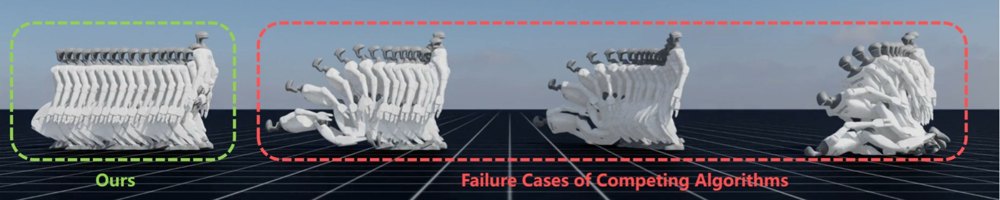
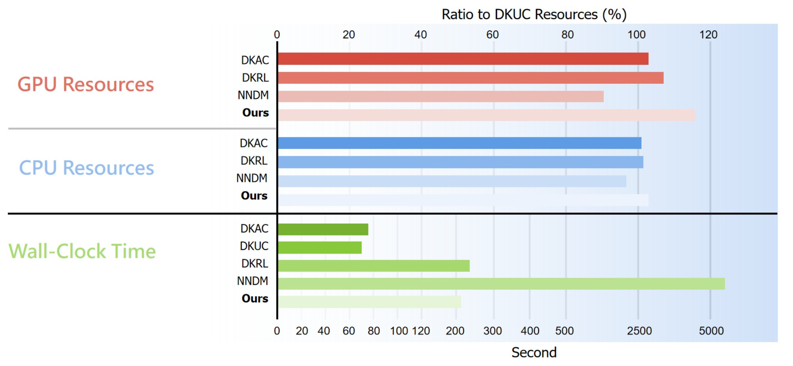

# Continual Learning and Lifting of Koopman Dynamics for Linear Control of Legged Robots

> **论文信息**
> - 作者：Feihan Li, Abulikemu Abuduweili, Yifan Sun, Rui Chen, Weiye Zhao, Changliu Liu
> - 通讯作者：Changliu Liu
> - 机构：Robotics Institute, Carnegie Mellon University
> - 投稿方向：L4DC 2025（Learning for Dynamics and Control）
> - arXiv ID：2411.14321v3
> - 代码：https://github.com/intelligent-control-lab/Incremental-Koopman

---

## 一、核心问题

足式机器人（四足 + 人形）的控制面临高维非线性动力学的挑战。现有方法分为两派：

| 方法类别 | 代表 | 优点 | 缺点 |
|---------|------|------|------|
| **Model-Free** | PPO / SAC RL | 性能出色、不依赖显式建模 | 任务特化、迁移需重训练 |
| **Model-Based（非线性）** | NMPC、iLQR | 可解释、跨任务泛化 | 计算昂贵、需精确建模 |
| **Model-Based（线性化）** | Koopman Operator | 全局线性化 + 简单 MPC | 近似误差大、难以处理高维系统 |

Koopman Operator 的核心理念是：将非线性系统映射到无穷维 latent space，在其中动力学变为**线性**。但数据驱动的 Koopman 方法存在两个致命问题：

1. **模型不匹配**（model mismatch）：有限维近似不可避免地产生误差
2. **域偏移**（domain shift）：训练数据只覆盖状态空间的一部分，遇到 corner case 就崩溃

足式机器人尤为致命——一旦摔倒，**几乎不可恢复**。

> 本文的核心主张：通过逐步扩大数据集 + 逐步提升 latent space 维度，可以让 Koopman 近似误差单调收敛至真实算子，从而使线性 MPC 足以控制高维足式机器人。

---

## 二、核心思路 / 方法

### 2.1 Koopman 基础框架

考虑非自治系统 $x_{t+1} = f(x_t, u_t)$，Koopman 算子 $\mathcal{K}$ 在无穷维 latent space 中使其变为线性：

$$\mathcal{K}\phi(x_t, u_t) = \phi(f(x_t, u_t)) = \phi(x_{t+1})$$

实践中，取 $\phi(x_t, u_t) = [g(x_t); u_t]$，用矩阵 $K = \begin{bmatrix} A & B \\ C & D \end{bmatrix}$ 近似 $\mathcal{K}$，得到：

$$g(x_{t+1}) = Ag(x_t) + Bu_t$$

**关键设计**：latent state $z_t = g(x_t) = [x_t, g'(x_t)]^\top$，即**显式拼接原始状态**。这样做的好处：
- 用线性变换 $P = [I, \mathbf{0}]$ 可直接从 $z_t$ 恢复 $x_t = Pz_t$
- 不需要训练 decoder
- 状态约束（如避碰）可直接从 $x$ 变换到 $z$

嵌入函数 $g'$ 用残差神经网络实现，Koopman 动态 $\mathcal{T} \doteq (g, A, B)$ 端到端训练。

### 2.2 MPC 控制器

用学习到的线性动态，MPC 求解退化为 QP 问题：

$$\min_{u_{t:t+H-1}} \|Pz_{t:t+H-1} - x^*_{t:t+H-1}\|^2_Q + \|u_{t:t+H-1}\|^2_R + \|Pz_{t+H} - x^*_{t+H}\|^2_F$$

$$\text{s.t. } z_{t+k+1} = Az_{t+k} + Bu_{t+k}, \quad u_{t+k} \in [u_{min}, u_{max}]$$

### 2.3 增量 Koopman 算法（核心创新）

整个流程是「初始化 → 迭代提升」的循环：


*图1：Incremental Koopman 算法流水线。该图包含两个数据收集器和两个阶段（提升阶段和学习阶段），二者交替进行。*

**算法流程拆解：**

**Phase 0 — 初始化：**
- 使用初始数据收集器（如训练好的 PPO 策略或遥操作数据）收集 $\mathcal{D}^{(0)}$（`6e4` 条轨迹）
- 这些数据需要有合理的步态和接触模式，确保 latent subspace 有意义
- 训练初始动态 $\mathcal{T}^{(0)} = (g^{(0)}_{n^{(0)}}, A^{(0)}_{n^{(0)}}, B^{(0)}_{n^{(0)}})$

**Phase 1 — 提升阶段（Lifting Phase）：**
- 用当前动态 $\mathcal{T}^{(k)}$ 配 MPC 跟踪参考集 $\mathcal{R}$ 中的轨迹
- $\mathcal{R}$ 包含动态可行和**不可行**的参考轨迹（加入均匀噪声 $\pm 0.05$），故意制造失败场景
- 收集失败时的 tracking 数据 $\mathcal{D}^{(k+1)}_{incre}$（`3e4` 条轨迹）
- **核心洞察**：这些失败数据自然覆盖了 corner case，极大增强了 latent subspace 的鲁棒性
- 扩展数据集：$\mathcal{D}^{(k+1)} = \mathcal{D}^{(k)} \cup \mathcal{D}^{(k+1)}_{incre}$
- 提升维度：$n^{(k+1)} = n^{(k)} + \Delta n$（$\Delta n = 100$）

**Phase 2 — 学习阶段（Learning Phase）：**
- 用扩展后的数据集和维度重新训练 Koopman 动态 $\mathcal{T}^{(k+1)}$
- 若训练不稳定（collapsing），epoch 数减半重试
- 当 $T_{sur}$（存活步数）不再提升时停止

```
┌─────────────────────────────────────────────────────┐
│              Incremental Koopman 训练流程              │
├─────────────────────────────────────────────────────┤
│                                                     │
│  ┌──────────┐    ┌──────────┐    ┌──────────────┐  │
│  │ Initial  │    │  Lifting │    │   Learning   │  │
│  │ Collector│───▶│  Phase   │───▶│    Phase     │  │
│  │ (PPO)    │    │          │    │              │  │
│  └──────────┘    └──────────┘    └──────────────┘  │
│       │               │                  │         │
│       ▼               ▼                  ▼         │
│  D(0), n(0)     D += D_incre        T(k+1) 训练    │
│  训练 T(0)      n += Δn          直到收敛          │
│                       ▲                  │         │
│                       └──────────────────┘         │
│                          迭代循环                    │
└─────────────────────────────────────────────────────┘
```

### 2.4 训练损失

采用 discounted k-step prediction loss，增强长期预测能力：

$$\mathcal{L}_{koopman} = \frac{1}{H}\sum_{h=1}^H \gamma^h\left( \|\hat{z}_{t+h} - z_{t+h}\|^2 + \alpha \cdot \|\hat{x}_{t+h} - x_{t+h}\|^2 \right)$$

- $\mathcal{L}_{linear}$（左项）：关注 latent space 中的线性化质量
- $\mathcal{L}_{recon}$（右项）：关注原始状态空间中的重构精度
- $\alpha = 0.1$：略微强调重构，实践中效果更好
- $\gamma = 0.99$：discount factor
- $H = 16$（人形 H1 用 24）的 rollout 预测

### 2.5 理论保证

> **定理 1**（非正式）：在以下假设下——(1) 数据 i.i.d.；(2) latent state 有界；(3) embedding 函数正交；(4) Koopman 特征值衰减足够快（$|\lambda_i| \leq C/i$）；(5) embedding 函数对应前 $n$ 个最大特征值的特征函数——线性近似误差的收敛速率为：
>
> $$\text{error} \leq \mathcal{O}\left(\sqrt{\frac{\ln n}{m}}\right) + \mathcal{O}\left(\frac{1}{\sqrt{n}}\right)$$

**直觉解读**：
- 第一项是**采样误差**：$m$ 越大越小，由数据集扩展驱动
- 第二项是**投影误差**：$n$ 越大越小，由维度提升驱动
- 当 $m = \Omega(n \ln n)$ 时，整体收敛速率为 $\mathcal{O}(n^{-1/2})$
- 这为「两个维度同时扩展」的策略提供了理论依据

---

## 三、实验与结果

### 3.1 实验设置

**机器人平台**（7 个测试套件）：

| 机器人 | 类型 | 控制维度 | 地形 |
|--------|------|----------|------|
| ANYmal-D | 四足 | $\mathbb{R}^{12}$ | Flat |
| Unitree-A1 | 四足 | $\mathbb{R}^{12}$ | Flat |
| Unitree-Go2 | 四足 | $\mathbb{R}^{12}$ | Flat, Rough |
| Unitree-H1 | 人形 | $\mathbb{R}^{19}$ | Flat |
| Unitree-G1 | 人形 | $\mathbb{R}^{23}$ | Flat, Rough |

**对比方法**：
- **DKUC**（Deep KoopmanU with Control）：基线 Koopman 方法，无增量机制
- **DKAC**（Deep Koopman Affine with Control）：仿射 Koopman 方法
- **NNDM + NMPC**：神经网络动态模型 + 非线性 MPC
- **DKRL**（Deep Koopman RL）：Koopman + 强化学习

**评估指标**：
- **预测类**：$E_{pre}(k)$，k-step 预测误差
- **姿态类**：$E_{JrPE}$（关节位置）、$E_{JrVE}$（关节速度）、$E_{JrAE}$（关节加速度）、$E_{RPE}$（根位置）、$E_{ROE}$（根朝向）、$E_{RLVE}$（根线速度）、$E_{RAVE}$（根角速度）
- **物理类**：$T_{Sur}$（存活步数，上限 200，仿真频率 50Hz，对应 4 秒）

### 3.2 K-step 预测误差


*图2：7 个测试套件（Flat-ANYmal-D、Flat-Unitree-A1、Flat-Unitree-Go2、Rough-Unitree-Go2、Flat-Unitree-H1、Flat-Unitree-G1、Rough-Unitree-G1）的 k-step 预测误差 $E_{pre}(k)$ 对比，k 取 [1, 3, 6, 9, 12, 15]。每条曲线代表一个算法在特定测试套件上的预测误差随预测步长 k 的变化趋势。*

**关键发现**：
- NNDM 和 DKRL 在长预测步长（k≥9）时误差**爆炸式增长**，说明动态建模在长期预测中不稳定
- DKAC 和 DKUC 虽然增长率可控，但**基线误差就很高**，因为固定 subspace 建模能力有限
- 本文方法的误差在所有步长上**始终保持最低**，即使 k=15 时误差增长也几乎可以忽略

这直接证明了增量方法学到的是更准确的全局动态。

### 3.3 跟踪性能



*图3：Flat-Unitree-G1 上各算法的跟踪过程对比。展示了一系列不同时间步的机器人姿态快照，不同算法的跟踪轨迹并排展示。本文方法（Ours）保持稳定的行走姿态，而对比方法在若干步后进入不可恢复的失败状态（摔倒）。*

**总览表（7 个测试套件平均）**：

| 算法 | $E_{JrPE}$ ↓ | $E_{JrVE}$ ↓ | $E_{JrAE}$ ↓ | $E_{RPE}$ ↓ | $E_{ROE}$ ↓ | $E_{RLVE}$ ↓ | $E_{RAVE}$ ↓ | $T_{Sur}$ ↑ |
|------|-------------|-------------|-------------|-----------|-----------|------------|------------|------------|
| **Ours + MPC** | **0.0348** | **0.6499** | **43.15** | **0.1231** | **0.0668** | **0.1216** | **0.3289** | **188.45** |
| DKRL + MPC | 0.0823 | 1.1251 | 68.95 | 0.2978 | 0.1561 | 0.2089 | 0.5634 | 116.95 |
| DKAC + MPC | 0.1816 | 2.0694 | 117.55 | 0.3955 | 0.2749 | 0.2888 | 0.9143 | 25.03 |
| DKUC + MPC | 0.1576 | 1.0828 | 50.57 | 0.2934 | 0.1989 | 0.2252 | 0.5559 | 82.46 |
| NNDM + NMPC | 0.1439 | 2.2020 | 127.45 | 0.4334 | 0.2506 | 0.2996 | 0.8536 | 35.47 |

**关键观察**：

1. **存活能力碾压**：本文方法 $T_{Sur}=188.45$ 接近上限 200，DKUC 只有 82.46，DKAC 更是仅 25.03 就摔倒。说明增量学习大幅提升了 corner case 的鲁棒性。

2. **关节跟踪精度是 2-5 倍优势**：$E_{JrPE}=0.0348$ vs DKUC 的 0.1576（~4.5 倍差距）。即使 DKRL 存活率还行（116.95 步），其 $E_{JrPE}=0.0823$ 仍是本文的 2.4 倍——说明它包含了大量短暂的失败片段。

3. **DKAC 和 NNDM 基本不可用**：$T_{Sur}$ 分别只有 25 和 35 步（0.5-0.7 秒），在足式机器人场景下等同于立即摔倒。

### 3.4 消融实验 1：数据增量


*图4：数据增量过程的可视化（Flat-Unitree-Go2 和 Flat-Unitree-G1 上的关节和根状态均值分布）。第一行：用 RL 策略扩展数据集，颜色聚类集中，说明 RL 策略产生的数据高度重复。第二行：本文方法扩展后的数据分布，颜色聚类更加分散和多样化，覆盖了更广泛的状态空间区域。*

**消融实验结果**（Flat-Unitree-Go2 + Flat-Unitree-G1 平均）：

| 变体 | $E_{JrPE}$ ↓ | $T_{Sur}$ ↑ |
|------|-------------|------------|
| Original（完整方法）| **0.0246** | **196.62** |
| w/o Data.I.（无数据增量）| 0.2061 | 53.05 |
| w/o Dim.I.（无维度增量）| 0.1189 | 100.94 |

去掉数据增量的情况下，$E_{JrPE}$ 从 0.0246 飙升到 0.2061（**8.4 倍**），$T_{Sur}$ 从 196.62 骤降至 53.05。图 4 解释了根本原因：RL 策略产生的数据高度重复，无法覆盖 corner case；而本文的 on-policy MPC 探索自然地将失败场景的数据引入训练集。

### 3.5 消融实验 2：维度增量

去掉维度增量的情况下，虽然 k-step 预测误差保持较低（感谢数据增量的贡献），但跟踪性能依然大幅下降（$E_{JrPE}=0.1189$，$T_{Sur}=100.94$）。这表明：

- **低维 latent space 无法建模足够鲁棒的动态来抵抗仿真噪声**
- 维度增量是提升泛化能力和线性化精度的关键

### 3.6 计算开销对比



*图5：各算法的计算资源比较（GPU 占用、CPU 占用和 wall-clock time），以 DKUC 为基准。上方区域的横轴表示相对于 DKUC 的资源使用百分比，下方区域的横轴显示实际运行时间（秒）。实验数据来自所有 7 个测试套件，取三次不同种子运行的平均值。*

**关键数据**：
- 本文方法的 GPU/CPU 使用与 DKUC/DKAC 接近，但 tracking 性能远超
- Wall-clock time 比 DKUC/DKAC 略高，但仍可支持实时推理
- NNDM 方法的推理时间**不可接受**，说明了 Koopman 方法在实时控制上的效率优势

---

## 四、关键洞察与技术亮点

1. **「失败数据是金矿」的哲学**：传统方法试图避免失败，本文方法主动利用当前模型在 MPC 下的失败作为训练数据来改进模型——一种自然的 curriculum learning。这与 self-play 的思路异曲同工。

2. **数据 + 维度双维度扩展**：单靠更多数据或更高维度都不够，两者必须协同扩展。理论保证了当 $m = \Omega(n \ln n)$ 时误差单调递减。

3. **显式拼接原始状态**：$z_t = [x_t, g'(x_t)]$ 的设计简单但巧妙——保留了物理可解释性，无需 decoder，且支持状态约束直接映射。

4. **on-policy 探索 vs 随机采样**：用 MPC 控制器滚动收集数据是 on-policy 的，确保扩展数据集中在 ROI（region of attraction）内，而不是浪费在无关状态空间。

5. **首个在足式机器人全身动态上应用 Koopman**：之前的工作最多在低维连续系统或高层运动规划上用 Koopman，本文首次将其推广到高维混合动力学系统（含接触模式切换）。

---

## 五、局限性

1. **潜维度爆炸风险**：当 subspace 扩展过快时，latent 维度可能膨胀。以 $\Delta n = 100$，3-4 轮迭代后 $n$ 可达 800+，对计算和存储都是挑战。

2. **依赖全身参考轨迹**：MPC 需要完整的全身参考轨迹 $x^*_{t:t+H}$ 而非简单的速度指令。这在实践中需要额外的运动规划模块。

3. **仅仿真验证**：所有实验在 IsaacLab 仿真中进行，尚未在真实机器人上部署。

4. **确定性环境**：当前方法假设环境是确定性的，未考虑观测噪声和随机动力学。

5. **低层 PD 控制的局限性**：低层使用 PD 控制器，只在关节位置层面做控制，未涉及力矩级控制。

---

## 六、关键概念速查

| 概念 | 说明 |
|------|------|
| **Koopman Operator $\mathcal{K}$** | 将非线性动力系统在无穷维 latent space 中线性化的算子 |
| **Lifting Function $\phi$ / Embedding $g$** | 将原始状态映射到 latent space 的函数，用神经网络参数化 |
| **Latent State $z_t$** | $z_t = [x_t, g'(x_t)]$，显式拼接原始状态的潜空间表示 |
| **Incremental Koopman** | 本文提出的迭代算法：alternatingly expand data + lift dimension |
| **$\mathcal{D}^{(k)}$** | 第 k 轮的数据集，$\mathcal{D}^{(k)} = \mathcal{D}^{(k-1)} \cup \mathcal{D}^{(k)}_{incre}$ |
| **$n^{(k)}$** | 第 k 轮的 latent space 维度，$n^{(k)} = n^{(k-1)} + \Delta n$ |
| **$T_{Sur}$** | 存活步数，主要的鲁棒性指标 |
| **$\mathcal{L}_{koopman}$** | Discounted k-step prediction loss，$H=16$ 或 24 |
| **MPC as QP** | 有了线性动态后 MPC 退化为二次规划，凸优化求解 |
