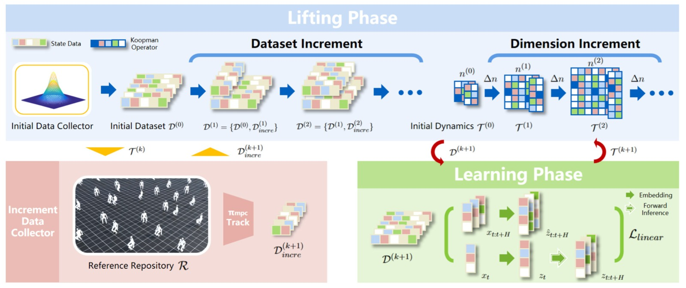
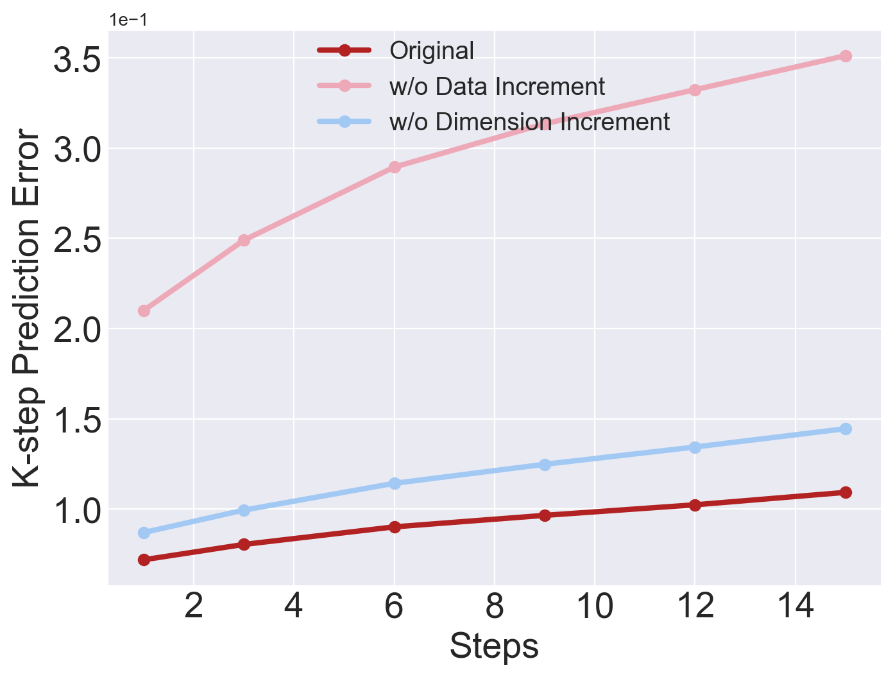

# Continual Learning and Lifting of Koopman Dynamics for Linear Control of Legged Robots

> **论文信息**
> - 作者：Feihan Li, Abulikemu Abuduweili, Yifan Sun, Rui Chen, Weiye Zhao, Changliu Liu
> - 机构：Robotics Institute, Carnegie Mellon University
> - 发表：L4DC 2025 (Learning for Dynamics and Control)
> - 代码：https://github.com/intelligent-control-lab/Incremental-Koopman
> - 平台：IsaacLab 仿真（5 种足式机器人）

---

## 一、核心问题

**如何用 Koopman 算子对高维足式机器人（人形/四足）的全身动力学进行准确的全局线性化？**

现有 Koopman 方法在低维连续系统中效果良好，但面对高维混合系统（hybrid system，如带接触模式切换的足式机器人）时存在两个致命问题：

1. **近似误差大**：有限维潜空间无法充分表达复杂的非线性动力学
2. **域偏移 (domain shift)**：训练数据只覆盖状态空间的子空间，遇到未见过的情况（如即将摔倒）时模型失效

这两点导致基于 Koopman 线性化的 MPC 控制器在足式机器人上极易摔倒且无法恢复。

---

## 二、核心思路 / 方法

### 2.1 总体思路：渐进式增量学习

核心直觉：**逐步扩大数据集 + 逐步提升潜空间维度 → 逼近真实 Koopman 算子。**



*图1：Incremental Koopman 算法总览。算法包含两个数据收集器和两个阶段。初始数据收集器（如 RL 策略或遥操作）构建具有合理步态的初始数据集 $\mathcal{D}^{(0)}$，训练初始 Koopman 动力学 $\mathcal{T}^{(0)}$。随后交替进入 Lifting Phase 和 Learning Phase：前者用 MPC 控制器跟踪多样化参考轨迹并收集失败数据 $\mathcal{D}_{incre}$ 以扩展数据集；后者在新的潜空间维度 $n^{(k+1)} = n^{(k)} + \Delta n$ 下重新训练动力学模型。循环直到生存步数 $T_{Sur}$ 不再提升。*

### 2.2 基础框架：Koopman 线性化

对于非自治系统 $x_{t+1} = f(x_t, u_t)$，Koopman 算子 $\mathcal{K}$ 满足：

$$\mathcal{K}\phi(x_t, u_t) = \phi(f(x_t, u_t)) = \phi(x_{t+1})$$

采用状态-控制解耦的嵌入方式 $\phi(x_t, u_t) = [g(x_t); u_t]$，得到有限维线性模型：

$$g(x_{t+1}) = A g(x_t) + B u_t$$

**关键设计——保留原始状态的潜变量构造**：

$$z_t = g(x_t) = [x_t, \; g'(x_t)]^\top$$

其中 $g'$ 是神经网络，将原始状态 $x_t \in \mathbb{R}^{n'}$ 扩展到 $\mathbb{R}^n$。这样做的好处：
- 无需训练 Decoder 来重建状态——用线性投影 $P = [I, \mathbf{0}]$ 即可恢复 $x_t = P z_t$
- 状态约束（如碰撞避免）可直接从 $x$ 空间搬到 $z$ 空间，不破坏系统的线性性质

### 2.3 训练目标：折损 k 步预测损失

给定轨迹数据 $\{x_{t:t+H}; u_{t:t+H-1}\}$，定义：

$$\mathcal{L}_{koopman} = \frac{1}{H}\sum_{h=1}^H \gamma^h\left( \underbrace{\| \hat{z}_{t+h} - z_{t+h}\|^2}_{\mathcal{L}_{linear}} + \alpha \cdot \underbrace{\|\hat{x}_{t+h} - x_{t+h}\|^2}_{\mathcal{L}_{recon}} \right)$$

其中：
- $\mathcal{L}_{linear}$ 关注潜空间线性化效果
- $\mathcal{L}_{recon}$ 显式关注原始状态重建精度（$\alpha = 0.1$ 轻量加权）
- $\gamma$ 是折损因子，让近期预测更重要

### 2.4 MPC 控制器

利用线性化的 Koopman 动力学，MPC 问题变成一个容易求解的二次规划（QP）：

$$\min_{u_{t:t+H-1}} \|Pz_{t:t+H-1} - x^*_{t:t+H-1}\|^2_Q + \|u_{t:t+H-1}\|^2_R + \|Pz_{t+H} - x^*_{t+H}\|^2_F$$

$$\text{s.t.}\quad z_{t+k+1} = A z_{t+k} + B u_{t+k}, \quad u_{t+k} \in [u_{min}, u_{max}]$$

注意：MPC 需要**全身参考轨迹** $x^*$，这点与 model-free 方法（只需平面速度目标）不同。

### 2.5 Incremental Koopman 算法流程

```
┌─────────────────────────────────────────────────────┐
│               Incremental Koopman                    │
├─────────────────────────────────────────────────────┤
│                                                      │
│  1. 初始化                                           │
│     D^(0) ← 初始数据收集器 (RL/遥操作)                 │
│     T^(0) ← TrainKoopman(n^(0), D^(0))               │
│                                                      │
│  2. FOR k = 0, 1, 2, ...  UNTIL 收敛:               │
│     ┌─ Lifting Phase ────────────────────────────┐   │
│     │ n^(k+1) ← n^(k) + Δn                        │   │
│     │ D_incre ← π_mpc(T^(k), R)  跟踪参考并收集失败  │   │
│     │ D^(k+1) ← D^(k) ∪ D_incre                   │   │
│     └────────────────────────────────────────────┘   │
│     ┌─ Learning Phase ───────────────────────────┐   │
│     │ T^(k+1) ← TrainKoopman(n^(k+1), D^(k+1))    │   │
│     │ 若训练崩溃 → 减半训练 epochs 重试              │   │
│     └────────────────────────────────────────────┘   │
│     若 T_sur 不再提升 → Break                        │
│                                                      │
└─────────────────────────────────────────────────────┘
```

**增量数据收集的巧妙之处**：用当前 MPC 控制器去跟踪 $\mathcal{R}$ 中的参考轨迹，这些参考包含动态可行和不可行的轨迹。当模型不准确时，MPC 跟踪会失败（如摔倒），这些失败数据恰好暴露了当前潜空间建模的盲区。将失败数据加入训练集，下一轮模型就能学到这些"corner case"。

> 用论文原话来说：失败数据自然扩大了数据集的覆盖范围，增强了潜空间的鲁棒性。

---

## 三、理论分析

**Theorem 1**（收敛性保证）：在以下假设下——

1. 数据样本 $s_1, ..., s_m$ 是 i.i.d 的
2. 潜状态有界 $\|\phi(s)\| < \infty$
3. 嵌入函数 $\phi_1, ..., \phi_n$ 是正交（独立）的
4. $\mathcal{K}$ 的特征值衰减足够快：$|\lambda_i| \leq C/i$
5. $\phi_i$ 对应前 $n$ 个最大特征值的特征函数

则渐进增量策略下的线性近似误差满足：

$$\text{error} \leq \mathcal{O}\left(\sqrt{\frac{\ln(n)}{m}}\right) + \mathcal{O}\left(\frac{1}{\sqrt{n}}\right)$$

且当 $m = \Omega(n \ln n), n \to \infty$ 时，$K \to \mathcal{K}$。

**直觉解读**：
- 第一项 $\mathcal{O}(\sqrt{\ln(n)/m})$ 是**采样误差**——数据越多越小
- 第二项 $\mathcal{O}(1/\sqrt{n})$ 是**投影误差**——潜空间维度越高越小
- 本文算法同时增加 $m$ 和 $n$，两项都单调递减，保证收敛
- $m = \Omega(n \log n)$ 是指导数据量随维度增长的最低速率

---

## 四、实验与结果

### 4.1 实验设置

| 维度 | 设置 |
|------|------|
| 仿真平台 | IsaacLab |
| 机器人 | ANYmal-D (四足, $\mathcal{U} \subseteq \mathbb{R}^{12}$)、Unitree A1 (四足)、Go2 (四足)、H1 (人形, $\mathcal{U} \subseteq \mathbb{R}^{19}$)、G1 (人形, $\mathcal{U} \subseteq \mathbb{R}^{23}$) |
| 地形 | Flat（平地）、Rough（随机不平整，高度差 0.005-0.025m） |
| 测试套件 | 7 组：Flat-ANYmal-D, Flat-A1, Flat-Go2, Rough-Go2, Flat-H1, Flat-G1, Rough-G1 |
| 对比方法 | DKUC、DKAC（Deep Koopman with Control/Affine）、NNDM（神经网络动力学+NMPC）、DKRL（Deep Koopman RL） |

### 4.2 k 步预测误差


*图2：7 个测试套件上的 k 步预测误差 $E_{pre}(k)$ 对比（$k = 1, 3, 6, 9, 12, 15$）。横轴为预测步数 $k$，纵轴为平均绝对误差。每条曲线代表一种方法，我们的方法（蓝色）在所有测试套件上均保持最低且最平稳的预测误差。关键对比：(a)-(b) 四足机器人（ANYmal-D, A1）上，DKAC/DKUC 误差随 $k$ 增长较快，而我们的方法几乎持平；(c)-(e) Go2 和 H1 上，NNDM 和 DKRL 的误差呈爆炸式增长；(f)-(g) 人形 G1（23 维控制）上，我们的方法在高维系统中优势最为明显。*

**论文关键数据**：
- 本文方法的 k 步预测误差在所有 $k$ 值下均为最低
- NNDM 和 DKRL 在 $k \ge 9$ 时出现爆炸性误差累积
- DKUC/DKAC 误差增长较平稳但绝对值显著高于本文方法（潜空间建模能力不足）

### 4.3 跟踪性能（核心结果）

| 指标 | Ours | DKRL | DKAC | DKUC | NNDM |
|------|------|------|------|------|------|
| $E_{JrPE}$ (关节位置) ↓ | **0.0348** | 0.0823 | 0.1816 | 0.1576 | 0.1439 |
| $E_{JrVE}$ (关节速度) ↓ | **0.6499** | 1.1251 | 2.0694 | 1.0828 | 2.2020 |
| $E_{JrAE}$ (关节加速度) ↓ | **43.15** | 68.95 | 117.55 | 50.57 | 127.45 |
| $E_{RPE}$ (根位置) ↓ | **0.1231** | 0.2978 | 0.3955 | 0.2934 | 0.4334 |
| $E_{ROE}$ (根朝向) ↓ | **0.0668** | 0.1561 | 0.2749 | 0.1989 | 0.2506 |
| $E_{RLVE}$ (根线速度) ↓ | **0.1216** | 0.2089 | 0.2888 | 0.2252 | 0.2996 |
| $E_{RAVE}$ (根角速度) ↓ | **0.3289** | 0.5634 | 0.9143 | 0.5559 | 0.8536 |
| $T_{Sur}$ (生存步数) ↑ | **188.45** | 116.95 | 25.03 | 82.46 | 35.47 |

> 表格数据为 7 个测试套件的平均值。$T_{Sur}$ 上界为 200（仿真频率 50Hz，即最多 4 秒）。

**关键发现**：
- 本文方法的 $T_{Sur}$ 接近上界 200，远高于其他方法——这意味着几乎从不摔倒
- DKAC 和 NNDM 的 $T_{Sur}$ 仅 25-35 步（0.5-0.7 秒就摔倒），说明短视的推理能力使其对 corner case 极其敏感
- DKRL 虽能存活 117 步，但跟踪误差是本文的 2-5 倍
- 对足式机器人而言，**一旦摔倒就不可恢复**（hybrid system 的特点），所以 $T_{Sur}$ 是硬指标


*图3：Flat-Unitree-G1 上的跟踪失败可视化。图中展示了多个算法的典型失败场景：当模型无法准确预测处于边界情况的动力学时，控制器做出错误决策导致机器人摔倒。对于 hybrid legged system，摔倒通常是不可恢复的，直接终止跟踪过程。本文方法通过增量学习不断扩展潜空间覆盖，能够可靠地推断这些 corner case，维持稳定步态。*

### 4.4 消融实验

#### 数据集增量消融

| 配置 | $E_{JrPE}$ ↓ | $E_{RPE}$ ↓ | $T_{Sur}$ ↑ |
|------|-------------|------------|------------|
| Original (完整算法) | **0.0246** | **0.0673** | **196.62** |
| w/o Data Increment | 0.2061 | 0.3452 | 53.05 |
| w/o Dim Increment | 0.1189 | 0.2526 | 100.94 |

- 去掉数据增量：$E_{JrPE}$ 暴涨 8 倍（0.0246 → 0.2061），$T_{Sur}$ 剧降（196 → 53）
- 说明**失败数据对覆盖 corner case 至关重要**

#### 潜空间维度增量消融

去掉维度增量：
- k 步预测误差仍然较低（得益于数据增量），**但跟踪性能大幅下降**
- $T_{Sur}$ 从 196 降到 101，说明低维潜空间无法建模足够鲁棒的动力学以抵抗仿真中的未见噪声



*图4：Flat-Unitree-Go2 上的消融实验 k 步预测误差对比。去除数据增量的方法（橙色）误差随 k 增长迅速攀升，表明模型在遇到未覆盖的动力学区域时推理能力急剧退化。去除维度增量的方法（绿色）误差保持较低增长但依然高于完整算法（蓝色），说明仅靠数据扩展而维度不足时，潜空间表达能力成为瓶颈。*


*图5：数据集扩展过程中的状态分布可视化，通过绘制关节相对状态和根相对状态的均值来展示。第一行：使用 RL 策略进行数据扩展——分布几乎没有变化（重复采样），无效；第二行：使用本文算法进行数据扩展——随着迭代，数据分布逐步扩展，覆盖了更丰富的状态空间区域。这个对比直观地证明了"用 MPC 控制器主动收集失败数据"策略的有效性：RL 策略只在已掌握的状态区域内采集数据，而 MPC 失败数据恰好位于潜空间的建模盲区。*

---

## 五、关键洞察与技术亮点

1. **"失败即数据"哲学**：传统方法试图避免失败，本文故意让不完美的模型去跟踪多样化参考，收集失败数据来改进模型。这是一个优雅的自动课程学习（curriculum learning）过程——每次迭代，MPC 控制器的失败恰好暴露了当前潜空间最需要补全的区域。

2. **状态嵌入设计**：$z_t = [x_t; g'(x_t)]$ 的设计同时解决了两个问题——无需 Decoder（线性投影即可恢复状态）和状态约束可以直接搬运到潜空间。这比 Encoder-Decoder 框架更简单且更可靠。

3. **收敛性理论保证**：论文给出了增量策略下近似误差的收敛速率 $\mathcal{O}(1/\sqrt{n})$，并提供了 $m = \Omega(n \log n)$ 的数据需求指导——实践中可按这个比例确定每次迭代需要收集多少新数据。

4. **首次实现**：这是第一个将 Koopman 全身动力学线性化用于足式机器人运动控制的工作。此前的方法要么只做高层规划，要么仅限于低维系统。

5. **模型与控制解耦**：线性化模型使得控制端只需解一个 QP，且换任务时不需要重新训练控制器（与 RL 方法不同）。

---

## 六、局限性

1. **仅支持确定性环境**：当前方法假设系统是确定性的，未考虑随机动力学。论文提到未来将结合 Stochastic Koopman Theory 处理不确定性。

2. **潜空间维度可能膨胀**：随着迭代，潜空间维度 $n$ 持续增长，计算成本增加。论文未详细讨论如何控制维度增长的上限。

3. **需要全身参考轨迹**：MPC 需要全身参考轨迹 $x^*$，而 model-free 方法可能只需要高层速度指令。获取高质量的全身参考轨迹本身是一个挑战。

4. **仿真验证**：当前仅在 IsaacLab 仿真平台测试，尚未在真实机器人上验证。从仿真到现实的迁移（sim-to-real）仍需要进一步工作。

5. **RL 策略 vs 增量方法**：与 DKRL 相比，本文方法的跟踪误差更低但需要参考轨迹，而 RL 方法更灵活。在某些任务上两者的适用范围不同。

---

## 七、关键概念速查

| 概念 | 解释 |
|------|------|
| **Koopman 算子** $\mathcal{K}$ | 将非线性动力学映射为无限维潜空间中的线性算子：$\mathcal{K}\phi(s) = \phi(f(s))$ |
| **Koopman 矩阵** $K = [A\;B]$ | 有限维近似下的线性动力学矩阵：$z_{t+1} = A z_t + B u_t$ |
| **潜空间维度 $n$** | 嵌入函数 $g'$ 的输出维度，$n$ 越大近似越准但计算量越大 |
| **增量数据收集器** | 用当前 MPC 控制器跟踪参考轨迹，收集失败数据扩展数据集 |
| **$T_{Sur}$ (Survival Steps)** | 仿真中摔倒前的步数，上界 200 步（4 秒 @ 50Hz），最关键的安全指标 |
| **$E_{pre}(k)$** | k 步预测误差，衡量动力学模型的长期预测精度 |
| **MPC (Model Predictive Control)** | 模型预测控制，在线性化动力学下退化为二次规划 |
| **Hybrid System** | 混合系统——足式机器人因接触模式切换是典型的 hybrid system |
| **Domain Shift** | 训练和测试数据分布不一致导致模型失效 |
| **MPC Controller** $\pi_{mpc}$ | 基于当前 Koopman 动力学模型的 MPC 控制器 |
| **$\mathcal{R}$ (Reference Repository)** | 参考轨迹库，含 3000 条多样化步态的演示轨迹 |
| **$\mathcal{D}^{(0)}$** | 初始数据集，由 RL 策略/遥操作收集，约 6 万条轨迹 |
| **$\Delta n$** | 每次迭代潜空间维度的增量步长 |

---

## 八、代码仓库解读

代码地址：<https://github.com/intelligent-control-lab/Incremental-Koopman>

> 本论文的 arxiv 源码中附带了两个相关的 Koopman 控制代码库（`KoopmanControl/` 和 `Task-Oriented-Koopman-Control/`），但本文实验基于 IsaacLab 平台，主代码仓库在 GitHub。

### 8.1 项目代码架构（推测）

基于论文算法流程和 IsaacLab 框架，推测代码结构如下：

```
Incremental-Koopman/
├── scripts/
│   └── train_koopman.py        # 训练 Koopman 动力学的主脚本
├── models/
│   ├── koopman_dynamics.py     # Koopman 动力学模型 (A, B 矩阵 + embedding g')
│   ├── embedding.py            # 嵌入函数 g'(x) 的神经网络
│   └── mpc_controller.py       # 线性 MPC 控制器 (QP 求解)
├── data/
│   ├── data_collector.py       # 初始数据收集器 (RL 策略/遥操作)
│   └── increment_collector.py  # 增量数据收集器 (MPC 跟踪失败数据)
├── envs/
│   └── legged_robot_env.py     # IsaacLab 足式机器人环境
└── configs/
    └── *.yaml                  # 训练/评估配置
```

### 8.2 核心模块与公式映射

```
公式 (1) z_t = [x_t; g'(x_t)]^T     →  embedding.py: Embedding.forward()
公式 (2) z_{t+1} = A z_t + B u_t    →  koopman_dynamics.py: KoopmanDynamics.predict()
公式 (3) L_koopman 损失函数          →  train_koopman.py: koopman_loss()
公式 (4) MPC QP 问题                →  mpc_controller.py: solve_mpc()
算法 1 整体流程                      →  train_koopman.py: main_loop()
```

### 8.3 训练流程 ASCII 图

```
┌─ Initialization ──────────────────────────────────────┐
│                                                        │
│  RL Policy / Teleoperation                             │
│      ↓                                                 │
│  D^(0) = {6万条轨迹 × 长度 L}                           │
│      ↓                                                 │
│  g_n^(0): R^n' → R^n^(0)   (MLP with state concat)     │
│  A^(0) ∈ R^(n×n), B^(0) ∈ R^(n×m')                    │
│      ↓                                                 │
│  Train with L_koopman for J^(0) epochs                 │
│      ↓                                                 │
│  T^(0) = (g,A,B) ready                                 │
│                                                        │
└────────────────────────────────────────────────────────┘
                          ↓
┌─ Iteration k ─────────────────────────────────────────┐
│                                                        │
│  ┌─ Lifting Phase ─────────────────────────────────┐   │
│  │                                                  │   │
│  │  n^(k+1) = n^(k) + Δn                           │   │
│  │                                                  │   │
│  │  FOR each ref in R (3000条参考轨迹):              │   │
│  │    x_t → g_n^(k)(x_t) → z_t                     │   │
│  │    MPC solve → u_t                               │   │
│  │    执行 u_t → 新状态 x_{t+1}                      │   │
│  │    IF E_JrPE > ε_fail → 记录失败轨迹              │   │
│  │  END                                             │   │
│  │                                                  │   │
│  │  D^(k+1) = D^(k) ∪ D_incre (新增3万条)            │   │
│  │                                                  │   │
│  └──────────────────────────────────────────────────┘   │
│                          ↓                              │
│  ┌─ Learning Phase ─────────────────────────────────┐   │
│  │                                                  │   │
│  │  g_n^(k+1): R^n' → R^n^(k+1)  (扩展输出维度)      │   │
│  │  → 初始化: 复用 g_n^(k) 中不依赖维度的层            │   │
│  │                                                  │   │
│  │  A^(k+1), B^(k+1) (扩大矩阵尺寸)                   │   │
│  │                                                  │   │
│  │  Train with L_koopman for J^(k+1) epochs         │   │
│  │  IF training collapse → J = J/2, retry           │   │
│  │                                                  │   │
│  │  T^(k+1) = (g,A,B) ready                         │   │
│  │                                                  │   │
│  └──────────────────────────────────────────────────┘   │
│                          ↓                              │
│  Evaluate: T_sur with π_mpc(T^(k+1), R)                │
│  IF T_sur no longer improves → STOP                    │
│                                                        │
└────────────────────────────────────────────────────────┘
```

### 8.4 关键实现细节

- **优化器**：Adam + CosineAnnealingLR
- **低层控制器**：PD 控制器（200Hz），MPC 输出关节目标位置作为 PD 的设定点
- **状态归一化**：所有物理量归一化到 $\mathcal{N}(0, 1)$，消除不同量纲的影响
- **人体 vs 四足状态差异**：人形机器人不需要根朝向 $r_t$（可能因为人形机器人的朝向信息在关节空间中已隐含）
- **训练稳定性**：若训练崩溃（loss 爆炸），自动减半 epochs 重试
- **收敛判断**：比较 $\mathcal{T}^{(k+1)}$ 和 $\mathcal{T}^{(k)}$ 的跟踪性能，若 $T_{Sur}$ 不再提升则停止迭代
