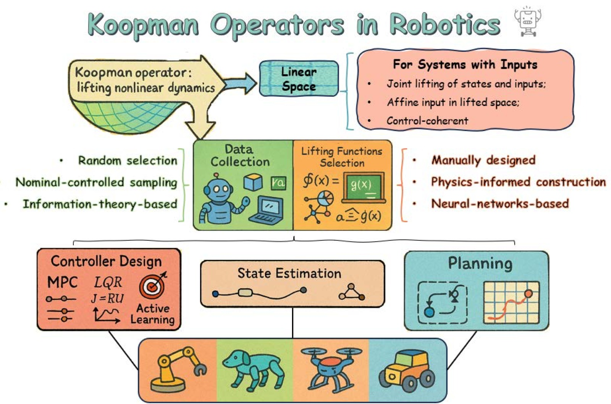

%% mathjax-macros
\Psib: \mathbf{\Psi}
\Kc: \mathcal{K}
\Fc: \mathcal{F}
\Xc: \mathcal{X}
\Sc: \mathcal{S}
\Pc: \mathcal{P}
\Lc: \mathcal{L}
\Gc: \mathcal{G}
\real: \mathbb{R}
\cplx: \mathbb{C}
\EX: \mathbb{E}
\Kedmd: K_{\operatorname{EDMD}}
\Pf: \mathfrak{P}
\restr: \!\restriction
\Span: \operatorname{span}
\until: \{1,\dots,\#1\}
%% end-mathjax-macros

# Koopman Operators in Robot Learning

> **论文信息**
> - 作者：Lu Shi, Masih Haseli, Giorgos Mamakoukas, Daniel Bruder, Ian Abraham, Todd Murphey, Jorge Cortés, Konstantinos Karydis
> - 通讯作者：Konstantinos Karydis (kkarydis@ece.ucr.edu)
> - 类型：综述论文 (Survey/Review)
> - arXiv ID：2408.04200v2
> - 代码/Tutorial：https://shorturl.at/ouE59
> - 发表状态：投稿中 (under review)

---

## 一、核心问题

机器人学面临一个根本性挑战：**如何在未知、不可模拟的环境中实现运行时学习（runtime learning）？** 现有方法（深度强化学习、Neural ODE、生成式 AI）高度依赖离线大数据，但在真实部署中，机器人经常遇到：

- **新颖环境**：先验数据集中未预见的物理现象
- **不可模拟的交互**：人机交互、软体接触、湍流中的操作
- **未知参数与边界条件**：触觉力学、可穿戴设备等场景

> 核心命题：**如果机器人要在不依赖大量离线数据的情况下，在新环境中运行，有哪些工具适合使用"小数据"进行运行时学习？**

Koopman 算子理论提供了一个部分答案：它将非线性系统全局线性化，从而使得线性控制理论能够直接应用于复杂的非线性机器人系统，且只需要稀疏数据。

---

## 二、Koopman 算子理论基础

### 2.1 核心数学概念

考虑离散时间非线性系统：

$$x_{t+1} = T(x_t), \quad x \in \mathcal{X} \subseteq \mathbb{R}^{N_x}$$

Koopman 算子 $\mathcal{K}$ 作用在**可观测量（observables）** $g$ 上——这些是从状态空间到复数的函数：

$$\mathcal{K} g = g \circ T, \quad \forall g \in \mathcal{F}$$

直观理解：$\mathcal{K} g(x_t) = g(T(x_t)) = g(x_{t+1})$，即可观测量在 lifted space 中线性演化。

*图1：Koopman 算子理论的核心概念。在原始状态空间 $\mathcal{X}$ 中，非线性系统由未知映射 $T$ 控制：$x_t \to x_{t+1}$。通过可观测函数 $g(x)$ 将状态"提升"到高维 Koopman 空间后，系统的演化变为线性，由 Koopman 算子 $\mathcal{K}$ 控制。图中展示了两种到达 $g(x_{t+1})$ 的路径：底部路径是先通过 $T$ 演化再观察，顶部路径是先观察再通过 $\mathcal{K}$ 线性演化——两者结果一致。这个"等价性"带来了三大优势：(1) 非线性动力学的全局线性表示，可直接应用线性系统工具；(2) 可实时估计线性算子，无需大量数据做非线性回归；(3) 线性结构使得 LQR、MPC 等经典控制器可直接使用。*

### 2.2 有限维近似

实践中需要有限维近似。若 $\mathcal{S} \subset \mathcal{F}$ 是 Koopman 不变的有限维子空间，选取向量值基函数 $\mathbf{\Psi}$，存在矩阵 $K$ 使得：

$$\mathcal{K} \mathbf{\Psi} = \mathbf{\Psi} \circ T = K \mathbf{\Psi}$$

进而得到线性演化：$\mathbf{\Psi}(x_{t+1}) = K \mathbf{\Psi}(x_t)$

定义 $z_t := \mathbf{\Psi}(x_t)$ 即得标准线性形式：$z_{t+1} = K z_t$

### 2.3 EDMD：扩展动态模式分解

EDMD 是最广泛使用的 Koopman 算子估计算法。给定数据矩阵 $X = [x_1, \ldots, x_M]$ 和 $Y = [y_1, \ldots, y_M]$（其中 $y_i = T(x_i)$），求解最小二乘问题：

$$\min_K \|\mathbf{\Psi}(Y) - K\mathbf{\Psi}(X)\|_F$$

闭式解：$K_{\text{EDMD}} = \mathbf{\Psi}(Y)\mathbf{\Psi}(X)^\dagger$

> 关键洞察：EDMD 矩阵 $K_{\text{EDMD}}$ 捕获的是投影算子 $\mathcal{P}_{\text{Span}(\mathbf{\Psi})}\mathcal{K}$，而非 Koopman 算子本身。预测精度取决于 $\text{Span}(\mathbf{\Psi})$ 与 Koopman 不变子空间的接近程度。

### 2.4 HVOK：Hankel 视角的 Koopman

HVOK（Hankel View of Koopman）不显式选择基函数，而是利用**时间延迟嵌入**构造 Hankel 矩阵：

$$H_X = \begin{bmatrix} x_1 & \cdots & x_{m-d} \\ x_2 & \cdots & x_{m-d+1} \\ \vdots & \ddots & \vdots \\ x_d & \cdots & x_{m-1} \end{bmatrix}, \quad H_Y = \begin{bmatrix} x_2 & \cdots & x_{m-d+1} \\ x_3 & \cdots & x_{m-d+2} \\ \vdots & \ddots & \vdots \\ x_{d+1} & \cdots & x_m \end{bmatrix}$$

然后求解 $H_Y \approx K_{\text{HVOK}} H_X$。HVOK 在软体机器人等具有丰富时序动力学的系统中表现突出。

### 2.5 处理控制输入

原始 Koopman 理论针对自治系统，机器人却是受控系统。论文总结了三种扩展方法：

| 方法 | 核心思想 | 适用场景 |
|------|----------|----------|
| **联合提升** | 将 $u$ 视为扩展状态的一部分，定义 $g(x,u)$ | 结构化/重复性输入模式 |
| **仿射输入形式** | $g(x_{t+1}) \approx K g(x_t) + B u_t$ | LQR/MPC 控制设计，最常用 |
| **Control-Coherent** | 寻找嵌入空间使演化算子在控制变化时保持一致 | 操作任务、欠驱动系统 |

---

## 三、Koopman 建模与应用 Pipeline

*图2：Koopman 算子理论在机器人学中的整体框架。该图由三个层级组成：最底层是机器人平台（操作臂、地面机器人、腿式机器人、软体机器人、飞行器、水下机器人、多智能体系统），中层是 Koopman 方法的核心组件（数据收集、提升函数设计/学习、算子估计、系统分析与分解），顶层是下游应用（建模、控制器设计、状态估计、运动规划）。这个框架展示了 Koopman 方法如何为各类机器人提供统一的非线性→线性转换范式。*

典型的 Koopman 应用流程分三步：
1. **数据收集**：从机器人-环境交互中收集代表性数据
2. **提升函数构建**：设计/学习合适的 $\mathbf{\Psi}$ 映射
3. **下游应用**：控制器设计、状态估计、运动规划

### 3.1 数据收集策略

| 策略 | 方法 | 优缺点 |
|------|------|--------|
| 随机采样 | 随机初始条件与输入 | 简单，但可能有安全隐患 |
| 基线控制器迭代 | 用上轮控制器生成下轮数据 | 更安全，逐步改进 |
| 主动学习 | 优化 Fisher 信息矩阵 | 数据效率高，支持实时学习 |

### 3.2 提升函数选择的三种路径

1. **手工设计基函数**：Hermite 多项式、RBF 等，依赖领域知识，劳动密集
2. **物理信息引导**：利用运动学约束、几何结构等先验知识，兼具可解释性和鲁棒性
3. **神经网络学习**：Deep Koopman/Autoencoder-Koopman 框架，灵活但可解释性差

> 选择原则：操作臂/腿式机器人倾向 NN（复杂度高）；轮式机器人倾向手工设计（动力学已知）；飞行器/软体机器人三者皆有探索，HVOK 因能捕获环境扰动而受青睐。

### 3.3 Koopman 控制器设计

#### Koopman MPC

利用线性 Koopman 模型，MPC 优化转化为**凸二次规划**：

$$\min_{z_i, u_i} \sum_{i=0}^{N_h} (z_i^\top G_i z_i + u_i^\top H_i u_i) \quad \text{s.t.} \quad z_{i+1} = K z_i + B u_i$$

线性模型实现使问题变凸，有唯一全局最优解，可高效求解，适合实时反馈控制。

#### 主动学习

利用线性最小二乘的闭式解，可构造**可微分的 Fisher 信息矩阵**：

$$\mathbf{I} = \frac{\partial z_{t+1}}{\partial K}^\top \Sigma^{-1} \frac{\partial z_{t+1}}{\partial K} \preceq \text{Var}[K^*]^{-1}$$

通过优化 D-optimality 或 T-optimality 等标量准则，控制器在完成任务的同时主动探索以降低模型不确定性——这在飞行器从失控翻滚中恢复、腿式机器人在颗粒介质中学习交互模型中得到了验证。

### 3.4 状态估计与运动规划

- **状态估计**：Koopman Kalman 滤波器、EVOLVER 扰动观测器、KoopSE 批量估计
- **运动规划**：将 SLAM 问题重构为双线性形式、基于 Koopman 对偶算子的凸导航规划、不确定性感知规划器

---

## 四、各类机器人平台上的实现

论文提供了一张全面的文献综述表，覆盖操作臂、轮式/腿式机器人、软体机器人、飞行器、水下机器人等领域的代表性工作。

### 4.1 操作臂

- **建模与预测控制**：结构化 deep Koopman 模型 + Lipschitz 约束 + MPC
- **模仿学习**：Koopman 提升将人类演示编码为意图模型，大幅减少所需标注数据
- **灵巧手操作**：Koopman 联合建模手和物体的耦合动力学

### 4.2 地面机器人

- **轮式**：Koopman MPC 用于复杂地形导航；虚拟控制输入处理旋转动力学
- **腿式**：Koopman 捕获混合动力学（接触切换），实现跨步态预测；增量学习应对分布偏移
- **自动驾驶**：Koopman 估计车辆模型 + MPC；双线性模型 + DNN 扩展

### 4.3 软体机器人（最活跃的应用领域）

软体机器人的物理安全性使其成为 Koopman 方法的理想试验平台：
- 多项式基函数、时间延迟嵌入、NN 三种提升方式均有成功案例
- MPC 和 LQR 是最常用的控制策略
- 新趋势：用 Koopman 模型作为 RL 的替代环境加速策略学习

### 4.4 飞行器

- Episodic learning 实时估计 Koopman 特征函数以处理地面效应
- 层级结构：外层 Koopman 控制器修正参考信号，内层为预调底层控制器
- KoopNet：NN + Koopman 联合学习提升函数和双线性模型

---

## 五、鲁棒性与稳定性

Koopman 模型在实际应用中面临噪声、数据稀疏、有限维近似误差等挑战。研究从以下层面应对：

| 层面 | 策略 |
|------|------|
| **数据** | 推导 DMD/EDMD 在噪声下的预测误差界 |
| **模型** | Kalman 滤波增强模型、深度随机 Koopman 算子、最近稳定矩阵 |
| **控制** | 约束紧缩 MPC（保证递推可行性）、Conformant Koopman 模型、Lipschitz 误差界 + 鲁棒 MPC |

---

## 六、高级理论专题

### 6.1 连续时间

对于 $\dot{x} = G(x)$，Koopman 半群 $\{\mathcal{K}^t\}_{t \geq 0}$ 定义为 $\mathcal{K}^t f = f \circ \Phi_G^t$。其无穷小生成元 $\mathcal{L}_G$ 为：

$$\mathcal{L}_G f = \lim_{t \searrow 0} \frac{\mathcal{K}^t f - f}{t} = G \cdot \nabla f$$

### 6.2 输入系统的严格处理

两种严格的算子理论方法：
- **Acting on extended state-input space**：将 $(x,u)$ 视为联合状态
- **Input-state separable form**：$g(T(x,u), u^+) = K' g(x,u)$ 的推广形式

### 6.3 有界不确定性下的预测

NREDMD（Noise-Robust EDMD）和 T-SSD 等方法为噪声环境下的 Koopman 估计提供了理论保障。

---

## 七、开放挑战

论文给出了七大未来研究方向：

1. **约束纳入 Koopman 空间**：如何将原始空间中的各类约束恰当地提升到 Koopman 空间
2. **随机仿真与信念空间规划**：处理多模态分布，在不确定性下生成鲁棒计划
3. **采样率选择**：采样率直接影响 Koopman 算子质量和预测误差界
4. **精细/灵巧操作**：接触动力学产生的非连续性可通过 Koopman 线性表示处理
5. **软体机器人进一步扩展**：高维提升的计算成本与降维近似的精度权衡
6. **混合系统扩展**：如何统一处理连续流与离散跳跃的动力学
7. **提升特征中的不确定性**：Gaussian 假设在提升空间中是否仍然成立？

---

## 八、关键洞察

> 1. **Koopman 方法的核心优势**：可解释性（原理几何/代数基础）、数据效率（仅需稀疏数据）、线性表示（可直接使用 LQR/MPC 等工具）
>
> 2. **EDMD 的本质**：不是逼近 Koopman 算子本身，而是逼近投影算子 $\mathcal{P}_{\text{Span}(\mathbf{\Psi})}\mathcal{K}$，精度取决于字典与不变子空间的接近程度
>
> 3. **仿射输入形式** $g(x_{t+1}) \approx Kg(x_t) + Bu_t$ 是最实用的方法，与 LQR/MPC 天然兼容
>
> 4. **软体机器人**是 Koopman 方法最有前景的应用领域——物理安全性允许大量数据收集，非线性强且难以第一性原理建模
>
> 5. **主动学习**是 Koopman 的独特优势——Fisher 信息矩阵的闭式解使探索具有理论指导，这是深度学习方法不具备的

---

## 九、关键概念速查

| 概念 | 含义 |
|------|------|
| **Koopman 算子** $\mathcal{K}$ | 作用在可观测量上的无穷维线性算子：$\mathcal{K}g = g \circ T$ |
| **可观测量 (Observable)** | 从状态空间到复数的函数 $g: \mathcal{X} \to \mathbb{C}$ |
| **提升函数 (Lifting Function)** | 将原始状态映射到高维空间的函数 $\mathbf{\Psi}(x)$ |
| **EDMD** | Extended DMD：从数据最小二乘估计 Koopman 矩阵 |
| **HVOK** | Hankel View of Koopman：用时间延迟嵌入替代显式基函数 |
| **Koopman MPC** | 基于 Koopman 线性模型的凸 MPC 框架 |
| **Koopman 特征函数** | 满足 $\mathcal{K}\phi = \lambda\phi$ 的函数，演化遵循线性差分方程 |
| **Fisher 信息主动学习** | 利用 Fisher 矩阵闭式解优化探索策略 |
| **Control-Coherent** | 保持 Koopman 嵌入在控制变化下的一致性 |
