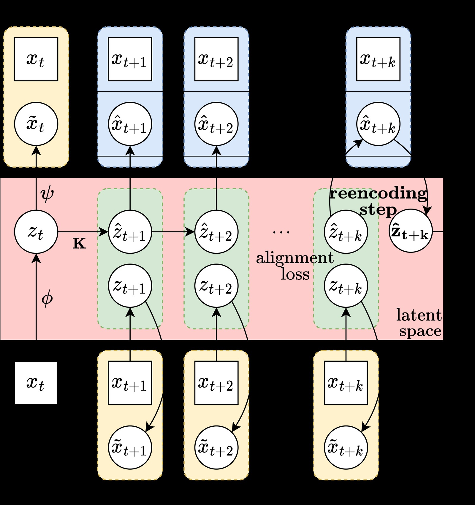
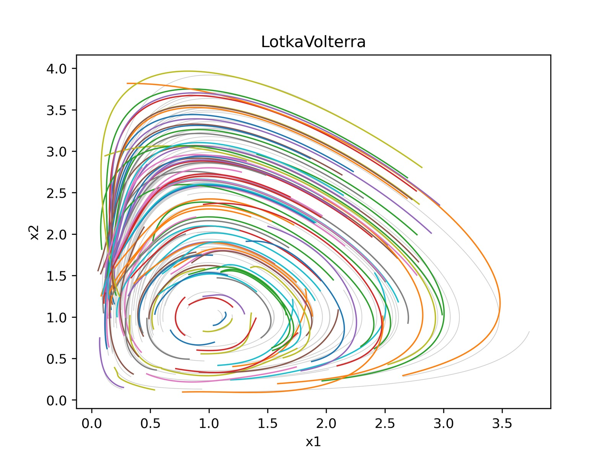
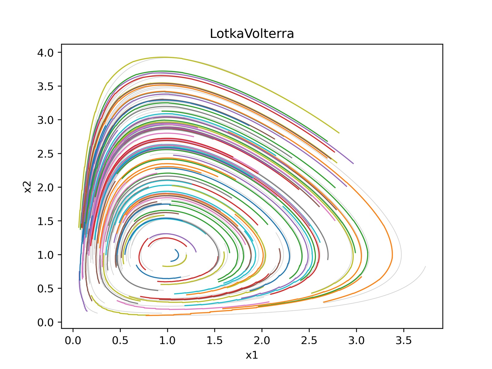
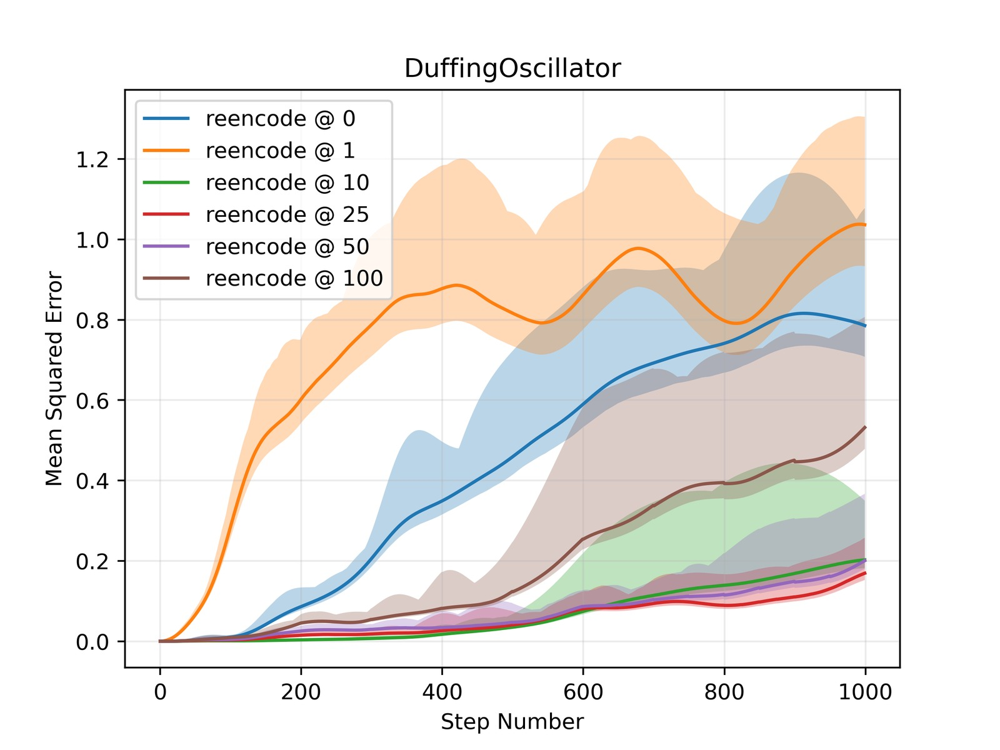
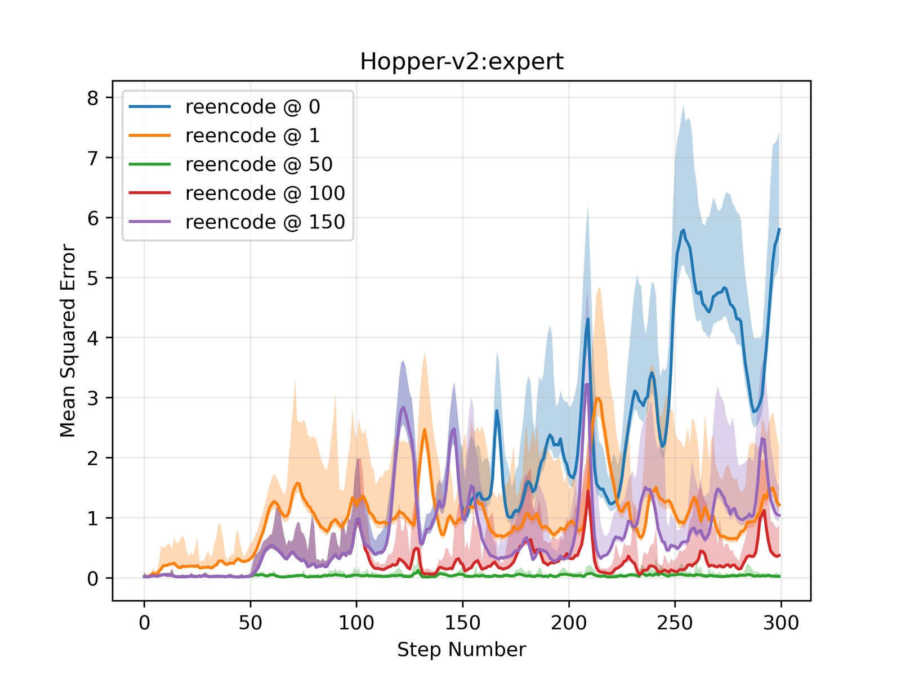

%% mathjax-macros
%% end-mathjax-macros

# Course Correcting Koopman Representations

> **论文信息**
> - 作者：Mahan Fathi (Google DeepMind, Mila), Clement Gehring (Mila), Jonathan Pilault (Mila, Polytechnique Montréal), David Kanaa (Mila), Pierre-Luc Bacon (CIFAR AI Chair, Mila), Ross Goroshin (Google DeepMind)
> - 通讯作者：Mahan Fathi, Ross Goroshin
> - 投稿方向：ICLR 2024
> - arXiv ID：arXiv-2310.15386v2
> - 代码：无公开代码

---

## 一、核心问题

Koopman 理论为非线性动力学系统（NLDS）提供了一条诱人的路径：在合适的"测量函数"张成的空间中，非线性动力学可以转化为**全局线性动力学**。一旦学到这种 Koopman 表示，状态预测、系统辨识、最优控制（如 LQR）等问题都将大幅简化。

然而，现有的 Deep Koopman Autoencoder 方法存在一个关键问题：**在潜在空间中直接推演线性动力学并在长时间跨度后解码回状态空间，会产生严重的轨迹漂移（drift）**。先前的工作通过约束 Koopman 矩阵的特征值、在长序列上训练来缓解这一问题。

本文揭示了潜在空间轨迹生成的两个根本性局限：

1. **长时轨迹交叉**：当潜在空间维度 $n$ 远大于状态空间维度 $d$（即 $n \gg d$，Koopman 自编码器的典型设定），解码器 $\psi$ 缺乏单射性（injectivity）——潜在空间中多条不同的线性轨迹可能映射到状态空间中的同一点，导致生成的相线（phase lines）相互交叉。这在连续动力学系统中是**不允许的**，因为交叉点意味着从同一初始条件出发存在多个解，违反了 Picard–Lindelöf 解的唯一性定理。

2. **无法捕捉不动点间的切换动力学**：无重编码（without reencoding）的轨迹生成本质上是对初始条件 $z_0 = \phi(x_0)$ 确定的单一线性系统的解进行投影，$x(t) = \psi(e^{Kt}\phi(x_0))$。这意味着一开始由 $\phi(x_0)$ 选择的"线性子系统"将被全局使用，无法在后续时间切换到另一个线性子系统——而这正是具有多个不动点的非线性系统（如 Duffing 振子）的关键特征。

---

## 二、核心思路 / 方法

### 2.1 总体框架：Deep Koopman Autoencoder



*图1：Course Correcting Koopman Autoencoder 的训练与推理框架。该图展示了自编码器的完整工作流：给定初始状态 $x_t$，编码器 $\phi$ 将其映射到潜在空间得到 $z_t$，随后通过线性 Koopman 算子 $\mathbf{K}$（及控制输入对应的 $\mathbf{L}\upsilon_t$）推演潜在动力学。关键训练目标包括三个损失项：(1) Alignment Loss（绿色）——确保推演后的潜在状态 $\hat{z}_{t+i}$ 与直接从真实状态编码得到的 $\phi(x_{t+i})$ 一致；(2) Reconstruction Loss（黄色）——确保编码-解码后能复原原始状态；(3) Prediction Loss（蓝色）——确保从推演潜在状态解码后能匹配真实未来状态。右侧展示了 Periodic Reencoding 的核心操作：每 $k$ 步，将潜在状态 $\hat{z}_{t+k}$ 解码为 $\hat{x}_{t+k}$ 后再次编码，得到"修正后"的潜在状态 $\tilde{z}_{t+k}$，再继续线性推演。图中方框表示 ground truth，圆圈表示模型推断值。*

### 2.2 核心洞察：轨迹生成的两种范式

论文区分了两种轨迹生成方式，这是理解全文的关键：

**无重编码（Without Reencoding）**：
- 只在初始时刻编码一次：$z_0 = \phi(x_0)$
- 在潜在空间中全局推演线性动力学：$z(t) = e^{Kt} z_0$
- 最后解码整条轨迹：$x(t) = \psi(z(t))$
- 得到：$x(t) = \psi(e^{Kt} \phi(x_0))$
- **问题**：隐式假设了全局线性，且 $z$-空间和 $x$-空间的映射是轨迹级别（而非点级别）的

**带重编码（With Reencoding）**：
- 每一步都先解码再编码，形成"反馈动力学系统"：
  $$\dot{x} = J_\psi(\phi(x)) K \phi(x)$$
  其中 $J_\psi$ 是解码器 $\psi$ 的 Jacobian
- 线性性质仅局部成立，但通过反馈实现全局非线性
- **问题**：(1) 编码器误差累积比 $\mathbf{K}$ 更快；(2) 非线性操作为序列化，无法利用线性推演的并行性

### 2.3 Periodic Reencoding（周期性重编码）

本文的核心方法：在上述两种范式之间取折中——**每 $k$ 步（或连续时间下每 $\Delta t$ 间隔）做一次解码-重编码**。

```
时间轴  t_0       t_1 = t_0+Δt    t_2 = t_0+2Δt   t_3 = t_0+3Δt
─────────┬────────────┬───────────────┬───────────────┬──────────
         │ 线性推演   │  重编码       │  线性推演      │  重编码
z_0=φ(x_0) ───→  ẑ_1  ──→ φ∘ψ(ẑ_1) ───→  ẑ_2  ──→ φ∘ψ(ẑ_2) ──→ ...
         │  Δt       │              │   Δt          │
─────────┴────────────┴───────────────┴───────────────┴──────────
```

**为什么有效——"航向修正"（Course Correction）的直觉**：

- 编码器 $\phi$ 和解码器 $\psi$ 并非严格互逆（$n \gg d$ 时不可能），因此 $\phi \circ \psi(\hat{z}) \neq \hat{z}$
- 周期性重编码将漂移的潜在状态"拉回"到编码器/解码器所定义的流形上，相当于不断根据当前状态重新选择最合适的局部线性系统
- 这使模型能够：(1) 避免潜在轨迹交叉；(2) 在不同"线性子系统"间切换（即支持不动点间的切换动力学）
- 同时，$k$ 步内的线性推演保留了并行计算的优势

**与 Teacher Forcing 的区别**：Teacher forcing 在训练时周期性使用 ground truth 来避免误差累积；Periodic Reencoding **从不使用 ground truth**，完全依赖模型自身的编码器-解码器来修正。

---

## 三、训练目标

### 3.1 基础 Loss（无控制输入）

对于无控制的自主动力学系统，训练目标由三个损失项组成：

$$\mathcal{L}_{\text{Align}} = \sum_{i=1}^{T} \| \hat{z}_{t + i} - \phi(x_{t + i}) \|_2$$

$$\mathcal{L}_{\text{Reconst}} = \sum_{i=0}^{T} \| x_{t + i} - \psi(z_{t + i}) \|_2$$

$$\mathcal{L}_{\text{Pred}} = \sum_{i=1}^{T} \| x_{t + i} - \psi(\hat{z}_{t + i}) \|_2$$

其中 $\hat{z}_t$ 表示经过一次或多次 Koopman 动力学推演后的潜在状态，$z_t$ 表示直接编码得到的潜在状态。

### 3.2 受控系统的扩展

对于带控制输入的系统 $\dot{x} = f(x, u)$，采用连续 Koopman 参数化：

$$\frac{d}{dt}\phi(x) = \mathit{K} \phi(x) + \mathit{L} \omega(u)$$

其中 $\mathit{L} \in \mathbb{R}^{n \times m}$ 是控制输入的潜在动力学矩阵，$\omega$ 是动作编码器。离散化采用双线性方法（bilinear method），步长 $\delta$ 也作为可训练变量：

$$\mathbf{K} = \big( I - \frac{\delta}{2} \mathit{K} \big)^{-1} \big( I + \frac{\delta}{2} \mathit{K}\big), \quad \mathbf{L} = \big( I - \frac{\delta}{2} \mathit{K} \big)^{-1} \delta \mathit{L}$$

$$z_{t+1} = \mathbf{K} z_t + \mathbf{L} \upsilon_t$$

### 3.3 实现细节

- 优化器：AdamW，权重衰减 $10^{-4}$，学习率 $10^{-4}$（动力学组件使用更低的 $10^{-5}$ 以鼓励编码器跟随 Koopman 动力学）
- 动力学系统实验：嵌入维度 128，训练序列长度 10，不使用 prediction loss（发现有害）
- D4RL 实验：状态嵌入 512，动作嵌入 128/256，训练序列长度 100
- 使用 JAX 的 `odeint()`（自适应步长 Dormand-Prince Runge-Kutta 积分器）进行前向推演
- 对潜在编码使用 $L_1$ 稀疏正则化（$10^{-3}$）以鼓励区域专用动力学，所有激活函数使用 ReLU

---

## 四、实验与结果

### 4.1 实验设置

**低维动力学系统**（用于可视化验证）：
- Parabolic Attractor（抛物吸引子）：单不动点，存在闭式 Koopman 嵌入解
- Pendulum（单摆）：从倒立点附近 ±10° 释放
- Duffing Oscillator：两个中心点 $(±1, 0)$ + 原点处不稳定不动点
- Lotka-Volterra（捕食者-猎物模型）：两个不动点（原点 + 中心点）
- Lorenz'63（混沌系统）：对初值敏感的"蝴蝶效应"

每系统 50-100 条轨迹，训练用前 500 步，推理推演 1000 步（展示泛化到未见状态空间区域的能力）。

**高维机器人环境**（D4RL benchmark）：
- Hopper-v2、HalfCheetah-v2、Walker2d-v2
- 数据集：expert、medium-expert、medium、medium-replay、full-replay
- 每数据集 100 万 transitions，轨迹长度最多 1000 步，80% 训练 / 20% 测试

### 4.2 动力学系统主结果

**Table 1：MSE over 100 & 1000 steps（×100，Lorenz 除外）：**

| 模型 | Koopman + 线性解码器 | + Periodic Reenc | Koopman + 非线性解码器 | + Periodic Reenc | MLP Baseline |
|------|:---:|:---:|:---:|:---:|:---:|
| **100步 MSE** | | | | | |
| Parabolic Attractor | **0.0205** | 0.0292 | 0.1465 | 0.0758 | 0.2674 |
| Pendulum | 0.0512 | 0.0042 | 0.0648 | 0.0181 | 0.7442 |
| Duffing | 0.1152 | 0.0112 | 0.1512 | 0.0512 | 0.4050 |
| Lotka-Volterra | 0.0113 | 0.0072 | 0.0145 | 0.0098 | 1.4450 |
| Lorenz'63 | ✗ | 11.162 | ✗ | 12.569 | 88.565 |

> ✗ 表示数值爆炸。下划线 = Koopman 模型中最优，**粗体** = 所有模型中最优。
> 文中还包含非线性潜在动力学（MLP 替代 $\mathbf{K}$）的实验，最优结果出现在"非线性潜在动力学 + 线性解码器 + Periodic Reencoding"组合：Pendulum 0.0025、Duffing 0.0022、Lotka-Volterra 0.0040、Lorenz 7.265。

**关键发现**：
1. **Periodic Reencoding 一致性地大幅提升预测精度**——这是跨所有环境的最显著规律
2. **线性解码器普遍优于非线性解码器**，无论潜在动力学是线性还是非线性。这说明让解码器保持简单（线性）有助于学到更结构化的潜在表示
3. Koopman 自编码器（即使无重编码）在短时预测上远超同容量的 MLP baseline
4. Parabolic Attractor 是唯一例外——该系统的闭式 Koopman 嵌入本身就是全局线性的，无需 course correction

### 4.3 相图可视化





*图2-3：Lotka-Volterra 系统在不同重编码方案下的相图（Phase Portraits）。模型使用线性解码器，推演 1000 步。灰色背景线为 ground truth 相图。*

**三种推演方式的对比（以图2-3为代表，完整相图见论文 Figure 4）**：

**(a) 无重编码（No Reencoding）**：生成的相线出现交叉——这在连续动力学系统中不可能出现，因为交叉点意味着从同一初始条件出发有两个不同的解。这直接验证了论文的第一个理论局限：当 $n \gg d$ 时，解码器非单射导致多个潜在轨迹映射到同一状态空间点。

**(b) 每步重编码（Reencode Every Step）**：避免了轨迹交叉，但误差在长时推演中快速累积，轨迹逐渐偏离 ground truth 的闭环轨道。这是因为编码器的非线性操作在每一步都引入误差，累积速度远超线性算子 $\mathbf{K}$ 的推演。

**(c) Periodic Reencoding**：成功生成不交叉、且长期保持准确的相图轨迹。周期性地"航向修正"既避免了全局线性推演的漂移，又不像每步重编码那样快速累积编码误差。

### 4.4 误差随推演长度的变化



*图4：Duffing Oscillator（左）、Pendulum（中）、Lotka-Volterra（右）环境下，MSE 随推演步长的变化曲线。使用 100 个未见过的初始点进行评估。*

**三个子图共同揭示的模式**：
- **无重编码（reencode@0）**：曲线发散最快，误差呈指数增长
- **每步重编码（reencode@1）**：初期误差较低，但长期逐渐偏离——编码器误差的累积效应
- **Periodic Reencoding（reencode@k，k=10/25/50/100）**：在所有推演长度下保持最低误差，且对重编码周期 $k$ 的选择具有一定鲁棒性
- 值得注意的是，k=10 和 k=100 之间的差距通常远小于它们与"不重编码"之间的差距——选择合理的 $k$ 即可，不需要精细调参

### 4.5 D4RL 状态预测结果

**Table 2：D4RL 300 步状态预测 MSE：**

| 环境 | 数据集 | Koopman+线性解码器 | +Periodic Reenc | Koopman+非线性解码器 | +Periodic Reenc | MLP |
|------|--------|:---:|:---:|:---:|:---:|:---:|
| Hopper | expert | 0.250 | 0.079 | 0.353 | **0.012** | 0.561 |
| Hopper | medium-expert | 0.486 | 0.102 | 0.719 | **0.015** | 0.592 |
| Hopper | medium | 0.624 | 0.102 | 0.889 | **0.008** | 0.533 |
| HalfCheetah | expert | 0.645 | 0.602 | 0.622 | **0.227** | 1.359 |
| Walker2d | expert | 0.364 | 0.302 | 0.544 | **0.072** | 0.285 |
| Walker2d | medium-expert | 0.755 | 0.602 | 0.796 | **0.198** | 1.295 |

**关键发现**：
1. **非线性解码器 + Periodic Reencoding** 组合在 D4RL 上最优（与低维动力学系统不同），因为碰撞等接触动力学的非线性更强
2. Koopman 自编码器（带 Periodic Reencoding）在推演 300 步（远超训练序列长度 100）后仍保持高精度
3. MLP baseline 在同等参数量下无法稳定训练超过 10 步的序列，性能远逊于 Koopman 模型

### 4.6 半开环控制（Semi-Open-Loop Control）



*图5：Hopper-v2 在 expert、medium-expert、medium、medium-replay 四个数据集上的 MSE 随推演长度（300 步）的变化。Periodic Reencoding 在所有数据集和推演长度下均稳定优于无重编码和每步重编码方案。*

**半开环控制实验设计**：
- 训练：在 expert 数据集上训练 Koopman 自编码器 + 独立的动作预测头（behavior cloning loss）
- 推理：给初始状态后，模型规划未来 100 步动作序列，**期间不接收任何环境反馈**
- 每 100 步提供一次 ground truth 状态（"半"开环），然后继续规划下一个 100 步
- 评估指标：执行生成的动作序列获得的总奖励

**Table 3：半开环控制总奖励（D4RL 归一化）：**

| 环境 | Koopman 无重编码 | Koopman + Periodic Reenc | MLP (open-loop) | BC (closed-loop，上界) |
|------|:---:|:---:|:---:|:---:|
| Hopper (expert) | 18.4 | **53.5** | 18.9 | 96.1 |
| HalfCheetah (expert) | 15.1 | **64.2** | 19.5 | 82.9 |
| Walker2d (expert) | 18.5 | **61.9** | 11.4 | 98.7 |

**关键发现**：Periodic Reencoding 使 Koopman 模型在 100 步无反馈的开放环路中仍能维持机器人稳定运动（不摔倒）。相比无重编码版本提升 2-3 倍奖励，远超同等容量的 MLP baseline。虽然仍不及有完整闭环反馈的 Behavior Cloning（BC），但考虑到 100 步完全无反馈的极端条件，这一结果令人印象深刻。

---

## 五、关键洞察与技术亮点

1. **"航向修正"（Course Correction）的简洁有效性**：Periodic Reencoding 仅是一个推理时的机制（无需额外训练、无需修改模型结构），却从根本上解决了 Koopman 自编码器的长时漂移问题。这种"用模型自身的编码器-解码器作为反馈回路"的思路，将全局线性推演转化为分段线性但全局非线性的动力学。

2. **理论分析支撑实证发现**：论文不仅提出了方法，还从微分方程解的唯一性、反函数定理（$n = d$ 是存在双射的必要条件）、多不动点线性化理论等角度，严格论证了为什么潜在空间直接推演会失败——为后续研究提供了扎实的理论基础。

3. **局部线性 vs 全局线性的取舍**：传统 Koopman 方法的理想是学到"全局线性"表示，但本文指出即使学到了，在 $n \gg d$ 的 overcomplete 设定下也无法通过简单解码得到有效轨迹。Periodic Reencoding 本质上"降级"了对全局线性的要求——仅要求在 $\Delta t$ 间隔内局部线性成立——反而获得了更好的实际效果。

4. **切换动力学的支持**：论文通过附录中的一个示例（稀疏编码 + 块对角 $\mathbf{K}$ 矩阵）清晰说明了重编码如何使模型在不同"线性子系统"间切换，这是无重编码方案在理论上就无法做到的。

5. **线性解码器的重要性**：在所有低维动力学系统实验中，线性解码器的表现优于非线性解码器。这一反直觉的发现表明，对解码器施加结构性约束（线性）有助于编码器学到更有意义的 Koopman 表示。

6. **并行计算的优势**：即使引入了周期性的非线性重编码步骤，由于 $k$ 步内的线性推演可以通过并行扫描（parallel scan）高效实现，训练效率仍远超全非线性 RNN。

---

## 六、模型与技术细节

### 6.1 架构总览

```
┌──────────────────────────────────────────────────────────────────┐
│                Deep Koopman Autoencoder 架构                       │
├──────────────────────────────────────────────────────────────────┤
│                                                                    │
│  训练（Training）                                                   │
│  ┌──────────┐    ┌──────────┐    ┌──────────┐    ┌──────────┐    │
│  │  state   │───▶│ encoder  │───▶│  latent  │───▶│ decoder  │───▶│
│  │  x_t     │    │    φ     │    │  z_t     │    │    ψ     │    │
│  └──────────┘    └──────────┘    └────┬─────┘    └──────────┘    │
│                                       │                            │
│                                 ┌─────▼─────┐                      │
│                                 │ Koopman   │  K, L (continuous)  │
│                                 │ Dynamics  │  → discretized via  │
│                                 │ ẑ_{t+1}   │  bilinear method    │
│                                 └───────────┘                      │
│                                                                    │
│  Loss: Alignment + Reconstruction + Prediction                     │
│                                                                    │
│  推理（Inference）—— Periodic Reencoding                            │
│  ┌──────────┐         ┌──────────┐         ┌──────────┐          │
│  │  Linear  │  ────▶  │ Decode + │  ────▶  │  Linear  │  ────▶   │
│  │ Unroll k │  每k步   │ Reencode │  每k步   │ Unroll k │  ...     │
│  │  steps   │         │  φ∘ψ(ẑ)  │         │  steps   │          │
│  └──────────┘         └──────────┘         └──────────┘          │
│                                                                    │
│  时间步  t_0      t_k      t_{2k}     t_{3k}                      │
│  ────────┬────────┬─────────┬──────────┬──────────▶               │
│    φ(x_0)  线性    重编码    线性      重编码                       │
│            推演    φ∘ψ(ẑ_k)  推演     φ∘ψ(ẑ_{2k})                  │
└──────────────────────────────────────────────────────────────────┘
```

### 6.2 关键设计决策

| 设计点 | 选择 | 理由 |
|--------|------|------|
| 潜在动力学参数化 | 连续参数化 + 双线性离散化 | 可利用自适应步长 ODE solver；步长 $\delta$ 可训练 |
| 编码器/解码器容量 | 4层 MLP（动力学系统）/ 6层 MLP（D4RL） | 足够的表达能力，同时保持简洁 |
| 嵌入维度 | 128（动力学系统）/ 512 状态 + 128 动作（D4RL） | $n \gg d$ 的 overcomplete 设定 |
| 重编码周期 $k$ | 超参数，搜索 {10, 25, 50, 100} | 对 $k$ 的选择具有一定鲁棒性 |
| 解码器类型 | 线性解码器（动力学系统）> 非线性（D4RL） | 线性结构约束有利于学到更好的 Koopman 表示 |
| 稀疏性 | $L_1$ 正则化 + ReLU | 鼓励稀疏激活，支持区域专用动力学 |
| ODE Solver | `jax.experimental.ode.odeint()` | 自适应步长 Dormand-Prince Runge-Kutta 4(5) |

### 6.3 连续时间 Periodic Reencoding 的数学表述

连续时间下，设重编码间隔为 $\Delta t$：

$$z_0 = \phi(x_0)$$
$$\hat{z}_1 = e^{\mathit{K}\Delta t} z_0$$
$$\tilde{z}_1 = \phi \circ \psi(\hat{z}_1)$$
$$\hat{z}_2 = e^{\mathit{K}\Delta t} \tilde{z}_1$$
$$\tilde{z}_2 = \phi \circ \psi(\hat{z}_2)$$
$$\cdots$$

离散时间下（每 $k$ 步），将 $e^{\mathit{K}\Delta t}$ 替换为 $\mathbf{K}^k$。

---

## 七、局限性与未来工作

1. **仅研究了自编码器框架下的 Koopman 表示**：对比学习等方法也可能学到 Koopman 表示，且仅需训练编码器。Periodic Reencoding 的技术能否适用于其他表示学习框架，有待探索。

2. **训练仍需序列数据**：虽然 Periodic Reencoding 减少了推理时对长训练序列的依赖，但训练仍然需要序列转移数据 $\\{(x_t, x_{t+1})\\}$。真正的单步训练（仅使用 transition pairs）能否学到支持 Periodic Reencoding 的表示，未经验证。

3. **重编码周期的选择**：$k$ 目前作为超参数需要通过验证集搜索。虽然实验表明对 $k$ 的选择有一定鲁棒性，但理论上是否存在自动选择 $k$ 的机制（如基于潜在漂移的自适应触发）值得探索。

4. **D4RL 上限受限于 Behavior Cloning**：半开环控制实验中，即使 Periodic Reencoding 显著改善了开环性能，但仍有提升空间达到闭环 BC 的水平。结合更强的基础策略学习方法可能进一步提升。

5. **对解码器类型的依赖**：在动力学系统和 D4RL 任务上，最优解码器类型不同（线性 vs 非线性），这种差异的根本原因和通用选择原则有待进一步分析。

---

## 八、关键概念速查

| 概念 | 含义 |
|------|------|
| **Koopman 算子** | 作用在"测量函数"上的线性算子，$\mathcal{K}_{s\to t}(\varphi)(x) = \varphi(\Phi_{s \to t}(x))$ |
| **Koopman 嵌入** | 编码器 $\phi$ 输出的潜在向量 $z \in \mathbb{R}^n$，其中动力学近似线性 |
| **Deep Koopman Autoencoder** | 用神经网络学习编码器 $\phi$、解码器 $\psi$、线性动力学矩阵 $\mathbf{K}$ |
| **Alignment Loss** | 确保推演后的潜在状态与直接编码真实状态一致 |
| **Reconstruction Loss** | 确保编码-解码后的重建质量 |
| **Prediction Loss** | 确保推演潜在状态解码后匹配真实未来状态 |
| **Without Reencoding** | 初始编码一次，所有推演在潜在空间完成，最后解码：$x(t) = \psi(e^{Kt}\phi(x_0))$ |
| **With Reencoding** | 每步解码再编码，形成反馈动力学：$\dot{x} = J_\psi(\phi(x))K\phi(x)$ |
| **Periodic Reencoding** | 每 $k$ 步（或 $\Delta t$）做一次解码-重编码，折中上述两种方案 |
| **Course Correction** | 重编码将漂移的潜在状态"拉回"到编码器/解码器流形上，类似导航中的航向修正 |
| **双线性离散化** | 将连续 Koopman 参数化 $(\mathit{K}, \mathit{L})$ 转换为离散 $(\mathbf{K}, \mathbf{L})$ 的方法 |
| **Overcomplete 表示** | $n \gg d$ 的嵌入设定，是 Koopman 自编码器的典型选择 |
| **Semi-Open-Loop** | 每 100 步才提供一次真实状态反馈，其余时间完全依赖模型预测的控制方式 |
