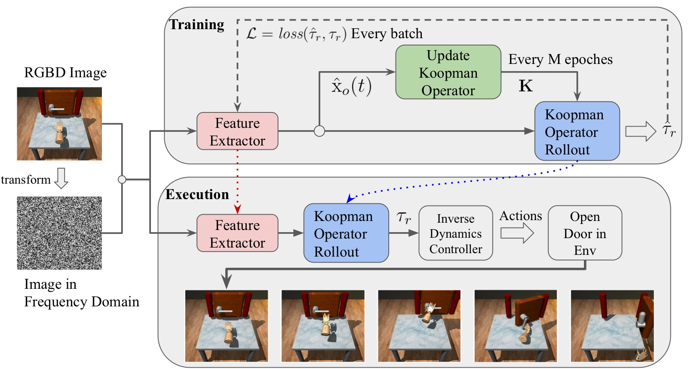
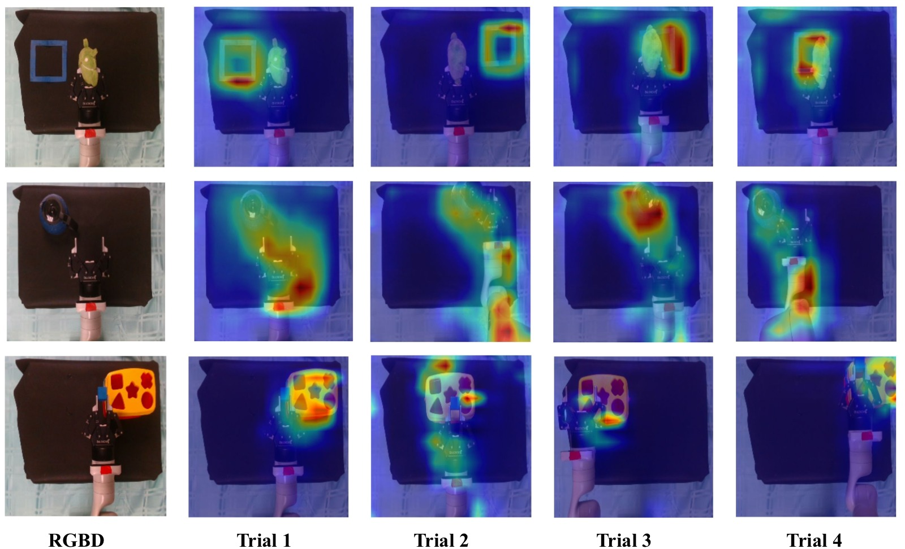
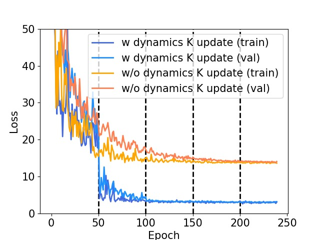
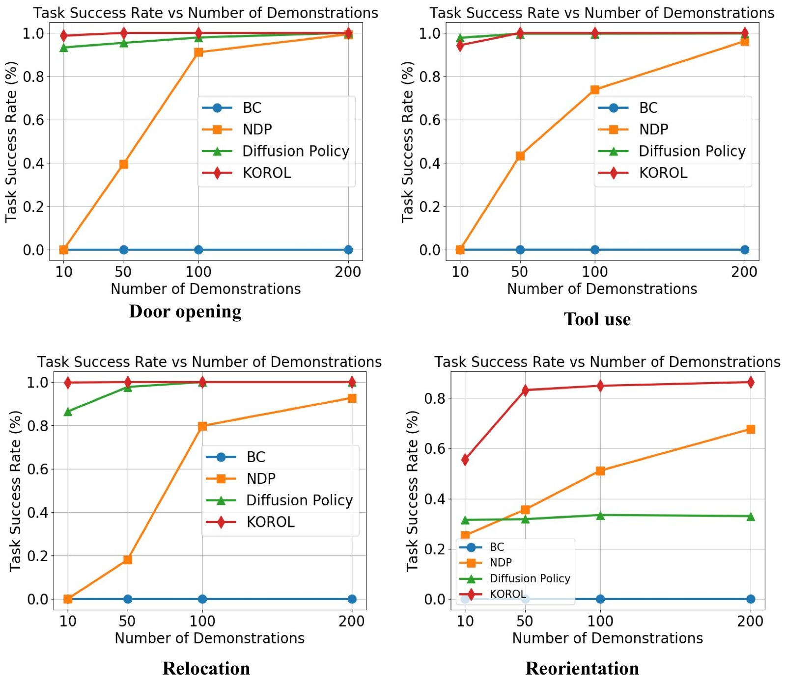
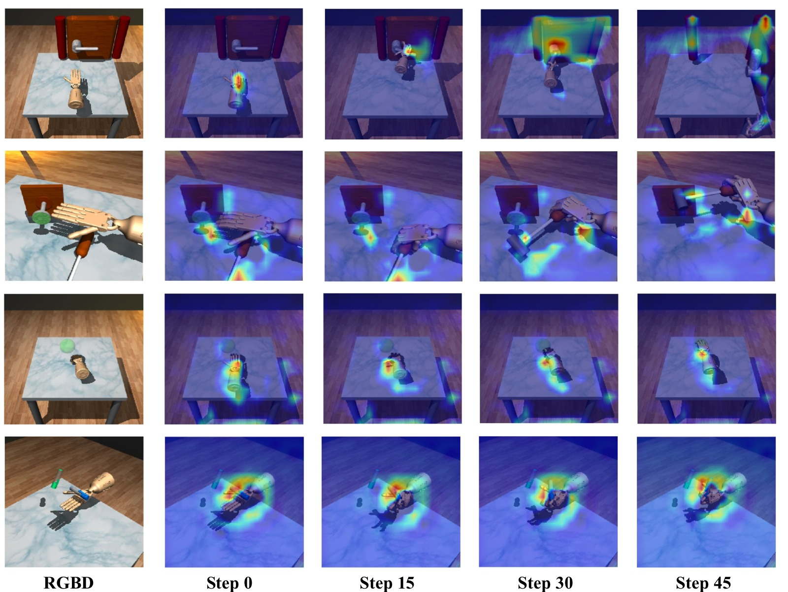
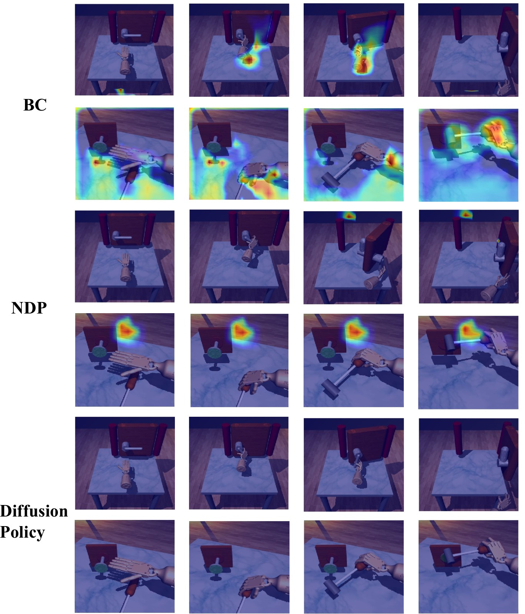

%% mathjax-macros
\bs: \mathbf{s}
\ba: \mathbf{a}
\br: \mathbf{r}
\bz: \mathbf{z}
\bx: \mathbf{x}
\modelName: \text{KOROL}
\expect: \mathbb{E}_{#1}\left[#2\right]
%% end-mathjax-macros

# KOROL: Learning Visualizable Object Feature with Koopman Operator Rollout for Manipulation

> **论文信息**
> - 作者：Hongyi Chen, Abulikemu Abuduweili*, Aviral Agrawal*, Yunhai Han*, Harish Ravichandar, Changliu Liu, Jeffrey Ichnowski (* equal contribution)
> - 通讯作者：Hongyi Chen (CMU), Jeffrey Ichnowski (CMU)
> - 投稿方向：CoRL 2024 (Conference on Robot Learning)
> - arXiv ID：arXiv-2407.00548v2
> - 代码：https://github.com/hychen-naza/KOROL
> - 项目页面：https://github.com/hychen-naza/KOROL

---

## 一、核心问题

灵巧操控（dexterous manipulation）面临的核心挑战是物体与多指手之间复杂的非线性动力学。**Koopman 算子**近年被证明是一种有效的方法——它将非线性动力学转化为高维线性系统，使得线性控制工具可以直接用于操控任务。然而现有 Koopman 操控方法存在一个致命瓶颈：**运行时必须获取精确的 ground-truth（GT）物体状态**（如物体位姿、接触点等），这使得它们无法部署到实际的视觉机器人系统中。

获取物体 GT 状态的困难在于：
1. **不确定性**：不知道场景中有多少个物体、需要估计哪些状态
2. **传感器局限**：遮挡、动态环境和传感器精度限制使得精确物体状态获取极为困难
3. **跨任务不可迁移**：不同任务定义的物体状态空间不同（如 Tool use 的 9-DoF vs Door opening 的 7-DoF），导致学到的动力学模型无法在任务间共享

另一方面，端到端的 image-to-action 策略（如 Diffusion Policy）虽然不需要 GT 状态，但它们以黑箱方式隐式学习视觉表征，样本效率低、可解释性差。

KOROL 的核心问题是：**能否让 Koopman 算子摆脱对 GT 物体状态的依赖，直接从图像中学习可解释的物体特征？**

---

## 二、核心思路 / 方法

### 2.1 总体思路

KOROL 的核心洞察是：与其让策略网络隐式学习视觉特征用于直接输出动作（image-to-action），不如让**动力学模型**（Koopman 算子）来驱动视觉特征学习。具体来说，KOROL 使用一个特征提取器 $f_\theta$ 从 RGBD 图像中预测物体特征 $\hat{\mathrm{x}}_o(t)$，然后用 Koopman 算子 $\mathbf{K}$ 对系统状态做自回归 rollout 来预测未来机器人轨迹，通过最小化机器人状态的预测误差来训练 $f_\theta$。

这形成了一个**协同循环**：
- 特征提取器 $f_\theta$ 学习从图像中提取对动力学预测有用的物体特征
- Koopman 算子 $\mathbf{K}$ 利用这些特征进行准确的动力学 rollout
- 更新的特征反过来用于精化 Koopman 算子（每 $M$ 个 epoch 重新求解一次）



*图1：KOROL 训练与执行流水线总览。该图展示了 KOROL 的完整两阶段流程。**训练阶段（Training）**：从 trajectory $\tau = [\mathrm{x}_r(1), \mathrm{y}(1), \cdots, \mathrm{x}_r(T), \mathrm{y}(T)]$ 中，特征提取器 $f_\theta$ 从图像 $\mathrm{y}(t)$ 中预测物体特征 $\hat{\mathrm{x}}_o(t) = f_\theta(\mathrm{y}(t))$。给定初始机器人状态 $\mathrm{x}_r(0)$ 和预测的物体特征，Koopman 算子 $\mathbf{K}$ 通过自回归 rollout 生成预测的机器人轨迹 $\hat{\tau}_r = [\hat{\mathrm{x}}_r(1), \hat{\mathrm{x}}_r(2), \cdots, \hat{\mathrm{x}}_r(T)]$。训练损失 $\mathcal{L}$ 计算预测轨迹与 GT 轨迹 $\tau_r$ 之间的误差，反向传播更新 $f_\theta$。每 $M$ 个 epoch，使用最新的 $f_\theta$ 重新预测所有物体特征并重新求解 $\mathbf{K}$。**执行阶段（Execution）**：在测试时，仅需初始图像预测物体特征，随后 Koopman 算子自回归 rollout 生成参考轨迹，预训练的逆动力学控制器将轨迹转换为关节动作。*

### 2.2 Koopman 算子背景

给定非线性动力学 $\mathrm{x}(t+1) = F(\mathrm{x}(t))$，Koopman 算子 $\mathcal{K}$ 通过提升函数（lifting function）$g$ 将系统变换到无穷维观测空间中的线性系统：

$$g(\mathrm{x}(t+1)) = \mathcal{K}g(\mathrm{x}(t))$$

实际中，我们使用有限维近似：$\phi(\mathrm{x}(t)) \in \mathbb{R}^p$ 为 $p$ 维观测向量，$\mathbf{K} \in \mathbb{R}^{p \times p}$ 为有限维 Koopman 矩阵，满足：

$$\phi(\mathrm{x}(t+1)) \approx \mathbf{K}\phi(\mathrm{x}(t))$$

对于操控任务，状态定义为 $\mathrm{x}(t) = [\mathrm{x}_r(t)^\top, \mathrm{x}_o(t)^\top]^\top$（机器人状态 + 物体状态）。观测函数包含了原始状态及其多项式提升：

$$\phi(\mathrm{x}(t)) = [\mathrm{x}_r(t)^\top, \psi_r(\mathrm{x}_r(t)), \mathrm{x}_o(t)^\top, \psi_o(\mathrm{x}_o(t))]^\top$$

其中 $\psi_r$ 和 $\psi_o$ 为多项式基函数。通过 "unlifting" 操作 $\phi^{-1}$，可以从观测中恢复机器人状态。给定数据集 $D$，$\mathbf{K}$ 通过最小二乘求解。

### 2.3 物体特征学习

KOROL 的训练目标变为：

$$\arg\min_{\theta, \mathbf{K}} \sum_{\mathrm{x} \in D}\sum_{t=0}^{T-1} \left\| \mathrm{x}_r(t+1) - \mathbf{K}^{\prime}(\mathrm{x}_r(t), f_\theta(\mathrm{y}(t))) \right\|^2$$

其中 $f_\theta$ 为 ResNet18 特征提取器，输入为 RGBD 图像（256×256×4），输出为 8 维物体特征向量。训练时，从轨迹中随机采样起始时间步 $t_0$，使用 GT 初始机器人状态和预测的物体特征进行 $N$ 步自回归 rollout，最小化所有步的机器人状态预测误差。

**频域增强**：KOROL 将 RGBD 空间域图像通过离散余弦变换（DCT）转换到频域，然后将空间域和频域图像拼接作为输入。这样做的好处是：
- 高频分量捕获连续帧之间的细微变化（如门把手位置的微小移动）
- 低频分量捕获大致不变的场景元素（如背景）
- 频域表示使得 CNN 能更容易区分连续时间步中高度相关的图像

### 2.4 Koopman 算子更新策略

由于 $f_\theta$ 训练过程中物体特征不断变化，初始求解的 $\mathbf{K}$ 会逐渐过时。但每个 epoch 都对全数据集重新计算特征并求解 $\mathbf{K}$ 计算代价过高。KOROL 采用**延迟更新策略**：每 $M = 50$ 个 epoch 重新计算全数据集的物体特征并重新求解 $\mathbf{K}$。

消融实验（Table 5 in Appendix）证明：
- $M = \infty$（不更新）：成功率 0%，因为 $\mathbf{K}$ 对训练后的特征完全过时
- $M = 1$（每个 epoch 更新）：成功率仅 80.4%，过于频繁的更新类似 TD3 中的目标网络更新延迟问题
- $M = 50$：最优，成功率 99.9%
- $\mathbf{K}$ 更新频率应远低于特征训练频率，通常低至少一个数量级

### 2.5 多任务 Koopman 算子

不同操控任务定义的物体状态空间不同（维度不同、语义不同），导致 Koopman 算子无法在任务间共享。KOROL 提出使用**固定维度的物体特征**（8 维）作为通用接口来替代变长的物体状态，从而可以用多个任务的数据联合训练一个**多任务 Koopman 算子 $\mathbf{K}_\mathrm{multi}$**。

物体的特征向量充当了隐式条件向量，区分不同任务。只要特征提取器能识别对每个任务有用的物体特征，就可以用不同任务的数据集训练统一的 $\mathbf{K}_\mathrm{multi}$。

---

## 三、训练目标

KOROL 将动力学学习和物体特征学习统一为机器人状态的模仿学习问题：

$$\mathcal{L} = \mathbb{E}_{\tau, t_0} \sum_{i=0}^{N-1} \left\| \mathrm{x}_r(t_0+i+1) - \mathbf{K}^{\prime}(\hat{\mathrm{x}}_r(t_0+i), \hat{\mathrm{x}}_o(t_0+i)) \right\|^2$$

其中：
- $N = 40$ 为预测 horizon（自回归 rollout 步数）
- $\hat{\mathrm{x}}_r(0) = \mathrm{x}_r(0)$：系统提供初始 GT 机器人状态
- $\hat{\mathrm{x}}_o(t_0)$ 仅从初始图像中提取，后续时间步的物体特征由 $\mathbf{K}$ 自回归推进
- **不需要任何物体状态的 GT 标签**

**关键训练细节**：
- 特征提取器：ResNet18（输出 8 维特征）
- 输入：256×256×4（RGBD 空间域 + DCT 频域拼接）
- Koopman 算子更新频率：$M = 50$ epochs
- 优化器：Adam（lr=1e-4）
- 最大训练 epoch：300
- 逆动力学控制器：预训练，将预测的机器人轨迹转为关节力矩/动作

---

## 四、实验与结果

### 4.1 实验设置

**仿真实验（ADROIT Hand）**：
- 30-DoF ADROIT 灵巧手（24-DoF 关节手 + 6-DoF 浮动腕基座）
- 4 个任务：Door opening、Tool use、Relocation、Reorientation
- 基线：BC、NDP（Neural Dynamic Policy）、Diffusion Policy
- 公平对比：所有模型使用 ResNet18 作为特征提取器
- 每任务训练 10 或 200 个 demonstrations，测试 200 个未见 case

**真机实验**：
- 7-DoF Kinova 机械臂 + 平行夹爪
- 3 个任务：Toy relocation、Teapot pickup、Cube insertion
- 每任务 20 或 50 个 demonstrations，测试 20 次

### 4.2 仿真主结果

| 方法 | Door (200) | Tool (200) | Reloc (200) | Reori (200) | 平均 |
|------|:----------:|:----------:|:-----------:|:-----------:|:----:|
| Koopman w/ GT | 100% | 100% | 95.6% | 83.6% | 94.8% |
| NDP w/ GT | 99.9% | 96.9% | 99.8% | 64.6% | 90.3% |
| Diffusion Policy w/ GT | 100% | 100% | 99.2% | 93.3% | 98.1% |
| NDP (visual) | 99.3% | 96.2% | 92.7% | 67.7% | 89.0% |
| Diffusion Policy (visual) | 99.9% | 99.7% | 100% | 33.0% | 83.2% |
| **KOROL (visual)** | **99.9%** | **100%** | **100%** | **86.4%** | **96.6%** |

**关键发现**：
1. **KOROL 用学习特征超越 GT 状态**：在 harder tasks（Relocation +4.4%, Reorientation +2.8%）上，KOROL 学习到的特征优于手工设计的 GT 物体状态。这是因为学习到的特征能在训练中动态更新并在执行时适应变化，而 GT 状态是固定的。
2. **平均提升**：KOROL 在 200 demos 下比 NDP 平均提升 1.08×，比 Diffusion Policy 提升 1.16×。
3. **样本效率**：仅 10 个 demos 时，KOROL 超越 NDP 平均 13.77×，超越 Diffusion Policy 1.13×。从 200 降到 10 demos，KOROL 性能仅降 9.5%，而 Koopman w/ GT 降 23.75%。

### 4.3 真机结果



*图2：三个真机任务的物体特征 CAM 可视化。从上到下依次为 Toy relocation、Teapot pickup、Cube insertion 任务，从左到右展示每个任务不同试验的训练图像。**Toy relocation 行**：激活图清晰勾勒了绿色目标物体的位置和蓝色目标边框（bounding box），说明特征提取器学会了关注目标物体和目标位置。**Teapot pickup 行**：激活集中在茶壶把手上，这恰好是对抓取最关键的物体部位。**Cube insertion 行**：激活图未聚焦于形状分类盒（shape sorter），而是分散在周围区域，这解释了为什么 insertion 任务成功率最低——特征提取器未能精确定位插入目标，导致夹爪定位出现 1-2cm 偏差。整体来看，CAM 可视化验证了 KOROL 学到的是对操控任务有意义的物体特征，而非任意的视觉特征。*

**真机成功率（成功次数/20次测试）**：

| 方法 | Relocation (50) | Pickup (50) | Insertion (50) |
|------|:---------------:|:-----------:|:--------------:|
| NDP | 11/20 | 0/20 | 0/20 |
| Diffusion Policy | 13/20 | 7/20 | 9/20 |
| **KOROL** | **20/20** | **19/20** | **14/20** |

- Relocation：KOROL 全部成功，NDP 和 Diffusion Policy 夹爪释放时机不准
- Pickup：KOROL 几乎全部成功，NDP 无法预测正确抓取位置，Diffusion Policy 定位精度不足
- Insertion：所有方法都较难，KOROL 仍以 14/20 大幅领先。主要失败模式：夹爪移动到目标 1-2cm 附近时精度不够

### 4.4 多任务实验

将四个仿真任务的数据合并（800 demos），训练单个 $f_\theta$ + 统一的 $\mathbf{K}_\mathrm{multi}$：

| 任务 | ResNet18 | ResNet34 | ResNet50 |
|------|:--------:|:--------:|:--------:|
| Door opening | 99.9% | **100%** | 100% |
| Tool use | **100%** | 99.9% | 100% |
| Relocation | 78.2% | **93.8%** | 81.3% |
| Reorientation | 85.9% | **86.8%** | 85.9% |

多任务 Koopman 在 Door、Tool、Reorientation 上保持强劲性能，但在 Relocation 上下降明显（100% → 78.2%）。使用更大的 backbone（ResNet34）可改善到 93.8%，但 ResNet50 出现过拟合（降至 81.3%）。这说明多任务学习需要足够容量的特征提取器，但太大会欠拟合。

### 4.5 消融实验与分析



*图3：Door 任务的训练与验证损失曲线。虚线标示 $\mathbf{K}$ 的更新时刻（epoch 50、100、150、200）。蓝色线为标准 KOROL 训练过程，橙色线为消融实验（不更新 $\mathbf{K}$）。关键观察：**epoch 50 第一次更新 $\mathbf{K}$ 后，损失大幅下降**——这说明特征提取器训练 50 个 epoch 后，初始的 $\mathbf{K}$ 已经不再适合新的物体特征，重新求解 $\mathbf{K}$ 使损失显著降低。epoch 100、150、200 的后续更新影响较小，因为此时损失已处于低位。不更新 $\mathbf{K}$ 的消融实验中损失持续停滞，证明 Koopman 算子的周期性更新对特征学习至关重要。此图直接展示了 KOROL 中"协同循环"机制的有效性——更准确的 $\mathbf{K}$ 产生更准确的 rollout 梯度，进而驱动 $f_\theta$ 学习更好的特征。*



*图4：四种仿真任务上，各方法在不同训练 demo 数量（10/50/100/200）下的成功率对比，每任务测试 200 个未见 case。**Door opening（左上）**：KOROL 在所有数据量上稳定最优，Diffusion Policy 紧随其后但 10 demos 时已接近。**Tool use（右上）**：10 demos 时 Diffusion Policy 略优于 KOROL（97.8% vs 94.3%），这主要是由于 Tool use 任务中视觉信号变化较丰富（hammer 的大幅度运动），Diffusion Policy 的生成式建模对此类任务有优势；但随数据增加 KOROL 均达到 100%。**Relocation（左下）**：KOROL 在所有数据量上显著领先，10 demos 时 Diffusion Policy（86.4%）超过 KOROL（45.5%），但 KOROL 在 50 demos 后反超。**Reorientation（右下）**：这是最难的任务（in-hand manipulation），KOROL 在 50 demos 时以 82.7% 大幅领先所有基线，验证了 Koopman 动力学模型在处理复杂旋转运动的优势。总体趋势：KOROL 的样本效率随任务难度提升而愈发突出，动力学先验在数据稀缺时提供了强力归纳偏置。*



*图5：四个仿真任务中 KOROL 物体特征的 CAM 可视化。从上到下依次为 Door opening、Tool use、Relocation、Reorientation，从左到右展示任务执行的连续帧。**Door opening 行**：初始帧（第1-2列）激活集中在机器人手上，符合训练目标（最小化机器人状态预测误差）；当手接近门把手时（第3-4列），激活扩展到门把手和手；最终帧（第5列）激活图清晰突出门把手和门，说明特征提取器学会了关注操控过程中的关键物体。**Tool use 行**：激活贯穿始终地集中在钉子（nail）和锤子（hammer）上，而非背景或工作台，精确反映了任务的关键交互目标。**Relocation 行**：激活主要聚焦在机器人手上——因为这是一个将球移动到目标位置的运输任务，球在手中不动时手的位置是预测机器人轨迹的最重要信息。**Reorientation 行**：激活分散在手上，因为这个 in-hand 任务的关键是手内旋转，笔的外观变化小。这些 CAM 图不仅验证了特征的可解释性，还提供了训练质量的诊断工具：激活在无关区域说明特征学习不足，可能导致任务失败。*



*图6：BC、NDP、Diffusion Policy 在 Door opening 和 Tool use 任务上的 CAM 特征可视化对比，从上到下依次为三个基线方法。**BC 行**：BC 学到了一些可读的物体特征（如门把手、钉子区域），但模型能力过低（所有任务 0% 成功率），因此其特征未充分捕获操控所需的关键信息。**NDP 行**：NDP 的特征图较为分散，缺乏清晰的物体聚焦——这是因为它将特征嵌入到动态基元（DMP）的参数空间中，特征编码的信息被二次转换，丢失了视觉可解释性。**Diffusion Policy 行**：扩散策略的特征图最不可读，复杂的 UNet 去噪过程使特征信息高度混合，无法从 CAM 中识别出有意义的物体关注。整体对比：KOROL 和 BC 由于保持了相对简单的模型结构（特征直接用于构建动力学系统），保留了视觉可解释性；但 BC 的模型能力不足，而 KOROL 通过 Koopman rollout 损失驱动特征学习，同时实现了高性能和高可解释性。*

---

## 五、关键洞察与技术亮点

1. **"动力学引导的特征学习"范式**：KOROL 的核心理念是让特征好坏由"它能否帮助动力学模型预测未来"来定义。这与端到端方法中"特征好坏由它能否帮助输出正确动作"截然不同——前者的监督信号（机器人状态轨迹）比后者（动作标签）更密集、更有结构，因此样本效率更高。

2. **特征与动力学的协同迭代**：KOROL 中的特征提取器 $f_\theta$ 和 Koopman 算子 $\mathbf{K}$ 相互促进——更好的特征导致更准确的 $\mathbf{K}$，更准确的 $\mathbf{K}$ 通过 rollout 梯度提供更强的特征学习信号。这种协同关系（而非简单的 feature extractor → controller 单向流水线）是 KOROL 性能超越 GT Koopman 的原因。

3. **频域增强的视觉区分能力**：将 DCT 频域图像与空间域图像拼接作为 CNN 输入，使网络能显式感知连续帧之间的细微变化。这一设计的动机是：Koopman rollout 需要在自回归过程中区分高度相似的连续帧，纯空间域的 CNN 归纳偏置使其难以捕捉这些细微差异。

4. **延迟更新策略（类似 TD3）**：$\mathbf{K}$ 的更新频率需要远低于 $f_\theta$ 的训练频率（$M=50$），这是实践中的关键经验发现。过于频繁的更新会破坏特征训练的稳定性，类似 TD3 中目标网络延迟更新的原理。

5. **物体特征作为多任务通用接口**：固定维度的物体特征（8 维）替代变长的物体状态定义，使 Koopman 算子可以在不同任务间共享。这一设计类似 NLP 中的 embedding 思想——将变长、异构的"物体状态"映射到固定维度的连续向量空间，作为不同任务的通用"语言"。

6. **可解释的视觉特征**：与 Diffusion Policy 等黑箱方法不同，KOROL 的物体特征可以通过 CAM 直接可视化，展示模型关注图像中的哪些区域。这不仅提升了用户信任度，还提供了模型调试和故障诊断的能力。

---

## 六、代码实现解读

KOROL 基于 [KODex](https://github.com/GT-STAR-Lab/KODex) 代码库实现，其核心训练流程如下：

```
┌──────────────────────────────────────────────────────────────┐
│                    KOROL 训练循环                              │
├──────────────────────────────────────────────────────────────┤
│                                                               │
│  ┌─────────────────────┐                                      │
│  │  初始特征预测         │                                      │
│  │  f_θ(y) for all y   │──▶ 计算初始 K (最小二乘)              │
│  └─────────────────────┘                                      │
│            │                                                  │
│            ▼                                                  │
│  ┌─────────────────────────────────────────┐                  │
│  │  for epoch = 1 to N1:                   │                  │
│  │    ├─ 采样 τ, t0 ~ D                    │                  │
│  │    ├─ x̂_o(t0) = f_θ(y(t0))              │                  │
│  │    ├─ for i = 0 to N:                   │ rover rollout  │
│  │    │    x̂(t0+i+1) = K·φ(x̂(t0+i))        │                  │
│  │    │    loss += ||x_r(t0+i+1) - x̂_r||²  │                  │
│  │    ├─ 更新 f_θ (反向传播)                 │                  │
│  │    └─ if epoch % M == 0:                │                  │
│  │        重新预测全数据集特征 → 重新求解 K   │                  │
│  └─────────────────────────────────────────┘                  │
│            │                                                  │
│            ▼                                                  │
│  ┌─────────────────────┐                                      │
│  │  推理阶段             │                                      │
│  │  x̂_o(0) = f_θ(y(0))  │                                      │
│  │  for t = 0 to T:     │                                      │
│  │    x̂_r(t+1) = K'(·)  │──▶ 逆动力学控制器 → 关节动作         │
│  │    x̂_o(t+1) via K    │                                      │
│  └─────────────────────┘                                      │
└──────────────────────────────────────────────────────────────┘
```

**关键组件映射**：

| 论文概念 | 代码实现 | 说明 |
|---------|---------|------|
| 特征提取器 $f_\theta$ | ResNet18 (最后一层输出 8 维) | `torchvision.models.resnet18` |
| 提升函数 $\psi_r, \psi_o$ | 多项式基函数（二次+三次） | 见公式 (8)，$p = 3n+2m+m^2+n(n-1)/2+m(m-1)/2$ |
| Koopman 算子 $\mathbf{K}$ | 最小二乘求解 | `np.linalg.lstsq` 或等效 |
| 频域变换 | DCT（离散余弦变换） | `scipy.fftpack.dct` |
| 逆动力学控制器 | 预训练 MLP | 每任务独立训练，输出关节力矩或末端位姿 |
| Koopman 更新频率 $M$ | `if epoch % 50 == 0` | 超参数，50 为默认值 |
| Rollout horizon $N$ | `N = 40` | 自回归预测 40 步 |

---

## 七、局限性与未来工作

1. **最小二乘求解的局限**：$\mathbf{K}$ 通过求解最小二乘问题得到，这种两步法（先训练 $f_\theta$ 再求解 $\mathbf{K}$）非端到端。深度神经 Koopman 方法（如 Deep Koopman）可以联合训练特征和算子，可能进一步提升性能。

2. **精细操控不足**：Cube insertion 等需要亚厘米级精度的任务上 KOROL 表现不佳（真机 14/20）。未来工作可探索更强的特征提取器（如 Vision Transformer）来提高物体特征精度。

3. **CAM 可视化限制**：CAM 仅适用于空间域 RGBD 图像，不适用于频域图像。当前只能在 RGBD 图像上做可视化验证，频域图像的可解释性仍是一个开放问题。

4. **多任务性能退化**：在 Relocation 任务上，多任务 KOROL 比单任务版本下降显著（100% → 78.2%），说明当前的统一物体特征空间设计仍有改进空间。

5. **任务定义依赖**：虽然 KOROL 摆脱了 GT 物体状态，但仍需要任务特定的逆动力学控制器，距离完全通用的操控系统还有一步之遥。

---

## 八、关键概念速查

| 概念 | 含义 |
|------|------|
| **Koopman 算子** | 将非线性动力学变换为无限维线性系统的数学算子，使线性控制工具可用于非线性系统 |
| **Observables（观测函数）$\phi$** | 原状态的提升函数，将状态映射到高维空间，包括原始状态及其多项式组合 |
| **Lifting/Unlifting** | Lifting = 将状态提升到高维观测空间；Unlifting = 从观测空间恢复原始状态 |
| **KOROL** | Koopman Operator Rollout for Object Feature Learning |
| **Rollout** | 使用 $\mathbf{K}$ 自回归地推进系统状态，预测未来 $N$ 步轨迹 |
| **物体特征 $\hat{\mathrm{x}}_o(t)$** | 8 维向量，由 ResNet18 从 RGBD 图像中提取，替代 GT 物体状态 |
| **DCT（离散余弦变换）** | 将空间域图像转到频域，增强 CNN 对连续帧细微变化的感知 |
| **$\mathbf{K}$ 延迟更新（M=50）** | 每 50 个 epoch 重新求解 $\mathbf{K}$，类似 TD3 中目标网络延迟更新 |
| **$\mathbf{K}_\mathrm{multi}$** | 多任务 Koopman 算子，用固定维度物体特征统一不同任务的动力学 |
| **CAM** | Class Activation Mapping，可视化 CNN 关注的图像区域，验证物体特征的可解释性 |
| **ADROIT Hand** | 30-DoF 仿真灵巧手环境（24-DoF 手 + 6-DoF 腕），基于 MuJoCo |
| **NDP** | Neural Dynamic Policy，基于 DMP 的模型驱动模仿学习方法 |
