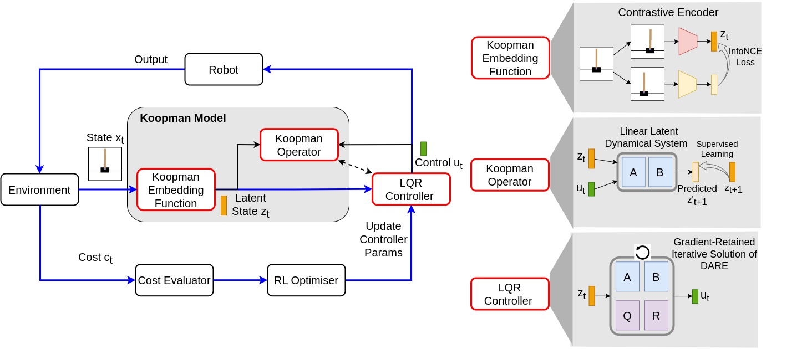
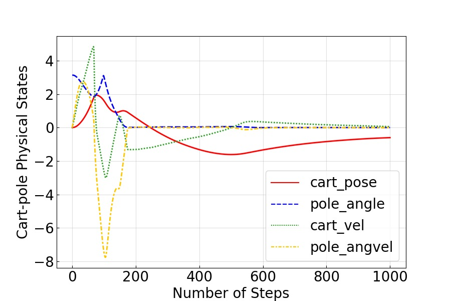
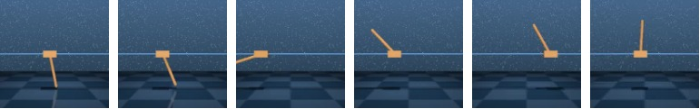
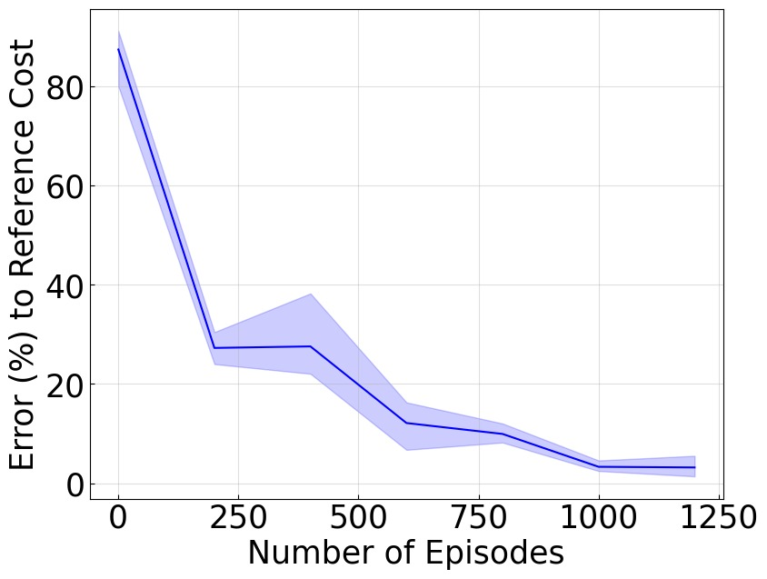
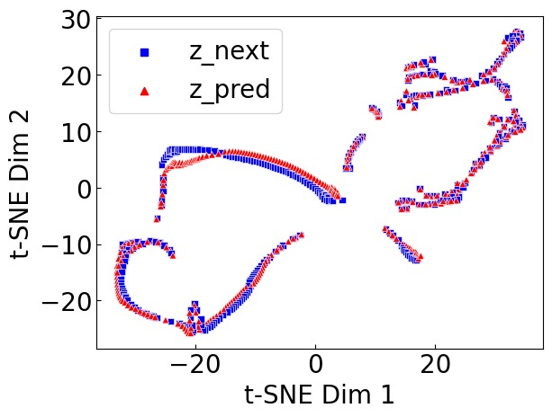
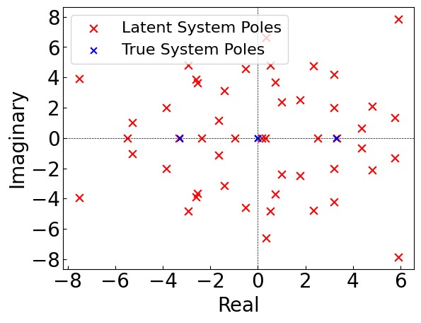
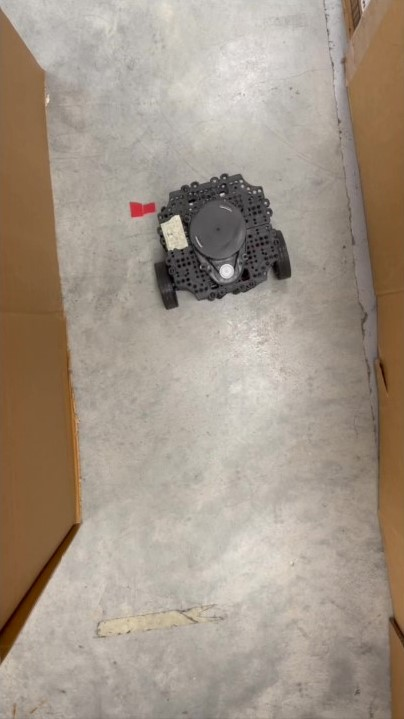
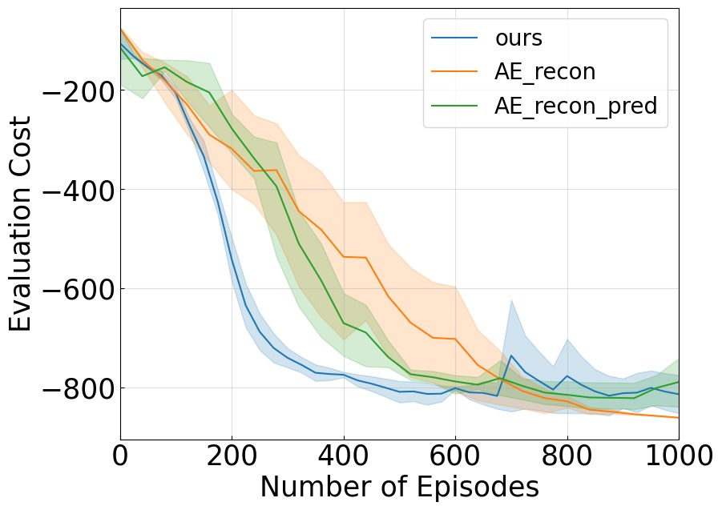

%% mathjax-macros
%% end-mathjax-macros

# Task-Oriented Koopman-Based Control with Contrastive Encoder

> **论文信息**
> - 作者：Xubo Lyu, Hanyang Hu, Seth Siriya, Ye Pu, Mo Chen
> - 通讯作者：Mo Chen（Simon Fraser University）& Ye Pu（University of Melbourne）
> - 投稿方向：CoRL 2023（Conference on Robot Learning）
> - arXiv ID：arXiv-2309.16077v2
> - 代码：https://sites.google.com/view/kpmlilatsupp/

---

## 一、核心问题

Koopman 算子理论为非线性系统控制提供了一条优雅的路径：将非线性动力学映射到一个 latent 空间，在该空间中动力学是（全局）线性的，从而可以使用线性控制理论进行高效控制。然而，现有 Koopman 控制方法面临两大瓶颈：

1. **两阶段模型导向范式的固有限制**：传统方法先识别 Koopman 模型（学习 embedding 函数和线性算子），再基于模型设计线性控制器。控制器性能高度依赖模型精度——即使模型误差很小，控制器性能也会严重退化。此外，即使在完美模型下，latent 空间的 LQR 代价函数参数（如 $\mathbf{Q}$ 矩阵）仍需手工调试。
2. **局限于低维系统**：上述挑战在高维状态空间（如像素观测、复杂机器人系统）中尤为突出，导致 Koopman 控制长期局限于低维简单系统，无法应用于像素级或高维真实机器人任务。

> "Slight prediction inaccuracies of the learned model can significantly degrade the subsequent control performance."

---

## 二、核心思路 / 方法

本论文提出**任务导向（task-oriented）的 Koopman 控制**，核心理念：将控制性能——而非模型预测精度——作为优化的首要目标。在一个端到端强化学习框架中**同时学习** Koopman embedding、线性算子和线性控制器。

### 2.1 总体架构



*图1：方法总览图。该图展示了端到端 RL 框架下同时学习 Koopman 模型和控制器的完整流程。从左到右：(1) 对比编码器（Contrastive Encoder）将原始状态（物理状态或像素观测）映射到 latent embedding $\mathbf{z}$；(2) 线性矩阵 $\mathbf{A}, \mathbf{B}$ 描述 latent 空间中的线性动力学 $\mathbf{z}_{k+1} = \mathbf{A}\mathbf{z}_k + \mathbf{B}\mathbf{u}_k$；(3) 可微 LQR 控制器在 latent 空间中求解 DARE 得到最优控制 $\mathbf{u}^* = -\mathbf{G}\mathbf{z}$；(4) 三个损失函数联合优化——$\mathcal{L}_{\text{sac}}$（主目标）降低任务代价，$\mathcal{L}_{\text{cst}}$（辅助）确保对比嵌入空间质量，$\mathcal{L}_{\text{m}}$（辅助）保持模型预测精度。整个流程形成一个可微的端到端学习回路。*

### 2.2 Contrastive Encoder 作为 Koopman Embedding 函数

传统的 autoencoder 做 Koopman embedding 在高维非像素状态（如物理状态向量）下效果不佳。论文采用**对比编码器（contrastive encoder）**：

- 为每个状态 $\mathbf{x}_i$ 创建 query 样本 $\mathbf{x}_i^q$ 和 key 样本集（正样本 $\mathbf{x}_i^+$ + 负样本 $\{\mathbf{x}_j^-\}$）
- 正样本通过对原状态加不同 augmentation 生成；负样本为其他状态加类似 augmentation
- **像素状态**：使用卷积编码器 + 随机裁剪增强
- **物理状态**：使用全连接编码器 + 均匀分布随机噪声增强：
  $$\Delta{\mathbf{x}} \sim \mathrm{U}(-\eta |\mathbf{x}|, \eta|\mathbf{x}|); \quad \mathbf{x}^+ = \mathbf{x} + \Delta{\mathbf{x}}$$
- 使用两个编码器 $\psi_{\theta_q}$ 和 $\psi_{\theta_k}$（动量更新），最终仅 $\psi_{\theta_q}$ 作为 Koopman embedding 函数
- 对比损失采用 InfoNCE：
  $$\mathcal{L}_{\text{cst}} = \mathbb{E}_{\mathbf{t}\sim \mathcal{B}}\log \frac{\exp({\mathbf{z}_i^q}^{\top}W\mathbf{z}_i^+)}{\exp({\mathbf{z}_i^q}^{\top}W\mathbf{z}_i^+)+\sum_{j\neq i}\exp({\mathbf{z}_i^q}^{\top}W\mathbf{z}_{j}^{-})}$$

### 2.3 线性矩阵作为 Koopman 算子

Koopman 算子分解为状态矩阵 $\mathbf{A}$ 和控制矩阵 $\mathbf{B}$：

$$\mathbf{z}_{k+1} = \mathbf{A}\mathbf{z}_k + \mathbf{B}\mathbf{u}_k$$

通过 MSE 最小化学习：

$$\mathcal{L}_\text{m} = \mathbb{E}_{\mathbf{t} \sim \mathcal{B}} \lVert \hat{\mathbf{z}}_{k+1} - \mathbf{A}\mathbf{z}_k - \mathbf{B}\mathbf{u}_k \rVert^2$$

### 2.4 LQR-In-The-Loop 作为可微线性控制器

这是本文的关键创新——将 LQR 控制器嵌入端到端 RL 回路中：

- Latent 空间中的无限时域 LQR 问题：
  $$\min_{\mathbf{u}_{0:\infty}} \sum_{k=0}^{\infty}\left[(\mathbf{z}_k-\mathbf{z}_\text{ref})^\top\mathbf{Q}(\mathbf{z}_k-\mathbf{z}_\text{ref})+\mathbf{u}_k^\top \mathbf{R} \mathbf{u}_k\right] \quad \text{s.t.} \quad \mathbf{z}_{k+1}=\mathbf{A} \mathbf{z}_k+\mathbf{B}\mathbf{u}_k$$
- 通过迭代求解 DARE（Discrete-time Algebraic Riccati Equation）获得线性增益 $\mathbf{G}$
- 实际中仅需 $M < 10$ 次迭代即可获得满意的近似解
- **关键性质**：控制策略 $\pi_{\text{LQR}}(\mathbf{z}|\mathbf{A}, \mathbf{B}, \mathbf{Q}, \mathbf{R})$ 对参数组 $\boldsymbol{\Omega}=\{\mathbf{Q}, \mathbf{R}, \mathbf{A}, \mathbf{B}, \psi_{\theta}\}$ 是可微的，允许梯度反向传播

### 2.5 端到端学习流程

使用 SAC（Soft Actor-Critic）作为 RL 主干，最大化：

$$\mathcal{L}_\text{sac} = \mathbb{E}_{\mathbf{t} \sim \mathcal{B}}\left[\min_{i=1,2} Q_i(\mathbf{z}, \mathbf{u}) - \alpha \log \pi_{\text{sac}}(\mathbf{u} \mid \mathbf{z})\right]$$

每次迭代的三步更新：
1. 用 $\mathcal{L}_{\text{sac}}$（主目标）更新所有参数 $\boldsymbol{\Omega}$——以任务代价降低为驱动
2. 用 $\mathcal{L}_{\text{cst}}$（辅助目标）更新编码器 $\psi_{\theta}$——确保对比嵌入空间质量
3. 用 $\mathcal{L}_{\text{m}}$（辅助目标）更新 $\mathbf{A}, \mathbf{B}$——保持模型预测精度

---

## 三、训练目标

三个损失函数的联合优化：

$$\mathcal{L}_{\text{total}} = \mathcal{L}_{\text{sac}} + \lambda_1 \mathcal{L}_{\text{cst}} + \lambda_2 \mathcal{L}_{\text{m}}$$

| 损失函数 | 作用 | 更新参数 | 地位 |
|----------|------|----------|------|
| $\mathcal{L}_{\text{sac}}$ | SAC 的 actor-critic 损失，最小化任务代价 | 全部 $\boldsymbol{\Omega}$ | **主目标** |
| $\mathcal{L}_{\text{cst}}$ | 对比学习 InfoNCE 损失 | $\psi_{\theta}$ | 辅助正则 |
| $\mathcal{L}_{\text{m}}$ | 模型一步预测 MSE 损失 | $\mathbf{A}, \mathbf{B}$ | 辅助正则 |

- **编码器结构**：像素状态用卷积层，物理状态用全连接层
- **latent 维度**：50D（默认），实验显示 6D（可控性矩阵秩）也能维持相近性能
- **LQR 迭代次数**：5 次（默认），3-10 次均表现鲁棒
- **SAC 算法**：使用双 Q 网络 + 熵正则化

---

## 四、实验与结果

### 4.1 实验设置

三个模拟任务（DeepMind Control Suite）：

| 任务 | 状态维度 | 控制维度 | 类型 |
|------|:-------:|:-------:|------|
| CartPole Swingup | 4D | 1D | 低维物理状态 |
| Cheetah Running | 18D | 6D | 高维物理状态 |
| Pixel-Based CartPole Swingup | 像素观测 | 1D | 像素级高维观测 |

此外还包括**真实机器人实验**：TurtleBot3 使用 2D LiDAR + 里程计观测，在 Gazebo 仿真中训练（仅 40 episodes），零样本迁移到真实机器人执行曲线导航任务。

### 4.2 主结果：控制性能



*图2：4D CartPole 系统状态受控演化。该图展示了 CartPole Swingup 任务中 4 个物理状态（cart 位置、cart 速度、pole 角度、pole 角速度）在 Koopman 控制器作用下的时间演化曲线。成功的 swingup 控制表现为：pole 角度从初始向下的位置（$\theta=0$）摆起到直立位置（$\theta=\pi$）并维持平衡，cart 位置在目标中心附近稳定。这张图验证了学习到的 Koopman 控制器实现了对非线性系统的有效稳定控制。*



*图3：(a) 像素 CartPole Swingup 任务的时间序列快照。从左到右展示了 pole 从下垂状态逐渐摆起到直立平衡的全过程，模型仅从第三人称 RGB 图像作为观测输入。(b) 18D Cheetah Running 任务的时间序列快照。从左到右展示了 cheetah 从静止到奔跑的加速过程，四足协调运动的步态清晰可见。这两组可视化证明了方法在处理高维视觉观测和复杂高维物理状态时的通用能力。*



*图4：三个任务的控制性能曲线（5 个随机种子）。三个子图分别展示：(a) 4D CartPole Swingup、(b) 18D Cheetah Running、(c) 像素 CartPole Swingup。纵轴为当前训练步数下控制器代价与参考代价（CURL 达到的最优代价）之间的误差，横轴为训练步数。蓝色实线为均值，阴影区域为标准差。在所有三个任务上，方法最终都收敛到参考代价的 10% 误差范围内，且持续改善。特别值得注意的是：(1) Cheetah 18D 任务的高难度——18 维连续状态 + 6 维控制，传统 Koopman 方法从未在此类任务上成功；(2) 像素 CartPole 任务中直接从像素学习控制，不需要任何状态估计模块。*

### 4.3 模型预测精度：Latent 空间线性模型评估



*图5：三个任务的 t-SNE latent 轨迹投影（50D → 2D）。(a) 4D CartPole（模型误差 $2.72 \times 10^{-3}$）：真实轨迹 `z_next`（蓝色）与预测轨迹 `z_pred`（橙色）几乎完全重叠，表明 latent 空间的线性模型高度准确地捕获了局部非线性动力学。(b) 18D Cheetah（模型误差 $8.10 \times 10^{-2}$）：尽管状态维度高达 18D，两个分布仍然高度匹配，证明 Koopman 全局线性表示在高度复杂的非线性系统中依然有效。(c) 像素 CartPole（模型误差 $3.71 \times 10^{-1}$）：两个分布存在明显偏差，说明从像素空间精确建模动力学较为困难。但关键在于——即使模型预测不够完美，控制器仍然达到了良好性能。这直接支持了论文的核心主张：以任务为导向优化控制器比精确建模更重要。*

### 4.4 与 Model-Oriented Koopman Control 对比

**模型误差对控制器性能的影响（Table 1）：**

| 模型误差 | MO-Kpm 总代价 | MO-Kpm 代价变化 | TO-Kpm (Ours) 总代价 | TO-Kpm (Ours) 代价变化 |
|:--------:|:-----------:|:-------------:|:-------------------:|:--------------------:|
| $\sim 10^{-4}$ | -188.10 | — | **-872.18** | — |
| $\sim 10^{-3}$ | -107.67 | 42.75% | **-846.88** | **2.90%** |
| $\sim 10^{-2}$ | -64.32 | 40.27% | **-784.01** | **7.42%** |

> 关键发现：MO-Kpm 即使模型接近完美（$10^{-4}$）时总代价也远低于我们的方法（-188 vs -872），因为 $\mathbf{Q}$ 矩阵在 latent 空间无法有效调试。当模型误差上升一个量级，MO-Kpm 代价骤降 42.75%，而我们仅降 2.90%。**这证明以任务代价作为首要优化目标使控制器对模型误差具有显著的鲁棒性。**

**Latent $\mathbf{Q}$ 矩阵的自动学习（Table 2）：**

手工调试的四组 $\mathbf{Q}$ 矩阵（即使 4D CartPole 只有 6 维 latent）均远差于自动学习的 $\mathbf{Q}$ 矩阵（最高 -188 vs -872 总代价）。这突出了 latent LQR 参数自动学习的必要性——latent 维度没有直接的物理含义，人类难以凭直觉设置合理的权重。

### 4.5 与 CURL（纯 Model-Free RL）对比的独特优势

**系统可控性分析与 latent 维度压缩：**



*图6：CartPole 系统的极点-零点分析。(a) 左侧子图对比了真实 4D 系统（红色×）和学习到的 50D latent 系统（蓝色•）的极点位置。关键发现：latent 系统中的极点精确捕获了真实系统的不稳定极点（在单位圆外的点），证明 Koopman 线性模型保留了原系统的本质动力学特性。(b) 右侧表格展示了基于可控性分析的 latent 维度压缩实验：
- **50D 控制代价：-846.88，模型误差：$7.76 \times 10^{-3}$**
- **6D（可控性矩阵秩）控制代价：-834.18，模型误差：$6.3 \times 10^{-3}$**
- **4D 控制代价：-253.80，模型误差：$5.4 \times 10^{-2}$**
将 latent 维度从 50 压缩到 6（可控性矩阵秩）后性能几乎不变，但降至 4 时性能骤降。这证明了方法的独特优势——相比于 CURL 的纯 model-free 策略，Koopman 模型提供了可解释的系统理论信息，可以指导控制器设计的改进（如维度选择、稳定性分析）。而 CURL 只能提供 -841 的代价，与我们的 -847 相当，但缺乏任何系统理论分析能力。*

### 4.6 Sim-to-Real 零样本迁移



*图7：TurtleBot3 真实机器人曲线导航实验（7 帧时间序列快照）。从 4s 到 30s 的完整轨迹：机器人从起始位置出发，沿弯曲路径导航通过狭窄通道，全程无碰撞到达终点。策略仅在 Gazebo 仿真器中训练（40 episodes），直接零样本部署到真实硬件，无需任何微调。这验证了方法的实用性和 sim-to-real 泛化能力。关键点：(1) 仅使用 2D LiDAR + 里程计作为观测，不依赖 RGB 相机；(2) 40 episodes 的训练量非常小，展示了良好的数据效率；(3) 曲线导航任务中的窄通道对控制精度要求高，验证了 LQR 控制器的可靠性。*

### 4.7 与 Model-Based RL 方法对比（附录）

三个任务上对比 PlaNet 和 Dreamer-v2：

- **优于 PlaNet**：在全部三个任务上，在数据效率和峰值性能方面均显著领先
- **与 Dreamer-v2 竞争性相当**：在两个 CartPole 实验中性能持平，Cheetah 任务上数据效率相当
- **优势**：本方法使用全局线性模型，而 Dreamer 使用大规模非线性网络作为 world model——在计算需求和结构复杂度大幅降低的前提下，控制性能损失极小
- **额外收益**：方法植根于 Koopman 理论，可以进行系统理论分析和可解释性解释（Dreamer 等纯 model-based RL 方法无法做到）

### 4.8 与 Autoencoder Embedding 对比（附录）



*图8：对比编码器与 Autoencoder 的对比（三个子图，各 3 个随机种子）。(a) 像素 CartPole：AE 方法最终与 contrastive encoder 表现相当——这符合预期，因为 AE 擅长重建和表示像素观测。(b) 4D 物理状态 CartPole：AE 方法的控制性能显著差于 contrastive encoder，即使有充足数据也难以学到有用策略。单纯重建损失的 AE 表现优于联合损失（重建+预测）的 AE，但仍不及 contrastive encoder。(c) 18D Cheetah：趋势与 (b) 一致，AE 在非像素、高维物理状态任务上明显弱于 contrastive encoder。这些结果验证了选择对比编码器作为 Koopman embedding 函数的合理性——特别是在处理非像素物理状态时，对比学习提供了更好的表示质量。*

### 4.9 消融实验：超参数敏感性（附录）

在 CartPole Pixel/State 和 Cheetah 三个任务上消融 LQR 迭代次数和 latent 维度：

- **LQR 迭代次数（3/5/10）**：方法在合理范围内鲁棒。5 次迭代（默认值）表现最优，3 次和 10 次均能维持相近性能
- **Latent 维度（30/50/100）**：50D 表现最优。过大的 latent 维度（100D）反而降低控制性能——可能因为 latent 空间过于稀疏，编码器近似能力下降

---

## 五、关键洞察与技术亮点

1. **"控制器优先于模型"的设计哲学**：传统 Koopman 控制以模型预测精度为首要目标，本工作反转了这一优先级——以任务代价最小化为首要驱动力，模型预测仅作为辅助正则项。实验证明这种"任务导向"范式使控制器对模型误差高度鲁棒，从而将 Koopman 控制从低维扩展到高维复杂系统。

2. **可微 LQR-In-The-Loop**：将迭代 DARE 求解过程嵌入端到端 RL 回路，使 LQR 控制器对 $\mathbf{Q}, \mathbf{R}, \mathbf{A}, \mathbf{B}$ 和编码器参数完全可微。这是实现端到端学习的工程关键。

3. **对比编码器优于 Autoencoder**：在非像素物理状态任务上，对比 encoder 的表现显著优于 autoencoder。这挑战了"autoencoder 是学习低维表示的默认选择"的惯例——对于控制任务，对比学习学到的表示更有利于下游策略学习。

4. **可解释的系统理论分析**：与纯 model-free RL（如 CURL）相比，本方法学到的 Koopman 模型允许进行极点-零点分析、可控性分析和 latent 维度压缩。这种可解释性是 model-free 方法无法提供的，为控制器设计提供了理论指导。

5. **真实机器人零样本迁移**：尽管端到端 RL 通常被认为需要在线与环境交互，本文展示了仅 40 episodes 的仿真训练即可实现 sim-to-real 零样本迁移，体现了 Koopman 线性控制器的泛化能力。

---

## 六、方法实例化与技术细节

### 6.1 算法流程

```
┌─────────────────────────────────────────────────────────────────────┐
│              End-to-End Task-Oriented Koopman Control               │
├─────────────────────────────────────────────────────────────────────┤
│                                                                      │
│  每次迭代循环：                                                        │
│                                                                      │
│  ┌──────────┐    ┌──────────────┐    ┌─────────────┐               │
│  │ 收集数据 │───▶│ 从 buffer    │───▶│ 计算损失     │               │
│  │ rollout  │    │ 采样 batch   │    │ Lsac,Lcst,Lm │               │
│  │ τ_η      │    │ B            │    │              │               │
│  └──────────┘    └──────────────┘    └──────┬───────┘               │
│                                              │                       │
│                ┌─────────────────────────────┼───────────────┐      │
│                │                             │               │      │
│                ▼                             ▼               ▼      │
│        ┌──────────────┐            ┌──────────────┐  ┌──────────┐ │
│        │ Lsac 更新     │            │ Lcst 更新     │  │ Lm 更新  │ │
│        │ 全部参数 Ω   │            │ ψ_θ          │  │ A, B     │ │
│        │ (主目标)      │            │ (辅助-对比)    │  │ (辅助-模型)│ │
│        └──────────────┘            └──────────────┘  └──────────┘ │
│                                                                      │
│  其中 LQR 控制推理（在每次 rollout 的每一步执行）：                      │
│                                                                      │
│  ┌──────────┐     ┌──────────────┐     ┌──────────────┐            │
│  │ x_t      │────▶│ ψ_θ(x_t)     │────▶│ 迭代 DARE    │            │
│  │ (观测)   │     │ → z_t        │     │ (M 次迭代)    │            │
│  └──────────┘     └──────────────┘     └──────┬───────┘            │
│                                                │                    │
│                                       ┌────────▼────────┐          │
│                                       │  u* = -G·z_t     │          │
│                                       │  (线性控制)       │          │
│                                       └─────────────────┘          │
└─────────────────────────────────────────────────────────────────────┘
```

### 6.2 DARE 迭代求解算法

```
算法: 迭代求解 DARE
────────────────────────────────────────
输入: A, B, Q, R（当前参数）
      迭代次数 M（默认 5）

1. P_M = Q
2. for m = M, M-1, ..., 1:
     P_{m-1} = A^T P_m A 
              - A^T P_m B (R + B^T P_m B)^{-1} B^T P_m A 
              + Q
3. G = (B^T P_1 B + R)^{-1} B^T P_1 A
4. u* = -G·z

仅需 < 10 次迭代即可获得满意近似解
整个过程在 PyTorch 中实现，完全可微
```

### 6.3 对比编码器的数据增强策略

```
┌────────────────────────────────────────────────────────────┐
│              对比编码器架构（借鉴 MoCo / CURL）               │
├────────────────────────────────────────────────────────────┤
│                                                             │
│  ┌──────────────────┐       ┌──────────────────┐          │
│  │  Query Encoder   │       │   Key Encoder    │          │
│  │  ψ_θq (梯度更新)  │       │  ψ_θk (动量更新)  │          │
│  └────────┬─────────┘       └────────┬─────────┘          │
│           │                          │                     │
│           ▼                          ▼                     │
│    x_i ──▶ 随机增强 ──▶ z_i^q       x_i ──▶ 增强 ──▶ z_i^+│
│    x_j ──▶ 增强     ──▶ z_j^-       (其他样本类似处理)      │
│           │                          │                     │
│           └──────────┬───────────────┘                     │
│                      ▼                                     │
│              InfoNCE Loss (Eq. 5)                          │
│              更新 θq, θk, W                                │
│                                                             │
│  增强策略:                                                   │
│   · 像素状态: 随机裁剪 (random crop)                         │
│   · 物理状态: 均匀噪声 Δx ~ U(-η|x|, η|x|)                  │
│                                                             │
│  最终使用: ψ_θ = ψ_θq 作为 Koopman embedding 函数            │
└────────────────────────────────────────────────────────────┘
```

### 6.4 关键设计决策

| 设计点 | 选择 | 理由 |
|--------|------|------|
| 编码器类型 | 对比编码器（非 Autoencoder） | 物理状态任务上 AE 训练不稳定，对比学习提供更好表示 |
| 模型结构 | 全局线性（$\mathbf{A}, \mathbf{B}$ 矩阵） | 满足 Koopman 理论，允许线性控制理论分析 |
| 控制器类型 | 可微 LQR（非神经网络策略） | 可解释性强，参数少，支持系统理论分析 |
| RL 算法 | SAC | 成熟的 off-policy actor-critic，支持连续控制 |
| Latent 维度 | 50D（默认） | 实验折中选择，6D（可控性秩）也可保持性能 |
| DARE 迭代 | 5 次 | 3-10 次均鲁棒，5 次效率-精度平衡 |
| 优化优先级 | $\mathcal{L}_{\text{sac}}$ 主 + $\mathcal{L}_{\text{cst}}$, $\mathcal{L}_{\text{m}}$ 辅 | 任务导向：控制器性能 > 模型精度 |

---

## 七、局限性与未来工作

1. **数据效率**：端到端 RL 的数据效率有时较差（尤其是在复杂任务上）。可以利用 model-oriented 方法识别的模型来初始化线性控制器，结合两种范式的优势。
2. **实验验证范围**：主要验证限于模拟任务和一个相对简单的真实机器人导航任务。更复杂的真实机器人操控任务（如灵巧操作）有待探索。
3. **latent 维度选择**：目前依赖可控性分析或经验选择 latent 维度。自适应确定最优 latent 维度是一个有价值的方向。
4. **非线性控制器的可能**：当前方法严格使用线性 LQR 控制器，未来可探索在 latent 空间中引入适度非线性以增强控制表达能力。

---

## 八、关键概念速查

| 概念 | 含义 |
|------|------|
| **Koopman 算子** | 将非线性动力学映射到无限维 latent 空间的线性算子，使非线性系统可被线性表示 |
| **Task-Oriented Koopman** | 以任务代价（控制性能）为首要优化目标的 Koopman 控制范式 |
| **Model-Oriented Koopman** | 传统范式：先精确建模，再基于模型设计控制器 |
| **Contrastive Encoder** | 使用对比学习（InfoNCE）训练的状态编码器，学到用于 Koopman embedding 的 latent 表示 |
| **DARE** | Discrete-time Algebraic Riccati Equation，求解 LQR 问题的核心方程 |
| **LQR-In-The-Loop** | 将迭代 DARE 求解嵌入端到端 RL 的回路中，使 LQR 控制器参数可通过梯度更新 |
| **$\mathbf{A}, \mathbf{B}$** | Koopman 算子的有限维近似：状态矩阵和控制矩阵 |
| **$\mathbf{Q}, \mathbf{R}$** | LQR 代价函数的状态和控制权重矩阵（latent 空间中自动学习） |
| **可控性矩阵** | 从 $\mathbf{A}, \mathbf{B}$ 计算得到，其秩揭示可控状态维数，可指导 latent 维度选择 |
| **SAC** | Soft Actor-Critic，off-policy RL 算法，最大化累积奖励 + 策略熵 |
| **InfoNCE** | 对比学习中的标准损失函数，最大化正样本对相似度、最小化负样本对相似度 |
