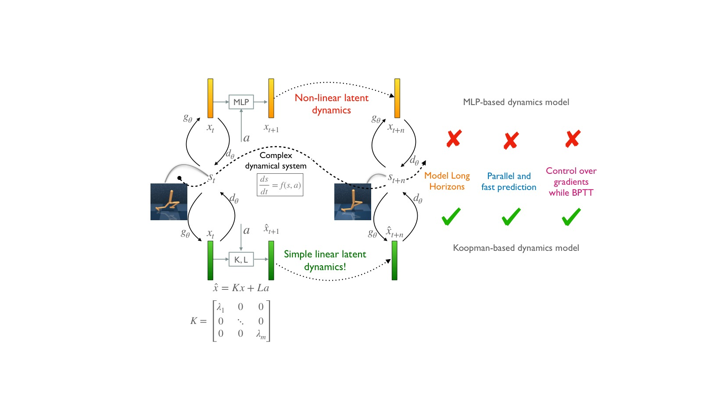
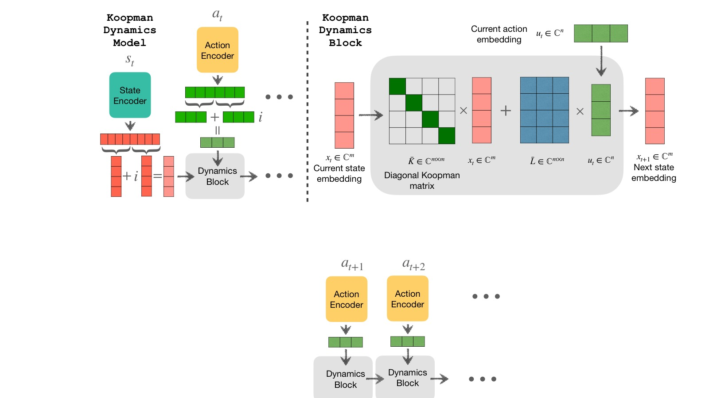
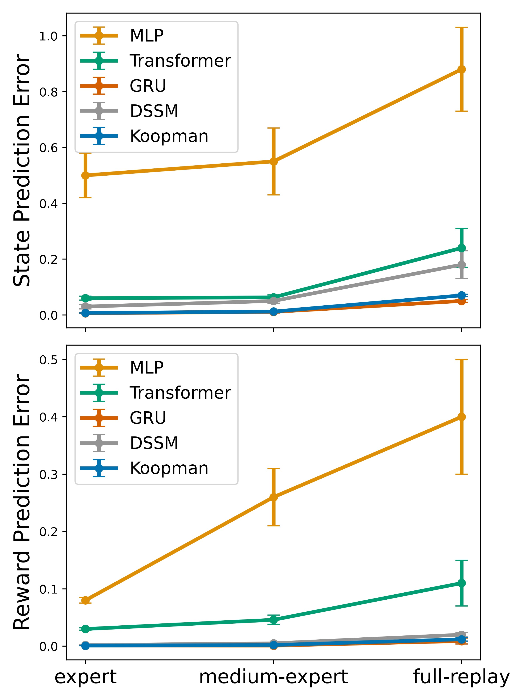
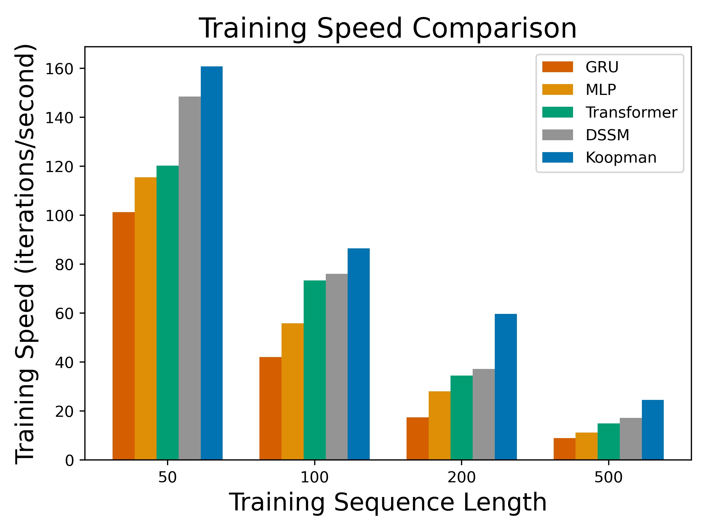
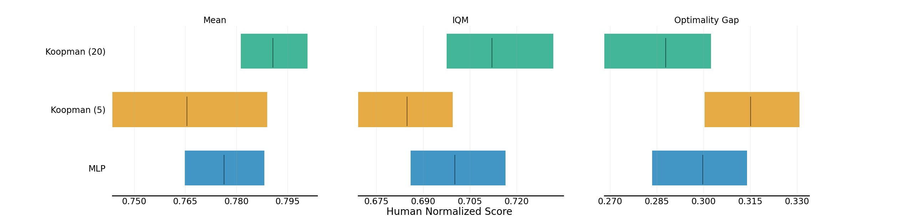
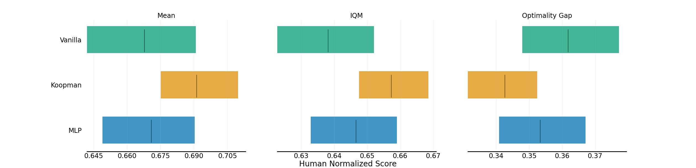

%% mathjax-macros
\E: \mathbb{E}
\Ls: \mathcal{L}
\R: \mathbb{R}
%% end-mathjax-macros

# Efficient Dynamics Modeling in Interactive Environments with Koopman Theory

> **论文信息**
> - 作者：Arnab Kumar Mondal, Siba Smarak Panigrahi, Sai Rajeswar, Kaleem Siddiqi, Siamak Ravanbakhsh
> - 通讯作者：Arnab Kumar Mondal（Mila, McGill University, arnab.mondal@mila.quebec）
> - 投稿方向：ICLR 2024
> - arXiv ID：arXiv-2306.11941v4
> - 代码：无公开代码

---

## 一、核心问题

在交互式环境中进行准确的**长程动态建模（long-range dynamics modeling）**是强化学习的核心挑战。现有方法面临两个主要困难：

1. **误差累积**：模型对动力学的不准确估计会随时间步复合放大，超过几十步后预测完全失效
2. **训练不稳定性**：基于 MLP 的非线性动态模型通过时间反向传播（BPTT）训练时，如果序列过长（>10 步），会出现梯度爆炸或消失。使用 $\tanh$ 缓解梯度爆炸又会导致梯度消失

核心矛盾在于：非线性模型有足够的表达能力但有梯度问题，而高效并行训练（如 Transformer）又放弃了物理上有意义的动力学结构。

---

## 二、核心思路 / 方法

### 2.1 关键洞察：用 Koopman 理论将非线性动力学线性化

Koopman 理论的核心思想：任何非线性动力系统都可以通过提升到**无限维的观测空间**（observables space）转化为线性动力系统。在实践中，用深度神经网络学习一个有限维的近似不变子空间。

对于一个非线性系统 $x_{t+1} = F(x_t)$，存在一个 Koopman 算子 $\mathcal{K}$，作用在观测函数 $g$ 上：
$$(\mathcal{K}g)(x_t) = g(F(x_t)) = g(x_{t+1})$$

在有限维不变子空间上，Koopman 算子退化为 Koopman 矩阵 $K$：
$$g(x_{t+1}) = K g(x_t)$$

如果选择 Koopman 算子的**特征函数**（eigenfunctions）作为观测函数，则 Koopman 矩阵变为对角矩阵：
$$K_D = \mathrm{diag}(\lambda_1, \ldots, \lambda_m), \quad \lambda_i \in \mathbb{C}$$

对角化的好处：
- 矩阵幂运算变为逐元素幂运算：$K^n = \mathrm{diag}(\lambda_1^n, \ldots, \lambda_m^n)$
- 可通过**卷积**并行计算所有未来时间步的预测
- 特征值直接控制梯度行为

### 2.2 带控制的 Koopman 模型

*图1：本文提出的 Koopman 线性动态模型与 MLP 非线性动态模型的对比。MLP 模型需要逐时间步递归展开（BPTT），存在梯度爆炸/消失问题，且无法并行化。而 Koopman 模型的对角化特性使得多步预测可以通过卷积一次性并行完成，训练速度大幅提升，同时梯度行为通过特征值的实部可控。*

采用**状态-控制解耦**的 Koopman 形式：
$$g(x_{t+1}) = K g(x_t) + L f(u_t)$$

其中：
- $g_{\theta}(s_t)$：状态编码器（CNN for 像素输入 / MLP for 状态输入）
- $f_{\phi}(a_t)$：动作编码器
- $K \in \mathbb{C}^{m \times m}$：Koopman 矩阵
- $L \in \mathbb{C}^{m \times l}$：控制矩阵

连续时间形式 $\frac{dx}{dt} = K x(t) + L u(t)$ 的解通过**零阶保持（ZOH）离散化**得到：
$$\bar{K} = \exp(\Delta t K), \quad \bar{L} = K^{-1}(\exp(\Delta t K) - 1)L$$

其中 $\Delta t$ 是可学习的时间步参数。

展开 $\tau$ 步：
$$[\hat{x}_{t+1}, \cdots, \hat{x}_{t+\tau}] = [\bar{K}, \cdots, \bar{K}^\tau] x_t + [c_t, \cdots, c_{t+\tau-1}] \Gamma$$

其中 $\Gamma$ 是上三角矩阵，编码了每个控制输入对所有未来观测的影响。

### 2.3 对角化、效率与梯度稳定性

*图2：Koopman 潜在动态模型的完整架构。动作和初始状态嵌入被编码到复数域（$\mathbb{C}$）的潜在空间中，然后通过 Koopman 动态模块进行前向预测。关键组件包括：(1) 状态编码器 $g_{\theta}$ 将状态映射到复数潜在空间 $x_t$；(2) 动作编码器 $f_{\phi}$ 将动作映射为控制输入 $c_t$；(3) 对角 Koopman 矩阵 $\bar{K} = \mathrm{diag}(\bar{\lambda}_1, \ldots, \bar{\lambda}_m)$ 驱动潜在状态演化；(4) 解码器 $d_{\xi}$ 从潜在状态恢复原始状态 $\hat{s}_{t+k}$。损失函数由潜在空间的 Koopman 一致性损失和状态空间的预测损失两部分组成。*

#### 2.3.1 并行卷积计算

使用对角 Koopman 矩阵 $\bar{K} = \mathrm{diag}(\bar{\lambda}_1, \ldots, \bar{\lambda}_m)$ 后，多步预测简化为：

$$[\hat{x}_{t+1}^i, \ldots, \hat{x}_{t+\tau}^i] = [\bar{\lambda}_i, \ldots, \bar{\lambda}_i^{\tau}] x_t^i + [1, \bar{\lambda}_i, \ldots, \bar{\lambda}_i^{\tau-1}] \circledast [c_t^i, ..., c_{t+\tau-1}^i]$$

其中 $\circledast$ 为循环卷积（zero padding），可通过 **FFT** 高效计算。这一步将原本 $O(\tau m^2)$ 的矩阵乘法降为 $O(\tau m)$ 的逐元素卷积。

#### 2.3.2 梯度定理

**Theorem 1**（梯度定理）：对于对角 Koopman 特征值 $\lambda_j = \mu_j + i\omega_j$，损失 $\mathcal{L}_k$ 在第 $k$ 步对潜在状态 $x_t^j$ 的梯度满足：

$$\left|\frac{\partial\mathcal{L}_k}{\partial x_t^j}\right| = e^{k\Delta t \mu_j} \left|\frac{\partial\mathcal{L}_k}{\partial x_{t+k}^j}\right|$$

对控制输入的梯度类似：
$$\left|\frac{\partial\mathcal{L}_k}{\partial c_{t+l-1}^j}\right| = e^{(k-l)\Delta t \mu_j} \left|\frac{\partial\mathcal{L}_k}{\partial \hat{x}_{t+k}^j}\right|$$

**直观理解**：梯度幅度随特征值实部 $\mu_j$ 指数缩放。$\mu_j > 0$ 导致梯度爆炸，$\mu_j < 0$ 导致梯度消失。这为梯度控制提供了理论工具。

#### 2.3.3 特征值初始化策略

| 初始化方案 | $\mu_j$（实部） | $\omega_j$（虚部） | 效果 |
|------------|-----------------|---------------------|------|
| 纯旋转 | 0 | $j\pi$ | 梯度不衰减/不爆炸，等同于酉矩阵/2D 旋转 |
| 固定衰减 | -0.2 | $j\pi$ | 优先近期时间步，轻微衰减 |
| 可学习范围 | $\in [-0.3, -0.1]$ | $j\pi$ | 自适应调整衰减速率 |

默认选择：$\mu_j = -0.2, \omega_j = j\pi$（经验最优）。

### 2.4 训练损失

两个损失函数的组合：
$$\mathcal{L}_{\text{consistency}} = \sum_{k=1}^{\tau} \|\hat{x}_{t+k} - x_{t+k}\|^2_2 \quad \text{（潜在空间一致性）}$$
$$\mathcal{L}_{\text{state-pred}} = \sum_{k=1}^{\tau} \|d_{\xi}(\hat{x}_{t+k}) - s_{t+k}\|^2_2 \quad \text{（状态空间预测）}$$

---

## 三、实验与结果

### 3.1 长程前向动态建模

*图3：三个 MuJoCo 环境（hopper-v2、walker2d-v2、halfcheetah-v2）上的前向状态和奖励预测误差，预测长度为 100 步。子图 (a) hopper-v2、(b) walker2d-v2、(c) halfcheetah-v2 分别展示了三种策略质量（expert、medium-expert、full replay）下的结果。关键发现：*

- **Koopman vs MLP**：MLP 模型只能训练 10 步（更长会导致梯度爆炸），100 步预测误差极大。Koopman 模型可稳定训练 100 步
- **Koopman vs GRU**：GRU 是最强的基线，Koopman 在大部分设置下与之持平或略优，但训练速度快 2 倍
- **Koopman vs Transformer/DSSM**：Koopman 在长程预测上显著优于 Transformer 和 DSSM
- **hopper 环境**中 Koopman 的优势最大（MLP 误差可达 50 倍以上），体现了动态复杂时线性化的必要性

**实验设置**：D4RL 数据集，1M 样本按 80:20 划分训练/测试。测试时随机采样 50,000 条长度为 100 的轨迹。所有模型保持相同参数量以确保公平对比。

*图4：在 halfcheetah-expert-v2 上使用不同动态模型的状态预测训练速度（迭代/秒，A100 GPU，mini-batch=256）。一个迭代包含一次完整模型梯度更新。Koopman 模型在所有序列长度下均显著快于 MLP、GRU、DSSM 和 Transformer，且优势随序列长度增长而扩大。这是因为对角化的卷积实现复杂度为 $O(\tau m)$，而递归/注意力机制的复杂度为 $O(\tau^2)$ 或更高。*

### 3.2 模型驱动规划（Model-Based Planning）

*图5：Koopman 动态模型（20 步）与 MLP 动态模型（TD-MPC 原版，5 步）在四个 DMControl 环境上的对比。使用 rliable 评估协议（Agarwal et al., 2021），汇报 Mean、IQM（Interquartile Mean）和 Optimality Gap，基于 5 个随机种子。关键发现：*

- **Koopman TD-MPC（20 步）**在 Mean 和 IQM 上均优于 MLP 基线，且 Optimality Gap 更小
- **训练稳定性**：原版 TD-MPC 使用 20 步时训练不稳定、性能退化、方差大（因此改用 5 步）。Koopman 版本可稳定训练 20 步
- 更长的规划视界带来了更好的长期决策能力，这得益于 Koopman 的梯度控制机制

### 3.3 无模型强化学习（Model-Free RL）

*图6：SAC、SPR（MLP 动态模型）和 Koopman-SPR（Koopman 动态模型）在五个 DMC 像素空间环境上的对比。使用 rliable 协议，5 个随机种子。Koopman 模型使用 5 步预测视界。关键发现：*

- **Koopman-SPR 在 Mean 和 IQM 上优于** MLP-based SPR 和纯 SAC
- MLP-based SPR 在某些困难任务上（如 Finger Spin、Walker Walk）甚至不如 SAC，而 Koopman-SPR 稳定提升
- Koopman 动态模型作为辅助自监督任务能学到更好的表征，且训练更稳定

---

## 四、关键洞察与技术亮点

1. **对角线化是核心引擎**：将对角 Koopman 矩阵 + 卷积并行化的组合，将序列预测从 $O(\tau m^2)$ 降为 $O(\tau m)$，且可通过 FFT 进一步加速

2. **梯度定理提供理论保证**：特征值实部直接控制梯度行为——这是对现有梯度稳定化技术（酉矩阵、状态空间模型的 HiPPO 初始化）的统一视角

3. **与 DSSM 的本质区别**：DSSM 是非线性模型用于序列建模，而 Koopman 模型是线性潜在动态模型。Koopman 的非线性全部封装在编码器/解码器中，潜在空间本身保持线性

4. **控制注入的简洁处理**：状态-控制解耦 + 可学习 ZOH 离散化，使模型既保留了 Koopman 理论的数学优雅性，又适用于实际 RL 场景

5. **即插即用**：Koopman 动态模型可直接替换 TD-MPC 中的 MLP-based TOLD 或 SPR 中的 MLP 动态模型，无需修改其余算法组件

---

## 五、局限性

1. **仅支持确定性环境**：当前模型假设动力学是确定性的，未建模随机性。未来可结合随机 Koopman 理论（观测函数变为随机变量）扩展

2. **RL/Planning 提升有限**：状态预测任务上优势显著，但 RL 和 Planning 中的提升相对较小。作者推测训练过程中的分布偏移（distribution shift）以及训练/评估目标不一致削弱了 Koopman 的优势

3. **任务覆盖不足**：只在有限的 MuJoCo/DMC 环境和离线 RL 数据集上验证，未涉及更复杂的视觉输入或真实机器人场景

4. **未探索 Model-Based RL**：模型仅用于 Planning 和辅助表征学习，未直接用于 full model-based RL

---

## 六、关键概念速查

| 概念 | 含义 |
|------|------|
| **Koopman 算子** $\mathcal{K}$ | 将非线性动力学提升到观测函数空间的线性算子 |
| **Koopman 矩阵** $K$ | 有限维不变子空间上的 Koopman 算子近似，$g(x_{t+1}) = Kg(x_t)$ |
| **对角 Koopman 矩阵** $K_D$ | 选择特征函数作为观测函数时得到的对角矩阵，$\mathrm{diag}(\lambda_1, \ldots, \lambda_m)$ |
| **观测函数** $g$ | 从状态空间映射到 Koopman 观测空间的函数（神经网络实现） |
| **特征值** $\lambda_j = \mu_j + i\omega_j$ | 实部 $\mu_j$ 控制梯度衰减/增长，虚部 $\omega_j$ 捕获不同频率模式 |
| **ZOH 离散化** | 零阶保持离散化，将连续时间方程转为离散形式 |
| **Vandermonde 矩阵** $\Lambda$ | $\Lambda_{i,j} = \bar{\lambda}_i^j$，用于高效计算多步预测 |
| **循环卷积** $\circledast$ | 实现控制输入对未来所有时间步的影响传播，可通过 FFT 加速 |
| **Koopman 一致性损失** | 在潜在空间中确保预测的潜变量与编码器输出的真实潜变量一致 |
| **TD-MPC** | Task-Oriented Latent Dynamics + Model Predictive Control，模型驱动规划的基线方法 |
| **SPR** | Self-Predictive Representations，使用动态建模作为辅助任务的无模型 RL 方法 |
