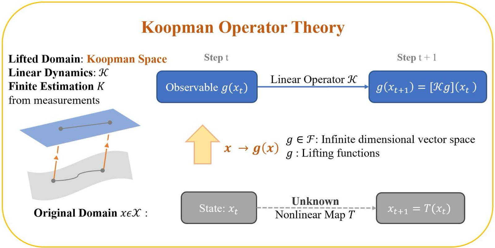
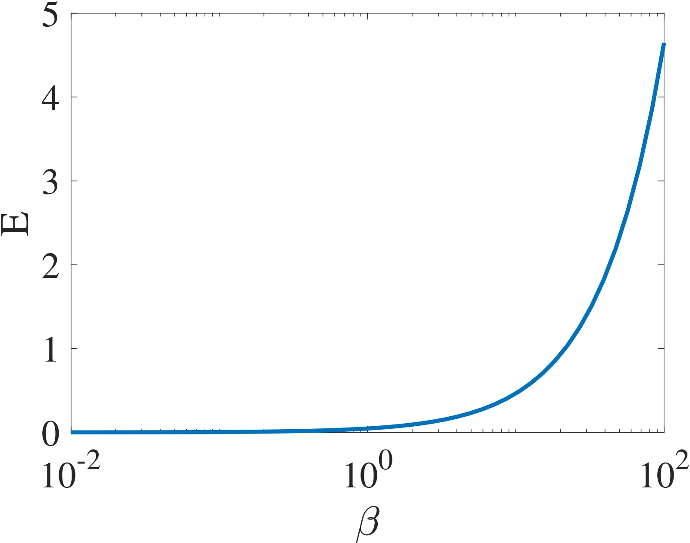
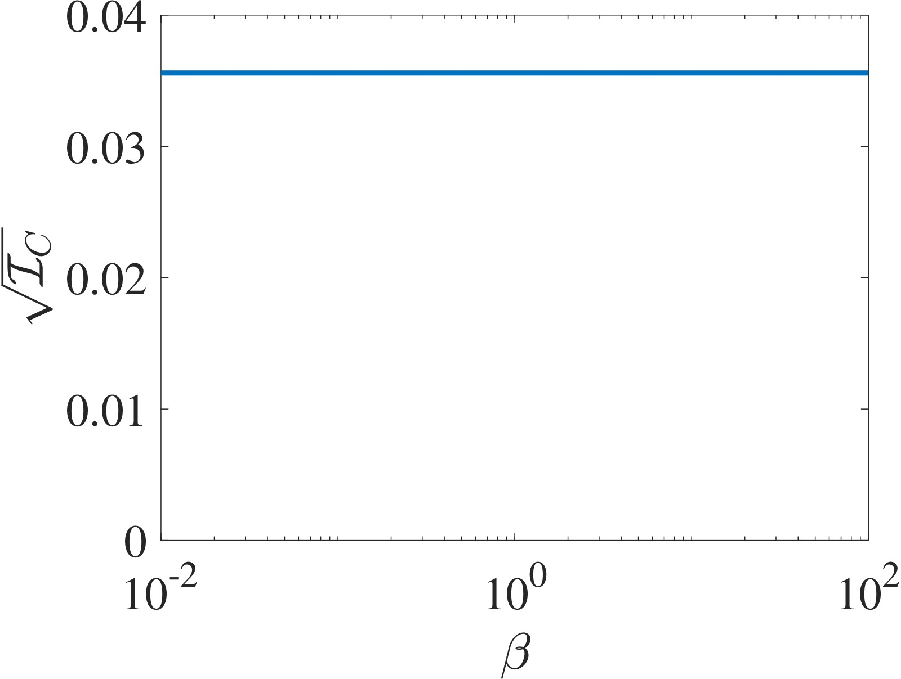
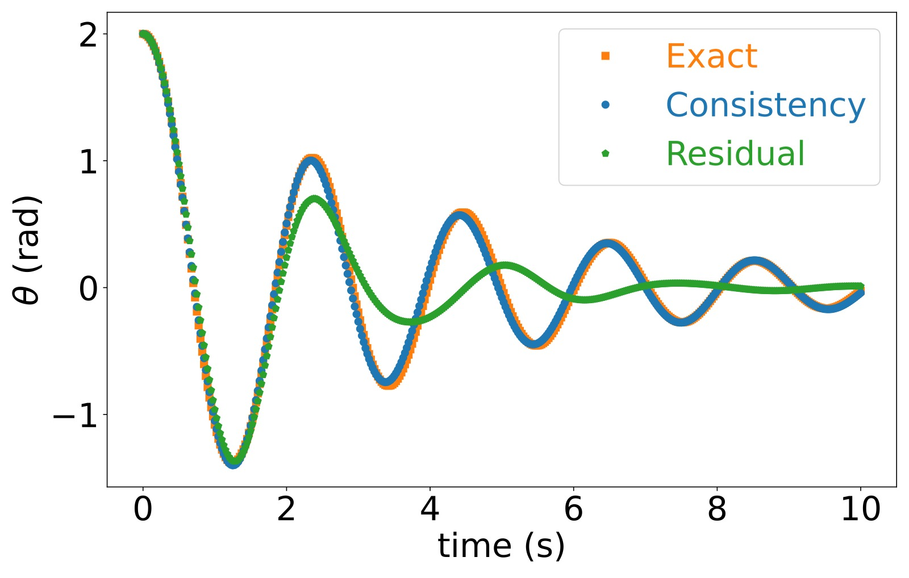
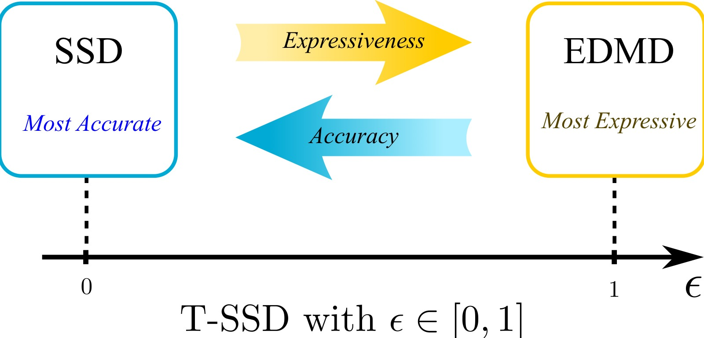
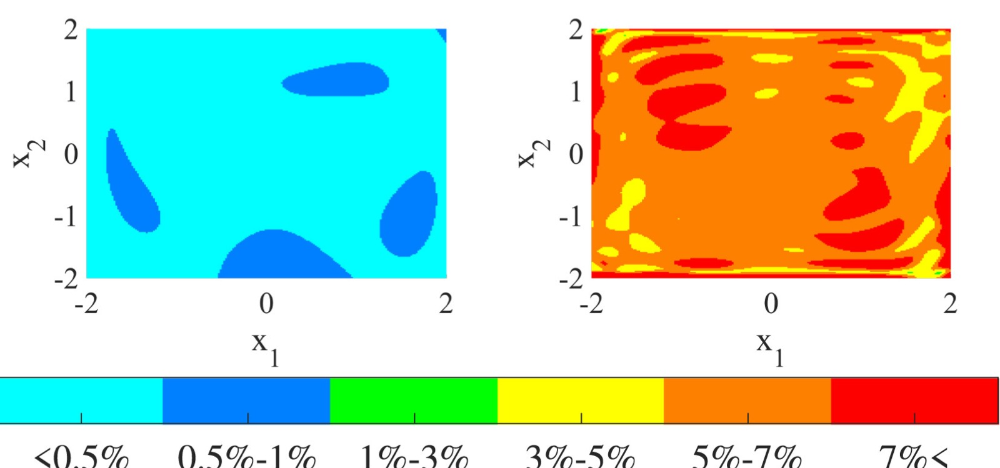

%% mathjax-macros
Psib: \mathbf{\Psi}
Kc: \mathcal{K}
Fc: \mathcal{F}
Xc: \mathcal{X}
Uc: \mathcal{U}
Hc: \mathcal{H}
Pc: \mathcal{P}
Sc: \mathcal{S}
Kedmd: K_{\operatorname{EDMD}}
Span: \operatorname{span}
real: \mathbb{R}
cplx: \mathbb{C}
realplus: \mathbb{R}_{\geq 0}
restr: \!\restriction
Pf: \mathfrak{P}
%% end-mathjax-macros

# Koopman Operators in Robot Learning

> **论文信息**
> - 作者：Lu Shi (UC Riverside & Tsinghua), Masih Haseli (UCSD), Giorgos Mamakoukas (Zoox), Daniel Bruder (UMich), Ian Abraham (Yale), Todd Murphey (Northwestern), Jorge Cortés (UCSD), Konstantinos Karydis (UC Riverside)
> - 通讯作者：Konstantinos Karydis (UC Riverside)
> - 投稿方向：IEEE Transactions on Robotics (综述论文)
> - arXiv ID：arXiv-2408.04200v2
> - 代码：配套教程代码 https://shorturl.at/ouE59，Koopman 库 https://github.com/DecBayComp/PyKoopman

---

## 一、核心问题

机器人运行时的实时学习（runtime learning）是一个开放挑战。现有方法（Neural ODE、深度强化学习、生成式 AI）高度依赖离线大规模数据，但真实部署环境往往具有三个特征：

1. **新颖性（Novel）**：环境包含未在离线数据中出现的现象
2. **不可模拟性（Unsimulable）**：物理交互（软体、湍流、触觉等）无法用第一性原理有效仿真
3. **未知性（Unknown）**：参数和边界条件不可知（如人机交互中人的意图）

Koopman 算子理论为这一问题提供了**部分答案**——它仅需少量数据即可在运行时建立非线性系统的全局线性表示，使机器人能够在线学习并适应。

> 核心问题：**如果机器人需要在没有大量离线数据的新颖环境中运行，什么样的工具适合仅使用"小数据"进行运行时学习？**

---

## 二、Koopman 算子理论基础

### 2.1 核心思想

Koopman 在 1931 年证明：任何非线性动力系统都可以表示为一个作用在 Hilbert 空间上的**无限维线性算子**。

对于离散时间系统：

$$x_{t+1} = T(x_t)$$

定义观测函数（observable）$g \in \Fc$，Koopman 算子 $\Kc: \Fc \to \Fc$ 满足：

$$\Kc g = g \circ T$$

这意味着：

$$\Kc g(x_t) = g(T(x_t)) = g(x_{t+1})$$



*图1：Koopman 算子理论的概念图示。原始状态空间 $x_t \in \Xc$ 中的非线性动力学由未知映射 $T$ 支配，通过观测函数 $g(x)$ 提升（lift）到更高维的 Koopman 空间。在提升空间中，系统的演化变为线性，由 Koopman 算子 $\Kc$ 控制：$g(x_{t+1}) = [\Kc g](x_t)$。图中展示了两种传播路径——底部路径直接用 $T$ 计算 $T(x)$ 并观察结果状态，顶部路径先将状态通过观测函数映射到 Koopman 空间、用 $\Kc$ 传播、再在 $x$ 处求值。虽然 $T$ 和 $\Kc$ 作用在不同空间上，但它们编码了完全相同的动力学信息。这种"等价替换"的意义在于：(1) 为非线性系统提供了全局线性表示，使线性系统理论（LQR、MPC）可直接应用；(2) 可通过实时数据估计线性算子，无需大量数据做非线性回归。*

### 2.2 有限维逼近

实践中需要有限维表示。设 $\Sc \subset \Fc$ 是 Koopman 不变子空间，$\Psib$ 是 $\Sc$ 的一组基，则存在矩阵 $K$ 使得：

$$\Kc \Psib = \Psib \circ T = K \Psib$$

进而得到**提升线性系统**：

$$\Psib(x_{t+1}) = K \Psib(x_t)$$

令 $z_t := \Psib(x_t)$，即得到标准线性形式 $z_{t+1} = K z_t$。

### 2.3 关键符号表

| 符号 | 含义 |
|------|------|
| $x$ | 系统状态 |
| $u$ | 控制输入 |
| $T$ | 原始非线性传播规则 |
| $g$ | 观测函数 |
| $\Kc$ | 离散时间 Koopman 算子 |
| $K$ | 有限维近似 Koopman 矩阵 |
| $\Psib$ | 向量值观测函数（lifting functions） |
| $\phi$ | Koopman 本征函数 |
| $\lambda_{\phi}$ | Koopman 本征值 |
| $N$ | 字典维度 / 估计的 Koopman 算子大小 |

---

## 三、数据驱动的 Koopman 算子估计

### 3.1 EDMD（Extended Dynamic Mode Decomposition）

EDMD 是最广泛使用的 Koopman 算子近似方法。给定数据矩阵 $X = [x_1, \ldots, x_M]$ 和 $Y = [y_1, \ldots, y_M]$（其中 $y_i = T(x_i)$），最小化 Frobenius 范数：

$$\min_K \| \Psib(Y) - K \Psib(X) \|_F$$

闭式解：

$$\Kedmd = \Psib(Y) \Psib(X)^\dagger$$

**关键理解**：$\Kedmd$ 并不直接捕获 Koopman 算子本身，而是编码了算子作用在 $\Span(\Psib)$ 上的投影：

$$\Pc_{\Span(\Psib)} \Kc$$

即 EDMD 近似的是投影后的 Koopman 算子。这一联系带来了重要的收敛性质——当字典维度增长时，EDMD 矩阵在算子拓扑下收敛到 Koopman 算子，且能捕获 Koopman 本征值。

**重要警告**：更大字典不一定更好。例如系统 $x^+ = 0.5x$，字典 $\Psib_1(x) = x$（精确）vs $\Psib_2(x) = [x, \sin(x)]$（有误差）。因此实际应用中必须设计/学习合适的字典以达到合理的精度。

### 3.2 HVOK（Hankel View of Koopman）

HVOK 是另一种有效方法，特别适用于软体机器人等具有丰富时序动力学的系统。不同于 EDMD 显式选择基函数，HVOK 通过**时间延迟嵌入**构造 Hankel 矩阵来隐式捕获动力学：

$$H_X = \begin{bmatrix}
x_1 & \cdots & x_{m-d} \\
x_2 & \cdots & x_{m-d+1} \\
\vdots & \ddots & \vdots \\
x_d & \cdots & x_{m-1}
\end{bmatrix}$$

然后求 $K_{\text{HVOK}}$ 使 $H_Y \approx K_{\text{HVOK}} H_X$。其直觉是：通过多步时间延迟将时序动力学嵌入高维空间，无需显式选择基函数。

### 3.3 DMD（Dynamic Mode Decomposition）

DMD 是 EDMD 的特殊情况——字典为恒等映射（无 lifting）。虽出现更早，但可视为 EDMD 的一个实例。

---

## 四、处理带输入的系统

机器人系统本质上是非自治的（有控制输入），需要将 Koopman 框架扩展到带输入系统。论文梳理了三种实用方法和两种严格理论框架。

### 4.1 三种实用近似方法

1. **联合提升（Joint Lifting）**：将 $u$ 视为扩展状态的一部分，定义 $g(x, u)$。简单直观，但假设已知未来输入，泛化性受限。

2. **仿射输入形式（Affine Input Form）**：
   $$g(x_{t+1}) \approx K g(x_t) + B u_t$$
   最广泛使用的方法，保留线性结构，天然兼容 LQR/MPC。注意：这是 input-state separable model 的特例。

3. **控制一致 Koopman 算子（Control-Coherent）**：寻找在不同控制输入下保持一致的嵌入空间，对操作任务和欠驱动系统特别有用。

### 4.2 两种严格理论框架

1. **无限输入序列方法**：考虑所有可能的无限输入序列空间，定义扩展状态 $(x, u_s)$ 上的 Koopman 算子。理论严格但难以找到通用有限维模型。实践中退化为线性预测器 $z^+ \approx A z + B u$。

2. **Koopman 控制族（Koopman Control Family）**：考虑所有常值输入下的子系统族 $\{T_{\hat{u}}\}_{\hat{u} \in \Uc}$，每个子系统有自己的 Koopman 算子 $\Kc_{\hat{u}}$。在公共不变子空间上导出 **input-state separable model**：
   $$\Psib(x^+) = \Ac(u) \Psib(x)$$
   即对提升状态是线性的，对输入是非线性的——这本质反映了开环系统中输入不受动力学规则约束的事实。

---

## 五、Koopman 在机器人中的三大应用


*图2：Koopman 算子理论在机器人中的效用与集成总览。该图综合展示了 Koopman 方法如何贯穿机器人研究的核心基础——建模、控制与估计、运动规划三大支柱。图中强调了 Koopman 算子的三个关键优势如何支持这些应用：(1) 可解释性（Interpretability）——基于代数与几何原理的系统模型描述，而非黑箱神经网络；(2) 数据效率（Data-efficiency）——仅需有限测量即可实时实施；(3) 线性表示（Linear Representation）——可使用 LQR、MPC、Kalman 滤波等成熟的线性系统工具。图中还展示了从状态空间到提升空间的映射，以及 Koopman 模型如何为下游任务（控制综合、状态估计、轨迹优化）提供统一的基础。*

### 5.1 数据收集

- **随机采样**：在操作范围内随机选择初始条件和输入（软体机器人常用，因安全性高）
- **迭代精炼**：基准控制器（可能开环、朴素）产生的数据迭代改进模型（更安全）
- **主动学习**：显式优化信息价值，通过 Fisher 信息矩阵最大化数据效率

### 5.2 提升函数选择

| 方法 | 描述 | 适用场景 |
|------|------|----------|
| **人工选择** | 基于领域知识或试错（多项式、Hermite、RBF 等） | 轮式机器人等较简单系统 |
| **物理启发** | 利用运动学约束、自由度、几何构型空间 | 有物理先验的系统 |
| **神经网络学习** | Deep Koopman / Autoencoder-Koopman 框架 | 操作、腿足等高度复杂非线性系统 |

论文总结了不同机器人平台的倾向（见 Table 1）：
- **操作/腿足**：NN-based 主导（动力学高度非线性和复杂）
- **轮式**：人工选择为主（动力学较简单）
- **空中/软体**：三种方法均有探索，HVOK 因能捕获环境扰动/慢响应特性而广受青睐

### 5.3 基于模型的控制

#### Koopman MPC

核心公式（线性 Koopman 模型）：

$$\min_{\{z_i\},\{u_i\}} \sum_{i=0}^{N_h} z_i^\top G_i z_i + u_i^\top H_i u_i \quad \text{s.t.} \quad z_{i+1} = K z_i + B u_i,\; z_0 = \Psib(x_t)$$

- 线性 Koopman 模型使优化问题成为**凸二次规划（QP）**——有唯一全局最优解，可高效求解
- 非线性/双线性 Koopman 模型精度更高但失去凸性，需权衡
- 双线性 Koopman 模型是折中方案，兼具两者优势

#### 主动学习控制

Koopman 算子升维为线性的结构带来了独特的主动学习优势：
- Fisher 信息矩阵有闭式表达，可直接优化控制器以最大化信息增益
- 优化问题 $\min \sum \mathfrak{I}(z_i, {}^t K) + u_i^\top R u_i$ 在滚动时域中求解
- 结果：仅用少量数据点即可获得有效的 Koopman 模型
- 相比深度神经网络，Koopman 线性模型在数据效率和主动学习控制方面仍具显著优势

### 5.4 状态估计

三个方向：
1. **鲁棒估计**：利用提升空间的线性表示，通过 $\mathcal{H}_2/\mathcal{H}_\infty$ 鲁棒控制技术设计稳定观测器
2. **扰动估计与抑制**：EVOLVER 框架利用 Koopman 潜在结构建模实现快速瞬态反应和高精度稳态估计
3. **高效推断**：Koopman Kalman Filter、KoopSE、K-ESKF 等方法将非线性系统转化为线性/双线性系统后应用标准线性估计技术

### 5.5 运动规划与定位

- **SLAM**：Koopman 线性化将批量 SLAM 问题转化为双线性约束优化
- **地形导航**：利用 Koopman 对偶算子将导航问题升维到密度空间，使问题变为凸优化
- **不确定性感知规划**：基于 Koopman 框架计算期望值和机会约束，实现概率碰撞避免

---

## 六、各大机器人平台的 Koopman 应用

### 6.1 机器人操作

三个主要方向：
- **建模与预测控制**：Koopman 线性化模型 + GPC/MPC，用于机器人手臂控制
- **模仿/强化学习**：Koopman 提升编码人类示教轨迹以塑造奖励函数；仅从观测数据学习紧凑潜在表示，大幅减少动作标注数据需求
- **灵巧操作**：KOROL 框架提取视觉特征并用 Koopman rollout 预测未来轨迹；首次将 Koopman 应用于灵巧手操作，联合建模手-物耦合动力学

### 6.2 地面机器人

- **轮式**：Koopman MPC 已成功部署于复杂地形导航；虚拟控制输入处理旋转/坐标变换
- **腿足**：处于早期阶段（多在仿真），但发展迅速——全局线性化处理混合动力学（接触切换、欠驱动），增量学习解决领域漂移
- **自动驾驶**：Koopman 估计车辆模型 + MPC 控制；双线性模型 + 深度 NN 组合；注意力框架嵌入随机 Koopman 算子用于异常行为检测

### 6.3 软体机器人

最活跃的应用领域之一（近两年研究激增）：
- 软体机器人的物理安全性允许大量丰富数据采集
- 多种提升函数：多项式基函数、时间延迟嵌入（HVOK 特别流行）、NN-based
- 控制策略以 MPC 和 LQR 为主
- 最新应用：Koopman 模型作为 RL 策略训练的替代环境

### 6.4 空中机器人

解决气动效应（风扰、地面效应）等难以建模的交互：
- Episodic Learning：迭代学习 Koopman 本征函数对，在线改善控制信号
- 联合学习函数字典 + 双线性 Koopman 模型实现低空轨迹跟踪
- 层次结构：外层 Koopman 自适应控制器精调内层预调控制器的参考信号

### 6.5 其他平台

- **水下**：Koopman 线性化流体动力学交互，集成到基于模型的控制器
- **挖掘**：铲斗-土壤非线性交互的 Koopman 线性近似
- **康复/辅助**：Koopman 将混合动力学（接触/非接触模式切换）统一为全局线性模型
- **多智能体**：编队控制（在线/离线 Koopman 扰动估计）、信号恢复、群体行为建模


---

## 七、高级理论专题

### 7.1 连续时间 Koopman 算子

连续时间系统 $\dot{x} = G(x)$ 通过流映射 $\Gc^t$ 定义 Koopman 算子族 $\{\Kc^t\}_{t \in \realplus}$：

$$\Kc^t f = f \circ \Gc^t$$

若算子族是强连续半群，可定义 Koopman 生成元（generator）：

$$\Lc_{G} f := \lim_{t \searrow 0} \frac{\Kc^t f - f}{t} = G \cdot \nabla f$$

### 7.2 提升函数构造的严格方法

#### Consistency Index（一致性指标）

EDMD 残差最小化不保证找到接近不变子空间的字典。一致性指标解决了这个问题：

$$\ic(\Psib,X,Y) := \lambda_{\max}(I - K_F K_B)$$

其中 $K_F = \Psib(Y)\Psib(X)^\dagger$ 和 $K_B = \Psib(X)\Psib(Y)^\dagger$ 分别是正向和反向 EDMD 矩阵。

  

*图4（左）和图5（右）：对比 EDMD 残差误差和一致性指标。左图展示线性系统 $x^+ = 0.6x$ 在不同字典族 $D_{\beta}(x) = [x, x + \beta \sin(x)]$ 下的 EDMD 残差误差——注意虽然所有 $\beta \neq 0$ 的字典都张成相同的子空间 $\Sc = \Span\{x, \sin(x)\}$，但残差误差随基的选择不同而变化很大，甚至可以任意接近零（尽管 $\Sc$ 不是 Koopman 不变的）。右图展示一致性指标的平方根——与 EDMD 残差不同，一致性指标仅依赖于子空间本身而非具体基的选择，准确度量了子空间的逼近质量。这一性质使得一致性指标成为字典学习的更可靠目标函数。*

**关键性质**：
- $\ic \in [0,1]$，$\ic = 0$ 当且仅当子空间是 Koopman 不变的
- 仅依赖于子空间，与基的选择无关
- 提供 EDMD 在整个子空间上相对预测误差的**紧上界**：
  $$\sqrt{\ic} = \max_{f \in \Span(\Psib)} \frac{\|\Kc f - \Pf_{\Kc f}\|}{\|\Kc f\|}$$

最小化一致性指标等价于鲁棒 minimax 问题——优化整个函数空间（不可数无穷多函数）上的最大预测误差，而非仅优化有限个函数。



*图6：非线性摆 $[\dot{\theta}, \dot{\omega}] = [\omega, -9.81\sin(\theta) - 0.1\omega]$ 的长期预测对比。字典由 5 个函数组成 $[\theta, \omega, \text{NN}_1, \text{NN}_2, \text{NN}_3]$，其中 NN 为前馈神经网络。对比两种子空间学习策略：(1) 最小化一致性指标（等价于鲁棒优化），(2) 最小化 EDMD 残差。结果显示一致性指标学到的子空间在长期预测上显著优于最小化残差误差的方法——这是因为一致性指标考虑了空间内所有函数（不可数无穷多），而 EDMD 残差仅考虑有限个函数。直观理解：当子空间非不变时，某些函数方向上的预测误差可能很大，EDMD 残差可以通过选择特定基来"隐藏"这些方向，而一致性指标必然暴露它们。*

#### SSD 与 T-SSD 算法

**SSD（Symmetric Subspace Decomposition）**：代数算法，在任意有限维函数空间（搜索空间）中找到**最大** Koopman 不变子空间。基于正向和反向 EDMD 矩阵的本征分解，在给定搜索空间中提供几乎必然的完全条件来识别所有 Koopman 本征函数。

**T-SSD（Tunable SSD）**：可调精度的代数搜索算法，通过参数 $\epsilon \in [0,1]$ 平衡模型精度和表达能力。核心思想是将严格不变性条件 $\range(\Psib_s(X)^T C) = \range(\Psib_s(Y)^T C)$ 放松为"接近"条件。



*图7：T-SSD 中参数 $\epsilon$ 的作用——在模型精度和表达能力之间设置平衡。$\epsilon = 0$ 时 T-SSD 等价于 SSD，找到最大 Koopman 不变子空间，实现（几乎必然）精确预测；$\epsilon = 1$ 时 T-SSD 等价于在整个搜索空间上应用 EDMD，允许最大 100% 的预测误差以换取更高维度的表示。T-SSD 可视为 EDMD 和 SSD 的统一框架：通过调节 $\epsilon$，用户可以根据任务需求在"精确但不完整"和"近似但更全面"之间做出选择。*



*图8：Duffing 系统 $[\dot{x}_1, \dot{x}_2] = [x_2, -0.5x_2 + x_1(1-x_1)^2]$ 在状态空间 $[-2,2]^2$ 上的结果。搜索空间包含所有最高 10 次多项式。右图展示归一化基下搜索空间的相对 EDMD 字典预测误差（每个基函数方向上的误差用颜色编码），左图展示 T-SSD 以 $\epsilon = 0.02$ 识别出的子空间的预测误差。T-SSD 识别的子空间在几乎所有方向上都有显著更低的预测误差，验证了代数搜索相比在整个搜索空间上直接应用 EDMD 的优势——T-SSD 能自动剔除那些会导致大误差的函数方向，保留能够被准确预测的方向。*

---

## 八、核心洞察与技术亮点

1. **"小数据"的线性力量**：Koopman 算子的线性结构使得仅需闭式最小二乘解即可估计全局动力学，无需大量数据和梯度优化。这在机器人需要在运行时学习的场景中至关重要。

2. **解释性和可认证性的统一**：与黑箱神经网络不同，Koopman 模型保留了与原始系统的几何和代数联系——可利用谱性质分析稳定性、导出控制 Lyapunov 函数、直接计算信息度量。

3. **控制兼容性**：线性提升表示天然兼容 LQR、MPC、Kalman 滤波等成熟工具。凸 QP 形式保证实时求解的可行性。

4. **Input-State Separable Model** 是统一理论框架：广泛使用的线性、双线性、线性切换模型都是其特例。这为理解不同方法的误差来源和选择提供了理论基础。

5. **一致性指标创新**：揭示了 EDMD 残差最小化的根本缺陷（依赖基的选择），提供了仅依赖于子空间的质量度量，将字典学习重新表述为鲁棒 minimax 优化。

6. **T-SSD 的连续谱**：在 SSD（精确不变性）和 EDMD（最大逼近）之间建立了可调的连续谱，使实践者能根据具体任务选择精度-维度的权衡点。

---

## 九、开放挑战与未来方向

| 挑战 | 描述 |
|------|------|
| **约束在 Koopman 空间的表达** | 如何将不同类型的原始空间约束恰当地提升到 Koopman 空间 |
| **随机仿真与信念空间规划** | 处理多模态分布，生成不确定性下的鲁棒规划 |
| **采样率选择** | 最优采样率直接影响在线学习中的算子质量和预测误差界 |
| **灵巧操作扩展** | Koopman 的全局线性表示适合处理接触动力学的非连续性，但研究仍处于早期 |
| **软体机器人深化** | 高维提升的计算代价与降维带来的偏差之间需要更好的权衡 |
| **混合系统扩展** | 对同时具有连续流和离散跳变的系统，现有理论还不足以统一处理 |
| **提升特征的不确定性** | 零均值高斯假设在非线性提升后不一定成立，需要研究统计结构的保持条件 |
| **优化问题的递归可行性** | 代价函数通常依赖提升状态，如何设计跨系统泛化的代价函数 |

---

## 十、模型架构与推理流程

### 10.1 Koopman 机器人建模 pipeline

```
┌──────────────────────────────────────────────────────────────┐
│              Koopman 机器人建模与控制 Pipeline                  │
├──────────────────────────────────────────────────────────────┤
│                                                               │
│  第1步：数据收集                                               │
│  ┌──────────────────────────────────────────────────┐        │
│  │ 随机采样 / 迭代精炼 / 主动学习                      │        │
│  │ (x₁, u₁) → x₂, (x₂, u₂) → x₃, ...               │        │
│  └───────────────────────┬──────────────────────────┘        │
│                          │                                    │
│                          ▼                                    │
│  第2步：提升函数选择                                           │
│  ┌──────────────────────────────────────────────────┐        │
│  │ 人工选择 / 物理启发 / 神经网络学习 / HVOK          │        │
│  │ Ψ(x) = [ψ₁(x), ψ₂(x), ..., ψ_N(x)]ᵀ            │        │
│  └───────────────────────┬──────────────────────────┘        │
│                          │                                    │
│                          ▼                                    │
│  第3步：Koopman 算子估计                                       │
│  ┌──────────────────────────────────────────────────┐        │
│  │ K = Ψ(Y) Ψ(X)†  (EDMD)                          │        │
│  │ 或 T-SSD / Consistency Index 优化                │        │
│  └───────────────────────┬──────────────────────────┘        │
│                          │                                    │
│                          ▼                                    │
│  第4步：下游应用                                              │
│  ┌──────────────────────────────────────────────────┐        │
│  │ 控制: LQR / MPC / NMPC / 主动学习                 │        │
│  │ 估计: Koopman Kalman Filter / 鲁棒观测器          │        │
│  │ 规划: 凸轨迹优化 / 不确定性感知规划               │        │
│  └──────────────────────────────────────────────────┘        │
│                                                               │
└──────────────────────────────────────────────────────────────┘
```

### 10.2 各类方法的对比

| 维度 | EDMD | HVOK | Deep Koopman | SSD/T-SSD |
|------|------|------|-------------|-----------|
| 基函数 | 显式选择 | 隐式（时间延迟） | 神经网络学习 | 从搜索空间自动发现 |
| 计算代价 | 低 | 中 | 高 | 中 |
| 理论保证 | EDMD 收敛理论 | 无严格保证 | 无严格保证 | 精确不变性/可调精度保证 |
| 适用系统 | 通用 | 时序丰富系统（软体） | 高度非线性系统 | 需要理论保证的场景 |
| 输入处理 | 需扩展 | 需扩展 | 端到端学习 | 支持 input-state separable |

---

## 十一、关键概念速查

| 概念 | 含义 |
|------|------|
| **Koopman 算子** | 作用在观测函数空间上的无限维线性算子，将非线性动力学转化为线性算子作用 |
| **Observable（观测函数）** | 定义在状态空间上的复值函数 $g(x)$，可视为"提升后的状态" |
| **Koopman 本征函数** | $\Kc \phi = \lambda \phi$，沿系统轨迹按线性差分方程演化 |
| **EDMD** | 最常用的 Koopman 算子数据驱动近似方法，通过最小二乘求解 |
| **HVOK** | 通过时间延迟 Hankel 矩阵隐式捕获动力学的替代方法 |
| **Lifting Functions（提升函数）** | 将原始状态映射到高维空间的函数字典 $[\psi_1(x), \ldots, \psi_N(x)]^\top$ |
| **Koopman MPC** | 利用线性 Koopman 模型的凸 MPC 控制器 |
| **输入仿射形式** | $g(x_{t+1}) \approx K g(x_t) + B u_t$，最广泛使用的输入处理方式 |
| **Input-State Separable Model** | $\Psib(x^+) = \Ac(u) \Psib(x)$，统一理论框架 |
| **Koopman 控制族** | 所有常值输入子系统对应的 Koopman 算子族 |
| **Consistency Index** | 仅依赖于子空间质量的度量，$\ic = 0$ 当子空间 Koopman 不变 |
| **SSD** | 在搜索空间中找最大 Koopman 不变子空间的代数算法 |
| **T-SSD** | 可调精度 SSD，通过 $\epsilon$ 参数平衡精度-维度 |
| **Fisher Information Matrix** | 主动学习中用于量化信息增益的核心工具 |
| **Koopman Generator** | 连续时间 Koopman 半群的无穷小生成元 $\Lc_G f = G \cdot \nabla f$ |
| **DMD** | Dynamic Mode Decomposition，EDMD 在恒等字典下的特例 |
| **收敛性** | EDMD 在字典维度和数据量足够大时，在算子拓扑下收敛到 Koopman 算子 |
