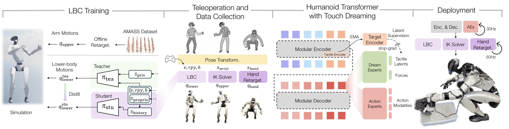
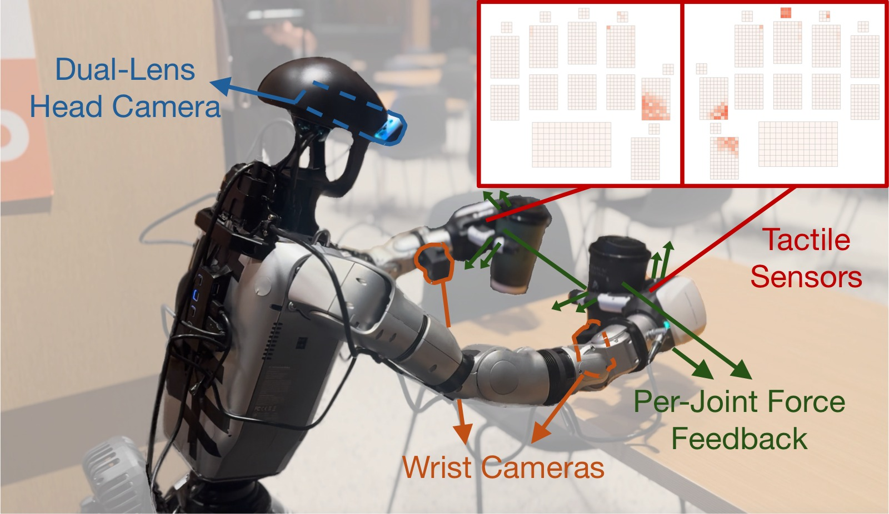
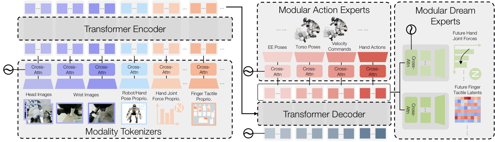
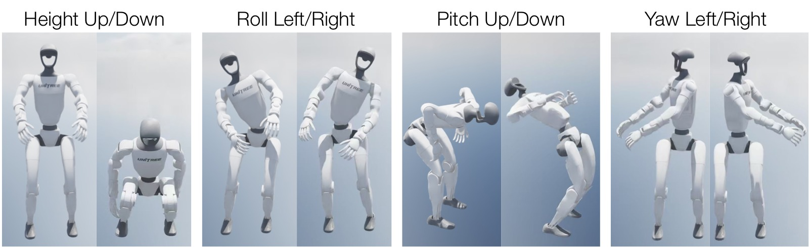
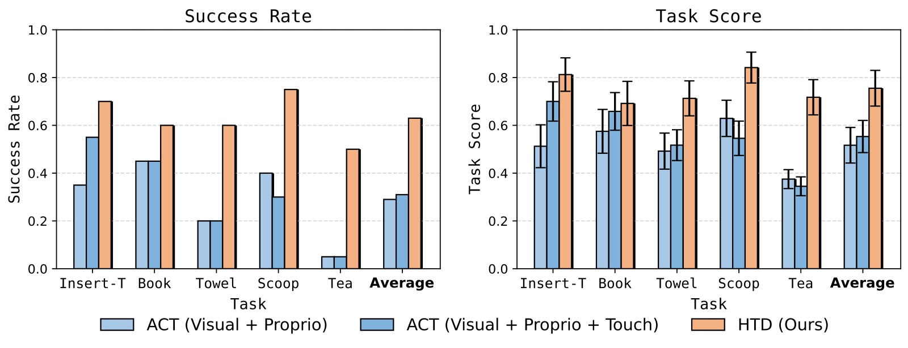
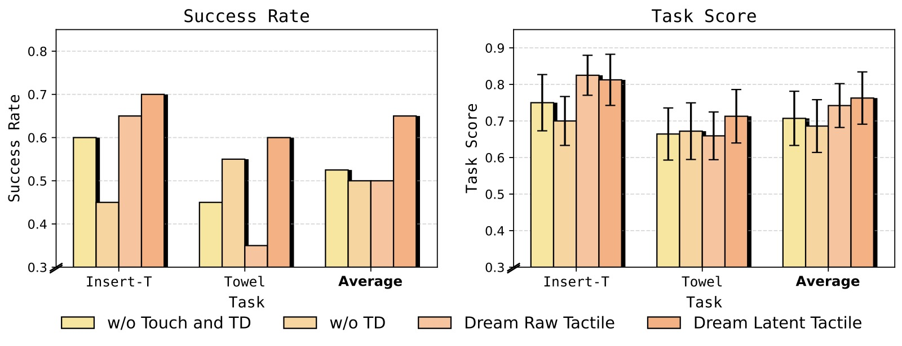
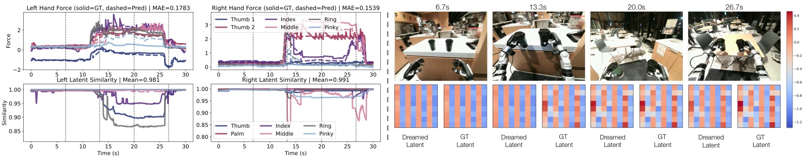
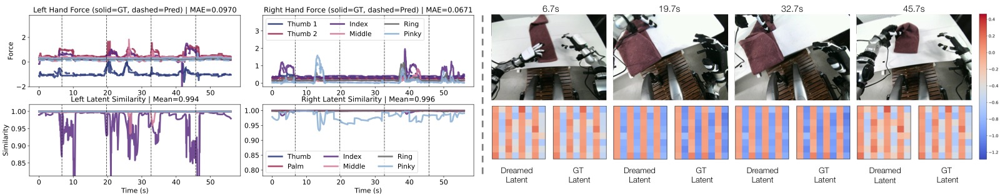

%% mathjax-macros
%% end-mathjax-macros

# Learning Versatile Humanoid Manipulation with Touch Dreaming

> **论文信息**
> - 作者：Yaru Niu, Zhenlong Fang, Binghong Chen, Shuai Zhou, Revanth Krishna Senthilkumaran, Hao Zhang, Bingqing Chen, Chen Qiu, H. Eric Tseng, Jonathan Francis, Ding Zhao
> - 通讯作者：Ding Zhao（Carnegie Mellon University）
> - 投稿方向：IEEE Conference（ICRA/RSS 级别，under review）
> - arXiv ID：arXiv-2604.13015v2
> - 项目页面：https://humanoid-touch-dream.github.io/
> - 代码：未公开

---

## 一、核心问题

人形机器人在真实世界中的**灵巧接触密集型操作**（dexterous, contact-rich loco-manipulation）面临三个核心挑战：

1. **全身运动耦合**：人形机器人的手部操作与躯干姿态、双足支撑、行走稳定性的高度耦合。手-物接触的不确定性可能影响局部操作精度，也可能破坏全身平衡。
2. **系统能力缺失**：现有的人形操作系统鲜有同时支持①稳定全身控制、②完全灵巧手末端执行器、③触觉感知与建模的完整管线（见 Table 1 的系统对比）。
3. **表征学习不足**：纯视觉+本体感知的行为克隆在接触密集任务中表现差，因为接触状态只被部分观测且可能突变。现有触觉学习方法多为手臂-手系统设计，依赖独立预训练、显式世界模型或多阶段推理，未被集成到单阶段全身人形模仿策略中。

> 核心 gap：如何在一个统一的系统中同时解决 **全身稳定性执行** + **灵巧手操控** + **接触感知表征学习** 三个问题。

---

## 二、核心思路 / 方法

### 2.1 系统总览



*图1：系统总览（System Overview）。该图展示了 HTD 系统的四阶段流水线。**左一（LBC Training）**：在仿真中通过 Teacher-Student 框架训练下肢控制器（Lower-Body Controller, LBC），Teacher 使用 PPO+特权信息学习稳健的下肢行为，Student 通过 DAgger 蒸馏为仅依赖本体感知的可部署策略。Teacher 训练时回放来自 AMASS 数据集的 retargeted 手臂运动，以模拟上肢操作对下肢的力和扰动。**左二（Teleoperation）**：操作者通过 VR 头显和手柄传递头部、手腕和手部运动，系统将这些运动映射到统一的机器人参考系，分解为躯干指令（给 LBC）、末端执行器位姿（给 IK 求解器）和手指目标（给 DexPilot 手部重定向），同时通过手柄摇杆提供基座速度指令。**中右（Touch Dreaming）**：HTD 多模态 Transformer 策略处理视觉、触觉和本体感知 token，预测 action chunk，同时通过 touch dreaming head 预测未来手指关节力和未来触觉 latents。触觉 latents 由 EMA 目标编码器（teacher encoder，带 stop-gradient）提供稳定的潜在监督。**右（Deployment）**：策略以 30Hz 输出 action chunk 给 LBC、IK 求解器和手部重定向模块，底层执行器以 50Hz 运行。*

### 2.2 系统硬件与触觉感知



*图2：系统硬件配置（System Setup）。该图展示了人形机器人的完整硬件布局，包括：一个双镜头头部相机（提供立体视觉），两个腕部相机（提供操作视角），以及配备分布式触觉传感器的灵巧手。每只手提供 1062 维触觉观测，分布在 17 个空间感知区域（覆盖手指各段和掌心表面）。内嵌小图可视化了触觉传感器布局及代表性的接触激活模式——当手指与物体发生接触时，相应区域的触觉信号会产生明显的激活热斑。此外，每个手指关节还提供单独的力反馈信号，与触觉传感器形成互补：力反馈反映整体的关节受力，触觉传感器提供局部的接触压力分布。*

### 2.3 下肢控制器（Lower-Body Controller, LBC）

LBC 是整个系统的稳定执行骨干。采用 Teacher-Student 框架在 IsaacLab 大规模并行仿真中训练：

**Teacher Policy**：
$$\pi^{T}(\boldsymbol{s}_{\mathrm{proprio}}, \boldsymbol{s}_{\mathrm{priv}}, \boldsymbol{v}, \boldsymbol{rpy}, h) = \boldsymbol{q}_{\mathrm{lower}}^{T}$$

- 输入：本体感知 $\boldsymbol{s}_{\mathrm{proprio}}$（角速度、重力投影、关节位置/速度、上一步动作）+ 特权信息 $\boldsymbol{s}_{\mathrm{priv}}$（足部接触二值指示器）+ 指令（基座速度 $\boldsymbol{v}$、躯干姿态 $\boldsymbol{rpy}$、高度 $h$）
- 输出：15 维下肢目标关节位置（$2\times6$ 双腿 + 3 腰部电机）
- 使用 PPO 训练，奖励包含跟踪奖励、正则化项、接触/步态项、稳定项和终止惩罚

**Student Policy**：通过 DAgger 蒸馏，仅使用真实世界可获取的观测（含 2 步历史补偿部分可观测性），最小化与 Teacher 输出的 $L_2$ 损失。

训练时回放来自 AMASS 数据集的手臂运动参考以模拟上肢操作扰动，并在命令采样和物理参数上施加 domain randomization 提升 sim-to-real 迁移。

### 2.4 VR 遥操作与数据采集

操作者通过 VR 设备的头部和手腕运动被映射到统一参考系 $\mathcal{F}_u$，分解为：
1. **LBC 指令**：基座速度 $\boldsymbol{v}$（摇杆）、躯干姿态 $(\boldsymbol{rpy}, \boldsymbol{h})$（头部映射）
2. **IK 目标**：末端执行器 6D 位姿 $\boldsymbol{x}_{\mathrm{wrist}}$
3. **手部目标**：DexPilot 重定向 $\boldsymbol{x}_{\mathrm{hand}}$

采集的数据集包含同步的多视角 RGB 图像、机器人和手部本体感知、手指关节力反馈、以及双手分布式触觉读数（每手 1062 维，17 个感知区域）。

### 2.5 HTD：Humanoid Transformer with Touch Dreaming



*图3：HTD 模型架构（Model Architecture）。HTD 是一个模块化的 Encoder-Decoder Transformer。**左（Modality Tokenizers）**：每种模态（多视角图像、本体感知、手指关节力、触觉信号）通过独立的 tokenizer 编码为固定数量的 token。图像使用预训练 ResNet 提取特征（训练时微调），状态类模态使用轻量级 MLP，触觉使用专用的逐指/逐区域 CNN 编码器（详见下文），各自通过交叉注意力聚合层压缩为固定数量的 learnable query token。**中（Transformer Trunk）**：Encoder 融合多模态观测 token 为统一表征，Decoder 产出固定位置的输出 token。这种 Encoder-Decoder 分离使 Encoder 专注于多模态状态理解，Decoder 提供解耦的读出接口。**右上（Modular Action Experts）**：每个动作模态（末端执行器位姿、躯干姿态、速度指令、手部动作）拥有独立的 action expert，通过交叉注意力从 Decoder 输出 token 中读取并预测 action chunk（预测未来 $h$ 步动作）。低维但行为关键的速度指令享有专属 token 容量，避免被高维输出淹没。**右下（Modular Dream Experts）**：Dream experts 预测未来 $\tau$ 步的手指关节力和触觉 latents。触觉 latent 预测在学习的潜在空间中进行（而非原始传感器空间），由 EMA target encoder 提供稳定的监督目标。Dream experts 仅在训练时使用，推理时不执行。*

#### 逐指/逐区域触觉编码器

触觉观测按解剖结构分解为独立的指/区域输入（拇指、食指、中指、无名指、小指、掌心）：
- 常规手指：185 维触觉输入进一步分割为 3 个局部 patch（指尖、指背、掌侧）
- 拇指：210 维输入分割为 4 个 patch（指尖、指背、中段、掌侧）
- 掌心：112 维输入作为单个大 patch

每个 patch 重新排列为 2D 图，通过对应尺寸的专用 CNN 分支处理（小 patch 用单层卷积，大 patch 用两层 CNN），自适应池化到固定分辨率后拼接，经 MLP 融合为紧凑嵌入。同一编码器架构也用于实例化 EMA target encoder。

#### Touch Dreaming

HTD 的核心创新：在行为克隆之上增加辅助的 touch dreaming 目标：

1. **力预测（Force Dreaming）**：预测未来 $\tau$ 步的手指关节力向量，使用 Smooth L1 损失监督
2. **触觉 Latent 预测（Tactile Dreaming）**：预测未来 $\tau$ 步触觉信号的潜在表示，由 EMA target encoder 提供监督

**为什么用 latent space？** 直接回归原始触觉数组（稀疏、高维、噪声大）效果差。在学习的潜在空间中预测可以：
- 提供紧凑且富含语义的学习信号
- 避免重建高维稀疏传感器读数的困难
- EMA teacher 提供缓慢演化、时序一致的潜在目标，防止模态坍塌（mode collapse）

#### 训练目标

$$\mathcal{L}(\Theta) = \underbrace{\sum_{i=1}^{K} \mathcal{L}_{\mathrm{act},\, m_i}(\Theta)}_{\text{behavior cloning}} + \lambda_F \underbrace{\mathcal{L}_{\mathrm{force}}(\Theta)}_{\text{force prediction}} + \lambda_Z \underbrace{\mathcal{L}_{\mathrm{tact}}(\Theta)}_{\text{tactile latent prediction}}$$

其中触觉 latent 预测损失为：

$$\mathcal{L}_{\mathrm{tact}} = \frac{1}{n}\sum_{j=1}^{n}\frac{1}{\tau}\sum_{k=1}^{\tau}\left[(1 - \cos(\hat{\boldsymbol{z}}_{j,k}, \boldsymbol{z}^{\star}_{j,k})) + \beta \cdot \ell_{\delta}(\|\hat{\boldsymbol{z}}_{j,k}\| - \|\boldsymbol{z}^{\star}_{j,k}\|)\right]$$

- 方向项（余弦相似度）：鼓励预测 latent 与 teacher target 对齐方向
- 幅度项：确保预测的范数匹配，防止坍缩到单位范数
- EMA teacher：$\theta^{T} \leftarrow \alpha\theta^{T} + (1-\alpha)\theta$，$\alpha \in (0,1)$，梯度停止

---

## 三、实验与结果

### 3.1 实验设置

- **硬件**：人形机器人，配备双镜头头部相机、双腕相机、灵巧手（分布式触觉传感器 + 关节力反馈）
- **任务**：5 个接触密集型任务，涵盖插入、刚体操作、可变形物体操作、工具使用、双臂 loco-manipulation
- **评估**：每任务每方法 20 次真实世界试验（共 100 次/方法）
- **基线**：ACT (Visual + Proprio) 和 ACT (Visual + Proprio + Touch)，均为 decoder-only 变体

#### 五个任务详解

| 任务 | 描述 | 测试的核心能力 |
|------|------|---------------|
| **Insert-T** | 抓取 T 形块（随机位姿），插入固定 T 形底座（**3.5mm 间隙**） | 精密对齐、接触感校正、高空间精度 |
| **Book Organization** | 推书悬出桌边→抓取→放置到书架（两种书变体，随机初始位姿） | 混合推-抓、薄物体操作、位姿重定向 |
| **Towel Folding** | 折叠毛巾（三种初始折叠配置，随机初始位姿） | 多阶段可变形物体操作、长时序 |
| **Cat Litter Scooping** | 蹲下抓取猫砂铲→铲砂→倒入垃圾桶（砂和铲随机位姿） | 工具中介交互、全身可达性、下蹲协调 |
| **Tea Serving** | 走向吧台→抓取两杯茶→走到桌子→放置（杯子随机位姿） | 双臂 loco-manipulation、行走中保持物体稳定 |

### 3.2 LBC 跟踪性能



*图4：LBC 策略在仿真中稳定可控工作空间边界附近的可视化姿态。该图展示了 LBC 在极端指令组合下的姿态样例——蹲下、弯腰、躯干大幅倾斜等。绿色机器人示意稳定可跟踪的姿态，红色示意不稳定/失败状态。LBC 实现了以下稳定命令跟踪范围：基座高度 $h \in [0.33, 0.80]$m、躯干滚转 $\phi \in [-0.38, 0.35]$rad、俯仰 $\theta \in [-0.92, 1.41]$rad、偏航 $\psi \in [-1.50, 1.34]$rad。俯仰范围明显不对称（负向延伸更大），而滚转范围最窄——说明侧向全身平衡是限制最大的方向。*

**跟踪误差对比（Table 2，原文）：**

| 指标 | Ours | AMO | FALCON |
|------|:----:|:---:|:------:|
| $E_v$ (m/s) ↓ | **0.1420** | 0.1779 | 0.1641 |
| $E_\omega$ (rad/s) ↓ | 0.1806 | **0.1540** | 0.1874 |
| $E_h$ (m) ↓ | **0.0280** | 0.0568 | 0.1299 |
| $E_y$ (rad) ↓ | **0.0126** | 0.1540 | 0.1215 |
| $E_p$ (rad) ↓ | **0.0487** | 0.1519 | (未跟踪) |
| $E_r$ (rad) ↓ | **0.0157** | 0.0735 | (未跟踪) |

> 在 4096 个并行环境 × 500 步的评估中，LBC 在 5/6 项指标上最优。AMO 在偏航角速度上略优（$E_\omega$ 低 0.0266 rad/s），因为其设计更偏向纯运动控制。FALCON 不支持 pitch/roll 的独立跟踪。
>
> $E_h$ 和 $E_p$ 的标准差大于均值，主要来自少量困难的指令组合（如同时要求大幅前倾和低身高），策略优先保稳定性而非精确跟踪。

### 3.3 真实世界操作主结果



*图5：真实世界主实验结果（Main Results）。该图以双栏对比柱状图展示三个方法在五个任务上的表现。**左栏（Score Rate，得分率）**：反映任务完成质量，包含部分进度评分（mean ± SEM，20 次试验）。**右栏（Success Rate，成功率）**：严格的任务完成率。五个任务从左到右依次为 Insert-T、Book Organization、Towel Folding、Cat Litter Scooping、Tea Serving。三个方法以不同颜色区分（推测为灰色=ACT Visual+Proprio、蓝色=ACT Visual+Proprio+Touch、绿色=HTD）。核心发现：*

*- **HTD 在所有五个任务的得分率和成功率上均一致超越两个 ACT 基线**。平均而言，HTD 在成功率上比较强的 ACT 变体高出 30.0 个百分点（相对提升 90.9%），在得分率上高出 17.9 个百分点（相对提升 31.1%）。*
*- **简单添加触觉观测到 ACT 并不总带来提升**：ACT (Visual + Proprio + Touch) 仅在部分任务上超越纯视觉 ACT，不是一致改善。*
*- **最大增益出现在对接触感知或全身协调要求最高的任务**：Insert-T（精密对齐+接触校正）、Cat Litter Scooping（工具使用+下蹲协调）、Tea Serving（双臂+行走协调）。Tea Serving 中 ACT 常因成功抓取后无法正确转体而失败，HTD 通过独立的低维速度指令 token 和专属 action expert 有效解决了这一问题。*
*- **Book Organization 增益较小但一致**：因为该任务视觉结构更强、物体位置方差较低。*

### 3.4 消融实验



*图6：消融实验（Ablation Study）。该图以双栏柱状图在 Insert-T 和 Towel Folding 两个任务上对比四个 HTD 变体。**四个变体**：① w/o Touch and TD（无触觉输入+无 dreaming）、② w/o TD（有触觉输入但无 dreaming loss）、③ Dream Raw Tactile（预测原始触觉信号）、④ Dream Latent Tactile（完整方法，预测 EMA teacher 监督的触觉 latents）。核心发现：*

*1. **触觉作为输入并不一致有益**：对比 w/o Touch and TD 与 w/o TD，添加触觉观测（无 dreaming）在 Towel Folding 上有提升，但在 Insert-T 上没有帮助，平均成功率甚至略低。单纯拼接触觉观测不能可靠地转化为更好的操控性能。*
*2. **引入预测性触觉目标优于被动触觉条件**：Dream Raw Tactile 和 Dream Latent Tactile 在 Insert-T、Towel Folding 及平均指标上均超越 w/o TD。显式学习"预测未来接触"比仅使用当前触觉观测提供了更有用的训练信号。*
*3. **Latent Space Dreaming 最优**：Dream Latent Tactile 取得最佳综合表现并一致超越 Dream Raw Tactile，成功率相对提升 **30%**。在学习的潜在空间中监督未来触觉比直接预测原始触觉更有效和稳定：原始空间受稀疏性和噪声支配，latent 空间提供紧凑的接触结构信息。*

### 3.5 Touch Dreaming 可视化



*图7：Touch Dreaming 可视化——Tea Serving 任务（对应右手食指）。该图展示了一个代表性 rollout 上的 dreamed touch 表征。**左上**：左手和右手各指的预测（Pred）vs 真实（GT）手指关节力轨迹及平均绝对误差（MAE）。**左下**：触觉 latent 随时间变化的 L2 相似度（余弦相似度）。**右侧**：同步的右目相机视图与指定手指在各时间戳上的 dreamed vs ground-truth 触觉 latent 热力图（虚线竖线标记对应时间点）。核心观察：(1) 预测力轨迹有效跟踪了接触事件的时序和幅度；(2) latent 相似度在持续接触期间保持高位，在接触状态突变时（对应力尖峰）出现暂时下降——这是合理的，因为 dreamed latent chunk 是开环 rollout，无法预知 chunk 中突然的不连续接触变化；(3) 轻接触或无接触时（如 6.7s），latent 模式保持高度一致的低激活状态；强接触时（如 13.3s、20.0s、26.7s）激活为高强度的区分模式。*



*图8：Touch Dreaming 可视化——Towel Folding 任务（对应左手食指）。与图 7 结构相同。Towel Folding 涉及可变形物体操作，所需施加力小于 Tea Serving（刚性物体）。对比两图：(1) Tea Serving 的 latent 峰值幅度大于 Towel Folding，与施加力的大小正相关；(2) 不同手指经历相似接触状态时（如相似力大小和接触区域），latent 呈现类似的视觉结构模式；(3) dreamed latent 在语义上有意义的接触变化上更稳定，而非直接追随噪声大的原始触觉读数——这验证了 latent space prediction 的价值：学习到的触觉空间在过滤高频噪声的同时保留了接触相关结构。*

---

## 四、关键洞察与技术亮点

1. **Touch Dreaming = 辅助预测目标驱动的接触感知表征学习**：将触觉预测作为辅助 loss（而非单独的世界模型或推理模块）正则化共享 Transformer trunk。这一设计来自 JEPA（Joint-Embedding Predictive Architecture）的思想——在潜在空间中预测未来可产生语义丰富的表征——但首次被引入单阶段全身人形操作策略。

2. **Latent Space > Raw Space for Tactile Prediction**：直接预测原始触觉（高维、稀疏、噪声大）效果差且在训练中易 mode collapse。使用 EMA teacher 提供缓慢更新的潜在目标，配合余弦方向+幅度对齐损失，使 latent space 保持稳定且有判别力。消融实验中 latent vs raw 带来 **30%** 的相对成功率提升。

3. **EMA Teacher 防止模态坍塌**：没有 EMA teacher 的自我蒸馏机制，student tactile tokenizer 和 touch detokenizer 会 mode collapse——所有触觉输入映射到几乎相同的 latent，无论实际接触状态如何。EMA 的缓慢更新提供了时序一致性。

4. **模块化 Encoder-Decoder 设计**：每种模态独立 tokenize（避免跨模态干扰），每种输出模态有专属 action/dream expert（避免低维关键信号被淹没）。速度指令虽然维度低但行为关键——独立 expert 确保其有充分的表征容量。

5. **系统端到端整合**：首次在一个管线中整合了 RL-based 下肢稳定控制 + VR 遥操作 + 触觉感知 + touch modeling。Table 1 中与 11 个现有系统对比，本文是唯一同时支持全灵巧手 + 全身控制 + 触觉感知 + 触觉建模的方案。

6. **LBC 的设计哲学——解耦优于统一**：将稳定性和操作解耦（下肢 RL + 上肢 IK/重定向）而非端到端统一策略，在真实世界中更稳健。这与 FALCON、AMO 等工作的解耦思路一致，但在躯干姿态跟踪精度上显著更优。

---

## 五、代码实现解读（无公开代码）

论文目前未公开代码。以下基于论文的方法论部分梳理 HTD 的架构实现要点：

### 5.1 模型架构 ASCII 图

```
┌──────────────────────────────────────────────────────────────────┐
│                    HTD 完整架构                                   │
├──────────────────────────────────────────────────────────────────┤
│                                                                   │
│  ┌─────────────────────┐    ┌──────────────────────────────────┐ │
│  │   Modality Tokenizers│    │       Transformer Trunk           │ │
│  │                      │    │                                   │ │
│  │  Head Camera ──┐    │    │  ┌─────────────────────────────┐  │ │
│  │  (ResNet)      ├──┐ │    │  │    Transformer Encoder       │  │ │
│  │                │  │ │    │  │  (多模态token融合+上下文)     │  │ │
│  │  Wrist Cam L ──┤  │ │    │  └──────────┬──────────────────┘  │ │
│  │  (ResNet)      │  │ │    │             │                      │ │
│  │                │  │ │    │  ┌──────────▼──────────────────┐  │ │
│  │  Wrist Cam R ──┤  │ │    │  │    Transformer Decoder       │  │ │
│  │  (ResNet)      │  │ │    │  │  (解耦输出token, 各模态固定   │  │ │
│  │                ├──┤ │    │  │   数量的learnable query)      │  │ │
│  │  Proprioception│  │ │    │  └──────────┬──────────────────┘  │ │
│  │  (MLP)         │  │ │    │             │                      │ │
│  │                │  ├─┼────┼─────────────┘                     │ │
│  │  Hand Forces   │  │ │    │                                    │ │
│  │  (MLP)         │  │ │    │                                    │ │
│  │                │  │ │    │                                    │ │
│  │  Tactile ──────┤  │ │    │                                    │ │
│  │  (Per-Finger   │  │ │    │                                    │ │
│  │   CNN + MLP)   │  │ │    │                                    │ │
│  │                │  │ │    │                                    │ │
│  │  各tokenizer   │  │ │    │                                    │ │
│  │  Cross-Attn    │  │ │    │                                    │ │
│  │  聚合 → 固定   │  │ │    │                                    │ │
│  │  数量token     │  │ │    │                                    │ │
│  └─────────────────┘  │    └──────────────────────────────────┘ │
│                        │                                          │
│  ┌─────────────────────┐    ┌──────────────────────────────────┐ │
│  │   Modular Experts    │    │   EMA Teacher (仅训练)            │ │
│  │                      │    │                                   │ │
│  │  Action Experts:     │    │   Tactile EMA Encoder             │ │
│  │  ├ EE Pose (CrossAttn)│   │   θᵀ ← αθᵀ + (1-α)θ              │ │
│  │  ├ Torso Pose        │    │   stop-gradient                   │ │
│  │  ├ Velocity Cmd      │    │   输出: z* (target latents)       │ │
│  │  └ Hand Actions      │    │                                   │ │
│  │                      │    │                                   │ │
│  │  Dream Experts:      │    │                                   │ │
│  │  ├ Force Prediction  │◄───┤ 监督: 未来真实力 (Smooth L1)      │ │
│  │  └ Tactile Latent    │◄───┤ 监督: z* (cos + magnitude loss)  │ │
│  │     Prediction        │    │                                   │ │
│  └─────────────────────┘    └──────────────────────────────────┘ │
│                                                                   │
│  推理时: 仅 Action Experts 输出, Dream Experts 不使用              │
└──────────────────────────────────────────────────────────────────┘
```

### 5.2 训练流程 (Algorithm 1)

```
Algorithm: Imitation Learning with Touch Dreaming
━━━━━━━━━━━━━━━━━━━━━━━━━━━━━━━━━━━━━━━━━━━━━━━━━━━━
Input:  Dataset D = {(o_t, A_t, F_{t:t+τ}, S_{t:t+τ})}
        Action horizon h, Dream horizon τ
        EMA decay α, Loss weights λ_F, λ_Z, β

1.  Init policy π_Θ (tokenizers + trunk + experts)
2.  Init teacher tactile tokenizer θᵀ = θ
3.  For each training step:
    a.  Sample batch B from D
    b.  Compute teacher latents: z* = stopgrad(Tᵀ_tact(s))
    c.  Policy forward: Â, f̂_{1:τ}, ẑ_{1:τ} = π_Θ(o)
    d.  Compute total loss L = L_act + λ_F·L_force + λ_Z·L_tact
    e.  Update student: Θ ← Θ - η∇L
    f.  Update EMA teacher: θᵀ ← αθᵀ + (1-α)θ
4.  Return π_Θ
━━━━━━━━━━━━━━━━━━━━━━━━━━━━━━━━━━━━━━━━━━━━━━━━━━━━
```

### 5.3 推理部署流程

```
时间轴      t₀         t₁         t₂         t₃         ...
━━━━━━━━━━━━━━━━━━━━━━━━━━━━━━━━━━━━━━━━━━━━━━━━━━━━━━━━
策略推理    HTD推理   执行chunk  执行chunk  执行chunk
(30Hz)     产出h步    中的第1步  中的第2步  中的第3步
            action
            chunk
━━━━━━━━━━━━━━━━━━━━━━━━━━━━━━━━━━━━━━━━━━━━━━━━━━━━━━━━
底层执行    LBC追踪     LBC追踪   LBC追踪    LBC追踪
(50Hz)      目标        目标      目标       目标
━━━━━━━━━━━━━━━━━━━━━━━━━━━━━━━━━━━━━━━━━━━━━━━━━━━━━━━━

动作空间: 末端执行器位姿(6D×2) + 躯干姿态(3D) + 速度(2D) + 手部动作
LBC 仅执行下肢/躯干稳定, IK 解算上肢, 手部重定向解算手指
Dream heads 不参与推理
```

### 5.4 关键设计决策

| 设计点 | 选择 | 理由 |
|--------|------|------|
| 触觉预测空间 | Latent（非 raw） | 原始触觉稀疏高维，latent 紧凑且语义丰富 |
| Latent 监督方式 | EMA teacher + cosine+magnitude loss | 防止 mode collapse，方向+幅度双重约束 |
| 模态处理 | 独立 tokenizer + 共享 trunk | 模态特化编码，共享表征避免干扰 |
| 动作解码 | 模块化 action experts | 低维关键输出不被高维输出淹没 |
| 控制架构 | 解耦（LBC+IK+重定向） | 真实世界稳定性优于端到端统一策略 |
| 下肢训练 | Teacher-Student + AMASS 回放 | 特权信息加速训练，手臂回放注入操作扰动 |

---

## 六、局限性

1. **遥操作数据规模有限**：每任务仅 30-50 个演示。更大规模的数据采集可能进一步提升性能。
2. **单机器人验证**：所有实验在单一型号的人形机器人上完成，跨机器人平台的泛化性未经验证。
3. **触觉硬件依赖**：分布式触觉传感器（每手 1062 维）是系统的重要组成部分，传感器成本/可用性可能是部署障碍。
4. **Dream horizon 固定**：当前 τ 固定为超参数，adaptive dream horizon（如仅在接触密集阶段激活 dreaming）可能是更优方案。
5. **无代码开源**：论文提到"more information and open-source materials are available"，但当前无公开代码。这可能限制了复现和后续研究。

---

## 七、关键概念速查

| 概念 | 含义 |
|------|------|
| **HTD** | Humanoid Transformer with Touch Dreaming，多模态 Encoder-Decoder Transformer |
| **Touch Dreaming** | 训练时预测未来手指关节力 + 未来触觉 latents 的辅助目标 |
| **LBC** | Lower-Body Controller，基于 RL 的下肢稳定控制器（Teacher-Student 框架） |
| **EMA Teacher** | 指数移动平均的目标触觉编码器，提供稳定的 latent 监督 |
| **Action Chunk** | 一次推理预测未来 $h$ 步动作目标 |
| **Dream Chunk** | 一次推理预测未来 $\tau$ 步力/触觉 latent |
| **Modality Tokenizer** | 每种模态→固定数量 learnable token（Cross-Attention 聚合） |
| **Per-Finger Tactile Encoder** | 逐指/逐区域的 CNN 触觉编码（3-4 patch/finger） |
| **1062D Tactile** | 每手分布式触觉观测（17 个空间区域） |
| **3.5mm Clearance** | Insert-T 任务中最紧的插入公差 |
| **90.9%** | HTD 相对最强 ACT 基线的平均成功率相对提升 |
| **30.0 pp** | HTD 相对最强 ACT 基线的平均成功率绝对提升 |
| **30%** | Dream Latent Tactile 相对 Dream Raw Tactile 的成功率相对提升 |
