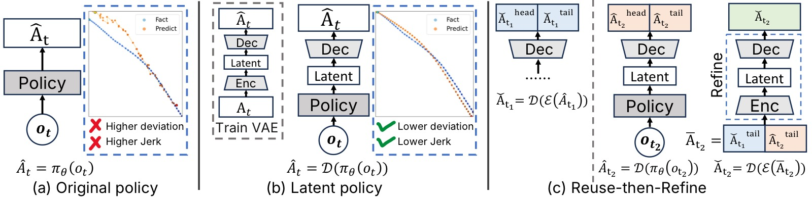
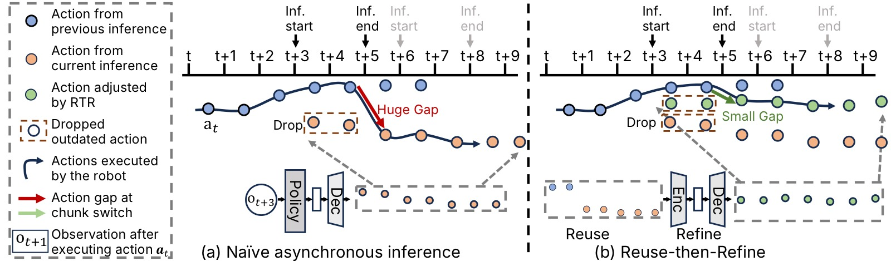
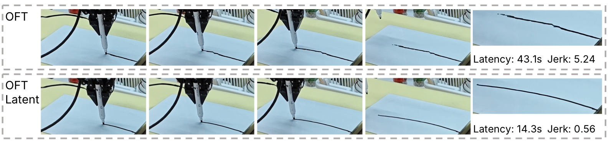
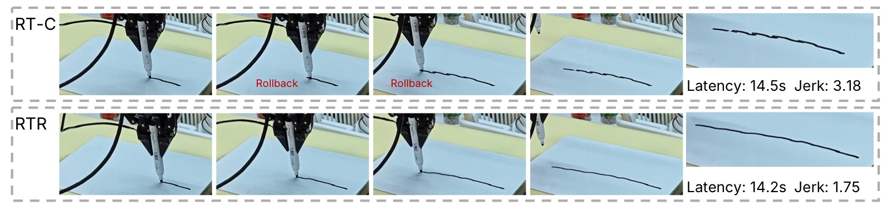
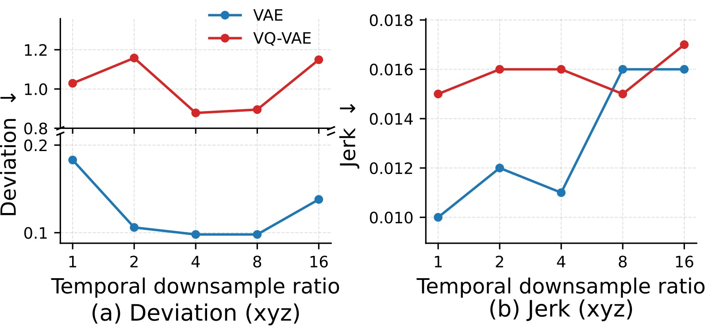

# Learning High-Frequency Continuous Action Chunks in Latent Space

> **论文信息**
> - 作者：Kunyun Wang (SJTU, TARS), Yuhang Zheng (TARS, NUS), Yupeng Zheng (TARS, CASIA), Jieru Zhao (SJTU, corresponding), Wenchao Ding (TARS, Fudan, corresponding)
> - 通讯作者：Jieru Zhao (zhao-jieru@sjtu.edu.cn), Wenchao Ding (dingwenchao@fudan.edu.cn)
> - 投稿方向：ICML 2026 (accepted)
> - arXiv ID：2605.24931
> - 代码：https://github.com/tars-robotics/RTR

---

## 一、核心问题

现代机器人模仿学习策略广泛采用 **action chunking（动作分块预测）**——策略一次预测未来 $H$ 步的动作序列，而非逐步预测。这在中等频率（如 15 Hz）下能改善时序一致性，但当动作频率提高到 **60 Hz** 时，直接在动作空间中学习变得极其困难：策略产生的动作块精度低且抖动剧烈（high jerk）。

然而，高频动作是值得追求的：高频动作保留了细粒度运动细节，隐式编码速度信息，使机器人能够**连续执行**而非反复启停（stop-and-go）。低频控制下每个动作指定一个远距离目标位姿，隐式强制执行零速度边界，导致反复加减速；高频控制则允许控制器保留非零速度穿越动作边界。

> 核心矛盾：高频动作使执行更丝滑，但使学习更困难。

---

## 二、核心思路 / 方法

论文提出两个互补的技术：

### 2.1 在 Latent Space 中学习高频动作

用 **Variational Autoencoder (VAE)** 将高频 action chunk 压缩到连续潜在空间，然后在潜在空间中训练策略。

具体流程：
1. **训练 VAE**：编码器 $\mathcal{E}$ 将高频率 action chunk $A_t \in \mathbb{R}^{H \times c}$ 映射到潜在表示 $z = \mathcal{E}(A_t)$，解码器 $\mathcal{D}$ 重构动作 $\hat{A}_t = \mathcal{D}(z)$
2. **时序降采样**：编码器以降采样因子 $f = H/h$ 压缩输入，产生 $z \in \mathbb{R}^{h \times d}$（$h$ 为潜在 horizon，$d$ 为潜在维度）
3. **训练策略**：将数据集中所有 action chunk 编码为 latent，策略学习从观测到 latent 的映射
4. **推理时**：策略预测 latent → VAE 解码器还原为高频率 action chunk

为什么有效？因为策略不再需要对每个高频率命令进行独立建模，而是预测紧凑的短时运动模式。VAE 编码器的时序降采样使每个 latent step 概括了多个相邻时间步的主要运动趋势，KL 正则化鼓励运动模式位于更平滑的潜在流形上。



*图1：方法总览。**(a) Original**：策略直接在高频率动作空间中训练，产生的 action chunk 存在大偏差和高 jerk。**(b) Latent**：策略在连续潜在空间中训练，VAE 解码器重建出精确且平滑的高频率 action chunk。**(c) Reuse-then-Refine (RTR)**：复用最近已执行的动作并通过 VAE 精炼，确保异步推理下连续 action chunk 之间的连续性。*

### 2.2 Reuse-then-Refine (RTR)：Chunk 间连续性

潜在空间学习保证了单个 chunk 内部的精度和平滑性，但不保证 chunk 之间的连续性。实际部署中长期任务需要反复调用策略生成新 chunk，异步推理（asynchronous inference）重叠计算与执行来隐藏延迟，但会导致 chunk 边界处的执行间隙。

RTR 是一个**免训练（training-free）**的两阶段策略：

- **Reuse 阶段**：复用推理窗口内已执行的前一个 chunk 的动作，与新 chunk 中的非过期动作拼接
- **Refine 阶段**：将拼接后的中间 action chunk 送入 VAE 编码器-解码器，产生精炼后的平滑 chunk

VAE 推理仅增加约 **2 ms** 开销，几乎不影响总体延迟。



*图2：异步推理与 chunk 级连续性。**(a) Naive 异步推理**：过期的动作被丢弃，直接执行新生成的 action chunk，导致 chunk 边界处出现大的不连续性（可见的停顿或回退）。当控制频率为 60 Hz 时，较小的空间步长会放大时间对齐中的微小误差。**(b) Reuse-then-Refine (RTR)**：推理窗口期间已执行的动作（前一个 chunk 的末尾部分）被保留复用，与当前新 chunk 中尚未过期的动作拼接，形成时间上"错位"的中间 action chunk。这个中间 chunk 随后通过 VAE 编码器压缩为 latent，再经解码器重建为精炼的 action chunk。由于 VAE 的潜在空间强制了时序和空间连续性约束，精炼后的 chunk 能从前一个 chunk 无缝过渡，消除 chunk 边界的不连续性。*

---

## 三、训练目标

### 3.1 VAE 训练

标准 VAE 训练目标（重建损失 + KL 散度），KL weight $\beta = 1 \times 10^{-6}$。

VAE 架构关键参数：
- 输入 action chunk 长度 $T=48$，动作维度 $D=10$（xyz + rpy + gripper）
- 编码器：2 层 1D Conv（kernel=5, stride=2），隐藏通道 32
- 潜在类型：Diagonal Gaussian，潜在维度 $d_z=10$
- 时序压缩比 $f=4$（48 → 12）
- 解码器：2 层 MLP

### 3.2 策略训练

策略在 VAE 训练完成后，使用冻结的 VAE 编码器将数据集中所有 action chunk 转为 latent，然后在 latent space 上训练。策略训练配置与原策略完全相同，仅将预测目标从原始 action 换成 latent action。

---

## 四、实验与结果

### 4.1 实验设置

- **三个真实世界接触-rich 任务**：(1) Peel Cucumber（削黄瓜皮）、(2) Wipe Vase（擦拭花瓶污渍）、(3) Write Board（白板上画连续直线）
- **三个基础策略**：Diffusion Policy (DP)、OpenVLA-OFT (OFT)、PI0.5
- **硬件**：xArm 7 (7-DOF) + Robotiq 2F-85 gripper；训练用 RTX 3060，推理用 RTX 4090
- **频率设置**：高频 = 60 Hz（$H=48$，覆盖 0.8s），低频 = 15 Hz
- **每个方法每个任务 50 次真机试验**

### 4.2 同步推理：Latent Space 的优势

**数据集评估（Table 1，Write Board 任务）：**

| 策略 | $\Delta$xyz (mm) | $\Delta$rpy (deg) | acc xyz | jerk xyz | jerk rpy |
|------|------------------|--------------------|---------|----------|----------|
| DP (Original) | 0.34 | 0.06 | 0.19 | 0.35 | 1.97 |
| DP (Latent) | **0.26** | **0.04** | **0.04** | **0.01** | **0.61** |
| OFT (Original) | 7.59 | 8.52 | 1.98 | 3.50 | 6.53 |
| OFT (Latent) | **1.47** | **5.15** | **0.04** | **0.02** | **0.75** |
| PI0.5 (Original) | **1.24** | 2.27 | 1.18 | 2.13 | 2.72 |
| PI0.5 (Latent) | 1.32 | **2.08** | **0.04** | **0.01** | **1.19** |

> OFT 提升最为显著——因其依赖离散动作 tokenization，量化误差在高频率小步长下被严重放大，而连续潜在空间彻底规避了这一问题。

**真机闭环执行（Table 2，三个任务）：**

Latent 策略在所有三个任务、三种策略架构上一致降低了 jerk 和 exceed count（超过安全速度阈值的步数）。

以 Peel Cucumber 为例：
- OFT：成功率 28% → **74%**（Latent），jerk 从 4.367 → **0.486**，exceed 从 32.7 → **3.1**
- DP：jerk 从 2.057 → **0.412**，exceed 从 4.0 → **1.8**
- PI0.5：成功率 78% → **84%**，jerk 从 2.790 → **0.678**



*图3：同步推理下的白板写字真实执行结果。**(a) OFT**：直接在 60 Hz 动作空间训练时，预测的 action chunk 平滑性差，轨迹有大量尖锐转折点。大的非平滑动作步长频繁超出安全执行限制（120 mm/s，对应每步 2 mm），导致反复停顿（stall）和整体执行缓慢。**(b) OFT-Latent**：在潜在空间中训练使动作轨迹更平滑，写出更干净的线条，端到端执行更快，停顿大幅减少。*

### 4.3 异步推理：RTR 的连续性优势

**Chunk 间连续性评估（Table 3）：**

RTR 显著改善了 chunk 边界不连续性。以 PI0.5 为例：

| 方法 | Overlap Diff $\Delta$xyz | Bound Gap $\Delta$xyz |
|------|--------------------------|------------------------|
| Original | 1.575 | 5.636 |
| Original+RT-C | 1.242 | 4.640 |
| Latent | 1.778 | 6.842 |
| Latent+RT-C | 1.979 | 8.478 |
| **Latent+RTR** | **0.331** | **4.069** |

> 关键发现：RT-C 在 latent space 中**反而恶化**了连续性（Bound Gap 从 6.842 增加到 8.478），说明 RT-C 并不适用于潜在空间。RTR 则专门为潜在空间设计，效果最优。

**真机异步执行（Table 4）：**

Latent+RTR 在所有三个任务上一致取得最低 jerk 和 exceed count。以 PI0.5 的 Write Board 为例：
- Original: jerk=4.984, exceed=14.8
- Original+RT-C: jerk=3.181, exceed=11.2
- Latent: jerk=3.904, exceed=17.6
- **Latent+RTR**: jerk=**1.754**, exceed=**10.2**



*图4：PI0.5 白板写字异步执行对比。**(a) RT-C**：RT-C 通过将动作生成建模为以前一个 chunk 为条件的 inpainting 问题来改善连续性。在本实验的数据集条件下虽然改善了 chunk 级连续性指标，但执行中仍可观察到明显的 chunk 边界间隙——体现在较高的 jerk 和偶发的回退（rollback）。**(b) Reuse-then-Refine (RTR)**：RTR 通过复用已执行动作和 VAE 精炼两个步骤，在异步推理下产生更平滑、更连续的 action chunk。图中可见 RTR 完全消除了可见的回退现象，jerk 大幅降低。文字轨迹更干净，机器人运动更流畅。*

### 4.4 端到端延迟

| 频率 | 方法 | Peel | Wipe | Write |
|------|------|------|------|-------|
| Low (15Hz) | Original | 39.65s | 39.57s | 41.30s |
| High (60Hz) | Original | 20.38s | 11.68s | 17.93s |
| High (60Hz) | Latent | 18.07s | 11.66s | 19.09s |
| High (60Hz) | **Latent+RTR** | **14.59s** | **9.49s** | **15.11s** |

> 高频执行消除反复加减速 → 延迟降低约 50%；RTR 进一步减少因边界不连续导致的停顿和回退。

### 4.5 消融实验

**VAE vs VQ-VAE + 不同降采样比：**



*图5：VAE 与 VQ-VAE 在不同时序降采样比下的精度与平滑性对比（Write Board 任务）。横轴为降采样比 $f$（1/2/4/8/16），纵轴分别展示位置偏差 $\Delta$xyz（mm）和 jerk。**(a) 精度（左）**：连续 VAE（蓝线）在所有降采样比下偏差均低于 VQ-VAE（橙线）。VQ-VAE 的向量量化引入了信息瓶颈，在高频小步长场景下丢失了细粒度空间信息。两个模型均呈 U 形曲线——$f=4$ 左右偏差最低，$f=16$ 时偏差迅速上升，说明过度压缩会丢弃关键运动信息。**(b) 平滑性（右）**：两个模型的 jerk 均随降采样比增大而单调增加，但 VAE 的 jerk 始终更低。较大 $f$ 值放大了重建动作之间的时间间隔，导致高阶时域导数（加速度和 jerk）增大。关键结论：VAE 在各降采样比下全面优于 VQ-VAE，$f=4$ 在精度和平滑性之间取得最佳平衡。*

**Latent Policy 降采样比影响（附录）：**

对 PI0.5：$f$ 从 1→8 时位置偏差下降（精度提升），$f=16$ 时精度退化。OFT 的转折点更早（$f=2$），因为其离散 tokenization 对压缩更敏感。

**连续 Latent vs 插值（附录 Table）：**

以 DP 的 Peel Cucumber 为例：Interpolate — 成功率 76%, jerk=2.874, exceed=16.9；Latent — 成功率 **90%**, jerk=**0.412**, exceed=**1.8**。插值无法恢复高频所需的细粒度运动结构。

---

## 五、关键洞察与技术亮点

1. **表示与执行的协同设计**：论文同时解决了"如何学习高频动作"（latent space）和"如何执行高频动作"（RTR）两个层面，二者互补。

2. **Latent space 的物理解释**：每个 latent step 概括了多个时间步的"主导运动趋势"，策略从学习每个命令的波动变为学习连贯的局部运动模式。KL 正则化使运动模式位于更平滑的流形上。

3. **RTR 是 training-free 的**：仅复用现有 VAE，不需要任何额外训练。这与 RT-C 等需要改变策略训练方式的方法形成对比。

4. **RT-C 在 latent space 中失效**：这是一个重要发现——将 RT-C 直接应用于潜在空间反而恶化了连续性，因为潜在空间的扰动会被 VAE 解码器放大。

5. **VAE 重建误差极小**：三个任务的重建误差均为亚毫米级（0.11–0.50 mm），表明 VAE 保真度足够高，不会引入显著的精度损失。

6. **LIBERO 仿真验证泛化性**：Latent 版本在 LIBERO 四个套件上达到与原始策略相当或更高的成功率，说明潜在表示不损害任务级泛化。

---

## 六、代码实现解读

代码开源在 https://github.com/tars-robotics/RTR。

基于论文描述的架构，核心实现结构如下：

```
RTR 项目结构（推断）:
├── vae/
│   ├── encoder.py          # 1D Conv 编码器 (2层, kernel=5, stride=2)
│   └── decoder.py          # MLP 解码器 (2层)
├── policies/
│   ├── dp/                 # Diffusion Policy (latent variant)
│   ├── oft/                # OpenVLA-OFT (latent variant)
│   └── pi05/               # PI0.5 (latent variant)
├── rtr/
│   └── rtr_executor.py     # Reuse-then-Refine 执行逻辑
└── scripts/
    └── train_vae.py        # VAE 训练脚本
```

### VAE 架构 (Encoder → Latent → Decoder)

```
┌─────────────────────────────────────────────────────────┐
│                    VAE 训练流程                           │
│                                                          │
│  Action Chunk A_t (48 × 10)                              │
│       │                                                  │
│       ▼                                                  │
│  ┌──────────────────────┐                                │
│  │  Encoder (1D Conv)    │  kernel=5, stride=2, 2 layers │
│  │  48 → 24 → 12        │  channels: 10 → 32 → 32       │
│  └──────────┬───────────┘                                │
│             │                                            │
│      ┌──────┴──────┐                                     │
│      ▼              ▼                                     │
│  ┌──────┐      ┌──────┐                                  │
│  │  μ   │      │  σ   │   Diagonal Gaussian              │
│  │12×10 │      │12×10 │   d_z = 10                        │
│  └──┬───┘      └──┬───┘                                  │
│     │   z ~ N(μ,σ)│                                       │
│     └──────┬──────┘                                       │
│            ▼                                              │
│  ┌──────────────────────┐                                │
│  │  Decoder (MLP)        │  2 layers, 12×10 → 48×10      │
│  └──────────┬───────────┘                                │
│             ▼                                            │
│  Reconstructed Action Chunk Â_t (48 × 10)                 │
│                                                          │
│  Loss = MSE(A_t, Â_t) + β × KL(N(μ,σ) || N(0,I))        │
│  β = 1e-6                                                │
└─────────────────────────────────────────────────────────┘
```

### 策略训练流程

```
┌──────────────────────────────────────┐
│         Latent Policy 训练            │
│                                      │
│  1. 用训练好的 VAE Encoder           │
│     将数据集中所有 action chunk      │
│     A_t → z_t (latent)              │
│                                      │
│  2. 构建新数据集:                    │
│     {o_t, z_t} 替换 {o_t, A_t}      │
│                                      │
│  3. 按原策略的训练配置训练            │
│     (DP/ O愁 / PI0.5 各自配置)       │
│     VAE 权重冻结                     │
│                                      │
│  4. 推理: o_t → policy → ẑ_t        │
│           → VAE Decoder → Â_t        │
└──────────────────────────────────────┘
```

### RTR 执行流程

```
┌──────────────────────────────────────────────────────────────┐
│              Reuse-then-Refine (RTR) 推理时执行               │
│                                                              │
│  Timeline (60 Hz, H=48, inference window=24):                │
│                                                              │
│  t=0      t=24          t=48    t=72                         │
│  │         │              │       │                           │
│  ├─────────┼──────────────┼───────┤                          │
│  │ Chunk 1 │  inference   │       │                          │
│  │ (48步)  │  Chunk 2     │       │                          │
│  │         │  (开始)       │       │                          │
│  │         │              │       │                           │
│  │         ├──────────────┤       │                          │
│  │         │ overlap (24) │       │  ← 已执行部分               │
│  │         │  ── reuse ──→│       │                           │
│  │         │              ├───────┤                          │
│  │         │              │Chunk 2│  ← 新chunk的非过期部分     │
│  │         │              │(24步) │                           │
│  └─────────┴──────────────┴───────┘                          │
│                                                              │
│  RTR 步骤:                                                   │
│                                                              │
│  ┌─────────────────────────────────────┐                     │
│  │ Step 1: Reuse                       │                     │
│  │                                     │                     │
│  │  reused_24 = Chunk1[t=24:48]       │  ← 前一个chunk已执行  │
│  │  new_24 = Chunk2[t=48:72]          │  ← 新chunk未过期部分  │
│  │  concat = [reused_24, new_24]       │  拼接 (48步)         │
│  └──────────────┬──────────────────────┘                     │
│                 ▼                                            │
│  ┌─────────────────────────────────────┐                     │
│  │ Step 2: Refine                      │                     │
│  │                                     │                     │
│  │  z = VAE_Encoder(concat)           │  ← 编码到latent      │
│  │  refined = VAE_Decoder(z)          │  ← 解码回action space│
│  │                                     │  ~2ms overhead      │
│  └─────────────────────────────────────┘                     │
│                                                              │
│  执行 refined chunk → 平滑切换，无停顿/回退                     │
└──────────────────────────────────────────────────────────────┘
```

---

## 七、局限性

1. **频率上限**：实验仅在 60 Hz 进行（受视觉传感器采样率限制）。90 Hz 或 120 Hz 等更高频率可能放大潜在表示的优势，也可能引入新的学习挑战。

2. **RTR 仅限于 Latent Policy**：RTR 依赖 VAE 做精炼，直接用于 action-space policy 需要额外训练 VAE，效果未知。

3. **计算开销**：虽然是轻量的（VAE 2ms），但仍增加了推理 pipeline 的复杂度。网络通信在端到端延迟中占显著比例（~87 ms）。

4. **任务范围**：仅在三个接触-rich 任务上验证，均为单臂操作。更复杂的双臂协作或移动操作场景尚未测试。

---

## 八、关键概念速查

| 概念 | 说明 |
|------|------|
| **Action Chunking** | 策略一次预测 $H$ 步动作序列，改善时序一致性 |
| **Action Frequency** | 动作采样率；60 Hz 使空间步长小、编码速度信息、支持连续执行 |
| **Jerk** | 位置的三阶差分 $\mathbf{j}_t = (\mathbf{x}_{t+3} - 3\mathbf{x}_{t+2} + 3\mathbf{x}_{t+1} - \mathbf{x}_t)/\Delta t^3$，衡量运动平滑性 |
| **Latent Space Learning** | 用 VAE 将高频 action chunk 压缩到连续潜在空间 → 策略在 latent space 训练 |
| **Reuse-then-Refine (RTR)** | 免训练的 chunk 连续性策略：复用已执行动作 + VAE 精炼拼接序列 |
| **Asynchronous Inference** | 推理与执行重叠进行，隐藏推理延迟 |
| **RT-C** | 将动作生成建模为以前一个 chunk 为条件的 inpainting；在 latent space 中不适用 |
| **Temporal Downsampling** | VAE 编码器将 $H$ 步压缩为 $h = H/f$ 步（$f=4$） |
