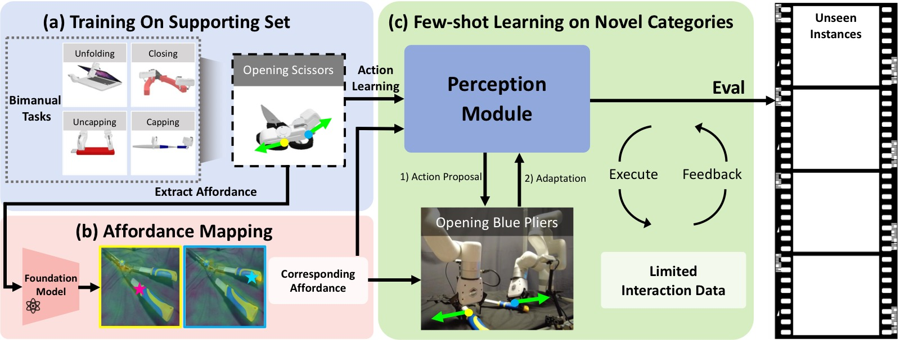
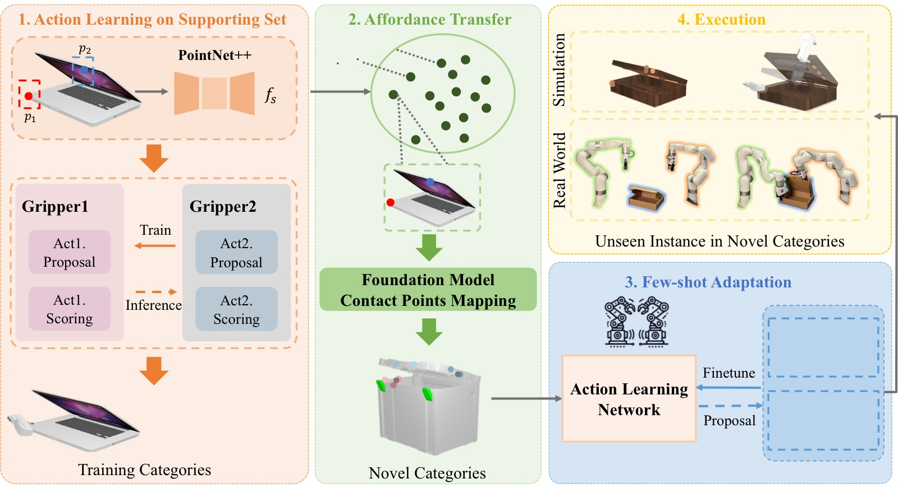
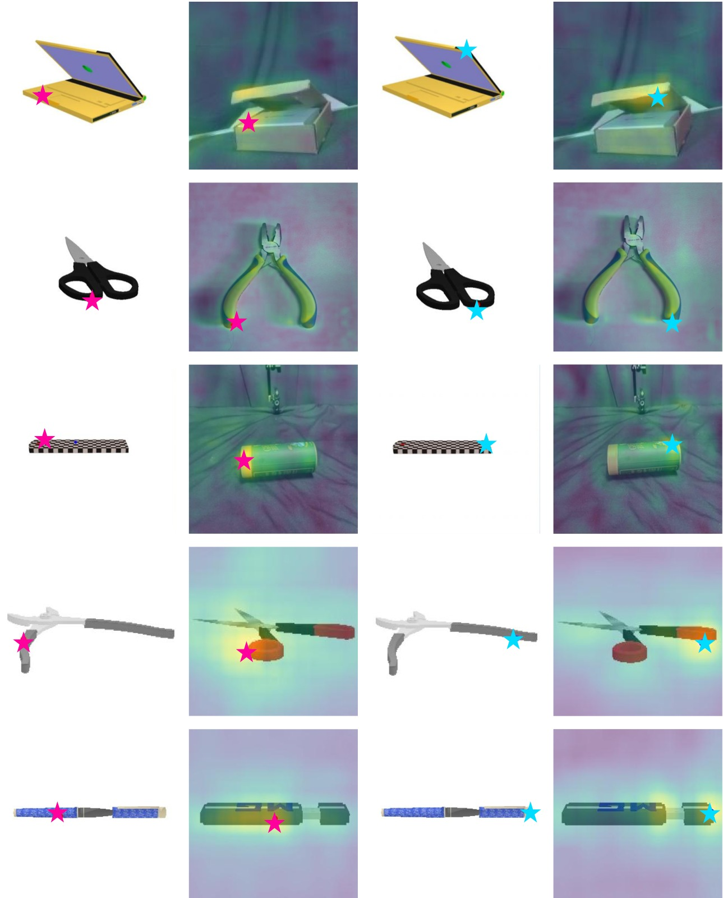
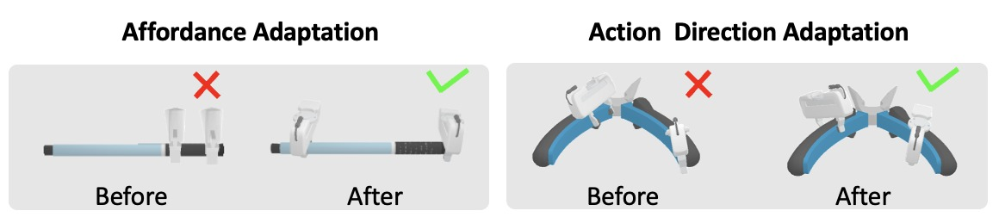
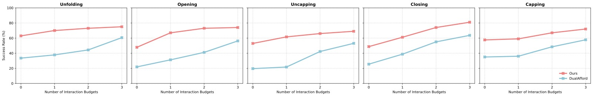
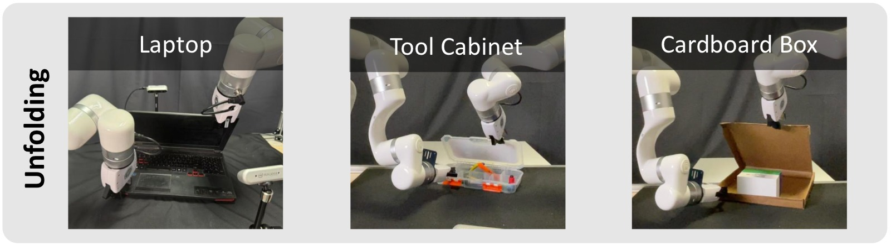

# Bi-Adapt: Few-shot Bimanual Adaptation for Novel Categories of 3D Objects via Semantic Correspondence

> **论文信息**
> - 作者：Jinxian Zhou\*, Ruihai Wu\*, Yiwei Liu, Yiwen Hou, Xunzhe Zhou, Checheng Yu, Licheng Zhong, Lin Shao†
> - 机构：National University of Singapore, Shanghai Qi Zhi Institute, Peking University, The University of Hong Kong
> - 通讯作者：Lin Shao（linshao@nus.edu.sg）
> - 投稿方向：ICRA 格式（under review）
> - arXiv：2602.08425v2
> - 项目主页：https://biadapt-project.github.io/

---

## 一、核心问题

双臂协同操作（bimanual manipulation）对机器人极具挑战性：不仅需要两臂精确协调，还要应对现实中形态各异的三维物体。现有方法面临两个难以兼顾的困境：

1. **泛化不足**：专为有限类别物体设计的方法（如 DualAfford、M-Where2Act），在遇到训练集外的新类别物体时性能大幅下降（成功率从约 65% 跌至约 20%）。
2. **数据成本高**：想要泛化，就需要大量真实交互数据——收集耗时、标注昂贵，且在真实机器人环境中尤其困难。

**核心矛盾**：如何让机器人在只见过少量新类别物体的情况下，即能操作同类别中大量未见过的实例？

Bi-Adapt 的核心洞察：不同类别的物体往往具有相似的几何结构和语义对应关系——剪刀和钳子形态相似，操作方式也相近。如果机器人掌握了操作剪刀的技能，利用这种跨类别语义对应，就能将操作知识迁移到钳子上，仅需少量交互微调即可完成适配。

---

## 二、核心思路与方法

### 2.1 总体框架



*图1：Bi-Adapt 三阶段框架总览。(a) 在支持集（supporting set）上训练，学习5类双臂任务（Unfolding/Closing/Opening/Uncapping/Capping）的动作先验；(b) 利用基础模型（DIFT 扩散特征）做跨类别 Affordance 映射——源图像上的抓取点（粉星为第一夹爪，蓝星为第二夹爪）通过语义对应迁移到目标类别物体；(c) 在新类别上进行少样本自适应（few-shot adaptation），通过 Execute→Feedback 循环微调 Perception Module，最终可零样本评估 Novel Categories 的 Unseen Instances。*

方法分为**三个阶段**，依次递进：

1. **支持集动作学习**（Action Learning on Supporting Set）
2. **跨类别 Affordance 迁移**（Affordance Transfer via Semantic Correspondence）
3. **少样本适配**（Few-shot Adaptation）

---

### 2.2 阶段一：支持集动作学习



*图2：Bi-Adapt 完整 Pipeline。左区（橙色）为阶段一，在训练类别上学习双臂动作先验。输入物体点云经 PointNet++ 提取点级特征 $f_s$，随后由 Gripper1（包含 Act1.Proposal + Act1.Scoring）和 Gripper2（包含 Act2.Proposal + Act2.Scoring）分别预测两只夹爪的抓取点 $p_1, p_2$ 和朝向 $R_1, R_2$。注意训练时箭头方向（从 Gripper2→Gripper1）与推理时相反——这是关键的"反向数据流"设计，确保 $\mathcal{M}_1$ 在已知 $\mathcal{M}_2$ 协作能力的前提下做提案。中区（绿色）为阶段二，基础模型将训练类别中的接触点候选（红点/蓝点）映射到新类别物体（箱子）的对应位置。右下（蓝色）为阶段三，用 50 次交互数据微调 Action Learning Network。右上（黄色）为最终在仿真和真实环境中评估 Novel Categories 的 Unseen Instances。*

**任务设定**

给定物体点云 $O \in \mathbb{R}^{N \times 3}$ 和任务 $T$，框架预测两只夹爪的动作：

$$u_i = (p_i, R_i), \quad p_i \in O, \quad R_i \in SO(3)$$

其中 $p_i$ 为接触点，$R_i$ 为夹爪朝向。每次动作包含：以 $p_i$ 为接触点、保持朝向不变地向特定方向拉动。

**5 个双臂操作任务**：
| 任务 | 成功判据 |
|------|---------|
| Unfolding（展开） | 旋转关节角度变化 > 关节范围 × 0.10 |
| Opening（打开） | 旋转关节角度变化 > 关节范围 × 0.10 |
| Closing（合拢） | 旋转关节角度变化 > 关节范围 × 0.10 |
| Uncapping（去盖） | 棱柱关节分离距离 > 0.05 m |
| Capping（盖盖） | 棱柱关节靠近距离 > 0.05 m |

**双臂解耦设计**

为降低两臂联合动作空间的复杂度，将其分解为两个条件依赖的子动作：

$$\mathcal{M}_1 \rightarrow u_1, \quad \mathcal{M}_2(u_1) \rightarrow u_2$$

**关键设计——反向数据流（Reversed Dataflow）**：
- **推理时**：$\mathcal{M}_1$ 先提案 $u_1$，$\mathcal{M}_2$ 以 $u_1$ 为条件提案 $u_2$（直觉方向）
- **训练时**：先训练 $\mathcal{M}_2$（让它对各种 $u_1$ 都能提出合适的 $u_2$），再训练 $\mathcal{M}_1$（此时 $\mathcal{M}_2$ 已足够可靠，$\mathcal{M}_1$ 的提案质量可以被真正评估）

> 这一反向策略的意义在于：若正向训练，$\mathcal{M}_1$ 的目标函数无法获知 $u_1$ 是否真的"利于协作"，会导致 $u_1$ 的质量欠佳。反向训练后，$\mathcal{M}_1$ 的训练信号中内含了 $\mathcal{M}_2$ 的协作可行性评估。

**网络结构**

每个夹爪模块包含两个子网络：

- **Action Proposal Network** $\mathcal{A}$（cVAE 结构）：给定接触点，预测夹爪朝向分布
- **Action Scoring Network** $\mathcal{C}$（二分类器）：评估所提动作的成功可能性

主干特征提取器（两个模块共享架构）：
- PointNet++（分割版）从点云 $O$ 提取点级特征 $f_s \in \mathbb{R}^{128}$
- 三个独立 MLP：$p \rightarrow f_p \in \mathbb{R}^{32}$，$R \rightarrow f_R \in \mathbb{R}^{32}$

---

### 2.3 阶段二：跨类别 Affordance 迁移

**核心思路**：利用视觉基础模型的语义对应能力，把训练类别中的成功接触点"投影"到新类别物体的对应位置。

**使用的基础模型**：DIFT（Diffusion Feature Transfer，Tang et al. 2023）——从稳定扩散模型中提取的扩散特征，具备跨类别语义对应能力。

**接触点映射流程**：

给定源图像 $I_s$（含两个接触点 $p_{s_1}^{2D}, p_{s_2}^{2D}$）和目标图像 $I_t$：

1. 对 $I_t$ 加噪并通过扩散过程去噪，提取每像素的扩散特征
2. 对每个源接触点 $p_{s_i}^{2D}$，计算其特征 $f_s$ 与目标图像所有像素特征的余弦相似度：

$$\text{similarity} = \cos f_{p_s^{2D}} \cdot \cos f_{p_{t^j}^{2D}}$$

3. 找到相似度最高的像素 $p_{t_i}^{2D}$，利用深度图反投影到 3D 接触点 $p_{t_i}^{3D}$

4. 从支持集中取多个源物体，得到多对接触点候选，供第三阶段选择过滤



*图3：DIFT 跨类别接触点映射可视化（5 行对应 5 种任务）。每组包含两列：左列为源图像（3D 物体渲染）上标注两只夹爪的接触点（粉星=第一夹爪，青星=第二夹爪），右列为目标图像（实物照片）上的映射结果，高亮热力图显示特征相似度分布，亮黄色区域表示最高对应度。第一行（Unfolding）：训练类别 box-laptop 上的铰链区域成功对应到目标类别 wooden-box 的盖板铰链处；第二行（Opening）：训练类别剪刀的两臂接触点正确映射到目标钳子的两侧把柄；第三行（Uncapping）：棋盘纹标尺（训练）→ 圆柱形容器（目标），两端接触点准确对应；第四行（Closing）：弯形夹具（训练）→ 剪刀（目标），把柄区域对应良好；第五行（Capping）：笔杆（训练）→ USB 充电器（目标），两端接触点对应正确。整体验证 DIFT 在跨类别外观差异极大的情况下仍能找到语义功能对应关系。*

---

### 2.4 阶段三：少样本自适应

**动机**：Affordance 迁移提供了合理的接触点候选集，但基础模型并非完美——部分候选点对特定任务来说是"负样本"；且训练类别上学到的动作方向不一定适用于新类别不同的几何和物理特性。

**流程**：
1. 在新类别的少量（≤50次）实例上执行预训练网络提案的最高置信度动作
2. 收集交互结果（成功/失败），在线微调 Perception Module
3. 微调后的模型具备对同类别未见实例的零样本泛化能力



*图4：少样本适配的效果对比（适配前 × vs 适配后 ✓）。左组"Affordance Adaptation"：以 Uncapping 任务为例，适配前（Before）两个夹爪均夹持在笔杆的中部区域，无法完成拔帽动作（× 失败）；适配后（After）两个夹爪分别定位到笔杆和笔帽的正确两端位置，动作成功（✓）。右组"Action Direction Adaptation"：以 Opening 任务（钳子）为例，适配前两个夹爪朝向相同方向施力，无法形成展开力矩（× 失败）；适配后夹爪朝向调整为从两侧向外展开的对称方向，动作成功（✓）。这两组对比说明少样本适配既能纠正错误的接触点位置，也能校正不合适的动作方向，两者缺一不可。*

---

## 三、训练目标

**Action Scoring Loss（$\mathcal{C}_2$）**：标准二元交叉熵

$$\mathcal{L}_{\mathcal{C}_2} = r_i \log \mathcal{C}_2(f^{in}_{\mathcal{C}_2}) + (1-r_i)\log(1 - \mathcal{C}_2(f^{in}_{\mathcal{C}_2}))$$

其中 $r=1$ 为成功，$r=0$ 为失败。训练时成功/失败样本各占 50%。

**Action Proposal Loss（$\mathcal{A}_j$，cVAE）**：测地距离 + KL 散度

$$\mathcal{L}_{A_j} = \mathcal{L}_{geo}(\hat{R}_j, R_j) + D_{KL}(q(z \mid \hat{R}_j, f^{in}_{\mathcal{A}_j}) \| \mathcal{N}(0,1))$$

测地距离 $\mathcal{L}_{geo}$ 直接度量 $SO(3)$ 流形上两个旋转矩阵的角度误差，比欧氏距离更适合朝向建模。Proposal 网络只用成功数据训练。

---

## 四、实验与结果

### 4.1 实验设置

- **仿真环境**：SAPIEN + NVIDIA PhysX，两个 Franka Panda Flying grippers
- **数据集**：PartNet-Mobility + ShapeNet，61 个关节物体，6 个类别
- **划分**：训练类别（supporting set）+ 新类别（seen instances < 30% 用于 few-shot 适配；unseen instances 仅用于评估）

### 4.2 与 Baseline 对比

在 **Novel Categories 的 Unseen Instances** 上的 Sample Success Rate（%）：

| 方法 | Unfolding | Opening | Uncapping | Closing | Capping |
|------|-----------|---------|-----------|---------|---------|
| Heuristic | 24.70 | 19.82 | 31.33 | 33.74 | 43.20 |
| M-Where2Act | 32.40 | 20.66 | 29.10 | 18.45 | 17.30 |
| DualAfford | 33.50 | 21.90 | 19.60 | 25.50 | 35.00 |
| **Ours** | **70.00** | **67.00** | **61.62** | **61.12** | **59.00** |

Bi-Adapt 在所有 5 个任务上均以约 **30–50 个百分点**的优势领先所有 baseline。

**Baseline 失败原因分析**：
- **Heuristic**：手工规则无法适应不同类别的几何多样性
- **M-Where2Act**：独立训练两个夹爪模型，忽略协作约束，在需要强协调的任务（Opening、Closing）上尤其差
- **DualAfford**：虽考虑了双臂协作，但跨类别泛化极差（训练类别上 ~64% → 新类别 ~25%），且训练成本极高

### 4.3 消融实验

同时报告训练类别 + 新类别（seen/unseen）上的 Sample Success Rate（%）：

| 方法 | Unfolding Train/Seen/Unseen | Opening Train/Seen/Unseen | Uncapping Train/Seen/Unseen | Closing Train/Seen/Unseen | Capping Train/Seen/Unseen |
|------|-----------|---------|-----------|---------|---------|
| w/o AT | 75.50 / 47.95 / 37.76 | 63.50 / 32.61 / 31.23 | 43.22 / 41.30 / 21.71 | 76.00 / 39.29 / 38.70 | 75.00 / 39.13 / 36.00 |
| w/o FA | — / 62.50 / 62.96 | — / 61.90 / 47.83 | — / 53.19 / 52.94 | — / 45.65 / 48.72 | — / 59.52 / 57.58 |
| **Ours** | — / **68.00** / **70.00** | — / **72.00** / **67.00** | — / **63.00** / **61.62** | — / **56.00** / **61.12** | — / **64.00** / **59.00** |

关键观察：
- **去掉 AT**（无 affordance 迁移）：unseen 成功率跌至 21–38%，说明基础模型的语义对应是跨类别泛化的核心
- **去掉 FA**（无少样本适配）：成功率约 47–63%，比完整版低约 5–15 个百分点，证明适配能有效过滤负候选点并校正动作方向
- **两个组件缺一不可**，且 AT 的贡献更大

### 4.4 适配效率



*图5：5 个任务上 Ours（红线）与 DualAfford（蓝线）的效率对比，横轴为 novel category 上的交互预算数（0–3），纵轴为 unseen instances 的 Success Rate（%）。关键数据：(1) Budget=0 时（纯零样本，仅靠基础模型的语义对应）：Ours 在所有任务上已优于 DualAfford 的最终性能（最大差距约 30%），说明基础模型提供了强有力的冷启动；(2) 随着预算增加，红线持续快速上升，而蓝线增长缓慢——Ours 的"学习斜率"更高；(3) Closing 任务（第四幅）中，仅用 3 个 budget，Ours 的成功率从约 49% 跃升至 80%+，增幅超 30 个百分点；(4) 到 Budget=3 时，Ours 全面超过 DualAfford 25–40 个百分点。这组曲线最直接地说明了 Bi-Adapt 的数据效率优势：基础模型提供的初始化远优于随机初始化，使得极少量数据即可实现快速收敛。*

### 4.5 真实世界实验



*图6：Unfolding 任务的实机跨类别泛化结果。三个物体列：左为 Laptop（在训练集支持集上见过该类别），中为 Tool Cabinet（新类别，工具箱），右为 Cardboard Box（新类别，纸板箱）。两臂 UFactory xArm6 机械臂均能成功完成展开动作：对 Laptop 两夹爪分别抓住底座和屏幕边缘向外拉；对 Tool Cabinet 两夹爪抓住盖板左右两侧开启；对 Cardboard Box 两夹爪抓住纸板箱的两个盖板向外翻开。三个类别外观和几何差异显著，证明 Bi-Adapt 的跨类别语义对应和少样本适配确实在真实物理环境中有效。*

真实机器人设置：
- 两臂：UFactory xArm6 + UFactory xArm Gripper
- 感知：RealSense D435 RGB-D 相机（正视角）
- 物体分割：SAM（Segment Anything）
- 物体位姿估计：AR code + FoundationPose
- 点云采样：基于估计位姿从物体 mesh 中采样

---

## 五、关键洞察与技术亮点

**1. 反向数据流训练策略的必要性**

传统"从左到右"训练两臂模型时，$\mathcal{M}_1$ 学到的 $u_1$ 不保证对 $\mathcal{M}_2$ 友好。Bi-Adapt 先让 $\mathcal{M}_2$ 达到"稳健的协作者"状态，再训练 $\mathcal{M}_1$ 使其提案的 $u_1$ 能被 $\mathcal{M}_2$ 有效利用——这是隐式的双臂协调约束，无需显式设计联合目标函数。

**2. DIFT 特征的跨类别对应能力**

DIFT 来自 Stable Diffusion 的中间层激活，其训练目标（图像去噪）自然地学到了语义相似区域具有相近特征表示。用余弦相似度在像素级别找对应，不需要任何对应点标注数据，完全零样本。

**3. Affordance 映射 + 少样本适配的组合效应**

- 单独 AT（w/o FA）：成功率约 47–63%，接触点候选位置合理但动作方向可能错误
- 单独 FA（w/o AT）：仅 21–38%，缺乏好的接触点初始化使微调收敛慢、效果差
- 两者结合：65–70%，远超二者之和——AT 提供高质量"起点"，FA 在此基础上精化，相辅相成

**4. 类别内泛化的保证**

少样本微调针对类别内的 seen instances，而泛化到 unseen instances 依赖于"同一类别内几何特性和物理属性的相似性"这一先验假设。实验验证了这一假设在关节物体操作任务上成立。

---

## 六、代码实现解读

论文未提供开源代码，但基于论文描述，可推断核心模块的实现结构：

```
Bi-Adapt 模块结构
─────────────────────────────────────────────────────────
                         输入
                    O ∈ R^{N×3}
                         │
              ┌──────────▼──────────┐
              │  PointNet++ Backbone │  → f_s ∈ R^{N×128}
              └──────────┬──────────┘
                         │
          ┌──────────────┼──────────────┐
          │                             │
┌─────────▼──────────┐       ┌──────────▼────────────┐
│  Gripper1 Module   │       │   Gripper2 Module      │
│  M_1               │       │   M_2                  │
│                    │       │                        │
│ ┌────────────────┐ │  u_1  │ ┌──────────────────┐  │
│ │ Action Scoring │◄├───────┤►│  Action Scoring   │  │
│ │   C_1 (BCE)    │ │       │ │    C_2 (BCE)      │  │
│ └────────────────┘ │       │ └──────────────────┘  │
│ ┌────────────────┐ │       │ ┌──────────────────┐  │
│ │ Action Proposal│ │       │ │  Action Proposal  │  │
│ │  A_1 (cVAE)    │ │       │ │   A_2 (cVAE)     │  │
│ └────────────────┘ │       │ └──────────────────┘  │
└────────────────────┘       └────────────────────────┘
  提案 u_1=(p_1,R_1)             以 u_1 为条件
                                 提案 u_2=(p_2,R_2)

训练数据流方向：M_2 ← M_1（先训 M_2，再训 M_1）
推理数据流方向：M_1 → M_2（先提案 u_1，再条件提案 u_2）
─────────────────────────────────────────────────────────
```

```
Affordance Transfer Pipeline
─────────────────────────────────────────────────────────
  支持集图像 I_s            目标类别图像 I_t
  (含接触点 p_s1, p_s2)
         │                        │
         ▼                        ▼
   DIFT 特征提取            DIFT 特征提取
   (Stable Diffusion        (加噪 → 去噪过程)
    中间层激活)
         │                        │
         ▼                        ▼
  f_s: per-pixel           f_t: per-pixel
  扩散特征                   扩散特征
         │                        │
         └────────┬───────────────┘
                  ▼
         余弦相似度矩阵
         sim(p_s_i, p_t_j) for all j
                  │
                  ▼
         argmax → p_t_i^{2D}
                  │
                  ▼
         深度图反投影
         p_t_i^{3D} ∈ 目标点云
                  │
                  ▼
         多源图像 → 候选接触点对集合
         {(p_t1_k, p_t2_k)} k=1,...,K
─────────────────────────────────────────────────────────
```

**输入特征编码**：

| 输入 | 编码器 | 输出维度 |
|------|--------|---------|
| 点云 $O$ | PointNet++（分割版） | $f_s \in \mathbb{R}^{N \times 128}$ |
| 接触点 $p$ | 3 层 MLP | $f_p \in \mathbb{R}^{32}$ |
| 朝向 $R$ | 3 层 MLP | $f_R \in \mathbb{R}^{32}$ |

**Action Proposal cVAE**：典型 CVAE 结构——编码器将 $(R, f^{in})$ 编码为隐变量 $z \sim q(z|\cdot)$，解码器从 $z$ 和条件 $f^{in}$ 重建朝向 $\hat{R}$，以 $\mathcal{L}_{geo} + D_{KL}$ 联合优化。

---

## 七、局限性

1. **不支持长时域任务**：当前框架只能处理单个短时域双臂动作（接触-拉动），无法组合多步操作（如先打开再取物）或涉及多个物体的复杂序列任务。

2. **DIFT 性能上限**：跨类别 Affordance 迁移的质量受制于上游基础模型的能力，以及图像质量和选点精度。当两类别在语义上差异很大，或目标物体图像质量差时，映射可能失效。

3. **类别内泛化假设**：方法依赖"同类别物体几何和物理性质相似"，对内部差异很大的类别（如各种形状的桌子）可能效果有限。

4. **真实部署限制**：需要额外的物体位姿估计管线（SAM + AR code + FoundationPose），系统复杂度高，且每次遇到新物体需要 AR code 标定。

---

## 八、关键概念速查

| 概念 | 含义 |
|------|------|
| Supporting Set | 训练类别构成的支持集，提供操作先验知识 |
| Novel Categories | 在支持集中**从未出现**的对象类别 |
| Seen Instances | 新类别中用于少样本适配的少量实例（< 30%）|
| Unseen Instances | 新类别中**仅用于评估**的实例（不参与微调）|
| Affordance Transfer (AT) | 用 DIFT 将训练类别接触点映射到新类别 |
| Few-shot Adaptation (FA) | 用少量真实交互结果微调 Perception Module |
| DIFT | Diffusion Feature Transfer，从扩散模型提取跨类别语义对应特征 |
| cVAE | Conditional Variational Autoencoder，用于生成多模态动作分布 |
| $\mathcal{L}_{geo}$ | $SO(3)$ 上的测地距离损失，度量旋转朝向误差 |
| Reversed Dataflow | 训练时先训 $\mathcal{M}_2$ 再训 $\mathcal{M}_1$，确保协作最优性 |
