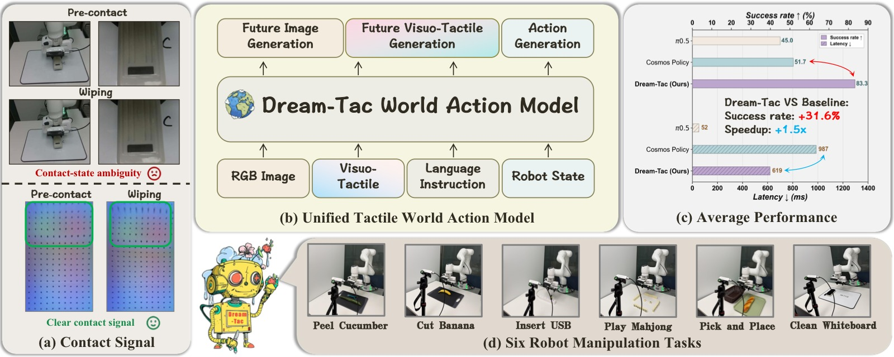
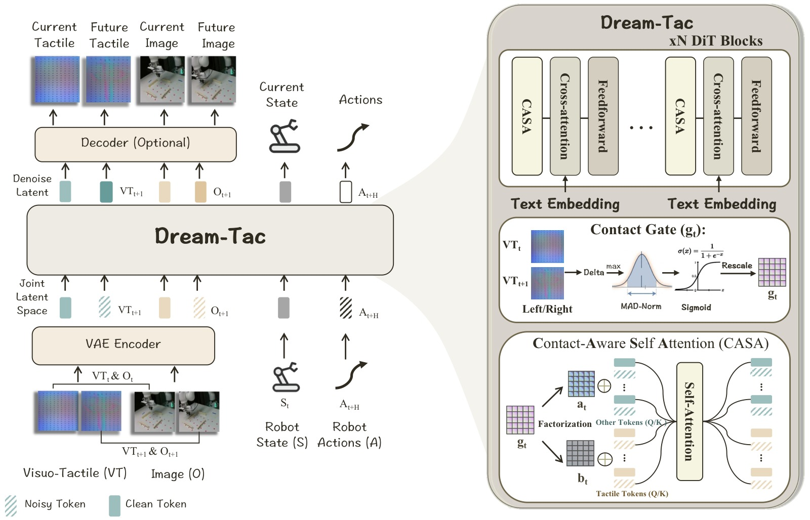
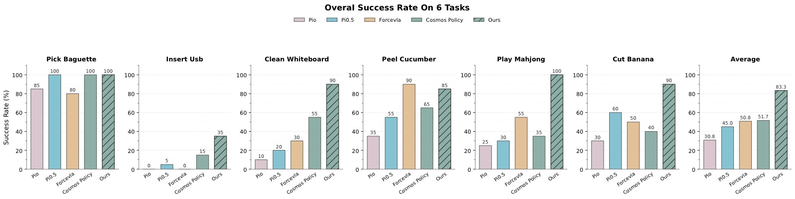
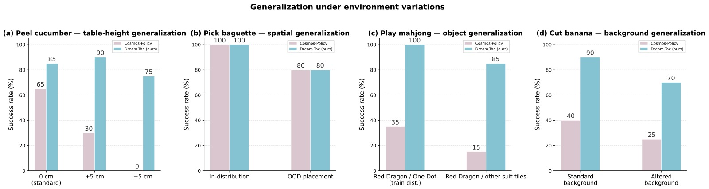
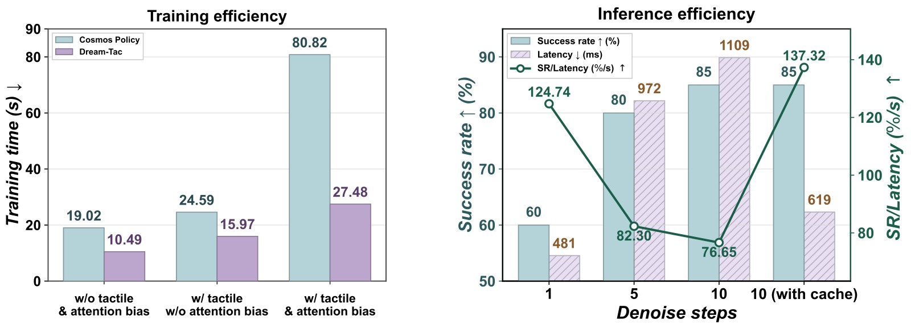
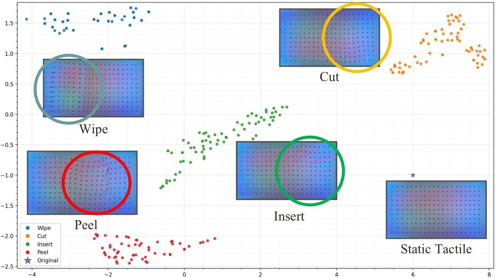
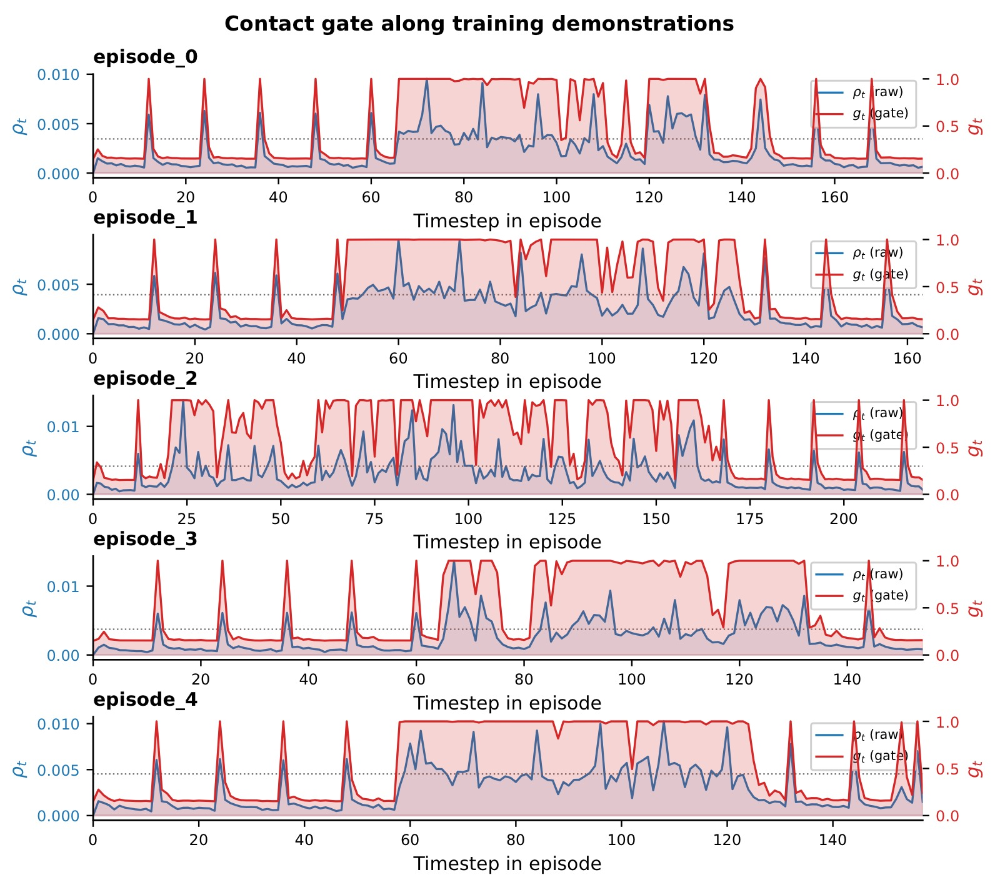
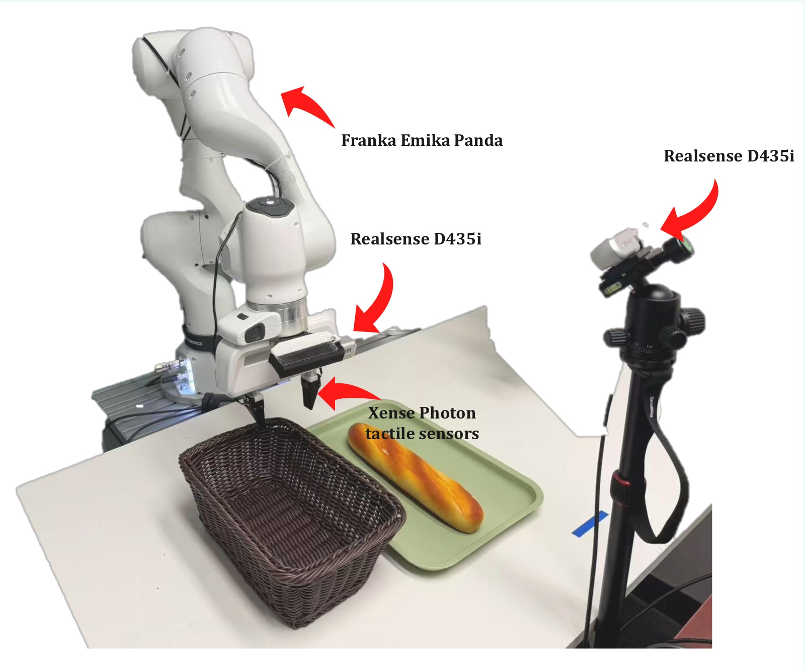

# Dream-Tac: A Unified Tactile World Action Model for Contact-Rich Robot Manipulation

> **论文信息**
> - 作者：Yunfan Lou*, Yifan Ye*†, Yankai Fu*, Jun Cen, Xiaowei Chi, Yaoxu Lyu, Peidong Jia, Sirui Han, Zhihe Lu, Shanghang Zhang†
> - 通讯作者：Yifan Ye（项目负责人）、Shanghang Zhang（shanghang@pku.edu.cn）
> - 机构：北京大学、香港科技大学、南京大学
> - 投稿方向：ACM（会议论文格式，投稿中 under review）
> - arXiv ID：2606.08737v1（2026-06-08）
> - 代码：https://github.com/LYFCLOUDFAN/Dream-Tac

---

## 一、核心问题

**World Action Model（WAM）做接触密集型操作为何会失败？**

现有 WAM（如 Cosmos Policy）在通用操控任务上表现不错，但在需要精确接触感知的任务（插入、削皮、擦拭、切割）上明显力不从心。根本原因在于：

1. **视觉盲区（Contact-state ambiguity）**：RGB 图像在接触发生前后外观几乎不变，抓取前的"预接触"与"正在接触"在视觉上难以区分。如 teaser 图所示，用视觉看白板擦拭前后的夹爪，几乎看不出差异；但触觉图像（Xense Photon 传感器）则清晰显示出接触引起的点阵形变。

2. **物理交互不可见**：接触力、局部形变、黏-滑（stick-slip）转变在视觉上要么极其微弱、要么被遮挡、要么完全不可见。

3. **触觉信号稀疏且瞬时**：长时段基本静止，接触事件（onset、slip、release）仅集中在极短的时间窗口内。若将触觉 token 与视觉 token 对等处理，非接触时段的弱触觉信号会"稀释"真正关键的接触信息。

---

## 二、核心思路 / 方法

Dream-Tac 的核心思想是将触觉预测提升为与视觉预测**平等**的一级预测目标，同时引入一个事件驱动的门控机制，让模型在接触事件发生时"主动放大"对触觉 token 的注意。

### 2.1 问题建模

标准视觉运动策略：$p(a_{1:H} \mid o, l)$

标准 World Model：$p(v_{1:T} \mid o, l)$

标准 World Action Model（WAM）：$p(a_{1:H}, v_{1:T} \mid o, l)$

**Dream-Tac 扩展**——将触觉引入联合预测框架：

$$
p(a_{1:H},\; v_{1:T},\; x_{1:T} \mid o,\; x,\; l)
$$

其中 $x$ 为当前触觉观测，$x_{1:T}$ 为未来触觉观测序列。模型同时预测：动作、未来视觉、未来触觉。

### 2.2 整体架构

*图1：四栏总览图。(a) 接触信号对比：左上两行为 RGB 图像（预接触 vs 擦拭），视觉几乎无差异，标注"Contact-state ambiguity"；左下两行为对应触觉图像，清晰显示"Clear contact signal"——绿色矩形区域表示接触变化，蓝色点阵被挤压形变明显。这一对比直接证明视觉对接触感知的局限性。(b) Dream-Tac 的统一输入输出框架：输入为 RGB Image、Visuo-Tactile、Language Instruction、Robot State，输出为 Future Image Generation、Future Visuo-Tactile Generation、Action Generation。(c) 性能对比：Dream-Tac 平均成功率 83.3%，优于 Cosmos Policy（51.7%）、π₀.₅（45.0%），成功率提升 +31.6%；推理延迟 619ms vs Cosmos Policy 987ms，快 1.5×。(d) 六个真实世界操作任务：Peel Cucumber、Cut Banana、Insert USB、Play Mahjong、Pick and Place（Pick Baguette）、Clean Whiteboard。*

**架构主干**：在预训练视频 Diffusion Transformer（DiT，基于 Cosmos2 和 Wan VAE）之上构建。

- 视觉观测 $o$ 和触觉观测 $x$ 通过**同一个预训练 VAE** 编码为 latent token
- Robot State 和 Action Chunk 表示为 padded latent-frame token，与视频 token 一起送入 DiT 联合去噪
- 语言指令通过 T5 编码器，以 cross-attention 方式注入所有 token

关键优势：触觉 token 和视觉/动作 token 共享同一 transformer，通过双向 self-attention 互相感知——动作 token 在预测时不仅能看到未来视觉，还能感知未来触觉变化。

*图2：左侧展示数据流——当前触觉（VT_t）、未来触觉（VT_{t+1}）、当前图像（O_t）、未来图像（O_{t+1}）通过 VAE Encoder 映射到 Joint Latent Space，与 Robot State（S_t）和带噪声的动作 token（A_{t+H}）一起送入 Dream-Tac 骨干进行去噪；Decoder（Optional）将预测的 latent 还原为可视化的未来图像和触觉图像。右侧展示 Dream-Tac 骨干的关键组件：(1) xN DiT Blocks，每个 block 包含 CASA（Contact-Aware Self Attention）、Cross-attention（注入文本）、Feedforward；(2) Contact Gate 计算模块：取左右两路触觉帧间差 Delta，取 max，经 MAD-Norm 归一化后通过 Sigmoid 得到标量 $g_t$；(3) CASA 模块内部：gate 值 $g_t$ 对 attention 矩阵进行低秩分解的 bias 注入（$a_t$、$b_t$），使得 Other Tokens（Q/K）对 Tactile Tokens（Q/K）的注意权重在接触时被放大。*

### 2.3 Contact-Aware Self Attention（CASA）

**核心思想**：在标准 self-attention 的 logit 上加一个标量门控的加性 bias，让非触觉 token（视觉、动作、状态）在接触事件显著时优先关注触觉 key。

**带门控结构化 logit bias 的注意力**：

$$
\mathrm{logit}_{ij} = \frac{\mathbf{q}_i^\top \mathbf{k}_j}{\sqrt{d}} + \alpha\, g_t\,(1-M_i)\,M_j
$$

- $M_i \in \{0,1\}$：token $i$ 是否为触觉 token 的标记
- $(1-M_i)\,M_j$：只在"非触觉 query → 触觉 key"方向激活，是**非对称**偏置
- $\alpha > 0$：bias 强度超参
- $g_t \in [g_{\min}, g_{\max}]$：接触门控，由触觉帧间变化量自动计算

直觉：当接触发生时，$g_t \to g_{\max}$，视觉/动作 token 会被迫"多看"触觉 token；平静期 $g_t \to g_{\min}$，退化为普通 self-attention。触觉-触觉之间的注意力不受影响。

**门控计算（Gate Computation）**：

对左右各一路触觉 RGB 图计算帧间归一化绝对差：

$$
\delta^L_t = \frac{1}{255}\,\mathbb{E}_{p,c}\!\left[\left|I^L_t(p,c) - I^L_{t-1}(p,c)\right|\right], \quad
\delta^R_t = \frac{1}{255}\,\mathbb{E}_{p,c}\!\left[\left|I^R_t(p,c) - I^R_{t-1}(p,c)\right|\right]
$$

接触事件强度：$\rho_t = \max(\delta^L_t, \delta^R_t)$（任一路有明显变化即触发）

鲁棒归一化（MAD 风格）：

$$
z_t = k\,\frac{\rho_t - m}{s + \epsilon}, \quad
\tilde{g}_t = \sigma(z_t), \quad
g_t = g_{\min} + (g_{\max} - g_{\min})\,\tilde{g}_t
$$

实现参数：$(m, s, k, \epsilon) = (0.002, 0.001, 4, 10^{-6})$，$z_t$ 被 clip 到 $[-30, 30]$。

- 小背景噪声：$\rho_t \ll m \Rightarrow z_t \ll 0 \Rightarrow g_t \approx g_{\min}$（触觉注意权重低）
- 明显接触变化：$\rho_t \gg m \Rightarrow z_t \gg 0 \Rightarrow g_t \approx g_{\max}$（触觉注意权重高）

关键特性：门控**无需训练**，完全从观测到的触觉帧间差自动计算，训练和推理时均可直接使用（无未来信息泄露）。

---

## 三、训练目标

Dream-Tac 使用与预训练视频骨干相同的 **latent denoising objective**：

$$
\mathcal{L}_{\mathrm{denoise}} = \mathbb{E}_{y,\epsilon,\sigma}\Big[\| f_\theta(\tilde{y}, \sigma, o, x, l) - \epsilon \|_2^2\Big]
$$

其中 $\tilde{y} = y + \sigma\epsilon$，$y = \{z^v_{1:T},\, z^x_{1:T},\, z^a_{1:H}\}$ 为目标 latent 序列（未来视觉、未来触觉、动作）。

多模态分解：

$$
\mathcal{L} = \mathcal{L}_{\mathrm{act}} + \lambda_v\,\mathcal{L}_{\mathrm{img}} + \lambda_t\,\mathcal{L}_{\mathrm{tac}}
$$

三项分别对应动作、未来视觉、未来触觉 latent token 上的去噪损失，用同一个去噪过程同时监督三路预测。

---

## 四、实验与结果

### 4.1 实验设置

- **机器人**：Franka Emika Panda 真实桌面操作
- **传感器**：两台 Intel RealSense D435i（第三人称固定 + 腕部）+ 夹爪指端两个 Xense Photon 触觉传感器
- **任务**：6 个接触密集型任务（20 次评测/任务/方法）
- **基线**：π₀、π₀.₅、ForceVLA、Cosmos Policy

| 任务 | π₀ | π₀.₅ | ForceVLA | Cosmos Policy | Dream-Tac |
|---|---|---|---|---|---|
| Pick Baguette | 85% | 100% | 80% | 100% | **100%** |
| Insert USB | 0% | 5% | 5% | 15% | **35%** |
| Clean Whiteboard | 10% | 20% | 30% | 55% | **90%** |
| Peel Cucumber | 35% | 55% | **90%** | 65% | 85% |
| Play Mahjong | 25% | 30% | 55% | 35% | **100%** |
| Cut Banana | 30% | 60% | 50% | 40% | **90%** |
| **Average** | 30.8% | 45.0% | 50.8% | 51.7% | **83.3%** |

*图3：七组柱状图（6 个任务 + 平均值），横轴为 5 个方法（π₀ 粉色、π₀.₅ 蓝色、ForceVLA 橙色、Cosmos Policy 浅绿色、Dream-Tac 深绿色斜线），纵轴为成功率（%），每组 20 次评测。*

*关键数据解读：*
- **Insert USB**：最难任务，需要精确的空间对齐和接触感知。Dream-Tac 35% vs Cosmos Policy 15%，提升幅度最大（133%相对提升）。π₀ 和 ForceVLA 均接近 0%，说明此任务对视觉 policy 极具挑战性。
- **Play Mahjong**：视觉被完全遮挡的特殊设置（视觉输入无效），Dream-Tac 达到 100% vs ForceVLA 55%、Cosmos Policy 35%，充分体现触觉主导推理的能力。
- **Peel Cucumber**：ForceVLA（整合了力矩传感器）在此任务略优于 Dream-Tac（90% vs 85%），说明力/力矩信息在精细削皮任务中有独特价值。
- **Average**：Dream-Tac 83.3% 比最强基线 Cosmos Policy 高出 31.6 个百分点（相对提升 +61%）。

### 4.2 消融实验

| 方法 | 触觉融合 | 注意力偏置 | Avg. SR |
|---|:---:|:---:|---|
| Visual WAM（纯视觉，=Cosmos Policy） | ✗ | ✗ | 51.7% |
| Visuo-tactile WAM（添加触觉，无偏置） | ✓ | ✗ | 74.2% |
| Visuo-tactile WAM + Bias（Dream-Tac） | ✓ | ✓ | **83.3%** |

结论：
1. 触觉融合本身贡献最大（+22.5%，51.7%→74.2%）
2. Contact-aware attention bias 在此基础上再提升 9.1%（74.2%→83.3%）
3. 两者叠加效果显著，各有贡献

### 4.3 泛化性实验

*图4：四组条形图，均为 Dream-Tac（浅蓝色）vs Cosmos Policy（粉色），纵轴成功率（%），横轴为不同 OOD 条件。*

**(a) 桌面高度变化（Peel Cucumber 任务）**：标准高度 Dream-Tac 85% vs Cosmos Policy 65%；+5cm Dream-Tac 90% vs Cosmos Policy 30%；-5cm Dream-Tac 75% vs Cosmos Policy **0%**。Cosmos Policy 对桌面高度极度敏感，-5cm 时完全失效，而 Dream-Tac 凭借触觉的高度无关性（触觉感知的是接触强度，不依赖绝对位置）保持稳健。

**(b) 空间泛化（Pick Baguette 任务）**：两种方法均为 In-distribution 100%、OOD placement 80%，性能持平。这与论文分析一致——拾取面包是视觉依赖型任务，触觉优势不明显，泛化能力相当。

**(c) 物体外观泛化（Play Mahjong 任务）**：对训练分布麻将牌 Dream-Tac 100% vs Cosmos Policy 35%；对 unseen tile 外观 Dream-Tac 85% vs Cosmos Policy 15%。视觉受限时触觉主导的 Dream-Tac 对外观变化几乎免疫（未见牌仅降 15%），证明模型学到了物理性接触表征而非视觉纹理。

**(d) 背景泛化（Cut Banana 任务）**：标准背景 Dream-Tac 90% vs Cosmos Policy 40%；更换背景 Dream-Tac 70% vs Cosmos Policy 25%。背景变化对纯视觉系统影响巨大，而触觉模态对背景天然鲁棒，Dream-Tac 通过触觉锚定接触信息抵御了视觉干扰。

### 4.4 效率实验

*图5：左侧为训练效率柱状图（纵轴训练时间秒，越低越好），横轴三种设置：无触觉+无偏置、有触觉+无偏置、有触觉+有偏置；浅绿色为 Cosmos Policy，紫色为 Dream-Tac。右侧为推理效率图（左纵轴成功率%，右纵轴 SR/Latency 效率比），横轴为 1/5/10/10(with cache) 四种去噪步数配置，橙色柱为延迟(ms)，青色柱为成功率(%)，深绿折线为 SR/Latency 综合效率。*

**训练效率（左子图）**：
- 无触觉+无偏置：Dream-Tac 10.49s vs Cosmos Policy 19.02s → 1.8× 加速
- 有触觉+无偏置：Dream-Tac 15.97s vs Cosmos Policy 24.59s → 1.5× 加速
- **有触觉+有偏置**：Dream-Tac 27.48s vs Cosmos Policy 80.82s → **2.9× 加速**。这是最关键的数据：引入结构化 logit bias 后 Cosmos Policy 训练时间暴涨（24.59→80.82s，+229%），而 Dream-Tac 仅温和增加（15.97→27.48s，+72%）。差距来自 FlashAttention 兼容性——标准实现破坏 fused attention，Dream-Tac 采用低秩 bias 重参数化（FlashBias 风格）避免了完整 attention 矩阵的实例化。

**推理效率（右子图）**：
- 1步去噪：SR 60%，延迟 481ms，SR/Latency=124.74（效率最高但精度不够）
- 5步去噪：SR 80%，延迟 972ms，SR/Latency=82.30
- 10步去噪：SR 85%，延迟 1109ms，SR/Latency=76.65
- **10步+timestep cache**：SR **85%**，延迟 **619ms**，SR/Latency=**137.32**（最优综合效率）。缓存策略在保持同等成功率（85%）的前提下将延迟从 1109ms 降至 619ms（1.8× 加速），是实际部署的最优配置。

---

## 五、关键洞察与技术亮点

### 5.1 触觉感知在接触密集操作中的必要性

触觉图像（如 Xense Photon 生成的点阵形变图）与 RGB 图像在 Wan VAE 的 latent space 中形成**自然分离的聚类**，无需额外触觉专项预训练：

*图6：t-SNE 二维可视化，展示了 5 种状态的触觉 latent 分布（蓝色=Wipe 擦拭、橙色=Cut 切割、绿色=Insert 插入、红色=Peel 削皮、紫色五角星=Original/Static 静止），每种状态旁附有代表性触觉图像样本。关键观察：4 种动作状态（Wipe、Cut、Insert、Peel）各自形成清晰独立的簇，仅在语义上相近的 Wipe 和 Insert 之间有轻微的连续过渡（绿色 Insert 点的延伸）。Static Tactile（无接触基线）孤立在右侧，与所有接触状态明显区分。这证明 Wan VAE 的通用视觉特征提取能力足以区分触觉模态中的精细物理状态差异，无需为触觉单独设计 encoder，直接复用视觉预训练 VAE 即有效。*

### 5.2 Contact Gate 的行为分析

*图7：5 个训练 episode 的时序图（Peel Cucumber 任务），每个子图横轴为时间步，左纵轴为 $\rho_t$（蓝色折线，帧间触觉差异强度），右纵轴为 $g_t$（红色填充区域，门控值），虚线为每个 episode 的 $\rho_t$ 75th percentile。*

*逐 episode 解读：*
- **episode_0、1、3、4（典型模式）**：早期（t=0~60）$g_t$ 较低且呈周期性波动——这对应机械臂向目标物体接近阶段，低频抖动来自传感器噪声；约 t=60 起，$g_t$ 骤升并维持在高位（红色填充区面积大），对应持续接触阶段（削皮动作）；任务完成后 $g_t$ 回落。完美复现"接近→接触→离开"的三段式时序结构。
- **episode_2（异常模式）**：$g_t$ 从轨迹开头就处于高值——分析原因：该次演示的初始姿态更接近物体，已处于接触状态，因此门控提前激活。说明门控机制对演示多样性（初始姿态变化）有自适应响应，不依赖固定的时间偏移。
- **统计特征**：5 个 episode 共 874 个时间步，$\rho_t$ 中位数 $1.73 \times 10^{-3}$，90th percentile $6.08 \times 10^{-3}$；每 episode 内 $g_t$ 动态范围约跨越 $[g_{\min}, g_{\max}]$ 区间的 85%，表明门控具有良好的区分度，既不总是高也不总是低。

### 5.3 无需触觉专项预训练的通用 VAE 复用

Dream-Tac 将触觉图像（Xense Photon 输出的 RGB 点阵形变图）直接用和视觉图像相同的预训练 Wan VAE 编码。这看似激进，但 t-SNE 分析表明 latent 空间已天然分离不同触觉模式。背后原因：触觉传感器本质上是一种"特殊 RGB 图像"（点阵阵列上的形变变化）——它的视觉模式与通用预训练中见过的纹理/形变图案有相似的统计结构。

### 5.4 效率优化：FlashBias 低秩重参数化

结构化 logit bias $\alpha\, g_t\,(1-M_i)\,M_j$ 在朴素实现中会破坏 FlashAttention 的 fused kernel（需要实例化完整的 $N \times N$ attention logit 矩阵），在大序列下内存和计算代价极高（导致 Cosmos Policy 训练时间 3.3× 暴涨）。Dream-Tac 的解法：将 bias 重参数化为**低秩形式**，分解为 query-side 向量 $\mathbf{a}_t$ 和 key-side 向量 $\mathbf{b}_t$ 的外积叠加，从而可以无缝嵌入 blockwise attention 计算（参考 FlashBias 工作），避免完整矩阵实例化，HBM 访问次数大幅减少。

---

## 六、实验设置详解

*图8：实验平台照片，展示 Franka Emika Panda 机械臂（白色 7 轴臂）、腕部安装的 Realsense D435i（近距视角）、夹爪指端的 Xense Photon 触觉传感器（黑色扁平传感器片）、以及右侧三脚架上的第三人称 Realsense D435i。前景桌面摆放着评测道具（深色编织篮 + 托盘上的法棍）。整个系统提供三个互补感知模态：全局视觉场景（第三人称）、近距接触观测（腕部相机）、接触力学反馈（触觉传感器）。*

**六个任务难度梯度分析**：

| 任务 | 接触类型 | 视觉充分性 | 触觉重要性 |
|---|---|---|---|
| Pick Baguette | 抓取+放置 | 较高（无遮挡） | 低（视觉已足够） |
| Insert USB | 精密插入 | 低（小孔对齐） | **极高**（毫米级对齐） |
| Clean Whiteboard | 擦拭+施压 | 中等 | 高（力度控制） |
| Peel Cucumber | 持续削切 | 中等 | **高**（刃口接触） |
| Play Mahjong | 判断+推牌 | **无（遮挡）** | **极高**（唯一有效模态） |
| Cut Banana | 切割+下压 | 低（力度不可见） | **高**（切割深度控制） |

---

## 七、局限性

1. **Insert USB 仍有较大提升空间**：即使是 Dream-Tac，Insert USB 成功率仅 35%，说明毫米级精密插入仍是开放挑战——触觉可能还需要与精密运动规划结合。

2. **Peel Cucumber 被 ForceVLA 超越**：力矩传感器（6-DoF）在削皮的持续力控上提供了更直接的力反馈，触觉图像在此场景提供的信息可能不如原始力/力矩丰富。

3. **触觉传感器硬件依赖**：需要 Xense Photon 等专用触觉传感器，无法适用于无触觉硬件的平台。

4. **门控超参数的数据相关性**：$(m, s, k) = (0.002, 0.001, 4)$ 基于 Peel Cucumber 数据统计选定，跨任务迁移的鲁棒性未充分验证。

5. **数据量与规模**：论文未披露训练数据规模，实际系统的数据效率有待评估。

---

## 八、关键概念速查

| 概念 | 说明 |
|---|---|
| **World Action Model (WAM)** | 将世界模型（未来观测预测）与策略学习（动作预测）统一在一个生成框架中的方法 |
| **CASA** | Contact-Aware Self Attention，通过标量门控 bias 放大接触时刻触觉 token 的注意权重 |
| **Contact Gate $g_t$** | 从触觉 RGB 帧间绝对差计算的无参数接触事件强度估计器，范围 $[g_{\min}, g_{\max}]$ |
| **MAD-Norm** | Median Absolute Deviation 风格的鲁棒归一化，抑制背景噪声、保留真实接触事件 |
| **Dual-level acceleration** | FlashBias 低秩 bias 加速训练（2.9×）+ timestep cache 加速推理（1.8×）的双层效率优化 |
| **Wan VAE** | 来自预训练视频生成模型的 VAE，被 Dream-Tac 复用来编码视觉和触觉（无需修改） |
| **Visuo-Tactile (VT)** | 触觉图像观测，在本文中特指 Xense Photon 传感器输出的点阵 RGB 形变图 |
| **Xense Photon** | 安装在夹爪指端的光学触觉传感器，通过光学成像检测接触变形，输出 RGB 图像 |
| **Diffusion step cache** | 缓存部分去噪步骤的中间特征，减少有效去噪步数（10步→等效2步）而不显著损失质量 |
