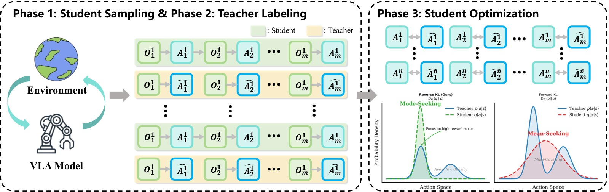
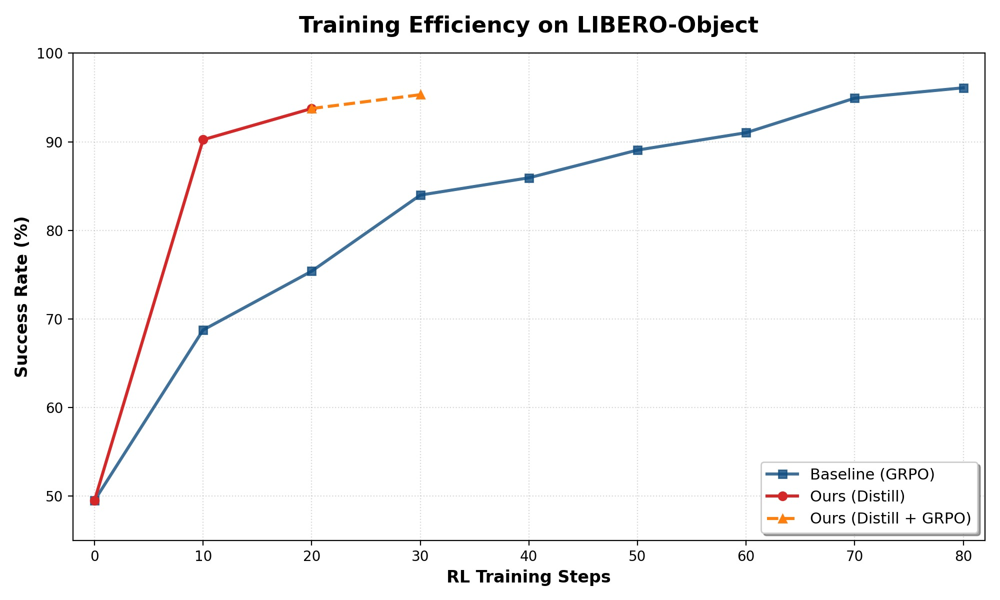
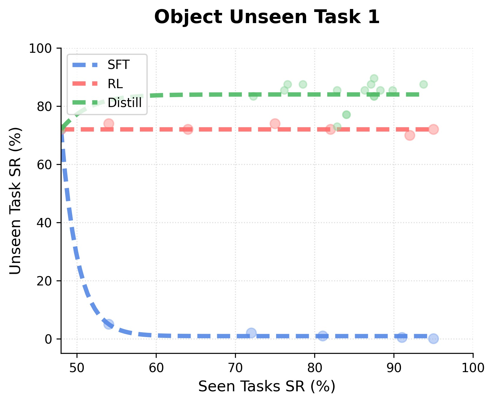
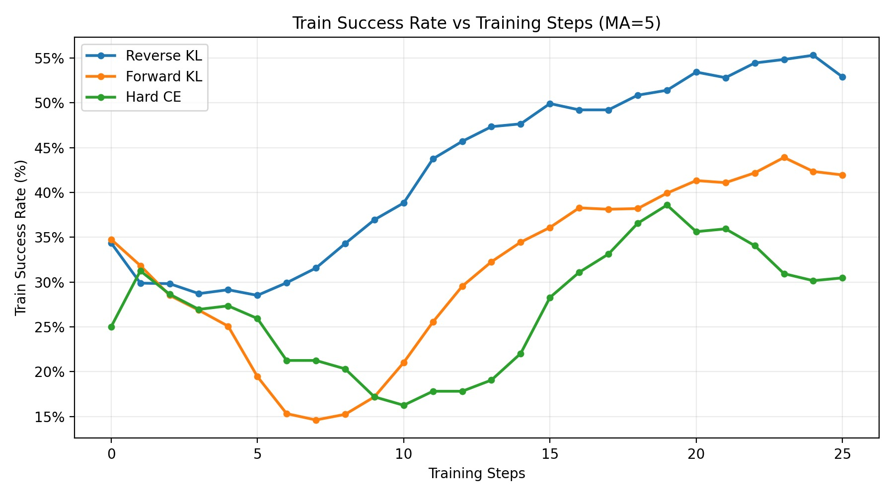
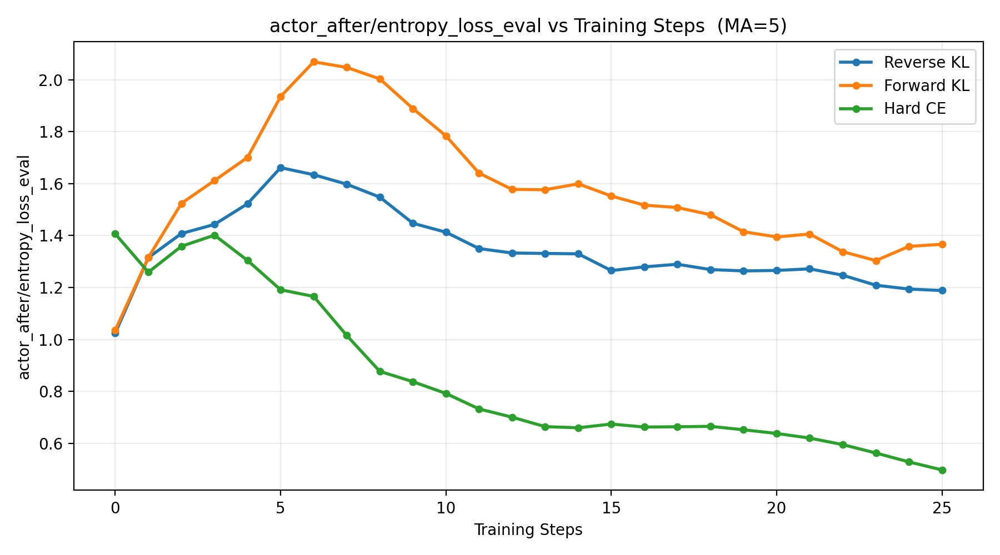
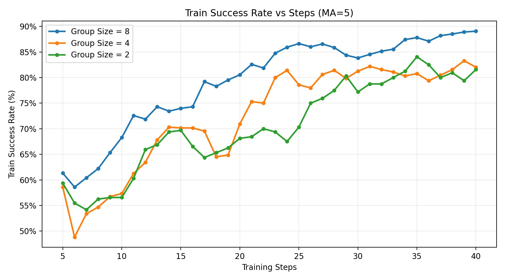

%% mathjax-macros
\data: \mathcal{D}
\traj: \tau
\loss: \mathcal{L}
\expected: \mathbb{E}
\real: \mathbb{R}
\sft: \mathrm{sft}
\eye: \mathbf{I}
%% end-mathjax-macros

# VLA-OPD: Bridging Offline SFT and Online RL for Vision-Language-Action Models via On-Policy Distillation

> **论文信息**
> - 作者：Zhide Zhong, Haodong Yan, Junfeng Li, Junjie He, Tianran Zhang, Haoang Li
> - 通讯作者：Haoang Li（HKUST (GZ)）
> - 投稿方向：ICML 2026（推测，模板风格与 ICML 一致）
> - arXiv ID：arXiv-2603.26666v1
> - 项目页面：https://irpn-lab.github.io/VLA-OPD/
> - 代码：尚未公开

---

## 一、核心问题

VLA（Vision-Language-Action）模型的预训练赋予了其强大的泛化能力，但**从预训练到可靠部署之间仍存在鸿沟**——需要对模型进行 post-training 以适应具体下游任务。当前 VLA post-training 的两大主流范式各有致命缺陷：

1. **离线 SFT（Supervised Fine-Tuning）**：在静态专家数据集上做行为克隆，收敛快、监督密集。但它是 **off-policy** 的——训练时见过的状态分布与部署时学生模型自己产生的状态分布不一致（distribution shift），导致**组合误差（compounding errors）**和**灾难性遗忘（catastrophic forgetting）**。

2. **在线 RL（Reinforcement Learning）**：让模型与环境交互，在 self-induced 的状态分布上优化。解决了 distribution shift，但依赖**稀疏的结果奖励**（任务成功=1，失败=0），导致**样本效率极低**，优化方差大。

> 直接套用 DAgger 类方法（在线收集学生轨迹 + 专家标注）也不行：如果用 Forward-KL 会导致 entropy explosion（模式覆盖），如果用 Hard-CE 会导致 premature entropy collapse（过早熵崩溃）。

**本文核心问题**：如何设计一个 post-training 框架，同时拥有 SFT 的**密集监督效率**和 RL 的**在线鲁棒性**？

---

## 二、核心思路 / 方法

VLA-OPD 的核心理念：**让学生模型在环境中自行探索，同时用冻结的专家模型为学生的每一步提供 token 级别的密集监督信号，并用 Reverse-KL 目标进行优化**。

### 2.1 总体架构



*图1：VLA-OPD 框架总览（三阶段闭环）。该图展示了 VLA-OPD 将离线 SFT 和在线 RL 统一为一个迭代蒸馏框架的完整流程。整个框架包含三种关键优化目标的行为对比（底部）：*

*上半部分展示三阶段训练流程：
**阶段 1 — 学生采样（Student Sampling）**：学生 VLA 策略在环境中交互，收集 on-policy 轨迹 rollout（O→A→O 循环）。学生模型基于有限的 SFT 初始化，频繁进入分布外（OOD）状态，明确暴露了 distribution shift 问题。
**阶段 2 — 教师标注（Teacher Labeling）**：对于学生访问的每一个状态，冻结的专家教师提供其动作分布的 logits 作为 token 级别的密集标签（Â），但教师不实际执行动作。这使得即使学生在错误状态中，也能获得"最优恢复行为"的监督信号。
**阶段 3 — 学生优化（Student Optimization）**：学生通过 Reverse-KL 目标向教师分布对齐，更新参数。*

*下半部分对比了三种对齐目标的行为差异：
左侧（Reverse-KL，本文方法）：bounded mode-seeking——学生选择教师概率质量最高的主模式，过滤掉教师的尾部不确定性（OOD 状态下的犹豫），同时保持足够的随机性。中间（Hard-CE，标准 DAgger）：强制匹配教师的 argmax 动作，在多模态决策边界教师 argmax 来回跳变时导致 premature entropy collapse，学生失去探索能力。右侧（Forward-KL，标准 SFT/蒸馏）：mode-covering——学生必须覆盖教师的整个支持集，在教师高熵的 OOD 状态中被迫模仿这种不确定性，导致 entropy explosion（策略过于弥散、失去精度）。*

### 2.2 三阶段训练流程

VLA-OPD 的每一次训练迭代包含三个阶段，如 Algorithm 1 所示：

#### 阶段 1：On-Policy 轨迹采样（解决 distribution shift）

抛弃静态离线数据集，改用当前学生策略 $\pi_\theta$ 在环境中采样：

$$\mathcal{D}_k = \{ \tau \mid \tau = (s_0, a_0, s_1, a_1, \dots, s_T) \}, \quad a_t \sim \pi_{\theta_k}(\cdot | s_t)$$

关键洞察：对于只经过 1 条轨迹 SFT 初始化的脆弱学生，它会频繁偏离专家路径进入 OOD 状态（failure states $s_{err}$）。VLA-OPD 显式捕获这些状态，将"未知的 OOD 区域"转化为"已知的训练数据"，实现从被动模仿到主动纠错的转变。

此外，因为梯度更新始终锚定在学生当前的行为流形上（on-policy distillation），不会像离线 SFT 那样强制拟合一个固定的、脱节的目标分布，从而实现了**温和对齐（gentle alignment）**，有效保留预训练的通用能力。

#### 阶段 2：密集教师监督（解决稀疏奖励）

对每个学生轨迹的每个时间步 $t$，查询冻结的教师模型 $\pi_{tea}$ 获得目标动作分布：

$$q_t(a) = \pi_{tea}(a | s_t)$$

这提供了 token 级别的密集监督信号（而非 RL 稀疏的 0/1 结果奖励），带来两个关键优势：
- 将延迟的 RL 信用分配问题转化为即时监督信号，极大加速收敛
- 教师在学生的 OOD 状态上也能提供结构化的知识（dark knowledge），传授最优恢复行为

#### 阶段 3：Mode-Seeking 优化（Reverse-KL 目标）

VLA-OPD 的核心技术贡献：使用 **Reverse-KL 散度**作为对齐目标。

将蒸馏形式化为 RL 问题——最大化负 Reverse-KL 散度：

$$\max_\theta \mathcal{J}(\theta) = \mathbb{E}_{s \sim \pi_\theta} \left[ - D_{KL}(\pi_\theta(\cdot|s) \parallel \pi_{tea}(\cdot|s)) \right]$$

在 token 级别，定义 intrinsic reward 为负 log-ratio：

$$r_t^{OPD}(s_t, a_t) = - \left( \log \pi_\theta(a_t | s_t) - \log \pi_{tea}(a_t | s_t) \right)$$

直观理解：这是一个**惩罚信号**——当学生的动作分布与教师匹配时，奖励接近 0；偏离越大，惩罚越重。计算梯度时对 reward 中的 $\log \pi_\theta$ 项使用 stop_gradient 操作。

**三种对齐目标的本质差异**（这是整篇论文最核心的理论贡献）：

| 目标 | 行为 | OOD 状态下的表现 | 问题 |
|------|------|-------------------|------|
| **Forward-KL** $D_{KL}(\pi_{tea} \parallel \pi_\theta)$ | Mode-covering（模式覆盖） | 学生被迫覆盖教师的整个分布支持集，包括教师犹豫不决的高熵尾部 | **Entropy explosion**：策略过于弥散，失去精度 |
| **Hard-CE**（argmax 匹配） | 刚性追踪教师的 top-1 动作 | 在多模态决策边界，教师 argmax 来回跳变，学生被迫暴力跟随 | **Premature entropy collapse**：学生失去动作多样性，陷入局部最优 |
| **Reverse-KL** $D_{KL}(\pi_\theta \parallel \pi_{tea})$ | Mode-seeking（模式追寻）| 只要学生的动作落在教师的可接受概率质量内，就不会被迫覆盖其他模式 | **Bounded entropy**：过滤噪音但保持充分随机性 |

> Reverse-KL 的 **zero-forcing** 特性是其成功的关键：学生选择了教师的一个主模式后，教师分布中概率为零的动作区域会对学生施加无穷大惩罚——这迫使学生在教师的"安全区域"内做出果断选择，而非犹豫不决。

### 2.3 基于组采样的梯度估计

为降低 on-policy 梯度的高方差，采用组采样策略：对每条指令采样 $G$ 条轨迹，在组内平均梯度：

$$\nabla_\theta \mathcal{J}(\theta) \approx \frac{1}{G} \sum_{i=1}^G \sum_{t=0}^T \nabla_\theta \log \pi_\theta(a_{t,i} | s_{t,i}) \cdot r_t^{OPD}(s_{t,i}, a_{t,i})$$

与 GRPO 不同，VLA-OPD 直接使用原始 Reverse-KL reward 作为 advantage 信号，无需额外的价值网络。

---

## 三、训练目标（详细）

- **主目标**：最大化负 Reverse-KL 散度，等价于最小化学生与教师在学生访问状态上的分布差异
- **Reward 定义**：$r_t^{OPD} = -(\log \pi_\theta(a_t|s_t) - \log \pi_{tea}(a_t|s_t))$，token 级别密集信号
- **Stop-Gradient**：reward 计算中的 $\log \pi_\theta(a_t|s_t)$ 项使用 stop_gradient，防止梯度通过 reward 项反向传播
- **初始化**：学生从 1 条轨迹 SFT 初始化（LIBERO）或 1000 条轨迹 SFT 初始化（RoboTwin2.0）
- **教师模型**：SimpleVLA-RL（经过 RL 训练的 OpenVLA），冻结参数
- **基础 VLA 架构**：OpenVLA-OFT（基于 Prismatic VLMs 的 VLA 模型）
- **可选后处理**：Distill + GRPO——蒸馏完成后可继续用 GRPO 做 RL 微调突破性能上限

---

## 四、实验与结果

### 4.1 实验设置

- **Benchmarks**：
  - LIBERO（Spatial、Object、Goal、Long 四个子套件，单臂操作）
  - RoboTwin2.0（4 个代表性双臂协调任务：Pick dual bottles、Place Empty Cup、Handover Block、Stack Bowls Two）
- **基线**：
  - 学生初始化（1-traj / 1000-traj SFT）
  - 在线 RL：GRPO（稀疏奖励）
  - 全量数据方法：Octo、OpenVLA、Nora、π₀+FAST（50 条 demo/任务）
- **超参数**：batch size=64，group size G=8

### 4.2 训练效率主结果



*图2：训练效率对比（LIBERO-Object 和 LIBERO-Long）。两个子图分别展示了 VLA-OPD 与基线 GRPO 在不同 benchmark 上的成功率随训练步数增长曲线。

**子图 (a) LIBERO-Object**：红色实线（Ours Distill）展示了"垂直起飞"式的收敛——仅 10 步内即达到 90% 以上成功率，而基线 GRPO（蓝色实线）需要渐进爬升。虚线橙色线（Ours Distill + GRPO）在蒸馏基础上进一步 RL 微调，最终突破 95%。

**子图 (b) LIBERO-Long**：这是最具说服力的对比——VLA-OPD 在 50 步内达到接近 80% 的成功率，而基线 GRPO 需要超过 150 步才能达到类似水平，**3 倍加速**。同时注意基线 GRPO 曲线呈现剧烈的锯齿波动（高方差优化），而 VLA-OPD 的曲线极其平滑——这归因于密集 token 级别监督替代稀疏结果奖励带来的优化稳定性。

两个子图共同说明：VLA-OPD 的密集教师监督从根本上解决了稀疏奖励 RL 的样本效率瓶颈，同时大幅降低了优化方差。*

### 4.3 LIBERO 策略效果主结果

**主结果表（Table 2）：**

| 方法 | Spatial | Object | Goal | Long | 平均 |
|------|:----:|:----:|:----:|:----:|:----:|
| *教师（参考）* | | | | | |
| SimpleVLA-RL | 94.2 | 96.1 | 94.6 | 90.7 | 93.9 |
| *全量数据方法（50-traj）* | | | | | |
| Octo | 78.9 | 85.7 | 84.6 | 51.1 | 75.1 |
| OpenVLA | 84.7 | 88.4 | 79.2 | 53.7 | 76.5 |
| Nora | 92.2 | 95.4 | 89.4 | 74.6 | 87.9 |
| π₀ + FAST | 96.4 | 96.8 | 88.6 | 60.2 | 85.5 |
| *数据稀缺方法（1-traj）* | | | | | |
| OpenVLA-OFT (Student Init.) | 63.6 | 54.9 | 59.6 | 17.3 | 48.9 |
| **VLA-OPD (Distill)** | **84.3** | **93.8** | **92.5** | **78.9** | **87.4** |
| **VLA-OPD (Distill + GRPO)** | **93.4** | **95.3** | **94.5** | **90.2** | **93.4** |

**关键发现**：

1. **从 48.9% → 87.4%（纯蒸馏）**：仅用 1 条轨迹 SFT 初始化，VLA-OPD 蒸馏后的性能已经超过多个使用全量数据（50 条 demo/任务）训练的基线方法（Octo 75.1%、OpenVLA 76.5%、π₀+FAST 85.5%），与 Nora（87.9%）持平。这证明了 on-policy 蒸馏在极端数据稀缺下的巨大优势。

2. **从 87.4% → 93.4%（+GRPO）**：蒸馏提供高质量 warm start 后，GRPO 仅需少量额外探索即可接近教师性能（93.4% vs 93.9%），几乎完全恢复教师能力。

3. **Long 任务收益最显著**：在 LIBERO-Long（长时序任务）上，学生初始化仅 17.3%，蒸馏后跃升至 78.9%，+GRPO 达 90.2%。这是因为长时序任务中的组合误差最严重，on-policy 纠错的价值最大。

### 4.4 RoboTwin2.0 双臂实验结果

**Table 3 结果：**

| 方法 | Pick dual bottles | Place Empty Cup | Handover Block | Stack Bowls Two | 平均 |
|------|:----:|:----:|:----:|:----:|:----:|
| *教师（参考）* | | | | | |
| SimpleVLA-RL | 68.3 | 94.2 | 57.8 | 75.8 | 74.0 |
| π₀ | 50.0 | 60.0 | 39.0 | 53.0 | 50.5 |
| RDT | 18.0 | 42.0 | 26.0 | 42.0 | 32.0 |
| OpenVLA-OFT (Student Init., 1000-traj) | 29.7 | 77.3 | 33.1 | 40.6 | 45.2 |
| **VLA-OPD (Distill)** | **66.4** | **90.6** | **52.3** | **75.0** | **71.1** |

**关键发现**：

1. **形态学泛化**：即使学生已经用 1000 条轨迹做 SFT 初始化（比 LIBERO 的 1-traj 强得多），在复杂双臂协调任务中仍平均只有 45.2%——这证明了 SFT 的分布偏移问题在复杂任务中更加突出。蒸馏后提升至 71.1%（+25.9%），近乎匹配教师（74.0%）。

2. **各个任务一致提升**：四个任务的成功率分别提升 36.7%、13.3%、19.2%、34.4%，证明方法对不同任务类型和难度均有效。

3. **大幅超越 SOTA 通用策略**：VLA-OPD 在双臂任务上远超 π₀（50.5%）和 RDT（32.0%），同时这些模型也是用大规模数据训练的。

### 4.5 灾难性遗忘分析



*图3：Seen-Unseen Trade-off 遗忘分析（四张子图）。通过在目标（seen）任务上微调，同时监控 4 个未参与训练的（unseen）任务上的成功率变化，评估不同方法对预训练通用能力的保留程度。每个点代表微调过程中的一个 checkpoint，横轴为 seen 任务成功率，纵轴为 unseen 任务成功率。理想情况是点在右上角区域（seen 和 unseen 都高）。

**子图 (a) Object Unseen Task 1**：离线 SFT（红色点）呈现显著的右下方趋势——seen 任务成功率在提升的同时，unseen 性能急剧下降至接近零，验证了灾难性遗忘。而 RL（绿色）和 VLA-OPD（蓝色）两种基于 on-policy 数据的方法在整个微调过程中 unseen 性能几乎不变。VLA-OPD 在 seen 任务上的提升幅度大于 RL。

**子图 (b) Object Unseen Task 2**：离线 SFT 同样表现出遗忘崩溃。RL 和 VLA-OPD 均良好保留 unseen 能力，此任务上 RL 略优于 VLA-OPD。

**子图 (c) Spatial Unseen Task 1** 和 **(d) Spatial Unseen Task 2**：趋势一致——离线 SFT 遗忘严重，on-policy 方法基本保留。VLA-OPD 和 RL 表现相当。

四个子图的一致性结论：**on-policy 数据本身就是缓解灾难性遗忘的关键**。因为梯度更新始终锚定在学生自己的行为流形上，参数更新"温和"且局部，不会像离线 SFT 那样为了拟合一个完全不同的分布而大幅覆盖预训练权重。这对持续学习（continual/lifelong learning）场景意义重大。*

### 4.6 消融实验

#### 对齐目标消融：Reverse-KL vs Forward-KL vs Hard-CE



*图4：三种对齐目标的训练成功率对比（RoboTwin2.0 Beat Block Hammer 任务）。
**Forward-KL（橙色）**：训练早期出现严重的"性能谷"——成功率暴跌超过 50%。这是因为初期学生频繁进入 OOD 状态，教师在这些状态上表现出高熵（不确定），Forward-KL 的 mode-covering 特性迫使学生模仿这种犹豫不决，导致策略严重退化。
**Hard-CE（绿色）**：虽然没有暴跌，但最终 plateau 在最低的成功率水平。这是因为丢弃了教师的 soft probabilities（dark knowledge），在多模态决策边界上教师的 argmax 可能震荡，学生被迫暴力追踪这些刚性目标，过早熵崩溃，失去探索能力。
**Reverse-KL（蓝色）**：稳定且持续提升，最终达到最高成功率。bounded mode-seeking 特性使其优雅地避免了两者的极端。*



*图5：三种对齐目标的 actor 策略熵对比（与图4同一实验）。这张图是图4中性能差异的**因果解释**。
**Forward-KL（橙色）**：熵值爆炸式增长（orange curve 快速上升），验证了 mode-covering 导致策略过于弥散、失去精确性的理论预测。
**Hard-CE（绿色）**：熵值过早且剧烈下降至接近零（green curve 快速下降），验证了 premature entropy collapse——学生失去了动作多样性，无法有效探索状态空间，被锁死在局部最优。
**Reverse-KL（蓝色）**：熵值保持在一个健康、稳定的中等水平（blue curve 平稳）。既不过于弥散（保持精确性），也不过于确定性（保持探索能力）。这是 bounded mode-seeking 的直接实证——过滤教师的尾部噪音，但在主模式内保留充分随机性。*

#### 组采样大小 G 消融



*图6：组采样大小 G 的消融实验（LIBERO-Object，固定 batch size=32）。
横轴为训练步数，纵轴为成功率。
**G=8（蓝色）**：最高最终成功率（~89%），优化曲线最平滑，因为更大的组提供了更稳健的蒙特卡洛近似来平均环境随机性。
**G=4（橙色）**：性能和 G=8 接近，优化曲线略嘈杂但仍快速收敛。
**G=2（绿色）**：仍能稳步提升至 80% 以上，没有性能崩塌。

关键发现：**即使 G=2，性能也是可用的**。这在实践中极为重要——组大小为 2 意味着环境 rollout 和教师推理的计算开销减半（相比 G=4）或减至 1/4（相比 G=8），大幅降低 wall-clock 时间。理论解释：VLA-OPD 的 Reverse-KL reward 本身就是高质量的 token 级别密集信号，不需要大组来平均噪声，信号噪声比即使在小组大小下也足够。*

---

## 五、关键洞察与技术亮点

1. **"蒸馏即纠错"范式**：传统蒸馏是知识压缩，VLA-OPD 将蒸馏重新定义为**主动纠错**——学生在环境中犯错 → 教师在学生的错误状态上提供恢复指导 → 学生学会从错误中恢复。这比被动模仿专家轨迹从根本上更鲁棒。

2. **Reverse-KL 的 bounded mode-seeking**：这是全文最核心的技术洞察。在 OOD 状态下，教师自己也不确定（高熵），此时不应该强制学生模仿这种不确定（Forward-KL 的熵爆炸），也不应该随意选一个动作（Hard-CE 的熵崩溃），而应该**让教师在学生的当前行为区域内提供"就近指导"**——Reverse-KL 的 zero-forcing 特性恰好实现了这一点。

3. **On-policy data 是缓解遗忘的核心**：消融实验清晰表明，on-policy 数据收集本身就是保留预训练能力的关键，而不仅仅是蒸馏目标的选择。梯度更新始终在学生自己的行为流形上进行，不会剧烈偏离预训练参数。

4. **密集监督打破样本效率瓶颈**：RL 的样本效率瓶颈根本原因不是探索本身，而是**信用分配**——稀疏的结果奖励无法告诉模型"轨迹中哪一步导致了失败"。VLA-OPD 用 token 级别的教师监督消除了这个问题，本质上是用计算（教师推理）换样本效率。

5. **三阶段解耦设计**：采样（学生）、标注（教师）、优化（目标函数）三者完全解耦，每部分都可独立替换——换更强大的教师、换更高效的采样策略（如 RRT-guided exploration）、换不同的优化目标（如 Jensen-Shannon divergence），都不影响框架结构。

6. **蒸馏 + RL 的协同效应**：纯蒸馏提供高质量 warm-start（快速达到 87.4%），后续 RL 突破天花板（到 93.4%）——蒸馏解决了 RL 的冷启动问题，RL 解决了蒸馏的教师依赖问题。这种"蒸馏先行、RL 打磨"的组合可能成为 VLA 部署的标准流程。

---

## 六、模型实例化与技术细节

### 6.1 模型组成

```
┌──────────────────────────────────────────────────────────────────┐
│                        VLA-OPD 训练框架                            │
├──────────────────────────────────────────────────────────────────┤
│                                                                    │
│  ┌─────────────────────── 迭代循环 ───────────────────────────┐   │
│  │                                                              │   │
│  │  Phase 1: 学生采样 (On-Policy)                               │   │
│  │  ┌──────────┐    ┌──────────┐    ┌──────────────────┐      │   │
│  │  │ Language │    │ Student  │    │  Environment      │      │   │
│  │  │ Instr.   │───▶│ π_θ      │───▶│  o_t → a_t → o_t+1│     │   │
│  │  │ + Image  │    │(OpenVLA) │    │  (Trajectory τ)   │      │   │
│  │  └──────────┘    └──────────┘    └────────┬─────────┘      │   │
│  │                                            │                 │   │
│  │  Phase 2: 教师标注 (Dense Supervision)      │                 │   │
│  │  ┌──────────────────────────────────┐      │                 │   │
│  │  │  Frozen Teacher π_tea            │◀─────┘                 │   │
│  │  │  (SimpleVLA-RL)                  │                        │   │
│  │  │  对每个 s_t 输出动作分布 q_t(a)     │                        │   │
│  │  └────────────────┬─────────────────┘                        │   │
│  │                   │ token-level logits                        │   │
│  │  Phase 3: 优化 (Mode-Seeking)         ▼                       │   │
│  │  ┌────────────────────────────────────────────┐              │   │
│  │  │  r_t = -(log π_θ(a_t|s_t) - log π_tea(a_t|s_t))         │   │
│  │  │  ∇J = Avg over G trajectories × Σ_t ∇log π_θ · r_t      │   │
│  │  │  θ ← θ + α · ∇J                                         │   │
│  │  └────────────────────────────────────────────┘              │   │
│  └──────────────────────────────────────────────────────────────┘   │
│                                                                    │
│  ┌────────────────────────────────────────────────────────────┐   │
│  │  关键设计决策                                                │   │
│  │  ┌──────────────────┬─────────────────────────────────┐    │   │
│  │  │ Stop-Gradient    │ reward 中的 log π_θ 不反向传播    │    │   │
│  │  │ Group Sampling   │ G=8 (主实验), G=2 也可用          │    │   │
│  │  │ Init             │ 1-traj SFT → 快速暴露 OOD 状态    │    │   │
│  │  │ Optional         │ Distill → +GRPO → 突破天花板      │    │   │
│  │  └──────────────────┴─────────────────────────────────┘    │   │
│  └────────────────────────────────────────────────────────────┘   │
└──────────────────────────────────────────────────────────────────┘
```

### 6.2 推理流程（部署时）

```
训练流程 (每次迭代):

时间 ──────────────────────────────────────────────────────▶

  Phase 1:                  Phase 2:               Phase 3:
  G 条并行 rollout          逐帧查询教师            梯度累积 + 更新
  
  Env 1: τ_1 → s_0,a_0,    π_tea(s_0) → q_0       ∇θ = Σ_{i,t} ∇log π_θ · r_t
             s_1,a_1,...    π_tea(s_1) → q_1       
  Env 2: τ_2 → ...                ...               θ ← θ + α · ∇θ
    ...
  Env G: τ_G → ...

  学生策略随训练逐步改进: π_{θ_0} → π_{θ_1} → π_{θ_2} → ... → π_{θ_final}
  教师始终冻结不变: π_tea (frozen throughout)
```

### 6.3 关键设计决策

| 设计点 | 选择 | 理由 |
|--------|------|------|
| 对齐目标 | Reverse-KL | bounded mode-seeking，避免熵极端 |
| 监督信号 | Token 级别 logits | 消除信用分配问题，密集指导 |
| 数据来源 | On-policy 采样 | 消除 distribution shift，缓解遗忘 |
| 教师角色 | 冻结（提供 logits） | 知识源稳定，不受学生更新影响 |
| Gradient 计算 | stop_gradient on reward | 防止 reward 信号反向影响学生 logits |
| 组采样 | G=8（灵活可调） | 平衡梯度方差和计算效率 |
| 初始化策略 | 极少量 SFT (1-traj) | 故意让学生脆弱 → 暴露更多 OOD 状态供学习 |
| 可选的 RL 后处理 | Distill + GRPO | 蒸馏做 warm-start，RL 突破天花板 |

---

## 七、局限性与未来工作

1. **依赖教师模型**：VLA-OPD 假设有一个高性能的专家教师可用。虽然如今开源 VLA checkpoint 和 API 越来越普遍，但在教师不可用的全新任务上，本框架无法直接应用。未来工作方向：减少对特定教师模型的依赖，例如用 self-play 或 ensemble 方法生成伪教师信号。

2. **教师成本**：每个学生轨迹的每个时间步都要查询教师模型的前向传播来获取 logits。对于大型 VLA 模型（如 7B+ 参数），单条轨迹的教师推理可能成为计算瓶颈。G=2 的部分缓解提供了一个实用折中。

3. **教师-学生能力差距**：当教师和学生能力差距极大时（如教师 RL 训练的 vs 学生随机初始化），Reverse-KL 的 mode-seeking 可能导致学生过早收敛到教师的一个次优子模式。本文用 1-traj SFT 初始化部分缓解了这个问题。

4. **任务多样性**：实验覆盖了单臂（LIBERO）和双臂（RoboTwin2.0）场景，但任务类型主要集中在桌面操作。更广泛的场景（移动操作、人机交互、长时间自主作业）有待验证。

5. **RL 后处理的必要性**：虽然纯蒸馏已经很强（87.4%），但要接近教师性能（93.9%）仍需 RL 后处理。如何让蒸馏本身就能完全恢复教师性能而不依赖后续 RL，是值得探索的方向。

---

## 八、关键概念速查

| 概念 | 含义 |
|------|------|
| **VLA-OPD** | On-Policy VLA Distillation，在线策略 VLA 蒸馏框架 |
| **On-Policy Distillation** | 在学生 self-generated 的轨迹上蒸馏教师知识，而非离线数据集 |
| **Reverse-KL** | $D_{KL}(p_\theta \parallel p_{tea})$，具有 mode-seeking 和 zero-forcing 特性 |
| **Forward-KL** | $D_{KL}(p_{tea} \parallel p_\theta)$，具有 mode-covering 和 mass-covering 特性 |
| **Hard-CE** | 仅匹配教师 argmax 动作的交叉熵，丢弃 soft probabilities（dark knowledge） |
| **Entropy Explosion** | Forward-KL 在 OOD 状态下的失败模式：策略过度弥散、失去精确性 |
| **Entropy Collapse** | Hard-CE 的失败模式：策略过早失去多样性、陷入局部最优 |
| **Bounded Mode-Seeking** | Reverse-KL 的理想行为：果断但不盲目，过滤噪音但保留随机性 |
| **Student/Teacher** | 学生是需要训练的 VLA 模型，教师是冻结的专家参考模型 |
| **Distribution Shift** | 训练状态分布（专家）与测试状态分布（学生自生成）的不匹配 |
| **Catastrophic Forgetting** | 微调后失去预训练通用能力的现象 |
| **Stop-Gradient** | 梯度计算中阻止 reward 项中的 $\log \pi_\theta$ 反向传播 |
| **Group Sampling** | 同一指令采样多条轨迹用于梯度估计，降低方差 |
| **GRPO** | Group Relative Policy Optimization，RL 基线方法，使用稀疏结果奖励 |
| **3× Speedup** | LIBERO-Long 上达到 ~80% 成功率的速度：50 步 vs 150+ 步 |
| **Data-Scarce (1-traj)** | 每任务仅用 1 条专家演示初始化，极端数据稀缺设置 |
