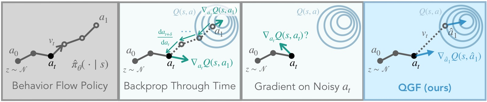
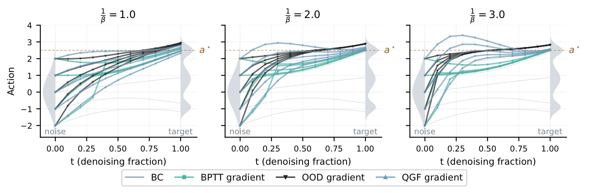
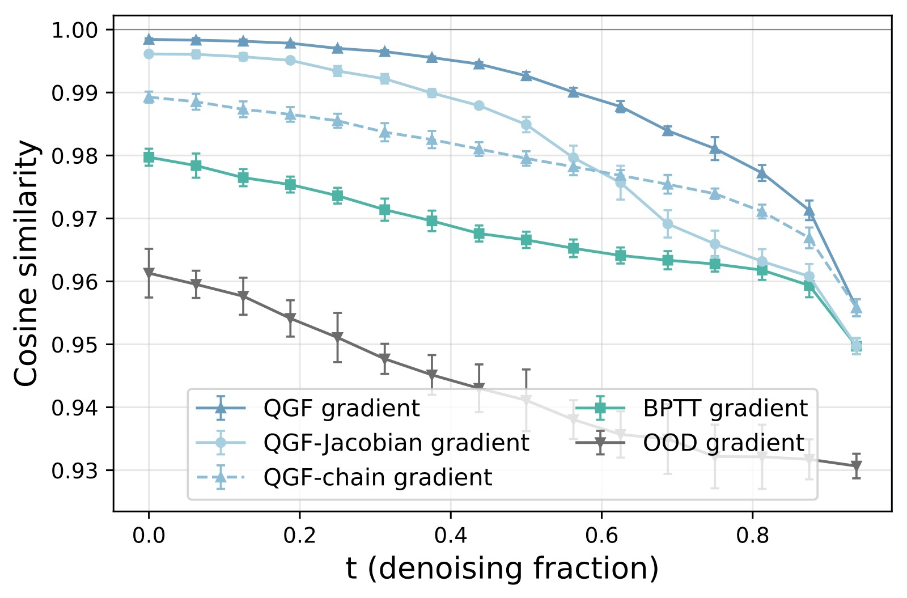
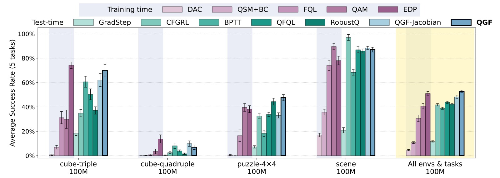
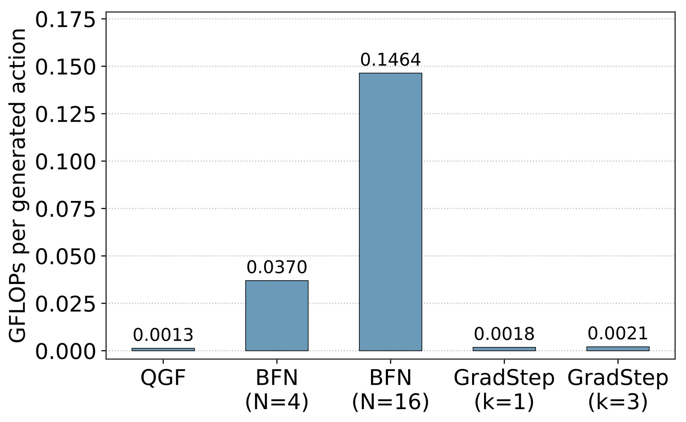
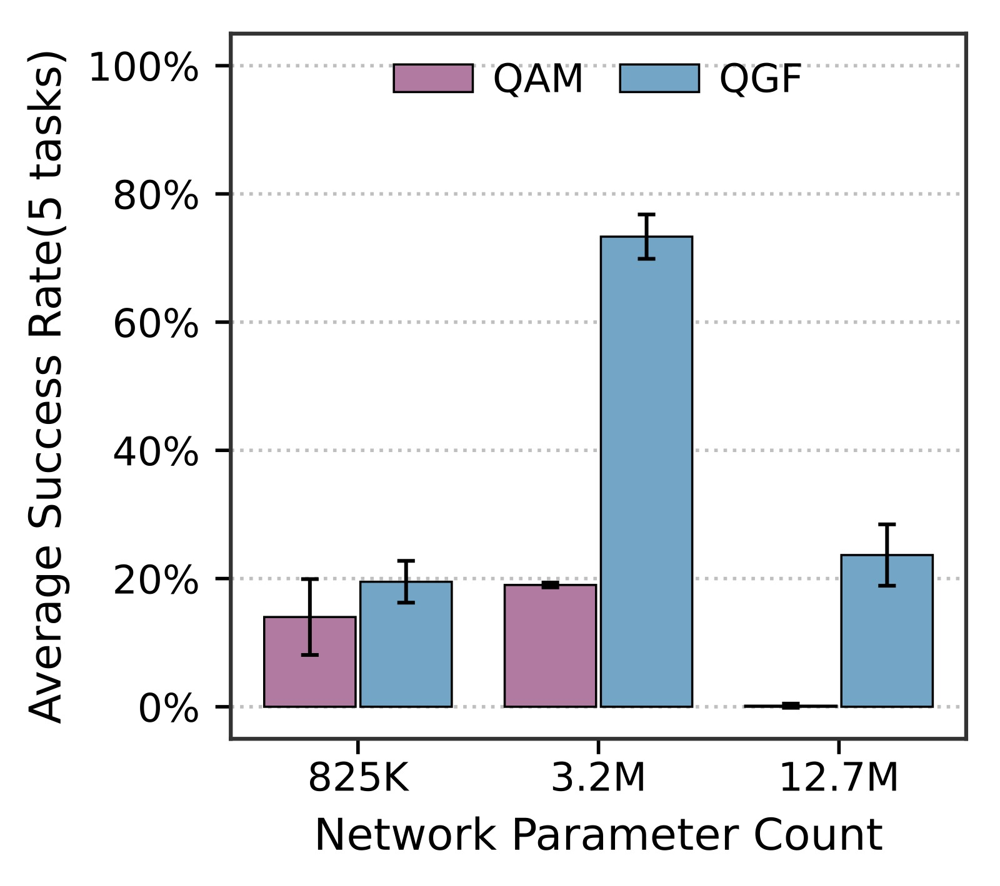
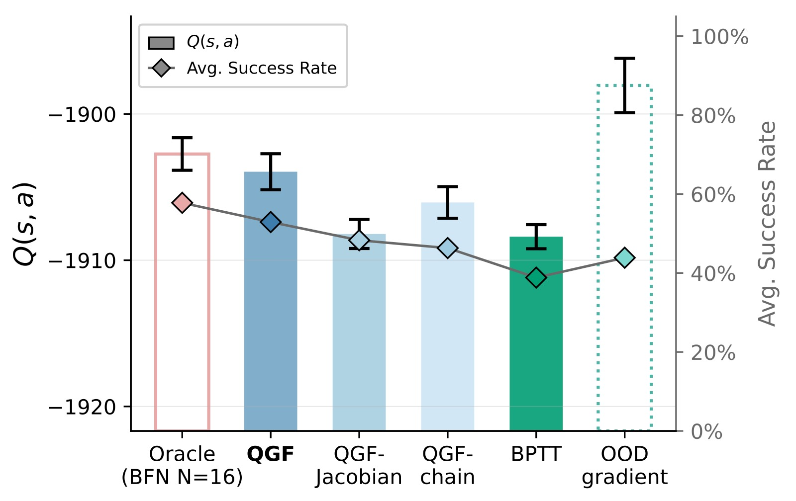

<!-- arxiv: 2606.11087 -->
<!-- venue: arXiv 2026（投稿中） -->
<!-- tags: 强化学习, 扩散模型, 离线RL, Flow Matching -->

%% mathjax-macros
%% end-mathjax-macros

# QGF: Test-Time Gradient Guidance of Flow Policies in Reinforcement Learning

> **论文信息**
> - 作者：Zhiyuan Zhou (UC Berkeley), Andy Peng (UC Berkeley), Charles Xu (UC Berkeley), Qiyang Li (UC Berkeley), Tobias Springenberg (Physical Intelligence), Kevin Frans (UC Berkeley), Sergey Levine (UC Berkeley & Physical Intelligence)
> - 通讯作者：Sergey Levine (UC Berkeley & Physical Intelligence)
> - 投稿方向：arXiv 预印本（使用 berkeley-paul 模板）
> - arXiv ID：arXiv-2606.11087v1
> - 代码：https://github.com/zhouzypaul/qgf

---

## 一、核心问题

Flow matching 和 diffusion 策略是当前机器人操控（特别是 scaling imitation learning）的核心技术栈。它们在**监督学习**（行为克隆 BC）中 scale 得非常稳定，但一旦**纳入 RL pipeline** 做 policy improvement，就面临严重问题：

1. **训练不稳定**：标准的 actor-critic RL 需要交替更新 actor（最大化 Q）和 critic（TD learning），这种耦合训练对超参数极其敏感，容易发散。
2. **BPTT 的高开销和高方差**：要让 flow/diffusion 策略做 RL，现有方法要么设计特殊训练目标（如蒸馏 one-step policy），要么通过多层去噪步骤反向传播梯度（BPTT），后者计算量大且数值不稳定。
3. **OOD gradient 误导**：直接在未去噪的"噪声动作" $a_t$ 上取 critic gradient $\nabla_{a_t} Q(s, a_t)$ 会导致偏差，因为 critic 只在完全去噪的动作上训练过。

QGF 的核心问题是：**能不能完全不在训练期做 policy optimization，只在推理时用 critic gradient 引导 flow 的去噪过程，从而避开上述所有问题？**

---

## 二、核心思路 / 方法

### 2.1 总体思想

QGF（Q-Guided Flow）的核心理念：**训练和推理完全解耦**。

- **训练时**：策略 $\hat{\pi}$ 只用 BC（flow matching loss）训练 → 稳定如常。Critic $Q(s,a)$ 用 IQL（in-sample learning）单独训练 → 同样稳定。
- **推理时**：Flow 去噪的每一步，额外加一个 critic gradient 项来引导动作朝向高 Q 值方向：

$$a_{t+\delta} = a_t + \delta \cdot \left(v_\theta(s, a_t, t) + \frac{1}{\beta} \underbrace{\nabla_{\hat{a}_1} Q(s, \hat{a}_1)}_{\text{QGF 梯度估计器}}\right)$$

其中 $\beta$ 控制 KL 正则化强度（$\beta$ 越小 guidance 越强）。



*图1：QGF 的核心推理流程。图中展示了从噪声分布到目标动作分布的 flow denoising 过程，以及 QGF 如何用 critic gradient 引导每个去噪步。左侧：BC flow policy 的正常去噪轨迹。右侧：QGF 在每个去噪步加入 critic gradient guidance（红色箭头），将噪声动作逐步推向高 Q 值区域。关键创新在于梯度估计器的设计——用单步 Euler 近似 â₁ 并在其上取 ∇Q，避免了在噪声动作上取梯度的偏差（OOD gradient）和完整反向传播的高开销（BPTT）。*

### 2.2 总体架构（ASCII）

```
┌────────────────────────────────────────────────────────────────┐
│                        QGF 推理流程                              │
├────────────────────────────────────────────────────────────────┤
│                                                                 │
│  训练阶段（只做一次）                                             │
│  ┌──────────────┐     ┌──────────────┐                          │
│  │ Flow Policy  │     │   IQL Critic │                          │
│  │   v_θ(s,a,t) │     │    Q(s,a)    │                          │
│  │   BC 训练    │     │   TD 学习    │                          │
│  └──────┬───────┘     └──────┬───────┘                          │
│         │                    │                                   │
│         └────────┬───────────┘                                   │
│                  │ 互不依赖、独立训练                              │
│                  │                                               │
│  ════════════════╪═══════════════════════════════════════════    │
│                  │  推理阶段（每次推理都执行）                      │
│                  ▼                                               │
│  ┌──────────────────────────────────────────────┐               │
│  │         Flow Denoising Loop (T steps)        │               │
│  │                                              │               │
│  │  a_0 ~ N(0, I)                               │               │
│  │  for t = 0, δ, 2δ, ..., 1-δ:                 │               │
│  │     ┌──────────────────────────┐              │               │
│  │     │ 1. â₁ = a_t + (1-t)·v_θ  │ ← 单步Euler  │               │
│  │     │    近似完全去噪动作       │   近似去噪   │               │
│  │     └──────────┬───────────────┘              │               │
│  │                │                              │               │
│  │     ┌──────────▼───────────────┐              │               │
│  │     │ 2. g = ∇Q(s, â₁)         │ ← 在干净动作  │               │
│  │     │    J ≈ I (丢 Jacobian)    │   上取梯度   │               │
│  │     └──────────┬───────────────┘              │               │
│  │                │                              │               │
│  │     ┌──────────▼───────────────┐              │               │
│  │     │ 3. a_{t+δ} = a_t +       │              │               │
│  │     │    δ·(v_θ + (1/β)·g)     │ ← 引导去噪   │               │
│  │     └──────────────────────────┘              │               │
│  │                                              │               │
│  │  return a₁  ← 最终动作 (action chunk)         │               │
│  └──────────────────────────────────────────────┘               │
│                                                                 │
└────────────────────────────────────────────────────────────────┘
```

### 2.3 关键模块拆解

#### 2.3.1 三种梯度估计器对比

| 估计器 | 公式 | 问题 |
|--------|------|------|
| **OOD gradient** | $\nabla_{a_t} Q(s, a_t)$ | critic 未在噪声动作上训练，梯度有偏差，会引导到 OOD 动作 |
| **BPTT gradient** | $\nabla_{a_t} Q(s, \text{ODE}(a_t))$ | 需反向传播整条去噪链，昂贵且高方差 |
| **QGF gradient (本文)** | $\nabla_{\hat{a}_1} Q(s, \hat{a}_1)$ 其中 $\hat{a}_1 = a_t + (1-t)v_\theta$ | 单步 Euler 近似 + J≈I，低方差，便宜 |



*图2：1D 去噪示意——将高斯噪声映射到三模态目标分布，Q 函数定义为到最优动作 a\* 的负 L2 距离。横轴为动作空间（x），纵轴为概率密度。四列分别对应：(a) 无 guidance 的 BC flow——覆盖全部三个 mode；(b) OOD gradient guidance——无论 guidance weight 多大，总将去噪引向次优动作，原因是 ∇Q(a_t) 在噪声动作上不可靠；(c) BPTT gradient guidance——方向基本正确（接近 a\*），但存在明显不稳定性（见论文 Fig.6 的 BPTT 不稳定案例）；(d) QGF gradient guidance——稳定收敛到全局最优 a\*，且随 guidance weight 增大单调改善。这是 QGF 核心设计的最直观证据：在近似干净动作上取梯度 + 丢 Jacobian > 完整反向传播 > 在噪声动作上取梯度。*

#### 2.3.2 单步 Euler 近似

$$\hat{a}_1 = a_t + v_\theta(s, a_t, t) \cdot (1-t)$$

不去运行完整的 ODE 积分链，而是沿当前速度方向做一个大步 Euler 步。**反直觉的发现**：这种近似不仅更便宜，而且实际上比完整去噪链效果更好——因为完整去噪太受限于 BC 训练分布，单步近似允许从数据分布中选更好的 mode。

#### 2.3.3 丢 Jacobian (J ≈ I)

完整链式法则需要 Jacobian $J = \frac{\partial \hat{a}_1}{\partial a_t}$，但 QGF 直接用 $J \approx I$。理由：
- Jacobian 需要微分过 $v_\theta$，早期去噪步近似粗糙时可能 ill-behaved
- 包含 Jacobian 会使梯度对噪声更敏感（方差更大）
- 实验证明 J≈I 反而得到了更好的 Q 值优化效果

```text
完整链式法则: ∇_{a_t} Q = J^T · ∇_{â₁} Q        (J = ∂â₁/∂a_t)
QGF 近似:     ∇_{a_t} Q ≈ I · ∇_{â₁} Q = ∇_{â₁} Q
```



*图3：不同梯度估计器对输入噪声的敏感度。横轴为对 a_t 添加的扰动 ε 的标准差（σ），纵轴为 cosine similarity：cos(G(s, a_t), G(s, a_t + ε))。值越接近 1 表示梯度估计器对噪声越不敏感。四条曲线分别对应：(1) QGF（蓝色）：cosine similarity 最高、衰减最慢——在所有 σ 水平下都是最鲁棒的估计器；(2) QGF-chain（完整 ODE 链 + J≈I）：敏感度略高于 QGF；(3) QGF-Jacobian（含 Jacobian）：敏感度明显更高，验证了 J≈I 降低方差的设计动机；(4) BPTT：敏感度最高、衰减最快，说明通过完整去噪链反向传播的梯度估计是最不稳定的。该图在 20 个 OGBench 任务 × 4 seeds 上平均，是 QGF 低方差设计的最有力实证。*

---

## 三、训练目标（详细）

### 3.1 Reference Policy 训练

标准的 flow matching BC loss，完全没有 RL 成分：

$$\mathcal{L}_{\text{FM}}(\theta) = \mathbb{E}_{t \sim \mathcal{U}[0,1], x_0 \sim \mathcal{N}(0,I), x_1 \sim \mathcal{D}}\left[\left\| v_\theta(x_t, t) - (x_1 - x_0) \right\|^2_2\right]$$

其中 $x_t = (1-t)x_0 + tx_1$（线性插值），条件于状态 $s$。

### 3.2 Critic 训练

使用 **IQL (Implicit Q-Learning)**，一个纯 in-sample 的 value learning 方法：

- **Q loss**: $\mathcal{L}_Q(\phi) = \mathbb{E}_{(s,a,r,s')\sim\mathcal{D}}[(r(s,a) + \gamma V_\psi(s') - Q(s,a))^2]$
- **V loss**: $\mathcal{L}_V(\psi) = \mathbb{E}_{(s,a)\sim\mathcal{D}}[L_2^\tau(Q(s,a)-V_\psi(s))]$

其中 $L_2^\tau$ 是 expectile regression（$\tau=0.9$），对高 Q 值赋予更大权重。

选择 IQL 的关键原因：可以完全解耦 value learning 和 policy extraction——V/Q 训练完全不依赖策略采样。

### 3.3 推理时 Guidance

只有推理时需要调的超参数：**guidance weight** $\tau_g = 1/\beta$（0.004 ~ 0.12）。

$$a_{t+\delta} = a_t + \delta \cdot \left(v_\theta(s, a_t, t) + \tau_g \cdot \nabla_{\hat{a}_1} Q(s, \hat{a}_1)\right)$$

### 3.4 关键超参数

| 参数 | 值 | 说明 |
|------|-----|------|
| Batch size | 1024 | 标准 |
| Discount γ | 0.999 | 长 horizon |
| Action chunk h | 5 | 一次预测 5 步动作序列 |
| Flow steps | 10 | 去噪步数 |
| Training steps | 500k | 单任务 RL |
| Critic network | [1024, 1024, 1024, 1024] | 4 层 MLP |
| Actor network | [1024, 1024, 1024, 1024] | 4 层 MLP |
| Critic ensemble | 2 (取 min) | 防 overestimation |
| IQL expectile τ | 0.9 | 偏向高 Q 值 |

---

## 四、实验与结果

### 4.1 实验设置

- **环境**：OGBench（manipulation 仿真环境），7 个 domain × 5 tasks = 35 任务
  - scene, puzzle-4x4 (p44), puzzle-4x5 (p45), puzzle-4x6 (p46)
  - cube-triple (c3), cube-quadruple (c4), cube-octuple (c8)
- **数据集规模**：100M transitions（主实验），部分任务用 1B
- **Action chunking**：chunk size = 5，即一次输出 5 步动作序列 → 高维动作空间
- **评测**：10 seeds × 10 episodes

### 4.2 Baseline

**Test-time 方法（策略只用 BC 训练）：**
- **BFN**: 采样 N 个动作选 Q 值最高的
- **GradStep**: 对完全去噪的动作做梯度上升
- **QFQL**: 在噪声动作 $a_t$ 上取 OOD gradient
- **BPTT**: 通过完整去噪链反向传播
- **CFGRL**: 训练 optimality-conditioned 策略 + classifier-free guidance
- **RobustQ**: 训练能接受噪声动作输入的"鲁棒"Q 函数

**Training-time 方法（策略用 RL 目标训练）：**
- **FQL**: 蒸馏 one-step 策略
- **EDP**: 一阶 Euler 近似 + policy gradient
- **QAM**: adjoint matching
- **DAC**: 扩散模型匹配 Q-tilted 分布
- **QSM+BC**: score matching + BC 正则化

### 4.3 主要结果

**Figure 4 (main results, 20 tasks, 10 seeds):**

| 类别 | 方法 | 性能 |
|------|------|------|
| Test-time | **QGF** | **最优** |
| Test-time | QGF-Jacobian | 次优 |
| Test-time | BPTT / QFQL / RobustQ | 显著低于 QGF |
| Test-time | GradStep / CFGRL | 效果有限 |
| Train-time | EDP | 与 QGF 竞争，略低 |
| Train-time | FQL / QAM / DAC / QSM+BC | 低于 QGF |

**关键发现**：
1. QGF 显著超越所有 test-time 方法（包括 QFQL、BPTT、RobustQ），验证了 QGF 梯度估计器设计的关键作用
2. QGF 超越大多数 training-time 方法，与最强的 EDP 竞争（EDP 也用一阶 Euler 近似，侧面验证了这种近似设计的有效性）
3. QGF > QGF-Jacobian，证明丢 Jacobian 是更好的选择



*图4：离线 RL 性能对比（500k 训练步，20 任务 × 10 seeds）。纵轴为 normalized score（成功率），横轴为各方法。红色虚线左侧为 training-time 方法（FQL、EDP、QAM、DAC、QSM+BC），右侧为 test-time 方法（CFGRL、GradStep、QFQL、BPTT、RobustQ、QGF-Jacobian、QGF（蓝色高亮））。(1) QGF 在所有 test-time 方法中性能最优，显著超越 QFQL 和 BPTT——这验证了 QGF 梯度估计器设计的关键性；(2) QGF 与最强 training-time 方法 EDP 竞争（EDP 也用一阶 Euler 近似），且超越 FQL、QAM、DAC 等复杂训练方法；(3) QGF > QGF-Jacobian：丢 Jacobian 在所有 20 任务上平均更好；(4) Training-time 方法之间的性能方差远大于 test-time 方法——test-time 方法只需调 guidance weight，training-time 方法需要同时调 BC 权重、RL 学习率等多个耦合超参数。详见 fig/results_expanded.jpg 中的逐任务 breakdown。*

### 4.4 Test-Time Compute Scaling

**Figure 5 (compute cost & BFN comparison):**

- QGF 的 FLOPs 比 BFN (N=4) 低**数个量级**，但性能更好
- QGF+BFN (N=4) 能达到 BFN (N=16) 的性能，用更少的 compute budget
- BFN (N=16) 与 QGF 持平，但需要 16× 的采样和去噪开销



*图5：左子图：不同 test-time 方法的 FLOPs 开销对比（对数坐标）。BFN 需要多次完整去噪，FLOPs 比 QGF 和 GradStep 高数个量级。右子图：QGF vs BFN 的性能对比（500k 训练步，20 任务 × 10 seeds）。QGF（无 BFN）已经优于 BFN (N=4)，QGF+BFN (N=4) 性能匹配 BFN (N=16) 而 test-time compute 仅为 1/4。详见 fig/bfn_results_expanded.jpg 的逐任务 breakdown。*

### 4.5 Goal-Conditioned RL & 模型 Scaling

**Figure 6 (DQC results, 25 tasks):**

| 任务难度 | QGF 表现 |
|---------|---------|
| p45 (简单) | 略低于 QFQL |
| c3, c4, p46, c8 (中-难) | **持续最优** |

- 最难任务上 QGF 持续 > QGF-Jacobian，再次验证 J≈I 的价值

**Figure 7 (Model size scaling, c3):**

| 参数量 | QAM (train-time) | QGF (test-time) |
|--------|:---:|:---:|
| 800K | baseline | baseline |
| 3.2M | 无提升 | **~4× 性能提升** |
| 12.7M | 退化（不能完成任务） | 轻微退化，仍可用 |

核心发现：QGF 随模型增大持续受益，而 training-time 方法则因 actor-critic 不稳定性而退化。



*图6：QGF vs QAM（training-time 方法）的模型规模 scaling 对比。横轴为模型参数量（800K → 3.2M → 12.7M），纵轴为 cube-triple 环境 5 任务的 normalized score。蓝色为 QGF，橙色为 QAM。(1) 800K→3.2M：QGF 性能跃升 ~4×，而 QAM 几乎没有提升——说明 test-time guidance 范式天然受益于更大的模型容量；(2) 3.2M→12.7M：两者都出现退化，但 QGF 退化幅度远小于 QAM（QAM 退化到几乎不能完成任务）。这是因为 training-time 方法需要在训练期不断适应移动的 critic 目标，较大模型的不稳定性会被放大；QGF 的训练目标始终是稳定的 BC loss，不受 critic 变化影响。这是 QGF 最重要的 scaling 洞见：将优化移到推理时，训练稳定性随模型增大而保持。*

### 4.6 不同 Critic 类型

QGF 与 IQL critic 配合已经效果很好，换成 QAM bootstrapping critic（用策略采样做 TD backup）后性能进一步提升——证明 QGF 是 **critic-agnostic** 的。

### 4.7 消融/变体分析

8 种 QGF 变体对比（Figure 8）：

| 变体 | 说明 | 性能 |
|------|------|:---:|
| **QGF** | J≈I + 单步Euler | **最优** |
| QGF-Jacobian | 含 Jacobian | 低于 QGF |
| QGF-Jacobian-Regularized | Jacobian 正则化到 I | 接近 QGF |
| QGF-Jacobian-Ortho | Jacobian SVD 正交化 | 接近 QGF |
| QGF-Jacobian-Smooth | Monte Carlo 平滑 Jacobian | 低于 QGF |
| QGF-chain | 完整 ODE 链 + J≈I | 低于 QGF |
| QGF-Distill | 蒸馏去噪 + J≈I | 低于 QGF-chain |
| QGF-Jacobian-Distill | 蒸馏去噪 + Jacobian | 最低 |

规律：**越接近 J≈I + 单步 Euler，效果越好**。Jacobian 可以被正则化恢复但永远不如直接用 I。完整去噪链/蒸馏反而更差（太受限数据分布，失去 mode selection 能力）。

### 4.8 关键图表解释

**Figure 1 (Teaser):** QGF 的核心流程示意——flow 去噪的每一步，用单步 Euler 预测干净动作 â₁，取 Q gradient 作为引导，再加回速度场。

**Figure 2 (1D illustrative example):** 1D 去噪案例显示：
- OOD gradient 总把去噪引向次优动作
- BPTT 虽然方向对但极不稳定
- QGF 稳定收敛到全局最优

**Figure 3 (Gradient estimator variance，见上文图3):** 已在上方展示。

**Figure 8 (Q value optimization):** 



*图7：不同梯度估计器引导 flow denoising 后的最终动作 Q 值对比（20 个 OGBench 环境平均）。横轴为梯度估计器类型，纵轴为归一化 Q 值。从左到右：BPTT、QGF-chain、QGF-Jacobian、QGF、OOD gradient、BFN oracle。关键观察：(1) QGF（蓝色）的最终 Q 值高于 QGF-Jacobian 和 QGF-chain，仅次于 BFN oracle——证明丢 Jacobian + 单步 Euler 是最有效的 Q 值"优化器"；(2) OOD gradient（红色）的 Q 值最高，但这是一种"虚假胜利"——论文 Fig.9 证明 OOD gradient 产生的动作距离数据集最远（exploit Q 函数的 OOD 估计），实际任务性能反而是最差的（见图4）；(3) BPTT 的 Q 值最低——高方差导致优化不稳定。这个实验揭示了一个重要规律：Q 值优化能力 ≠ 任务性能，关键在于梯度估计器是否产生 in-distribution 的动作。*

---

## 五、关键洞察与技术亮点

1. **"训练只管模仿，优化交给推理"的范式**：这是对当前 flow/diffusion RL 领域的一个根本性思路切换。不需要设计更稳定的 RL 训练目标，直接把 RL 训练变成 BC + TD learning，所有 reward optimization 都在推理时用 test-time compute 完成。

2. **越粗糙的近似反而越好**：单步 Euler 比完整 ODE 好、J≈I 比计算 Jacobian 好——这不是妥协而是设计选择。单步近似允许从数据分布中选更好的 mode，丢掉高方差 Jacobian 使梯度估计更稳定。这是一种"less is more"的智慧。

3. **训练和推理的频率无关性**：QGF 中的 critic 训练频率和 actor 训练频率完全无关（甚至可以用不同的算法），推理时的 guidance 强度可自由调节——不需要重新训练。

4. **scaling 的友好性**：test-time guidance 随模型增大而受益，而 training-time RL 随模型增大而退化——这对 scaling law 时代的算法设计有重要启示。

5. **OOD 梯度的陷阱**：论文用实验证明了 OOD gradient（直接 $\nabla_{a_t}Q$）虽然能 maximize Q 值到极端高，但产生的动作距离数据集最远、离 oracle 最远——是典型的 Q 函数 exploitation。

6. **critic-agnostic 设计**：QGF 不限制 critic 类型，IQL 能用、QAM bootstrapping 也能用且效果更好。这意味着改善 critic 就能直接改善 QGF 的性能。

---

## 六、模型实例化与技术细节

### 6.1 模型组成

```
┌─────────────────────────────────────────────────────────────┐
│                    QGF 模型实例化                              │
├─────────────────────────────────────────────────────────────┤
│                                                              │
│  Reference Policy (Flow Matching)                            │
│  ┌──────────────────────────────────────────────────┐       │
│  │  v_θ(s, a_t, t) : S × A × [0,1] → A              │       │
│  │  - 网络: MLP [1024, 1024, 1024, 1024]             │       │
│  │  - 输入: state s + noisy action a_t + timestep t  │       │
│  │  - 输出: velocity field (与 action 同维度)         │       │
│  │  - 训练: BC flow matching loss (L2)               │       │
│  └──────────────────────────────────────────────────┘       │
│                                                              │
│  IQL Critic                                                  │
│  ┌──────────────────────────────────────────────────┐       │
│  │  Q(s, a): S × A → R                                │       │
│  │  - 网络: MLP [1024, 1024, 1024, 1024]             │       │
│  │  - Ensemble: 2 critics, 取 min (防 overestimation) │       │
│  │  - 训练: IQL (in-sample TD + expectile V)         │       │
│  │  - Expectile τ = 0.9                              │       │
│  └──────────────────────────────────────────────────┘       │
│                                                              │
│  QGF Guidance (推理时才用到)                                   │
│  ┌──────────────────────────────────────────────────┐       │
│  │  ∆(s, a_t, t) = ∇Q(s, a_t + (1-t)·v_θ(s,a_t,t))  │       │
│  │  - 只在完全去噪动作近似 â₁ 上取梯度                 │       │
│  │  - J ≈ I (不计算 Jacobian)                        │       │
│  │  - Guidance weight τ_g = 1/β ∈ [0.004, 0.12]     │       │
│  └──────────────────────────────────────────────────┘       │
│                                                              │
└─────────────────────────────────────────────────────────────┘
```

### 6.2 推理流程

```
时间步  t=0        t=δ       t=2δ       ...  t=1-δ      t=1
─────────┬──────────┬──────────┬──────────┬──────────┬──────
         │          │          │          │          │
  a₀~N   │    â₁    │    â₁    │          │    â₁    │
   ↓     │    ↓     │    ↓     │          │    ↓     │
  v_θ ───▶ v_θ ────▶ v_θ ────▶  ... ────▶ v_θ ────▶ a₁ (输出)
         │    ↓     │    ↓     │          │    ↓     │
         │  ∇Q(â₁)  │  ∇Q(â₁)  │          │  ∇Q(â₁)  │
         │    ↓     │    ↓     │          │    ↓     │
         │  guided  │  guided  │          │  guided  │
         │  step    │  step    │          │  step    │
         │          │          │          │          │

每个 guided step: a_{t+δ} = a_t + δ·(v_θ + τ_g·∇Q(s, â₁))

复杂度: 10 flow steps + 每步 1 次 forward(Q) + 1 次 backward (∇Q)
实际: 比 BFN 便宜数个量级 (无需多次完整去噪)
```

### 6.3 关键设计决策

| 设计点 | 选择 | 理由 |
|--------|------|------|
| 梯度位置 | 在近似干净动作 â₁ 上取 ∇Q | 避免 critic 在 OOD 噪声动作上评估 |
| 去噪近似 | 单步 Euler（非完整 ODE） | 允许 mode selection，不完全受限于数据分布 |
| Jacobian | 用 I 代替 | 降低方差，避免 ill-behaved Jacobian |
| Critic 训练 | IQL (in-sample) | 完全解耦 actor 和 critic 训练 |
| Action 格式 | Chunk (h=5) | 高维动作空间，更能区分 policy extraction 方法 |
| Flow steps | 10 | 在速度和质量之间平衡 |

---

## 七、和我的机器人/VLA/视触觉/Flow Matching/接触丰富操作方向的关系

### 7.1 技术相关性：高度相关 (★★★★★)

QGF 研究的 test-time guidance + flow matching 与我们 VLA + flow matching 管线在技术栈上高度重叠：

- **Flow matching 策略**：我们和 QGF 使用相同的基础策略表示（flow matching on action chunks）
- **BC pretraining**：我们的 VLA 本质也是 BC 训练，QGF 证明了 BC 训练 + test-time refinement 的可行性
- **Critic-guided refinement**：QGF 的推理时 critic 引导机制，可以直接想象为 VLA 系统的"任务级 refinement"层

### 7.2 直接可用性

| QGF 技术 | 在 VLA + 触觉场景的潜在应用 |
|---------|--------------------------|
| Critic gradient estimator (J≈I + 单步Euler) | 对 VLA 输出的 action chunk 做 test-time refinement |
| BC + critic 解耦训练 | VLA BC 训练保持不变，另训 task reward critic |
| Guidance weight tuning | 推理时根据任务难度动态调节 refinement 强度 |
| Model size scaling | 大规模 VLA 做 test-time guidance 可能受益更多 |

### 7.3 关键差异

- QGF 是 simulation-only（OGBench），我们是真实机器人 + 多模态传感器
- QGF 的 critic 输入是仿真状态，我们需要处理视觉/触觉/语言多模态的 critic
- QGF 的 BC 策略是纯 MLP，我们是 VLM-based 架构

---

## 八、是否撞车、可借鉴点、不足与风险

### 8.1 是否撞车

**不直接撞车**。QGF 在 simulation benchmark 层面使用基础 flow matching + IQL critic，没有涉及真实机器人、多模态感知、触觉反馈。但方向高度重叠——如果 QGF 团队下一步做 real robot + test-time guidance，就会和我们产生竞争。我们应当尽快将 QGF 的 test-time guidance 引入我们的管线。

### 8.2 可以借鉴的点

1. **Test-time guidance 作为基础能力**：我们的 VLA 可以内置 critic-guided refinement，用户不需要重新训练就能调节策略的"保守性/探索性"。
2. **单步 Euler + J≈I 的梯度估计器**：如果我们要在 VLA 推理时做 refinement，这是最廉价且最有效的方法。
3. **IQL critic 训练**：in-sample TD learning 可以完全独立于 VLA 训练，不增加训练复杂度。
4. **Guidance weight 的 sensitivity 分析**：QGF 的实验给出了 guidance weight 的调参范围和使用建议，可以直接参考。
5. **与触觉的结合可能**：触觉信号可以作为 critic 的额外输入或辅助 reward 信号，在 contact-rich 任务中提供更精细的 guidance。

### 8.3 不足与风险

1. **无真实机器人实验**：论文只在 OGBench simulation 上测试，real robot 的 state/action 分布不同。
2. **依赖 base BC 质量**：如果 BC 策略训练不足或覆盖不充分，test-time guidance 挽救不了（论文已提到）。
3. **Critic 的 OOD 泛化仍是根本瓶颈**：即使 QGF 比 OOD gradient 好很多，critic 在远离训练分布的动作上仍不可靠。
4. **大 critic 的梯度计算成本**：当 critic 也是大模型时（如 VLM-based critic），每步取梯度可能不可忽视。
5. **任务设定窄**：只做了 single-task 和 goal-conditioned RL，没有 multi-task、language-conditioned 等设定。

---

## 九、适合给老师汇报的版本

见 `teacher_report_version.md`。要点：重要性三星、不直接撞车、核心 idea 是 test-time guidance + 低方差梯度估计器、可借鉴点包括 critic-guided VLA refinement。

## 十、适合写进 related work 的版本

见 `related_work_usable.md`。提供了英文段落草稿、和我的工作的区别表格、可引用的 3 个角度。

---

## 十一、关键概念速查

| 概念 | 含义 |
|------|------|
| **QGF** | Q-Guided Flow，本文提出的 test-time RL 方法 |
| **Flow Matching** | 用速度场 v_θ 做 ODE 的生成模型，从噪声分布运输到数据分布 |
| **Test-Time Guidance** | 推理时用 critic gradient 引导去噪，不做训练期 policy optimization |
| **OOD Gradient** | $\nabla_{a_t} Q(s, a_t)$，在未去噪的噪声动作上取 critic 梯度——有偏、会 exploit Q 函数 |
| **BPTT Gradient** | $\nabla_{a_t} Q(s, \text{ODE}(a_t))$，通过完整去噪链反向传播——昂贵、高方差 |
| **QGF Gradient** | $\nabla_{\hat{a}_1} Q(s, \hat{a}_1)$，在单步 Euler 近似的去噪动作上取梯度 + J≈I |
| **J≈I** | 用单位矩阵代替 Jacobian ∂â₁/∂a_t，降低方差 |
| **IQL** | Implicit Q-Learning，纯 in-sample 的 value learning 方法，不需要策略采样 |
| **Action Chunk** | 策略一次输出 h 步动作序列，而非单步动作 |
| **OGBench** | 长 horizon manipulation 仿真 benchmark |
| **DQC** | Decoupled Q Chunking，为长 horizon 任务解耦 policy chunk horizon 和 critic chunk horizon |
| **BFN** | Best-of-N，采样 N 个动作选 Q 最高的，简单但计算昂贵 |
| **EDP** | Efficient Diffusion Policy，训练期使用一阶 Euler 近似的 RL 方法 |
| **QAM** | Q-learning with Adjoint Matching，用 adjoint 方法避免 BPTT 的训练期方法 |
| **τ_g** | Guidance weight (1/β)，推理时控制 reward optimization vs. behavior 正则化的强度 |
