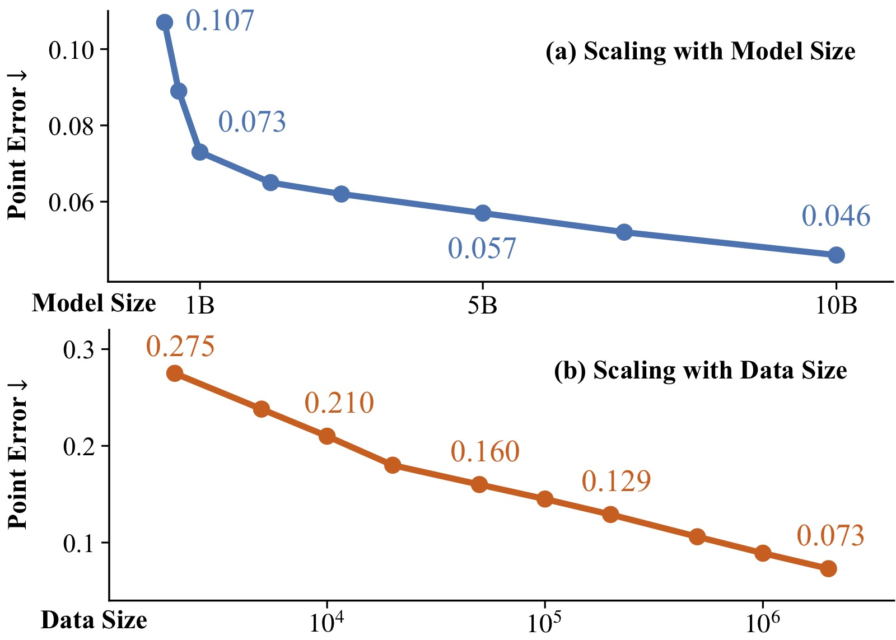
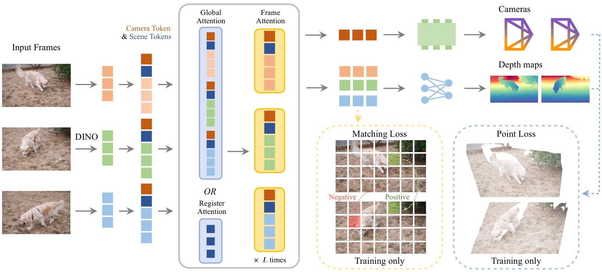
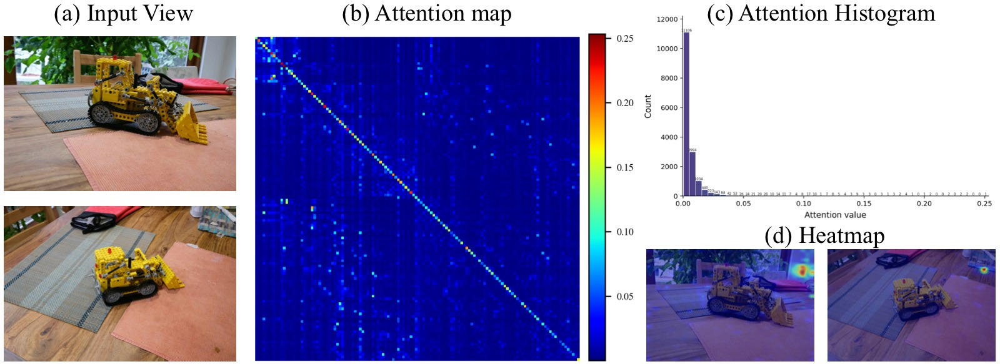
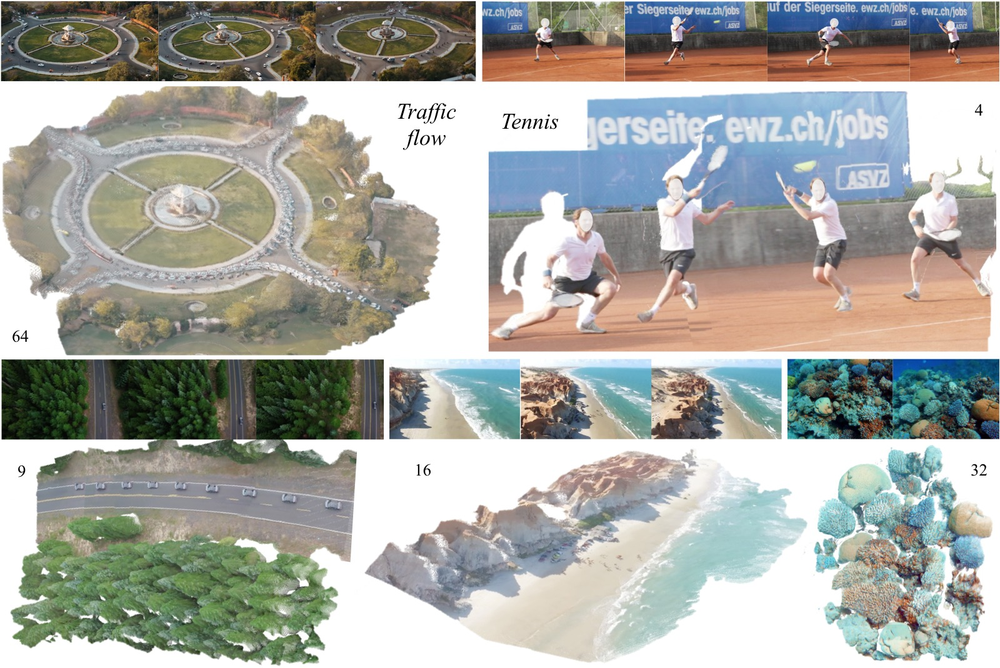
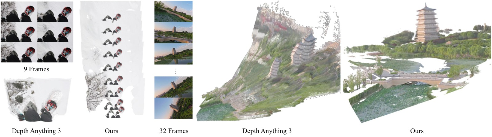
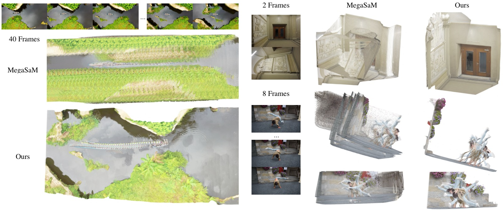
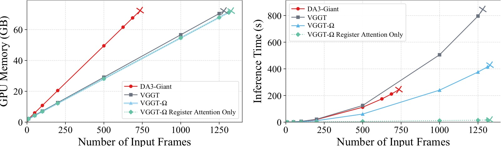
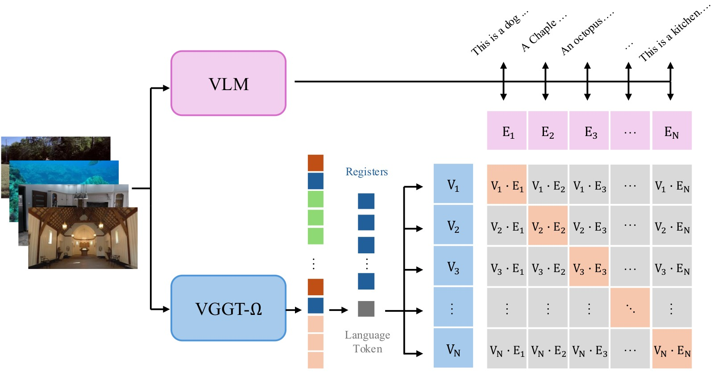
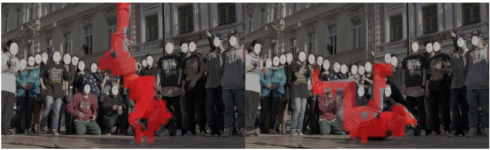
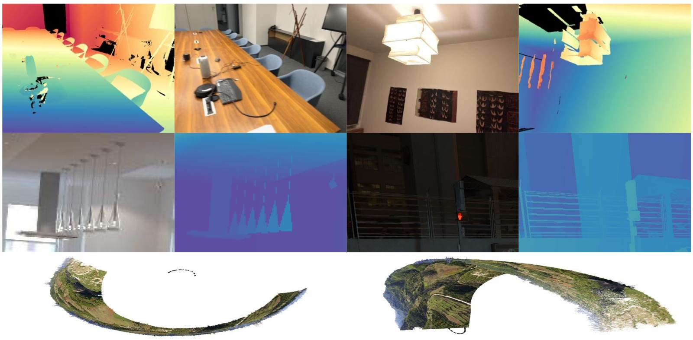

%% mathjax-macros
\bg: \boldsymbol{g}
\bq: \boldsymbol{q}
\bt: \boldsymbol{t}
\bbf: \boldsymbol{f}
\bz: \boldsymbol{z}
\bx: \boldsymbol{x}
\by: \boldsymbol{y}
\bp: \boldsymbol{p}
\R: \mathbb{R}
%% end-mathjax-macros

# VGGT-Ω: Scaling Feed-Forward Reconstruction Models

> **论文信息**
> - 作者：Jianyuan Wang, Minghao Chen, Shangzhan Zhang, Nikita Karaev, Johannes Schönberger, Patrick Labatut, Piotr Bojanowski, David Novotny, Andrea Vedaldi, Christian Rupprecht
> - 机构：Visual Geometry Group, University of Oxford & Meta AI
> - 投稿方向：CVPR 2026
> - arXiv ID：2605.15195
> - 项目页面：http://vggt-omega.github.io/

---

## 一、核心问题

前馈式 3D 重建模型（feed-forward reconstruction models，如 VGGT）已经在很多场景下匹配甚至超越了传统的 SfM（Structure-from-Motion）优化流程。然而，与 2D 基础模型领域对 scaling law 的深入理解不同，**3D 前馈重建模型的 scaling 性质几乎未被探索**。

本文的核心问题是：**前馈重建模型能否 scaling up？如果能，scaling 带来了什么收益？**



*图1：Performance Gains from Data and Model Parameter Scaling。左图显示固定数据量（2M 序列）下增大模型参数量（0.2B→0.5B→1B→10B）的效果，横轴为模型参数量（对数尺度），纵轴为 point error（越低越好）。右图显示固定 1B 模型下增大训练数据量（2K→20K→200K→2M 序列）的效果，横轴为训练序列数（对数尺度）。两条曲线都展现出明显的 power law 趋势：模型增大和数据增大分别带来单调的精度提升。注意两图纵轴尺度不同——模型 scaling 带来的 error 下降幅度比数据 scaling 更大。所有模型训练 token 数大致相同，在 6 个数据集的平均结果上评估。*

## 二、核心思路 / 方法

VGGT-Ω 在原始 VGGT 的基础上从三个维度做了改进：

### 2.1 架构改进：三个关键设计



*图2：Architecture Overview。VGGT-Ω 的处理流程：(1) 每帧图像经 DINOv3 ViT 编码为 image token，并追加 camera token（1 个）和 register/scene token（16 个）；(2) 所有帧的 token 进入 alternating-attention blocks，在 global attention（或 register attention）和 frame-wise attention 之间交替——前者负责跨帧信息交换，后者负责帧内信息处理；(3) 最终 token 分别进入 Camera Head（轻量 Transformer + MLP，单次预测无迭代）和 Depth Head（DPT 浅层卷积 + MLP + Pixel Shuffle 上采样）。与 VGGT 的关键差异：移除了多个冗余 dense head，仅保留单 depth head，point map 和 tracking 通过训练 loss 间接监督。*

**（1）Register Attention（寄存器注意力）**

ViT 中少量 token 天然会携带全局信息。VGGT-Ω 显式地为每帧引入 16 个可学习的 register token（又称 scene token），并提出 **register attention** 机制：

- 在 25% 的全局注意力层中，跨帧交互**仅限 register token 参与**
- 更新后的 register 通过后续的 frame-wise attention 将聚合的全局信息重新分发回各帧的 image token
- Register 充当了"信息瓶颈"，聚合并再分发多帧场景信息

这一设计的两个好处：
1. **效率**：节省约 23% FLOPs 和 16% 训练内存，且无性能损失
2. **表示学习**：Register 携带了全局场景信息，可被下游任务复用（VLA、语言对齐）

> 替换全部全局注意力为 register attention 可将 FLOPs 降至原来的 6%，但性能会掉到原始 VGGT 水平。



*图3：Visualization of Global Attention in VGGT。(a) 原始输入帧；(b) Layer 13 的全局注意力矩阵——横纵轴均为所有帧的 token，亮度表示注意力权重；(c) 注意力值的分布直方图——绝大多数值接近零，仅极少数 token 对之间有显著交互；(d) 特定 query token 的空间热力图叠加在原始图像上。该可视化直接证明了全局注意力高度稀疏，少量 token 足以承载跨帧信息交换——这正是 register attention 设计的核心动机。*

**（2）轻量化 Dense Prediction Head**

VGGT 的 DPT head 中高分辨率卷积层存储前向激活消耗了大量 GPU 内存（FSDP 和 gradient checkpointing 也无法消除）。VGGT-Ω 将 1/4 分辨率以上的卷积层替换为：

- 单层 MLP + Pixel Shuffle 上采样
- 几乎不消耗内存，且定量和定性结果均无退化

**（3）单 Dense Head + 多任务 Loss**

VGGT 使用多个 dense head 分别预测 depth、point map、tracking features——每个都需要存储高分辨率激活。VGGT-Ω 只保留一个 depth prediction head，但**仍然通过间接计算施加 point loss 和 matching loss**：

$$\mathcal{L} = \lambda_{\text{cam}} \mathcal{L}_{\text{cam}} + \lambda_{\text{depth}} \mathcal{L}_{\text{depth}} + \lambda_{\text{point}} \mathcal{L}_{\text{point}} + \lambda_{\text{match}} \mathcal{L}_{\text{match}}$$

- Point loss：通过 depth map + camera 参数反投影（unprojection）得到 point map，计算误差
- Matching loss：对最后一层 token 做对比学习——正样本对（对应同一 3D 点）拉近，负样本对推远
- 性能几乎持平多 head 方案（point error 0.073 vs 0.070），但节省大量内存

**综合效果：训练 GPU 内存降为 VGGT 的 ~30%，可使用 15× 更多的监督数据。**

### 2.2 动态场景支持

VGGT-Ω 支持动态场景重建。关键设计选择：

- **只预测 depth map + camera 参数**，不预测显式的动态输出（如 motion mask、dynamic point map）
- 原因：ray map 等方法会将 camera 信息与逐像素外观变化纠缠——例如固定摄像机拍摄舞者，camera 参数固定但像素运动很大
- 依赖数据驱动的方式从数据中学习运动先验，而非手工设计低秩或局部刚性约束

### 2.3 大规模数据标注管线

为支撑 scaling，构建了一套高质量的自动标注管线，处理约 4000 万互联网风格视频：

```
┌──────────────┐    ┌──────────────┐    ┌──────────────┐    ┌──────────────┐
│ VLM 预过滤    │ → │ 动态 Mask     │ → │ 特征匹配+追踪  │ → │ COLMAP 重建   │
│ 50%直接丢弃   │    │ Grounding DINO│    │ SIFT+SP+SG    │    │ VGGT 初始化   │
│ 40%降级使用   │    │ 排除人/车区域  │    │ ALIKED+LG     │    │ BA + 过滤     │
│ 10%进入下阶段 │    │              │    │ VGGSfM Tracker│    │              │
└──────────────┘    └──────────────┘    └──────────────┘    └──────────────┘
       │                    │                    │                    │
       └────────────────────┴────────────────────┴────────────────────┘
                                          │
                                          ▼
┌──────────────┐    ┌──────────────┐    ┌──────────────┐
│ 监督几何过滤   │ ← │ 多视图一致性   │ ← │ MVS 深度估计  │
│ XGBoost+RF   │    │ 检查          │    │ patch-based  │
│ +CatBoost    │    │              │    │              │
└──────────────┘    └──────────────┘    └──────────────┘
```

- 最终产出：~20 万动态场景 + ~60 万静态场景（高质量标注）
- 加上现有公开数据集，总计约 400 万场景/序列（**15× 于 VGGT**）
- 管线原则：**宁缺毋滥**——宁可丢弃也不引入噪声标注

### 2.4 自监督训练

受 DINO 系列启发，采用 teacher-student 动量蒸馏方案：

```
┌─────────────────────────────────────────────────────┐
│                    同一视频序列                         │
│          ┌──────────┐       ┌──────────┐             │
│          │  Student  │       │  Teacher  │             │
│          │ (梯度更新) │       │ (EMA更新)  │             │
│          └─────┬────┘       └─────┬────┘             │
│                │                  │                   │
│  不同增强:      │                  │                   │
│  · 颜色抖动    │                  │                   │
│  · 随机旋转90° │                  │                   │
│  · Patch Mask │                  │                   │
│  · 随机帧序    │                  │                   │
│                │                  │                   │
│          ┌─────▼──────────────────▼─────┐             │
│          │  恢复统一帧序后匹配:             │             │
│          │  · L2 feature matching loss  │             │
│          │  · Camera/Depth regression   │             │
│          │  · Camera & Depth heads 冻结  │             │
│          └──────────────────────────────┘             │
│                                                       │
│  Teacher 更新: θᵀ ← m·θᵀ + (1-m)·θ^S, m=0.999       │
└─────────────────────────────────────────────────────┘
```

在 1800 万无标注视频上训练，用于提升 OOD 泛化能力。

## 三、模型架构详情

```
输入: I₁, I₂, ..., I_N  (N 帧 RGB 图像)
                    │
                    ▼
┌─────────────────────────────────────────────────────┐
│  DINOv3 ViT (per-frame, patch size 16)              │
│  每帧输出: H'W' × C 个 image token                   │
│  + 1 camera token (可学习)                           │
│  + 16 register/scene token (可学习)                   │
│  → 每帧: (H'W' + 17) × C 个 token                   │
└─────────────────────────────────────────────────────┘
                    │
                    ▼
┌─────────────────────────────────────────────────────┐
│  12/12/24/16 个 Alternating-Attention Blocks         │
│  (0.2B/0.5B/1B/10B 模型)                            │
│                                                       │
│  ┌──────────────────┐    ┌──────────────────┐        │
│  │ Global/Register   │ ←→ │ Frame-wise        │        │
│  │ Attention         │    │ Self-Attention    │        │
│  │ (跨帧信息交换)      │    │ (帧内信息处理)      │        │
│  └──────────────────┘    └──────────────────┘        │
│  其中 25% 的全局注意力替换为 Register Attention        │
└─────────────────────────────────────────────────────┘
                    │
          ┌─────────┴─────────┐
          ▼                   ▼
┌──────────────────┐  ┌──────────────────┐
│  Camera Head      │  │  Depth Head       │
│  (轻量 Transformer │  │  (DPT浅层卷积      │
│   + MLP)          │  │   + MLP           │
│  单次预测,无迭代   │  │   + Pixel Shuffle) │
│                    │  │                    │
│  输出: (q,t,f)     │  │  输出: D + conf.   │
│  每帧 9 维         │  │  每帧 H×W×2        │
└──────────────────┘  └──────────────────┘
```

### 模型规格

| 参数量 | Alternating Blocks | Hidden Size |
|--------|-------------------|-------------|
| 200M   | 12                | 384         |
| 500M   | 12                | 768         |
| 1B     | 24                | 1024        |
| 10B    | 16                | 4096        |

## 四、关键 Loss 函数

**Camera Loss**：L1 loss，比 VGGT 的 Huber loss 更稳定

$$\mathcal{L}_\text{cam} = \sum_{i=1}^N |\hat{\bg}_i - \bg_i|$$

**Depth Loss**：Aleatoric uncertainty + 梯度一致性

$$\mathcal{L}_{\text{depth}} = \sum_{i=1}^{N} \left[ \| c_i^{D} \odot (1 + D_i^{-1}) \odot e_i \| + \| c_i^{D} \odot \nabla e_i \| \right] - \alpha \sum_{i=1}^{N} \log c_i^{D}$$

Loss 权重：λ_cam=5.0, λ_depth=1.0, λ_point=0.5, λ_match=0.1

## 五、实验与结果

### 5.1 评估协议

- **6 个 benchmark**：3 个静态（7 Scenes, NRGBD, ETH3D）+ 3 个动态（DyCheck, Sintel, TUM-Dynamic）
- 每场景随机采样 10 帧
- Camera 指标：AUC@3° 和 AUC@30°（越高越好）
- Depth 指标：AbsRel（越低越好）和 δ₁.₂₅（越高越好）

### 5.2 Camera Pose Estimation 结果

| Method | 7 Scenes AUC@3° | NRGBD AUC@3° | ETH3D AUC@3° | DyCheck AUC@3° | Sintel AUC@3° | TUM-Dyn AUC@3° |
|--------|:---------------:|:------------:|:------------:|:--------------:|:-------------:|:--------------:|
| MonST3R | 9.0 | 13.9 | 1.7 | 11.5 | 4.3 | 7.7 |
| MegaSaM | 10.6 | 17.2 | 5.9 | 26.8 | 22.5 | 15.4 |
| VGGT | 10.9 | 81.7 | 18.8 | 21.0 | 15.0 | 16.6 |
| PI3 | 13.3 | 83.8 | 35.3 | 23.3 | 14.8 | 16.1 |
| DA3 (Giant) | 18.7 | 86.4 | 46.1 | 32.1 | 16.2 | 20.8 |
| **Ours-1B** | **29.6** | **89.7** | **49.8** | **38.4** | **35.3** | **30.2** |
| **Ours-10B** | **36.4** | **92.5** | **56.3** | **43.7** | **40.0** | **36.4** |

**关键发现**：
- Sintel AUC@3°：40.0 vs DA3 的 16.2（**+77%** 相对提升）
- 动态场景上优势尤为显著——前馈方法的几何先验比优化方法的显式约束更鲁棒
- 10B 模型持续优于 1B 模型，验证了 model scaling 的直接收益

### 5.3 Depth Estimation 结果

| Method | 7 Scenes δ₁.₂₅ | NRGBD δ₁.₂₅ | ETH3D δ₁.₂₅ | DyCheck δ₁.₂₅ | Sintel δ₁.₂₅ | TUM-Dyn δ₁.₂₅ |
|--------|:--------------:|:-----------:|:-----------:|:-------------:|:------------:|:--------------:|
| MegaSaM | 93.8 | 96.2 | 94.8 | 97.4 | 74.1 | 92.9 |
| VGGT | 91.9 | 99.1 | 97.4 | 95.2 | 79.2 | 92.2 |
| DA3 (Giant) | 93.0 | 99.5 | 99.6 | 97.7 | 86.1 | 94.3 |
| **Ours-1B** | **94.6** | **99.6** | **99.8** | **98.4** | **89.5** | **97.4** |
| **Ours-10B** | **96.3** | **99.7** | **99.8** | **98.7** | **93.5** | **98.3** |

Sintel δ₁.₂₅：93.5 vs DA3 的 86.1（提升 26%），AbsRel 从 0.118 降至 0.081。

### 5.4 定性结果



*图4：Qualitative Results。VGGT-Ω 在多样场景下的重建效果。每个场景展示了输入帧（顶部）、预测深度图（中部）和重建点云（底部）。从左到右：(1) 交通场景——叠加的车流展示了动态内容处理能力；(2) 网球运动员——轨迹线展示了动态人物追踪；(3) 水下珊瑚礁——展示了极端纹理和环境下的泛化能力；(4) 自然风景——复杂地形重建；(5) 室内场景——精细几何恢复。各示例分别使用 64/4/9/16/32 帧输入。结果表明模型在静态和动态内容上均能产生全局一致的重建。*



*图5：Qualitative Comparison to Depth Anything 3。左列：雪地缆车序列——重复纹理的雪地使 DA3 几乎无法估计相机运动（重建点云坍缩），而 VGGT-Ω 正确恢复了相机轨迹和场景结构。右列：无人机绕塔飞行——强相机滚转（roll）导致 DA3 产生严重鬼影和重复塔楼结构（将同一座塔重建多次），而 VGGT-Ω 的重建全局一致。这展示了大规模训练带来的鲁棒几何先验对重复纹理和极端视角变化的处理优势。*



*图6：Qualitative Comparison to MegaSaM。左列：航拍场景——MegaSaM 出现严重的几何漂移和纹理涂抹，产生重复图案和扭曲的全局布局。右上：稀疏室内场景，第二帧非正立——MegaSaM 产生分离的结构和不对齐的平面。右下：少纹理墙壁的室内场景——MegaSaM 的位姿估计失败。VGGT-Ω 在所有场景下均产生全局一致的重建，尤其在小基线、大旋转等挑战性条件下优势显著。*

### 5.5 推理效率对比



*图7：Memory and Speed Comparison（单张 80GB A100，flash attention v2 backend）。左图：推理时 GPU 内存使用量 vs 输入帧数。VGGT（修正后）和 VGGT-Ω 内存曲线几乎重合，可处理 >1000 帧；DA3 约 750 帧 OOM。右图：推理时间 vs 帧数。VGGT-Ω 显著快于 VGGT（DINOv3 patch 16 减少 25% token 数 + 25% register attention 加速 20-25%）。叉号标记各方法首次 OOM 的帧数。全 register attention 的激进变体可将 1000 帧从 240.2s 降至 11.7s（但精度下降）。关键洞察：推理时 register attention 的主要收益是速度而非内存——flash attention 不显式构造注意力矩阵，峰值内存由 frame-attention 激活和 FFN 中间结果主导，与帧数成近似线性关系。*

### 5.6 消融实验

所有消融使用 1B 模型，2M 序列训练，150K 监督步。以 point error 为主要指标。

| 实验设置 | Point Error |
|----------|:-----------:|
| 全 Global Attention（无 Register Attention） | 0.071 |
| 25% Register Attention（默认） | 0.073 |
| 移除 Point + Matching Loss | 0.078 |
| VGGT 原版多 Head 方案 | 0.070 |
| +10% 训练步替换为自监督训练 | 0.070 |
| 全 Register Attention（无 Global Attention） | 掉至 VGGT 水平 |

**核心结论**：
- 25% register attention 几乎无损（0.071→0.073），换来 70% 训练内存节省
- 单 head 多 loss 方案（0.073）接近多 head（0.070），进一步说明计算冗余可以被消除
- 自监督训练改善 OOD 泛化，但对 benchmark 指标提升有限

### 5.7 数据标注质量验证

在 Sintel 上评估标注管线的 pseudo GT 质量（排除动态区域和双方都判定不可靠的帧）：

| 管线 | Camera AUC@30° | Depth δ₁.₂₅ |
|------|:--------------:|:-----------:|
| 本文管线 | **96.4%** | **99.3%** |
| MegaSaM | 62.1% | 77.2% |

标注管线的设计哲学：**宁可保守丢弃，也绝不引入噪声监督**。

## 六、关键洞察与技术亮点

### 6.1 Register 的下游应用

**Robotics（VLA）**：冻结 VGGT-Ω，将 scene token 拼接至 OpenVLA-OFT 输入，在 LIBERO 四个子任务上均提升：

| Method | Spatial SR | Object SR | Goal SR | Long SR | Avg SR |
|--------|:----------:|:---------:|:-------:|:-------:|:------:|
| OpenVLA-OFT | 97.6 | 98.4 | 97.9 | 94.5 | 97.1 |
| **+ Our Frozen Scene Tokens** | **99.3** | **99.2** | **99.0** | **96.7** | **98.5** |

**Language Alignment**：



*图8：Language Alignment。对齐流程：(1) 左路——VLM 观察全部输入视图，生成场景描述文本，文本 token 的 hidden states 经 mean-pool 和 L2-norm 得到语言 embedding；(2) 右路——VGGT-Ω 的 register token 和新增的可学习 language token 进入小型 self-attention stack，输出 language token 经投影和 L2-norm 得到 register-derived embedding；(3) 两个 embedding 通过对称 InfoNCE loss 在所有 GPU 间 gathered 的全局 batch 上做对比学习。注意：language token 从未直接接触 image patch token——它只能通过 register 读取信息，因此对齐成功直接证明了 register 携带高层语义信息。VLM 冻结，VGGT-Ω 端到端微调（LR=1e-5）。*

- Top-1 检索准确率：76.8%（VLM embedding），Top-3：97.0%
- Zero-shot 迁移至纯文本 LLM embedding（Qwen3）：Top-1 47.5%，Top-3 77.8%
- 对齐 fine-tuning 后几何任务性能无退化

这表明 register 确实携带了高层语义信息，且与语言空间天然对齐——与 Platonic Representation Hypothesis 一致。

### 6.2 Motion Awareness（涌现的运动感知）



*图9：Motion-Aware Representations。对中间层 image token 做 PCA 降维后 k-means 聚类（无标签、无光流、无学习探针）。红色高亮为聚类响应最强的区域。Layer 4（浅层）：聚类最干净——舞者被清晰分离，背景人群几乎没有响应。Layer 13（中层）：运动信号减弱但仍可辨识，舞者轮廓仍能追踪。Layer 23（深层）：聚类覆盖场景中所有人物——表示从"运动"逐渐变为"语义人物检测"。该结果首次直接证明：前馈重建模型从 reconstruction objective 中自动涌现了运动感知能力，无需任何显式的运动监督或帧时序信息。*

### 6.3 Model Souping 探针

将 VGGT 与 VGGT-Ω 的特定权重子集直接平均（无需微调），研究信息存储位置：

- **Depth 和 FOV 信息**：主要存储在 frame-wise attention block 的 FFN 中
- **Camera 外参信息**：编码在更高层，不完全由 FFN 控制
- **泛化到任意帧数**：与 frame-wise attention block 密切相关
- 这一发现与语言模型社区的结果（知识存储在 FFN 中）一致

### 6.4 合成数据 vs 真实数据

- 合成数据：贡献更多精度
- 真实数据：改善泛化，让模型适应真实外观和多样化相机轨迹
- 推荐配比：~80% 合成 + ~20% 真实；如果合成标注足够干净，可提高到 ~90%

### 6.5 训练配置

- 128 张 96GB H100 GPU
- bfloat16 混合精度 + gradient checkpointing + FSDP
- 240K iterations：160K 监督 → 50K 自监督 → 30K 监督
- Peak LR：监督 2×10⁻⁴，自监督 1×10⁻⁴
- 每 batch 帧数从 [1, 24] 均匀采样
- 输入分辨率约 512×512，随机宽高比 [0.33, 1.33]

## 七、数据质量问题分析

这是论文中非常有价值的一节，系统性地分析了训练数据中的噪声如何转化为特定的推理失败模式。



*图10：Common Data Issues。顶部行（传感器问题，ScanNet++）：椅背深度泄漏到背景墙壁——LiDAR/深度相机的前景-背景边界不准确；灯具周围的碎片化前景结构——过曝和半透明物体的传感器捕获不稳定。中间行（薄结构问题，合成数据如 Hypersim）：栅栏等占据少量像素的细结构渲染深度不完整或错位到墙壁/背景——虽然 RGB 清晰可见，但 GT 深度过度平滑或缺失。底部行（Doming Effect，COLMAP 伪 GT）：在近平行视角、弱全局约束、径向畸变误差等条件下，BA 仍能达到低重投影误差却产生全局弯曲的退化几何——这种伪 GT 对大尺度几何尤其有害。*

**数据质量 vs 模型行为的对应关系**：

| 数据问题 | 推理表现 |
|----------|----------|
| 前景-背景泄漏（传感器） | 物体边界深度不稳定 |
| 薄结构标注不完整（合成） | 模型忽略细结构或将其洗入背景 |
| Fake Background（Kubric 等） | 预测深度与语义不一致 |
| Doming Effect（BA 伪 GT） | 大尺度几何弯曲 |
| 人-背景边界歧义（Megadepth） | 行人融入墙壁/地面 |
| 跨数据集标注不一致（窗户深度） | 窗户区域预测混乱 |

## 八、Register 在架构中的信息流

```
                      Register Attention（仅 Register 参与）
                      ╔═══════════════════════════════╗
Frame 1 Register ─────╣→ attn(R₁, R₂, ..., R_N) → R₁' ║
Frame 2 Register ─────╣→ attn(R₁, R₂, ..., R_N) → R₂' ║
...                   ║                               ║
Frame N Register ─────╣→ attn(R₁, R₂, ..., R_N) → R_N'║
                      ╚═══════════════════════════════╝
                                      │
                                      ▼
                      Frame-wise Attention（Register 分发信息）
                      ┌───────────────────────────────┐
Frame 1: [ImgTokens₁, R₁'] → attn_f → [ImgTokens₁', R₁'']
Frame 2: [ImgTokens₂, R₂'] → attn_f → [ImgTokens₂', R₂'']
...
Frame N: [ImgTokens_N, R_N'] → attn_f → [ImgTokens_N', R_N'']
                      └───────────────────────────────┘
```

Register 充当了跨帧信息交换的**瓶颈**——只在 register attention 中跨帧交互，然后通过 frame attention 将聚合的全局信息分发给各自的 image token。这种设计与通信中的星型拓扑类似，复杂度从 O((NT)²) 降至 O(R² + NT²)，其中 T 为每帧 token 数，R 为 register 数（16×N）。

## 九、局限性

1. **强运动模糊**：性能显著下降
2. **FOV 剧烈变化**（如几秒内从 10° 跳到 160°）：重建质量下降
3. **高畸变相机**：预测不稳定
4. **办公室多显示器场景**：因早期训练中使用 ScanNet++ 等含噪声数据，偶尔不稳定
5. **隐私屏蔽区域**（人脸、商标被 mask/blur）：偶尔产生伪影或不平滑预测
6. **自监督训练的收益**：对 benchmark 指标提升有限，主要改善 OOD 泛化
7. **MLP-only dense head 的 patch 伪影**：户外远距离场景仍有可见 block 痕迹

## 十、展望：3D 在大模型时代的角色

论文提出了一个有远见的观点：

> 未来新一代重建模型（甚至更广泛的感知系统）可能构建在统一的多模态模型之上。

三个理由：
1. **数据**：大规模文本和视频语料包含丰富的隐式物理世界描述，联合训练可解锁这些监督信号
2. **跨任务一致性**：大多数感知问题单独看是严重欠约束的——纹理缺失区域的深度估计可以借助语义先验解决
3. **范式趋势**：生成式视觉模型的 scaling 似乎比纯感知模型更容易，且生成模型在一定程度上可以迁移到感知任务

短期内，重建模型可作为外部工具提供显式 3D 信息（depth, camera）或隐式空间 token。长期来看，重建可能成为"全模态模型"（omni-model）的一部分——camera 参数可以文本形式自回归预测，depth 可以图像生成形式输出。

---

## 十一、关键概念速查

| 概念 | 简要解释 |
|------|----------|
| **VGGT-Ω** | VGGT 的 scaled-up 版本，架构更高效，数据规模 15× |
| **Register Attention** | 仅 register token 参与跨帧 self-attention，形成信息瓶颈 |
| **Scene Token / Register** | 每帧 16 个可学习 token，聚合全局场景信息 |
| **Single Dense Head** | 只预测 depth，point/matching 通过间接 loss 监督 |
| **Pixel Shuffle 上采样** | MLP 输出 → pixel shuffle → 高分辨率 depth，替代 DPT 高分辨率卷积 |
| **Doming Effect** | BA 在弱约束下产生的全局弯曲退化几何 |
| **Teacher-Student SSL** | DINO-style 动量蒸馏，1800 万无标注视频训练 |
| **Point Error** | 反投影 depth 到 3D 后与 GT 的 L2 距离，paper 主要消融指标 |
| **Alternating Attention** | Global/Register attention 与 Frame-wise attention 交替堆叠 |
| **FSDP** | Fully Sharded Data Parallel，分布式训练策略 |
