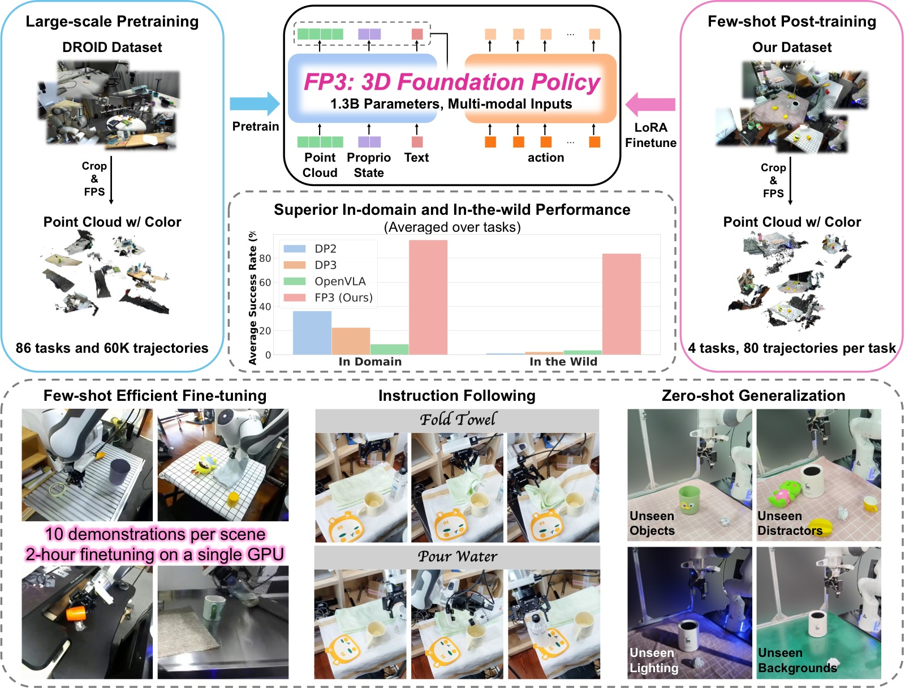
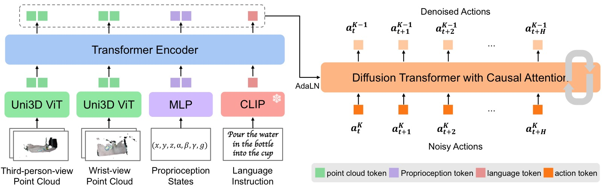
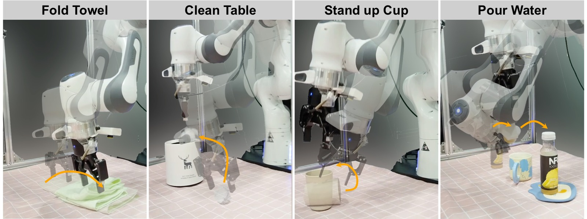
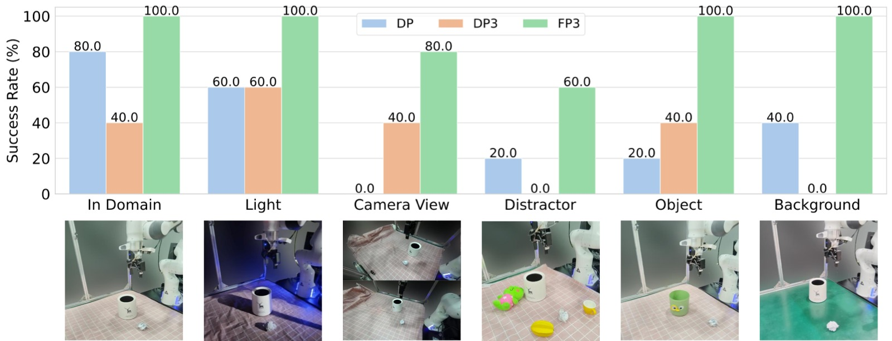
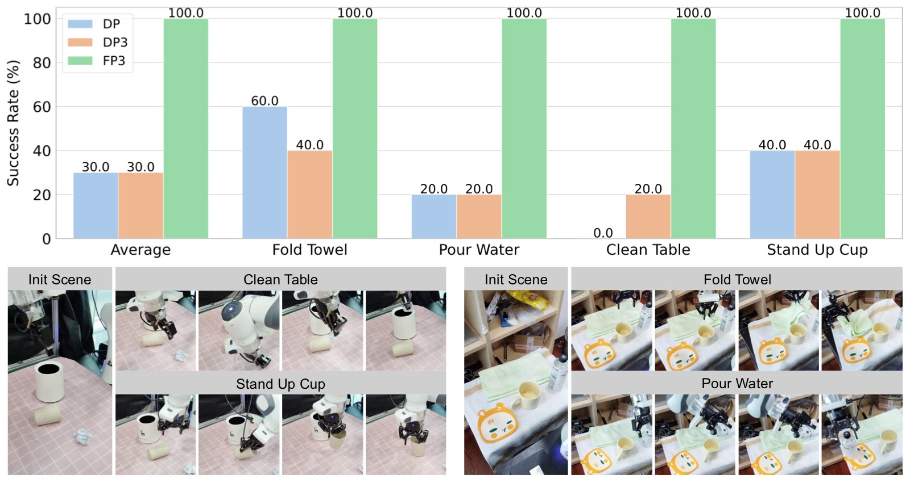

<!-- arxiv: 2503.08950 -->
<!-- venue: arXiv 2025 -->
<!-- tags: VLA, 3D视觉, 扩散模型, 机器人操作, 泛化, 基础模型 -->

# FP3: A 3D Foundation Policy for Robotic Manipulation

> **论文信息**
> - 作者：Rujia Yang, Geng Chen, Chuan Wen, Yang Gao
> - 通讯作者：Chuan Wen, Yang Gao (equal advising)
> - 机构：IIIS, Tsinghua University / Shanghai AI Laboratory / Shanghai Qi Zhi Institute / UC San Diego
> - arXiv ID：2503.08950
> - 代码：https://3d-foundation-policy.github.io/

---

## 一、核心问题

当前机器人操作的基础模型（如 OpenVLA、RDT、π₀）几乎全部依赖 **2D 图像观测**，完全忽略了 3D 几何信息。这带来两个核心问题：

1. **泛化能力受限**：2D 图像对光照、背景、相机视角变化敏感，难以泛化到新物体和新场景。
2. **样本效率低**：大多数方法在单任务或少任务上训练，学习新任务需要约 200 条示教数据。

3D 几何信息对感知 3D 环境和空间关系推理至关重要。虽然已有工作（PerAct、DP3、3D Diffuser Actor）证明 3D 表征能提升样本效率和泛化性，但它们都是**在小规模、少任务数据上训练的小网络**，尚未有人构建基于 3D 表征的策略基础模型。

> **核心命题**：能不能构建一个基于 3D 点云的、大规模预训练的机器人操作基础模型，同时获得 foundation model 的泛化能力和 3D 表征的鲁棒性？

---

## 二、核心思路 / 方法

### 2.1 总体架构

FP3 是一个 **1.3B 参数的 Encoder-Decoder Diffusion Transformer**，接受多模态输入，输出去噪后的动作序列。



*图1：FP3 整体概念图，展示从预训练到部署的完整管线。*

**左半部分 — 预训练（Pre-training）**：FP3 在 DROID 数据集上预训练，该数据集包含 76k 条人类遥操作示教轨迹，覆盖 564 个场景和 86 个任务。预训练阶段使用 2 个相机（第三视角 + 腕部）的 RGB-D 图像重建 3D 点云，结合语言指令，训练 1.3B 参数的 Diffusion Transformer 预测动作序列。预训练耗时 48 小时（8×A800 GPU）。

**右半部分 — 后训练与部署（Post-training & Deployment）**：针对下游任务（如折毛巾、清理桌面、扶杯子、倒水），仅需 80 条高质量遥操作示教（8 个环境 × 10 条），使用 LoRA 在单 GPU 上微调约 2 小时。微调后的策略展示了零样本泛化能力——在全新环境中面对未见过的物体仍能成功执行任务。图中展示了泛化的具体例子：不同颜色/纹理的毛巾、不同形状的杯子、不同场景的桌面等。*

**多模态输入编码**：

| 模态 | 编码器 | 参数 | 是否微调 |
|------|--------|------|----------|
| 点云（每视角 4000 点） | Uni3D ViT-L (300M) | 300M | ✅ 微调 |
| 语言指令 | CLIP (frozen) | — | ❌ 冻结 |
| 本体感知 | 2层 MLP | — | ✅ 训练 |

- **点云处理**：使用 1 个第三视角相机 + 1 个腕部相机，分别用独立的 Uni3D ViT 编码（因为点分布差异大）。RGB-D → 3D 点云 → 裁剪 1m 范围 → FPS 降采样到 4000 点，保留颜色通道。
- **历史帧**：堆叠 2 帧（当前 + 1 步历史）补偿部分观测中的动态信息缺失。

### 2.2 Encoder-Decoder 结构



*图2：FP3 架构详图，展示多模态输入编码 → Encoder 融合 → Decoder 去噪的完整数据流。*

**输入编码（左侧三个分支）**：
- **3D 点云（上下两个分支）**：第三视角和腕部视角各 4000 个点，各自通过独立的 Uni3D ViT-L（300M 参数）编码。Uni3D 预训练时对齐了点云与图像-文本特征，为点云注入了丰富的语义信息。两个视角使用独立编码器是因为它们的点分布差异大——第三视角看到整个场景，腕部视角紧贴操作物体。
- **语言指令（中间分支）**：经 frozen CLIP 编码为文本嵌入，与 Uni3D 的点云特征处于同一语义空间。
- **本体感知 + 噪声水平**（底部输入）：低维信号经 2 层 MLP 处理。

**Transformer Encoder（中间部分）**：所有嵌入拼接后送入 Encoder，通过 self-attention 融合跨模态信息，输出 compact latent tokens。

**Transformer Decoder（右侧部分）**：扩散去噪器的核心。输入是加噪的动作序列（底部 Noise Input），通过时序因果掩码（temporal causal mask）确保当前步只看到历史、看不到未来。每个 Decoder 层通过 adaLN 模块接收 Encoder 的 latent tokens 作为条件——adaLN 回归出 LayerNorm 的 scale 和 shift 参数，以及逐通道的 gate 和 bias，实现条件注入。这种设计比 cross-attention 训练更稳定，是 DiT/SD3 的标准做法。最终输出去噪后的 16 步动作序列。*

**Encoder**：将所有嵌入喂入 Transformer Encoder，产生富含多模态信息的 latent tokens。

**Decoder（扩散去噪器）**：
- 从噪声中逐步去噪预测动作 chunk（预测未来 16 步，执行 8 步）
- 使用**时序因果掩码**（temporal causal masking）
- 通过 **adaLN（Adaptive Layer Normalization）** 注入条件信息，而非 RDT 的 cross-attention——adaLN 在图像生成和策略学习中都被证明对稳定扩散训练至关重要

**为什么选 adaLN 而非 Cross-Attention**：adaLN 将条件信息通过 LN 的 scale/shift 参数注入，比 cross-attention 更训练稳定，在 DiT 和 SD3 中都是标配。

### 2.3 预训练 + 后训练范式

借鉴 LLM 的两阶段范式：

**预训练**（Pre-training）：
- 数据：DROID 数据集中 60k 条示教轨迹（原始 76k，筛选后），86 个任务，564 个场景
- 规模：3M steps，batch size 128，8×A800 GPU，约 48 小时
- 优化器：AdamW，lr=1e-4，cosine schedule，weight decay=0.1，gradient clip=1.0
- 数据增强：随机丢弃 0-80% 的点
- 微调 Uni3D 编码器（遵循 Data Scaling Law 的发现：冻结预训练视觉编码器会损害策略性能）

**后训练**（Post-training）：
- 为每个下游任务收集 80 条高质量遥操作示教（8 环境 × 10 条）
- 关键原则：**增加环境和物体的多样性，而非在同一场景下重复收集**
- 使用 LoRA 微调（rank=32，alpha=16），单 A800 GPU 约 2 小时
- 目标：在任意物体、任意环境中解决特定任务

---

## 三、训练目标

FP3 使用 **DDPM（Denoising Diffusion Probabilistic Model）** 建模条件分布，推理时用 **DDIM** 加速（16 步去噪迭代）。

**问题形式化**：

$$\text{建模 } p(A_t | \mathbf{o}_t), \quad \mathbf{o}_t = [\mathbf{P}_t^1, ..., \mathbf{P}_t^n, \ell_t, \mathbf{q}_t]$$

其中：
- $\mathbf{P}_t^i$：第 i 个相机的点云观测（含历史帧）
- $\ell_t$：语言指令
- $\mathbf{q}_t$：本体感知状态
- $A_t = [a_t, a_{t+1}, ..., a_{t+H-1}]$：预测的动作序列（H=16），执行 8 步

**动作空间**：绝对笛卡尔空间控制（Absolute Cartesian Space Control）

---

## 四、实验与结果

FP3 在真实 Franka Emika Panda 机器人上评估了 4 个下游任务。

### 4.1 任务设置



*图3：四个下游任务示意图，每个任务以关键帧序列展示操作过程。*

**(a) Fold Towel（折叠毛巾）**：两阶段操作——先抓取毛巾右侧边缘，再将毛巾向左折叠。毛巾中心位置随机，朝向在 ±30° 内随机旋转。训练和测试中使用不同颜色、纹理、材质的毛巾（但预折叠为相似大小的矩形）。

**(b) Clean Table（清理桌面）**：两阶段操作——先抓起桌面上的纸团，再移动到垃圾桶上方释放。纸团和垃圾桶位置随机放置，垃圾桶在颜色、纹理、大小上有变化。

**(c) Stand up Cup（扶起杯子）**：两阶段操作——先将手指插入杯口抓取杯子（杯子侧躺），再抬起并竖直放置。杯子放置位置随机，杯口朝向在 180° 范围内变化（始终面向机器人手臂方向）。

**(d) Pour Water（倒水）**：三阶段操作，是四个任务中最难的——先抓取水瓶，然后将水倒入杯子，最后将水瓶放置在杯垫上。杯子位置随机，水瓶、杯子、杯垫的相对位置随机但保持大致布局（水瓶在左、杯垫在右、杯子在中间）。三者在颜色、材质、大小上有变化。*

| 任务 | 难度 | 步骤数 | 核心挑战 |
|------|------|--------|----------|
| Fold Towel | 中 | 2（抓→折） | 毛巾位姿随机 |
| Clean Table | 中 | 2（抓→投） | 纸团和垃圾桶位置随机 |
| Stand up Cup | 中 | 2（插→立） | 杯子朝向随机 180° |
| Pour Water | 高 | 3（抓→倒→放） | 多步骤协调，精确对准 |

### 4.2 微调评估（Efficient Fine-tuning）

| 方法 | 参数量 | In-domain SR | In-the-wild SR |
|------|--------|-------------|----------------|
| DP (2D, small) | ~30M | 36.25% | 1.25% |
| DP3 (3D, small) | ~30M | 22.50% | 2.50% |
| OpenVLA (2D, large) | 7B | 7.50% | 3.75% |
| FP3-Scratch | 1.3B | 30.00% | 1.25% |
| **FP3** | **1.3B** | **95.00%** | **82.50%** |

*表1：后训练评估（4 任务平均）。每个任务仅 80 条示教，在 4 个 in-domain 环境（seen objects）和 4 个 in-the-wild 环境（unseen objects）各评估 5 次。*

**关键发现**：

1. **3D 表征的价值**：DP3 在小网络上使用点云，in-domain 表现（22.5%）反而低于 DP（36.25%），说明仅有 3D 表征不够——必须结合大规模预训练才能释放其潜力。

2. **2D 基础模型的局限**：OpenVLA（7B 参数）在仅有 80 条示教的情况下几乎完全失败（7.5%），原因是：(a) 缺乏 action chunking 和观测历史，容易卡住；(b) 仅使用第三视角相机，视野受限，无法精确交互。

3. **预训练是关键**：FP3-Scratch（30%）远低于 FP3（95%），证明预训练初始化的必要性。

4. **失败后的恢复能力**：DP/DP3/FP3-Scratch 在首次失败后会陷入 OOD 状态，只能原地抖动；而 OpenVLA 和 FP3 能做出合理的二次尝试——**大规模预训练赋予了策略从失败中恢复的能力**。

### 4.3 泛化实验



*图4：泛化实验综合评估（Clean Table 任务），覆盖 5 个泛化维度的定量结果与定性对比。*

该图展示了 FP3、DP3、DP 在五个泛化维度上的表现对比（每个维度包含多个测试条件，柱状图为 SR，截图展示代表性场景）：

**子图 (a) Lighting（光照变化）**：改变环境光照条件（正常 → 暗光/亮光/侧光）。DP（2D 图像）受光照变化影响严重，DROID 预训练的 FP3 因见过大量光照变化而保持稳定。DP3 消除颜色通道后对光照本身不敏感，但因 in-domain 基础性能低而受限。

**子图 (b) Camera View（相机视角）**：相机偏离训练视角约 30°。DP 在此条件下完全失效（SR≈0），因为 2D 特征对视角变化极为敏感。DP3 和 FP3 使用点云——只要相机标定正确，点云会统一转换到世界坐标系——因此对视角变化天然鲁棒。FP3 的绝对性能仍远高于 DP3。

**子图 (c) Distractor（干扰物）**：在目标物体周围放置随机干扰物。所有方法都受干扰物影响，偶尔会误抓干扰物。FP3 的 SR 最高，但仍无法完全免疫。这是值得进一步研究的方向。

**子图 (d) Object（物体外观）**：改变操作对象的外观（颜色、形状、材质）。DP 在物体颜色变化后性能明显下降，因为 CNN 特征对纹理/颜色分布偏移敏感。FP3 因预训练数据覆盖多种物体和场景而保持高 SR。

**子图 (e) Background（背景纹理）**：更换桌面纹理/背景图案。DP 受背景变化影响最大（2D 特征将背景纹理误认为语义信号），DP3 受限于 in-domain 性能，FP3 的 3D 几何理解使其能忽略背景干扰。*

| 泛化维度 | DP (2D) | DP3 (3D) | FP3 |
|----------|---------|----------|-----|
| 物体颜色变化 | 下降明显 | 稳定 | **最优** |
| 背景纹理变化 | 下降明显 | 受限于 in-domain | **最优** |
| 光照变化 | 下降 | 稳定 | **最优** |
| 相机视角（偏 ~30°） | 完全失败 | 受限于 in-domain | **稳定** |
| 干扰物 | 部分失败 | 部分失败 | **最稳定** |

**分析**：
- DP3 去掉颜色通道后，在光照和颜色变化下相对稳定，但因 in-domain 性能低而受限。
- FP3 在相机视角变化下也保持高性能，因为点云只要相机标定正确就会转换到统一坐标系。
- 干扰物是所有方法都面临的挑战，FP3 也会偶尔误抓，但成功率仍最高。

### 4.4 指令跟随



*图5：指令跟随实验——在相同的初始状态下给出不同语言指令，验证策略是否真正理解语义而非记忆场景-动作映射。*

实验设计了一个多任务微调设置：用所有 4 个任务的数据微调 FP3 和基线方法，然后在同一个初始场景中分别给出不同的语言指令（"Fold Towel"、"Clean Table"、"Stand up Cup"、"Pour Water"），观察策略行为。

**关键对比**：
- **FP3**：根据指令正确执行对应任务——收到"Fold Towel"就去抓毛巾，收到"Pour Water"就去操作水瓶。说明它学会了将语义与物体-动作关联。
- **基线方法（DP/DP3/OpenVLA）**：要么完全无法完成任务，要么被其他任务的物体干扰（如收到"Clean Table"却去碰了杯子）。在小数据量微调下，它们倾向于记住"这个场景下该做什么"，而非理解语言指令的含义。

这验证了大规模预训练对语义理解的重要性：FP3 在 DROID 预训练中接触了大量多样化任务和语言指令，学会了真正的指令跟随能力。*

FP3 在同一初始状态下对不同语言指令能做出正确响应，说明它**真正理解了语义**而非简单记忆训练分布。这是 foundation model 的重要特性。

### 4.5 消融实验

| 变体 | 参数量 | 观测 | 预训练数据 | In-domain | In-the-wild |
|------|--------|------|-----------|-----------|-------------|
| FP3-Scratch | 1.3B | 3D | 无 | 35% | 0% |
| FP3-Base-Image | 365M | 2D (DINOv2) | 60k | 90% | 55% |
| FP3-Base-30k | 365M | 3D | 30k | 95% | 90% |
| FP3-Base | 365M | 3D | 60k | 95% | 90% |
| **FP3** | **1.3B** | **3D** | **60k** | **100%** | **95%** |

*表2：消融实验（Clean Table 任务）。*

**三个关键结论**：

1. **3D > 2D**：FP3-Base-Image（2D）在 in-domain 与 FP3-Base（3D）持平（90% vs 95%），但在 in-the-wild 大幅落后（55% vs 90%）。2D 基础模型的泛化瓶颈不在模型大小，而在模态本身。

2. **模型规模有帮助**：FP3（1.3B）> FP3-Base（365M），尤其在 in-the-wild（95% vs 90%）。

3. **数据规模收益递减**：30k → 60k 在当前任务上提升有限（Base-30k 与 Base 持平），作者认为需要更难的任务和更多数据点才能得出精确的 scaling law。

---

## 五、关键洞察与技术亮点

### 5.1 3D 表征是泛化的关键

FP3-Base-Image vs FP3-Base 的对比最有说服力：同样 365M 参数、同样 60k 数据、同样架构，仅将 3D 点云换成 2D 图像 + DINOv2，in-the-wild SR 从 90% 跌到 55%。**几何信息对跨域泛化不可替代。**

### 5.2 预训练赋予"失败后恢复"能力

一个有趣的定性发现：FP3 在抓取失败后不会陷入抖动，而是尝试重新定位物体。这种"智能恢复"行为来自预训练数据的多样性——模型见过足够多的失败和恢复模式。

### 5.3 80 条示教 + 2 小时微调的实用价值

FP3 在单 GPU 上 2 小时微调，仅需 80 条高质量示教，就能达到 95% in-domain 和 82.5% in-the-wild 成功率。这在实际部署中是极其实用的：用户不需要大量数据收集，只需要覆盖多样性。

### 5.4 设计选择：adaLN > Cross-Attention

与 RDT 的关键架构差异。adaLN 通过 LN 参数注入条件信息，避免了 cross-attention 在扩散训练中的不稳定性，这是 DiT/SD3 验证过的设计。

---

## 六、代码实现解读

> 论文代码已开源在 https://3d-foundation-policy.github.io/，未包含在 arxiv 提交中。

根据论文描述，核心实现结构如下：

### 6.1 架构数据流

```
┌─────────────────────────────────────────────────────────┐
│                     FP3 推理流程                          │
├─────────────────────────────────────────────────────────┤
│                                                         │
│  ┌──────────┐   ┌──────────┐   ┌──────────┐            │
│  │ 3rd-view │   │ Wrist-   │   │ Language │            │
│  │ PointCloud│   │ PointCloud│   │ Instruction│          │
│  │ (4000 pts)│   │ (4000 pts)│   │          │            │
│  └────┬─────┘   └────┬─────┘   └────┬─────┘            │
│       │              │              │                   │
│       ▼              ▼              ▼                   │
│  ┌──────────┐   ┌──────────┐   ┌──────────┐            │
│  │ Uni3D    │   │ Uni3D    │   │ CLIP     │            │
│  │ ViT-L    │   │ ViT-L    │   │ (frozen) │            │
│  │ (ft)     │   │ (ft)     │   │          │            │
│  └────┬─────┘   └────┬─────┘   └────┬─────┘            │
│       │              │              │                   │
│       ▼              ▼              ▼                   │
│  ┌────────────────────────────────────────┐             │
│  │        Transformer Encoder             │             │
│  │   (融合多模态 → latent tokens)           │             │
│  └────────────────┬───────────────────────┘             │
│                   │                                     │
│                   ▼                                     │
│  ┌────────────────────────────────────────┐             │
│  │        Transformer Decoder             │             │
│  │   ┌──────────────────────────┐        │             │
│  │   │  adaLN (注入 latent)      │        │             │
│  │   │  Temporal Causal Mask    │        │             │
│  │   │  DDIM 去噪 (16 steps)    │        │             │
│  │   └──────────────────────────┘        │             │
│  └────────────────┬───────────────────────┘             │
│                   │                                     │
│                   ▼                                     │
│          Action Chunk [a_t ... a_{t+15}]                │
│          执行前 8 步，预测 16 步                            │
└─────────────────────────────────────────────────────────┘
```

### 6.2 关键设计映射

| 设计 | 实现 |
|------|------|
| 点云编码 | Uni3D ViT-L（预训练对齐点云-图像-文本特征），微调 |
| 多模态融合 | Transformer Encoder |
| 条件注入 | adaLN（非 cross-attention） |
| 扩散方式 | DDPM 训练 + DDIM 推理（16 步） |
| 时序建模 | Temporal Causal Masking |
| 微调 | LoRA (rank=32, alpha=16) |

---

## 七、局限性

1. **零样本能力有限**：预训练基座模型直接执行下游任务的表现不好，需要微调。作者认为是因为 DROID（60k 条）相比 2D 数据集（如 OXE）仍然不够大，未来需要更大的 3D 机器人数据集。

2. **语言理解较浅**：仅使用 CLIP embedding 编码语言指令，不足以表达复杂动态信息。作者提到结合 VLM 做 VLA（如 π₀ 范式）是有前景的方向。

3. **未利用 2D 预训练视觉编码器**：FP3 没有融合 DINOv2/SigLIP 等强大的 2D 视觉特征。将 3D 点云特征与 2D 图像特征融合或将 2D 特征 lift 到 3D 空间是下一步探索方向。

4. **动作空间限制**：仅支持绝对笛卡尔空间控制，未扩展到关节空间或双手操作。

---

## 八、关键概念速查

| 概念 | 说明 |
|------|------|
| **DDPM / DDIM** | 扩散/去噪概率模型，DDIM 加速推理（16 步 vs 通常的 100+ 步） |
| **adaLN** | Adaptive Layer Normalization，通过 LN 的 scale/shift 参数注入条件信息，比 cross-attention 训练更稳定 |
| **Uni3D** | 300M 参数的 ViT-L 点云编码器，预训练对齐点云与图像-文本特征 |
| **Action Chunking** | 一次预测 16 步动作，执行前 8 步，再做下一次预测（receding horizon） |
| **DROID** | 大规模机器人操作数据集，76k 条轨迹，564 场景，86 任务，带深度信息 |
| **LoRA** | 低秩适配微调，仅训练低秩分解矩阵，大幅减少微调参数量 |
| **FPS** | Farthest Point Sampling，点云降采样到固定点数（4000） |
| **笛卡尔空间控制** | 直接控制末端执行器的 6D 位姿（xyz + 欧拉角），而非关节角度 |
