# ContactWorld: What Matters in Vision-Tactile World Models for Contact-Rich Manipulation

> **论文信息**
> - 作者：Zhiyuan Zhang*, Pokuang Zhou*, Kaidi Zhang, Adeesh Desai, Temitope Amosa, Davood Soleymanzadeh, Jiuzhou Lei, Minghui Zheng, Yu She
> - 通讯作者：Yu She (Purdue University)
> - 投稿方向：CoRL 2026（preprint）
> - arXiv ID：2606.13877
> - 项目网站：https://contact-world.github.io
> - 代码：将开源（benchmark 环境、数据集、训练模型、评估代码）

---

## 一、核心问题

**接触丰富的机器人操作（contact-rich manipulation）中，什么样的表征属性对世界模型最重要？**

现有研究大多关注改进架构、策略或 benchmark，但对表征结构（representation structure）本身的系统性理解不足。具体来说：
- 不同视觉表征（手腕视角、前视角、点云）对规划性能的影响有多大？
- 触觉是否总是有益的？不同触觉表征（RGB、深度图、力场）的效果有何差异？
- 多模态视觉-触觉世界模型中，什么因素决定触觉的有效性？
- 长时域规划如何放大表征质量的差异？

ContactWorld 通过一个包含 12 个任务的 benchmark，系统性地回答了上述问题。

---

## 二、核心思路 / 方法

### 2.1 Benchmark 设计

ContactWorld 包含 **12 个接触丰富操作任务**，横跨 4 个类别：

| 类别 | 任务 | 特点 |
|------|------|------|
| **插入 (Insertion)** | USB、Peg、Power Plug | 精确几何对齐，窄间隙接触公差 |
| **拆卸 (Disassembly)** | Spike Barb、Flat Barb、Loose Lid | 摩擦约束下的物体分离，复杂接触转移 |
| **旋拧 (Screwing)** | Nut、Bulb、Valve | 持续旋转交互，长时域操作一致性 |
| **探索 (Exploration)** | Object Search、Sorting (Normal/Dim) | 主动交互感知，利用触觉推断不可见信息 |

所有任务在 TacSL 仿真框架（基于 Isaac Gym）上构建，使用 Franka Panda 机械臂，10 Hz 相对位姿控制。每个任务收集了 100-201 条遥操作示教轨迹。

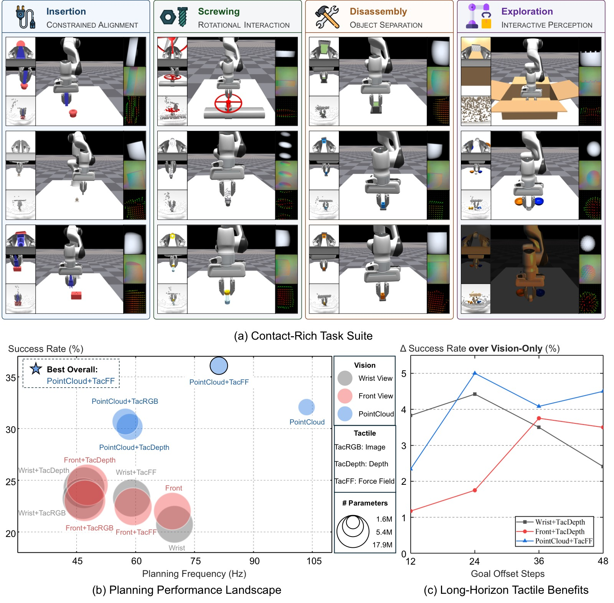

*图1：ContactWorld benchmark 和主要发现。**(a)** 12 个接触丰富操作任务横跨插入、拆卸、旋拧和探索交互四大类别，提供多模态视觉和触觉观测。**(b)** 不同视觉和触觉模态组合的规划性能全景图。点云世界模型实现了最强的整体规划性能（平均 32.1%），而 PointCloud+TacFF 提供了最佳的多模态配对（36.1%）。值得注意的是，从手腕视角（20.7%）到前视角（22.0%）再到点云（32.1%），性能呈现一致的上升趋势，验证了空间结构化表征的重要性。**(c)** 长时域下触觉增益：横轴为 goal-offset 步数（12→48），纵轴为触觉带来的绝对成功率提升。随着规划时域增长，触觉的相对重要性持续增加，尤其对点云视觉表征。这表明在需要更长预测和规划的操作中，触觉提供的接触动态信息变得愈发关键。*

### 2.2 感知模态与表征属性

ContactWorld 提供 **3 种视觉模态** + **3 种触觉模态**：

**视觉模态：**
| 模态 | 形状 | 特点 |
|------|------|------|
| Wrist View | 256×256×3 | 局部近距视角，易被遮挡 |
| Front View | 256×256×3 | 全局视角，保持时序连续性 |
| PointCloud | 1024×6 (XYZRGB) | 显式保留 3D 空间结构 |

**触觉模态：**
| 模态 | 形状 | 特点 |
|------|------|------|
| TacRGB | 320×240×3 | 局部触觉外观 |
| TacDepth | 320×240 | 局部表面形变 |
| TacFF | 10×14×3 | 空间分布力场 $(f_z, f_x, f_y)$，包含法向力和切向剪切力 |

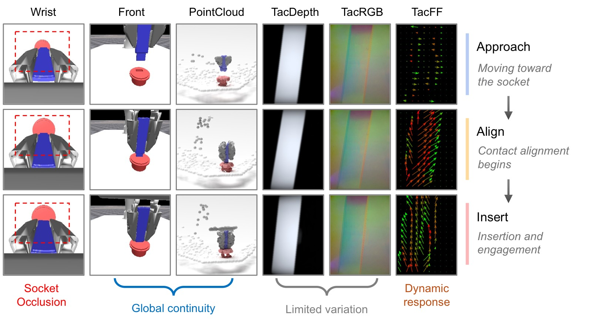

*图2：USB 插入过程中的多模态观测示例。随着机器人从接近→对齐→插入阶段的推进，**手腕视角**因末端执行器遮挡逐渐失去对插孔的可见性，破坏了任务相关的视觉连续性；**前视角图像**保持全局可见性，能持续观察到插头与插孔的关系；**点云**进一步提供显式的 3D 空间几何，使对齐和插入的结构变化更容易被表征。触觉方面，**TacRGB** 和 **TacDepth** 在接触阶段之间的外观变化相对平滑，相位转换不够显式；而 **TacFF** 呈现清晰的相位依赖力响应模式——接近阶段力响应弱，对齐阶段剪切力增强，插入阶段力重新分布。这表明力场触觉表征提供了比外观类触觉更丰富的交互动态信息。*

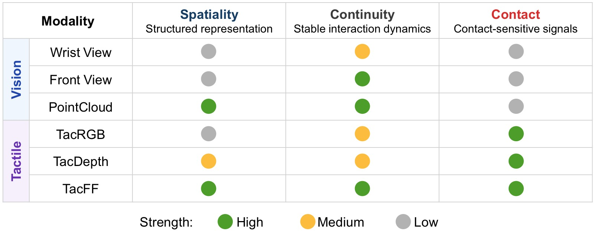

*图3：ContactWorld 模态的表征属性定性分析。论文提出三个核心表征属性来刻画每种模态：**Spatiality（空间结构性）**——模态是否保留结构化的空间几何信息，点云（强）> 前视图（中）> 手腕视图（弱）；**Continuity（时序连续性）**——模态是否在操作全程提供时间一致的交互线索，前视图和点云较强，手腕视图因遮挡而不连续；**Contact（接触敏感性）**——模态对物理接触变化的响应程度，三种触觉模态均强于纯视觉。TacFF 在空间结构和接触敏感性两方面都优于 TacRGB 和 TacDepth。这个分类框架为后续实验分析提供了概念基础：有效的接触丰富世界模型应受益于同时保留空间结构、交互动态和接触敏感反馈的模态。*

### 2.3 世界模型学习与规划框架

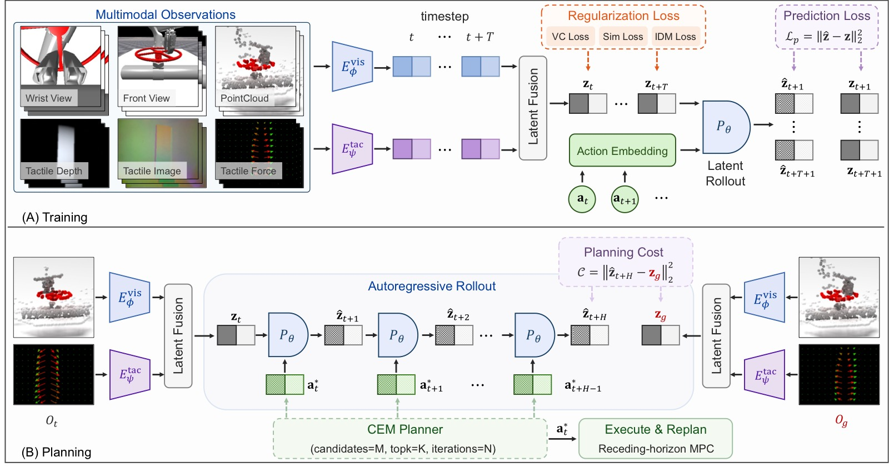

*图4：ContactWorld 的训练与规划框架。**(A) 训练阶段：** 多模态观测通过轻量级模态特定编码器分别编码——图像类模态（Wrist/Front View、TacRGB、TacDepth）使用 IMPALA 风格卷积编码器，点云使用 PointNet 风格空间编码器，TacFF 使用 tokenized MLP 编码器。视觉和触觉 latent 通过拼接融合后，送入 GRU 循环预测器进行自回归潜在状态预测。训练目标结合了 JEPA 风格未来嵌入预测损失（$\mathcal{L}_{\mathrm{pred}}$）、VICReg 风格方差-协方差正则化（$\mathcal{L}_{\mathrm{reg}}$）、时序平滑正则化（$\mathcal{L}_{\mathrm{sim}}$）和逆动力学建模损失（$\mathcal{L}_{\mathrm{idm}}$）。**(B) 规划阶段：** 采用 CEM（交叉熵方法）+ 滚动时域 MPC。在每个时间步：编码当前多模态观测为 latent state → 采样候选动作序列 → 学到的预测器进行自回归 latent rollout → 计算 rollout 终点的 latent 与目标 latent 的 L2 距离作为规划代价 → CEM 迭代优化动作分布 → 仅执行优化序列的第一个动作后重新规划。*

关键架构细节：
- **编码器**：IMPALA（图像）、PointNet（点云）、Tokenized MLP（触觉力场）
- **预测器**：轻量级 GRU，自回归 latent rollout
- **融合**：默认使用晚期拼接（Concat Fusion），视觉支路单独施加正则化
- **正则化**：默认 VICReg 方差-协方差正则化（优于 SIGReg）
- **规划**：CEM（100 候选序列，4 次迭代，top-8 精英），planning rollout horizon = 6
- **训练**：AdamW，lr=1e-4，batch=64，100k steps，rollout horizon n=2

---

## 三、训练目标

ContactWorld 采用 JEPA 风格的潜在预测学习框架，不重建像素，直接在嵌入空间预测未来。

**主要预测损失：**
$$\mathcal{L}_{\mathrm{pred}} = \|\hat{\mathbf{z}}_{t+1} - \mathbf{z}_{t+1}\|_2^2$$

**时序平滑正则化：**
$$\mathcal{L}_{\mathrm{sim}} = \|\mathbf{z}_{t+1} - \mathbf{z}_t\|_2^2$$

**逆动力学建模（IDM）：**
$$\mathcal{L}_{\mathrm{idm}} = \|\mathbf{a}_t - h_\psi(\mathbf{z}_t, \mathbf{z}_{t+1})\|_2^2$$

**最终损失：**
$$\mathcal{L} = \mathcal{L}_{\mathrm{pred}} + \lambda_{\mathrm{reg}}\mathcal{L}_{\mathrm{reg}} + \lambda_{\mathrm{sim}}\mathcal{L}_{\mathrm{sim}} + \lambda_{\mathrm{idm}}\mathcal{L}_{\mathrm{idm}}$$

其中 $\mathcal{L}_{\mathrm{reg}}$ 为 VICReg（默认）或 SIGReg 正则化，系数分别为 $\lambda_{\mathrm{reg}}=1.0$（VC）或 $0.1$（SIGReg），$\lambda_{\mathrm{sim}}=\lambda_{\mathrm{idm}}=0.1$。

**核心设计选择：**
1. 视觉 latent 单独正则化，触觉 latent 不施加正则化——因为触觉信号是高局部性、接触敏感的，正则化会抑制细粒度的接触动态信息
2. 不重建像素，直接预测未来 embedding——计算高效且聚焦于任务相关动态

---

## 四、实验与结果

### 4.1 主实验结果

**结论一：空间结构化 + 时序连续的表征显著提升接触丰富规划性能。**

| 视觉模态 | Vision Only | +TacDepth | +TacRGB | +TacFF | 最佳 |
|----------|:-----------:|:---------:|:-------:|:------:|:----:|
| Wrist View | 20.7 | 24.3 | 23.2 | 23.3 | 24.3 |
| Front View | 22.0 | 24.5 | 23.0 | 22.4 | 24.5 |
| **PointCloud** | **32.1** | 30.2 | 30.7 | **36.1** | **36.1** |

- 手腕视角 → 前视角：20.7% → 22.0%（+1.3%），前视角保持更好的时序连续性
- 前视角 → 点云：22.0% → 32.1%（**+10.1%**），点云提供显式 3D 几何结构
- PointCloud+TacFF 达到最优 36.1%，比最差的 Wrist-Only（20.7%）提高 74%

**结论二：触觉的效果取决于跨模态表征兼容性，而非模态扩展本身。**

- 对图像类视觉（Wrist/Front）：触觉普遍有益，TacDepth 提升约 3-4 个百分点
- 对点云视觉：TacRGB 和 TacDepth 反而轻微降低性能（32.1% → 30.2%/30.7%），只有 TacFF 进一步提升（32.1% → 36.1%）
- 原因：点云已经提供丰富的空间几何，图像类触觉（外观/形变）无法提供互补信息；力场触觉则提供互补的接触动态

**结论三：长时域规划放大表征质量的差异。**

| Goal-Offset | Wrist-Only | Front-Only | PC-Only | PC+TacFF |
|:-----------:|:----------:|:----------:|:-------:|:--------:|
| 12 steps | 41.4 | 44.8 | 52.1 | **54.4** |
| 24 steps | 21.1 | 23.7 | 36.6 | **41.6** |
| 36 steps | 12.3 | 11.7 | 23.7 | **27.8** |
| 48 steps | 8.2 | 7.9 | 16.0 | **20.5** |

关键发现：
- 所有模态随 goal-offset 增大而性能下降（rollout 误差累积）
- 点云在所有 offset 下持续最优，远超前视图和手腕视图
- 触觉增益在长时域更显著：PC+TacFF vs PC-Only 从 +2.3%（12 steps）扩大到 +4.5%（48 steps）

### 4.2 消融实验

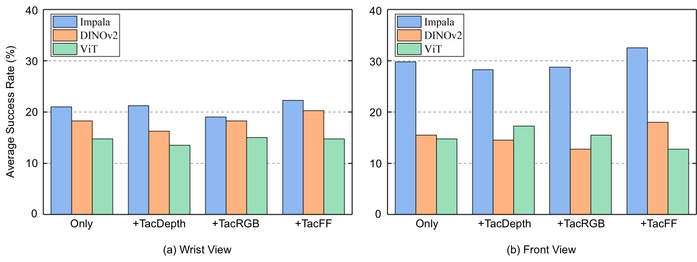

*图5：USB 插入任务上的视觉表征消融（平均 12/24/36/48-step 性能）。对比三种视觉编码器：**(1) IMPALA（从头训练）**——默认方案，轻量级卷积编码器；**(2) 冻结 DINOv2**——大规模预训练语义特征；**(3) ViT（从头训练）**——轻量级 Vision Transformer。IMPALA 在所有视觉模态和触觉配置下持续优于 DINOv2 和 ViT，这一差距在前视图观测下尤为显著。关键洞察：语义视觉表征（如 DINOv2）对不变性和高层语义理解进行了优化，而接触丰富的世界建模需要保留动作条件交互动态和时序演化接触行为的表征——这两类需求存在根本性差异。此外，当前 GRU 预测器在紧凑向量潜在空间操作，语义优化的表征不一定对齐循环潜在动态建模的预测需求。*

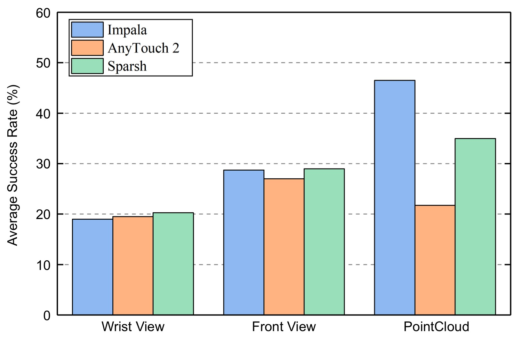

*图6：TacRGB 触觉编码器消融（USB 插入任务，平均 12/24/36/48-step）。对比三种触觉编码器：**(1) IMPALA（从头训练）**；**(2) AnyTouch 2（冻结预训练）**；**(3) Sparsh（冻结 MAE ViT-Base 预训练）**。对于手腕和前视图观测，预训练触觉编码器略优于 IMPALA，其中 Sparsh 表现最强——说明预训练触觉特征对基于图像的视觉世界模型有一定互补价值。但对于点云观测，趋势完全反转：从头训练的 IMPALA 大幅超越 AnyTouch 2 和 Sparsh。一个可能的原因是，预训练触觉编码器在图像类触觉数据上训练，与图像的视觉表征兼容性更好，但与点云的几何结构存在表征不对齐。这进一步支持了核心发现：跨模态表征兼容性比单纯使用更强的预训练编码器更重要。*

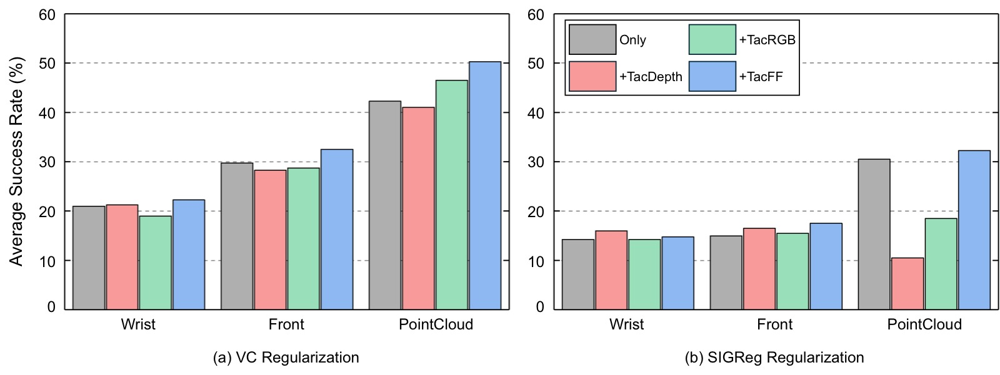

*图7：正则化策略消融（USB 插入任务，平均 12/24/36/48-step）。对比 VC（VICReg 方差-协方差）和 SIGReg（Sketch Isotropic Gaussian）两种潜在正则化策略。VC 在所有多模态配置下持续优于 SIGReg。虽然 SIGReg 在通用视觉世界模型（如 LeWorldModel）中有效，但接触丰富操作需要保留细粒度交互动态和动作条件接触演化的表征。VC 正则化允许更灵活的潜在几何结构同时防止坍缩，使世界模型更好地保留结构化交互动态。这提示：潜在正则化的选择对接触丰富世界建模有重要影响，不能简单沿用通用视觉世界模型的最佳实践。*

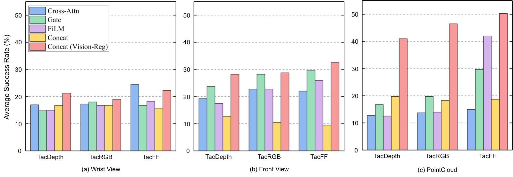

*图8：跨模态融合策略与正则化位置消融（USB 插入任务，平均 12/24/36/48-step）。对比五种方案：**(1) Cross-Attention 融合**——视觉 token 通过交叉注意力融合触觉 token；**(2) Gate 融合**——触觉通过可学习门控调制视觉残差；**(3) FiLM 融合**——触觉条件下的仿射变换；**(4) Concat 融合**——晚期拼接（默认方案）；**(5) Concat (Vision-Reg)**——拼接 + 仅视觉支路正则化（本文最终方案）。关键发现：尽管 Cross-Attention、Gate、FiLM 引入了显著更高的架构复杂度，它们并未一致优于简单的晚期拼接。更重要的是，**正则化位置**比融合架构复杂度更关键——Concat (Vision-Reg) 在几乎所有配置下持续改进性能，对 PointCloud+TacFF 达到最强。原因：触觉表征高度局部化、接触敏感且常在接触转移时突变，直接正则化触觉 embedding 可能抑制了长时域预测所需的关键接触动态信息。保留视觉和触觉支路的显式分离，仅对视觉支路正则化，是最佳实践。*

### 4.3 自回归 Rollout 误差分析

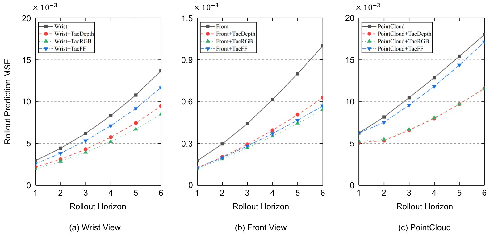

*图9：USB 插入任务上的多步潜在 rollout 预测误差分析。横轴为 rollout 步数（1→6），纵轴为潜在预测误差（L2 距离）。**关键发现**：(1) 所有模态组合的预测误差随 rollout horizon 单调递增——这是潜在动态不确定性的累积效应，解释了为什么长时域规划性能随 goal-offset 下降；(2) 跨手腕、前视、点云三种视觉模态，引入触觉观测一致降低了 rollout 误差的累积速度，说明触觉提高了潜在预测的时序一致性；(3) 点云世界模型的误差累积最慢，与规划结果中空间结构化表征的最强长时域鲁棒性一致。这张图提供了一个预测层面的解释：触觉传感降低了 autoregressive rollout 中的误差累积，这对规划目标越远越重要。*

### 4.4 触觉性能分布分析

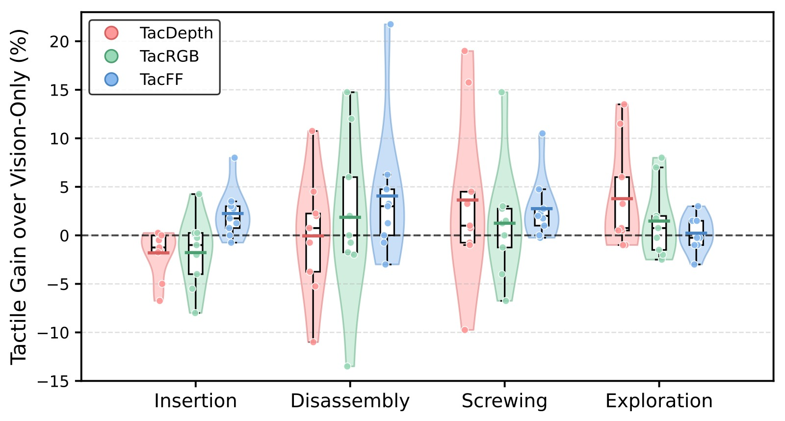

*图10：不同触觉表征在各任务类别上的性能变化分布（触觉 vs 纯视觉的绝对增益）。小提琴图展示所有 12 个任务的触觉性能增量分布，箱线图标注中位数和四分位数，散点为单个任务结果。**关键发现**：(1) TacFF 在插入和拆卸任务中提供最一致的改进——这些任务严重依赖演化中的接触动态和摩擦交互，力场响应对此提供直接信息；(2) TacDepth 在旋拧和探索任务中通常表现更强——这些任务中局部几何形变和接触状态感知比力演化更重要；(3) TacRGB 在不同任务间表现波动最大，说明外观类触觉观测提供的预测结构不够稳定；(4) 在插入任务中，基于图像的触觉表征甚至会降低性能（负增益），这与点云场景下 TacRGB/TacDepth 的负面效果一致——局部外观类触觉在精确接触对齐过程中提供的是不稳定的交互结构信息。*

### 4.5 多模态时序可视化

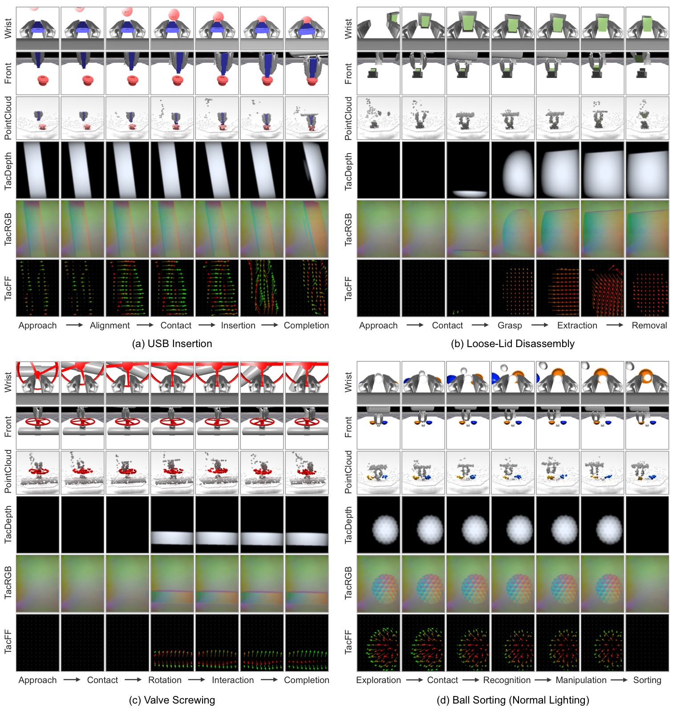

*图11：代表性 ContactWorld 任务上的同步多模态时序观测。从上到下依次展示手腕视图、前视图、点云、TacDepth、TacRGB、TacFF 在操作各阶段的演化。**视觉层面**：前视图在整个交互过程中保留较广的场景可见性，手腕视图在插入和对齐阶段逐渐被遮挡，点云始终保持显式 3D 几何结构。**触觉层面**：TacRGB 和 TacDepth 主要捕获局部外观和表面形变，TacFF 产生时序演化的力响应，清晰揭示接触转移、旋转交互和力重新分布的过程。这张图直观验证了论文提出的三个表征属性的定性差异。

### 4.6 真实世界实验

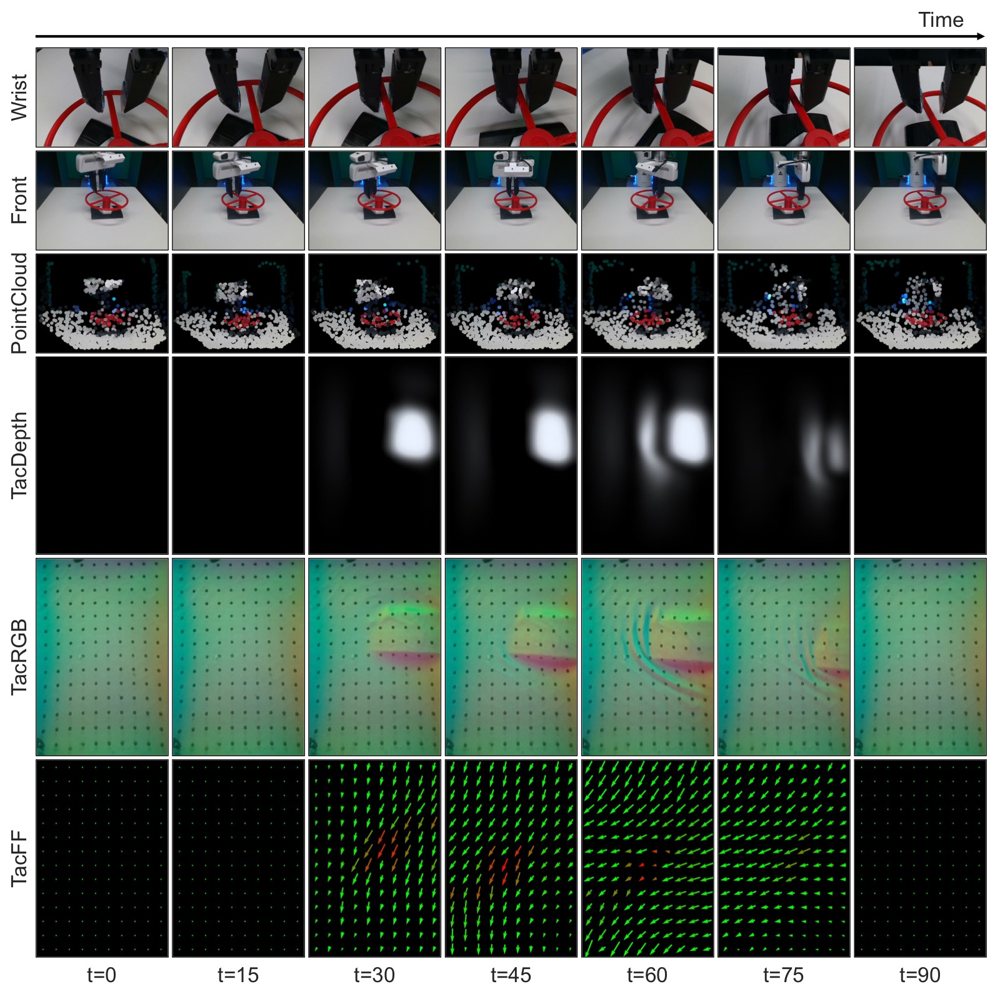

*图12：真实世界阀门旋拧任务上的代表性多模态时序轨迹。使用 Franka Emika Panda 机械臂 + GelSight R1.5 触觉传感器，在 65 条遥操作示教轨迹上训练世界模型。真实世界结果（每配置 10 次评估）：

| 视觉 | Only | +TacDepth | +TacRGB | +TacFF |
|------|:----:|:---------:|:-------:|:------:|
| Wrist View | 70 | 50 | **90** | 40 |
| Front View | 70 | 70 | **80** | 50 |
| PointCloud | **90** | 70 | 80 | 70 |

关键发现：
1. **点云在真实世界同样最优**：PointCloud-Only 达 90%，验证了空间结构化表征的核心价值可以迁移到真实世界
2. **TacRGB 在真实世界对图像视觉有效**：Wrist+TacRGB 从 70% 提升至 90%，Front+TacRGB 从 70% 提升至 80%——当视觉部分可观测时，触觉外观信息提供有用接触线索
3. **TacDepth/TacFF 未持续改善**：重建类触觉表征在真实世界受 marker tracking、深度估计、力推断等误差影响，不如仿真中可靠
4. **Sim-to-real gap 存在**：真实世界中 TacDepth/TacFF 需从原始触觉测量重建，引入了仿真中不存在的传感噪声

---

## 五、关键洞察与技术亮点

1. **表征结构 > 编码器规模**：点云（简单的 PointNet 编码器）大幅超越图像（IMPALA/ViT），空间几何结构比编码器表达能力更重要
2. **触觉不是免费的午餐**：触觉的有效性取决于与视觉表征的兼容性——点云 + 力场触觉互补，点云 + 外观触觉反而冲突
3. **正则化位置 > 融合架构复杂度**：Vision-Reg 策略（仅视觉支路正则化）比复杂的 Cross-Attention/Gate/FiLM 融合更有效
4. **预训练特征不比任务特定编码器更好**：DINOv2 语义特征 < IMPALA 从头训练，预训练触觉编码器对点云视觉反而更差
5. **长时域规划是表征质量的放大镜**：48-step 下不同表征的性能差距比 12-step 下大得多
6. **逆动力学 + 时序平滑 + 潜在正则化的组合有效**：JEPA 风格预测 + 辅助损失防止坍缩，对接触丰富操作稳定
7. **GRU 预测器成本远低于 ViT 预测器**：同一任务下 GRU 性能显著高于 ViT，且规划频率高 20×
8. **三个表征属性的概念框架**：Spatiality + Continuity + Contact Sensitivity 提供了理解和预测模态有效性的分析视角

---

## 六、代码实现解读

论文未附带代码（将开源）。以下是基于论文附录描述的架构模拟解读：

### 6.1 整体架构数据流

```
┌─────────────────────────────────────────────────────────┐
│                    Training Pipeline                     │
├─────────────────────────────────────────────────────────┤
│                                                         │
│  ┌──────────┐   ┌──────────────┐   ┌───────────────┐  │
│  │ Visual   │   │ IMPALA/PN    │   │ z_vis (512d)  │  │
│  │ Obs      │──▶│ Encoder      │──▶│               │  │
│  └──────────┘   └──────────────┘   └───────┬───────┘  │
│                                            │           │
│  ┌──────────┐   ┌──────────────┐   ┌───────┴───────┐  │
│  │ Tactile  │   │ IMPALA/MLP   │   │ z_tac (512d)  │  │
│  │ Obs      │──▶│ Encoder      │──▶│               │  │
│  └──────────┘   └──────────────┘   └───────┬───────┘  │
│                                            │           │
│                                    ┌───────┴───────┐  │
│                                    │ Concat Fusion │  │
│                                    │ z = [z_vis;   │  │
│                                    │     z_tac]    │  │
│                                    └───────┬───────┘  │
│                                            │           │
│                              ┌─────────────┴───────┐  │
│                              │ GRU Predictor        │  │
│                              │ z_{t+1} = P(z_t,a_t)│  │
│                              └─────────────┬───────┘  │
│                                            │           │
│         ┌──────────────────────────────────┤           │
│         │          ┌───────────────────────┤           │
│         ▼          ▼                       ▼           │
│  L_pred (MSE)  L_reg (VC)  L_sim + L_idm              │
│                                                         │
└─────────────────────────────────────────────────────────┘
```

### 6.2 编码器设计

```
Visual Encoders:
┌──────────────────────────────────────────────────┐
│ Image (Wrist/Front):                             │
│   256×256×3 → IMPALA ResBlock stacks            │
│   → Projection → LayerNorm → z (512d)            │
│                                                  │
│ PointCloud:                                      │
│   1024×6 (XYZRGB) → Shared MLP (per-point)      │
│   → Global Max Pooling → MLP → z (512d)          │
└──────────────────────────────────────────────────┘

Tactile Encoders:
┌──────────────────────────────────────────────────┐
│ TacRGB (320×240×3) / TacDepth (320×240):         │
│   → IMPALA ResBlock stacks                       │
│   → Projection → LayerNorm → z (512d)            │
│                                                  │
│ TacFF (10×14×3):                                 │
│   Per-taxel (fz,fx,fy) → Shared MLP (→64d)      │
│   → Optional Position Embedding                  │
│   → Token Aggregation → Projection → z (512d)    │
└──────────────────────────────────────────────────┘
```

### 6.3 规划流程

```
┌──────────────────────────────────────────────────────┐
│                CEM + MPC Planning Loop                │
├──────────────────────────────────────────────────────┤
│                                                      │
│  ┌─────────┐     ┌────────────┐     ┌────────────┐  │
│  │ Encode  │     │ Encode     │     │ Initialize │  │
│  │ O_t     │────▶│ O_g (goal) │     │ CEM dist   │  │
│  │ → z_t   │     │ → z_g      │     │ μ, σ       │  │
│  └────┬────┘     └─────┬──────┘     └─────┬──────┘  │
│       │                │                  │          │
│       │   ┌────────────┴──────────────────┘          │
│       │   │  for iter = 1..4:                        │
│       │   │    1. Sample 100 action seqs a*_1:H      │
│       │   │    2. For each: autoregressive rollout    │
│       │   │       z_t → z_{t+1} → ... → z_{t+H}      │
│       │   │    3. Cost = ||z_{t+H} - z_g||_2^2       │
│       │   │    4. Select top-8 elite candidates      │
│       │   │    5. Update μ, σ from elites             │
│       │   │                                          │
│       │   └──▶ Execute a*_1 (first action only)      │
│       │        Replan at next timestep                │
│       │                                              │
│  H=6 (rollout horizon)                               │
│  Goal-offset = {12, 24, 36, 48} env steps            │
└──────────────────────────────────────────────────────┘
```

### 6.4 关键公式 → 架构映射

| 公式 | 架构组件 | 说明 |
|------|----------|------|
| $\mathbf{z}_t = [\mathbf{z}_t^{\mathrm{vis}}; \mathbf{z}_t^{\mathrm{tac}}]$ | Concat Fusion | 视觉和触觉 latent 拼接 |
| $\mathbf{z}_{t+1} = P_\theta(\mathbf{z}_t, \mathbf{a}_t)$ | GRU Predictor | 动作条件自回归 latent 转移 |
| $\mathcal{L}_{\mathrm{pred}} = \|\hat{\mathbf{z}}_{t+1} - \mathbf{z}_{t+1}\|_2^2$ | JEPA 式预测损失 | 在 latent 空间而非像素空间预测 |
| $\mathcal{C} = \|\hat{\mathbf{z}}_{t+H} - \mathbf{z}_g\|_2^2$ | CEM 规划代价 | 最小化预测 latent 与目标 latent 的距离 |
| Vision-Reg | 正则化策略 | 仅在视觉 latent 上施加 VC/VICReg |

---

## 七、局限性

1. **任务相对单一**：虽然 benchmark 覆盖了 12 个任务，但大多数仍是单阶段、目标导向的。真实操作常需要层级化多阶段推理、序贯接触转移和动态任务重规划
2. **时域仍较短**：最长 goal-offset 为 48 步（4.8 秒），实际应用可能需要更长的规划时域。48 步下所有方法性能已大幅下降（最高 20.5%）
3. **重建触觉表征的 sim-to-real gap**：TacDepth 和 TacFF 在真实世界需从原始触觉测量重建（marker tracking、深度估计、力推断），引入了仿真中不存在的误差
4. **需要更大的触觉传感器多样性**：仅评估了 GelSight 类视觉触觉传感器
5. **ViT 预测器效果显著差于 GRU**：但这可能是因为点云 token 未经压缩/层次化聚合，存在较大的优化空间

---

## 八、关键概念速查

| 概念 | 含义 |
|------|------|
| **JEPA** | Joint Embedding Predictive Architecture，在潜在嵌入空间而非像素空间做预测 |
| **VICReg** | Variance-Invariance-Covariance Regularization，防止表征坍缩 |
| **SIGReg** | Sketch Isotropic Gaussian Regularization，轻量替代正则化方案 |
| **CEM** | Cross-Entropy Method，基于采样的动作序列优化方法 |
| **MPC** | Model Predictive Control，滚动时域优化控制 |
| **Goal-Offset** | 当前观测与目标观测之间的时间步数，衡量规划时域长度 |
| **Rollout Horizon** | 自回归潜在预测的步数，衡量预测稳定性 |
| **Spatiality** | 模态是否保留结构化的空间几何信息 |
| **Continuity** | 模态是否在操作全过程中提供时间一致的交互线索 |
| **Contact Sensitivity** | 模态对物理接触变化的直接响应程度 |
| **TacFF** | Tactile Force Field，空间分布触觉力场 $(f_z,f_x,f_y)$ |
| **Concat (Vision-Reg)** | 晚期拼接融合 + 仅视觉支路正则化，本文最优融合策略 |
