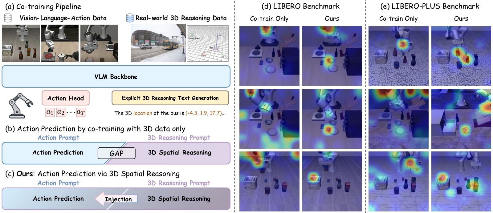
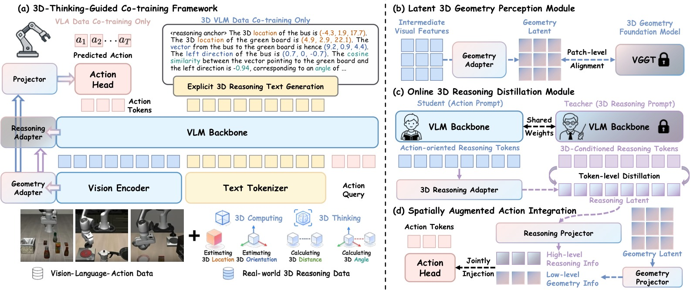
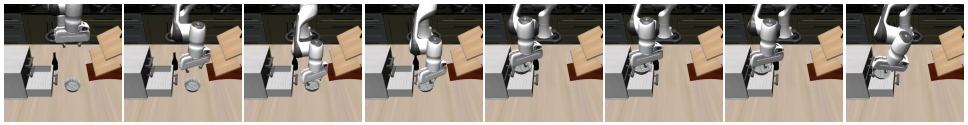
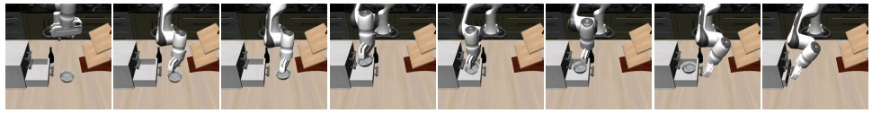
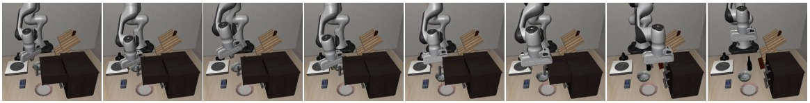
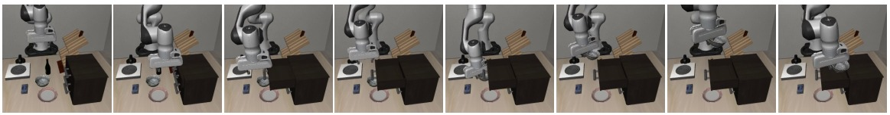
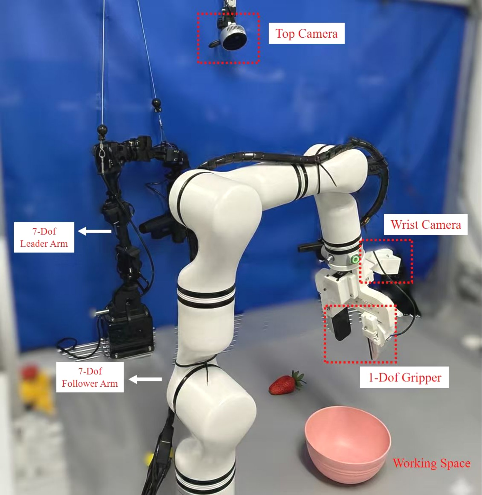
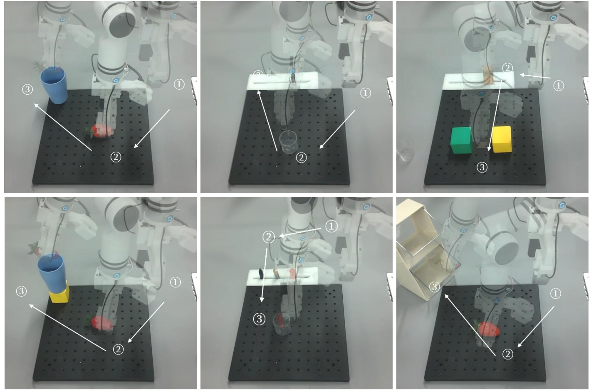
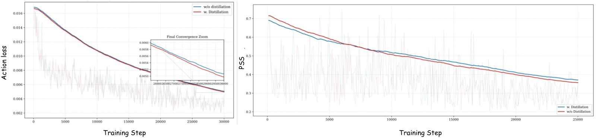

%% mathjax-macros
%% end-mathjax-macros

# 3DThinkVLA: Endowing Vision-Language-Action Models with Latent 3D Priors via 3D-Thinking-Guided Co-training

> **论文信息**
> - 作者：Jiaxin Shi (上海交大), Xidong Zhang (哈工大/大湾区大学), Fucai Zhu, Zhe Li (南洋理工), Siyu Zhu (复旦), Weihao Yuan (南京大学/大漠机器人)
> - 通讯作者：Weihao Yuan
> - 投稿方向：NeurIPS 2026 (Main Track, camera-ready)
> - arXiv ID：arXiv-2606.04436
> - 代码：即将公开
> - 机构：上海交通大学、哈尔滨工业大学、南洋理工大学、复旦大学、南京大学、大漠机器人、大湾区大学

---

## 一、核心问题

**现有 VLA 模型的 3D 空间推理瓶颈。** 当前 Vision-Language-Action (VLA) 模型主要依赖 2D 图像作为视觉输入，缺乏对 3D 空间结构的理解和推理能力。现有解决方案存在以下局限：

1. **显式 3D 注入方法**：将点云、深度图等显式 3D 信息注入 action head 或 VLM backbone，但依赖外部 3D 传感器，且需要修改 VLM 架构。
2. **隐式对齐方法**：将 VLM 视觉特征与 3D 基础模型对齐，但直接对齐会破坏 VLM 原有的视觉-语言对齐。
3. **关键盲区**：上述方法都只关注**低层几何信息注入**，缺乏**高层 3D 空间推理能力**（如推断物体位置、相对朝向等）。

**本文发现的核心问题：Prompt 诱导的推理鸿沟 (Prompt-Induced Reasoning Gap)。** 当使用标准 3D VQA prompt 时，模型能成功激活空间推理能力；但使用简单的动作预测 prompt 时，模型会绕过已学到的空间先验，退化为"动作捷径 (action shortcut)"，注意力散焦到与任务无关的区域（如机械臂本身）。



*图1：研究概览。(a) 框架在 VLA 数据和真实世界 3D 推理数据上 co-train VLM backbone，增强具身空间智能。(b) 论文识别的核心问题——prompt 诱导的推理鸿沟：vanilla co-training 中，动作 prompt 触发时模型倾向于学习动作捷径并关闭空间感知。(c) 3DThinkVLA 通过 reasoning adapter 和在线潜在蒸馏将 3D 空间思维注入动作预测，无需显式文本生成。(d)-(e) LIBERO 和 LIBERO-PLUS 上的定性结果：仅 co-training 的模型注意力散焦或聚焦于任务无关区域（如机械臂），而 3DThinkVLA 精准关注与任务相关的物体及其 3D 空间结构，从而实现更稳健的操作。*

---

## 二、核心思路 / 方法

### 总体框架

3DThinkVLA 的核心洞察是：**3D 几何感知 (geometry perception) 和 3D 空间推理 (spatial reasoning) 是两种可解耦的能力，应在模型的不同特征层级分别注入。**

框架包含三个紧密耦合的组件：
1. **Latent 3D Geometry Perception Module**：在 vision encoder 中间层注入低层几何先验
2. **Online 3D Reasoning Distillation Module**：通过共享 anchor token，将高层空间推理从 teacher 的推理 prompt 迁移到 student 的动作 prompt
3. **Spatially Augmented Action Integration**：将解耦的几何特征和推理特征联合注入 action head



*图1：3DThinkVLA 框架总览。(a) VLM backbone 在 VLA 数据和 3D 推理数据上联合训练 (co-training)，将空间智能内化到模型中。(b) Geometry Adapter 通过 patch 级别的 latent alignment，将中间层视觉特征与 3D 基础模型 (VGGT) 对齐，捕获低层几何先验。(c) Online Distillation 通过共享 anchor token，将 teacher 的显式空间推理迁移到 student 的动作预测路径，弥合 prompt 诱导的推理鸿沟。(d) 解耦的推理特征和几何特征以层级化空间条件的形式联合注入 action head，防止动作捷径。推理时，辅助模块全部丢弃，仅保留轻量 adapter，实现从 2D 图像的高效隐式 3D 推理。*

### 2.1 问题定义

VLA 策略 $\pi$ 将多视角观测 $I_t$、语言指令 $L$ 和 action queries $\tau_A$ 映射为动作块 $A_t = [a_t, a_{t+1}, \dots, a_{t+H-1}]$，每个动作 $a_t \in \mathbb{R}^7$ 包含 7-DoF 末端执行器指令（3 平移 + 3 旋转 + 1 夹爪状态）。

Backbone 采用 **Qwen3-VL-2B**，action head 采用 **OFT 风格**。

### 2.2 Latent 3D Geometry Perception（潜在 3D 几何感知）

**Geometry Adapter** 由 MLP + LayerNorm 构成，作为几何信息与视觉语义特征之间的桥梁。具体做法：

- 从 vision encoder 的**第 18 层**提取中间视觉特征 $\mathcal{F}_v \in \mathbb{R}^{B \times C \times H_v \times W_v}$
- 轻量 MLP 将视觉特征投影到几何潜在空间
- 与 3D 基础模型 **VGGT** 的输出特征 $\mathcal{F}^{3D}$ 进行 patch 级对齐

对齐损失使用余弦相似度：

$$\mathcal{L}_{\text{geo}} = 1 - \mathcal{S}(\mathcal{F}^{3D}, \mathcal{F}^{\text{Geo}})$$

其中 $\mathcal{F}^{\text{Geo}} = \mathcal{G}(\mathcal{F}_v)$ 为 geometry adapter 的输出，$\mathcal{S}$ 为余弦相似度。

**关键设计**：不对 VLM backbone 做架构修改，仅在中间特征层外挂轻量 adapter，保护了原有视觉-语言对齐。

### 2.3 Online 3D Reasoning Distillation（在线 3D 推理蒸馏）

这是本文最核心的创新。为了弥合 prompt 诱导的推理鸿沟，设计了一个完全在潜在空间中运作的 teacher-student 蒸馏方案。

**共享 Reasoning Anchor Token $\tau_R$**：
- 在 task instruction 之后插入 $\tau_R$
- 在 causal attention 下，该位置使 anchor 能吸收视觉观察和任务语义，同时不受下游 action decoding 的影响
- 动作预测变为：$\hat{A}_t = \pi_\Theta(I_t, L_{\text{task}}, \tau_R, L_{\text{action}}, \tau_A)$

**Teacher 分支**：
- 使用显式 3D 空间推理 prompt $L_{\text{teacher}}$ 激活 VLM 的空间推理
- 收集 anchor token 的隐状态：$H_{\text{teacher}}^R = \text{sg}(f_\theta(I_t, L_{\text{task}}, L_{\text{teacher}}, \tau_R))$
- 对 teacher 分支 stop gradient，保持其推理能力并加速训练

**Student 分支**：
- 使用标准动作预测 prompt，收集 anchor token 隐状态：$\hat{H}_{\text{student}}^R = f_\theta(I_t, L_{\text{task}}, \tau_R, L_{\text{action}}, \tau_A)$

**蒸馏损失**：通过 Reasoning Adapter $\mathcal{R}$（轻量 MLP + LayerNorm）将 student anchor 投影到推理潜在空间：

$$\mathcal{L}_{\text{reasoning}} = 1 - \mathcal{S}(H_{\text{teacher}}^R, \mathcal{R}(\hat{H}_{\text{student}}^R))$$

**关键特性**：
- Teacher 和 student **共享参数**，无需额外模型提供蒸馏信号
- 不需要慢速的逐 token 生成对齐
- token 特征分布相似，提高蒸馏稳定性
- 推理时不需要 teacher 分支

### 2.4 Spatially Augmented Action Integration（空间增强的动作集成）

将几何特征和推理特征联合注入 action head：
- 两个额外轻量 MLP 将 geometry latent 和 reasoning latent 投影到 action latent 空间，得到 $H_{\text{geo}}^A$ 和 $H_{\text{reasoning}}^A$
- 通过**逐元素加法**注入 action-query token：

$$\hat{A}_t = \text{Action Head}(H_A + H_{\text{geo}}^A + H_{\text{reasoning}}^A)$$

- 随机 dropout 部分样本的 $H_{\text{geo}}^A$ 和 $H_{\text{reasoning}}^A$，防止过拟合
- 消融实验证明加法融合优于 Cross-Attention 和 Gate 融合

### 2.5 训练目标与推理

**Co-training 策略**：每个训练 step 执行两次前向传播（一次 VLM 数据 + 一次 VLA 数据），梯度累积后一次反向更新。

**VLA-step 目标**：
$$\mathcal{L}_{\text{vla}} = \mathcal{L}_{\text{action}} + \lambda_a \mathcal{L}_{\text{geo}} + \lambda_d \mathcal{L}_{\text{reasoning}}$$

其中 $\mathcal{L}_{\text{action}}$ 为预测动作块与真值的 L1 距离，$\lambda_a = \lambda_d = 0.5$。

**VLM-step 目标**：在 3D VLM 数据上，要求模型**将 reasoning-anchor token 作为第一个输出 token 发出**，后续 3D 推理文本在该 anchor 条件化下生成，从而强化 anchor 的 3D 空间推理表征。

$$\mathcal{L}_{\text{vlm}} = \lambda_{\text{3D}} \mathcal{L}_{\text{CE}}$$

总损失：$\mathcal{L}_{\text{total}} = \mathcal{L}_{\text{vla}} + \mathcal{L}_{\text{vlm}}$，其中 $\lambda_{\text{3D}} = 0.1$。

**推理时**：仅保留轻量 geometry adapter 和 reasoning adapter，丢弃 VGGT、teacher 分支等所有辅助模块。模型仅需 2D 图像输入，无需 3D 传感器或显式 CoT 文本生成。

---

## 三、训练数据

**VLA 数据**：LIBERO 各任务套件（每任务 50 条人类遥操作演示）。

**3D 推理 Co-training 数据**：来自 Spatial Reasoner 数据集，基于 OpenImages 自然图像构建：
1. SAM2 获取实例 mask
2. Depth Anything V2 估计深度
3. 姿态估计算法获取 3D 坐标和朝向
4. 严格几何计算生成空间关系标签（3D 欧氏距离、方向向量夹角等）

包含三个难度递增的子集：
- **Basic3D-QA**：仅查询物体位置或基于已知坐标的简单计算
- **SpatialReasoning-QA**：常规 3D 空间 VQA，直接输出答案
- **SpatialReasoning-CoT**：要求生成完整 CoT，包括中间 3D 解析和几何计算

训练时混合 24,000 SR-CoT 样本 + 24,000 LLaVA 通用图文指令数据，防止灾难性遗忘。

**训练配置**：8 × NVIDIA A100 (80GB)，bfloat16 混合精度，AdamW 优化器，base lr = 2.5e-5，action head lr = 2.0e-4，cosine 调度，gradient clipping = 1.0。

---

## 四、实验与结果

### 4.1 LIBERO Benchmark

| 方法 | Spatial | Object | Goal | Long | **Avg** |
|------|---------|--------|------|------|---------|
| OpenVLA | 84.7 | 88.4 | 79.2 | 53.7 | 76.5 |
| CoT-VLA | 87.5 | 91.6 | 87.6 | 69.0 | 83.9 |
| $\pi_0$ | 96.8 | 98.8 | 95.8 | 85.2 | 94.2 |
| OpenVLA-OFT | 97.6 | 98.4 | 97.9 | 94.5 | 97.1 |
| SpatialVLA | 88.2 | 89.9 | 78.6 | 55.5 | 78.1 |
| GeoVLA | 98.4 | 99.0 | 96.6 | 96.6 | 97.7 |
| 3D-CAVLA | 98.2 | 99.8 | 98.2 | 96.1 | 98.1 |
| SpatialForcing | 99.4 | 99.6 | **98.8** | 96.0 | 98.5 |
| VITA | 95.9 | 98.9 | 95.1 | **96.8** | 96.7 |
| **3DThinkVLA** | **100.0** | **100.0** | **98.8** | 95.8 | **98.7** |

> 3DThinkVLA 在 Spatial 和 Object 两个套件上达到 100% 成功率，平均 98.7% 为所有方法最优。

### 4.2 LIBERO-PLUS（零样本泛化）

在 LIBERO 上训练后直接迁移到 LIBERO-PLUS（7 种扰动维度），零样本评估：

| 方法 | Camera | Robot | Lang. | Light | Bg. | Noise | Layout | **Avg** |
|------|--------|-------|-------|-------|------|-------|--------|---------|
| OpenVLA | 0.8 | 3.5 | 23.0 | 8.1 | 34.8 | 15.2 | 28.5 | 15.6 |
| OpenVLA-OFT | 56.4 | 31.9 | 79.5 | 88.7 | 93.3 | 75.8 | 74.2 | 69.9 |
| ABot-M0 | 60.4 | **67.9** | 86.4 | 96.2 | 91.6 | **86.4** | **82.6** | 80.5 |
| Qwen3-VL-OFT | 47.0 | 60.1 | **87.0** | 96.3 | **95.3** | 73.1 | 79.2 | 75.0 |
| **3DThinkVLA** | **73.8** | 64.5 | 78.0 | **98.4** | 94.8 | 84.7 | 81.5 | **81.0** |

> 平均 81.0%，尤其在 Camera 扰动（+13.4%）和 Light 扰动上大幅领先。与基线 Qwen3-VL-OFT 相比，涉及高度变化的轨迹上优势明显。






*图2-5：LIBERO-PLUS 上的定性对比。Task 1："把黑色碗放进柜子底部抽屉并关上。" Task 2："把黑色碗放进柜子顶部抽屉并关上。" Qwen3-VL-OFT 频繁错误估计物体的高度，导致碰撞周围物体或错误判断目标位置。3DThinkVLA 持续产出准确的高度感知预测，证明 3D 空间推理是处理高度变化扰动的关键能力。*

### 4.3 SimplerEnv

| 方法 | Carrot | Eggplant | Spoon | Stack | **Avg** |
|------|--------|----------|-------|-------|---------|
| Octo | 8.3 | 43.1 | 12.5 | 0.0 | 16.0 |
| OpenVLA | 0.0 | 4.1 | 0.0 | 0.0 | 1.0 |
| Open $\pi_0$ | 61.3 | 89.6 | 73.7 | 15.8 | 60.0 |
| QDepth-VLA | 57.5 | 95.0 | 82.0 | 39.6 | 68.5 |
| UniVLA | **83.3** | 66.7 | 33.3 | **95.8** | 69.8 |
| VITA | 68.8 | 95.6 | 84.2 | 37.5 | 71.5 |
| **3DThinkVLA** | 75.0 | 95.8 | **87.5** | 33.3 | **72.9** |

> 平均 72.9%，超越所有之前方法，验证了框架的广泛适用性。

### 4.4 消融实验

| ID | Co-train | Geo Adapter | Reason Adapter | Reason Anchor | Spatial | Object | Goal | Long | **Avg** |
|----|----------|-------------|----------------|---------------|---------|--------|------|------|---------|
| R1 | — | ✗ | ✗ | ✗ | 93.6 | 99.6 | 97.4 | 92.6 | 95.8 |
| R2 | 2D Data | ✗ | ✗ | ✗ | 96.8 | 99.8 | 98.0 | 95.0 | 97.4 |
| R3 | 3D Data | ✗ | ✗ | ✗ | 99.8 | 100.0 | 98.8 | 93.0 | 97.9 |
| R4 | 3D Data | ✓ | ✗ | ✗ | 99.0 | 100.0 | 98.2 | **95.8** | 98.3 |
| R5 | 3D Data | ✓ | ✓ | ✗ | 99.6 | 100.0 | 98.8 | **95.8** | 98.6 |
| R6 | 3D Data | ✓ | ✗ | ✓ | 99.2 | 100.0 | **99.4** | 94.4 | 98.3 |
| R7 | 3D Data | ✓ | ✓ | ✓ | **100.0** | **100.0** | 98.8 | **95.8** | **98.7** |

**关键发现**：
- **R1→R2/R3**：Co-training 带来显著提升（95.8→97.4/97.9），3D co-training 优于 2D co-training
- **R3→R4**：Geometry adapter 在 Long 套件上改进最大（93.0→95.8），说明几何先验对长程操作任务特别有益
- **R4→R6**：Reasoning anchor 主要改善 Goal 套件（98.2→99.4），表明显式推理锚定对目标导向决策尤其有帮助
- **R5/R6→R7**：完整模型达到最佳性能，几何感知和推理蒸馏互补——前者提供稳定的几何空间线索，后者增强任务相关的推理信号

### 4.5 真实机器人实验




*图6-7：真实机器人实验设置。(a) Realman 机器人平台，配备 7-DoF 机械臂、1-DoF 夹爪、顶部相机和腕部相机。(b) 三个真实世界任务：Task 1 测试高度变化下的泛化能力；Task 2 评估透明容器识别能力（将物体放入透明容器）；Task 3 考察空间位置理解能力（将物体放置在指定空间位置）。所有模型每任务训练 100 episodes，每个变体评估 50 次（共 150 次试验）。*

| 方法 | Task 1 (高度变化) | Task 2 (透明容器) | Task 3 (空间位置) |
|------|------------------|-------------------|-------------------|
| $\pi_0$ | 63.3% | 82.0% | 51.3% |
| OpenVLA-OFT | 28.0% | 57.3% | 30.7% |
| **3DThinkVLA** | **88.0%** | **93.3%** | **61.3%** |

> 在所有三个任务上显著优于基线方法，尤其在高度变化场景 (+24.7%) 和透明容器场景 (+11.3%) 上。Task 3 的空间位置理解对所有方法仍具挑战性。

---

## 五、关键洞察与技术亮点

### 5.1 Prompt 诱导的推理鸿沟

本文首次系统性地识别和刻画了这一现象：标准动作预测 prompt 会使模型"关闭"其在 VLM 预训练和 3D co-training 中学到的空间推理能力，退化为简单的视觉-动作映射。这解释了为什么简单的 co-training 不足以充分利用 3D 先验。

### 5.2 解耦几何感知与空间推理

将 3D 能力拆分为两个层次：
- **低层几何感知**（"这个像素对应什么深度/3D 结构？"）→ 在 vision encoder 中间层对齐
- **高层空间推理**（"物体 A 在物体 B 的左边吗？距离多远？"）→ 在 reasoning anchor token 中编码

两者通过特征层次的分离避免了互相干扰，又通过 additive fusion 在 action head 中互补。

### 5.3 共享 Anchor 的在线潜在蒸馏

相比传统的显式 CoT 文本蒸馏（慢、不稳定、文本-动作空间域差距大），本文的潜在空间蒸馏：
- 无需逐 token 文本生成（速度快）
- Teacher-student 共享参数（无需额外模型）
- 在 latent space 中对齐（避免文本-动作域差距）
- 消融实验证明优于 privileged information 蒸馏

### 5.4 梯度层面的协同效应



*图8：训练 action loss 曲线 (a) 和 Projection-Space Similarity 分析 (b)。蓝色曲线为使用 online 3D reasoning distillation module，红色曲线为仅 3D co-training。采用投影空间相似度 (PSS) 度量 VLM 任务和 VLA 任务在共享参数空间中的优化一致性。PSS 计算两个任务梯度的正交投影矩阵之间的重叠度，值越大表示优化方向越一致。3D co-training 使 PSS 维持在约 0.4 的正值，表明任务间存在稳健的协同效应。引入 online reasoning distillation 进一步加速收敛并提升 PSS，确认该方法有效促进动作预测与 VLM 优化的梯度非冲突。*

---

## 六、代码实现解读（待代码公开后补充）

论文代码尚未公开，以下基于论文描述的架构推演：

```
┌─────────────────────────────────────────────────────────┐
│                     Training Loop                        │
├─────────────────────────────────────────────────────────┤
│  ┌──────────────┐          ┌──────────────┐             │
│  │  VLM Batch   │          │  VLA Batch   │             │
│  │  (3D QA +    │          │  (Robot      │             │
│  │   General)   │          │   Demo Data) │             │
│  └──────┬───────┘          └──────┬───────┘             │
│         │                         │                      │
│         ▼                         ▼                      │
│  ┌──────────────────────────────────────┐               │
│  │     Qwen3-VL-2B Backbone (shared)    │               │
│  │  ┌─────────────────────────────────┐ │               │
│  │  │  Vision Encoder (18th layer ───┐│ │               │
│  │  │  intermediate features)        ││ │               │
│  │  └───────────────────────────────┬┘│ │               │
│  │                                  │  │ │               │
│  │  ┌───────────────────────────────▼┐ │ │               │
│  │  │  LLM Backbone                  │ │ │               │
│  │  │  [τ_R anchor token inserted]   │ │ │               │
│  │  └───────────┬───────────────────┬┘ │ │               │
│  └──────────────┼───────────────────┼──┘               │
│                 │                   │                    │
│    ┌────────────▼──────┐   ┌───────▼────────┐          │
│    │  Geometry Adapter  │   │  Reasoning     │          │
│    │  (MLP + LayerNorm) │   │  Adapter       │          │
│    │                    │   │  (MLP+LayerNorm)│          │
│    │  Align with VGGT   │   │  Distill from  │          │
│    │  (3D foundation)   │   │  teacher τ_R   │          │
│    └────────┬───────────┘   └───────┬────────┘          │
│             │                       │                    │
│             └───────┬───────────────┘                    │
│                     │                                    │
│                     ▼                                    │
│  ┌──────────────────────────────────────┐               │
│  │     Spatially Augmented Action Head  │               │
│  │  H_A + H_geo^A + H_reasoning^A → Â_t │               │
│  └──────────────────────────────────────┘               │
│                                                          │
│  Losses:                                                 │
│  L_total = L_action (L1) + λ_a·L_geo (cosine)           │
│          + λ_d·L_reasoning (cosine) + λ_3D·L_CE          │
└─────────────────────────────────────────────────────────┘

┌─────────────────────────────────────────────────────────┐
│                   Inference Path                         │
├─────────────────────────────────────────────────────────┤
│  2D Images → Vision Encoder → LLM                        │
│  [L_task, τ_R, L_action, τ_A] → Action Head → Â_t       │
│                                                          │
│  ✗ No VGGT (discarded)                                  │
│  ✗ No teacher branch (discarded)                        │
│  ✗ No CoT text generation                               │
│  ✓ Only lightweight geometry + reasoning adapter kept   │
└─────────────────────────────────────────────────────────┘
```

### 关键模块映射

| 论文公式/组件 | 推测代码位置 | 功能描述 |
|-------------|------------|---------|
| Geometry Adapter $\mathcal{G}$ | `geometry_adapter.py` | MLP + LayerNorm，对齐 visual features ↔ VGGT |
| Reasoning Adapter $\mathcal{R}$ | `reasoning_adapter.py` | MLP + LayerNorm，投影 student anchor → reasoning latent |
| Action Head (OFT-style) | `action_head.py` | 从 action-query tokens 的隐状态预测 7-DoF 动作 |
| $\mathcal{L}_{\text{geo}}$ | `losses.py` | 余弦相似度损失，patch 级对齐 |
| $\mathcal{L}_{\text{reasoning}}$ | `losses.py` | 余弦相似度损失，token 级蒸馏 |
| Co-training loop | `train.py` | 每 step 两次 forward（VLM + VLA），梯度累积 |

---

## 七、局限性

1. **训练开销增加 50%**：由于集成了 co-training 和 self-distillation，使用 8 张 A100、batch size 32 时，训练时间为同规模 vanilla VLA 的 1.5 倍。
2. **真实机器人 Task 3 仍有提升空间**：空间位置理解任务（Task 3）上 3DThinkVLA 仅达 61.3%，说明精确空间定位对当前方法仍有挑战。
3. **依赖 3D 推理数据质量**：co-training 使用的 Spatial Reasoner 数据依赖 SAM2、Depth Anything V2 等模型的质量，伪标签噪声可能影响训练。
4. **Long 套件性能略低于最佳**：LIBERO-Long 上 95.8%，略低于 VITA 的 96.8%，长程任务的 3D 推理仍有改进空间。

---

## 八、关键概念速查

| 概念 | 解释 |
|------|------|
| **Prompt-Induced Reasoning Gap** | 动作预测 prompt 无法激活 VLM 已学到的空间推理能力，导致模型退化为视觉-动作捷径 |
| **Reasoning Anchor Token $\tau_R$** | 在 task instruction 后插入的特殊 token，作为 teacher-student 蒸馏的共享瓶颈 |
| **Geometry Adapter** | 轻量 MLP，将 vision encoder 中间特征对齐到 3D 基础模型 (VGGT) 的几何特征空间 |
| **Reasoning Adapter** | 轻量 MLP，将 student anchor token 投影到推理潜在空间以匹配 teacher |
| **Online Latent Distillation** | 在潜在空间中进行 teacher-student 对齐，无需显式文本生成，teacher 和 student 共享参数 |
| **Spatially Augmented Action Integration** | 将几何特征和推理特征以加法方式注入 action-query tokens，层级化空间条件 |
| **Co-training** | 每个训练 step 同时处理 VLA 数据和 3D VLM 数据，梯度累积后统一更新 |
| **PSS** | Projection-Space Similarity，度量两个任务梯度子空间的重叠度，值越大表示优化方向越一致 |
| **VGGT** | 3D 基础模型，提供几何特征用于 geometry adapter 的对齐监督 |
