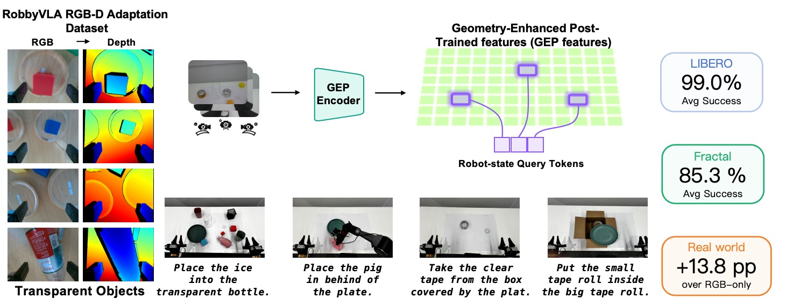
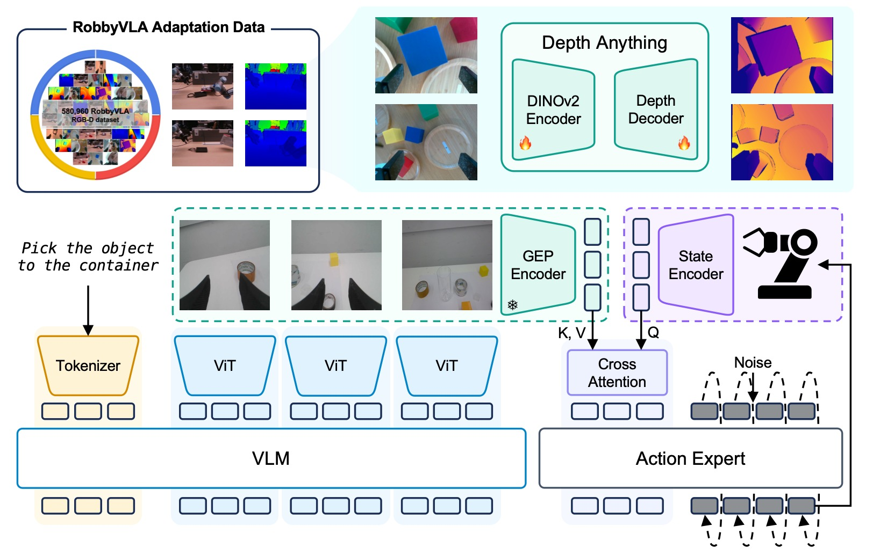
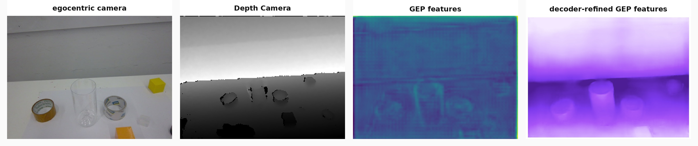
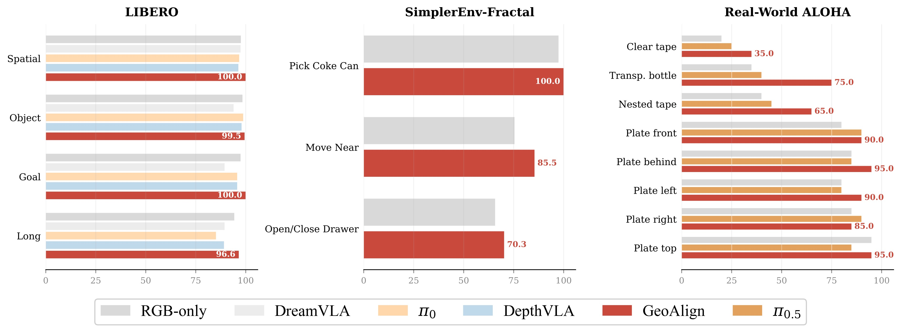
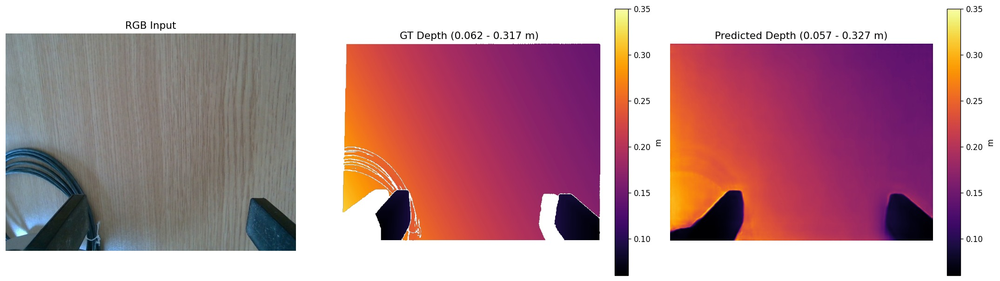
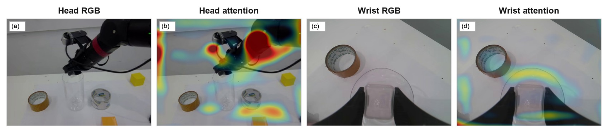
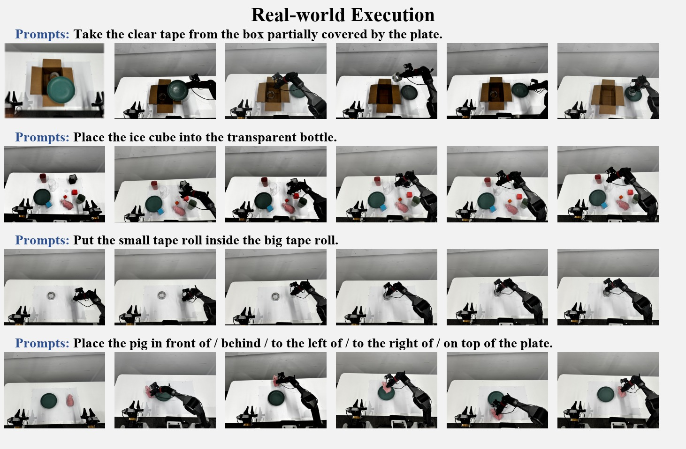

%% mathjax-macros
\R: \mathbb{R}
\E: \mathbb{E}
\Dpol: \mathcal{D}_{\mathrm{pol}}
\Ddep: \mathcal{D}_{\mathrm{dep}}
\MHA: \mathrm{MHA}
\LN: \mathrm{LN}
\FFN: \mathrm{FFN}
\softmax: \mathrm{softmax}
%% end-mathjax-macros

# GeoAlign: Beyond Semantics with State-Guided Spatial Alignment in VLA Models

> **论文信息**
> - 作者：Yizhi Chen, Zhanxiang Cao, Xinyi Peng, Yixiao Zheng, Xiaxi Si, Yiheng Li, Liyun Yan, Keqi Zhu, Xueyun Chen, Shengcheng Fu, Tianyue Zhan, Yufei Jia, Jinming Yao, Yan Xie, Wang Kun, Cewu Lu, Yue Gao
> - 通讯作者：Cewu Lu, Yue Gao（上海交通大学 & 上海创新研究院）
> - 投稿方向：CoRL 2026
> - arXiv ID：2606.03240
> - 代码：未公开（投稿中）

---

## 一、核心问题

当前 VLA（Vision-Language-Action）模型主要优化**语义 grounding**，但可执行的精细操作还需要**几何感知的空间对齐（geometry-aware spatial alignment）和动态 affordance 选择**。一个策略可能正确识别了物体、理解了指令，但在以下场景中仍然失败：

- 需要**紧密间隙（tight clearance）** 的精确对准
- **接触敏感**的运动
- 对**透明物体**和**环形物体**的几何推理
- **稳定释放**的位置判断

这些失败反映了**局部几何问题（local geometry problem）**：动作解码器需要被空间特征引导，以判断下一个 action chunk 是否在物理上可执行。

> 核心矛盾：语义上"知道该做什么" ≠ 几何上"能做到"。

---

## 二、核心思路 / 方法

GeoAlign 提出了一种**状态引导的空间对齐（State-Guided Spatial Alignment）** 架构，核心理念是：

1. **用 RGB 推导几何**：通过 RGB-D 监督后训练 Depth Anything V2，得到 RGB-derived 的几何特征（GEP features），但**不使用深度图作为策略输入**
2. **用本体感受状态查询几何特征**：机器人的 proprioceptive state（关节角度、夹爪状态）生成 query，对图像空间的几何特征网格做 cross-attention，挑选当前操作阶段最相关的几何信息
3. **紧凑几何 token 注入动作解码器**：将 8 个几何 token 拼接到 VLM 语义 token 中，一起送入 DiT 动作头

*图1：GeoAlign 一页总览。展示了方法的三个核心组件——(a) RGB 图像通过几何分支生成 GEP 特征网格；(b) 本体感受状态通过 MLP 生成 query slot，对几何网格做 cross-attention 提取紧凑几何 token；(c) 几何 token 与语义 token 拼接后注入 flow-matching DiT 动作解码器。*

### 2.1 两阶段训练流程

*图2：GeoAlign 两阶段流水线。上半部分：离线几何后训练阶段，使用机器人域 RGB-D 数据后训练 Depth Anything V2-Small（24.8M 参数），训练完成后**丢弃深度预测头**，只保留编码器侧特征提取器。下半部分：策略训练和推理阶段，冻结的几何分支从 RGB 图像提取 GEP 特征网格，本体感受状态生成查询 slot 做 cross-attention，得到 8 个紧凑几何 token 与语义 token 拼接后引导 Isaac-GR00T N1.6-3B DiT 动作头。推理时不需要深度图、点云或任何显式 3D 输入。*

### 2.2 几何增强后训练特征（GEP Features）

- **基座模型**：Depth Anything V2-Small（24.8M 参数），使用 DINOv2 视觉骨干 + DA-V2 feature reassembly
- **后训练数据**：RobbyVLA 子集（来自 LingBot-Depth），580,960 对 RGB-D 帧，来自 Franka 和 UR7e 机械臂的真实操作数据
- **训练目标**：SiLog loss（Scale-Invariant Logarithmic loss），在有效像素上优化
- **图像处理**：输入 resize 到 518×518，patch size 14，产生 37×37 的基础 patch 网格；经过 reassemble factor 2 得到 74×74 特征图
- **线性投影**后得到每视图 5,476 个空间 token，维度 $d_g=256$
- **后训练完成后丢弃深度预测头**，仅保留编码器侧特征

$$\mathcal{L}_{\mathrm{dep}} = \sqrt{ \frac{1}{|\Omega|}\sum_{p\in\Omega} d_p^2 - \lambda \left(\frac{1}{|\Omega|}\sum_{p\in\Omega} d_p\right)^2 }$$

其中 $d_p = \log D_p - \log \hat{D}_p$，$\lambda=0.5$。

### 2.3 状态引导的空间对齐（State-Guided Spatial Alignment）

这是 GeoAlign 的核心创新。关键洞察：**同一 RGB 场景在不同操作阶段（接近、对齐、插入、释放）需要不同的局部几何信息**。

**Query 生成**：状态编码器将 proprioceptive state $s_t$ 映射为嵌入 $h_t$，然后通过 MLP 生成 $K=8$ 个 query slot：

$$Q_t = \mathrm{reshape}(W_q h_t, K, d_g) + P^q \in \mathbb{R}^{B\times K\times d_g}$$

**Cross-Attention 提取几何信息**：

$$\bar{G}_t = Q_t + \MHA(\LN(Q_t), \LN(\Phi_t^{\mathrm{geo}}), \LN(\Phi_t^{\mathrm{geo}}))$$
$$G_t = \bar{G}_t + \FFN(\LN(\bar{G}_t))$$
$$Z_t^{\mathrm{geo}} = W_z\LN(G_t) \in \mathbb{R}^{B\times K\times d_v}$$

### 2.4 动作生成

将 8 个几何 token 拼接到 VLM 语义 token 中：

$$C_t = [Z_t^{\mathrm{vlm}}; Z_t^{\mathrm{geo}}] \in \mathbb{R}^{B\times (L_v+8)\times d_v}$$

使用 GR00T 的 flow-matching DiT 动作头，预测速度场 $\hat{v}_\theta$，训练目标为带 action mask 的 MSE：

$$\mathcal{L}_{\mathrm{policy}} = \E_{(I_t,\ell,s_t,A_t),\epsilon,\tau} \left[ \frac{ \sum_{i,j} m_{t,i,j}(\hat{v}_{\theta,i,j} - v^\star_{i,j})^2 }{ \sum_{i,j} m_{t,i,j} } \right]$$

推理时从高斯噪声初始化，用 4 步 Euler 积分生成 action chunk。

---

## 三、关键设计选择

### 3.1 为什么不用深度图作为策略输入？

*图3：RGB 观测与测量深度的对比。上方三列展示了三个不同场景下的 RGB 图像、测量深度图和 GEP 特征可视化。(a) 透明容器场景：RGB 图像中瓶口和冰块清晰可见，但测量深度图在透明区域出现大量缺失和碎片化，而 GEP 特征保留了完整的图像空间几何线索。(b) 环形胶带卷场景：测量深度在空洞区域失效。(c) 遮挡场景：部分遮挡的透明胶带在深度图中几乎不可见。关键结论：RGB 观测保留了透明和环形物体的完整结构信息，而测量深度图在这些几何关键区域存在系统性缺失。GeoAlign 通过 RGB-D 监督学习 RGB 推导的几何特征，绕过了深度传感器的物理局限。*

### 3.2 为什么用状态查询而不是可学习查询？

- **可学习查询（learned queries）**：对所有场景使用相同的固定查询，无法适应不同操作阶段
- **全局池化（global pooling）**：丢失空间结构，将局部几何信息压平成全局上下文
- **状态引导查询**：根据当前机器人状态（手臂位置、夹爪状态）动态选择相关几何区域

---

## 四、实验与结果

### 4.1 总体性能

*图4：GeoAlign 在三个评测场景下的成功率对比（红色柱）。从左到右依次为：LIBERO 四个子套件（Spatial/Object/Goal/Long）、SimplerEnv-Fractal 三个任务族（Pick Coke Can/Move Near/Open-Close Drawer）以及真实世界 ALOHA 八个任务。*

**LIBERO（8,000 次总 rollout）**：
- GeoAlign 平均 **99.0%** vs RGB-only 基线 **97.0%**
- Spatial：**100.0%**（+2.35%）
- Long：**96.6%**（+2.25%）
- 在需要空间推理的子套件上收益最大

**SimplerEnv-Fractal（三个任务族）**：
- GeoAlign 平均 **85.3%** vs RGB-only **79.6%**（+5.7 个百分点）
- Pick Coke Can: **100.0%** / Move Near: **85.5%** / Open/Close Drawer: **70.3%**

**真实世界 ALOHA（8 个任务，每任务 20 次试验）**：

| 任务 | RGB-only | π₀.₅ | **GeoAlign** |
|------|----------|------|-------------|
| Clear tape（透明胶带） | 20.0 | 25.0 | **35.0** |
| Transparent bottle（透明瓶） | 35.0 | 40.0 | **75.0** |
| Tape-roll insertion（胶带卷嵌套） | 40.0 | 45.0 | **65.0** |
| Plate front | 80.0 | **90.0** | **90.0** |
| Plate behind | 85.0 | 85.0 | **95.0** |
| Plate left | 80.0 | 80.0 | **90.0** |
| Plate right | 85.0 | **90.0** | 85.0 |
| Plate top | **95.0** | 85.0 | **95.0** |
| **平均** | **65.0** | **67.5** | **78.8** |

> 几何关键任务（透明瓶 +40pp、胶带卷 +25pp）的收益远超语义为主的任务（plate 各方向）。

### 4.2 消融实验

在 LIBERO 上的受控消融（所有变体共享相同骨干、数据、训练协议和种子）：

| 变体 | Spatial | Object | Goal | Long | Avg. |
|------|---------|--------|------|------|------|
| RGB-only backbone | 97.65 | 98.45 | 97.5 | 94.35 | 97.0 |
| w/o post-training | 91.35 | 99.4 | 98.0 | 95.0 | 95.9 |
| w/o spatial querying | 90.05 | 96.5 | 92.5 | 87.5 | 91.6 |
| w/o state queries | 95.8 | 99.3 | 97.9 | 91.7 | 96.2 |
| w/ unfrozen encoder | 97.10 | **99.60** | 97.42 | 89.60 | 95.93 |
| **GeoAlign** | **100.0** | 99.5 | **100.0** | **96.6** | **99.0** |

**关键发现**：

1. **机器人域几何后训练至关重要**：w/o post-training 从 99.0% 掉到 95.9%，Spatial 上更是从 100.0% 掉到 91.35%。通用单目深度先验不足以替代机器人工作空间的专门后训练。

2. **空间查询不可或缺**：w/o spatial querying（将 cross-attention 替换为全局平均池化）掉到 91.6%，说明将空间特征压缩为全局上下文会丢弃大量动作相关的局部几何信息。

3. **状态引导查询优于可学习查询**：w/o state queries（96.2% vs 99.0%）证明同一场景在不同操作阶段需要不同的几何关注区域。

4. **冻结几何编码器更好**：w/ unfrozen encoder（95.93%）表明在策略训练中保持后训练几何表示的完整性更优。

### 4.3 与现有空间 VLA 方法的定性对比

| 方法 | 3D 坐标/点云 | 深度图/3D ROI | 几何分支 | 量化深度 token | 保留网格 | 引导方式 |
|------|:---:|:---:|:---:|:---:|:---:|------|
| SpatialVLA | ✓ | ✗ | ✗ | ✗ | ✗ | Ego3D PE |
| GeoVLA | ✓ | ✗ | ✗ | ✗ | ✗ | 3D action expert |
| 3D-CAVLA | ✓ | ✓ | ✗ | ✗ | △ | ROI pooling |
| DepthVLA | ✗ | ✗ | ✓ | ✗ | ✗ | shared attention |
| QDepth-VLA | ✗ | ✗ | ✗ | ✓ | ✗ | aux. depth pred. |
| **GeoAlign** | ✗ | ✗ | **✓** | ✗ | **✓** | **state query** |

GeoAlign 的独特之处：(1) 保留完整的图像空间几何特征网格（而非压缩或丢弃空间结构），(2) 用状态引导查询（而非固定或可学习查询），(3) 不使用深度图、点云或 3D 坐标作为推理输入。

---

## 五、诊断与分析

### 5.1 GEP 特征质量

*图5：GEP 特征诊断可视化。三行分别展示三个场景：(a) 桌面杂物场景——RGB 输入、测量深度（GT）、预测深度；(b) 机械臂操作场景——可见预测深度较好地恢复了物体轮廓和空间关系；(c) 近距离操作场景——几何细节保真度高。后训练后的深度预测在机器人工作空间场景中质量良好（held-out 验证集 AbsRel=0.1871, RMSE=0.1375, δ₁=0.8758），但需注意预测深度**不用于策略推理**——仅用于监督编码器学习几何表示。*

### 5.2 注意力可视化

*图6：真实世界 rollout 中的几何查询注意力图。展示了一个透明容器插入任务的执行过程：(a) 头部相机视图——注意力覆盖了整个操作场景；(b) 右手腕相机视图——注意力高度集中在容器开口和末端执行器区域周围；(c) 对应的 RGB 观测。注意模型**未使用注意力标注进行训练**，注意力图仅作为定性诊断工具，而非机理解释。关键的定性观察：注意力随操作阶段动态变化，接近阶段关注容器边界，插入阶段关注瓶口和冰块接触区域。*

### 5.3 推理速度

| 方法 | H200 (ms/Hz) | RTX 4090 (ms/Hz) |
|------|-------------|-------------------|
| RGB-only backbone | 71.9±3.1 / 13.9 | 109.2±1.8 / 9.2 |
| w/o state queries | 91.4±4.5 / 10.9 | 145.2±7.0 / 6.9 |
| **GeoAlign** | **92.1±3.8 / 10.9** | **138.9±1.2 / 7.2** |

几何对齐模块增加了约 20ms 的额外推理时间（在 H200 上），仍然保持在 **10.9 Hz** 的实用频率。额外的计算来自 8 个查询对每视图 5,476 个空间 token 的 cross-attention。

---

## 六、真实世界执行案例

*图7：ALOHA 平台上的代表性 rollout 序列。四行分别展示四个任务：(a) Clear tape retrieval——从被盘子部分遮挡的盒子中取出透明胶带，展示了对遮挡和透明物体的处理能力；(b) Transparent bottle insertion——将冰块放入透明瓶子，关键挑战是精确定位瓶口；(c) Ring-in-ring placement——将小胶带卷放入大胶带卷内部，需要环形物体对齐；(d) Plate-relative placement——将物体放置在盘子的指定相对位置。这些任务都是"语义上容易描述，几何上难以执行"的典型案例。*

---

## 七、关键洞察与技术亮点

1. **"先想深度，再忘掉深度"**：通过 RGB-D 监督训练几何编码器，但推理时不使用深度预测——深度监督只是塑造 RGB 特征空间的"脚手架"，策略条件化的是编码器侧特征，而非深度预测。

2. **状态即查询**：将 proprioceptive state 作为 cross-attention 的 query 生成源，这是一个优雅的设计选择——状态本身包含了"机器人在哪里、夹爪是否张开"等信息，天然适合用于选择相关的局部几何。

3. **紧凑几何 token（仅 8 个）**：在保留完整空间网格的同时，最终仅注入 8 个几何 token 到解码器，计算开销可控。

4. **绕过深度传感器局限**：透明物体、环形结构、薄壁物体在深度传感器中经常出现缺失或噪声，RGB 推导的几何特征天然绕过了这些物理局限。

5. **收益集中在几何关键任务**：在透明瓶（+40pp）、胶带卷嵌套（+25pp）等场景收益巨大，而在语义为主的 plate 任务上收益较小——这直接验证了方法的针对性价值。

---

## 八、局限性

1. **不建模碰撞、可达性和接触约束**：几何 token 来自 RGB 特征，无法显式推理物理约束
2. **依赖视觉覆盖和相机配置**：几何特征质量受限于训练数据的相机视角和场景分布
3. **无持久场景记忆**：每个 action chunk 仅基于当前观测和状态，不做长期场景级记忆
4. **Open/Close Drawer 提升有限**（65.8%→70.3%）：说明局部几何对齐改善了空间执行，但不能完全解决受限操纵（如抽屉）的挑战
5. **真实世界实验规模有限**：每任务仅 20 次试验，统计置信区间较宽（Wilson 95% CI: [71.8, 84.4]）

---

## 九、关键概念速查

| 术语 | 含义 |
|------|------|
| **VLA** | Vision-Language-Action，视觉-语言-动作策略模型 |
| **GEP** | Geometry-Enhanced Post-Trained，经过几何增强后训练的特征 |
| **Flow Matching** | 流匹配，通过预测速度场从噪声生成动作序列 |
| **DiT** | Diffusion Transformer，扩散 Transformer 动作解码器 |
| **Proprioceptive State** | 本体感受状态，包括关节角度和夹爪状态（14 维） |
| **SiLog Loss** | Scale-Invariant Logarithmic loss，尺度不变对数损失 |
| **Cross-Attention** | 交叉注意力，状态查询对几何网格做空间选择 |
| **DA-V2** | Depth Anything V2，单目深度估计基础模型 |
| **GR00T N1.6-3B** | NVIDIA Isaac-GR00T 的 3B 参数 VLA 基础模型 |
| **Action Chunk** | 动作块，一次性预测未来 H=16 步的动作序列 |
