<!-- arxiv: N/A -->
<!-- venue: Physical Intelligence -->
<!-- tags: VLA, 扩散模型, 泛化, 强化学习, 知识蒸馏, 多模态理解, 表征学习, 世界模型 -->

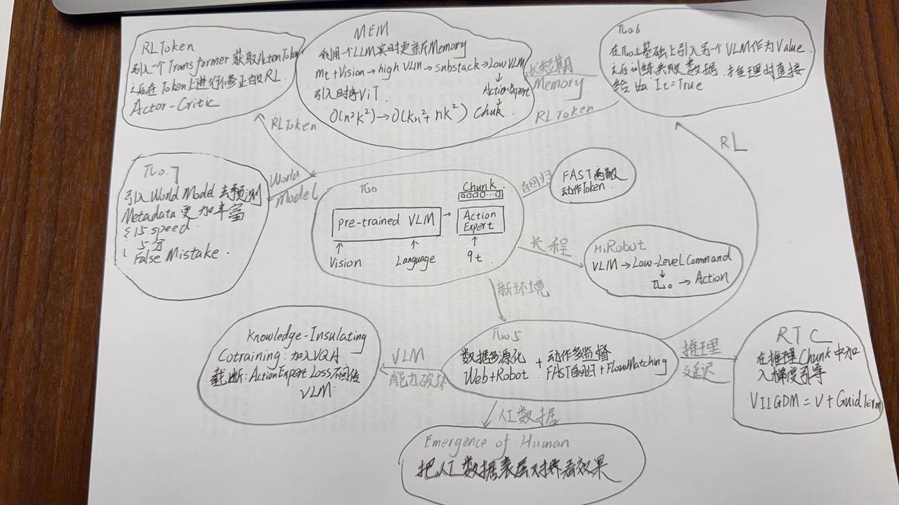

```markdown
PI 基础 VLA
VLM Backbone + Action Expert + Action Chunk
        │
        ├── KI / FAST
        │     └── 稳定训练 VLM，不被 flow loss 污染
        │
        ├── MEM
        │     └── 长期语言记忆 + 短期视频记忆
        │
        ├── RTC
        │     └── 推理延迟下 chunk 平滑衔接
        │
        ├── Human-to-Robot
        │     └── 弱接口对齐 + 跨 embodiment transfer 涌现
        │
        ├── RECAP / π*0.6
        │     └── value → advantage → positive-conditioned VLA
        │
        ├── RL Token
        │     └── 冻结 VLA + RL token + online Actor-Critic
        │
        └── π0.7
              └── richer prompt:
                  metadata + subtask + subgoal images + world model
                  吃下更杂数据，获得 steerability / composition
```

# π0: A Vision-Language-Action Flow Model for General Robot Control

> https://www.pi.website/blog/pi0

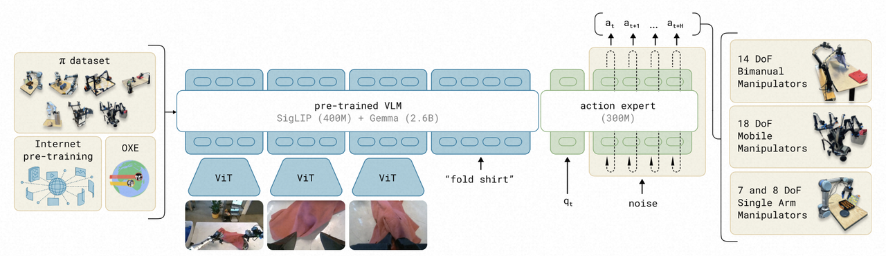

使用Flowmatching进行训练

$$L_τ(θ)=E_p(A_t∣o_t),q(A_{tτ}∣A_t)[∥v_θ(A_{tτ},o_t)−u(A_{tτ}∣A_t)∥2]$$

* 将动作表示为action chunk$$A_t=[a_t,a_{t+1},...,a_{t+H-1}]\quad H=50$$

* 对动作进行加噪得到噪声动作：$$A_{t}^{\tau}=\tau A_t+(1-\tau)\epsilon\quad \epsilon\in \mathcal{N}(0,I)$$

* 网络学习的就是去噪场：$$u(A_t^{\tau}|A_t)=A_t-\epsilon$$

推理的时候：直接初始化一个随机动作$$A_t^0\sim \mathcal{N}(0,1)$$之后逐步的去去噪$$A_{t}^{t+δ}=A_{tτ}+δv_θ(A_{tτ},o_t)$$我们取

$$δ=0.1$$即进行十步去噪，每一次只有action token变化

训练的时候为了采样噪声更小的部分，我们令概率：$$p(τ)=Beta(\frac{s−τ}{s};1.5,1)$$也就是令$$x=\frac{s-\tau}{s}$$然后让$$x\sim Beta(1.5,1)$$之后能得出$$\tau=s(1-x)$$令s=0.999，$$Beta(x;\alpha,\beta)=\frac{1}{B(\alpha,\beta)}x^{\alpha-1}(1-x)^{\beta-1}$$将数值代入则得$$p(x)=1.5\sqrt{x}$$

**根据ForceVLA1和2里面说的大概是要50条-100条的数据**

# FAST: Efficient Action Tokenization for Vision-Language-Action Models

> https://pi.website/research/fast

**如何将连续的机器人动作信号 token 化？**&#x73B0;在的处理方法是按照维度、时间步给他离散化为256个bin担这样就会导致我们的token数量爆炸并且相邻的token高度相关，模型最后只需要简单的复制上一个token就可以获得较低的loss值。

**Universal Tokenizer (FAST+)**

论文还训练了一个通用动作 tokenizer——在 100 万条真实机器人动作轨迹（覆盖单臂、双臂、移动机器人，关节空间和末端执行器空间，各种控制频率）上训练 BPE 词汇表。使用时只需 3 行代码：

```plain&#x20;text
from transformers import AutoProcessor
tokenizer = AutoProcessor.from_pretrained("physical-intelligence/fast", trust_remote_code=True)
tokens = tokenizer(action_chunk)
```

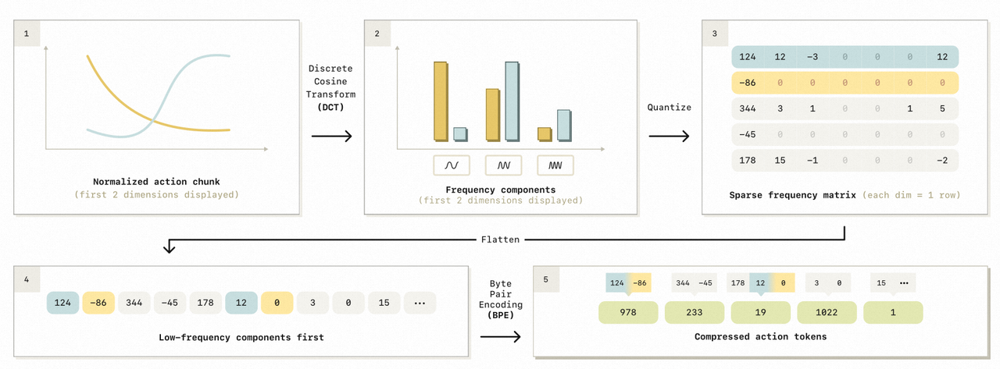

对于一个动作chunk：$$a_{1:H}\in \mathbb{R}^{H\times D}$$我们先进行归一化将训练数据中每个动作维度的 1% 分位数映射到 -1，99% 分位数映射到 1。$$a^d\to\tilde{a}^d\in [-1,1]$$

之后对于每个动作维度$$i$$其存在一条长度为$$H$$的时间序列：$$\tilde{a}_{1:H}^i=[\tilde{a}_1^i,\tilde{a}_2^i,...,\tilde{a}_H^i]$$之后对其进行离散余弦变换：$$C_j^i=DCT(\tilde{a}_{1:H}^i)$$DCT 会把“时间域曲线”表示成一组余弦基函数的加权和：

$$\tilde{a}^i(t)≈C_0^iϕ_0(t)+C_1^iϕ_1(t)+C_2^iϕ_2(t)+⋯$$

之后对处理后的$$C_j^i$$进行离散化也就是给他变成整数$$\bar{C}_j^i=round(\gamma C_j^i)$$这样的话就变成了稀疏频域矩阵了之后

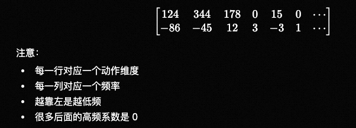

然后我们给他展开拉成一维的序列，我们要低频优先也就是先去把低频的放在最前面之后得到一个整数序列：\[124,−86,344,−45,178,12,0,3,0,15,…]但这个里面还是有大量的0的，所以我们用一次**Byte Pair Encoding, BPE**进一步压缩，BPE之后可能就是：$$[token_{978},token_{233},token_{19},token_{1022},token_1]$$

之后我们进行自回归预测这些FAST tokens也就是$$p(T_1∣o)p(T_2∣o,T_1)⋯p(T_n∣o,T_{1:n−1})$$

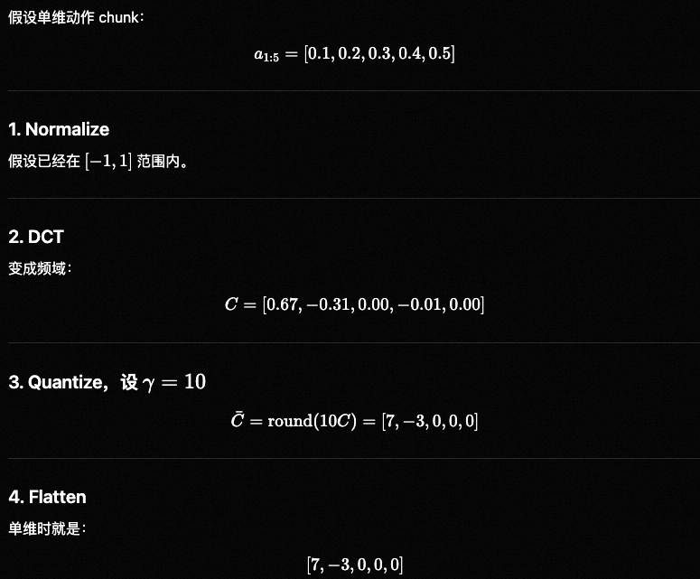

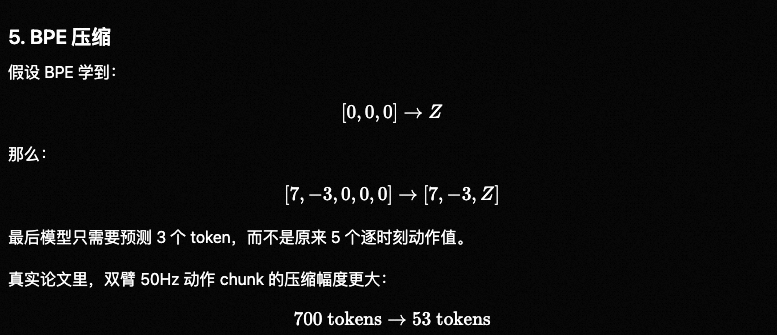

# Hi Robot: Open-Ended Instruction Following with Hierarchical Vision-Language-Action Models

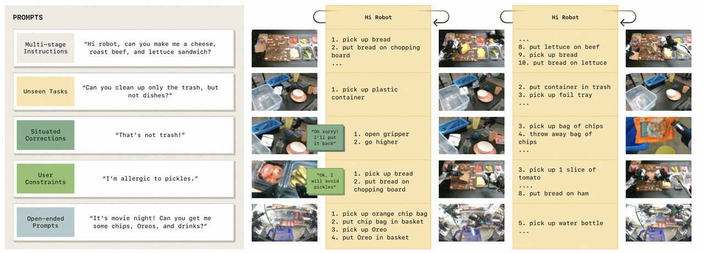

当前VLA大部分只能执行简单的指令，但是缺少相关的认知类的模型也就是难以执行那种长程的复杂的任务

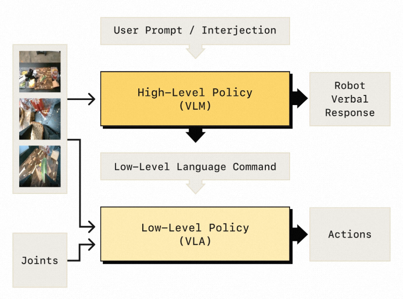

HiRobot将VLA进行层次化&#x20;

* 高层VLM$$p^{h_i}(\hat{l}_t|[I_t^1,...,I_t^n,l_t ])$$

  * 其本身是PaliGemma-3B初始化的VLM

  * 将其fine-tune成图像+用户复杂指令->低层skill命令/语言回复

* 底层策略VLA$$p^{l_o}(A_t∣I_t^1,…,I_t^n,\hat{ℓ}^t,q_t)$$最后输出Action chunk

  * 同样是PaliGemma-3B的初始化在他的后面加入$$\pi_0$$的flow matching的action expert


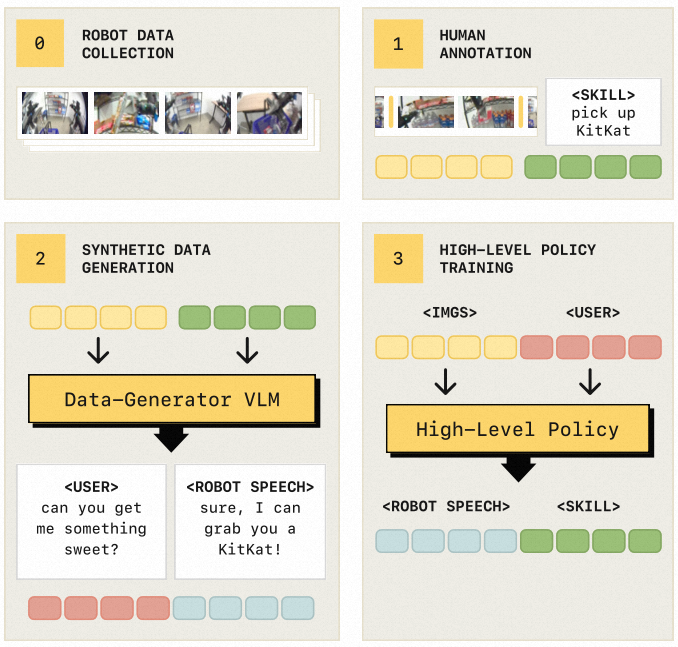

# π₀.₅: a Vision-Language-Action Model with Open-World Generalization

当前的模型只能在训练数据覆盖的环境中工作。当机器人被部署到全新的家庭环境中（新的厨房布局、新的物体、新的背景），性能会急剧下降。

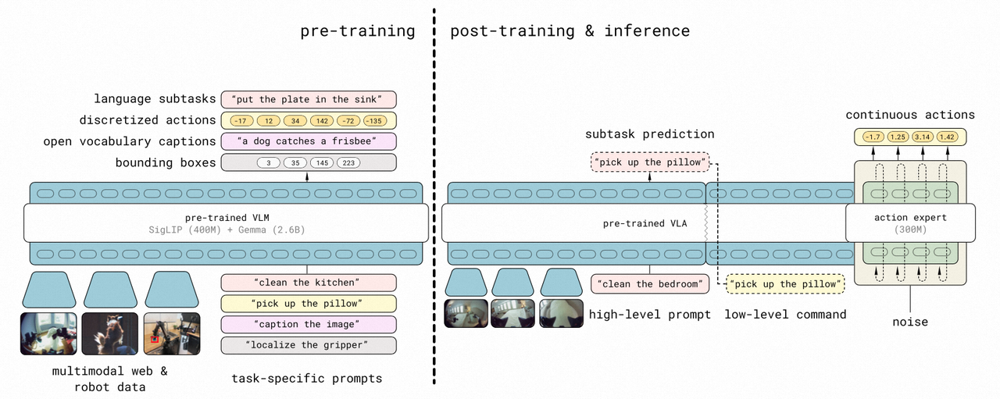

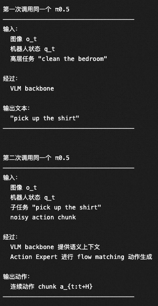

整体的模型还是基于$$\pi_0$$的架构进行设计的，包括两部分：

1. 统一多模态Transformer

模型可以灵活地表示两种输出

1. 文本输出：高层子任务预测、网络数据的VQA答案

2. 动作输出：通过flow matching生成连续动作chunk

其分布分解为：

$$\pi_{\theta}(a_{t:t+H},\hat{l}|o_t,l )=\pi_{\theta}(a_{t:t+H}|o_t,\hat{l})\pi_{\theta}(\hat{l}|o_t,l)$$

* 离散+连续的混合动作表示

$$\pi_{0.5 }$$被设计为训练两个东西：

* 通过FAST tokenizer（DCT+BPE）自回归生成离散action tokens（预训练阶段，训练效率高）

* 通过flow matching 非自回归生成连续动作（后训练阶段，推理快）

联合损失函数：

$$\mathbb{E}_{D,\tau,w}[H(x_{1:M},f_{\theta}^l(o_t,l))+\alpha||w-a_{t:t+H}-f_{\theta}^{a}(a_{t:t+H}^{\tau,w},o_t,l)||^2]$$

* 第一项：文本token（含FAST action tokens）的交叉熵损失

* 第二项：flow matching动作专家的MSE损失（$$\alpha=10.0$$）

# Knowledge Insulating Vision-Language-Action Models: Train Fast, Run Fast, Generalize Better

> https://pi.website/research/knowledge\_insulation

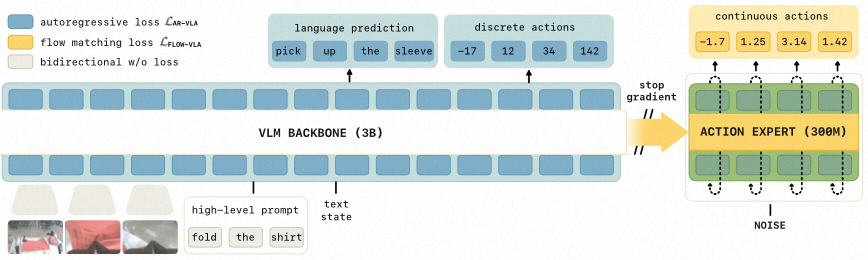

当我们在与训练的VLM上新增一个初始化的Action expert做flow matching时，模块梯度会反向传播到VLM骨干网络，破坏预训练学习到的语义知识，但其实语言指令会被忽略、训练收敛变慢、从网络数据迁移的知识能力丧失。

**如何让VLM骨干学会机器人表示，同时不被action expert的随机梯度破坏？**

文章的做法是梯度隔离+双路径训练：

1. 联合训练优化目标如下：

$$L_{CO-VLA}(\theta)=\mathbb{E}_{D,\tau,w}[-\sum_{j}M_j^l\log p_{\theta}(\hat{l}_{j+1}|x_{1:j})+\alpha M^{act}||w-a-f_{\theta}^{a}(a^{\tau,w})||^2]$$

* 第一项：文本 + FAST 离散 action token 的交叉熵（表示学习 + VLM 保持）

* 第二项：flow matching 的 MSE（连续动作生成）

* $$\alpha=1$$因为 stop-gradient 后两项梯度独立，不需要权衡

2. Co-training with VLM Data

在训练中混入通用 VLM 数据（图像描述、VQA、边界框预测）和机器人规划数据（子任务语言标注）。这些数据帮模型保持语义理解能力，抵抗灾难性遗忘。

* Stop-Gradient（梯度截断）

这是最关键的技术细节。在 self-attention 层中，action expert 可以"读取" VLM 骨干的特征，但梯度不能反向流过：

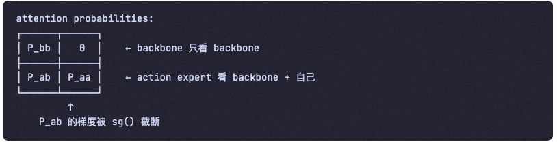

Action expert在查询backbone的key和value时：

$$P_{ab}=softmax(Q_a(X_a)\cdot sg(K_b(X_b)^T))$$

$$E_a=P_{ab}\cdot sg(V_b(X_b))+P_{aa}V_a(X_a)$$

`s(g)` = stop-gradient。Action expert 可以"看见" backbone 的输出，但不能修改它。

训练数据的样本：$$(I_{1:V}^{(t)},q^{(t)},ℓ,a_{t:t+H−1})$$

VLM的训练：我们将连续动作$$a_{1:H}$$先经过FAST tokenizer压缩成一连串离散的action tokens$$y^{a}_{1:m
}$$之后backbone接收图像$$I_{1:V}$$当前机器人状态$$q$$指令$$l$$之后自回归的预测这些FAST动作token。

Action expert的训练：先构建一个带噪声的动作：$$a_{1:H }^{\tau,w}=\tau a_{1:H}+(1-\tau)w$$这里面$$w$$是高斯噪声，$$\tau$$是flow matching的时间步。之后我们接收相关信息去预测去噪的方向。**action expert 可以读取 backbone； 但 action expert 的梯度不允许回写 backbone。**

# Real-Time Execution of Action Chunking Flow Policies

**如何在推理延迟 > 控制周期的约束下，生成平滑、连续的动作流？**

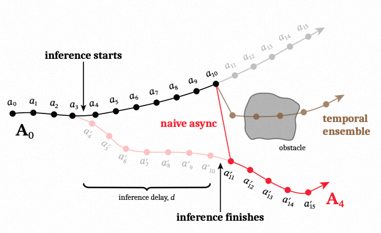

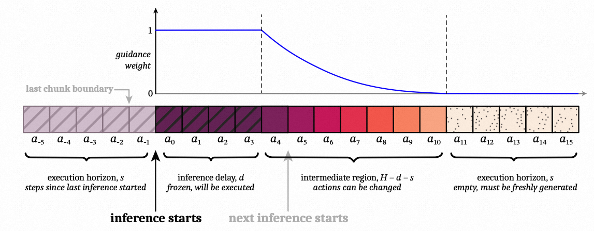

我们假设一个action chunk的长度为$$H$$：

$$A_t=[a_t,a_{t+1},...,a_{t+H-1}]$$

我们这里面会先让模型去执行实际的$$s$$步然后会有我们生成新的chunk需要$$d$$个控制步。

之后我们原始的Flow matching是从一段随机噪声出发：$$A_t^0\sim \mathcal{N}(0,I)$$之后迭代$$n$$步，每一步按照模型预测的velocity field更新：

$$A_t^{\tau+\frac{1}{n}}=A_t^{\tau}+\frac{1}{n}v_{\pi}(A_t^{\tau},o_t,\tau)$$

RTC定义了$$Y$$为从旧chunk中拿出的参考动作，$$W$$为mask告诉模型哪些位置要匹配$$Y$$对于每一步flowmatching，作者先估计：

$$A_t^{c1}=A_t^{\tau}+(1-\tau)v(A^{\tau}_t,o_t,\tau)$$

之后我们去比较$$Y-A_t^{c1}$$然后我们会给原始的velocity field加一个guidance correction：

$$V_{IIGDM}=v+guidance \quad term$$

这里还会加一个强度上限$$\beta$$最后出来的guidance就是：

$$\min (\beta,\frac{1-\tau}{\tau r^2_{\tau}})$$

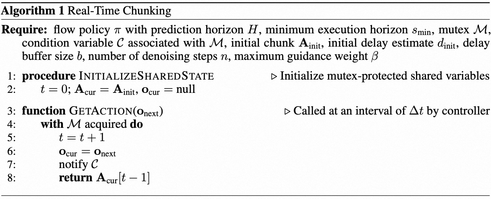

# $$\pi_{0.6}^{*}$$: a VLA That Learns From Experience

**如何让 VLA 模型通过部署后的自主经验（autonomous experience）进行强化学习（RL），从而自我改进，超越演示数据的性能上限？**

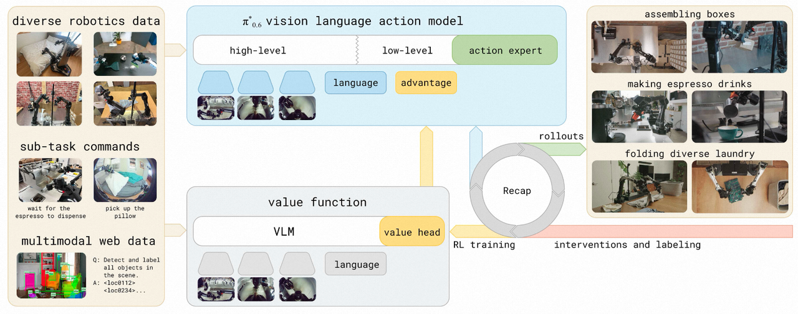

主要是去训练一个语言条件化的distributional value function，他的输入是当前的观察$$o_t$$、语言任务$$l$$之后我们输出一个离散的value分布也就是预测当前时刻开始到任务结束的return

$$r_t=\left\{\begin{matrix} 
  0,\quad 成功终止 \\  
  -C_{fail},\quad 失败终止 \\
-1,\quad 其他每一步  
\end{matrix}\right. $$

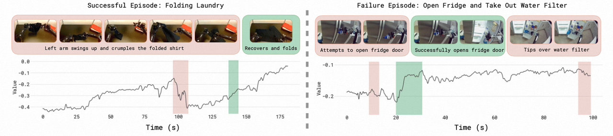

之后我们去看某个动作$$a_t$$执行之后，机器人是不是比“原来这个状态本身的平均前景”更接近成功了：

$$A^{\pi}(o_t,a_t)=\mathbb{E}\big [ \sum^{t+N-1}_{t'=t}r_{t'}+V^{\pi}(o_{t +N})\big]-V^{\pi}(o_t)$$

我们最后就是训练两个东西：一个Value Function 还有一个vla：

* Value Function：根据当前的观测$$o_t$$和语言$$l
  $$输出一个$$R_{t}(\tau)=\sum^{T}_{t'=t}r_{t'}$$之后我们根据当前的Value和N刻后的Value可以算出当前属于positive还是negative

* VLA：输入为prompt+metadata+观测+预测出来的positive还是negative+自己预测出来的substack然后输出是离散的动作token+连续的动作chunk+高层的substack文本

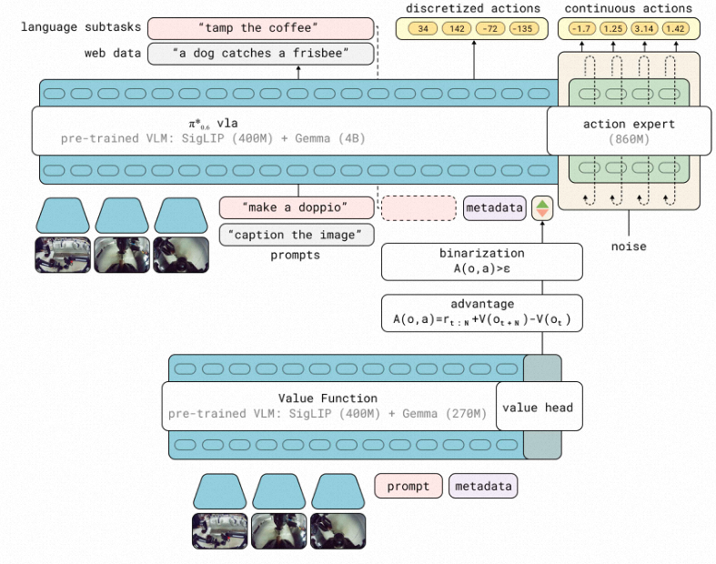

> 作为一个“高层文本规划 + 低层动作生成”的两阶段生成过程。推理时确实先产生 subtask，再基于 subtask 产生动作；但 subtask 不会像动作一样高频重复生成，而是低频更新。因此不是每个 action chunk 都必然做一次完整的两段式重推理。

VLA本质上是学习三个条件分布：

$$\log \pi_{\theta}(a_{t:t+H},a_{t:t+H}^l,\hat{l}|o_t,l)=\log \pi_{\theta}(\hat{l}|o_t,l)+\log \pi_{\theta}(a_{t:t+H}^l|o_t,l,\hat{l})+\log \pi_{\theta}(a_{t:t+H}|p_t,l,\hat{l})$$

在部署的时候模型执行的是第一个subtask的预测和第三个连续动作chunk的生成

# Emergence of Human to Robot Transfer in Vision-Language-Action Models

> 机器人能不能直接从“人类第一视角操作视频”里学到新能力，并把这些能力迁移到机器人身上？

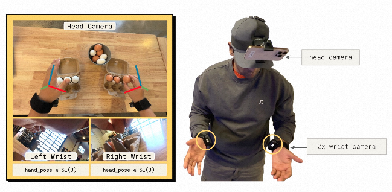

**文章中并没有对两个数据进行显式的对齐**

机器人动作包含：

* &#x20;左臂 6DoF end-effector trajectory；&#x20;

* &#x20;右臂 6DoF end-effector trajectory；&#x20;

* &#x20;两个 gripper actions；&#x20;

* &#x20;2 维 base actions。&#x20;

总共：

人类动作：

* 头戴相机的 6D 位姿轨迹；

* 左手的相对 6DoF trajectory；

* 右手的相对 6DoF trajectory；&#x20;

这里面没有人类的gripper，整体的action：

$$2\times 6+6=18$$

在这里模型输出的都是相对于当前observed pose的未来相对变换，也就是从当前的手/夹爪位置开始，接下来往哪个方向移动、旋转多少。但是不同DoF怎么放在一个flowmatching里面训练 文章里面没有提，**这个工作只是说了这个想法，具体的并没有过多的讲述。**

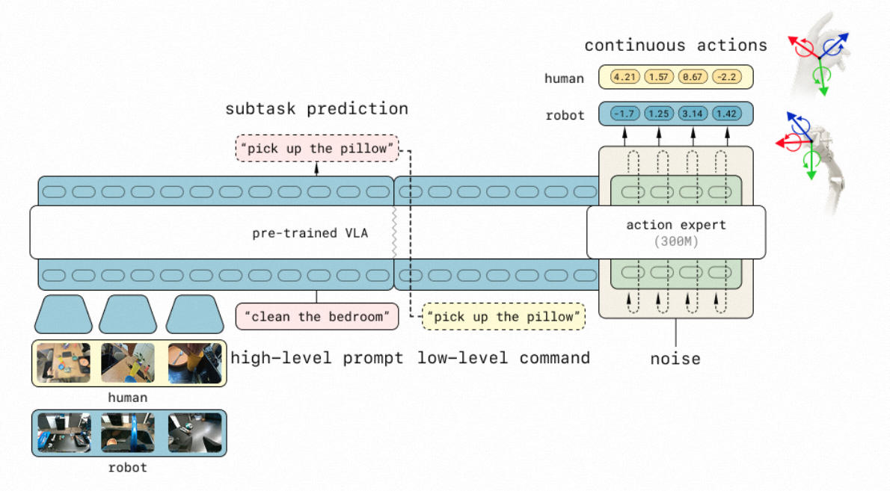

# MEM: Multi-Scale Embodied Memory for Vision Language Action Models

> 有效的记忆架构应该用多种模态来捕捉不同抽象层次的记忆——短周期用密集视觉记忆，长周期用压缩的语言记忆。

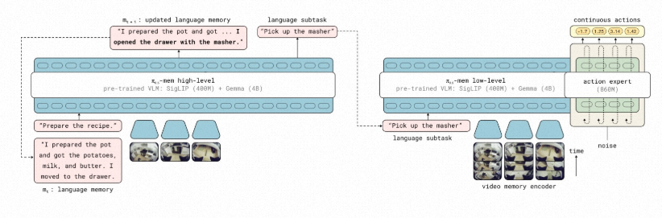

MEM将动作预测问题分为了两个层次：

$$\pi(a_{t:t+H},l_{t+1},m_{t+1}|o_{t-T:t},m_t,g)\sim \pi_{LL}(a_{t:t+H}|o_{t-K:t},l_{t+1},g)\cdot \pi_{HL}(l_{t+1},m_{t+1}|o_t,m_t,g)$$

本质上就是让一个high level的VLM去说出对应的subtask 之后让low-level的模型根据我们的新的substack+观测+goal去进行动作的预测 然后这个地方会有一个记忆的更新也就是memory这个利用大模型去进行压缩

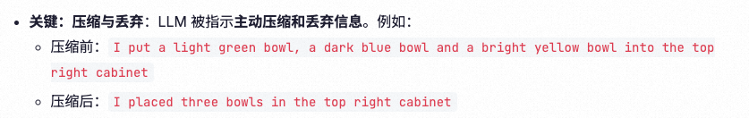

短期视觉记忆需要密集的观察序列输入，这个地方设计了一个对应的**高效视频编码器**

这个里面相当于是先看了前K帧之后把每个图片都切成n个patch，然后当前帧的内部会互相看，也就是进行spatial attention，之后同一时空的不同时间的patch会互相看，然后是每四个ViT layer引入一个temporal attention。这样做的好处是把时间复杂度进行了降低

$$O(n^2K^2)\to O(Kn^2+nK^2)$$

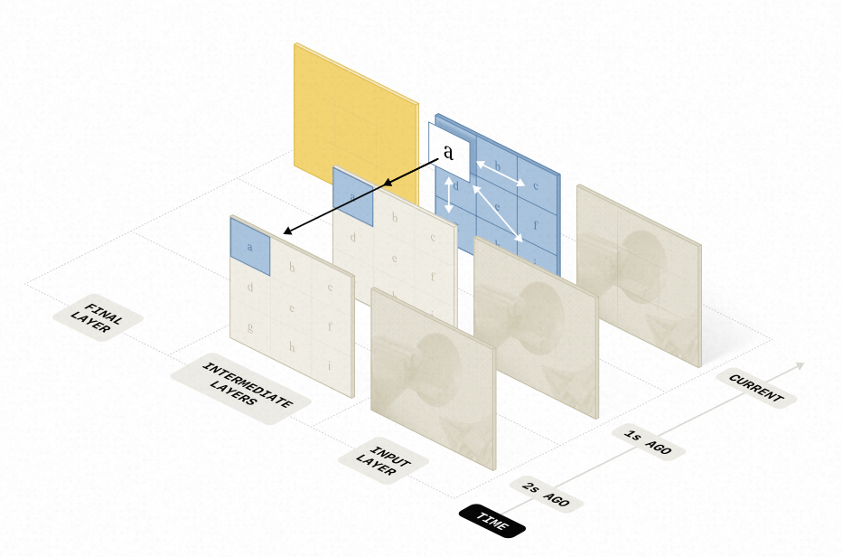

# RL Token: Bootstrapping Online RL with Vision-Language-Action Models

> 不需要在"大模型慢 RL "和"小模型快 RL"之间二选一——可以让冻结的 VLA 提供感知表征和行为先验，让轻量级 RL 网络在在线实践中做快速局部精调。

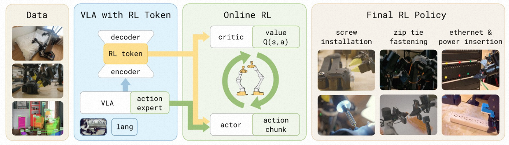

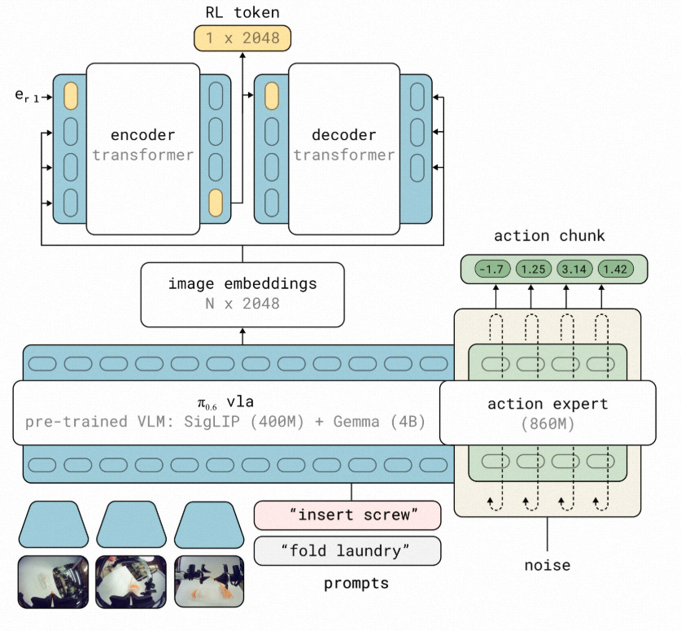

我们设VLA最后一层token embeddings是：$$z_{1:M}=\{ z_1,z_2,...,z_m \}$$之后我们额外加一个特殊token$$e_{rl}$$然后把他拼接在一起送进小的encoder transformer：$$z_{rl}=g_{\phi}([z_{1:M},e_{rl}])_{M+1}$$最后特殊token位置的输出$$z_{rl
}$$也就是我们的RL token这个是在encoder中跟其他的做self-attention得到的。

然后我们拿这个RL token$$z_{rl}$$去重建原始的VLA embeddings：

$$L_{ro}=\mathbb{E}_D[\sum^{M}_{i=1}||h_{\phi}(d_{\phi}([z_{rl},\bar{z}_{1:i-1}]))_i-\bar{z}_i||^2_2]$$

之后我们训练出来了一个能够高效保留相关信息的token$$z_{rl}$$

之后我们取少量任务展示去对VLA做微调以及训练RL token的encoder-decoder的重建目标，然后把VLA和RL token都冻结，之后进入我们的online RL阶段，我们RL的状态输入不是原始图像，而是$$x=(z_{rl},s_t^p)$$之后我们让RL去修正VLA的动作，原本的VLA会输出action chunk$$\tilde{a}_{1:C}$$，RLT的actor输入是：$$(x,\tilde{a}_{1:C})$$然后输出自己的动作分布：

$$\pi_{\theta}(a_{1:C}|x,\tilde{a}_{1:C})=\mathcal{N}(\mu_{\theta}(x,\tilde{a}_{1:C },\sigma^2 I))$$

> actor 直接看到 VLA 给出的候选动作，再决定如何改。&#x20;

训练的时候还是Actor-Critic训练：

Actor的损失：$$L_{\pi}(\theta)=\mathbb{E}[-Q_{\psi}(x,a_{1:C})+\beta||a_{1:C }-\tilde{a}_{1:C}||^2_2]$$

1. −Q：让动作 value 高；

2. &#x20;距离正则：不要偏离 VLA reference 太远。

Critic的损失$$Q_{\psi}(x,a_{1:C})$$：$$\hat{Q}=\sum^{C}_{t'=1}\gamma^{t'-1}r_t +\gamma^C\mathbb{E}_{a'\sim \pi_{\theta}}[Q_{\psi^{'}}(x',a')]$$

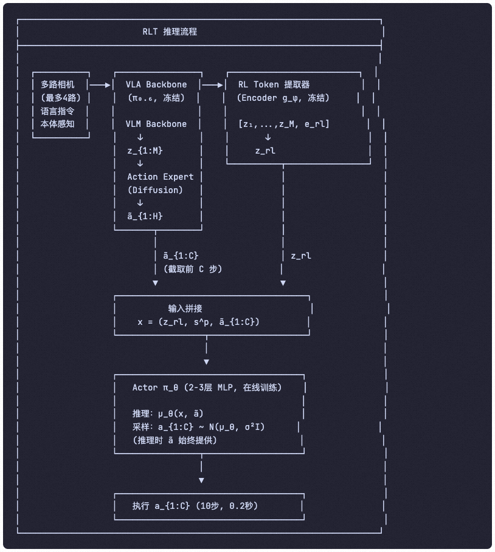

# π₀.₇: A Steerable Generalist Robotic Foundation Model with Emergent Capabilities

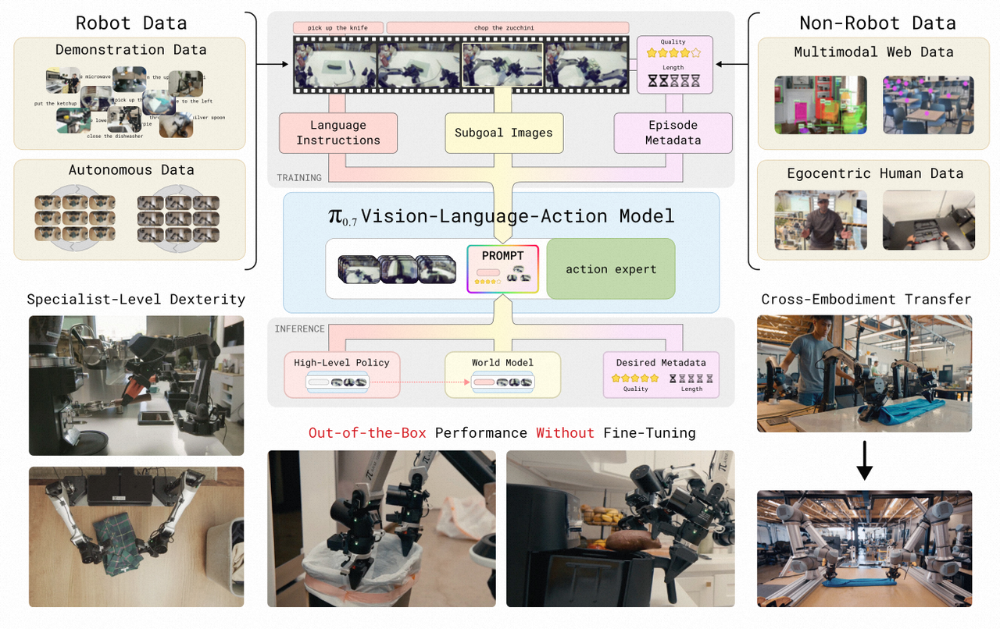

> 通过多样化的 prompt 条件化（diverse prompting），可以让 VLA 利用更大、更多样、质量更混合的数据集，从而涌现出组合泛化、跨形态迁移和复杂指令遵循等能力。

这个工作主要的核心其实就是在训练的时候提供更加丰富的上下文context去告诉模型做什么、怎么做。

这些上下文包括：

1. 子任务指令（Subtask Instructions）：细粒度的语言描述（如"打开冰箱门"），而非仅给出粗粒度的任务描述（如"清理厨房"）

2. 子目标图像（Subgoal Images）：多视角的未来目标图像，由轻量级世界模型生成，展示"做完这一步后世界应该是什么样子"

3. Episode 元数据（Episode Metadata）：

   * Overall Speed：episode 的步数

   * Overall Quality：1-5 的质量评分

   * Mistake：是否出错的标签

4. 控制模式（Control Mode）：关节空间（joint）或末端执行器（ee）

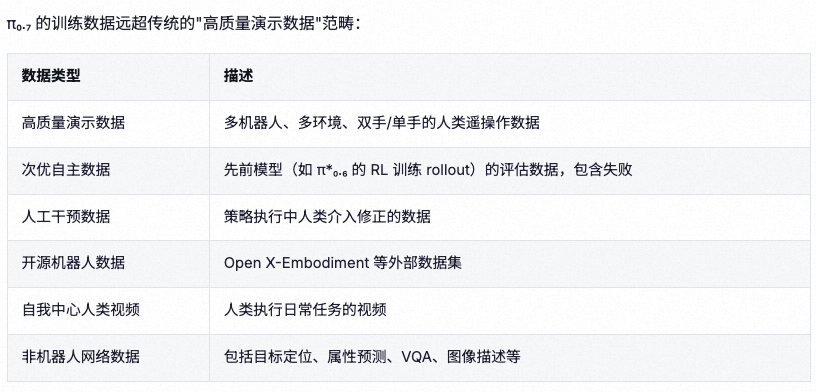

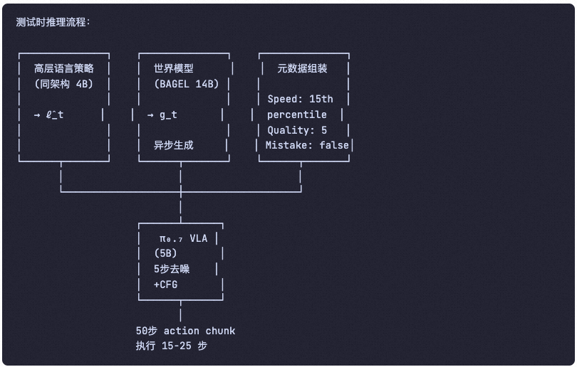

在训练的时候VLA的主要目标：$$\max_{\theta}\mathbb{E}_{\mathcal{D}}[\log \pi_{\theta}(a_{t:t+H}|o_{t-T:t},C_t)]$$其中上下文$$C_t=\{l_t \hat{l}_t,g_t,m,c\}$$包含任务描述、子任务指令、子目标图像、元数据和控制模型

Action Expert使用Flow Matching目标

世界模型的训练$$\max_{\psi}\mathbb{E}_{\mathcal{D}_g}[\mathcal{L}_{CFM}(g_t^*,g_\psi(o_t,\hat{l}_t,m))]$$

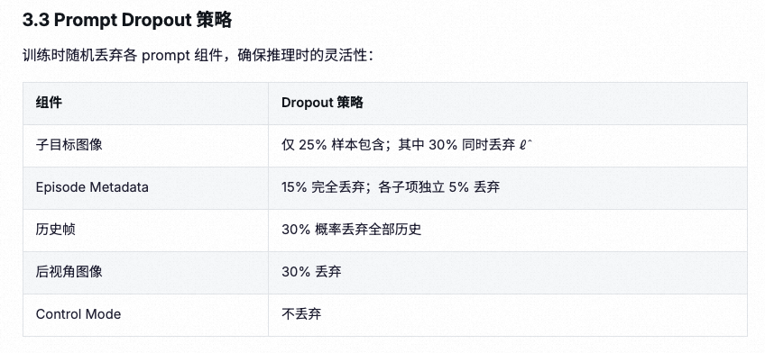

$$∇_alogπ_θ(a∣o_t,C_t)+β(∇_alogπ_θ(a∣o_t,C_t)−∇_alogπ_θ(a∣o_t,C_t^{uncond}))$$

这个就属于中高强度的引导，然后最后达到作者要的灵巧操作

$$\beta \in \{1.3,1.7,2.2 \}$$

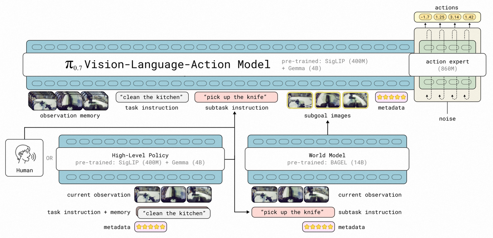
