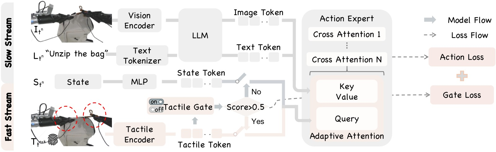
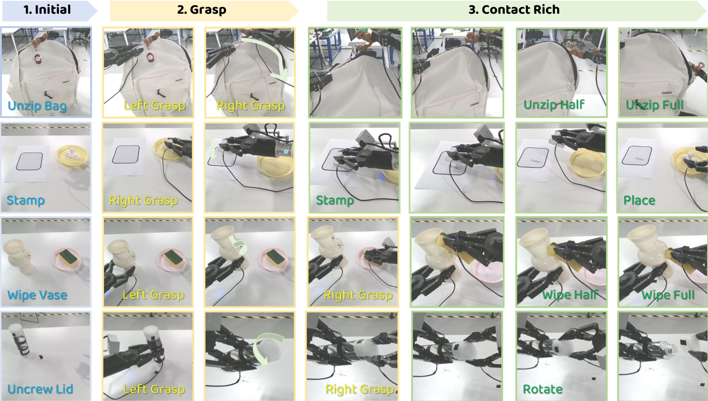
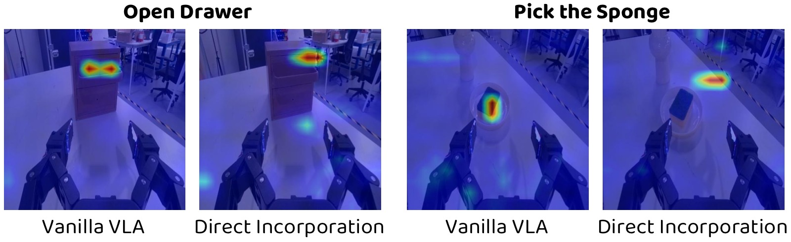

<!-- arxiv: 2605.07308 -->
<!-- venue: CVPR 2026 -->
<!-- tags: VLA, 触觉, 机器人操作, 多模态理解 -->

%% mathjax-macros
%% end-mathjax-macros

# AT-VLA: Adaptive Tactile Injection for Enhanced Feedback Reaction in Vision-Language-Action Models

> **论文信息**
> - 作者：Xiaoqi Li*, Muhe Cai*, Jiadong Xu, Juan Zhu, Hongwei Fan, Yan Shen, Guangrui Ren, Hao Dong
> - 通讯作者：Hao Dong（Peking University & PrimeBot）
> - 投稿方向：CVPR 2026（Paper ID: 34758）
> - arXiv ID：arXiv-2605.07308v1
> - 代码：无公开代码，项目页面 https://sites.google.com/view/at-vla

---

## 一、核心问题

VLA（Vision-Language-Action）模型在通用机器人操控任务中表现强劲，但在**接触密集型（contact-rich）任务**中存在关键不足：这类任务需要精确理解物理交互（如按压力度、摩擦力、法向力等触觉信号），而现有 VLA 模型训练时普遍缺少触觉数据。

引入触觉信号面临两大挑战：

1. **预训练知识干扰**：VLA 的预训练数据（大规模互联网图文+操控数据）几乎不包含触觉信息。直接在下游任务中引入触觉模态，会破坏模型已有的视觉感知和物体定位能力（实验中直接引入触觉反而导致成功率从 22% 下降到 13%）。
2. **推理速度慢**：VLA 模型的推理延迟（通常 >100ms）远高于触觉反馈的频率需求（需要毫秒级响应），导致模型无法根据触觉反馈进行实时动作调整。

---

## 二、核心思路 / 方法

AT-VLA 的核心理念：利用**视觉和触觉的互补性**——视觉负责上下文感知和目标定位，触觉提供精确的接触反馈。模型应在**非接触阶段保持原始 VLA 行为**，仅在**接触时引入触觉信号**，从而最大化保留预训练能力。

### 2.1 总体架构



*图1：AT-VLA 框架总览。该图展示了 AT-VLA 的核心组件和推理流程：左侧为视觉-语言模型的慢速推理流（Slow Stream），用于低频率的全局语义理解和视觉感知；右侧为触觉编码器的快速响应流（Fast Stream），用于高频率的触觉反馈处理。两路输入在 Action Expert 模块交汇——该模块基于 DiT（Diffusion Transformer）架构，通过交叉注意力机制融合异构模态特征。关键创新在于：(1) Tactile Gate（触觉门控）：一个轻量级 MLP 网络，根据当前触觉信号判断是否接触，输出二值门控信号；(2) Adaptive Cross Attention（自适应交叉注意力）：根据门控状态动态切换交叉注意力的 Query 来源——门控关闭时使用 proprioceptive state token 作为查询（与原 VLA 一致），门控开启时切换为触觉 token。当 Tactile Gate 关闭时（图中上半部分），快慢流频率一致（同步模式），模型行为与原始 VLA 完全相同；当 Gate 开启时（图中下半部分），Fast Stream 以 3:1 的频率比运行，实现高频触觉响应（单次推理仅需 0.04s）。*

### 2.2 Adaptive Tactile Injection（自适应触觉注入）

该模块解决**"何时（when）"和"何地（where）"注入触觉**的问题。

#### Tactile Gate（触觉门控）

- 通过触觉编码器提取触觉 token $\mathbf{z}_T$（轻量级 MLP，确证推理速度）
- 使用轻量级 Tactile Gating Network（MLP + Sigmoid）判断当前是否为接触状态
- 训练时人工标注每一帧的接触/非接触标签（0/1），使用二元交叉熵损失 $\mathcal{L}_g$ 监督
- 推理时得分 > 0.5 即激活触觉门，准确率超过 0.97（见补充材料）

#### Adaptive Cross Attention（自适应交叉注意力）

- 在 Action Expert（基于 DiT）的交叉注意力层中：
  - **门控关闭**：使用 proprioceptive state token $\mathbf{z}_S$ 作为 Query，视觉/文本 token 作为 Key/Value（与原 VLA 完全一致）
  - **门控开启**：切换为触觉 token $\mathbf{z}_T$ 作为 Query，视觉/文本 token 作为 Key/Value
- 这样，非接触阶段模型与原始 VLA 完全相同，接触时才引入触觉调节

### 2.3 Tactile Reaction Dual-Stream（触觉反应双流机制）

该模块解决**"如何（how）"快速响应触觉反馈**的问题。

#### 异步频率设计

- **Slow Stream（慢流）**：视觉+语言通过大模型（InternVL-2B）处理，低频率运行，提供全局语义理解和视觉感知。在时间 $t_n$ 的输出作为潜在条件，指导后续 $H$ 步动作生成。
- **Fast Stream（快流）**：触觉反馈通过轻量级触觉编码器处理，高频率运行。在每个时间步 $t_{n+k}$，Action Expert 基于最新触觉反馈生成动作，同时以慢流定期更新的视觉-语言特征作为前提条件。
- 训练时快慢频率比随机设置在 $h:1$（$1 < h < H$）。推理时设为 **3:1**，即慢流推理一次后快流连续推理三次。
- 单次快速推理仅需 **0.04s**（触觉特征提取 0.01s + Action Expert 0.03s）。

#### 触觉理解增强

- Tactile Gate 的二分类训练本身就迫使模型学习触觉信号的语义（接触 vs. 非接触）
- 这种设计鼓励模型建立更全面的物理动力学表征，桥接瞬时接触感知与预测性交互推理

### 2.4 训练目标

所有目标联合优化：

$$\mathcal{L} = \mathcal{L}_{a} + \lambda_1 \cdot \mathcal{L}_{g}$$

其中 $\mathcal{L}_a$ 是原始动作预测损失，$\mathcal{L}_g$ 是触觉门控的二分类交叉熵损失，$\lambda_1 = 0.01$。

---

## 三、训练目标（详细）

- **动作损失 $\mathcal{L}_a$**：标准的动作预测监督，使用 Diffusion Transformer 的 denoising loss，预测 14-DoF 双臂末端执行器位姿
- **门控损失 $\mathcal{L}_g$**：Binary Cross-Entropy，监督触觉门控网络判断当前帧是否为接触状态
- **权重 $\lambda_1 = 0.01$**：平衡两个损失的 scale
- **基础模型**：基于 GO-1（AgiBot Genie1 平台）的预训练权重，InternVL-2B 作为 VLM backbone
- **触觉传感器**：Xense Robotics 的夹爪触觉传感器，提取 6D 合力（3D 法向力 + 3D 切向力）

---

## 四、实验与结果

### 4.1 实验设置

- **硬件**：AgiBot Genie1 双臂机器人（7-DoF × 2），配备正面摄像头 + 双腕摄像头 + 触觉夹爪
- **任务**：4 个接触密集型任务（拆封袋、盖章、擦花瓶、拧盖子）+ 2 个非接触密集型任务（Pick-and-Place、开抽屉）
- **每任务**：30-50 个演示，15 次测试

### 4.2 接触密集型任务主结果



*图2：四个典型接触密集型任务的执行过程。从上到下依次为拆封袋（Unzip Bag）、盖章（Stamp）、擦花瓶（Wipe Vase）、拧盖子（Unscrew Lid）。每个任务从左到右展示了从初始状态到完成的完整执行序列。拆封袋任务要求沿弯曲路径打开拉链封口袋，模型需持续调整轨迹以适应拉链的弧线；盖章任务要求将印章按压到指定区域并识别完成状态，避免过度下压碰撞桌面；擦花瓶任务要求顺应花瓶的曲面几何擦拭表面，合规性不足会导致碰撞瓶颈；拧盖子任务需要精确的力和运动协调以保证平滑旋转不打滑。这些任务共同的特点是视觉仅能提供有限信息，而触觉信号对成功完成至关重要。*

**主结果表（Table 1）：**

| 方法 | 拆封袋 Overall | 盖章 Overall | 擦花瓶 Overall | 拧盖子 Overall | 平均 |
|------|:----:|:----:|:----:|:----:|:----:|
| GO-1 (Vanilla VLA) | 0.20 | 0.13 | 0.07 | 0.27 | 0.17 |
| π₀.₅ (SOTA VLA) | 0.00 | 0.20 | 0.33 | 0.46 | 0.25 |
| **AT-VLA (Ours)** | **0.33** | **0.46** | **0.67** | **0.53** | **0.50** |
| VTLA (触觉 VLA) | 0.00* | 0.13* | 0.60* | 0.80* | — |
| RDP (触觉+扩散策略) | 0.06* | 0.40* | 0.33* | 0.87* | — |

> *注：VTLA 和 RDP 无预训练权重，仅在接触密集阶段数据子集上训练（手动设置理想初始位姿后开始测试），`—` 表示两者未在完整任务序列上评估，因此不计算平均分。

**关键发现**：
1. 相比无触觉输入的 VLA 基线（GO-1 和 π₀.₅），AT-VLA 在预接触（抓取）阶段表现相当，说明有效保留了预训练知识
2. 在接触密集阶段大幅超越 VLA 基线，验证了触觉信号对复杂操控任务的必要性
3. 在完整任务上大幅优于 VTLA 和 RDP（后两者在抓取阶段即失败，无法展示触觉响应能力）
4. AT-VLA 在拧盖子任务上略低于 RDP（0.53 vs 0.87），因为基线测试时从理想抓取位姿开始，而 AT-VLA 的抓取可能不够稳固导致旋转时滑动

### 4.3 模态无关性（Modality-Agnostic）评估

**Table 2 结果：**

| 方法 | Pick & Place | Open Drawer | Stamp | 平均 |
|------|:----:|:----:|:----:|:----:|
| GO-1 | 1.0 | 0.93 | 0.13 | 0.68 |
| π₀.₅ | 1.0 | 0.93 | 0.20 | 0.70 |
| **AT-VLA w/o Tactile** | 1.0 | **0.93** | **0.20** | **0.70** |
| *AT-VLA w/ Tactile (上界)* | *1.0* | *0.93* | *0.46* | *0.79* |

**关键发现**：AT-VLA 即使推理时不提供触觉信号，性能也与 SOTA VLA 基线（π₀.₅）持平甚至更好——这说明训练阶段的触觉信号已经帮助模型隐式学习了接触动力学知识，推理时可以从视觉特征中推测近似触觉线索。

### 4.4 消融实验（Ablation Study）

**Table 3（消融实验总览）：**

| 实验 | Tactile Gate | Adaptive Cross Attn | Direct Incorp | Dual-Stream | 触觉格式 | 平均 SR |
|------|:---:|:---:|:---:|:---:|:---:|:---:|
| Ex0 (Vanilla VLA) | — | — | — | — | — | 0.22 |
| Ex1 (直接触觉) | — | — | ✓ | — | Force 6D | 0.13 |
| Ex2 (+Gate) | ✓ | ✓ | — | — | Force 6D | 0.39 |
| Ex3 (AT-VLA 完整) | ✓ | ✓ | — | ✓ | Force 6D | **0.50** |
| Ex4 (直接 2D Marker) | — | — | ✓ | — | Marker 2D | 0.05 |
| Ex5 (Ours+Marker) | ✓ | ✓ | — | ✓ | Marker 2D | 0.32 |
| Ex6 (直接 V-T Image) | — | — | ✓ | — | V-T Image | 0.02 |
| Ex7 (Ours+V-T) | ✓ | ✓ | — | ✓ | V-T Image | 0.40 |

**逐行解读**：

- **Ex0 → Ex1：直接引入触觉反而降 9%**。失败主要发生在抓取阶段，说明直接添加触觉 token 破坏了预训练的视觉定位能力。
- **Ex1 → Ex2：加入 Tactile Gate 后大幅提升 17%**。证明门控机制有效保护了预训练表征，只在接触时才启用触觉。
- **Ex2 → Ex3：加入 Dual-Stream 再提升 11%**。在拆封袋等需要快速反应的任务中收益最大，延迟响应会导致拉链卡住。
- **Ex4-Ex7：不同触觉格式对比**——6D Force（最佳）> 2D Marker > Visual-Tactile Image。高维的触觉图像 token 数量更多，对预训练表征空间的扰动更大。

### 4.5 注意力可视化（Motivation）



*图3：直觉实验（Motivation）。该图通过可视化 Action Expert 模块中的交叉注意力分布，对比了两种微调策略对模型注意力的影响。(a) 纯视觉 VLA 微调（无触觉）：模型能准确关注目标物体区域，视觉定位能力保持良好。(b) 直接引入触觉信号：触觉 token 的加入显著改变了注意力分布，使模型从目标物体转向周围的无关区域，导致抓取定位精度下降。这个实验直观地解释了为什么简单拼接触觉模态会导致预训练能力退化——新增的、与预训练模态差异巨大的 token 序列会干扰 DiT 中交叉注意力的 Query-Key 匹配，从而改变模型已经学好的视觉关注模式。这张图是整篇论文核心设计动机的实证基础。*

### 4.6 触觉门控精度（补充材料）

在 Wipe Vase、Stamp、Open Drawer 三个任务的测试集上，触觉门控预测准确率分别为 0.95、0.98、0.98，平均 **0.97**，证明了 Tactile Gate 的可靠性和泛化能力。

---

## 五、关键洞察与技术亮点

1. **"先保持再注入"策略**：与传统方法尽力让模型理解触觉语义不同，AT-VLA 选择先保护预训练知识，仅在没有代价的接触时刻才引入新模态。这是模态增量学习中的一种"保守主义"设计哲学。
2. **Query 切换而非 Token 拼接**：大多数多模态方法通过拼接 token 序列来引入新模态，但 AT-VLA 的创新在于通过交叉注意力的 Query 切换来引入触觉——不改变序列长度，不改变特征维度，最大程度减少对预训练结构的影响。
3. **频率解耦**：视觉-语言理解的频率需求（~5-10Hz）与触觉反馈的频率需求（~25Hz+）本质不同。AT-VLA 首次在 VLA 框架中实现了不同模态的异步处理频率，使模型能在 0.04s 内完成闭环触觉响应。
4. **训练阶段的隐式模态迁移**：AT-VLA 训练时学到的触觉知识可以在推理时（即使不提供触觉信号）从视觉特征中"涌现"，展示了多模态联合训练对单模态推理的增益。
5. **触觉格式的维度效应**：实验发现触觉信息维度越高（如触觉图像），对预训练知识的干扰越大。6D 力向量（3D 法向 + 3D 切向）是最佳的触觉表示格式，在信息量和模型兼容性之间取得了最优平衡。

---

## 六、模型实例化与技术细节

### 6.1 模型组成

```
┌─────────────────────────────────────────────────────────┐
│                      AT-VLA 架构                         │
├─────────────────────────────────────────────────────────┤
│                                                          │
│  Slow Stream (低频 ~1×)                                   │
│  ┌──────────────┐   ┌─────────────┐   ┌──────────────┐  │
│  │ Head Camera  │   │  InternVL   │   │  Image Token │  │
│  │ Wrist Cam×2  │──▶│   -2B VLM   │──▶│  Text Token  │  │
│  │ Language Inst│   │             │   │              │  │
│  └──────────────┘   └─────────────┘   └──────┬───────┘  │
│                                               │          │
│  Fast Stream (高频 ~3×)                    K, V│          │
│  ┌──────────────┐   ┌─────────────┐   ┌──────▼───────┐  │
│  │ Tactile      │   │  Tactile    │   │    Cross      │  │
│  │ Sensor (6D)  │──▶│  Encoder    │──▶│  Attention    │  │
│  │              │   │  (MLP)      │Q  │   (DiT)      │  │
│  └──────────────┘   └─────────────┘   └──────┬───────┘  │
│                                               │          │
│  ┌──────────────┐                    ┌───────▼───────┐  │
│  │ Propriocept  │───────────────────▶│    Action     │  │
│  │ State Token  │    Q (gate=0)      │   Chunk (14D) │  │
│  └──────────────┘                    └───────────────┘  │
│                                                          │
│  Tactile Gate Network (MLP + Sigmoid):                   │
│    触觉token → 接触/非接触 (0/1)                          │
│    控制: Query来源切换 + 快慢频率切换                      │
└─────────────────────────────────────────────────────────┘
```

### 6.2 推理流程

```
时间轴  t_n        t_n+1      t_n+2      t_n+3      ...
─────────┬──────────┬──────────┬──────────┬──────────
Slow     │ VLM推理  │          │          │ VLM推理
Stream   │ 输出     │          │          │ 输出
         │ (K,V)    │          │          │ (K,V)
─────────┼──────────┼──────────┼──────────┼──────────
Fast     │ 触觉推理 │ 触觉推理  │ 触觉推理  │ 触觉推理
Stream   │ 动作生成 │ 动作生成  │ 动作生成  │ 动作生成
         │ 0.04s    │ 0.04s    │ 0.04s    │ 0.04s
─────────┴──────────┴──────────┴──────────┴──────────
         
频率比 Fast:Slow = 3:1
共享: Slow Stream 的 VLM 输出在 Action Horizon H 内复用
```

### 6.3 关键设计决策

| 设计点 | 选择 | 理由 |
|--------|------|------|
| 触觉格式 | 6D Force (3D normal + 3D tangential) | 在信息量和维度扰动之间最优平衡 |
| 触觉编码器 | 轻量级 MLP | 确保快速推理（0.01s） |
| 快慢频率比 | 3:1（推理时） | 平衡响应速度与视觉感知刷新率 |
| Query 切换 vs Token 拼接 | Query 切换 | 不改变序列长度/维度，最大程度保留预训练结构 |
| 基础 VLA | GO-1 (InternVL-2B + DiT) | 与硬件平台一致，利用已有预训练权重 |

---

## 七、局限性与未来工作

1. **抓取质量仍影响触觉阶段**：尽管 AT-VLA 显著缓解了预训练能力退化问题，但抓取阶段的失败（如抓取位置不准、力度不足）仍可能导致后续接触密集阶段失败（如拧盖子时滑动）。
2. **任务多样性有限**：当前仅在 4 个接触密集型任务上验证，且每个任务仅收集 30-50 个演示。更多样化的接触密集型任务（如装配、插拔）有待探索。
3. **单机器人平台**：实验均在 AgiBot Genie1 平台上完成，跨机器人平台的泛化性未经验证。
4. **触觉传感器依赖性**：虽然 AT-VLA 展示了模态无关的鲁棒性，但训练仍需触觉传感器标注（每帧接触/非接触标签），这增加了数据采集成本。
5. **慢流瓶颈**：VLM 的推理速度仍是系统吞吐量的上限。当需要更频繁的视觉-语言重新推理时（如快速变化的场景），慢流可能成为瓶颈。

---

## 八、关键概念速查

| 概念 | 含义 |
|------|------|
| **VLA** | Vision-Language-Action 模型，将视觉、语言和动作统一建模 |
| **Tactile Gate** | 触觉门控网络（MLP），二分类判断当前是否为接触状态 |
| **Adaptive Cross Attention** | 自适应交叉注意力，根据门控状态切换 Query（state token ↔ tactile token） |
| **Dual-Stream** | 慢流（视觉语言低频推理）+ 快流（触觉高频响应）的异步架构 |
| **6D Force** | 最优触觉格式：3D 法向力 + 3D 切向力 |
| **GO-1** | 基础 VLA 模型（AgiBot），使用 InternVL-2B + DiT |
| **Action Chunk** | 一次推理预测未来 H 步动作 |
| **DiT** | Diffusion Transformer，论文中 Action Expert 的基础架构 |
| **0.04s 闭环响应** | 触觉特征 0.01s + Action Expert 0.03s，在 RTX 4090 上 |
| **Modality-Agnostic** | 训练时使用触觉，推理时不使用触觉仍能保持高性能的鲁棒特性 |
