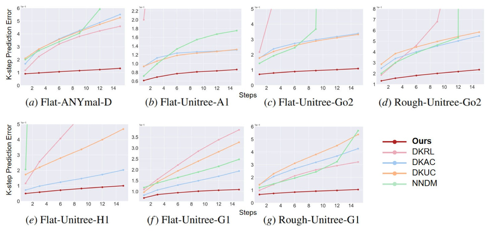
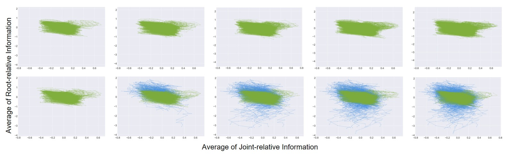
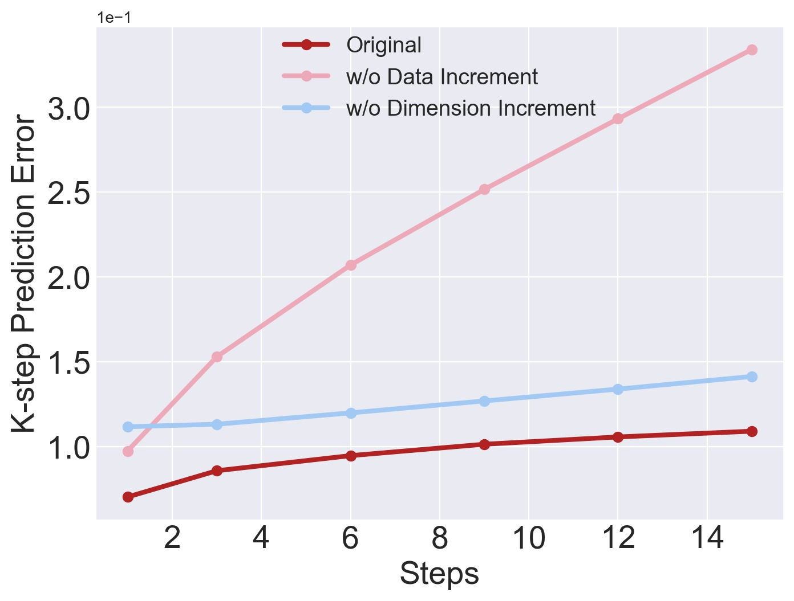

<!-- arxiv: 2411.14321 -->
<!-- venue: L4DC 2025 -->
<!-- tags: 强化学习, 机器人操作, 表征学习 -->

%% mathjax-macros
%% end-mathjax-macros

# Continual Learning and Lifting of Koopman Dynamics for Linear Control of Legged Robots

> **论文信息**
> - 作者：Feihan Li, Abulikemu Abuduweili, Yifan Sun, Rui Chen, Weiye Zhao, Changliu Liu
> - 通讯作者：Changliu Liu（Carnegie Mellon University）
> - 投稿方向：L4DC 2025（Learning for Dynamics & Control）
> - arXiv ID：arXiv-2411.14321v3
> - 代码：https://github.com/intelligent-control-lab/Incremental-Koopman

---

## 一、核心问题

足式机器人（四足、人形）的控制面临**高维非线性动力学**的挑战。虽然在非线性系统上直接应用 RL（model-free）或非线性 MPC（model-based）已取得进展，但这两条路线各有代价：model-free 方法通用性差，换任务就得重新训练；model-based 方法需要精准的非线性模型或昂贵的在线优化。

**Koopman 算子理论**提供了一条理想路径——将非线性动力学全局线性化到一个无限维潜空间，然后用成熟的线性控制器（MPC/LQR）。但现有方法存在两个根本困难：

1. **近似误差**：数据驱动的 Koopman 逼近在高维系统中误差很大，无法精准建模足式机器人的接触模式切换（如足端着地/离地的离散模式转换）
2. **域偏移**：训练数据只覆盖了状态空间的一部分（"好的"行走轨迹），遇到近失败/失败场景时模型完全失效，而足式机器人一旦失败往往不可恢复

换言之，现有 Koopman 方法要么只适用于低维系统（连续动力学、固定接触模式），要么把 Koopman 当特征编码器用、放弃了线性化带来的线性控制优势。

---

## 二、核心思路 / 方法

核心理念非常简洁：**逐步扩展数据集 + 逐步提升潜空间维度**，让 Koopman 动力学在迭代中逼近真实系统。

### 2.1 总体算法流程


*图1：Incremental Koopman 算法完整流水线。该图从上到下展示了算法的三个核心阶段。**(a) 顶部区域——初始数据收集与初始动力学训练：** 使用 RL 策略或遥操作等"初始数据收集器"，收集具有合理步态和一致接触模式的状态转移数据 $\mathcal{D}^{(0)}$。这些数据经过标准化（归一化到 $\mathcal{N}(0,1)$），用于训练初始 Koopman 动力学模型 $\mathcal{T}^{(0)} = (g^{(0)}, A^{(0)}, B^{(0)})$，其中 $g$ 是嵌入函数（Residual Network，将原始状态映射到潜空间），$A$ 和 $B$ 是 Koopman 矩阵。(b) 中部区域——Lifting Phase（提升阶段）：使用当前 Koopman 动力学 $\mathcal{T}^{(k)}$ 下的 MPC 控制器，追踪参考轨迹库 $\mathcal{R}$ 中的多样化参考。MPC 求解一个 QP 问题（式 (4)），输出关节目标位置。追踪过程中，成功的数据（主图左侧绿色区域）和失败的数据（主图右侧红色区域，如跌倒、失控）都会被记录下来，形成增量数据集 $\mathcal{D}_{incre}^{(k+1)}$。与此同时，潜空间维度从 $n^{(k)}$ 增加到 $n^{(k+1)} = n^{(k)} + \Delta n$（默认 $\Delta n = 100$）。关键设计在于：失败数据对建立鲁棒的潜子空间至关重要——它让模型学到"什么是危险状态"。右下角的分布图示意了只有迭代扩张才能有效覆盖更宽的状态空间，而 RL 策略的重复采样无法扩展分布。(c) 底部区域——Learning Phase（学习阶段）：将增量数据集合并到总数据集 $\mathcal{D}^{(k+1)} = \mathcal{D}^{(k)} \cup \mathcal{D}_{incre}^{(k+1)}$，用更大维度的嵌入函数 $g^{(k+1)}$ 和 Koopman 矩阵 $A^{(k+1)}, B^{(k+1)}$ 重新训练。使用折扣 k-step 预测损失（式 (3)），其中 $\gamma = 0.99$、$\alpha = 0.1$。训练完成后进入下一轮 Lifting→Learning 循环，直到 MPC 控制下的生存步数 $T_{sur}$（上限 200 步，200Hz 仿真频率）不再提升。左下角的曲线展示了 k-step 预测误差随迭代轮次递减的趋势，表明算法持续降低近似误差。*

### 2.2 Koopman 算子基础

对非线性系统 $x_{t+1} = f(x_t, u_t)$，Koopman 算子 $\mathcal{K}$ 满足：

$$\mathcal{K}\phi(x_t, u_t) = \phi(f(x_t, u_t)) = \phi(x_{t+1})$$

实际通过有限维逼近，将嵌入函数定义为 $\phi(x_t, u_t) = [g(x_t); u_t]$，Koopman 算子近似为矩阵 $K = \begin{bmatrix} A & B \\ C & D \end{bmatrix}$，得到线性模型：

$$g(x_{t+1}) = A g(x_t) + B u_t$$

**关键设计——保留物理可解释性**：潜状态 $z_t$ 定义为 $z_t = g(x_t) = [x_t, g'(x_t)]^\top$，即原始状态 $x_t$ 被显式拼接在潜状态中，$g'$ 是神经网络学习到的额外维度。这样原始状态可以通过线性投影轻松恢复：
$$x_{t+1} = P z_{t+1}, \quad P = [I_{n' \times n'}, \mathbf{0}_{n' \times (n-n')}]$$

这一设计的优势：不需要训练 Decoder；状态约束（如碰撞避免）可以直接从 $x$ 转换到 $z$，不破坏线性性质。

### 2.3 线性 MPC 控制器

在 Koopman 潜空间中，追踪控制简化为一个 QP 问题：

$$\min_{u_{t:t+H-1}} \|Pz_{t:t+H-1} - x^*_{t:t+H-1}\|^2_Q + \|u_{t:t+H-1}\|^2_R + \|Pz_{t+H} - x^*_{t+H}\|^2_F$$

$$\text{s.t.} \quad z_{t+k+1} = Az_{t+k} + Bu_{t+k}, \quad u_{t+k} \in [u_{min}, u_{max}]$$

低层用 PD 控制器执行：$\tau_t = k^p \circ (j_t^d - j_t) - k^d \circ \dot{j_t}$，频率 200Hz。

### 2.4 增量数据收集（数据纬度）

- **初始数据集 $\mathcal{D}^{(0)}$**：使用 PPO 策略收集 60,000 条具合理步态和接触模式的轨迹（轨迹长度 100-200 步），确保初始潜子空间有意义的起始点
- **增量数据集 $\mathcal{D}_{incre}$**：使用当前 MPC 控制器追踪参考库 $\mathcal{R}$ 中的多样化参考（含故意加入噪声的动态不可行参考），收集**失败追踪数据**来自然扩展数据集边界——失败数据恰恰覆盖了模型最需要的"边界状态"
- 每次迭代添加 30,000 条轨迹

### 2.5 潜空间维度增量（维度纬度）

每次迭代将潜空间维度增加 $\Delta n = 100$（初始维度随机器人而异：384-535）。维度增加既提高了模型容量来吸收新数据，又确保投影误差（将无限维 Koopman 算子投影到有限维子空间的误差）随之减小。

### 2.6 训练目标

使用折扣 k-step 预测损失（端到端训练 $g$、$A$、$B$）：

$$\mathcal{L}_{koopman} = \frac{1}{H}\sum_{h=1}^H \gamma^h\left( \|\hat{z}_{t+h} - z_{t+h}\|^2 + \alpha \cdot \|\hat{x}_{t+h} - x_{t+h}\|^2\right)$$

其中 $\gamma = 0.99$ 为折扣因子（远期预测给予更高折扣），$\alpha = 0.1$ 轻微强调原始状态重建。$H$ 为预测视野（四足 16 步，人形 24 步）。

---

## 三、理论分析

**Theorem 1（非正式陈述）**：在 mild 假设下（样本 i.i.d.、潜状态有界、嵌入函数正交），随数据量 $m$ 和潜空间维度 $n$ 增加，学习的 Koopman 算子 $K$ 收敛到真实算子 $\mathcal{K}$，且收敛速率为：

$$\text{error} \leq \mathcal{O}\left(\sqrt{\frac{\ln(n)}{m}}\right) + \mathcal{O}\left(\frac{1}{\sqrt{n}}\right)$$

其中第一项为采样误差（随数据量 $m$ 增大而减小），第二项为投影误差（随维度 $n$ 增大而减小）。定理要求 $m = \Omega(n \ln(n))$ 来平衡两项误差。实验中的 $\Delta n = 100$ 和增量数据量遵循了这一指导。

---

## 四、实验与结果

### 4.1 实验设置

**平台**：IsaacLab 仿真

**5 种机器人**：
| 机器人 | 类型 | 控制输入维度 |
|--------|------|:----------:|
| ANYmal-D | 四足 | $\mathbb{R}^{12}$ |
| Unitree-A1 | 四足 | $\mathbb{R}^{12}$ |
| Unitree-Go2 | 四足 | $\mathbb{R}^{12}$ |
| Unitree-H1 | 人形 | $\mathbb{R}^{19}$ |
| Unitree-G1 | 人形 | $\mathbb{R}^{23}$ |

**2 种地形**：Flat（平坦）+ Rough（随机起伏，高度 0.005-0.025m）

**任务**：Walk——追踪速度指令（均匀采样的航向、x 线速度、y 线速度）

**7 个测试套件**：Flat-Anymal-D, Flat-A1, Flat-Go2, Rough-Go2, Flat-H1, Flat-G1, Rough-G1

**对比方法**：DKUC（Deep KoopmanU）、DKAC（Deep Koopman Affine）、NNDM+非线性 MPC、DKRL（Koopman+RL）

**评估指标**：
- **预测类**：k-step 预测误差 $E_{pre}(k)$（$k=1,3,6,9,12,15$）
- **位姿类**：7 个 tracking 误差——$E_{JrPE}$（关节位置）、$E_{JrVE}$（关节速度）、$E_{JrAE}$（关节加速度）、$E_{RPE}$（根位置）、$E_{ROE}$（根朝向）、$E_{RLVE}$（根线速度）、$E_{RAVE}$（根角速度）
- **物理类**：生存步数 $T_{Sur}$（上限 200 步，仿真频率 50Hz，$E_{JrPE}$ 超过 $\epsilon_{fail}$ 即判定失败）

### 4.2 K-step 预测误差（Q1）



*图2：7 个测试套件的 k-step 预测误差对比。横轴为预测步数 $k$（1/3/6/9/12/15 步），纵轴为 $E_{pre}(k)$（越低越好，log 坐标）。每种颜色代表一种方法：Ours（蓝色）、DKUC（橙色）、DKAC（绿色）、DKRL（红色）、NNDM（紫色）。7 个子图分别对应 7 个测试场景：(a) Flat-Anymal-D、(b) Flat-Unitree-A1、(c) Flat-Unitree-Go2、(d) Rough-Unitree-Go2、(e) Flat-Unitree-H1、(f) Flat-Unitree-G1、(g) Rough-Unitree-G1。*

*关键趋势：(1) Ours 在所有 7 个场景的所有 k 值上都取得最低误差，且误差随 k 增长极为缓慢——在 k=15 时误差仍接近初始水平，展示了最强的长期预测稳定性。(2) NNDM（紫色）和 DKRL（红色）表现出明显的"误差爆炸"——随预测步数增加，误差急剧上升，特别是在人形机器人（e-g）上的错误远超其他方法，说明纯神经网络动力学模型在复杂系统中缺乏结构正则化。(3) DKUC（橙色）和 DKAC（绿色）虽然误差增长速度有限（线性结构约束提供了稳定性），但起点误差就很高（特别是 DKAC）——因为它们有限的潜子空间无法充分建模复杂的接触模式。而我们的增量方法通过持续扩展潜空间和数据，起点低且增长稳。(4) 在 Rough 地形（d，g）上，所有方法的误差都比 Flat 地形更高，但 Ours 的相对优势更加明显——在 Rough-G1 上，Ours 在 k=15 时的误差约为 DKUC 的 1/3、DKRL 的 1/5。这直接回答了**Q1**：增量 Koopman 方法在长期动力学预测上远超 baseline。*

### 4.3 追踪性能（Q2）

**主结果表（Table 2，所有 7 套件的平均）：**

| 方法 | $E_{JrPE} \downarrow$ | $E_{JrVE} \downarrow$ | $E_{JrAE} \downarrow$ | $E_{RPE} \downarrow$ | $E_{ROE} \downarrow$ | $E_{RLVE} \downarrow$ | $E_{RAVE} \downarrow$ | $T_{Sur} \uparrow$ |
|------|:----:|:----:|:----:|:----:|:----:|:----:|:----:|:----:|
| **Ours + MPC** | **0.0348** | **0.6499** | **43.1465** | **0.1231** | **0.0668** | **0.1216** | **0.3289** | **188.45** |
| DKRL + MPC | 0.0823 | 1.1251 | 68.9520 | 0.2978 | 0.1561 | 0.2089 | 0.5634 | 116.95 |
| DKAC + MPC | 0.1816 | 2.0694 | 117.5515 | 0.3955 | 0.2749 | 0.2888 | 0.9143 | 25.03 |
| DKUC + MPC | 0.1576 | 1.0828 | 50.5745 | 0.2934 | 0.1989 | 0.2252 | 0.5559 | 82.46 |
| NNDM + NMPC | 0.1439 | 2.2020 | 127.4524 | 0.4334 | 0.2506 | 0.2996 | 0.8536 | 35.47 |

**关键发现**：
1. Ours 的 $T_{Sur}$ 达到 188.45/200（即 3.77 秒 / 4 秒），远超第二名的 DKRL（116.95，约 2.3 秒）——意味着我们的模型能稳定追踪更长时间而不摔倒
2. 所有 joint-relative 和 root-relative 指标都是 Ours 最优，关节位置误差是 DKRL 的约 1/3、DKAC 的约 1/5
3. DKAC 和 NNDM 的 $T_{Sur}$ 极低（25-35 步），因为这些方法对动力学的"角落情况"敏感，一旦进入失败状态就无法恢复——而足式机器人一旦失败往往不可逆
4. DKRL 的 $T_{Sur}$ 最高（116.95），但其 joint 和 root 误差是 Ours 的 2-3 倍，说明它虽能"勉强存活"但追踪质量差


*图3：Flat-Unitree-G1 测试场景下的失败案例可视化。该图展示了在追踪同一参考轨迹时，不同方法随时间的行为差异。横轴为时间步数（0-200），纵轴代表不同的方法。最上方一行（Ours）显示了稳定、连续的追踪——关节运动流畅，机器人保持平衡步态直到 200 步上限。下方四行分别展示了 DKRL、DKAC、DKUC、NNDM 的典型失败模式：(a) DKRL 在约 100 步后开始出现关节位置偏离，虽未完全摔倒但追踪大幅失真——反映了 model-free RL 方法在遇见分布外状态时的退化；(b) DKAC 在约 25 步即失败（机器人摔倒），表现为关节位置突然崩塌——说明其有限的线性子空间无法应对实际追踪中的动力学偏离；(c) DKUC 约在 80 步后失败，比 DKAC 稍好但仍无法长期维持；(d) NNDM 约在 35 步失败，虽然初始表现尚可，但一旦累积误差触发非线性动力学的敏感区域，即迅速崩溃。关键洞察：Incremental Koopman 在连续学习失败数据的过程中，潜子空间逐步覆盖了这些"角落情况"，因此能做出正确的 MPC 决策，保持稳定追踪。这直接回答了**Q2**。*

### 4.4 数据增量消融实验（Q3）

**消融结果表（Table 3，Flat-Go2 + Flat-G1 平均）：**

| 方法 | $E_{JrPE} \downarrow$ | $E_{JrVE} \downarrow$ | $E_{JrAE} \downarrow$ | $E_{RPE} \downarrow$ | $E_{ROE} \downarrow$ | $E_{RLVE} \downarrow$ | $E_{RAVE} \downarrow$ | $T_{Sur} \uparrow$ |
|------|:----:|:----:|:----:|:----:|:----:|:----:|:----:|:----:|
| Original | **0.0246** | **0.5954** | **42.14** | **0.0673** | **0.0245** | **0.0650** | **0.2060** | **196.62** |
| w/o Data Increment | 0.2061 | 1.5251 | 65.52 | 0.3452 | 0.2449 | 0.2740 | 0.6303 | 53.05 |
| w/o Dim Increment | 0.1189 | 1.1743 | 63.63 | 0.2526 | 0.1936 | 0.2178 | 0.5782 | 100.94 |

**关键发现**：
- 去掉数据增量后性能崩溃：$E_{JrPE}$ 提升 8 倍，$T_{Sur}$ 从 196 跌到 53——去掉数据增量比去掉维度增量伤害更大
- 去掉维度增量 $T_{Sur}$ 从 196 降到 101，说明只需数据增量就能获得一定追踪能力，但维度不足限制了泛化



*图4：数据覆盖范围的演化过程可视化。该图对比了两种数据扩张策略对状态分布覆盖的影响。横轴和纵轴分别代表两个不同的 PCA 或物理维度（joint-relative 均值和 root-relative 均值），用于在二维平面上展示高维数据的覆盖情况。**(a) 上行——RL 策略扩张：** 5 个子图（1→5）展示了仅使用 RL 策略反复收集数据时的状态分布演化。可以看到分布几乎没有变化——RL 策略倾向于重复"好的"行为模式，仅覆盖了状态空间的一小部分（集中在中心区域），无法拓展分布边界。这解释了为什么仅靠 RL 收集更多数据不能改善 Koopman 动力学。**(b) 下行——Incremental Koopman 扩张：** 5 个子图展示了使用我们的 MPC 追踪失败数据进行增量扩张的过程。从第 1 轮到第 5 轮，数据覆盖范围显著向外扩展——MPC 在追踪多样化和动态不可行参考时产生的失败轨迹自然覆盖了更宽的状态区域（包括分布边缘的"危险"状态）。随着迭代进行，分布逐渐稳定，表明潜子空间已足够鲁棒，能覆盖主要的失败模式。这直观验证了**Q3**的答案——"失败数据增量"是关键，它让模型学会了什么是危险。**

### 4.5 维度增量消融实验（Q4）



*图5：消融实验的 K-step 预测误差对比。**(a) Flat-Unitree-Go2：** 三条曲线分别对应 Original（蓝色）、w/o Data Increment（红色）、w/o Dim Increment（绿色）。Original 保持最低预测误差，且几乎不随 k 增长。w/o Dim Increment 的误差略高于 Original 但仍保持稳定不爆炸——说明数据增量即使没有维度扩张也能提供一定鲁棒性（预测稳定性来自覆盖更广的数据）。w/o Data Increment 的误差在 k=12 后显著上升，出现轻微爆炸——仅靠初始 6 万条轨迹无法覆盖所有动力学模式。**(b) Flat-Unitree-G1：** 类似趋势，但在人形机器人（更高维度，23-DoF）上效果更明显。w/o Data Increment 的误差在 k=6 就开始分离，在 k=15 时远超另外两条曲线。关键结论：(1) 数据增量是预测稳定性的主要驱动力——没有它，模型遇到未见的角落情况就会失效；(2) 维度增量提供了额外的容量来吸收新数据，防止维度瓶颈。两者结合才能同时获得低误差和高稳定性，回答了**Q4**。*

### 4.6 计算开销（Q5：补充实验）


*图6：各方法的计算资源对比。以 DKUC 为基准（100%），比较 GPU 占用（蓝色柱）、CPU 占用（橙色柱）和运行时间（绿色柱，秒）。横轴分别为 Ours、DKRL、DKAC、DKUC、NNDM。关键数据：(1) Ours 的 GPU/CPU 占用与 DKUC 几乎相同（~105%），但追踪性能远超——用相同的计算量换取更优的建模质量；(2) NNDM 的 wall-clock 时间远高于其他方法（具体数字：NNDM 推理需要非线性优化，耗时远超 MPC 的 QP 求解）；(3) Ours 的 wall-clock 时间虽比 DKUC 略高（~120%），但仍保持在可实时推理的范围——Koopman 线性结构使得 MPC 求解只需一次 QP（几十毫秒），而 NNDM 的非线性 MPC 需要迭代求解。这验证了 Koopman 方法的效率优势：离线训练花更多时间，但在线推理保持高效。*

---

## 五、关键洞察与技术亮点

1. **"失败数据"比"成功数据"更有价值**：传统数据收集只关注好行为，但在足式机器人中，模型需要的恰恰是对失败场景的认知能力。使用 MPC 追踪故意不可行的参考来生成失败数据，让潜子空间覆盖"危险地带"，这是增量扩张的核心创新。

2. **数据和维度双纬度增量**：理论分析给出了收敛速率 $\mathcal{O}(\sqrt{\ln(n)/m}) + \mathcal{O}(1/\sqrt{n})$，实际算法将数据和维度绑定迭代——每次加 $\Delta n = 100$ 维、加 3 万条轨迹。这和标准的 continual learning 不同：不是为新任务加参数，而是为**同一个任务**持续提升建模精度。

3. **显式拼接原始状态的潜空间设计**：$z_t = [x_t, g'(x_t)]^\top$ 避免了 Decoder 训练，且保留了线性投影取回原始状态的能力，让状态约束控制（安全）可以直接在潜空间中表达。

4. **RL 策略仅用于初始化**：PPO 策略只用来生成初始训练数据，之后整个流程切换到 MPC，不再需要 RL——这让方法更透明、更可解释。

5. **首次用 Koopman 线性化全身动力学控制高维足式机器人**：此前 Koopman 方法最多应用在低维系统或高层规划，本文首次把 Koopman 线性化直接用于步态控制。

---

## 六、代码实现解读

代码仓库结构：

```
Incremental-Koopman/
├── script/
│   ├── runner/train.py       ← 训练入口（核心）
│   └── utils/
│       ├── network.py         ← ResidualNetwork 定义（嵌入函数+Koopman矩阵）
│       └── dataset.py         ← KoopmanDataset 数据加载
├── code_for_isaaclab/
│   ├── mpc.py                 ← MPC 控制器 + 数据生成器
│   └── initial_data_generator.py ← 初始数据生成（PPO）
├── configs/                   ← 各任务超参数
├── iterate.sh                 ← 增量迭代主脚本
├── init.sh                    ← 初始化脚本
└── visualize.sh               ← 可视化脚本
```

### 6.1 核心模型架构

```
┌─────────────────────────────────────────────────────┐
│               ResidualNetwork (network.py)            │
│                                                       │
│  x ∈ R^(s_dim)                                        │
│       │                                               │
│       ▼                                               │
│  ┌──────────────┐                                     │
│  │ initial_fc    │  Linear(s_dim, 256)                │
│  └──────┬───────┘                                     │
│         ▼                                             │
│  ┌──────────────┐                                     │
│  │ ResidualBlock │  × num_blocks (3)                  │
│  │ ┌───────────┐ │  Linear(256→256) + ReLU            │
│  │ │ fc1 + ReLU│ │  Linear(256→256)                   │
│  │ │ fc2       │ │  + Residual Connection             │
│  │ └───────────┘ │                                     │
│  └──────┬───────┘                                     │
│         ▼                                             │
│  ┌──────────────┐                                     │
│  │ final_fc      │  Linear(256, encode_dim)           │
│  └──────┬───────┘                                     │
│         ▼                                             │
│  g'(x) ∈ R^(encode_dim)                               │
│                                                       │
│  z = [x; g'(x)] ∈ R^(s_dim + encode_dim)  ← encode() │
│                                                       │
│  ┌──────────────────────┐                             │
│  │ Koopman Matrix (lA)  │  Linear(N_koopman, N_koopman)│
│  │ → 初始化为近正交矩阵  │  无 bias，SVD 后特征值 0.9   │
│  └──────────────────────┘                             │
│  ┌──────────────────────┐                             │
│  │ Control Matrix (lB)  │  Linear(u_dim, N_koopman)   │
│  └──────────────────────┘                             │
│                                                       │
│  forward(z, u): z_next = lA(z) + lB(u)               │
└─────────────────────────────────────────────────────┘
```

**关键映射**：
- `encode(x)` → 论文中 $z_t = g(x_t) = [x_t, g'(x_t)]^\top$（`network.py:55`）
- `forward(z, u)` → 论文式 (2) $g(x_{t+1}) = A g(x_t) + B u_t$（`network.py:56`）
- `lA.weight` → 论文中的矩阵 $A$，初始化为近正交矩阵保证稳定（`network.py:42-43`）
- `lB.weight` → 论文中的矩阵 $B$
- N_koopman = encode_dim + s_dim → 论文中的潜空间维度 $n$

### 6.2 训练流程

```
┌─────────────────────────────────────────────────────┐
│                    train.py — 训练循环                 │
│                                                       │
│  ┌─────────────────────────────────────────┐         │
│  │        Klinear_loss (核心损失)            │         │
│  │                                           │         │
│  │  for i in range(traj_len):               │         │
│  │    Z_t_1 = net.forward(Z_t, action[:,i]) │ ← 式(2) │
│  │    Real_Z_t_1 = net.encode(state[:,i+1]) │ ← 真实值 │
│  │    loss += γ^i * (                       │         │
│  │      MSE(Z_t_1, Real_Z_t_1) +           │ ← L_linear│
│  │      α * MSE(Z_t_1[:s_dim], state[...])  │ ← L_recon │
│  │    )                                      │         │
│  │  return loss / Σγ^i                      │         │
│  └─────────────────────────────────────────┘         │
│                                                       │
│  辅助损失（实验中权重为 0，但代码中有）：                │
│  - Keep_Distance_loss: 保持潜空间中 z_{t+1}-z_t     │
│    的距离与原始空间中 x_{t+1}-x_t 一致                  │
│  - Reg_loss: L2 正则化 lA 和 lB 的权重                 │
│                                                       │
│  (train.py:17-51)                                    │
└─────────────────────────────────────────────────────┘
```

### 6.3 MPC 推理流程

```
┌─────────────────────────────────────────────────────┐
│            mpc.py — Torch_MPC 函数                     │
│                                                       │
│  输入: net, x_k, X_ref, H, m, n                      │
│                                                       │
│  Step 1: 嵌入当前状态和参考轨迹                        │
│    z_k = net.encode(x_k)                             │
│    Z_ref = net.encode(X_ref)                          │
│                                                       │
│  Step 2: 构建 MPC 矩阵 (mpc.py:191-196)               │
│    M = [I, A, A², ..., A^H]^T   ← 潜状态自由演化     │
│    C_ij = A^{i-j-1} @ B   ← 控制输入对未来的影响      │
│                                                       │
│  Step 3: 构建 QP 权重矩阵                              │
│    Q_hat = block_diag(Q,...,Q, F)  ← 状态代价         │
│    R_hat = block_diag(R,...,R)     ← 控制代价          │
│                                                       │
│  Step 4: 求解 QP (闭环)                                │
│    p = 2(R_hat + C^T Q_hat C)                        │
│    q = 2(z_k^T M^T - Z_ref) Q_hat C                  │
│    U_k = -p^{-1} q / 2                                │
│    u_k = U_k[:m]  ← 第一个时间步的控制输入             │
│                                                       │
│  输出: u_k (Torch_MPC, mpc.py:180-211)               │
└─────────────────────────────────────────────────────┘
```

### 6.4 增量迭代流程（`iterate.sh`）

```
┌──────────────────────────────────┐
│      iterate.sh — 外层循环        │
│                                    │
│  ┌──────────────────────────┐     │
│  │ 1. 检查数据集状态          │     │
│  │   - 初始数据集 D^(0)       │     │
│  │   - 参考库 R               │     │
│  │   - 追踪数据集计数 k       │     │
│  └──────────┬───────────────┘     │
│             ▼                     │
│  ┌──────────────────────────┐     │
│  │ 2. 获取超参数              │     │
│  │   编码维度 = n^(0) + k×Δn │     │
│  │   学习率 / Epochs          │     │
│  └──────────┬───────────────┘     │
│             ▼                     │
│  ┌──────────────────────────┐     │
│  │ 3. 训练 Koopman 动力学     │     │
│  │   python train.py ...     │     │
│  └──────────┬───────────────┘     │
│             ▼                     │
│  ┌──────────────────────────┐     │
│  │ 4. 生成追踪数据集 (MPC)     │     │
│  │   isaaclab.sh -p mpc.py   │     │
│  │   保存成功+失败轨迹         │     │
│  └──────────┬───────────────┘     │
│             ▼                     │
│  ┌──────────────────────────┐     │
│  │ 5. 检查收敛                │     │
│  │   T_sur 是否不再提升?      │     │
│  │   是 → 退出 / 否 → 回到 #1 │     │
│  └──────────────────────────┘     │
│                                    │
│  (iterate.sh:1-178)               │
└──────────────────────────────────┘
```

---

## 七、局限性

1. **需要初始数据收集器**：方法依赖一个能产生"合理"行为的初始策略（PPO 或遥操作），如果初始数据完全没有有效步态，潜子空间可能从一开始就无意义。

2. **参考库依赖相似步态**：增量数据收集要求参考库 $\mathcal{R}$ 的步态和接触模式与初始数据集大致相似——如果完全换一种步态（如走→跑），增量过程可能需要更多迭代甚至重新初始化。

3. **潜空间维度膨胀**：每次迭代增加 $\Delta n = 100$ 维，虽然实验显示 2-3 次迭代即可收敛，但在理论极限下可能面临维度爆炸。论文作者也承认了这一点。

4. **仅仿真验证**：所有实验在 IsaacLab 仿真中进行，尚未在真实机器人上部署。仿真到真实的 transfer 对 Koopman 方法仍是开放问题——真实世界的传感噪声和物理不确定性可能破坏线性化假设。

5. **MPC 需要全身参考轨迹**：与 model-free 方法只需速度指令不同，线性 MPC 需要状态空间的完整参考轨迹（关节位置、速度、根位姿等）。如何从低维指令生成参考轨迹是未解决的问题。

6. **固定接触模式假设**：增量扩张虽然增强了潜子空间的鲁棒性，但核心假设是接触模式在初始数据集范围内基本一致。对于涉及大幅度模式切换的任务（如跳跃落地），效果未知。

---

## 八、关键概念速查

| 概念 | 简要说明 |
|------|----------|
| **Koopman 算子** | 将非线性动力学映射到无限维潜空间中的线性算子，$\mathcal{K}\phi(s) = \phi(f(s))$ |
| **嵌入函数 $g$** | 将原始状态 $x$ 映射到潜状态 $z = [x; g'(x)]$ 的神经网络（ResNet） |
| **Koopman 矩阵 $A, B$** | $\mathcal{K}$ 的有限维矩阵逼近，使得 $g(x_{t+1}) = Ag(x_t) + Bu_t$ |
| **投影误差** | 将无限维 $\mathcal{K}$ 投影到 $n$ 维子空间产生的误差，$\mathcal{O}(1/\sqrt{n})$ |
| **采样误差** | 有限数据量 $m$ 导致的统计估计误差，$\mathcal{O}(\sqrt{\ln(n)/m})$ |
| **Incremental Koopman** | 迭代式增加数据量和潜空间维度，逐步降低逼近误差 |
| **Lifting Phase** | 使用当前 MPC 追踪多样参考、收集失败数据扩充数据集 |
| **Learning Phase** | 用扩张的数据集和更大维度重新训练 Koopman 动力学 |
| **折叠 k-step 预测损失** | 折扣加权多步预测损失，惩罚长期预测误差 |
| **生存步数 $T_{Sur}$** | MPC 控制下从开始到跌倒的步数，上限 200，核心鲁棒性指标 |
