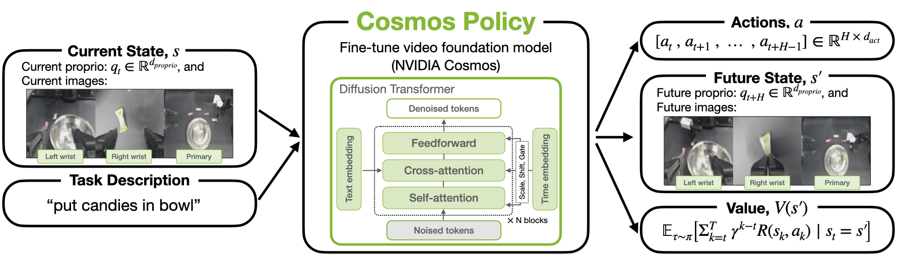
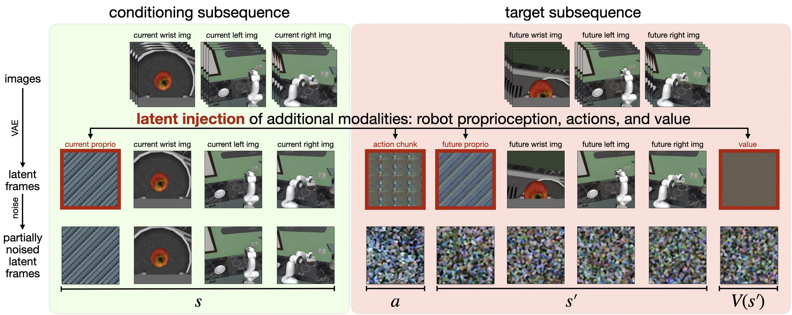
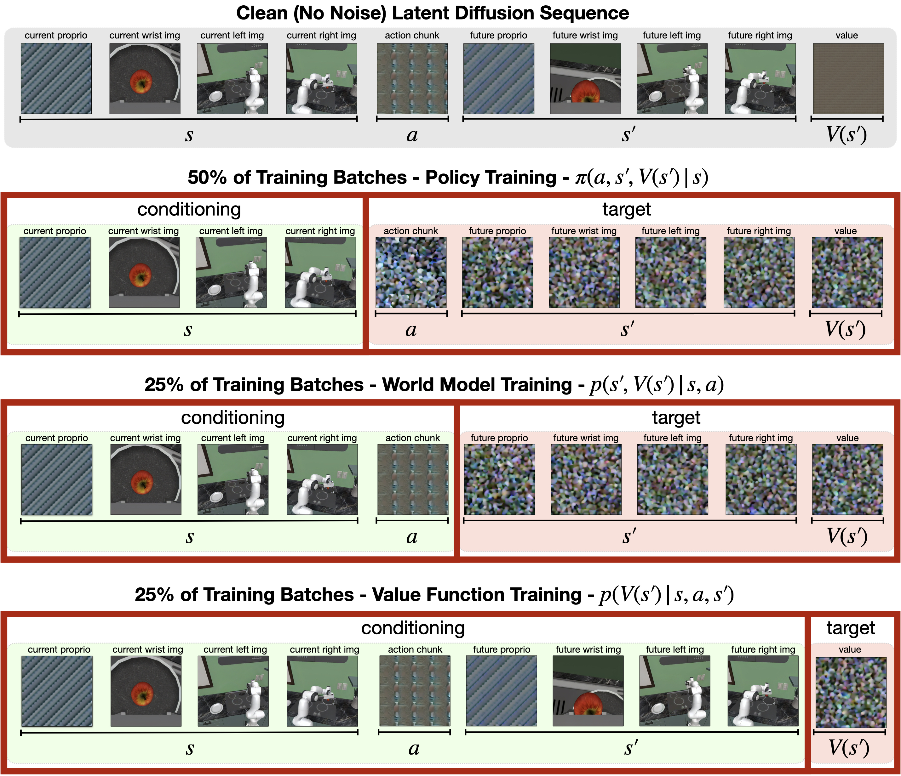
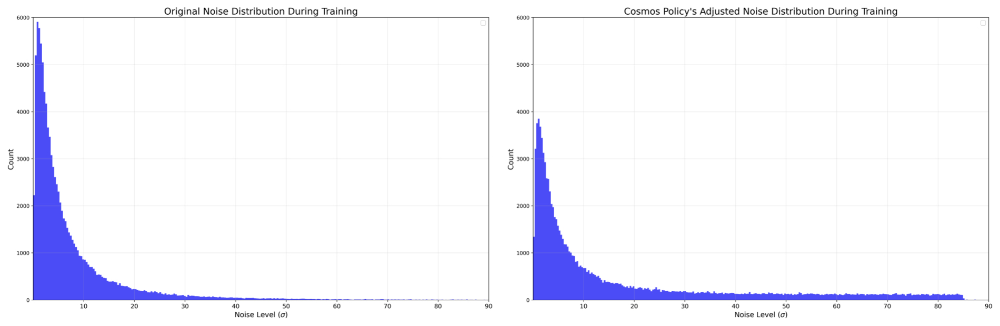
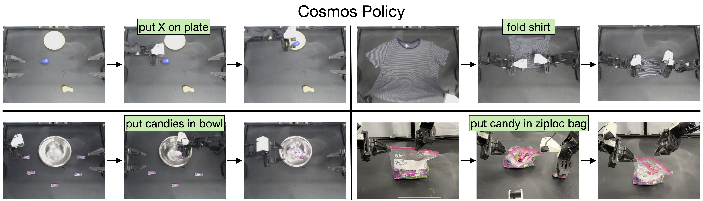
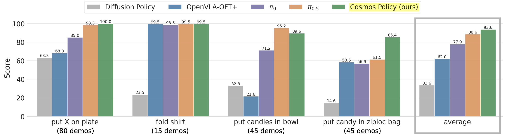
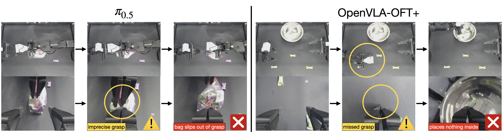
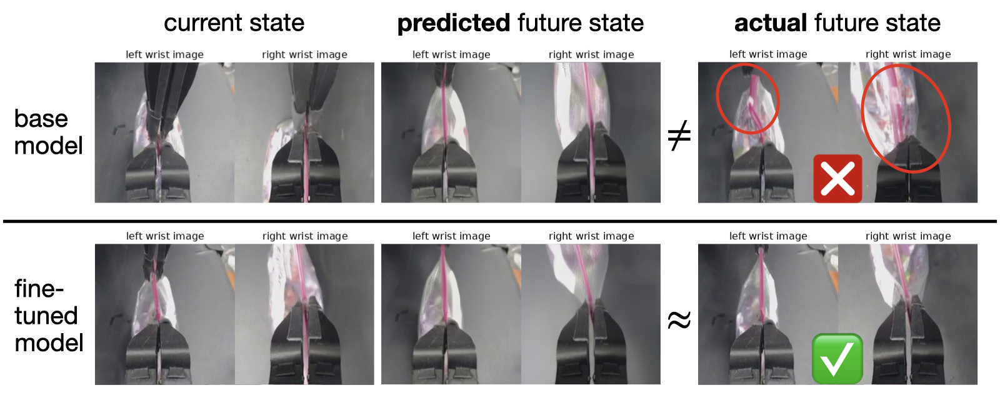
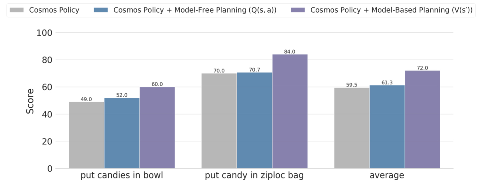

<!-- arxiv: 2601.16163 -->
<!-- venue: ICLR 2026 -->
<!-- tags: WAM, 视频生成, 扩散模型, 世界模型, 机器人操作 -->

%% mathjax-macros
\E: \mathbb{E}
%% end-mathjax-macros

# Cosmos Policy: Fine-Tuning Video Models for Visuomotor Control and Planning

> **论文信息**
> - 作者：Moo Jin Kim, Yihuai Gao, Tsung-Yi Lin, Yen-Chen Lin, Yunhao Ge, Grace Lam, Percy Liang, Shuran Song, Ming-Yu Liu, Chelsea Finn, Jinwei Gu
> - 通讯作者：Moo Jin Kim (moojink@cs.stanford.edu)
> - 机构：NVIDIA & Stanford University
> - 投稿方向：ICLR (基于 main_conference.sty 风格)
> - arXiv ID：2601.16163
> - 代码：https://research.nvidia.com/labs/dir/cosmos-policy/

---

## 一、核心问题

当前的机器人操控策略大多基于视觉-语言模型（VLA）构建，这类模型从静态图像-文本对中学习语义概念，但缺乏对物理因果、时序动态和运动模式的理解。预训练视频生成模型能够从海量视频中学习这些时空先验，已有工作尝试将其适配为机器人策略，但通常是多阶段训练（视频微调 → 动作模块训练），并需要引入新的架构组件（如独立的动作扩散器或逆动力学模型），增加了系统复杂性。

**本文的核心问题**：能否用一种简单的方式——不修改模型架构，仅通过单一阶段的微调——将预训练视频模型转化为既可以直接输出动作，又能预测未来状态和价值函数（从而支持测试时规划）的高性能机器人策略？

## 二、核心思路 / 方法

Cosmos Policy 的核心思想非常简洁：**将所有模态（动作、机器人状态、价值）都编码为 latent frame，直接插入视频扩散模型的 latent 序列中**，利用视频模型的扩散学习算法来统一建模这些异构模态。整个过程不改变模型架构。

### 2.1 Latent Frame Injection（潜帧注入）

这是 Cosmos Policy 的核心机制。Cosmos-Predict2 视频模型原本只能接受单视角图像和文本描述输入，输出一段短视频。为了让模型能处理机器人控制所需的多模态输入输出（多视角图像、机器人本体状态、动作 chunk、价值函数），作者提出了 latent frame injection：

1. **构造图像序列**：将多相机图像和空白占位图像拼接成图像序列
2. **VAE 编码**：通过 Wan2.1 时空 VAE tokenizer 将图像编码为 latent frame 序列（shape：$(1+T') \times H' \times W' \times 16$）
3. **注入新模态**：将占位图像对应的 latent frame 用归一化并复制填充的机器人本体状态、动作 chunk、价值标量覆盖
4. **扩散去噪**：对序列的被屏蔽部分加噪，模型学习从噪声中恢复干净 latent frame

*图1：Cosmos Policy 整体架构。Cosmos Policy 基于 Cosmos-Predict2-2B 视频基础模型微调而来，处理多模态输入（多视角相机图像）并预测 (1) 机器人动作 chunk、(2) 未来状态（机器人本体状态和图像观测）、(3) 未来状态价值（期望奖励）。所有模态均通过视频扩散学习目标联合建模，无需任何架构修改。*

具体来说，对于一个配备两台固定第三视角相机和一个腕部相机的机器人平台，latent 序列包含 11 个 latent frame：

| 编号 | 内容 | 类型 |
|------|------|------|
| 1 | 空白占位符 | 技术需要 |
| 2 | 机器人本体状态 $s$ | 输入/新模态 |
| 3 | 腕部相机图像 | 输入/新增视角 |
| 4 | 第三视角相机1（主相机） | 输入 |
| 5 | 第三视角相机2 | 输入/新增视角 |
| 6 | 动作 chunk $a$ | 输出/新模态 |
| 7 | 未来机器人本体状态 $s'$ | 输出/新模态 |
| 8 | 未来腕部相机图像 | 输出/新增视角 |
| 9 | 未来第三视角相机1 | 输出 |
| 10 | 未来第三视角相机2 | 输出/新增视角 |
| 11 | 未来状态价值 $V(s')$ | 输出/新模态 |

新模态的编码方式：将低维向量（如动作 chunk 的 $K \times d_{act}$ 形状）归一化到 $[-1, +1]$，然后复制填充为一个完整的 $H' \times W' \times C'$ latent volume。

*图2：Cosmos Policy 的 latent diffusion 序列。该图展示了 latent frame injection 的三步过程：第一行——原始图像被 tokenize 为 latent frame；第二行——额外模态（动作、状态、价值）直接插入 latent 序列；第三行——模型对加噪 latent frame 进行去噪，条件于干净帧。序列的排列顺序代表 $(s, a, s', V(s'))$，允许从左到右自回归解码。*

### 2.2 联合训练策略、世界模型与价值函数

训练时，每个 batch 的样本按 50/25/25 比例分配：

- **50% 来自示范数据** → 训练策略：$p(a, s', V(s') \mid s)$
- **25% 来自 rollout 数据** → 训练世界模型：$p(s', V(s') \mid s, a)$
- **25% 来自 rollout 数据** → 训练价值函数：$p(V(s') \mid s, a, s')$

三个函数的区分仅靠对 latent 序列的不同部分进行条件屏蔽，训练目标统一为 EDM 去噪评分匹配目标：

$$\mathcal{L}(D_\theta, \sigma) = \E_{\mathbf{x}_0, \mathbf{c}, \mathbf{n}}\left[\|D_\theta(\mathbf{x}_0 + \mathbf{n}; \sigma, \mathbf{c}) - \mathbf{x}_0\|_2^2\right]$$

其中 $\mathbf{x}_0$ 是干净的 VAE 编码图像序列，$\mathbf{c}$ 是 T5-XXL 文本嵌入，$\mathbf{n} \sim \mathcal{N}(\mathbf{0}, \sigma^2\mathbf{I})$。

*图3：Cosmos Policy 的 balanced batches 训练方案。每个训练批次的 50% 用于训练策略（条件于 $s$ 生成 $a, s', V(s')$），25% 用于训练世界模型（条件于 $s, a$ 生成 $s', V(s')$），25% 用于训练价值函数（条件于 $s, a, s'$ 生成 $V(s')$）。latent diffusion 序列保持不变，条件屏蔽方案决定了当前在优化哪个函数。三个函数的训练共享同一个去噪网络，仅通过不同的输入条件区分。*

### 2.3 噪声分布调整

原始 Cosmos-Predict2 使用对数正态分布采样噪声水平 $\sigma$：$\ln(\sigma) \sim \mathcal{N}(1.39, 1.2^2)$。这种分布在高噪声水平的训练权重很低，导致扩散采样的初始几步去噪不准确。对于图像/视频生成这可能不致命，但对于需要精确动作输出的机器人控制，初始去噪的误差会级联放大。

Cosmos Policy 改用**混合对数正态-均匀分布**：以 0.7 概率从原始对数正态分布采样，0.3 概率从 $\mathcal{U}(1.0, 85.0)$ 均匀采样，在高 $\sigma$ 区域增加了训练权重。推理时，将 $\sigma_{\text{min}}$ 从 0.002 提高到 4（而非 EDM 原始设置），减少极低信噪比去噪步的不准确性。

*图4：Cosmos-Predict2 原始噪声分布（左）与 Cosmos Policy 调整后的噪声分布（右）对比。左侧是原始对数正态分布：$\ln(\sigma) \sim \mathcal{N}(1.39, 1.2^2)$，训练权重集中在低噪声水平；右侧是混合对数正态-均匀分布，以 0.7/0.3 的比例增加了高 $\sigma$ 区域的训练权重，使模型在高噪声采样阶段有更好的去噪表现，从而提升动作预测的精度。*

### 2.4 Model-Based Planning

Cosmos Policy 支持两种部署模式：

1. **直接策略模式（无规划）**：并行生成动作、未来状态、价值，仅执行动作
2. **规划模式**：使用 best-of-N 搜索

规划流程：
1. 用策略模型采样 $N$ 个候选动作 chunk
2. 对每个候选动作，用规划模型（在 rollout 数据上微调过的 checkpoint）预测未来状态和价值
3. 每个动作的 future state ensemble 3 次，每个 future state 的 value ensemble 5 次，共 15 个价值预测
4. 用"多数平均"（majority mean）聚合：先判断多数预测成功还是失败（按固定阈值），再对多数组取平均
5. 选择价值最高的动作执行完整 chunk（不做滚动时域控制以降低计算成本）

## 三、训练目标

- **策略**：$p(a, s', V(s') \mid s)$ — 带有辅助监督
- **世界模型**：$p(s', V(s') \mid s, a)$ — 同样带有辅助价值监督
- **价值函数**：$p(V(s') \mid s, a, s')$ — 条件于完整前缀

**双部署**（dual deployment）：原始 checkpoint 作为策略模型，在 rollout 数据上微调（90% 权重训练世界模型和价值函数）后的 checkpoint 作为规划模型。

## 四、实验与结果

### 4.1 LIBERO 仿真基准

Cosmos Policy 在四个 LIBERO 任务套件上取得平均 **98.5%** 的成功率，刷新 SOTA：

| 方法 | Spatial | Object | Goal | Long | 平均 |
|------|---------|--------|------|------|------|
| Diffusion Policy | 78.3 | 92.5 | 68.3 | 50.5 | 72.4 |
| π₀ | 96.8 | 98.8 | 95.8 | 85.2 | 94.2 |
| π₀.₅ | **98.8** | 98.2 | 98.0 | 92.4 | 96.9 |
| CogVLA | 98.6 | 98.8 | 96.6 | 95.4 | 97.4 |
| **Cosmos Policy** | 98.1 | **100.0** | **98.2** | **97.6** | **98.5** |

### 4.2 RoboCasa 仿真基准

仅用 50 个人工遥操作示范（vs 对比方法的 300-3000 个），达到 **67.1%** 平均成功率：

| 方法 | 每任务示范数 | 平均成功率 |
|------|------------|-----------|
| GR00T-N1.5 + HAMLET | 300 | 66.4 |
| FLARE | 300 | 66.4 |
| Video Policy | 300 | 66.0 |
| **Cosmos Policy** | **50** | **67.1** |

### 4.3 真实世界 ALOHA 双臂任务

四项高难度任务的 101 次试验中，Cosmos Policy 取得最高平均得分 **93.6%**：

*图5：Cosmos Policy 在 ALOHA 双臂机器人四项任务中的执行表现。这四项任务分别为 (a) "将物品放在盘子上"——测试语言遵循能力，(b) "叠 T 恤"——需要长 horizon 和接触丰富操作，(c) "将糖果放入碗中"——测试多模态抓取序列处理能力，(d) "将糖果放入密封袋"——需要毫米级高精度操作。每项任务对真机操作要求极高，Cosmos Policy 展现出稳定可靠的操控表现。*

*图6：真机 ALOHA 四项任务得分对比（使用百分制评分而非二元成功/失败）。Cosmos Policy 在"放物品到盘子"(100.0)、"叠 T 恤"(99.5)、"糖果入碗"(89.6)、"糖果入袋"(85.4) 四项任务上综合得分 93.6%，排名第一。π₀.₅ 综合排名第二，在 OOD 场景中略优于 Cosmos Policy（92.5 vs 89.3）。Diffusion Policy 表现最弱，尤其在"叠 T 恤"(23.5)和"糖果入袋"(14.6)等高难度任务上显著掉分。*

*图7：对比方法的典型失败模式。左列：π₀.₅ 在 "糖果入袋" 任务中难以可靠执行高精度抓取——左侧手腕因握力不足使密封袋从手中滑脱，右侧手腕尚未到达滑块位置。右列：OpenVLA-OFT+ 在 "糖果入碗" 任务中经常将机械臂伸到两颗糖果中间而非直接对准一颗，说明其基于 L1 回归的动作建模难以处理高多模态的动作分布。相比之下，Cosmos Policy 通过扩散建模有效捕捉了这种多模态分布。*

### 4.4 消融实验

| 消融项 | 平均 SR | 变化 |
|--------|---------|------|
| Cosmos Policy（完整） | 98.5 | - |
| 去除辅助训练目标 | 97.0 | -1.5 |
| 从随机初始化训练 | 94.6 | -3.9 |

RoboCasa 上的更深入消融表明，最关键的组件是**策略训练时的未来状态预测辅助目标**——去除所有辅助目标后，成功率从 67.1% 骤降至 44.4%。

### 4.5 Model-Based Planning 实验

在"糖果入碗"和"糖果入袋"两项最具挑战性的 ALOHA 任务上（使用困难的 ID 和 OOD 初始条件），基于世界模型的规划（$V(s')$ 变体）取得了 **12.5 分的平均得分提升**。

*图8：世界模型预测对比——基础 Cosmos Policy vs 在 rollout 数据上微调后的 checkpoint。上图：基础 Cosmos Policy 的世界模型仅在成功示范上训练，无法预测"密封袋滑块脱手"这类失败，因此计划时无法避开这种错误。下图：在多样化 rollout 数据（含失败案例）上微调后，世界模型能准确预测操作失败的结果（模糊的未来图像表明模型预期滑块脱手），从而引导规划选择更优的动作。*

*图9：Model-Based Planning 结果。在两项最具挑战性的 ALOHA 任务（"糖果入碗"和"糖果入袋"）的困难初始条件下，对比了三种设置：基础 Cosmos Policy（无规划）、Model-Free Q(s,a) 规划、Model-Based V(s') 规划。Model-Based 变体取得最高整体得分，验证了学习环境动态模型对规划的重要性。Q(s,a) 变体表现较差，可能因为有限 rollout 数据下难以准确学习 Q 函数，且高维输入的过拟合风险更高。*

## 五、关键洞察与技术亮点

1. **零架构修改**：Cosmos Policy 完全不修改视频模型架构，仅通过 latent frame injection（将新模态填充为 latent volume 覆盖占位帧）来适配机器人控制任务。这是极简主义设计的典范，说明预训练视频扩散模型的表达能力足以涵盖异构模态。

2. **单一架构统一三大功能**：同一模型同时作为策略、世界模型和价值函数，仅靠条件屏蔽来切换功能角色。这与以往需要独立模块的做法（如 FLARE 的 learnable future token、SAILOR 的分离式世界+奖励模型）形成鲜明对比。

3. **辅助监督至关重要**：策略训练时不仅学习动作，还同时预测未来状态和价值——消融实验显示去除所有辅助目标后成功率从 67.1% 暴跌至 44.4%，说明"先预测后果再决定行动"的训练范式有实质帮助。

4. **噪声分布对控制任务的重要性**：将视频模型的对数正态噪声分布改为混合对数正态-均匀分布，增加了高噪声水平的训练权重。这个看似微小的改动对动作精度有显著影响，体现了视频生成模型和精确机器人控制的不同需求。

5. **从经验中学习规划**：通过收集 policy rollout 数据微调世界模型和价值函数，实现了模型从自身错误中学习。基础 checkpoint 的世界模型只见过成功轨迹，无法预测失败；微调后能准确预测失败状态，从而引导规划避开错误。

6. **视频模型先验优于 VLA 先验**：Cosmos Policy 的预训练数据（视频生成）中不包含任何机器人动作监督，却超越了在大量机器人数据上预训练的 VLA（如 π₀.₅、OpenVLA），说明视频的时空先验对低位控制有独特价值。

7. **数据效率高**：在 RoboCasa 上，Cosmos Policy 仅用 50 个人工示范就超过了使用 300-3000 个示范的竞争方法，展示了视频模型先验的数据效率优势。

## 六、局限性

1. **推理速度**：规划模式下生成一个 action chunk 约需 5 秒（8 路并行 H100 GPU），限制了对动态任务的适用性
2. **规划深度**：仅使用单层 best-of-N 搜索，未来可扩展到多步规划
3. **Rollout 数据需求**：有效规划需要大量 rollout 数据来微调世界模型，数据需求仍然较大
4. **基于 tokenizer 的量化限制**：Wan2.1 VAE 的时序压缩方案导致了需要空白占位帧等实现细节

## 七、关键概念速查

| 概念 | 解释 |
|------|------|
| **Latent Frame Injection** | 将非图像模态（动作、状态、价值）归一化后重复填充为 latent volume，直接写入扩散序列 |
| **Balanced Batches** | 50/25/25 的训练样本分配，同一 batch 同时优化策略、世界模型、价值函数 |
| **双部署 (Dual Deployment)** | 原始 checkpoint 作为策略模型，rollout 微调后的 checkpoint 作为规划模型 |
| **多数平均 (Majority Mean)** | 对 ensemble 的价值预测先按成功/失败分类，再对多数组取平均，对双峰分布更鲁棒 |
| **Action Chunk** | 一次预测多个连续时间步的动作序列，改善运动平滑性 |
| **EDM** | Elucidating Diffusion Models，Cosmos-Predict2 采用的扩散训练框架 |
| **Wan2.1 VAE** | 时空 VAE tokenizer，压缩比：时间 4×、空间 8×，latent 通道数 16 |
