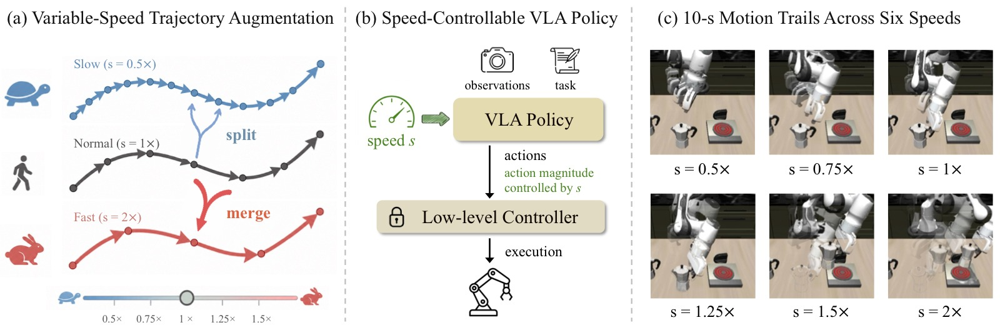
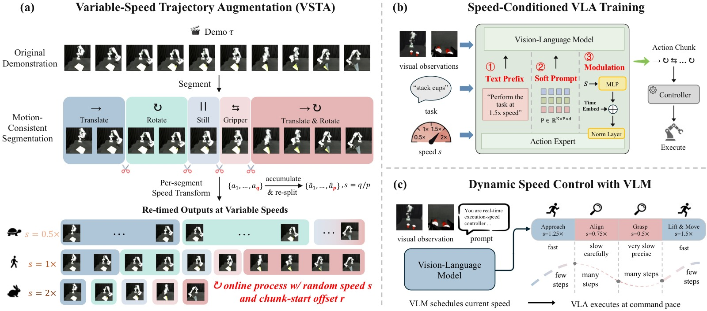
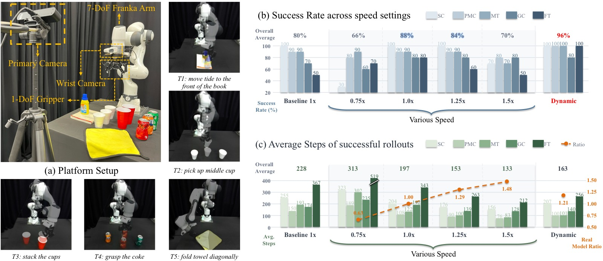
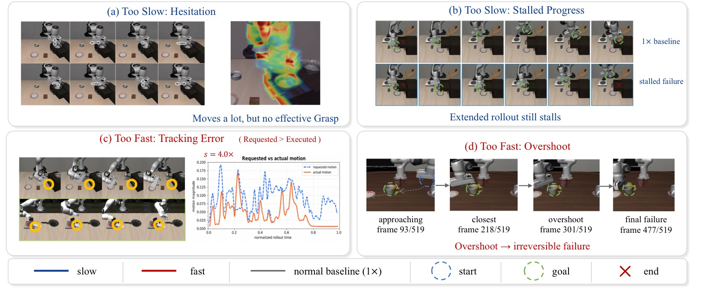

<!-- arxiv: 2606.06491 -->
<!-- venue: CoRL 2026 -->
<!-- tags: VLA, 机器人操作, 泛化, 语言模型 -->

# TempoVLA: Learning Speed-Controllable Vision-Language-Action Policies

> **论文信息**
> - 作者：Dong Jing (RUC), Jingchen Nie (FDU), Tianqi Zhang (UNC), Jiaqi Liu (UNC), Huaxiu Yao (UNC), Zhiwu Lu (RUC), Mingyu Ding (UNC)
> - 通讯作者：Zhiwu Lu, Mingyu Ding
> - 投稿方向：CoRL 2026
> - arXiv ID：2606.06491
> - 代码：未开源（论文中未提供代码仓库）

---

## 一、核心问题

机器人操作任务天然存在**速度异构性**：低风险的自由空间移动阶段应该快速执行，而高风险的接触阶段（抓取、插入等）需要缓慢、精确的运动。然而，现有的 Vision-Language-Action (VLA) 模型从训练演示中**静默继承单一固定速度**，无法在不同阶段灵活切换执行节奏。

现有加速方法（模型压缩、KV-cache 复用、异步 chunk 执行、RL 微调等）存在两个根本局限：
1. 它们只是将策略从**一个固定速度换到另一个固定速度**，而非提供显式的、按需的速度控制
2. 它们**只关注加速**，而减速（对精密插入、易碎物品交接等接触密集型行为至关重要）几乎未被探索

> 核心挑战：如何让**单个 VLA 模型**具备**显式的、双向的速度控制能力**，而无需从头重新训练其基础架构？

---

## 二、核心思路 / 方法

TempoVLA 的出发点是观察到：在具身设置中，**每个预测动作的幅度已经决定了机器人移动的速度**。基于此，从数据侧和模型侧两端同时入手：

- **数据侧**：VSTA（Variable-Speed Trajectory Augmentation）——在线将任意演示重定时到目标速度
- **模型侧**：将速度 $s$ 作为显式条件输入策略，通过三种注入方案缩放预测动作幅度
- 下游低层控制器**完全不变**

### 2.1 VSTA：可变速度轨迹增强

VSTA 在训练期间在线运行，包含三个步骤：

**步骤一：运动一致性分割（Motion-Consistent Segmentation）**

将每个演示切分为内部运动一致的段（segment）。每一帧标记为四种运动模式之一——静止（still）、平移（translate）、旋转（rotate）、平移+旋转（translate-and-rotate）。模式变化处设边界，同一模式内当运动方向反转（余弦相似度低于阈值 $\tau_{\text{dir}}$）时也设边界。夹爪开/合事件作为**硬边界**，确保离散状态切换不会被重采样模糊。

**步骤二：Chunk 级速度变换（Chunk-Level Speed Transform）**

将目标速度表示为 $s = q/p$（$q, p$ 互质），其中 $q$ 个源帧映射到 $p$ 个输出帧：
- $q > p$：加速（合并动作）
- $q < p$：减速（拆分动作）

对每个 segment 内的非重叠 $q$ 帧 chunk，累加其总运动量 $\Delta = \sum_{i=1}^{q} a_i$，然后将 $\Delta$ 线性重新分配为 $p$ 个等幅步长。**关键性质**：$p$ 个新动作的总和精确等于 $\Delta$，因此 chunk 的积分运动被保留，只有 chunk 内部的形状被改变。

> 累积-拆分操作的前提是**动作空间对线性组合封闭**。这对 $\mathbb{R}^3$ 中的 Cartesian 平移、关节速度、以及 $\mathfrak{so}(3)$ 中的轴角旋转增量成立。单位四元数、旋转矩阵、欧拉角等不封闭表示需要先映射到 $\mathfrak{so}(3)$ 或使用 SLERP 流形插值。

**步骤三：在线 Chunk 起始采样（Online Chunk-Start Sampling）**

加速时只有 chunk 起始帧的观测对应有效动作，其余 $q-1$ 个观测在训练中会被丢弃。为避免永久丢失，VSTA 为每个 segment 随机采样偏移量 $r \sim \mathcal{U}\{0, \dots, q-1\}$，每次训练采样该演示时重新抽取。在训练过程中，每个源帧最终都会成为某个 chunk 的起始帧。

*图1：TempoVLA 总览图，由三部分组成。*

**子图 (a) VSTA 重定时机制**：展示如何通过合并（merge）或拆分（split）连续动作来改变执行速度，同时保留运动语义。加速时多个动作合并为较少的大幅度动作，减速时少量动作拆分为更多的小幅度动作。

**子图 (b) 速度条件注入**：策略以标量速度 $s$ 作为显式条件输入，$s > 1$ 加速、$s < 1$ 减速、$s = 1$ 恢复默认速度。$s$ 缩放预测动作的幅度，低层控制器保持不动。

**子图 (c) 运动轨迹可视化**：同一 TempoVLA 策略在六个不同命令速度（0.5x 到 2x）下的 rollout 运动轨迹。慢速命令下轨迹收紧（精确但耗时），快速命令下轨迹拉伸（高效但可能不稳定）。这张图直观展示了单一策略的多速度执行能力。

### 2.2 速度条件注入方案

*图2：TempoVLA 框架总览，由三个子图组成，分别展示数据侧、模型侧和部署侧的完整流程。*

**子图 (a) VSTA 数据处理流程**：展示如何将每个运动一致性 segment 从 $q$ 帧重新分配为 $p$ 帧以实现 $s = q/p$。图中说明了 chunk 起始偏移 $r$ 的在线随机采样机制，以及 trailing remainder（不足 $q$ 帧的尾部）保持原样直通（passthrough）的处理方式。

**子图 (b) 三种速度注入方案**：(1) Text Prefix——在原始指令前添加 "Perform the task at <s>x speed." 文本前缀，架构完全不变；(2) Speed-Modulated RMSNorm——小型两层的 MLP $\phi_{\text{mod}}(s)$ 将速度标量嵌入后与 flow-matching 时间步嵌入相加，驱动每个 expert 层的自适应 RMSNorm；(3) Soft Prompt with Speed Anchors——维护可学习张量 $\mathbf{P} \in \mathbb{R}^{K \times P \times d_{\text{emb}}}$，为 $K$ 个训练速度锚点各存储 $P$ 个软提示 token，推理时选择最近锚点。

**子图 (c) VLM 动态调度**：部署时，VLM（GPT-4o）接收当前观测和提示作为输入，预测接下来几个 action chunk 的速度 $s_t$，TempoVLA 以该速度执行。VLM 和 TempoVLA 仅通过标量 $s$ 通信，规划器可独立升级而无需重新训练策略。

### 2.3 VLM 驱动的动态速度调度

除了固定速度命令，TempoVLA 与高层 VLM 配合时可实现自动化的**动态速度调度**：

- VLM 观测当前场景和任务指令，按 chunk 区间分派速度
- 低风险自由空间阶段加速通过，高风险接触阶段（抓取、插入）减速执行
- VLM 和策略之间仅通过标量 $s$ 通信，架构解耦

---

## 三、训练目标

TempoVLA 本身不引入新的损失函数。它基于 $\pi_{0.5}$（flow-matching VLA，建立在 PaliGemma 上），使用标准的模仿学习目标：

$$\theta^\star = \arg\min_{\theta} \mathbb{E}_{(o_t, A_t)\sim \widetilde{\mathcal{D}}}[\mathcal{L}(\pi_\theta(o_t, s), A_t)]$$

其中 $\widetilde{\mathcal{D}}$ 是经过 VSTA 增强的多速度数据集，$\pi_\theta(o_t, s)$ 是速度条件化策略，$\mathcal{L}$ 是 flow-matching 目标。

核心训练细节：
- 32 块 H20 GPU，总 batch size 512（LIBERO）
- 16 块 H20 GPU，总 batch size 128（真实世界）
- AdamW 优化器，余弦衰减调度，学习率 5e-5
- LIBERO 上训练 30k 迭代，真实世界 10k 迭代

---

## 四、实验与结果

### 4.1 仿真实验（LIBERO）

LIBERO 提供四组操作任务套件（Spatial、Object、Goal、Long），各含 10 个任务和 500 条人类遥操作演示。动作空间为 7 维末端执行器命令：平移 $(\Delta x, \Delta y, \Delta z)$、轴角旋转增量、夹爪信号。

#### VSTA 可行性验证

| 目标速度 $s$ | 数据比 | 成功率 (%) | 运动误差 |
|:---:|:---:|:---:|:---:|
| 0.5 | 0.5 | 83.0 | 2.8E-10 |
| 0.75 | 0.76 | 92.9 | 4.4E-9 |
| **1** | **1** | **97.6** | -- |
| 1.25 | 1.20 | 92.4 | 1.1E-8 |
| 1.5 | 1.43 | 81.6 | 2.2E-8 |
| 2 | 1.90 | 67.5 | 4.8E-8 |

> 关键发现：实际数据比紧密跟踪目标速度（高速端因整数 chunk 数要求有轻微舍入偏差），运动误差始终低于 $5\times 10^{-8}$，可忽略不计。速度越远离 1x，成功率单调下降。

#### 速度注入方案消融

三种注入方案（Text、Modulation、Soft Prompt-8）的平均成功率分别为 **96.8 / 96.8 / 96.5**，差距在 0.3% 以内。三种方案的 rollout 步数也相当。论文选择 Text 作为默认方案，因为它最简单灵活，无需架构改动或预定义锚点集。

#### 训练速度范围的影响

以单速度基线（96.7%）为基准，在三个逐步扩展的速度范围上训练：

| 速度 | 窄范围 $\{0.75,1,1.25,1.5\}\times$ | 宽-大步 $\{0.5,1,1.5,2\}\times$ | 宽-细步 $\{0.5,0.75,...,2\}\times$ |
|:---:|:---:|:---:|:---:|
| 0.5x | -- | 94.1 | **95.0** |
| 0.75x | 96.5 | -- | **96.3** |
| 1.0x | 96.9 | 96.8 | **96.9** |
| 1.25x | **97.0** | -- | **97.4** |
| 1.5x | 96.8 | 97.2 | **97.3** |
| 1.75x | -- | -- | **95.6** |
| 2.0x | -- | 88.4 | **89.4** |

> 核心发现：
> 1. **VSTA 提升 1x 性能**：所有速度范围训练的模型，其 1x 成功率均不低于单速基线，Object 和 Goal suite 上提升达 +2.0 ~ +2.6 个百分点——速度条件训练迫使策略提取更细粒度的物体和目标感知特征
> 2. **峰值性能偏离 1x**：每个速度条件策略的峰值成功率出现在 **1.25x 或 1.5x** 而非 1x——遥操作数据中存在节奏松弛，VSTA 的合并操作在适度加速时压缩掉了这些冗余
> 3. **更细的速度粒度有帮助**：将步长从 0.5 细化到 0.25 在所有共享速度点都提升了成功率
> 4. **实际速度 vs 数据速度比**：模型在高速端欠冲（2x 命令下仅实现 1.56-1.58x），原因包括纠错步骤增加 rollout 长度和低层控制器无法准确跟踪大幅动作

#### 极端速度压力测试

在 $\{0.25, 0.5, ..., 4\}\times$ 的宽范围上训练后：

| 速度 | 平均 SR | 模型比 | 控制器差距 (位置 m/旋转 rad) |
|:---:|:---:|:---:|:---:|
| 0.25x | 75.8 | 0.28 | 0.009 / 0.015 |
| 0.5x | 92.8 | 0.53 | 0.019 / 0.031 |
| 1x | 96.6 | 1.00 | 0.038 / 0.069 |
| 1.5x | 96.6 | 1.36 | 0.057 / 0.100 |
| 2x | 88.3 | 1.60 | 0.075 / 0.129 |
| 2.5x | 72.8 | 1.58 | 0.095 / 0.151 |
| 3x | 56.0 | 1.54 | 0.112 / 0.189 |
| 4x | 34.3 | 1.63 | 0.146 / 0.243 |

> 关键发现：
> - 速度控制在 **0.5x-1.5x** 范围内退化优雅（SR > 92），超出后性能在两端下降
> - 加速瓶颈在**控制器而非 TempoVLA**：控制器差距从 1x 的 0.038m 激增到 4x 的 0.146m，单步目标过大导致操作空间控制器无法在单控制周期内跟踪
> - 模型比在 $s \ge 2\times$ 后饱和于约 1.6x，无论 TempoVLA 预测什么，机器人无法移动得比控制器能跟踪的速度更快

### 4.2 真实世界实验

使用 7-DoF Franka 手臂配 1-DoF 平行夹爪，一个主相机和一个腕部相机，在 5 个任务上评估（4 个 pick-and-place + 1 个可变形物体任务），每任务 50 条遥操作轨迹训练，每速度 10 次 rollout 评估。

*图3：真实世界实验设置和主要结果。*

**子图 (a) 任务设置**：展示 Franka 手臂上的五个任务——四个标准 pick-and-place 行为和一个可变形物体操作任务（如折叠布料）。每个任务需要不同的接触精度和运动模式，适合验证速度控制的双向灵活性。

**子图 (b) 成功率对比**：单速基线（1x）为 80.0%，TempoVLA 1x 提升至 88.0%（+8 个百分点），验证了 VSTA 的数据增强效应在真实硬件上也成立。GPT-4o 动态调度变体达到最高的 96.0% 成功率，比最佳固定速度配置高出 8 个百分点，同时保持平均 1.21x 的实际加速。

**子图 (c) 模型比跟踪**：实际实现的模型比在 0.75x 命令下为 0.63x，1.25x 命令下为 1.29x，1.5x 命令下为 1.48x，紧密跟踪命令比。这表明速度条件在真实硬件上的转化是忠实的——不仅是策略预测层面，而且通过了不变的低层控制器。

#### 动态速度调度结果

GPT-4o 调度 + TempoVLA 达到 **96% 平均成功率**，比最佳固定速度（88% at 1x）高 8 个百分点，同时平均实际加速 1.21x。尽管 prompt 鼓励激进的加速，实际调度偏保守，绝大多数决策落在 1x 或 1.25x 档位。GPT-4o 能可靠读取执行状态，正确预判自由空间移动、精细对准和接触阶段。

### 4.3 失败模式分析

*图4：极端速度下的失败模式定性分析，四个子图分别展示低速和高速下的典型失败案例。*

**子图 (a) 低速-犹豫（Hesitation）**：在极低速度（如 0.25x）下，末端执行器在目标物体周围产生重复的局部运动，但这些运动不足以累积成有效抓取。策略保持活跃，但每步位移过小，无法可靠驱动系统跨越关键操作转换（接近→接触→抓取）。

**子图 (b) 低速-停滞（Stalled Progress）**：即使扩展 rollout 步数预算，机器人仍停留在类似的局部行为模式中。这说明失败不仅仅是控制步数不足的问题，而是每步贡献的有效进展太少，策略被困在阶段边界附近。

**子图 (c) 高速-跟踪误差**：策略发出较大的每步目标，但低层控制器无法在单个控制间隔内忠实执行。这与极端速度压力测试中的控制器差距测量一致——模型比在 1.6x 左右饱和。

**子图 (d) 高速-超调（Overshoot）**：末端执行器过于激进地接近目标区域，越过有效交互窗口，策略来不及纠正运动。这类失败在接触密集型阶段尤其致命——一旦夹爪越过物体或将其推入分布外状态，剩余 rollout 可能无法恢复。

> 实用启示：TempoVLA 不应以极端固定速度执行整个 rollout，而应根据当前操作阶段选择速度——自由空间阶段快速移动，接触密集阶段慢速执行。这与动态速度调度的设计理念一致。

---

## 五、关键洞察与技术亮点

1. **动作幅度即速度**：不需要修改控制器或推理管线，直接通过缩放预测动作的幅度来控制执行速度，设计极其简洁

2. **VSTA 的双重作用**：既是数据增强工具（使单速数据变为多速数据），又是隐式正则化器（速度条件训练迫使策略学习更鲁棒的特征，从而提升 1x 性能）

3. **速度控制的注入几乎无成本**：三种注入方案（文本前缀、RMSNorm 调制、软提示）性能几乎无差别，用最简单的文本前缀即可，无需架构改动

4. **峰值性能不在 1x**：速度条件训练后模型在 1.25x–1.5x 表现更好，因为 VSTA 的合并操作压缩了遥操作数据中的节奏冗余

5. **加速瓶颈在控制器，不在策略**：极端速度下控制器差距是主要限制因素，TempoVLA 本身在 0.5x–1.5x 范围内退化优雅

6. **VLM + 标量通信的优雅架构**：通过将策略和控制解耦（仅用标量 $s$ 通信），可以用任意 VLM 替换调度器，无需重新训练策略

7. **运动语义保留**：VSTA 的累计-拆分操作确保 chunk 的积分运动精确保留，改变的仅是 chunk 内部的动作分布形状

---

## 六、局限性

1. **高速饱和**：实际加速在 1.6x 左右饱和，受限于低层控制器的跟踪带宽。共同调优控制器和 TempoVLA 是自然的扩展方向

2. **VSTA 对非组合动作空间的限制**：当前实现要求动作空间对线性组合封闭（平移、关节速度、轴角旋转），单位四元数、旋转矩阵、欧拉角等需要先映射到合适表示

3. **VLM 调度延迟**：当前实现中 GPT-4o 在 action chunk 之间同步调用，增加了 roll-out 的 wall-clock 开销

4. **速度归一化缺失**：当前以原始演示速度为 1x，但人类操作者的速度在演示内和演示间存在差异。更干净的方案是先对数据集内速度变异性做归一化

5. **低速端退化**：在 0.25x 时成功率降至 75.8%，每步动作幅度接近零时策略对视觉模糊状态更敏感

---

## 七、关键概念速查

| 概念 | 说明 |
|:---|:---|
| **VLA** | Vision-Language-Action 模型，从视觉和语言输入直接预测机器人动作 |
| **VSTA** | Variable-Speed Trajectory Augmentation，通过合并/拆分动作在线重定时演示 |
| **$s = q/p$** | 速度因子表示为互质整数比，$q$ 源帧 → $p$ 输出帧 |
| **Motion-consistent segmentation** | 按运动模式（静止/平移/旋转/平移+旋转）和方向反转切分演示 |
| **Speed conditioning** | 将标量速度 $s$ 注入 VLA 的三种方案：文本前缀、RMSNorm 调制、软提示 |
| **Flow-matching** | $\pi_{0.5}$ 使用的动作生成范式，对动作分布进行生成式建模 |
| **$\mathfrak{so}(3)$** | 3D 旋转的李代数，轴角表示所在空间，对线性组合封闭 |
| **Controller Gap** | 策略请求的每步运动量与控制器实际实现的运动量之间的差异 |
| **Dynamic speed scheduling** | VLM 根据场景按 chunk 动态分配速度，TempoVLA 执行 |
