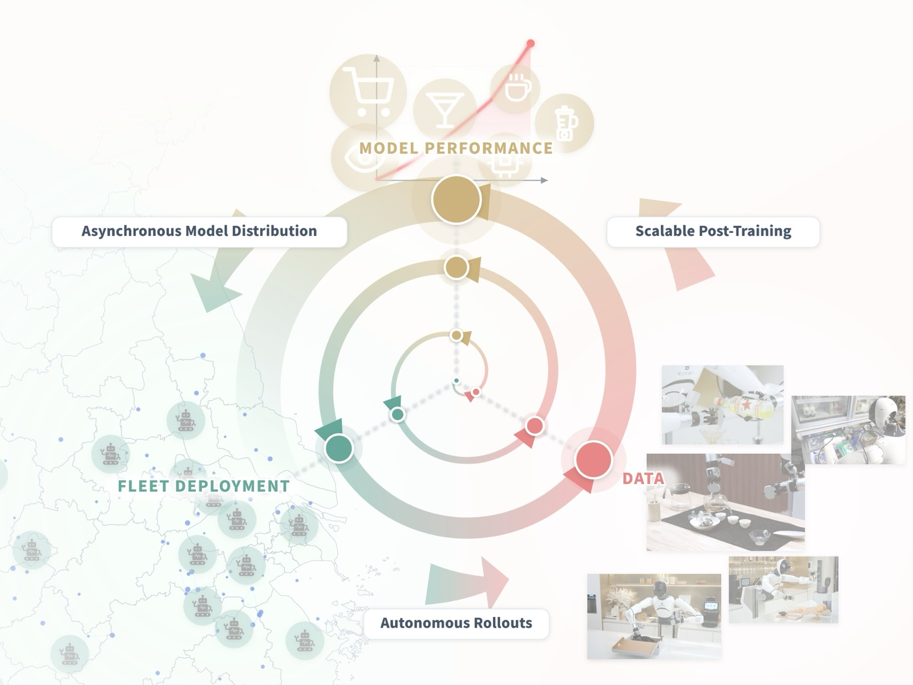
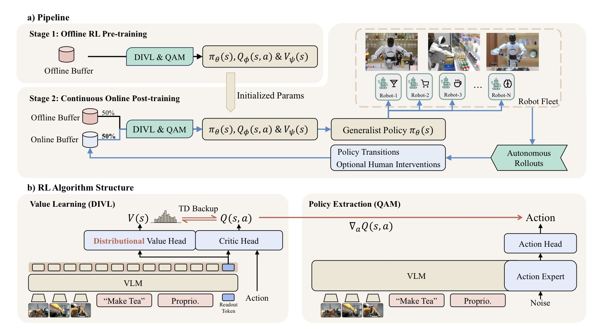
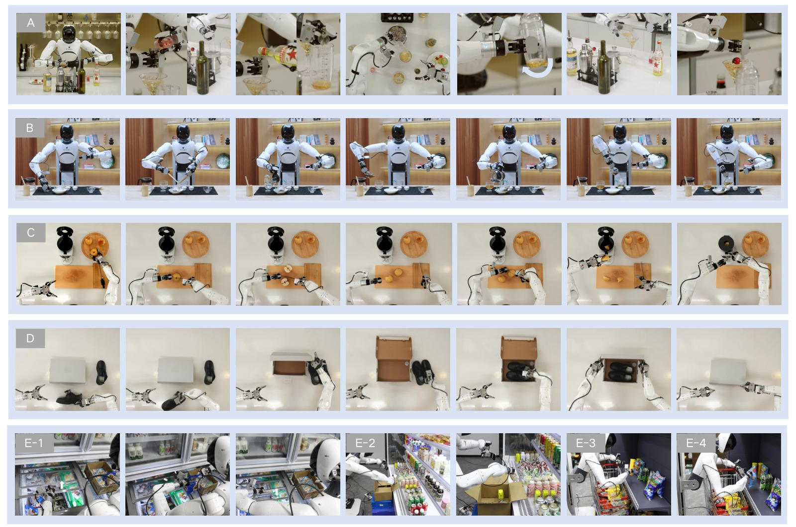
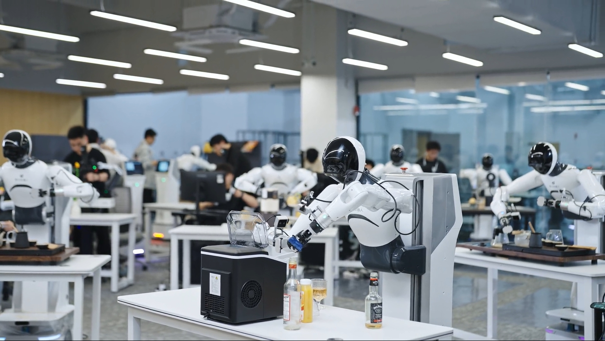
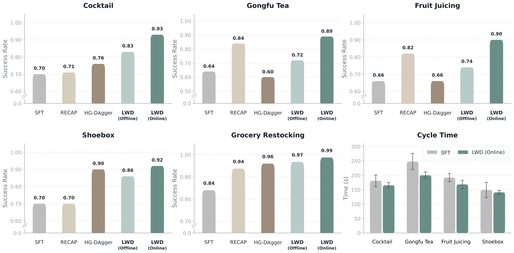
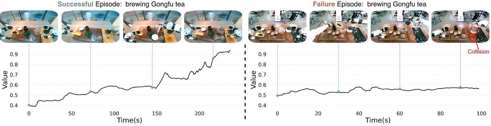
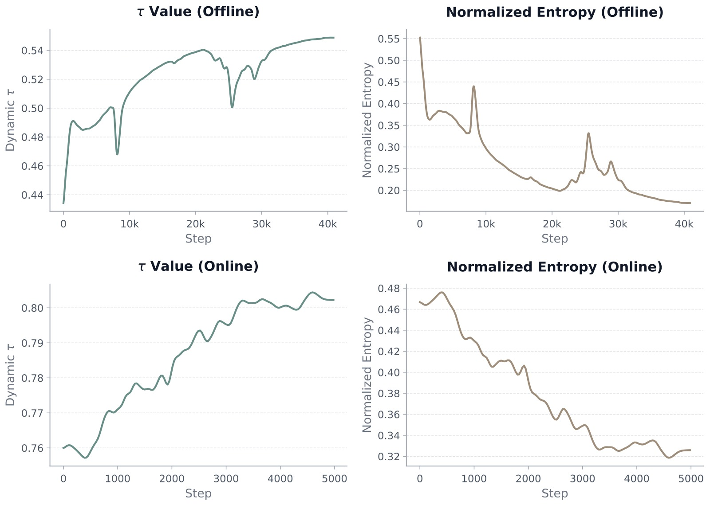

<!-- arxiv: 2605.00416 -->
<!-- venue: arXiv 2026 -->
<!-- tags: 强化学习, 机器人操作, 离线RL, 通用策略 -->

# Learning While Deploying: Fleet-Scale Reinforcement Learning for Generalist Robot Policies

> **论文信息**
> - 作者：Yi Wang, Xinchen Li, Pengwei Xie, Pu Yang, Buqing Nie, Yunuo Cai, Qinglin Zhang, Chendi Qu, Jeffrey Wu, Jianheng Song, Xinlin Ren, Jingshun Huang, Mingjie Pan, Siyuan Feng, Zhi Chen, Jianlan Luo
> - 通讯作者：Jianlan Luo
> - 机构：Shanghai Innovation Institute, AGIBOT Finch, Columbia University
> - 投稿方向：IEEE 会议（投稿中）
> - arXiv ID：2605.00416
> - 项目页面：https://finch.agibot.com/research/lwd

---

## 一、核心问题

**通用机器人策略（VLA）在大规模离线预训练后，仍无法直接部署到真实世界。** 根本原因在于：真实部署不是固定测试集——机器人进入家庭、商店、工作空间后，会不断遇到新物体、新布局、新用户指令和罕见的失败模式，这些远远超出预训练数据的覆盖范围。

现有方案的不足：
- **模仿学习类方法**（HG-DAgger 等）：只利用成功示范和人类纠正作为行为克隆的标签，无法从失败尝试和部分进展中学习
- **在线 RL 方法**（VLA-RL、RIPT 等）：依赖 on-policy 数据，样本效率低，且通常训练单一任务的 specialist 策略
- **离线 RL 方法**（π₀.₆ 等）：收集-训练-部署周期割裂，部署中积累的经验无法立即回流用于策略改进

> 核心洞察：部署不应是训练的终点，而应是策略持续改进的数据来源。真正有价值的是**舰队规模**的部署经验——单台机器人只采样到部署分布的一小部分，而机器人群覆盖了多样化的任务、环境、物体和用户指令。

---

## 二、核心思路 / 方法

### 2.1 总体框架：Learning While Deploying (LWD)

LWD 构建了一个**离线到在线（offline-to-online）RL 数据飞轮**：



*图1：LWD 数据飞轮总览。一个预训练的 VLA 模型先由人类收集的离线数据初始化。部署后，机器人群在多样化真实任务中自主收集在线交互数据，这些数据与离线 replay buffer 混合用于更新模型，更新后的模型再次部署以收集更多数据。关键区别在于：RL 利用任务奖励（成功/失败信号）而非仅模仿动作标签，因此能从失败尝试和部分进展中学习。*

流程分为两个阶段，使用**完全相同的 RL 目标**，避免离线→在线切换时的分布不匹配：

```
阶段一：离线预训练（Offline Pretraining）
  ┌──────────────────────────────────────────────┐
  │  B_off (Demo + Rollout + Play)               │
  │  ───────────────────────────                 │
  │  输入 → DIVL 训练 Q_ϕ, V_ψ                   │
  │       → QAM 更新 π_θ                          │
  │       → 输出：初始化策略 + 值函数              │
  └──────────────────────────────────────────────┘

阶段二：持续在线训练（Continuous Online Training）
  ┌──────────────────────────────────────────────┐
  │  16 台机器人异步部署                           │
  │       ↓                                       │
  │  自主 rollout + 人类干预                       │
  │       ↓                                       │
  │  B_on（成功/失败/干预片段）                     │
  │       ↓                                       │
  │  混合采样 B_off ∪ B_on                        │
  │       ↓                                       │
  │  DIVL + QAM 更新（同目标）                      │
  │       ↓                                       │
  │  每 50 步广播新策略给所有机器人                  │
  └──────────────────────────────────────────────┘
```

### 2.2 方法架构



*图2：LWD 方法概览（两个子图）。*

**子图 (a) Pipeline：** 展示两阶段训练流程。阶段 1 在离线 buffer 上做 RL 预训练（使用演示数据、历史 rollout 和 play data）。阶段 2 是持续在线后训练——16 台机器人在 8 个真实任务上自主收集数据，进入在线 buffer，与离线 buffer 混合 replay，定期同步策略。

**子图 (b) 算法结构：** 包含两个核心模块——(1) **值学习模块**：基于 VLM 的 shared backbone（Gemma3-270M + SigLIP-So400M）提取状态表征 zₜ，分布性值模型 V_ψ(s) 预测值分布，critic Q_ϕ(s,a) 使用双 Q 结构输出标量 Q 值；(2) **策略提取模块**：基于 PaliGemma VLM + Gemma-300M action expert 的 flow 策略 π_θ(s)，通过 QAM loss 利用 critic 梯度改进动作生成。在线阶段策略的 VLM backbone 冻结，仅更新 action expert。

### 2.3 关键组件一：分布性隐式值学习（DIVL）

传统 IQL 使用**标量 expectile 回归**来估计状态值，这在舰队部署设定中存在严重缺陷：

> 舰队中不同机器人异步采集的数据多样且异构，同一 (s,a) 对应的回报可能多模态且重尾分布。标量 critic 会将不同结果压缩为单一平均值，**抹去罕见但可复现的高回报模式**。

DIVL 的核心改进：用**分布性值模型**替换标量 expectile 回归。

**DIVL 工作流程：**

```
Step 1: 学习值分布
  p_ψ(v|s_t) = P(v = Q_ϕ(s_t, a_t) | a_t ∼ D(·|s_t))

  用交叉熵损失拟合（C51 categorical discretization）：
  L_V(ψ) = E[-log p_ψ(Q_bar(s_t, a_t) | s_t)]

Step 2: 用量化分位数构造 TD 目标
  y_Q = r_t + γ^H · Quantile_τ(V_ψ(s_{t+H}))

  其中 τ 控制乐观程度：
  - τ=0.9：取分布的 90 分位数（乐观估计）
  - τ=0.6：取分布的 60 分位数（保守估计）

  关键：Quantile 在 replay 动作的支持集内选择，不进行跨动作空间的外推
```

**适应性 τ 策略：** τ 不应全局固定。DIVL 利用值分布的归一化熵来动态调节 τ：

- **高熵**（分布弥散）→ 降低 τ，更保守，减少对不确定状态的高估
- **低熵**（分布集中）→ 提高 τ，更乐观，信任 confident 的估计

$$\tau(s_{t+H}) = \mathrm{clip}(\tau_{\text{base}} - \alpha \cdot \mathcal{H}(s_{t+H}), \tau_{\min}, \tau_{\max})$$

**理论保证：** 论文证明了标量非对称回归与"先拟合分布再提取分位数"的二步过程在最优解上等价（Proposition 1），为 DIVL 提供了理论基础。

### 2.4 关键组件二：QAM 策略提取

Flow-based VLA 策略的动作通过多步去噪过程生成，**直接反向传播 critic 梯度经过整个 ODE 轨迹计算昂贵且数值不稳定**。

QAM（Q-learning with Adjoint Matching）的解决方案：

```
传统方法（难用）:                   QAM 方法（LWD 采用）:
  z₀ ~ N(0,I)                        z₀ ~ N(0,I)
  ↓ ODE solver (多步)                 ↓ 参考 flow f_β 前向 rollout
  a₁ = action                         {a_w} w∈[0,1]   ← 参考轨迹
  ↓                                  ↓
  ∇_a Q(s, a₁)                       ∇_a Q(s, a₁)  → adjoint 终端条件 g̃₁
  ↓ 反向传播整个 ODE (昂贵)           ↓ 沿轨迹局部回归
  ∇_θ J                              L_QAM ≈ ||2f_δ/σ_w + σ_w·g̃_w||²
```

QAM 的数学形式——将 KL 正则化的策略改进目标：

$$\pi^*(\mathbf{a}|s) \propto \pi_\beta(\mathbf{a}|s) \exp(Q_\phi(s,\mathbf{a})/\lambda)$$

转化为沿参考 flow 轨迹的**局部回归目标**（Eq. 7）。每个 replay minibatch 中：采样状态和噪声 → 用固定参考策略 f_β 生成参考轨迹 → 在终点评估 ∇_a Q → 解 adjoint 动力学 → 回归 f_θ 到局部目标。

---

## 三、训练目标

### 3.1 MDP 形式化

- 状态 s = (o, ℓ_k)：观测 + 语言指令，「冲茶」而非子任务序列
- 动作 chunk a_{t:t+H}：H=30 步动作
- 稀疏二元奖励：r=1 仅当 episode 成功，否则 r=0
- 折扣 γ=0.9999

### 3.2 离线阶段：n-step TD 冷启动

长时域任务（Gongfu Tea、Cocktail、Fruit Juice、Shoebox）的成功信号极度稀疏。离线阶段使用 10-step chunk 级 TD 加速奖励传播（等价于 300 物理步的 backup）：

$$y_Q = \sum_{i=0}^{n-1} \gamma^{iH}\mathbf{r}_{t+iH} + \gamma^{nH}\text{Quant}_{\tau(s_{t+nH})}(V_\psi(s_{t+nH}))$$

短时域任务（grocery restocking）使用 1-step。如果 episode 在窗口内终止，截断 return 并移除 bootstrap 项。

**在线阶段统一使用 1-step TD**：在线轨迹可能混合策略动作和人类干预，更长的 backup 可能跨越不一致的执行源。

### 3.3 离线数据组成

| 任务 | Demo | Rollout (成功) | Rollout (失败) | Play | **总计** |
|------|------|---------------|---------------|------|----------|
| Restocking | 14.5h | 10.7h | 1.7h | 7.5h | 34.4h |
| Correction | 12.7h | 10.8h | 1.7h | 9.7h | 34.9h |
| Freezer | 10.8h | 7.7h | 4.6h | 3.3h | 26.4h |
| Open-Cooler | 11.1h | 13.7h | 1.3h | 0.8h | 26.9h |
| Gongfu Tea | 102.3h | 12.4h | 4.4h | 43.6h | 162.7h |
| Fruit Juice | 100.5h | 17.4h | 14.7h | 47.1h | 179.8h |
| Cocktail | 47.3h | 4.4h | 7.4h | 28.0h | 87.1h |
| Shoebox | 37.3h | 11.7h | 3.3h | 48.0h | 100.3h |
| **总计** | **336.6h** | **88.8h** | **39.2h** | **187.9h** | **652.5h** |

三种数据类型：
- **Demo**：人类专家收集的成功轨迹
- **Rollout**：历史策略产生的成功+失败轨迹
- **Play**：人类引导的失败模式探索数据

---

## 四、实验与结果

### 4.1 实验设置



*图3：8 个真实世界操纵任务的示意图（5 个子图 A-E）。*

**【子图 A】Make Cocktail（制作鸡尾酒）：** 完整的长时域任务序列——量取多种酒液、加入冰块、摇晃调酒器、倒入高脚杯、装饰樱桃。涉及多种容器的精确操作和液体处理。

**【子图 B】Brew Gongfu Tea（泡工夫茶）：** 6 阶段序列——加茶叶、洗茶/沥水、热水冲泡、转移至公道杯、分入三个茶杯、上茶。每一步都对精度有较高要求，且阶段间存在强依赖。

**【子图 C】Make Fruit Juice（榨果汁）：** 多步序列——切水果并重新定向、切片、转移至榨汁机、盖上盖子、旋转控制旋钮启动榨汁。包含工具使用和旋钮操作的精确控制。

**【子图 D】Pack Shoes（打包鞋盒）：** 将鞋子装入鞋盒并整齐放置。测试精细操控和空间规划能力。

**【子图 E】Grocery Restocking（杂货补货）4 个子任务：** Flat-Shelf Restocking（平面货架补货）、Misplaced-Item Correction（错放物品纠正）、Freezer Restocking with Door Operation（冷柜补货+开关门）、Open-Cooler Restocking with Carton Handling（开放式冷柜补货+纸箱处理）。测试语义 grounding、接触丰富操纵和错误恢复能力。

整个测试套件覆盖语义理解、接触丰富操控、长时域执行和错误恢复。

**硬件设置：**
- Agibot G1 双臂平台，每臂 7-DoF + 平行爪
- 3 个 RGB 相机（1 头部 + 2 腕部）
- 30Hz 关节位置控制



*图4：用于在线数据收集的 16 台 Agibot G1 双臂机器人群。每个实验方法分配 4 小时 wall-clock 预算，约相当于 60 机器人小时的总在线数据。在线训练期间，机器人异步执行 rollout，所有任务的 episode 汇集到单一在线 replay buffer。*

### 4.2 主要结果



*图5：8 个任务的成功率得分和长时域任务的 cycle time 对比。分为两个视图：*

**左侧成功率得分（共 8 个任务）：** 每个任务的各个方法得分以垂直柱状图并排展示。深蓝色（LWD Online）在所有长时域任务上明显高于其他方法。Grocery restocking 任务上，所有后训练方法分数都较高（天花板效应），但 LWD 仍保持最佳或接近最佳。

**右侧 cycle time：** 长时域任务上 LWD 将平均 cycle time 降低 23.75 秒（相对于 SFT）。这一效率提升说明 critic 引导的策略更新不仅改进了最终成功率，还减少了机器人执行中的犹豫、重试和不稳定行为。

| 方法 | Restock | Correct | Freezer | Cooler | Tea | Juice | Cocktail | Shoebox | **Avg** |
|------|---------|---------|---------|--------|-----|-------|----------|---------|---------|
| SFT | 0.70 | 0.88 | 0.83 | 0.95 | 0.64 | 0.66 | 0.70 | 0.70 | 0.76 |
| RECAP | 0.95 | 0.96 | 0.94 | 0.95 | 0.84 | 0.82 | 0.71 | 0.70 | 0.85 |
| HG-DAgger | **1.00** | 0.92 | 0.92 | **1.00** | 0.60 | 0.66 | 0.76 | 0.90 | 0.85 |
| LWD (Offline) | **1.00** | **1.00** | 0.92 | 0.95 | 0.72 | 0.74 | 0.83 | 0.86 | 0.88 |
| **LWD (Online)** | **1.00** | **1.00** | **0.97** | 0.98 | **0.89** | **0.90** | **0.93** | **0.92** | **0.95** |

**关键发现：**

1. **LWD Online 全面最优**：平均得分 0.95（最接近的 baseline 0.85），长时域平均 0.91 vs SFT 0.68——**提升 23 个百分点**
2. **离线 RL 已经有效**：LWD Offline（0.88）超越 RECAP 和 HG-DAgger（均 0.85），证明 reward-based 训练优于纯模仿学习
3. **HG-DAgger 在长时域上退步**：某些任务甚至不如 SFT——DAgger 式训练依赖人类纠正数据的质量，但人类纠正的变异性大，对状态的探索覆盖有限
4. **RL 对长时域任务的独特优势**：终端成功信号通过 TD backup 传播到早期决策步骤，改善所有阶段的值估计

### 4.3 值函数可视化



*图6：Gongfu Tea 任务上学习到的分布性值函数 V 的分位数值（quantile values）随时间变化的两个代表性 episode。*

**左图（成功 episode）：** 值估计随着机器人完成关键子步骤（加茶叶→洗茶→冲泡→倒茶）而单调上升，从约 0.3 逐渐增加到接近 1.0。这表明尽管只有终端稀疏奖励，值函数仍然捕捉到了任务进展的结构化信号——这是 RL 优于模仿学习的关键差异：RL 能从"状态→奖励预测"中学到进展信号，而模仿学习只能复制动作分布。

**右图（失败 episode）：** 值估计在局部有波动但始终停留在较低水平（约 0.2-0.4），在未达到已标注的任务里程碑前就停止上升。说明值函数能区分进展和停滞。

> 这一可视化不是用于验证的评估指标，而是定性诊断——证明了 DIVL 在稀疏奖励下成功学到了有意义的值估计。附录中的值分布可视化进一步显示：成功 episode 中预测的分布保持单峰且模式从 0.4 稳步上升到 1.0，而失败 episode 的模式仅在 0.5-0.6 间微弱变化后趋于平稳。

### 4.4 消融实验

**消融一：分布性值学习 vs 标量 expectile 回归**

| Method | Short-Horizon Offline | Short-Horizon Online | Long-Horizon Offline | Long-Horizon Online |
|--------|----------------------|---------------------|---------------------|---------------------|
| Expectile Regression | 0.96 | 0.97 | 0.72 | 0.78 |
| **DIVL** | **0.97** (+1.0%) | **0.99** (+2.1%) | **0.79** (+9.7%) | **0.91** (+16.7%) |

**发现：**
- DIVL 在所有设置下均优于标量 expectile 回归
- **长时域任务上的增益尤其显著**——在线阶段 16.7% 的差距说明分布性表示对异构、多模态回报的建模优势
- 短时域任务增益较小（~1-2%），因为 grocery restocking 任务相对简单，回报分布的方差本身较小
- 标量值函数将多种结果压缩为单一平均值，在网络规模的异构 replay 中模糊了罕见但可复现的成功模式

**消融二：适应性 τ 策略（离线阶段）**

| Method | Restock | Correct | Freezer | Cooler | Tea | Juice | Cocktail | Shoebox | **Avg** |
|--------|---------|---------|---------|--------|-----|-------|----------|---------|---------|
| Constant τ=0.52 | 0.85 | 0.88 | **0.94** | **0.95** | 0.70 | **0.76** | 0.70 | **0.90** | 0.84 |
| **Adaptive τ** | **1.00** | **1.00** | 0.92 | **0.95** | **0.72** | 0.74 | **0.83** | 0.86 | **0.88** |

**发现：**
- 适应性 τ 从 0.84 → 0.88 全面改进
- 尤其在 Restocking、Correction 和 Cocktail 上提升最明显
- 常数值 τ=0.52 是适应性 τ 训练中的经验平均值——这意味着适应性策略并非简单地找到了"更好的平均 τ"，而是**根据每个状态的不确定性进行了差异化校准**



*图7：离线到在线训练过程中 τ 值和归一化熵的动态变化。*

**上曲线（τ 值）：** τ 从离线阶段的约 0.6 稳步上升至在线阶段的约 0.9。离线阶段使用较低的 τ（较保守），因为值函数初始化时对各种状态都不确定。随着在线数据积累和值估计的改进，τ 自然地增加。

**下曲线（归一化熵）：** 熵从离线到在线持续下降，表明值估计的置信度在不断提高。随着更多部署数据的涌入，值分布越来越集中，不确定性逐渐消除。

**两者的关系体现了 DIVL 自我校准的机制：** 值函数越确定（低熵）→ τ 自动升高 → 更乐观的 bootstrap 目标 → 驱动更强的策略改进。反之，不确定的状态自动降低 τ → 减少过估计风险。这种"以不确定性为条件的乐观主义"是 DIVL 在异构舰队数据上稳定的关键。

---

## 五、关键洞察与技术亮点

### 5.1 为什么分布性值学习对舰队 RL 重要

舰队部署 = 多台机器人在不同任务、场景、配置下异步收集数据 → 同一状态可能对应多种不同质量的动作（人类专家 vs 初始策略 vs 改进后策略）→ 回报分布多模态。标量值估计取"平均回报"会平滑掉高回报模式，而**分位数 bootstrap 保留了「存在某种方式可以达到高回报」的信息**。

### 5.2 离线→在线使用统一 RL 目标

大多数 offline-to-online RL 方法在离线阶段使用保守的 policy constraint，在线阶段切换到标准 RL 目标——这种切换导致 critic 过保守、策略过谨慎，需要"warm-up"来适应新数据。LWD 的两个阶段共享 DIVL + QAM 目标，因为：
- DIVL 的 in-support 量化分位数 bootstrap 本就保守（不跨动作空间外推），无需额外 penalty
- 在线阶段随着数据多样化，适应性 τ 自然放松保守程度

### 5.3 稀疏奖励下的值传播策略

长时域任务（3-5 分钟、数千步）只有终端稀疏奖励。LWD 在离线阶段使用 n-step TD（n=10 相当于 300 步的 backup）冷启动 critic，暴力加速奖励信号传播。在线阶段放弃多步（因为人类干预破坏了连续性），改为 1-step TD——但此时 critic 已有良好的初始化，不需要多步。

### 5.4 冻结 VLM Backbone 的在线策略更新

在线阶段策略的 PaliGemma VLM backbone 冻结，只更新 Gemma-300M action expert。这样：
- 保持预训练的视觉-语言表征（避免灾难性遗忘）
- 减少计算量（action expert 参数远少于 VLM backbone）
- 让值网络（V_ψ, Q_ϕ）全参数更新以适应变化的 replay 分布

---

## 六、代码实现解读

论文未发布代码，但给出了详细的网络架构和训练伪代码。以下基于论文描述还原关键设计。

### 6.1 网络架构总览

```
┌─────────────────────────────────────────────────────────┐
│                    Policy (π_θ)                          │
│  ┌─────────────────────────────────────────────────┐    │
│  │  PaliGemma VLM Backbone                          │    │
│  │  ┌──────────┐   ┌──────────┐                    │    │
│  │  │ SigLIP   │   │ Gemma-2B │                    │    │
│  │  │ Vision   │───┤ Language │──→ z_t (state rep)  │    │
│  │  └──────────┘   └──────────┘                    │    │
│  └──────────────────────┬──────────────────────────┘    │
│                         ↓                                │
│  ┌─────────────────────────────────────────────────┐    │
│  │  Gemma-300M Action Expert (Flow)                 │    │
│  │  在线阶段：仅此部分可训练                          │    │
│  │  s, a₀, w → f_θ(s, a_w, w) → velocity field     │    │
│  └─────────────────────────────────────────────────┘    │
└─────────────────────────────────────────────────────────┘

┌─────────────────────────────────────────────────────────┐
│              Value/Critic (V_ψ, Q_ϕ)                     │
│  ┌─────────────────────────────────────────────────┐    │
│  │  Shared VLM Backbone                             │    │
│  │  ┌──────────┐   ┌───────────┐                   │    │
│  │  │ SigLIP   │   │ Gemma-3   │                   │    │
│  │  │ So400M   │───┤ 270M-IT   │──→ z_t (readout)  │    │
│  │  └──────────┘   └───────────┘                   │    │
│  └──────────────┬──────────────────────────────────┘    │
│                 ↓                                        │
│  ┌──────────────────────┐ ┌──────────────────────────┐  │
│  │  Value Head (V_ψ)    │ │  Critic Head (Q_ϕ)       │  │
│  │  → Categorical(201)  │ │  → 双 Q (clipped)        │  │
│  │  → p_ψ(v|s)          │ │  → 条件: z_t + attn(a)  │  │
│  │  → Quantile_τ        │ │  → 标量 Q 值             │  │
│  └──────────────────────┘ └──────────────────────────┘  │
└─────────────────────────────────────────────────────────┘
```

**关键设计选择：**
- Policy 和 Value/Critic 使用不同的 VLM backbone（2B vs 270M），解耦行动生成和价值优化
- Critic 通过 **learned temporal attention pooling** 编码 action chunk a_t，与 z_t 拼接后送入双 Q 头
- 双 Q 取 min 参与 DIVL 目标构建和 TD backup（减少过估计）
- Value head 输出 201 个类别在 [-0.1, 1.1] 上的 logits（C51 categorical）

### 6.2 Learner 单步更新流程

对应论文 Algorithm 2（Learner 函数），每次参数更新包含：

```
LearnerStep(minibatch B, Q_ϕ, V_ψ, π_θ, π_β, EMA rate ρ):

  ═══ DIVL 值学习 ═══
  1. 更新 ψ:
     对每个 (s,a) → Q_bar(s,a) via target EMA critic
     → C51 projection 到 201 原子 → target distribution m
     → L_V = -Σ m_i log p_ψ(i|s)     // 交叉熵

  2. 计算 Q 的 TD target:
     τ = clip(τ_base - α·H(s_{t+H}), τ_min, τ_max)
     → 停止梯度
     y_Q = r_t + γ^H · Quantile_τ(V_ψ(s_{t+H}))

  3. 更新 ϕ:
     L_Q = (Q_ϕ(s_t, a_t) - y_Q)²    // MSE

  4. 更新 target: φ_bar ← ρ·φ_bar + (1-ρ)·φ  // EMA

  ═══ QAM 策略提取 ═══
  5. 采样噪声 a₀ ~ N(0,I)

  6. 用固定 π_β 前向 rollout 生成参考轨迹 {a_w}

  7. 在终点计算: g̃₁ = -∇_a[Q_ϕ(s, a₁)/λ]   // critic 梯度

  8. 解 adjoint 动力学 → 沿轨迹的局部目标

  9. 更新 θ: L_QAM = E[∫₀¹‖2f_δ/σ_w + σ_w·g̃_w‖² dw]

  return (Q_ϕ, V_ψ, π_θ, Q_bar)
```

### 6.3 分布式训练基础设施

论文附录详细描述了 LWD 的分布式数据基础设施（图 8 未外显展示）：

```
Actor Fleet (16 Robots)         Distribution & Coordination      Cloud Learner (SPMD JAX)
┌─────────────────────┐        ┌─────────────────────┐        ┌──────────────────────┐
│ Robot 1 ──┐         │        │                     │        │ DRB Reader → Learner  │
│ Robot 2 ──┤ Edge    │ episodes│  Object Storage     │version │           (Host 1)    │
│    ⋮      ├─Client──┼───────→│                     │snapshot│                      │
│ Robot N ──┘         │        │  Message Queue      │───────→│ DRB Reader → Learner  │
│                      │ events │                     │ fanout │           (Host M)    │
└──────────────────────┘        │  Coordinator        │        └──────────────────────┘
        ↑                       └─────────────────────┘                  │
        │                                                                 │
        └──────────── model weights (fanout via MQ) ←─────────────────────┘
```

**关键可靠性指标：** 在 8 小时、16 机器人的在线 RL 运行中，1604 个 episode **100% 成功完成了端到端 pipeline**。Episode 从中产生到对 learner 可用的 P50 延迟为 41 秒。

---

## 七、局限性

1. **在线更新策略过于简单**：当前使用固定的实时更新调度（每 50 步同步一次），对于更大规模部署或长期持续改进可能不够优化
2. **长时域任务依赖单一简短指令**：如「冲茶」，缺少更细粒度的任务分解、视觉-语言推理和错误恢复提示——复杂任务需要更强的 VL 推理能力进行子任务规划
3. **不建模执行安全**：当前框架没有显式的安全感知学习或控制机制，这对于可靠的现实世界部署至关重要
4. **只有一个 policy 做所有任务**：虽然这也是其优势，但在极端长尾场景下，共享策略可能面临负迁移

---

## 八、关键概念速查

| 概念 | 解释 |
|------|------|
| **LWD** | Learning While Deploying，部署中学习框架 |
| **VLA** | Vision-Language-Action，视觉-语言-动作通用策略 |
| **DIVL** | Distributional Implicit Value Learning，分布性隐式值学习，用值分布替代标量回归 |
| **QAM** | Q-learning with Adjoint Matching，通过 adjoint 匹配将 critic 梯度转化为 flow 策略的局部回归目标 |
| **IQL** | Implicit Q-Learning，通过不对称 loss（expectile）隐式改进策略，不做显式 max Q |
| **Flow Matching** | 流匹配生成模型，通过拟合速度场生成连续动作分布 |
| **C51** | Categorical DQN 的值分布离散化方法，将连续值域投影到固定类别上 |
| **Expectile vs Quantile** | expectile（p=2 不对称 loss）对应 IQL；quantile（p=1）对应 DIVL |
| **Offline-to-Online RL** | 先离线预训练 value/policy，再在线持续微调，使用统一 RL 目标 |
| **n-step TD** | 多步 TD backup，离线用于加速稀疏奖励传播，在线用 1-step |
| **Adaptive τ** | 基于值分布熵动态调整乐观程度，不确定时保守，确定时乐观 |
| **Action Chunk** | H=30 步动作作为一个预测单元，策略一次输出 1 秒的动作序列 |
| **Readout Token** | 从 Transformer 输出中提取的紧凑状态表征，用于 value/critic 预测 |
| **Double Q** | 双 Q 网络取 min 减少过估计，用于 DIVL 目标构建 |
