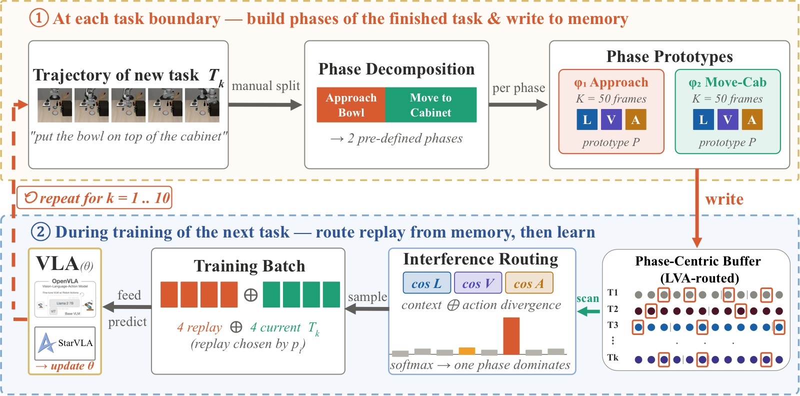
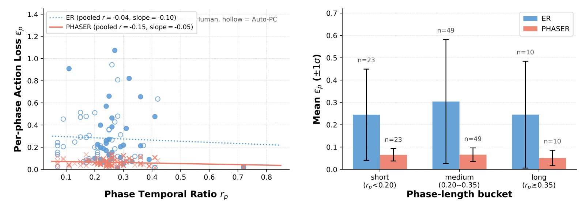
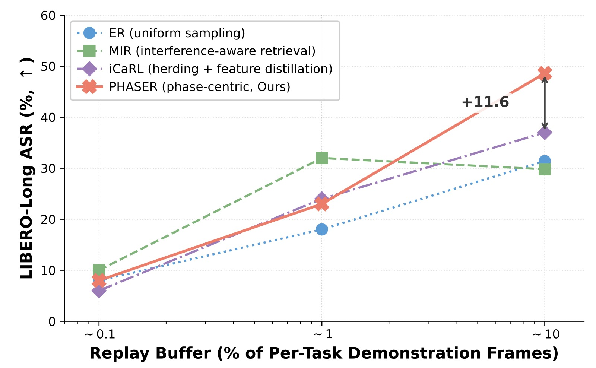
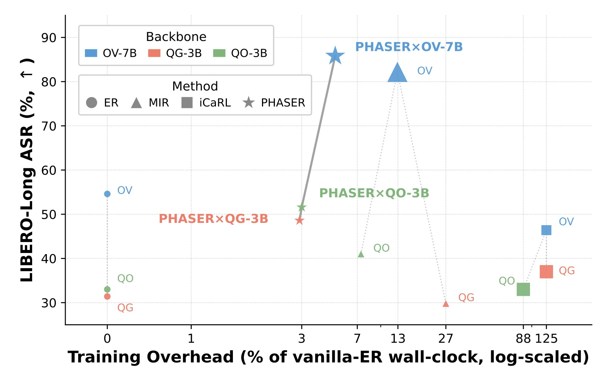
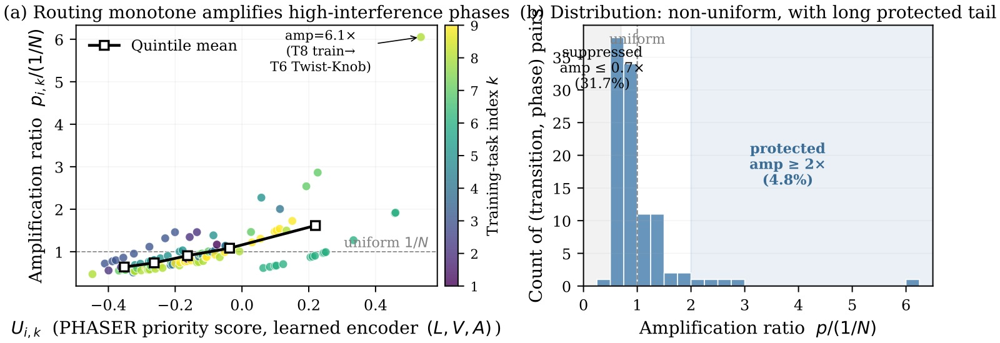
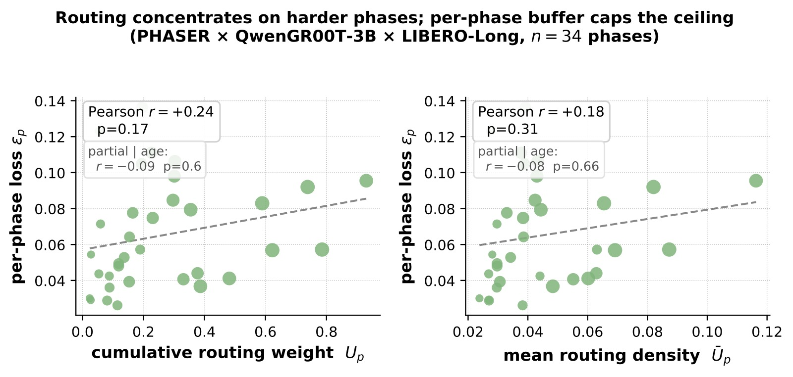

<!-- arxiv: 2606.03598 -->
<!-- venue: CoRL 2026 -->
<!-- tags: VLA, 机器人操作, 表征学习, 泛化 -->

# PHASER: Phase-Aware and Semantic Experience Replay for Vision-Language-Action Models

> **论文信息**
> - 作者：Ziyang Chen$^{\dagger}$, Shaoguang Wang$^{\dagger}$, Weiyu Guo$^{*}$, Qianyi Cai, He Zhang, Pengteng Li, Yiren Zhao, Yandong Guo
> - 通讯作者：Weiyu Guo (guoweyu96@gmail.com)
> - 单位：HKUST(Guangzhou) + AI$^2$ Robotics (Shenzhen)
> - 投稿方向：CoRL 2026（camera-ready 可能版本）
> - arXiv ID：2606.03598
> - 代码：未公开

---

## 一、核心问题

Vision-Language-Action (VLA) 模型在语言条件下的机器人操控任务中取得了显著成功。然而，在开放环境中持续学习新技能时，模型会遭受**灾难性遗忘 (catastrophic forgetting)**——学习新任务时覆盖了先前习得的动作表征。

经验回放 (Experience Replay, ER) 是防御遗忘的标准手段，但**均匀采样 (uniform sampling) 与操控轨迹的时序特性存在根本性错配**：

1. **任务内 (intra-task) 阶段饥饿 (Phase Starvation)**：操控任务自然地分解为不同时长的子阶段（如 *approach* / *grasp* / *transport*）。均匀帧采样按阶段时长比例分配回放预算，导致短暂但因果关键的阶段（如抓取、接触转移）被严重欠采样，端到端任务成功率被最弱子阶段所限制。

2. **任务间 (inter-task) 异质干扰**：标准 ER 对所有历史任务一视同仁、均分回放预算。但不同历史任务在学新技能时的遗忘程度高度异质——有些任务共享可复用的子技能，另一些共享感知上下文却需要截然不同的物理动作（高遗忘风险）。

> 本文核心洞察：操控 CL 的遗忘不是均匀退化，而是**阶段局部化 (phase-localized) 的不稳定性**——因为 rollout 成功是各子阶段成功概率的乘积，任何一个瓶颈阶段的瞬时失败就决定了整条轨迹的失败。

---

## 二、核心思路 / 方法

PHASER 将 VLA 持续学习重新建模为**半马尔可夫决策过程 (SMDP)**，将操控轨迹分解为 $P$ 个原子阶段 $\phi_p$。任务成功受限于最弱阶段：$S(\mathcal{T}) \le \min_p s(\phi_p)$。

PHASER 包含两个互补层面的回放分配策略：

### 2.1 阶段中心化容量分配 (Phase-Centric Capacity Allocation，任务内)

将内存的原子单元从**帧**下沉到**阶段**：每个阶段 $\phi_p$ 获得相等且固定的 $K$ 帧预算，与阶段的时序长度无关。通过时域降采样（步长 $\Delta=3$）去除连续近重复帧，然后在阶段边界内蓄水池采样至 $K$ 帧。

这一简单规则确保了**没有任何子技能因执行时间短而被"饿死"**。

### 2.2 多模态干扰路由 (Multi-Modal Interference Routing，任务间)

用三元组原型 $P_i = (e_i^L, e_i^V, e_i^A)$ 表示每个历史阶段——语言嵌入、平均视觉特征、归一化运动学签名。

**干扰优先级评分**（历史阶段 $\phi_i$ 与当前训练阶段 $\phi_k$ 之间）：

$$U_{i,k} = S_{i,k}^{ctx} \cdot \bigl(D_{i,k}^A - \gamma(1 - D_{i,k}^A)\bigr)$$

其中：
- $S_{i,k}^{ctx} = \alpha \cos(e_i^L, e_k^L) + (1-\alpha) \cos(e_i^V, e_k^V)$：感知上下文重叠度
- $D_{i,k}^A = \frac{1}{2}(1 - \cos(e_i^A, e_k^A))$：动作分歧度
- $\alpha=\gamma=0.5$

**直觉**：共享感知上下文（语言+视觉相似）但需要不同物理动作的历史阶段，遗忘风险最高——新任务的梯度在相似的 $(L,V)$ 输入上会覆盖旧的 action mapping。

**Boltzmann 采样**：回放权重按 $p_i \propto \exp(U_{i,k}/\tau)$，$\tau=0.25$。路由只在**任务切换时计算一次**，使用缓存的 prototypes；内部训练循环中的 per-step 回放开销与 vanilla ER 相同。

### 2.3 架构总览



*图1：PHASER pipeline 总览。在每次任务边界，轨迹按阶段标注划分，每个阶段写入固定大小的 bucket（任务内分配）。训练下一任务时，三模态 $(L,V,A)$ prototype 评分 $U_{i,k}$ 对历史阶段按干扰风险排序，Boltzmann 分布 $p_i \propto \exp(U_{i,k}/\tau)$ 驱动回放采样（任务间路由）。路由仅在任务切换时计算一次，per-step 回放成本与 vanilla ER 相同。*

### 2.4 Auto-PC：自动化阶段发现

为实现无需人工标注的全自主持续适配，PHASER 集成了 Auto-PC 流水线：

1. **Stage 1 — 信号驱动的候选提议**：在动作信号上做无监督变点检测：$b(t) = \alpha |\Delta a_t| + \beta |\Delta g_t| + \gamma(\|a_t\| < \tau_v)$，经 NMS + Top-M 选取最多 8 个候选边界。全 CPU、无监督。

2. **Stage 2 — VLM 语义验证**：将候选边界与任务的 1fps 视频发送给 GPT-4o（单次调用），验证/重定位/拒绝候选、可选插入遗漏边界、输出 snake_case 命名和最终 $[0,1]$ 比例区间。

Auto-PC 输出的 `stage_info` JSON 是人工标注的直接替代品。在 LIBERO-Long 上，Auto-PC 与人工标注 PHASER 表现相当（QwenGR00T-3B 上 48.0% vs 48.6%，OpenVLA-7B 上 89.6% vs 85.8%）；在 OpenVLA-7B / Goal 上 Auto-PC 下降 18pp（因为动作信号对阶段语义欠确定），但仍高于 ER 基线约 30pp。

---

## 三、训练目标

PHASER 本身不修改训练目标。它是在数据层面替换均匀 ER 的**即插即用 (drop-in)** 方案。底层训练使用标准 Behavioral Cloning (BC) loss，所有 backbone 使用 rank-32 LoRA，学习率 $5\times 10^{-4}$，cosine 衰减，per-task 训练 10,000 steps，global batch 4 当前 + 4 回放。

---

## 四、实验与结果

### 4.1 实验设置

- **Benchmark**：LIBERO-Goal（10 个单阶段任务，测试技能多样性和语义干扰）+ LIBERO-Long（10 个复合多阶段任务，测试结构化遗忘）
- **Backbones**（3 个）：
  - OpenVLA-OFT-7B：7B Llama-2 VLM + OFT 并行解码连续动作头 + FiLM
  - QwenGR00T-3B：Qwen2.5-VL-3B + GR00T DiT-B regression 头
  - QwenOFT-3B：Qwen2.5-VL-3B + DiT-B denoising diffusion 头（与 QG-3B 唯一区别是动作头，测试确定性 vs 随机策略的迁移性）
- **Baselines**：Sequential FT、ER、MIR、iCaRL
- **Metrics**：ASR$\uparrow$（最终 checkpoint 下 50 次 rollout × 10 任务 = 500 episodes）+ NBT$\downarrow$（Negative Backward Transfer）

**Per-task 回放预算**：OV-7B: $B=110$ (Goal) / $180$ (Long)；QG/QO-3B: $B=1000$（all suites）。PHASER 的总帧数匹配 ER 在 $\pm 10\%$ 以内。

### 4.2 主结果

**表 1：三个 backbone × 两个 LIBERO suite 的 ASR 和 NBT**

| Method | OV-Goal | OV-Long | QG-Goal | QG-Long | QO-Goal | QO-Long |
|--------|---------|---------|---------|---------|---------|---------|
| Sequential FT | 10.0 | 5.0 | 12.6 | 9.0 | 8.0 | 9.0 |
| ER | 77.6 | 54.6 | 51.6 | 31.4 | 39.4 | 33.0 |
| MIR | 81.6 | 82.2 | 76.2 | 29.8 | 73.6 | 41.0 |
| iCaRL | 50.2 | 46.4 | 70.0 | 37.0 | 65.0 | 33.0 |
| **PHASER** | **87.8** | **85.8** | **78.0** | **48.6** | **79.0** | **51.6** |

**关键发现**：

1. PHASER 在所有 6 个 (backbone, suite) 组合上取得**最高 ASR**，在 5/6 个组合上比 ER 提升超过 10pp，最高提升 **+31.2pp**（OV-Long）。

2. ER 在强预训练的 OpenVLA-7B 上远超 3B Qwen 变体（77.6% / 54.6% vs 51.6% / 31.4%），印证了预训练 VLA 在均匀 replay 下具有一定抗遗忘能力的观察。

3. PHASER 的提升在两个 3B 变体间保持一致（QG-Long 48.6%，QO-Long 51.6%），证明该方法对 deterministic/stoochastic 策略**架构无关**。

4. MIR 表现不稳定：在 OV-Long 上 82.2%（部分接近 PHASER），但在 QG-Long 上 29.8%（连 ER 都不如）。

5. iCaRL 的 feature-MSE 蒸馏在 VLA 场景中普遍不工作，尤其在 OpenVLA-7B 上远低于 ER（50.2% vs 77.6%）。

### 4.3 消融实验

**表 2：PHASER 组件消融（ASR%）**

| Method | OV-Goal | OV-Long | QG-Goal | QG-Long | QO-Goal | QO-Long |
|--------|---------|---------|---------|---------|---------|---------|
| ER + uniform | 77.6 | 54.6 | 51.6 | 31.4 | 39.4 | 33.0 |
| ER + routing | 84.8 | **23.4** | 71.0 | 50.0 | 77.0 | 50.0 |
| **PHASER** (phase + routing) | **87.8** | **85.8** | **78.0** | 48.6 | **79.0** | **51.6** |

**核心发现**：
- **路由需要容量地板才能稳定**：ER+routing 在 OV-Long 上崩溃至 23.4%（比 ER 的 54.6% 还低），原因是 Boltzmann 路由在严格内存限制下过度集中预算，过早驱逐了脆弱的短阶段。加上阶段容量地板后完全恢复了这一失败案例，达到 85.8%。
- 在其他 cell 上，ER+routing 已显著优于 ER（如 QG-Goal 71.0% vs 51.6%），PHASER 的 phase floor 进一步提升至 78.0%。

### 4.4 阶段饥饿的因果验证



*图2：ER 下的异方差遗忘。QG-3B × LIBERO-Long 最终 checkpoint 的逐阶段动作 loss $\epsilon_p$，合并 Human 和 Auto-PC 两种分解（4-seed 平均，每阶段 32 帧排除小样本伪影）。**左图**：$\epsilon_p$ 与阶段长度无斜率依赖——遗忘不由"长阶段遗忘多"驱动。**右图**：ER 在各长度桶中保持高均值和高方差（异方差），而 PHASER 的 loss 分布紧密聚集。因为 rollout 成功是各阶段概率的乘积，只要有一个阶段方差大就足以导致整条轨迹失败。*

**因果对照实验**：将初始阶段 ($\phi_0$) 的内存分配设为零，均匀重分配给其余阶段。结果：
- 整体 ASR 降至 **16.0%**（低于 ER 的 31.4% 和 PHASER 的 48.6%）
- 不受保护的 $\phi_0$ 立即回退到 ER 的重尾 loss 分布 ($\epsilon_{\phi_0} = 0.172 \pm 0.131$)
- 被充分缓冲的阶段保持紧密聚集 ($0.055 \pm 0.021$)

这精确地将**严格的逐阶段容量地板**确定为防止阶段局部化灾难遗忘的主要机制。

### 4.5 鲁棒性分析

**阶段边界来源**：Auto-PC 在 LIBERO-Long 所有三个 backbone 上匹配人工标注（$\Delta$ in [-2.6, +3.8] pp），说明 PHASER 的性能依赖于合理的阶段分解存在性，而非精确的人工边界。

**任务顺序**：PHASER 在 Reverse 和 Shuffled 排序下，与 ER 的性能差距保持或扩大（如 QG-Goal Shuffled: ER 35.8%, PHASER 81.2%, $\Delta = +45.4$pp）。这是因为 ER 的均匀 buffer 在不同任务顺序下保持静态，而 PHASER 的路由动态适应每次任务切换时的干扰风险。

### 4.6 容量扩展与效率



*图3(a)：容量扩展。在 QG-3B × LIBERO-Long 上对比不同 replay buffer 容量下的 ASR。PHASER 在各容量级别一致优于其他方法，且呈平滑单调增长；MIR 在中等预算时快速改善但在大容量时收益递减。*



*图4(b)：计算-内存效率前沿。横轴为相对于 ER 的训练墙钟时间开销（symlog），纵轴为 ASR，标记面积表示峰值 GPU 内存开销。PHASER 在取得显著 ASR 提升的同时仅引入少量额外开销（QG-3B: 仅 +2.5min/task, +0.62GB GPU 内存），位于 Pareto 前沿最优位置。iCaRL 的每步蒸馏带来 ~125% 的 per-step 时间代价；MIR 在 OV-7B 上的 virtual-step 执行带来 +22.4GB 和 +22min/task 的显著开销。*

详细开销数据：
- **PHASER / QG-3B**: per-transition +2.5min (2.9%), +0.62GB peak
- **PHASER / OV-7B**: per-transition +5min (~5%), +12GB peak（因 warmup-set + routing recompute 通过 LoRA 适配的 VLA 本身）
- **MIR / OV-7B** (full virtual-step): per-transition +22min (12.9%), +22.4GB
- **MIR / QG-3B** (snapshot-grad): per-transition +5h (27.0%!)
- **iCaRL / QG-3B**: per-step +1.0s (~125%), +3.5GB

### 4.7 路由机制内部解剖



*图5：路由机制内部解剖。左图展示多模态干扰评分 $U_{i,k}$ 与逐阶段遗忘率 $\epsilon_p$ 之间的正相关性，验证了 PHASER 的评分信号与真实遗忘风险的对齐。右图通过热力图展示一个具体任务对之间的 $(L,V,A)$ 三模态距离分解——哪些历史阶段因共享视觉/语言上下文但动作分歧大而获得高优先级分数。这直观说明了 $U_{i,k}$ 公式中 $S^{ctx} \times D^A$ 设计的合理性。*

### 4.8 路由+遗忘分析



*图6：逐阶段路由权重与遗忘率的关系。展示在连续任务序列中，不同历史阶段的 routing priority 与实际遗忘程度（$\epsilon_p$）的对应关系。PHASER 通过将更多回放预算分配给 $U_{i,k}$ 高分阶段，有效压制了高遗忘风险阶段的灾难性退化。*

---

## 五、关键洞察与技术亮点

1. **SMDP 视角重新框定 VLA CL**：将操控轨迹建模为 SMDP，揭示了均匀帧采样的根本缺陷——成功率受限于最弱子阶段（$S(\mathcal{T}) \le \min_p s(\phi_p)$），而非平均表现。

2. **phase starvation 是异方差问题而非均值问题**：逐阶段 loss 的分布不随阶段长度变化（无 slope），但 ER 的 loss 分布存在重尾和离散性（heteroscedasticity）。在 rollout 的乘法关系下，任何高方差阶段都会确定性地导致任务失败。

3. **容量地板先于路由**：消融实验揭示了两组件间的非线性依赖——仅路由而无容量地板在严格内存限制下会崩溃（OV-Long: 23.4%），而加上 floor 后完全恢复。容量地板保证基础运动学稳定性，路由在此基础上安全重分配剩余预算。

4. **零 per-step 前向开销**：PHASER 的路由只依赖缓存的 prototypes 和单次 softmax，不涉及任何 per-sample 梯度计算。对比 MIR 需要 virtual gradient step（+22GB/22min OV-7B, +5h QG-3B），PHASER 的 per-transition 开销几乎可以忽略。

5. **Auto-PC 的"先信号后 VLM"设计巧妙**：直接让 VLM 做视频分割会得到时域不精确的边界，但先由动作信号变点检测粗筛、再由 VLM 验证/细化/命名，既利用了动作信号的时域精度，又借助了 VLMs 的语义理解能力。每次任务仅需一次 GPT-4o 调用。

---

## 六、代码实现解读

论文未公开代码，但根据方法和附录中的实现细节，可梳理出 PHASER 的核心数据结构与算法流。

### 6.1 整体数据流

```
┌─────────────────────────────────────────────────────────────────────┐
│                        PHASER Pipeline                               │
├─────────────────────────────────────────────────────────────────────┤
│                                                                       │
│  ┌──────────┐    ┌──────────────┐    ┌──────────────────────────┐  │
│  │ 任务轨迹  │───▶│ Phase 划分   │───▶│ Phase-Centric Buffer     │  │
│  │ D_k      │    │ (Human/Auto) │    │ [φ₀: K帧] [φ₁: K帧] ...  │  │
│  └──────────┘    └──────────────┘    └──────────────────────────┘  │
│                                                                       │
│  任务切换时 (once per transition):                                    │
│  ┌──────────────┐    ┌───────────────┐    ┌─────────────────────┐  │
│  │ 提取 L,V,A   │───▶│ 计算 U_{i,k}  │───▶│ Boltzmann 采样分布  │  │
│  │ Prototypes   │    │ 干扰优先级    │    │ p_i ∝ exp(U/τ)      │  │
│  └──────────────┘    └───────────────┘    └─────────────────────┘  │
│                                                                       │
│  训练循环内 (per step, zero overhead):                                │
│  ┌─────────────────┐    ┌────────────────────────────────────────┐  │
│  │ 按 p_i 采样 phase │───▶│ 从该 phase bucket 中随机采样 K 帧      │  │
│  │ + 当前任务 batch  │    │ → forward + BC loss + backward        │  │
│  └─────────────────┘    └────────────────────────────────────────┘  │
│                                                                       │
└─────────────────────────────────────────────────────────────────────┘
```

### 6.2 核心组件伪代码

**Phase-Centric Buffer 构建** (任务切换时)：

```python
# 阶段中心化 buffer 构建
def build_phase_buffer(task_trajectories, stage_info, K):
    buffer = {}
    for phase_id, (start_ratio, end_ratio) in enumerate(stage_info):
        frames = []
        for traj in task_trajectories:
            T = len(traj)
            start_t = int(start_ratio * T)
            end_t = int(end_ratio * T)
            # 时域降采样 stride=3
            phase_frames = traj[start_t:end_t:3]
            frames.extend(phase_frames)
        # 蓄水池采样至容量 K
        buffer[phase_id] = reservoir_sample(frames, K)
    return buffer
```

**多模态干扰路由** (任务切换时，一次计算)：

```python
def compute_routing_distribution(historical_buffers, current_task, 
                                  encoders, alpha=0.5, gamma=0.5, tau=0.25):
    # 提取当前任务各阶段的 tri-modal prototypes
    cur_protos = {}
    for phase_id, frames in current_task.phases.items():
        e_L = encode_instruction(current_task.instruction)  # all-MiniLM-L6-v2
        e_V = mean_pool(extract_visual_features(frames))
        e_A = compute_kinematic_signature(frames)            # normalized
        cur_protos[phase_id] = (e_L, e_V, e_A)
    
    # 计算各历史阶段对当前任务的干扰优先级
    priorities = {}
    for (hist_task_id, hist_phase_id), hist_proto in historical_protos.items():
        max_U = -inf
        for cur_phase_id, cur_proto in cur_protos.items():
            e_L_h, e_V_h, e_A_h = hist_proto
            e_L_c, e_V_c, e_A_c = cur_proto
            
            S_ctx = alpha * cos_sim(e_L_h, e_L_c) + (1-alpha) * cos_sim(e_V_h, e_V_c)
            D_A = 0.5 * (1 - cos_sim(e_A_h, e_A_c))
            U = S_ctx * (D_A - gamma * (1 - D_A))
            max_U = max(max_U, U)
        priorities[(hist_task_id, hist_phase_id)] = max_U
    
    # Boltzmann → 采样分布
    U_vals = list(priorities.values())
    p = softmax(U_vals / tau)
    return dict(zip(priorities.keys(), p))
```

**Auto-PC Stage 1** (无监督动作变点检测)：

```python
def detect_phase_candidates(action_seq, gripper_seq, alpha=0.3, beta=1.0, gamma=0.4):
    T = len(action_seq)
    scores = []
    for t in range(1, T):
        delta_a = np.linalg.norm(action_seq[t] - action_seq[t-1])
        delta_g = abs(gripper_seq[t] - gripper_seq[t-1])
        low_vel = 1.0 if np.linalg.norm(action_seq[t]) < tau_v else 0.0
        b_t = alpha * delta_a + beta * delta_g + gamma * low_vel
        scores.append(b_t)
    
    # NMS with window=5
    candidates = non_max_suppression(scores, window=5)
    # Top-M (M=8)
    candidates = sorted(candidates, key=lambda x: x.score, reverse=True)[:8]
    return candidates
```

### 6.3 关键设计决策

1. **语义编码器**：使用 `sentence-transformers/all-MiniLM-L6-v2`（~80MB, 384 维），在 CPU 上运行，每对指令 <1ms。
2. **动作原型**：归一化的运动学签名（kinematic signature），抓住行为的物理执行特征。
3. **$\tau=0.25$** 的温度锐化：使 Boltzmann 分布集中在少数高风险阶段，避免预算过度分散。
4. **路由只在任务切换时计算**：prototypes 在任务训练完成后缓存，下次切换时仅做 O(历史阶段数) 的余弦相似度计算。
5. **与架构方法正交**：PHASER 是纯数据层面的方案，可与 dynamic LoRAs/adapter/演进技能库等方法组合使用。

---

## 七、局限性

1. **阶段内采样仍为随机均匀**：PHASER 的 intra-phase 采样使用均匀随机，尚未利用视频关键帧提取技术（如语义-逻辑依赖评分、段内冗余剪枝、query-modulated 多模态选择）。升级为结构化关键帧搜索是提升每个阶段 $K$ 帧信息密度的直接方向。

2. **Auto-PC 在动作信号模糊时失败**：OpenVLA-7B / Goal 上 Auto-PC 下降 18pp（单个任务 $\mathcal{T}_5$ 崩溃至 6%）。当纯动作信号无法充分确定阶段语义时，Auto-PC 不能完全替代专家标注。

3. **任务边界需已知**：当前框架假设任务边界已知（如顺序学习 LIBERO 的 10 个任务），不支持在线/流式任务边界检测。

---

## 八、关键概念速查

| 概念 | 解释 |
|------|------|
| **Phase Starvation** | 均匀 ER 按阶段时长比例分配回放帧，导致短暂但关键的阶段被严重欠采样 |
| **SMDP** | Semi-Markov Decision Process，操控轨迹中的时间抽象（options/sub-skills） |
| **Phase-Centric Allocation** | 每阶段等量 $K$ 帧的硬性容量地板，消除阶段饥饿 |
| **$(L,V,A)$ Prototype** | 语言/视觉/动作三模态原型 → 衡量任务间语义相似度与动作分歧 |
| **$U_{i,k}$** | 历史阶段 $\phi_i$ 与当前阶段 $\phi_k$ 的干扰优先级：$S^{ctx} \times (D^A - \gamma(1-D^A))$ |
| **Boltzmann Routing** | $p_i \propto \exp(U_{i,k}/\tau)$，$\tau=0.25$，锐化高风险阶段的回放预算 |
| **Auto-PC** | 无监督动作信号变点检测 + 单次 GPT-4o 验证的自动阶段发现管线 |
| **NBT** | Negative Backward Transfer，$R_{i,i} - R_{N,i}$ 均值（越低越好） |
| **Heteroscedastic Forgetting** | ER 下的遗忘异方差——某些阶段的 loss 方差极大而其他阶段很小 |
| **容量地板 > 路由** | 消融揭示：没有容量地板的纯路由会在严格内存限制下崩溃 |
