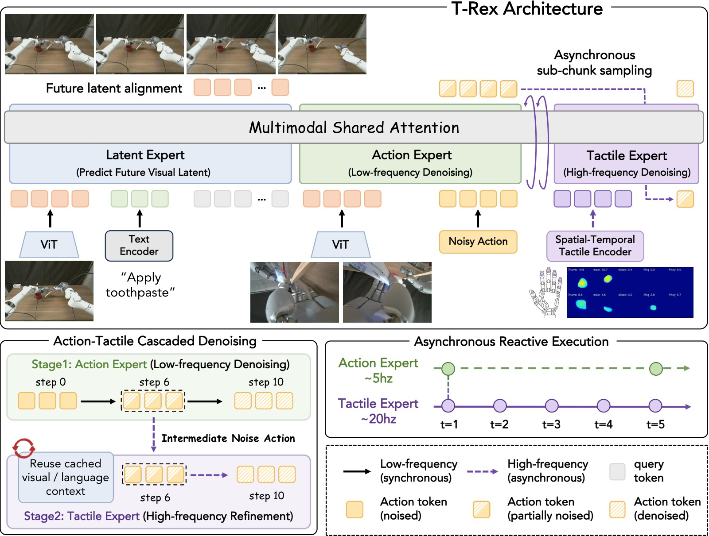
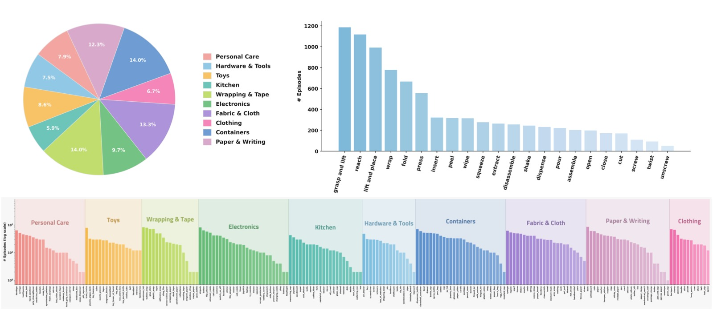
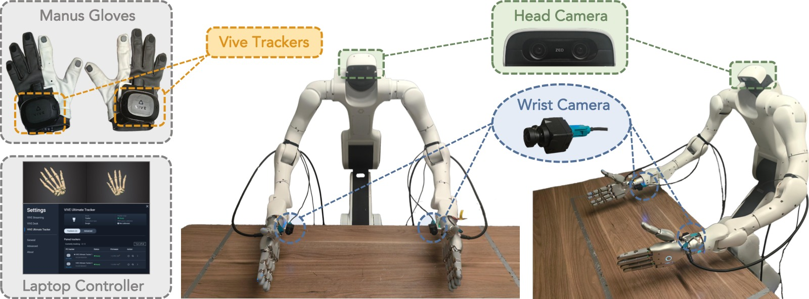
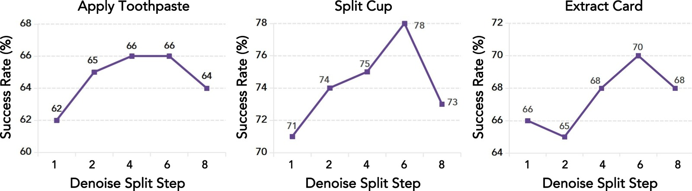
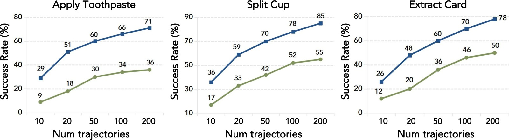
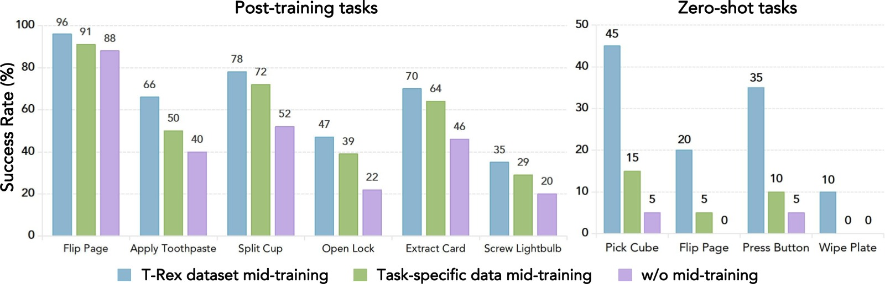

<!-- arxiv: 2606.17055 -->
<!-- venue: CoRL 2026 -->
<!-- tags: 触觉, 机器人操作, VLA, 通用策略 -->

%% mathjax-macros
\bx: \mathbf{x}
\bA: \mathbf{A}
\bc: \mathbf{c}
\tausplit: \tau_{\mathrm{split}}
%% end-mathjax-macros

# T-Rex: Tactile-Reactive Dexterous Manipulation

> **论文信息**
> - 作者：Dantong Niu\*, Zhuoyang Liu\*, Zekai Wang\*, Boning Shao, Zhao-Heng Yin, Anirudh Pai, Yuvan Sharma, Stefano Saravalle, Ruijie Zheng, Jing Wang, Ryan Punamiya, Mengda Xu, Yuqi Xie, Yunfan Jiang, Letian Fu, Konstantinos Kallidromitis, Matteo Gioia, Junyi Zhang, Jiaxin Ge, Haiwen Feng, Fabio Galasso, Wei Zhan, David M. Chan, Yutong Bai, Roei Herzig, Jiahui Lei, Fei-Fei Li, Ken Goldberg, Jitendra Malik, Pieter Abbeel, Yuke Zhu, Danfei Xu, Jim (Linxi) Fan, Trevor Darrell
> - 单位：UC Berkeley / NVIDIA / Stanford / Panasonic / La Sapienza University / ItalAI（\* Equal Contribution）
> - 投稿方向：CoRL 2026
> - arXiv ID：arXiv:2606.17055
> - 代码：未开源（计划发布 T-Rex Dataset，MIT License）
> - 主页：https://tactile-rex.github.io/

---

## 一、核心问题

> 人类灵巧操作依赖触觉感知——感受指尖的微小力变化并立即做出运动调整。然而，现有的机器人 VLA（Vision-Language-Action）模型几乎完全忽略触觉模态，无法处理需要**触觉反应式控制（tactile-reactive control）**的接触密集型操作任务。

**三大瓶颈：**

1. **数据稀缺**：现有大规模预训练数据集（如 EgoScale 的 22,889 小时人类视频）完全是视觉的，缺少同步的触觉信号（力变化、微滑移、局部形变等）。
2. **频率失配**：触觉反应要求高频控制（100-300Hz），而标准 VLM 骨干网运行在低频（10-30Hz），无法做实时闭环触觉调整。
3. **架构缺失**：现有 VLA 模型没有专门设计来处理高频触觉信号的机制，直接将触觉信号拼入输入甚至会降低性能（$\pi_{0.5}$ + tactile 的平均成功率从 17% 降到 6%）。

**本文回答的核心问题**：能否在保有大规模视觉预训练优势的前提下，通过一个专门的 mid-training 阶段和异步架构设计，让 VLA 模型获得高频触觉反应能力？

---

## 二、核心思路 / 方法

T-Rex 的核心设计哲学是**快慢分离**：低频的视觉-语言推理负责全局规划，高频的触觉精炼负责局部物理调整。这通过三个组件实现。

### 2.1 Mixture-of-Transformer-Experts (MoT) 架构



*图1：T-Rex 模型架构总览。整个模型基于 Mixture-of-Transformer-Experts (MoT) 骨干网，包含三个专家模块，共享 Self-Attention 空间但各自拥有独立的投影层（$W_Q, W_K, W_V, W_O$）、FFN 和预测头。*

**三个专家模块**：

- **Latent Expert（潜在专家，1.41B 参数）**：处理视觉和语言观测，预测未来视觉表征（auxiliary objective），为下游提供时序上下文。骨干为 Qwen3VL-2B。

- **Action Expert（动作专家，1.41B 参数）**：在低频（每个 action chunk 运行一次）执行流匹配去噪，从纯噪声 $\boldsymbol{\epsilon}$ 去噪到中间步 $\tau_{\mathrm{split}}$，生成一个语义级的基础动作计划。骨干同样是 Qwen3VL-2B。

- **Tactile Expert（触觉专家，0.62B 参数）**：在高频（每个 chunk 内触发 4 次，对应 $\{0, 4, 8, 12\}$ 步偏移）从 $\tau_{\mathrm{split}}$ 继续去噪到 $\tau=0$，利用实时触觉观测精炼动作。**关键**：触觉专家不重新运行视觉编码器，直接复用 Action Expert 在 $\tau_{\mathrm{split}}$ 处缓存的 KV Cache。

### 2.2 时空触觉编码 (Spatial-Temporal Tactile Encoding)

触觉信号被拆解为三个并行的编码通道：

$$\mathbf{z}^{\tau}_t = \bigl[ \mathrm{Emb}_{\mathrm{vq}}(E_f(\mathbf{f}_{t-15:t})); \mathrm{Proj}_f(\mathbf{f}_t); \mathrm{Proj}_d(E_d(\mathbf{d}_t)) \bigr]$$

1. **时序力 VQ-VAE**：对每根手指的 6D 力/力矩向量在滑动窗口 $t-15:t$ 内的序列，用 1D 时序卷积编码 → 向量量化到 codebook（$K=64$），压缩为离散 token。Codebook 用 EMA 更新，防止码本坍塌。所有手指共享卷积权重，但注入可学习的手指身份嵌入。

2. **瞬时力投影**：当前时刻 $t$ 的力向量直接线性投影，保留即时接触信息。

3. **空间形变编码**：来自 ResNet-18 前三个残差 stage 的卷积编码器（输入为单通道形变深度图），在自监督卷积自编码器上预训练后冻结，提取接触几何特征。

### 2.3 异步触觉反应式级联流匹配

**核心创新**：将流匹配去噪轨迹在 $\tau_{\mathrm{split}}$ 处拆分为上下两段，分别由 Action Expert 和 Tactile Expert 异步执行。

**Action Chunk 窗口**（$T_a=16$ 步）内的调度：

```
┌───────────────── Action Chunk Window (T_a=16) ─────────────────┐
│                                                                  │
│  Slow Stream (1次/chunk)                                        │
│  τ: 1.0 ───→ τ_split=0.4 (K_slow=6 Euler步)                    │
│  视觉编码器 → Latent Expert → Action Expert                     │
│  缓存 KV_split 和中间状态 x̂_τ_split                             │
│                                                                  │
│  Fast Streams (4次/chunk, 在偏移 {0,4,8,12} 触发)               │
│  τ: 0.4 ───→ 0.0 (K_fast=4 Euler步)                            │
│  只运行 Tactile Expert (0.62B)，复用 KV_split                   │
│  每次注入实时触觉观测 z_t^τ                                     │
│                                                                  │
└──────────────────────────────────────────────────────────────────┘
```

**训练目标**：
$$\mathcal{L}_{\mathrm{act}} = \| f_\theta^{\mathrm{act}}(\mathbf{x}_{\tau_{\mathrm{act}}}, \tau_{\mathrm{act}}; \mathbf{c}^{\mathrm{vl}}) - v^\star \|^2$$
$$\mathcal{L}_{\mathrm{tac}} = \| f_\theta^{\mathrm{tac}}(\mathbf{x}_{\tau_{\mathrm{tac}}}, \tau_{\mathrm{tac}}; \mathbf{c}^{\mathrm{tac}}, \mathrm{KV}_{\tau_{\mathrm{split}}}) - v^\star \|^2$$

其中共享目标 $v^\star = \boldsymbol{\epsilon} - \mathbf{A}^{\mathrm{demo}}$，$\tau_{\mathrm{act}} \sim \mathrm{Beta}(1.5, 1.0)$ on $(0, 1]$，$\tau_{\mathrm{tac}} = \tau_{\mathrm{split}} \cdot \tilde{\tau}$ where $\tilde{\tau} \sim \mathrm{Beta}(1.5, 1.0)$。

**总损失**：
$$\mathcal{L} = \mathcal{L}_{\mathrm{act}} + 1.0 \cdot \mathcal{L}_{\mathrm{tac}} + 0.5 \cdot \mathcal{L}_{\mathrm{future}}$$

**关键训练技巧**：
- Action Expert 在全域 $(0, 1]$ 上训练，确保其独立可用（不依赖 Tactile Expert）
- 训练时引入 **delay augmentation**：从 $\{0, 4, 8, 12\}$ 中随机采样视觉帧与触觉帧之间的偏移 $\delta$，匹配部署时的异步性
- KV Cache 在 $\tau_{\mathrm{split}}$ 处需要 re-encode（用部分去噪的动作位置替换初始噪声编码），确保 Tactile Expert 收到一致的动作上下文

### 2.4 三阶段训练范式

```
┌──────────────────────── Three-Stage Training Recipe ────────────────────────┐
│                                                                             │
│ Stage 1: Pretraining (22,889h egocentric human video)                      │
│  ├─ 基于 EgoScale，用人体动作数据预训练 Latent + Action Expert             │
│  ├─ 提供广泛的语义 grounding 和视觉运动先验                                │
│  └─ 不涉及触觉专家                                                         │
│                          ↓                                                  │
│ Stage 2: Mid-training (100h T-Rex Dataset, tactile-synchronized)           │
│  ├─ 在双手机器人的 teleoperation 数据上 mid-train                           │
│  ├─ 将 Action Expert 适配到多视角机器人观测 + 可执行动作空间               │
│  ├─ 训练 Tactile Expert 进行高频去噪精炼                                    │
│  ├─ 同时训练 Latent Expert 的 future visual prediction                     │
│  └─ 获得 zero-shot 接触丰富操作能力                                         │
│                          ↓                                                  │
│ Stage 3: Post-training (~100 demos per task)                                │
│  ├─ 在具体任务的少量 demonstrations 上 fine-tune                            │
│  └─ 保留 mid-training 获得的触觉反应行为                                    │
│                                                                             │
└─────────────────────────────────────────────────────────────────────────────┘
```

---

## 三、T-Rex 数据集



*图2：T-Rex 数据集统计分布。左上：物体类别分布；右上：运动基元分布；底部：个体物体的长尾分布。数据集涵盖 200+ 日常物体和 22 种运动基元，共 100 小时触觉同步数据。*

### 数据收集策略——用基元组合替代任务采集

与传统的"为每个任务录一批 demonstrations"不同，T-Rex 数据集采用**物体 × 运动基元（object-motor primitive）**的组合设计：

- **207 个日常物体** × **22 个运动基元** = 4,554 个候选组合
- 经过可行性筛选后保留 **502 种 unique 组合**
- 每种组合平均采集 ~16 条 demonstrations
- 总计 **7,755 条 episodes，100 小时**，中位 episode 长度 29.8 秒

**运动基元**涵盖：pick, place, push, pull, slide, press, wipe, twist, pour, squeeze, tap, rub, scoop, cut, peel, open, close, rotate, insert, extract, stack, flip 等 22 种。

**多样性与鲁棒性增强**：
- 6 种不同桌面背景
- 每次随机摆放 0-5 个干扰物体（从 210+ 非目标物体池中抽取）
- 随机化初始物体位置和旋转
- 语言指令由 VLM 自动生成（输入采样帧 + 物体名 + 基原名），人类验证过滤

**感知配置**（每个 episode 包含）：
- 3 路 RGB（1 头戴 ZED X Mini + 2 腕部 ZED X One S，$640 \times 360$，30Hz）
- 双手机器人本体感知（$2 \times 7$ 手臂关节 + $2 \times 22$-DoF Sharpa Wave 手指关节）
- $SE(3)$ 腕部末端执行器位姿
- 10 指指尖触觉（形变深度图 + 6 轴力/力矩），30Hz

---

## 四、实验与结果

### 4.1 实验平台



*图3：基于 Dexmate Vega-1 双臂机器人和 Sharpa Wave 灵巧手（22-DoF/手）的实验平台。两台 ZED X One S 广角相机安装在腕部，一台 ZED X Mini 安装在头部。遥操作使用 Manus 手部数据手套获取手指目标手势，VIVE 追踪器获取腕部目标位姿。*

- **机器人**：Dexmate Vega-1 固定底座，双臂各 7-DoF，Sharpa Wave 灵巧手各 22-DoF
- **控制**：手臂使用相对末端位姿 delta 控制，手指使用绝对关节位置控制
- **推理线程**：策略推理异步更新低层控制器（300Hz PID）的目标

### 4.2 12 项触觉反应式核心 Benchmark

实验定义了 **12 项接触密集型灵巧操作任务**，覆盖三类：

| 类别 | 任务 | 核心挑战 |
|------|------|---------|
| **Force Tasks** | Flip Page, Transfer Egg, Wipe Plate, Apply Toothpaste | 精确力控制，防止损坏物体 |
| **Deform Tasks** | Split Cup, Sort Mahjong, Open Lock, Refill Tablet | 依赖形变感知（杯缘分离、麻将图案触摸识别） |
| **Force-Deform Tasks** | Acid-Base Neutralization, Extract Card, Deal Poker, Screw Lightbulb | 力与形变双重依赖，多在长序列中 |

每任务 16 次 rollout（随机化物体位姿），使用**附加式评分标准**（additive rubric）：将任务拆分为子步骤，每步独立计分，最终取 0-1 的进度分数。

### 4.3 主实验结果

| Method | Flip Page | Transfer Egg | Wipe Plate | Apply Paste | Split Cup | Sort Mahjong | Open Lock | Refill Tablet | Acid-Base Neut. | Extract Card | Deal Poker | Screw Bulb | **Avg.** |
|--------|-----------|-------------|-----------|-------------|----------|--------------|----------|--------------|----------------|-------------|-----------|-----------|----------|
| ViTacFormer | 9 | 0 | 4 | 1 | 4 | 7 | 0 | 0 | 0 | 2 | 2 | 1 | 3 |
| RDP | 12 | 8 | 18 | 2 | 6 | 9 | 2 | 0 | 0 | 1 | 2 | 7 | 6 |
| Tactile-VLA | 38 | 14 | 24 | 0 | 21 | 27 | 8 | 0 | 9 | 4 | 11 | 18 | 15 |
| $\pi_{0.5}$ | 36 | 17 | 28 | 13 | 18 | 32 | 5 | 1 | 24 | 8 | 9 | 11 | 17 |
| $\pi_{0.5}$ + tactile | 8 | 9 | 27 | 2 | 4 | 14 | 2 | 0 | 7 | 3 | 0 | 0 | 6 |
| EgoScale | 68 | 44 | 34 | 38 | 33 | 36 | 19 | 12 | 43 | 41 | 28 | 18 | 35 |
| **T-Rex** | **96** | **75** | **69** | **66** | **78** | **65** | **47** | **41** | **76** | **70** | **57** | **35** | **65** |

> **T-Rex 平均成功率 65%**，超过最强 baseline（EgoScale 35%）**30 个百分点**。

两个关键发现：

1. **大规模预训练是灵巧操作的基础**。纯从头训练的 task-specific 方法（ViTacFormer 平均 3%、RDP 平均 6%）在所有任务上全面落后。最大的提升来自 EgoScale（大规模人类视频预训练 + 手部姿态监督），其 35% avg 远超仅用任务数据的 VLA（$\pi_{0.5}$ 17%、Tactile-VLA 15%）。

2. **触觉融合需要专门设计**。简单地将触觉信号拼入预训练 VLA（$\pi_{0.5}$ + tactile，平均 6%）反而不如纯视觉版（17%），说明不恰当的触觉整合会干扰已有的视觉运动先验。

### 4.4 消融实验

#### 4.4.1 触觉模态与编码

| Configuration | Flip Page | Apply Toothpaste | Split Cup | Open Lock | Extract Card | Screw Lightbulb | **Avg.** |
|---|---|---|---|---|---|---|---|
| **Full Model** | **96** | **66** | **78** | **47** | **70** | **35** | **65** |
| w/o Tactile | 76 | 39 | 58 | 23 | 34 | 20 | 42 (-23%) |
| MLP Force + Deform | 89 | 58 | 72 | 44 | 58 | 29 | 58 (-7%) |
| Deform Only | 82 | 57 | 71 | 36 | 55 | 25 | 54 (-11%) |
| MLP Force + VQ-VAE Force | 92 | 63 | 65 | 38 | 67 | 28 | 59 (-6%) |

- **去掉所有触觉输入**导致平均下降 23 个百分点（65%→42%），证明触觉在接触丰富任务中的关键作用。
- **用 MLP 替代 VQ-VAE 编码力序列**：下降 7 个百分点（65%→58%），说明学习到的离散 temporal codebook 比简单 MLP 更能捕捉力动态。
- **只用形变或只用力信息**：单独使用都导致明显下降，两种信号互补——力信号捕获时序接触强度，形变信号提供空间接触几何。

#### 4.4.2 异步级联设计

| Configuration | Avg. |
|---|---|
| Full (Async) | 65 |
| w/o Async (Sync tactile) | 60 (-5%) |

去除异步触觉精炼（改为同步条件下同时使用视觉和触觉）后下降 5 个百分点，验证了快慢解耦本身的收益。



*图4：$\tau_{\mathrm{split}}$ (denoted as $K_{\mathrm{slow}}$，即 slow stream 的 Euler 步数) 消融实验。测试了 $K_{\mathrm{slow}} \in \{2, 4, 6, 8\}$（对应 $\tau_{\mathrm{split}} \in \{0.8, 0.6, 0.4, 0.2\}$）四种配置（在 3 个代表性任务 Flip Page、Split Cup、Open Lock 上评估）。$K_{\mathrm{slow}}=6$（$\tau_{\mathrm{split}}=0.4$）在所有任务上最优。过小的 $\tau_{\mathrm{split}}$（如 0.2，$K_{\mathrm{slow}}=8$）导致 Action Expert 提供的去噪先验不足，性能下降明显；过大的 $\tau_{\mathrm{split}}$（如 0.8，$K_{\mathrm{slow}}=2$）留给 Tactile Expert 的触觉整合空间太少，接触敏感任务的性能也下降。*

#### 4.4.3 训练配方消融

| Pre-training | Mid-training | Flip Page | Apply Toothpaste | Split Cup | Open Lock | Extract Card | Screw Lightbulb | **Avg.** |
|:---:|:---:|---|---|---|---|---|---|---:|
| ✗ | ✗ | 46 | 16 | 20 | 6 | 14 | 5 | 18 |
| ✗ | ✓ | 75 | 34 | 45 | 10 | 32 | 9 | 34 |
| ✓ | ✗ | 88 | 40 | 52 | 22 | 46 | 20 | 45 |
| ✓ | ✓ | 96 | 66 | 78 | 47 | 70 | 35 | **65** |

- 纯 post-training（无预训练、无 mid-training）仅 18%；
- 单独加 mid-training → 34%（+16%），单独加预训练 → 45%（+27%）；
- 两者叠加达到 65%（+20% on top of 预训练 alone），**并非线性叠加**，说明预训练和 mid-training 存在协同效应。

#### 4.4.4 数据集效率



*图5：数据效率消融（在 6 个代表性任务上评估，横轴为 post-training demonstrations 数量 10-200）。蓝色曲线：经过 T-Rex Dataset mid-training 后的模型；绿色曲线：无 mid-training 直接 post-train。蓝色曲线在所有数据量上均显著优于绿色。在 10 demos 的低数据域，mid-training 带来的提升尤为显著（超过 20 个百分点差距），证明了 tactile-grounded mid-training 大幅减少了下游任务对 demonstrations 数量的需求。*



*图6：Mid-training 数据集质量对比（6 个 post-train 任务 + 4 个 zero-shot 任务）。对比两种 mid-training 数据：T-Rex Dataset（100h 物体×基元组合）和 task-specific dataset（100h 按 11 个任务采集的 demonstrations）。橙色柱为 T-Rex Dataset，在所有 post-train 任务和 zero-shot 任务上均优于 task-specific 数据集（包括 pick, slide, press, wipe 四种基元的 zero-shot 迁移），验证了基元组合式数据收集策略比任务导向的收集方式具有更好的泛化性。*

---

## 五、关键洞察与技术亮点

1. **"Mid-training 桥接"范式**：不需要在 pre-training 阶段收集触觉数据（这在人类视频上不现实），只需在 100 小时的机器人 mid-training 阶段引入触觉信号，就能将视觉运动先验转化到触觉反应式操作空间。这大大降低了触觉数据收集的规模需求。

2. **触觉的"坏整合"比"不整合"更差**：$\pi_{0.5}$ + tactile（简单拼接触觉信号）比纯视觉 $\pi_{0.5}$ 差 11 个百分点（6% vs 17%）。这说明触觉信号的维度和频率特性与视觉语言 token 不匹配时，直接拼接会破坏已有的表征空间。VQ-VAE 压缩 + 专门的 Tactile Expert + 异步级联设计才是正道。

3. **Force VQ-VAE 的 discretization 是关键**：用 codebook（$K=64$）将连续力序列量化为离散 token，不仅压缩了 16 帧的力信号为 1 个 token，还天然提供了对传感器漂移（drift）的鲁棒性——微小的力测量偏差只要不跨越 codebook 边界就不会改变 token。

4. **异步架构 = 计算效率 + 性能提升**：快流只运行 4 步 Euler 的轻量 Tactile Expert（0.62B），不需要重新跑视觉编码器。慢流 6 步 + 快流 4 步共 10 步，但慢流每个 chunk 只跑一次，实际每个控制步的计算量被 4 次快流均摊。

5. **数据集设计的"组合泛化"思想**：207 物体 × 22 基元 → 502 种 feasible 组合 → 100 小时。这种设计的内在逻辑是——触觉反应行为是跨物体、跨场景可迁移的（推一个杯子和推一个盒子的力控制逻辑相似），因此用基元组合采集比传统任务级采集更高效。

---

## 六、代码实现解读

虽然代码尚未开源，但从论文的附录算法和模型配置表可以还原核心架构：

### 6.1 推理流程（Algorithm 1 还原）

```
┌──────────────────────────────────────────────────────────────────────┐
│                   T-Rex 推理系统架构                                  │
│                                                                      │
│  ┌──────────────┐     ┌─────────────────┐     ┌──────────────────┐  │
│  │ Camera x3    │────▶│ Vision Encoder  │────▶│ Latent Expert    │  │
│  │ 640x360@30Hz │     │ (Qwen3VL-2B)    │     │ (1.41B)          │  │
│  └──────────────┘     └─────────────────┘     │ → future latents │  │
│                                               └────────┬─────────┘  │
│                                                        │            │
│                                     ┌──────────────────▼──────────┐  │
│  Shared Memory:                     │  Action Expert (1.41B)      │  │
│  ┌────────────────────┐             │  τ: 1.0 → 0.4               │  │
│  │ x̂_τ_split          │◄────────────│  K_slow=6 Euler steps       │  │
│  │ KV_τ_split Cache   │             │  → outputs x̂_τ_split        │  │
│  │ Execution Lock     │             └─────────────────────────────┘  │
│  └────────┬───────────┘                                             │
│           │                                                         │
│           │    ┌──────────────────┐     ┌────────────────────┐     │
│           └───▶│ Tactile Expert   │◄────│ Tactile Encoder     │     │
│                │ (0.62B, ×4/chunk)│     │ - VQ-VAE Force      │     │
│                │ τ: 0.4 → 0.0    │     │ - Force Proj         │     │
│                │ K_fast=4 steps  │     │ - Deform Conv        │     │
│                └────────┬─────────┘     └────────────────────┘     │
│                         │                                          │
│                         ▼                                          │
│                ┌──────────────────┐                                │
│                │ Final Action     │                                │
│                │ A_{t:t+16} (62D) │                                │
│                │ → Low-level PID  │                                │
│                └──────────────────┘                                │
└──────────────────────────────────────────────────────────────────────┘
```

**时序调度**：

```
Chunk Window (16 steps, ~0.53s):
  t=0:  [Slow] Vision+Latent+Action (6 Euler) → cache KV → [Fast#1] Tactile (4 Euler) → exec
  t=4:  [Fast#2] Tactile (4 Euler) → exec
  t=8:  [Fast#3] Tactile (4 Euler) → exec
  t=12: [Fast#4] Tactile (4 Euler) → exec
```

### 6.2 模型配置（从 Tab. in App. A 还原）

| 模块 | 配置项 | 值 |
|------|--------|-----|
| Latent Expert | 骨干 | Qwen3VL-2B |
| | 隐藏维度 | 2048 |
| | Transformer 层数 | 28 |
| | 最大序列长度 | 2048 |
| | 参数 | 1.41B |
| Action Expert | 骨干 | Qwen3VL-2B |
| | 动作维度 | 62 (双臂14 + 双手44) |
| | Action Chunk | 16 |
| | 推理 Euler 步数 | 6 |
| | 参数 | 1.41B |
| Tactile Expert | 动作维度 | 62 |
| | Action Chunk | 16 |
| | FFN 中间维度 | 1536 |
| | 推理 Euler 步数 | 4 |
| | 参数 | 0.62B |
| Training | 优化器 | AdamW |
| | Peak LR | $1 \times 10^{-4}$ |
| | GPU | 24×NVIDIA H100 |
| | DeepSpeed | ZeRO Stage 1 |
| | Batch Size | 16 per device × 24 |
| | 精度 | bf16 |

### 6.3 关键设计映射

- **公式 (1) 流匹配损失** → Action Expert 和 Tactile Expert 共享同一 `v_theta` 网络结构，但 Tactile Expert 的 FFN 维度减半（1536 vs full），并额外接受 `KV_cache` 和 `c_tac` 作为输入
- **公式 (2) 触觉编码** → 三路并行的 tokenizer（VQ-VAE + MLP + frozen CNN），拼接后送入 Tactile Expert 的 cross-attention
- **Algorithm 1 推理** → 使用单线程 request socket + 显式 execution lock 保证慢/快流的线程安全，快流 clone KV cache 而非重新计算
- **delay augmentation** → 训练时从 {0,4,8,12} 采样的 δ 对应部署时 chunck 内的 fast tick offsets

---

## 七、局限性

1. **长时序精密协调不足**：对于需要极端精确接触协调的长时序任务（如 Screw Lightbulb 仅 35%），teleoperation 难以提供足够精度的 demonstrations，未来可结合 RL 在线精炼。

2. **受限于触觉硬件**：传感器漂移（sensor drift）、设备间标定偏差（calibration drift）、缺少手掌面触觉感知（dense palm sensing）限制了全手操作能力。VQ-VAE 通过离散化部分缓解了漂移问题，但不是根本解决方案。

3. **纯 BC 范式**：基于 Behavior Cloning 的训练存在分布偏移（distribution shift），在精确定位任务（如 Transfer Egg 中放入指定凹槽）中暴露不足。

4. **多指协调不足**：Failure case 中展示了多指意外接触（如在 Sort Mahjong 任务中同时打开两个盒子），说明单指级别的协调仍是挑战。

---

## 八、关键概念速查

| 术语 | 含义 |
|------|------|
| **Tactile-Reactive Control** | 基于触觉信号的即时闭环运动调整，频率远高于视觉控制环路 |
| **Mixture-of-Transformer-Experts (MoT)** | 共享 Self-Attention 但各自拥有独立投影/FFN/预测头的 Transformer 架构 |
| **Cascaded Flow Matching** | 将流匹配去噪轨迹拆分为上下两段，分别由不同专家处理 |
| **$\tau_{\mathrm{split}}$ = 0.4** | 流匹配时间轴上的拆分点：action expert 处理 [1.0, 0.4]，tactile expert 处理 [0.4, 0.0] |
| **VQ-VAE Force Encoder** | 将 16 帧连续力序列量化为 $K=64$ codebook 中的离散 token |
| **Delay Augmentation** | 训练时随机偏移视觉/触觉帧的时戳，匹配部署时的异步性 |
| **Three-Stage Training Recipe** | Pretrain（人类视频）→ Mid-train（机器人触觉数据）→ Post-train（任务 demonstrations） |
| **EgoScale** | 大规模（22,889h）人类以自我为中心视频预训练方法，提供视觉运动先验 |
