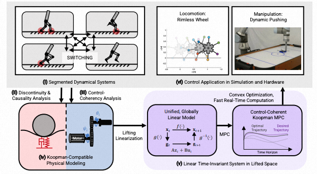
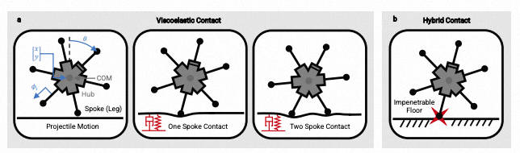
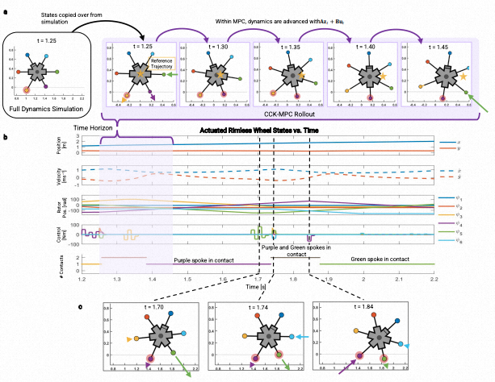
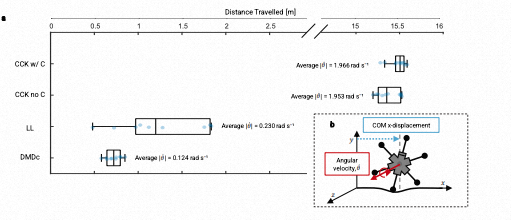
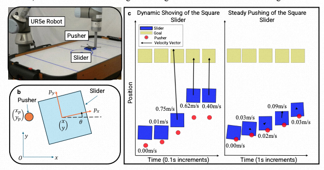
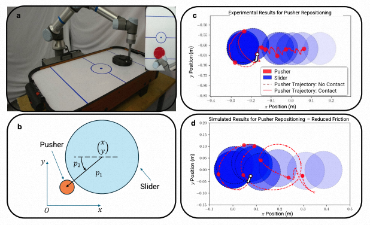
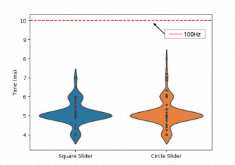
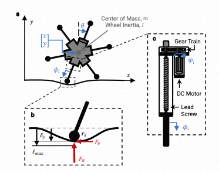

<!-- arxiv: N/A -->
<!-- venue: Tech Report 2026 -->
<!-- tags: 机器人操作, 世界模型, 表征学习 -->

# Koopman Global Linearization of Contact Dynamics for Robot Locomotion and Manipulation Enables Elaborate Control

> **论文信息**
> - 作者：C. O'Neill*, J. Terrones*, H. H. Asada（* 共同一作）
> - 通讯作者：C. O'Neill (croneill@mit.edu)
> - 机构：MIT Department of Mechanical Engineering
> - 投稿方向：Nature Communications / Science Robotics 级别
> - 代码：https://github.com/jterrone1/Koopman-for-Rimless-Wheel + https://github.com/Cormac0/Koopman-for-Dynamic-Planar-Manipulation
> - 数据：doi:10.5281/zenodo.17460547

---

## 一、核心问题

**机器人接触动力学的全局建模与控制**。机器人与环境发生接触（腿足着地、机械臂推物体）时，其动力学方程随着接触状态变化而**分段切换**（segmented dynamics）。这带来两个根本困难：

1. **预测难**：不同接触模式（如无接触、单点接触、双点接触）需要不同的动力学方程，跨越接触边界时传统局部线性化方法失效
2. **控制难**：基于模型的预测控制（MPC）在涉及接触时变为**混合整数或线性互补问题**，非凸优化，难以实时求解

现有方法的妥协——准静态模型、降维模型、局部线性化、预定义接触序列——都限制了控制器探索动态策略的能力。

> 本文的核心主张：**Koopman 算子可以将分段切换的非线性接触动力学子系统，统一到嵌入空间中的一个全局线性模型。** 在此基础上，MPC 变为凸优化问题，可在实时频率下求解，且能预测跨越接触边界的轨迹。

---

## 二、核心思路 / 方法

### 2.1 Koopman 算子理论直觉

Koopman 算子的核心思想：一个非线性自治系统 $\mathbf{x}_{t+1} = f(\mathbf{x}_t)$，虽然原状态空间的演化是非线性的，但在某个**无限维的 lifted 空间**中存在线性演化关系：

$$\mathbf{z}_{t+1} = \mathbf{A}\mathbf{z}_t$$

其中 $\mathbf{z}_t = [g_1(\mathbf{x}_t), g_2(\mathbf{x}_t), \ldots]^T$ 是一组可观测函数（observables）构成的 lifted state，$\mathbf{A}$ 是 Koopman 算子（线性）。

然而，直接应用 Koopman 理论到机器人接触控制面临**两个根本障碍**：

| 障碍 | 问题 | 本文解决方案 |
|------|------|-------------|
| 原始 Koopman 理论仅适用于自治系统（无控制输入） | 机器人控制是非自治系统 $\mathbf{x}_{t+1}=f(\mathbf{x}_t,\mathbf{u}_t)$ | **Control-Coherent Koopman (CCK)** 框架 |
| 刚性接触导致动量不连续 | 不连续违反 Koopman 算子存在性假设 | **粘弹性柔顺接触模型**（viscoelastic contact） |

### 2.2 Control-Coherent Koopman (CCK) 建模

CCK 框架的关键洞察：**如果执行器动力学具有特定的结构**，则可以在不做近似的情况下构造带恒定控制矩阵的 Koopman 模型。

考虑将一个非自治系统分解为执行器状态 $\mathbf{p}_t$ 和负载/本体状态 $\mathbf{q}_t$：

$$\mathbf{x}_t = \begin{bmatrix} \mathbf{p}_t \\ \mathbf{q}_t \end{bmatrix}$$

CCK 兼容系统必须满足两个**建模性质**：

1. **性质 1（控制输入线性出现）**：控制输入在执行器动力学中线性出现 $\mathbf{p}_{t+1} = f_p(\mathbf{p}_t, \mathbf{q}_t) + \mathbf{B}_p\mathbf{u}_t$
2. **性质 2（执行器状态独立）**：执行器状态变量与负载状态变量相互独立（无代数约束依赖）

对于满足上述性质的系统，可构造**线性时不变 (LTI) CCK 模型**：

$$\begin{bmatrix} \mathbf{p}_{t+1} \\ \mathbf{g}_{t+1} \end{bmatrix} = \begin{bmatrix} \mathbf{A}_{pp} & \mathbf{A}_{pg} \\ \mathbf{A}_{gp} & \mathbf{A}_{gg} \end{bmatrix} \begin{bmatrix} \mathbf{p}_t \\ \mathbf{g}_t \end{bmatrix} + \begin{bmatrix} \mathbf{B}_p \\ \mathbf{B}_g \end{bmatrix} \mathbf{u}_t$$

其中 $\mathbf{g}_t$ 是 embeddings（可观测函数），$\mathbf{B}_g = \mathbf{A}_{gp}\mathbf{A}_{pp}^{-1}\mathbf{B}_p$ 是通过**嵌入补偿（embeddings compensation）**推导出的常数矩阵。



*图1：CCK-MPC 方法总览。(i) 接触切换系统具有分段动力学方程。(ii) 分析切换动力学的因果性，导出 Koopman 理论可适用的因果物理模型。(iii) 分析控制输入在何种条件下可以纳入 Koopman 框架（Control-Coherency 分析）。(iv) 构造 Koopman 兼容物理模型。(v) 在 lifted space 中得到的线性时不变系统。(vi) 将 CCK-MPC 应用于两个案例：足式运动（Rimless Wheel）与机械臂操作（Dynamic Pushing）。*

### 2.3 接触柔顺性的关键作用

这是一个容易被忽视但至关重要的设计选择。传统混合动力学模型将地面碰撞建模为**瞬时冲量**，导致速度/动量不连续——这违反了 Koopman 算子存在的前提。本文的解决方案是：

- **使用粘弹性接触模型**（弹簧-阻尼）代替刚性约束
- 接触力由穿透深度和穿透速度决定：$F_N = -k_y \tan(\frac{\pi}{2l_{max}}\delta_y) - b_y|\delta_y|\dot{\delta_y}$
- 摩擦力由平滑化的库仑模型给出

这样做不仅消除了不连续性，还**解决了因果冲突（causal conflict）**：在刚性接触下，多个独立状态变量（如轮毂位置和轮辐长度）同时决定接触位置，产生因果矛盾。柔顺接触允许这些变量保持独立，满足 CCK 建模性质 2。

---

## 三、MPC 在 Lifted Space 中的凸优化

CCK 模型的最大优势在于使 MPC 变为**标准凸二次规划**：

$$\min_{\mathbf{u}_0,\ldots,\mathbf{u}_{N-1}} \sum_{t=0}^{N-1} \left( \tilde{\mathbf{z}}_t^T \mathbf{Q} \tilde{\mathbf{z}}_t + \mathbf{u}_t^T \mathbf{R} \mathbf{u}_t \right) + \tilde{\mathbf{z}}_N^T \mathbf{Q} \tilde{\mathbf{z}}_N$$

$$
\text{s.t.} \quad \mathbf{z}_0 = \mathbf{z}(\mathbf{x}_{\text{measured}}), \quad \mathbf{z}_{t+1} = \mathbf{A}\mathbf{z}_t + \mathbf{B}\mathbf{u}_t, \quad \tilde{\mathbf{z}}_t = \mathbf{z}_t - \mathbf{z}_{t,\text{ref}}
$$

特点：
- **无局部极小值**（凸优化）
- **无整数变量**（不需要显式编码接触模式）
- **可实时求解**（平均 5.2ms，对应约 190Hz）
- 即使 lifted 系统不可控，MPC/最优控制仍然有效（不需要 controllability）

---

## 四、应用一：Rimless Wheel（无轮缘轮）运动

### 4.1 系统建模



*图2：Rimless Wheel 的接触模式与广义坐标。(a) 三个接触模式——无接触（抛体运动）、单轮辐接触（开链）、双轮辐接触（闭链）。六根轮辐等距排列（$\pi/3$ 间隔），每根由独立电机驱动（通过丝杠改变轮辐长度 $\phi_i$）。广义坐标为 $\mathbf{x} = (x, y, \theta, \psi_1, \ldots, \psi_6)^T$，其中 $x,y$ 为轮毂位置，$\theta$ 为轮毂转角，$\psi_i$ 为第 $i$ 个电机转子角位移。(b) 展示了刚性接触模型的因果冲突——不可穿透的地面约束使独立状态变量同时决定轮辐位置，导致代数循环。粘弹性接触通过允许穿透来消除此冲突。*

Rimless Wheel 有 6 根轮辐，各由独立 DC 电机驱动。存在三种动力学方程：
- **无接触（抛体）**：轮毂仅受重力
- **单轮辐接触**：开链约束
- **双轮辐接触**：闭链约束

这三种方程在状态空间中分段定义。轮辐通过粘弹性地板模型与地面交互（法向力 + 摩擦力）。

### 4.2 Koopman 模型构造

1. 从三种接触模式的联合仿真数据中采样
2. 使用 RBF（径向基函数）作为 lifting functions
3. 通过最小二乘法学习 $\mathbf{A}$ 矩阵
4. $\mathbf{B}_p$ 从执行器动力学解析获得，$\mathbf{B}_g$ 从 $\mathbf{A}$ 推导

**关键点**：同一个 $\mathbf{A}$ 矩阵从包含三种接触模式的数据中训练得到，自动将所有分段动力学子系统统一到一个线性模型中。控制器不需要显式检测当前处于哪种接触模式。

### 4.3 CCK-MPC 控制结果



*图3：CCK-MPC 控制 Rimless Wheel 前向滚动。(a) CCK-MPC 在 0.2 秒时间窗口内的预测 rollout（从 t=1.25s 开始）。彩色轮辐上标注了控制命令（箭头长度表示力矩大小），红色圆圈标记与地面接触的轮辐，金色星号表示参考轨迹位置。MPC 在单次优化中预测了两次接触模式切换（单接触→双接触→单接触），与非线性全动力学仿真的实际结果吻合。(b) 完整的仿真状态-时间曲线：从上到下分别为轮毂位置 $[x, y]$、速度、转子位置、控制力矩，以及接触轮辐数量。紫色和绿色轮辐交替接触地面。(c) 三个关键时间快照展示了 CCK-MPC 发现的核心策略——在 t=1.70s 时，后侧绿色轮辐在接触前主动伸长以抵抗预期的地面反力；前侧浅蓝色轮辐提前缩回（t=1.74s 和 t=1.80s）。这种"伸长后方、缩回前方"的策略营造出斜坡效应，使轮子不断向前倾倒和滚动。*

### 4.4 与其他线性化方法的对比



*图4：四种线性化模型在 L-MPC 下的前向滚动对比。(a) 20 秒仿真中最大 x 位移的箱线图（10 次试验）。四种方法使用**完全相同的 MPC 公式**（相同的 Q、R、N），仅线性化方式不同：*

- **CCK w/ C（带嵌入补偿）**：平均位移 >15m，10/10 次成功滚动。平均角速度 $|\dot{\theta}| = 1.966$ rad/s
- **CCK no C（无嵌入补偿）**：平均位移 >15m，10/10 次成功滚动。平均角速度 $|\dot{\theta}| = 1.953$ rad/s，控制能耗比 CCK w/ C 高 5%
- **局部线性化 (LL)**：平均位移约 1.5m，平均角速度仅 $|\dot{\theta}| = 0.230$ rad/s。**无法预见接触模式边界外的动力学**，不能提前缩回前方轮辐，最终失去动量停下来
- **DMDc**：平均位移约 1.25m，平均角速度仅 $|\dot{\theta}| = 0.124$ rad/s。DMDc 将 $\mathbf{B}(\mathbf{x})$ 近似为常数矩阵导致严重误差，预测能力差

*(b) 定义了评价指标：COM x 位移和角速度。即使轮子卡在站立姿态（位移小），如果它在试图摇晃，角速度仍会较大。*

**核心结论**：只有 CCK 的全局线性模型能够跨越接触边界进行有效预测和规划。

---

## 五、应用二：Dynamic Pushing & Shoving（动态推与撞）

### 5.1 系统建模



*图5：方形滑块的平面推移实验。(a) UR5e 机器人硬件设置照片。(b) 平面推移系统示意图：滑块有 $x, y, \theta$ 三个自由度，推杆有 $x_p, y_p$ 两个独立坐标。当推杆未接触滑块时，两者坐标独立；接触发生后，通过柔顺接触模型（刚度 $k_c$）计算接触力。(c) 两组实验结果对比——左侧为"猛推"（shoving），推杆速度达 0.75m/s，滑块通过间歇接触快速到达目标；右侧为"稳态推移"（steady pushing），推杆以约 0.03m/s 的慢速维持持续接触，逐步推动滑块。两种行为来自**同一个 CCK-MPC 控制器**，仅通过改变 Q（状态误差权重）和 R（控制代价权重）的相对大小实现。惩罚 R 重→稳态推；惩罚 Q 重→猛推。*

### 5.2 方形滑块：两种操控模式的涌现

- **稳态推移**：$R \gg Q$ 使控制代价高 → 推杆慢速接触、持续推动
- **猛推 (Shoving)**：$Q \gg R$ 使状态误差代价高 → 推杆快速撞击滑块、间歇接触
- **关键**：控制器自主选择了接触策略——连续接触 vs 间歇接触——无需人为指定接触模式序列

### 5.3 圆形滑块：推杆自主重新定位



*图6：圆形滑块的平面推移实验。(a) 硬件实验照片。(b) 系统示意图，使用极坐标描述推杆相对于圆形滑块的位置 $(p_1, p_2)$。(c) 硬件实验：推杆初始位置在滑块的**错误一侧**（推杆在滑块右侧，目标也是向右）。CCK-MPC 自主发现：推杆必须先绕到滑块左侧才能有效推动。图中白色圆圈标记初始推杆位置，轨迹显示推杆绕过滑块一侧并成功将滑块推向目标。(d) 仿真实验——故意将真实摩擦力设为比 Koopman 模型训练时更低的值。由于摩擦力低于预期，滑块容易超调，推杆与滑块的接触变得短暂而间歇（"运球"式行为，dribbling）。即使存在建模误差，CCK-MPC 仍能恢复并合理跟踪目标位置。*

### 5.4 实时性验证



*图7：CCK-MPC 控制循环运行时间分布。在消费级笔记本（Intel i7-11800H）上用 Python 实现，使用 Gurobi 求解器，方形滑块 118 次迭代和圆形滑块 198 次迭代的平均运行时间均为 5.2ms（对应约 190Hz）。即使偶尔有较慢的迭代，控制器仍能保持 >100Hz 的实时运行频率。实际实验中保守地将控制频率设为 10Hz（与 Koopman 模型的离散时间步长 $\Delta t = 0.1s$ 对齐）。*

---

## 六、关键洞察与技术亮点

### 6.1 全局线性 vs 局部线性

| 特性 | 局部线性化 | CCK（全局线性） |
|------|-----------|----------------|
| 有效范围 | 参考点附近 | 整个状态空间 |
| 跨接触边界预测 | 无信息 | 包含相邻区域动力学 |
| MPC 优化类型 | 可能非凸 | 凸优化 |
| 策略发现能力 | 受限于当前接触模式 | 可探索多模式策略 |

### 6.2 因果冲突解决

刚性接触模型的问题可以用一个简单例子说明：推杆接触滑块时，推杆位置和滑块位置同时定义接触点——**哪一个是因，哪一个是果？** 引入柔顺接触后，推杆的穿透深度产生力，力再移动滑块——因果关系明确了。

### 6.3 接触柔顺性是设计参数

接触刚度不是越高越好，也不是越低越好：

- **太高**：预测精度下降（刚性方程数值问题），需要更小的时间步长 → MPC 时间视野缩短
- **太低**：控制带宽下降（执行器需要更大位移才能产生所需接触力），相位滞后

存在一个**最优刚度范围**，可视为设计参数。实际中可在轮辐尖端或推杆上使用粘弹性材料来调节接触阻抗。

### 6.4 无预定义接触序列

CCK-MPC 不需要离线规划器提供接触模式序列。控制器在优化中隐式地评估各接触序列，自主选择最优策略。这使控制器能够：
- 从不利初始条件恢复（如 Rimless Wheel 从静止双足着地启动）
- 应对意外扰动
- 发现新颖操控策略（如推杆重新定位）

---

## 七、代码实现解读



*图8：Rimless Wheel 的机械结构与执行器子系统。(a) 轮毂的惯性元素：中心质量 $m$、转动惯量 $I$。(b) 粘弹性接触模型的关键尺寸：最大轮辐长度 $\ell_{max}$、地面穿透深度 $\delta_y$、法向力 $F_N$ 和摩擦力 $F_F$。(c) 执行器组件：DC 电机 + 齿轮传动 + 丝杠机构，转子角位移 $\psi_i$ 与轮辐位移 $\phi_i$ 之间的运动学关系。*

### 7.1 Rimless Wheel 代码仓库

代码仓库：`https://github.com/jterrone1/Koopman-for-Rimless-Wheel`

主要步骤：

```
┌─────────────────────────────────────────────────────────────┐
│               CCK-MPC for Rimless Wheel                      │
├─────────────────────────────────────────────────────────────┤
│  1. 建模阶段                                                  │
│     ├── 定义拉格朗日动力学 (Eq. 21-27)                         │
│     ├── 三种接触模式的仿真数据生成                              │
│     ├── RBF lifting：ψ_i(x) = exp(-||x - c_i||²/σ²)          │
│     ├── B_p 从执行器动力学解析计算                              │
│     ├── A 矩阵通过最小二乘拟合 (Eq. 19)                        │
│     └── B_g = A_gp * A_pp^(-1) * B_p (Eq. 17)               │
│                                                               │
│  2. MPC 在线控制                                              │
│     ├── 测量当前状态 x_measured                               │
│     ├── 非线性 lifting：z_0 = g(x_measured)                   │
│     ├── 凸二次规划求解 (Gurobi / OSQP)                         │
│     │   min Σ(z̃ᵀQz̃ + uᵀRu)                                  │
│     │   s.t. z_{t+1} = Az_t + Bu_t                           │
│     ├── 取第一个控制量 u_0 执行                                │
│     └── 重复（MPC rolling horizon）                            │
└─────────────────────────────────────────────────────────────┘
```

### 7.2 Dynamic Pushing 代码仓库

代码仓库：`https://github.com/Cormac0/Koopman-for-Dynamic-Planar-Manipulation`

```
┌─────────────────────────────────────────────────────────────┐
│          CCK-MPC for Dynamic Planar Manipulation              │
├─────────────────────────────────────────────────────────────┤
│  1. 训练阶段 (Deep Koopman Network)                           │
│     ├── 从非线性动力学 (Eq. 28-30) 生成训练数据                │
│     ├── DKN 架构：编码器 → 线性层 → 解码器                      │
│     ├── Loss = α_obs·L_obs + α_state·L_state                 │
│     │   - L_obs: 观测值预测误差                                │
│     │   - L_state: 状态预测误差                                │
│     ├── 输入不含 x, y（速度不依赖于位置）                        │
│     └── 位置通过梯形积分从速度预测恢复                           │
│                                                               │
│  2. MPC 在线控制                                              │
│     ├── 状态 lifted 到高层表示（非线性，但在优化循环外完成）      │
│     ├── Q 矩阵只惩罚真实状态误差（observable 部分的权重设 0）   │
│     ├── 方形滑块：局部坐标系 + 穿透距离 Δx_s                   │
│     └── 圆形滑块：极坐标 (p_1, p_2)                            │
└─────────────────────────────────────────────────────────────┘
```

### 7.3 CCK 嵌入补偿推导流程

```
  自治系统 S_A 的 Koopman 演化:
  z̃_{t+1} = A z_t  (无控制输入)
       ↓
  执行器状态补偿:
  p_{t+1} = p̃_{t+1} + B_p u_t  (添加控制项)
       ↓
  嵌入补偿 (核心步骤):
  g_{t+1} ≈ g̃_{t+1} + (∂g̃/∂p̃) · Δp_{t+1}
          = g̃_{t+1} + G · B_p u_t
  其中 G = A_gp · A_pp^{-1} (从 A 矩阵分块推导)
       ↓
  CCK LTI 模型:
  z_{t+1} = A z_t + B u_t
  B = [B_p; A_gp A_pp^{-1} B_p]
```

---

## 八、实验结果汇总

### 8.1 Rimless Wheel 主要结果

| 指标 | CCK w/ C | CCK no C | LL | DMDc |
|------|----------|----------|----|----|
| 成功率 (10 次) | 10/10 | 10/10 | 0/10 | 0/10 |
| 平均位移 20s (m) | >15 | >15 | ~1.5 | ~1.25 |
| 平均角速度 (rad/s) | 1.966 | 1.953 | 0.230 | 0.124 |
| 相对控制能耗 | baseline | +5% | N/A | N/A |

### 8.2 Dynamic Pushing 主要结果

| 实验 | 控制器频率 | 平均运行时间 | 关键行为 |
|------|-----------|-------------|---------|
| 方形滑块 - 稳态推 | 10Hz | 5.2ms | 持续接触，慢速移动 |
| 方形滑块 - 猛推 | 10Hz | 5.2ms | 间歇接触，快速移动 |
| 圆形滑块 - 重定位 | 10Hz | 5.2ms | 自主绕行，正确侧推动 |
| 圆形滑块 - 摩擦力失配 | 10Hz | 5.2ms | 运球式行为，仍可跟踪 |

---

## 九、讨论与局限性

1. **无限维截断**：实际 Koopman 模型必须将无限维算子截断为有限维，导致预测误差在长时间视野中累积。DNN observables 的数量增加可提高预测精度，但增加计算负载。谱分析方法和物理建模提供的 insights 可能帮助更好地选择 observables。

2. **接触刚度范围**：CCK 模型的有效性依赖于适中的接触刚度。刚度太高（→ 刚性）导致预测精度下降；刚度太低（→ 过软）导致控制带宽不足。存在一个可接受范围，可通过数值实验确定。刚度可视为设计参数——轮辐尖端和推杆的材料可以优化。

3. **Bilinear Koopman 对比**：Bilinear Koopman MPC 在预测精度上表现更好，但求解时间超过 CCK-MPC 的 10 倍——非凸优化使其不适用于实时控制。

4. **不可控性**：Lifted 系统通常不可控（状态维度增加），但 MPC/最优控制不要求可控性，因此这不影响方法的有效性。

5. **仿真到现实的差距**：CCK-MPC 直接包含执行器动力学，生成的指令直接兼容执行器级控制，避免了忽略执行器动力学导致的 sim-to-real 迁移失败。

---

## 十、关键概念速查

| 概念 | 简要解释 |
|------|---------|
| **Koopman 算子** | 将非线性动力学映射到无限维空间中的线性算子 |
| **CCK (Control-Coherent Koopman)** | 将 Koopman 理论扩展到具有特定结构的非自治控制系统的方法 |
| **Lifting** | 使用 observables $g_i(\mathbf{x})$ 将状态从原空间映射到高维嵌入空间 |
| **Embeddings Compensation** | 从自治系统的嵌入演化推导非自治系统嵌入演化的校正项（$\mathbf{B}_g$） |
| **Causal Conflict** | 刚性接触中多个状态变量同时独立地决定同一物理量所产生的矛盾 |
| **Viscoelastic Contact** | 使用弹簧-阻尼模型替代刚性约束，使动力学连续并消除因果冲突 |
| **RBF (Radial Basis Function)** | 径向基函数，本文中用作 lifting observables |
| **DKN (Deep Koopman Network)** | 使用深度神经网络学习 Koopman observables 的方法 |
| **DMDc** | Dynamic Mode Decomposition with Control，一种数据驱动的线性化方法（本文用于对比） |

---

*该论文的核心贡献在于将 Koopman 算子理论从一个纯数学/数据分析工具转变为一个机器人接触动力学建模与控制的方法论框架。通过 CCK 建模和柔顺接触两个关键设计，使分段切换的非线性系统可以被一个统一的全局线性模型所包含，从而释放了凸 MPC 的全部能力。*
