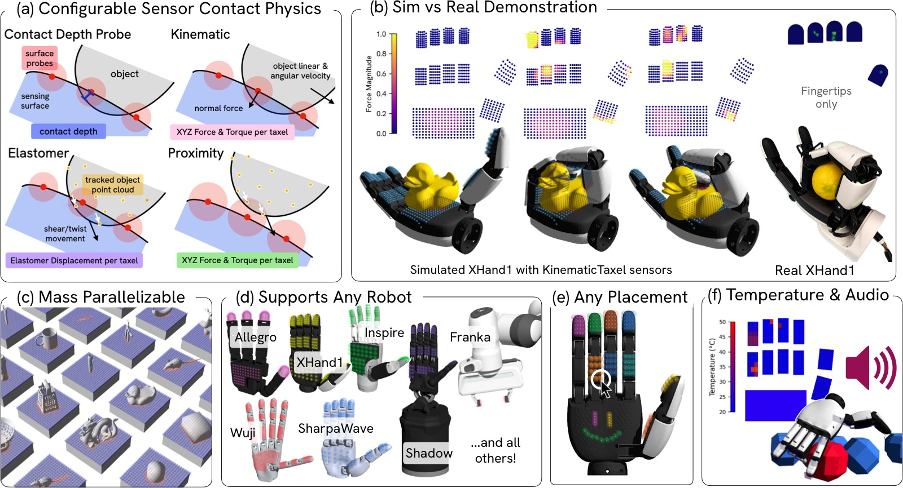
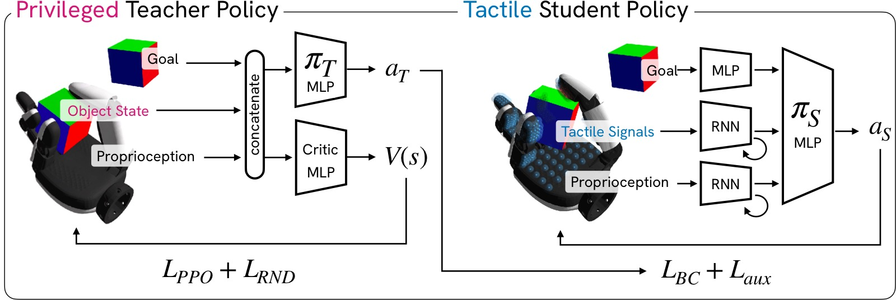
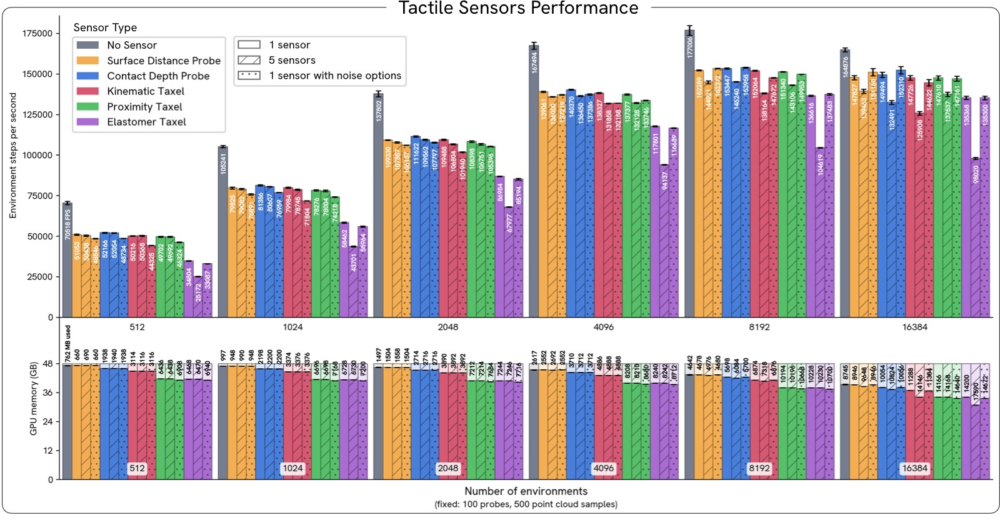
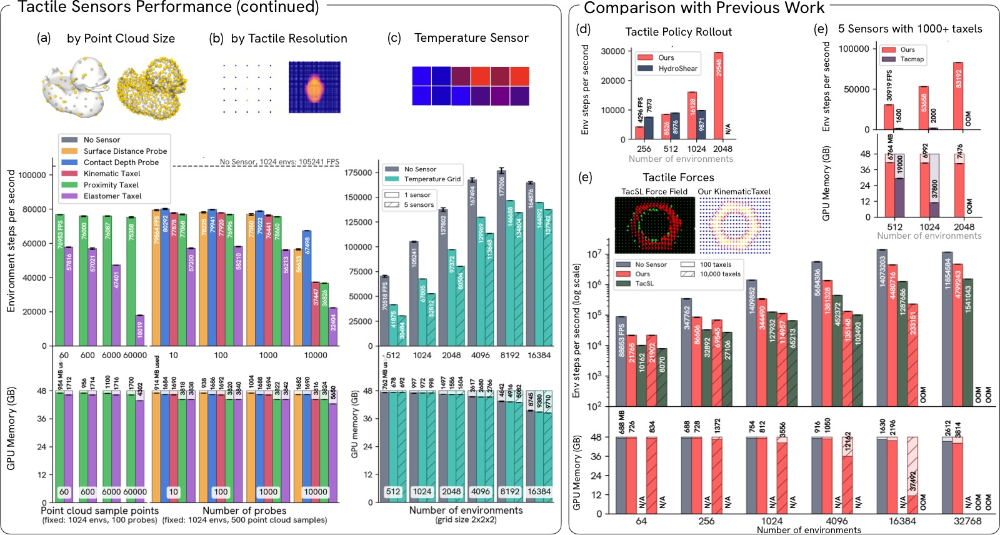
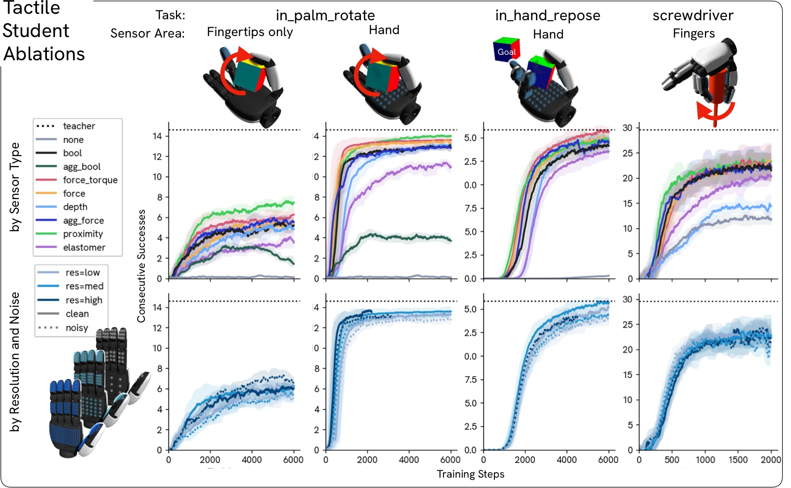
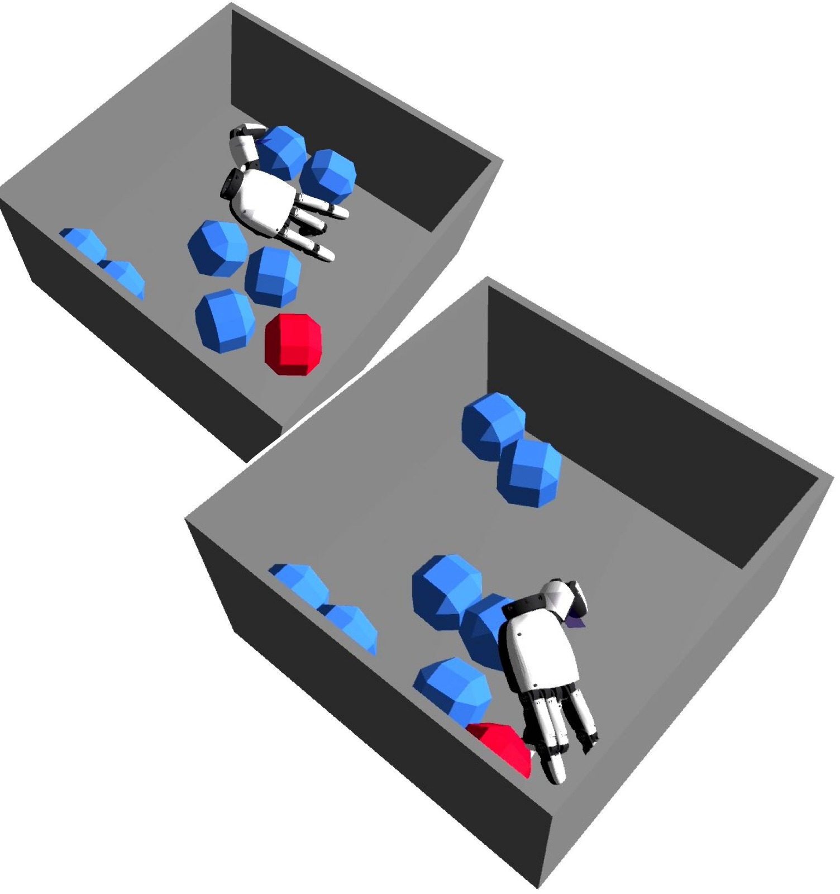
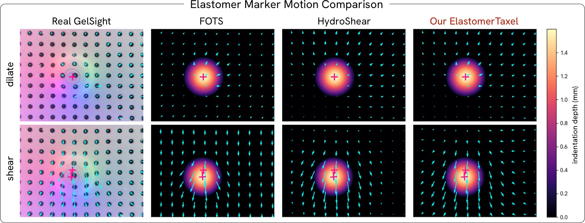

<!-- arxiv: 2606.22332 -->
<!-- venue: CoRL 2026 -->
<!-- tags: 触觉, 机器人操作, 知识蒸馏, 通用策略 -->

%% mathjax-macros
\R: \mathbb{R}
\indicator: \mathbb{I}
%% end-mathjax-macros

# Tactile Genesis: Exploring Tactile Sensors at Scale for Learning Dexterous Tasks

> **论文信息**
> - 作者：Trinity Chung$^{\dagger}$, Kashu Yamazaki, Dhruv Patel, Alexis Duburcq, Yiling Qiao, Katerina Fragkiadaki, Aran Nayebi
> - 通讯作者：Trinity Chung (trinityc@cmu.edu)
> - 机构：Carnegie Mellon University, Genesis AI
> - 投稿方向：CoRL 2026
> - arXiv ID：2606.22332
> - 代码：将开源（基于 Genesis World 仿真平台）
> - 项目页面：https://neuroagents-lab.github.io/tactile-genesis/

---

## 一、核心问题

**触觉传感对接触丰富的灵巧操作至关重要，但我们不知道策略到底需要什么样的触觉抽象，以及更丰富的触觉场是否值得其硬件成本。**

当前触觉硬件种类繁多——电容阵列、磁皮肤、视觉弹性体传感器、应变片、接触麦克风、多模态指尖——它们在空间分辨率、带宽、成本、耐用性、布线复杂度和标定负担上各不相同。问题在于：**每个传感器实际上定义了一个不同的机器人**，没有实验室能在所有传感器上重复相同的学习实验。

本文的核心设计问题是：

> 如果能够在仿真中大规模模拟多种触觉抽象，那么对于通用灵巧操作任务，哪种触觉表示是充分的？

---

## 二、核心思路 / 方法

### 2.1 Tactile Genesis 平台

Tactile Genesis 是一个 GPU 并行的触觉传感器仿真平台，集成于开源 Genesis World 物理仿真器。它在统一接口下暴露了 **7 种传感器抽象**（见表 1），覆盖了当前触觉硬件的设计空间：

| 传感器类型 | 数据描述 | 输出形状 |
|-----------|---------|---------|
| Surface Distance Probe | 到被追踪物体表面的最短距离 | $(N)$ |
| Contact Depth Probe | 从 SDF 或 raycasting 获取的原始接触深度 | $(N)$ |
| Contact Probe | 带迟滞的二值化接触信号 | $(N)$ |
| Kinematic Taxel | 每 taxel 的 6 轴力/力矩估计 | $(N, 6)$ |
| Proximity Taxel | 基于点云密度的邻近感知，输出力/力矩 | $(N, 6)$ |
| Elastomer Taxel | 弹性体标记点位移建模 | $(N, 3)$ |
| Temperature Grid | 体素化连杆上的温度场（首次引入机器人学习仿真） | $(N)$ |
| Contact Audio | 每步合成 $K$ 个振动样本 | $(N, K)$ |

所有传感器共享统一的位姿-半径几何体，可附着于任意机器人表面，支持可配置的摆放、分辨率和噪声模型（漂移、迟滞、死 taxel、串扰）。

### 2.2 三个关键实现选择

使 Tactile Genesis 能扩展到 20,000+ 并行环境和 1,000+ taxel 的三个技术决策：

1. **全批量向量化**：per-probe 的接触、深度和力核在 probe 维度和环境维度上同时向量化，单次 kernel 启动覆盖整个 batch，而非逐传感器迭代。

2. **BVH 加速**：网格和点云查询（SDF 查找、球-三角相交、邻近搜索）通过 Bounding Volume Hierarchy 加速，使成本相对于点数保持次线性。

3. **FFT 加速空间卷积**：对于弹性体传感器的膨胀核和空间串扰模型，利用规则平面 taxel 网格将密集卷积替换为带可分离核的 2D FFT。

*图1：Tactile Genesis 功能总览。*

**子图 (a) 传感器物理配置**：展示了传感器物理可以配置为匹配真实传感器对应物，包括 6 轴力/力矩测量（KinematicTaxel）、弹性体位移（ElastomerTaxel，模拟 GelSight 风格的标记点运动）和邻近信号（ProximityTaxel）。每种传感器都暴露干净和带噪声两种读数。

**子图 (b) 仿真 vs 真实对比**：XHand1 手上的仿真触觉力读数（per-taxel）与真实 XHand1 传感器的保真度进行视觉对比。仿真结果逼真地再现了真实传感器在接触区域的空间分布模式。

**子图 (c) 高度并行化**：传感器实现在 GPU 上高度并行化，支持异构物体（多种几何体类型）和随机化（域随机化参数），使其适用于大规模策略训练。

**子图 (d) 任意硬件表面**：仿真触觉传感器可应用于任意机器人硬件表面——图中展示了在 XHand1 手指、手掌和 Sharpa 手的不同区域放置传感器。

**子图 (e) 任意形状和分辨率**：传感器摆放可以是任意形状和分辨率，从稀疏的指尖覆盖到密集的全手覆盖，分辨率从 low（~90 探头）到 high（~667 探头）。

**子图 (f) 温度和音频传感器**：展示了两个新颖传感器——温度传感器模拟接触热传导、热扩散、热生成和辐射，是首次在机器人学习物理仿真平台中实现；接触音频传感器基于材料属性输出高频信号，捕捉刚体物理引擎无法单独捕获的振动信息。

### 2.3 教师-学生训练框架

对于每个 (任务, 手) 组合：

1. **训练特权教师**：使用 PPO + 完整物体状态 + RND (Random Network Distillation) 探索奖励训练教师策略。
2. **蒸馏触觉学生**：用 DAgger 行为克隆将教师蒸馏给学生，学生将特权状态替换为触觉观测（8 种触觉类型之一 + 本体感知）。
3. **辅助损失正则化**：学生额外训练辅助解码头，从策略隐表示预测特权物体状态（如物体大小、目标距离、旋转进度），仅训练时使用。

*图4：教师-学生训练框架。*

该图展示了从特权教师到触觉学生的完整蒸馏流程。教师（左）使用 PPO 训练，访问完整的特权状态组（物体位姿、速度、接触力等）和 RND 探索奖励。学生（右）仅接收本体感知（关节位置、速度、上一个动作）、触觉传感器组（8 种类型之一）和目标信息。学生的每个观测组通过独立的 MLP 编码器处理后拼接，送入共享的 MLP 策略头。训练时加入辅助损失解码物体状态，部署时丢弃。这一设计确保比较的公平性——策略架构和任务固定，仅改变触觉抽象类型。

### 2.4 八种触觉观测类型

将底层传感器抽象经过轻量后处理后得到 8 种策略观测类型：

| 类型 | 底层传感器 | 输出 |
|------|-----------|------|
| `none` | —— | 仅有本体感知（基线） |
| `bool` | ContactProbe | 每个 taxel 的二值化接触 |
| `agg_bool` | ContactProbe | 每个连杆的聚合接触位 |
| `depth` | ContactDepthProbe | 每个 taxel 的接触深度 |
| `agg_force` | ContactDepthProbe | 每个连杆的聚合接触力 |
| `force` | KinematicTaxel | 每个 taxel 的力 |
| `force_torque` | KinematicTaxel | 每个 taxel 的力和力矩 |
| `elastomer` | ElastomerTaxel | 每个 taxel 的 XYZ 标记点位移 |
| `proximity` | ProximityTaxel | 基于邻近感知的力和力矩 |

### 2.5 三个灵巧操作任务

覆盖互补的接触模式：

- **`in_palm_rotate`**：在手掌上重定向物体，拇指扫入捕获。物体初始可见，预接触定位很重要。
- **`in_hand_repose`**：将手中物体调整到目标位姿，与多指近乎持续接触。滑动和抓握力信号占主导。
- **`screwdriver`**：快速手指步态保持螺丝刀旋转。接触短暂且快速变化。

---

## 三、性能基准

*图2：各传感器类型性能基准（单 NVIDIA RTX A6000）。*

该图展示了不同传感器类型在并行环境数从 1,024 到 16,384 时的吞吐量（FPS，环境步/秒）和 GPU 内存使用。实验场景为 10 个立方体的金字塔，传感器分辨率固定为 10×10（100 taxel），点云采样 500 点。

**关键发现**：
- **总吞吐量达 150,000 FPS**：在 16,384 环境下，总体吞吐量超过 150,000 环境步/秒。
- **增加传感器开销小**：大多数传感器增加噪声参数仅造成 ~10% FPS 开销。弹性体传感器开销较大（-22% FPS），因为需要为每个传感器计算局部位移效应。
- **ContactDepthProbe 是最快的**：因为它只需要简单的 SDF 查询；弹性体传感器是最慢的，因为需要追踪剪切历史锚点。
- **GPU 内存增长平缓**：即使在 16,384 环境下，大多数传感器的 GPU 内存使用也在可控范围内。

*图3：性能基准续——扩展性测试及与先前工作对比。*

**子图 (a, b) Taxel 数和点云规模的扩展性**：固定 1,024 个环境，变化点云大小和 taxel 数量。传感器在高达 10,000+ taxel/手 时仍保持低 GPU 内存和高吞吐量。弹性体传感器随点云大小扩展性较差（需追踪每个接触物体点的运动），但灵巧操作任务通常不需要超过 ~6,000 个点的点云。

**子图 (c) 温度传感器扩展性**：温度传感器也随环境数良好扩展，5 个活跃传感器（每传感器 8 个体素）时达到无传感器基线 FPS 的 80%。

**子图 (d) 与 Tacmap 对比**：Tacmap 基于 SharpaWave（每指尖 >1,000 触觉像素）。Tactile Genesis 在 10,000 taxel、5 个 ContactDepthProbe 传感器下的 FPS 是 Tacmap 的 20 倍，每环境 GPU 内存仅为其 1/7。

**子图 (e) 与 HydroShear 对比**：HydroShear 报告单个 7×9（35 taxel）弹性体传感器在机械臂上的每步时间。Tactile Genesis 使用训练好的机器人手策略、5 个 5×4（100 taxel）弹性体传感器，在 1,024 环境下 FPS 是 HydroShear 的 1.6 倍。

**子图 (f) 与 TacSL 对比**：TacSL 报告其基于惩罚的力场的 FPS。Tactile Genesis 的 KinematicTaxel 传感器在 10×10 和 100×100 taxel 配置下均达到约 3 倍吞吐量（注意 FPS 轴为对数尺度），且可在 16K 环境下运行而不会耗尽内存。

---

## 四、实验与结果

### 4.1 触觉学生消融实验

*图5：触觉学生消融实验——主实验结果。*

这是论文最核心的实验图表，包含三个任务的完整消融矩阵。

**子图 (a) `in_palm_rotate` — 传感器类型 × 摆放位置**：
- **仅有本体感知（none）完全不够**：在三个任务上，none 基线均远落后于任何触觉学生，即使是最简单的二值化接触（bool）。
- **摆放位置压倒传感器类型**：仅指尖（tips，当前大多数商用硬件支持的配置）远落后于全手覆盖（hand），差距巨大。将 palm 和中指近端指节加入后，大部分差距被弥合。
- `force_torque` 和 `proximity` 表现最好。`proximity` 的优势在于其感知半径能预接触感知接近中的物体，让拇指提前预塑形而非盲目搜索。
- `elastomer` 在需要 per-taxel 局部力信息的任务中表现不如 `force_torque`，因为弹性体标记点位移受邻域膨胀和剪切混合影响。

**子图 (b) `in_hand_repose` — 传感器类型对比**：
- 物体处于近乎持续接触状态，主要失败模式是初始滑动。
- `force_torque` 明显最优，且与二值化和深度变体拉开差距——因为力矩通道能检测转动滑动。
- 全手覆盖下所有触觉类型均接近教师水平。

**子图 (c) `screwdriver` — 传感器类型对比**：
- 接触短暂且快速变化（手指步态），所有触觉信号表现相似。
- 没有一种触觉类型达到教师水平，暗示该任务可能还需要视觉反馈或时间积分信息。

**子图 (d) 分辨率和噪声影响**：
- **分辨率远不如覆盖重要**：将 200 个 taxel 放在全手上就足够了，进一步增加分辨率收益递减。
- 噪声对性能影响很小（干净 vs 噪声条件下差距仅几个百分点），说明策略对传感器噪声具有鲁棒性。

> **核心发现 1：传感器摆放 >> 传感器类型。** 在指尖覆盖上，全手覆盖远远领先。在 margin 上，增加 palm 和近端指节的 taxel 比升级指尖传感器更有用。

> **核心发现 2：per-taxel force/torque 是鲁棒的默认选择。** 在所有任务上聚合，`force_torque` 匹配或优于所有其他类型。当硬件允许时，这是推荐的默认触觉表示。

> **核心发现 3：弹性体位移在需要 per-taxel 局部性时表现不佳。** 弹性体标记点位移受邻域膨胀和剪切混合影响，适合推断物体形状补丁，但不适合读取局部力向量。

### 4.2 Sim-to-Real 验证

在真实 XHand1 上部署 `in_palm_rotate` 策略（XHand1 仅有指尖聚合力的触觉传感）。部署策略实现了 1-2 次连续旋转——这与仿真中指尖 `agg_bool` 学生的成功率精确匹配。这确认了：
- Tactile Genesis 训练的触觉策略可迁移到真实硬件
- 仿真指尖抽象是真实传感器的足够忠实代理

### 4.3 温度物体判别实验

*图6：温度物体判别实验——在不同材料热属性下的策略成功率。*

任务设置：手在 8 个几何形状相同的球中寻找发热的目标球（45°C vs 环境 22°C），仅依赖本体感知和温度传感器。图中表格展示了不同热导率和发射率组合下的结果，✅ 表示手能成功保持与热球的接触。

**关键发现**：
- **需要高灵敏度**：只有铝合金级别的高导热率（150 W/m·K）配合高热生成率（5,000 W/m²）才能成功。钢（10 W/m·K）、玻璃（1 W/m·K）级别在当前硬件灵敏度下均不足以完成任务。
- **发射率影响较小**：钢（发射率 0.5）和橡胶（发射率 0.85）之间的差异未改变结果，主要瓶颈是导热率。
- **当前真实硬件的灵敏度不够**：这意味着如果要学习温度引导的操作任务，需要比现有机器人手温度传感器更高灵敏度的硬件。人体皮肤在静止时的散热约为 60 W/m²，运动时为 100-600 W/m²，而小型致动器重载时可达 1,000-5,000 W/m²。

### 4.4 弹性体标记点位移对标

*图9：弹性体标记点运动对比——与真实 GelSight 及先前仿真器对标。*

该图对比了真实 GelSight、FOTS、HydroShear 和 Tactile Genesis 在膨胀（法向压入）和剪切（切向拖拽）运动下的标记点位移场。右侧表格报告了各仿真器优化参数匹配真实图像后的相对标记点位移误差（RMSE）。

**关键发现**：
- Tactile Genesis 的 ElastomerTaxel 在两个运动模式下均达到**最低相对 RMSE**：膨胀 0.329（vs FOTS 0.514, HydroShear 0.403），剪切 0.174（vs FOTS 0.210, HydroShear 0.217）。
- 改进来自两个扩展：**弹性体可压缩性项**（compressibility parameter $c$）和**夹紧边界条件**（clamped boundary condition），前者在局部高斯响应和不可压缩全局拉伸之间插值，后者强制标记点在传感器边缘处位移为零。
- 真实 GelSight 图像来自 FOTS 论文代码库，在仿真中复制相同设置，使用 ContactDepthProbe 传感器测量深度。

---

## 五、关键洞察与技术亮点

1. **触觉仿真规模突破**：首个能在单 GPU 上扩展到 20,000+ 并行环境和 10,000+ taxel 的触觉仿真平台，比先前工作快 3-20 倍，内存节省 ~5 倍。

2. **首次实现温度传感器**：在机器人学习物理仿真平台中首次引入体素化温度传感器，支持热传导、扩散、辐射和对流的完整建模，开辟温度引导操作这一新研究方向的仿真基础。

3. **摆放 >> 类型**：这是对触觉硬件设计具有直接指导意义的发现——覆盖 palm 和近端指节比升级指尖传感器更重要，挑战了当前商用触觉指尖在远端指垫集中空间分辨率并止步于此的事实标准。

4. **分辨率需求低得惊人**：将 200 个 taxel 分布在全手上就足够了。这意味着触觉信息的粗粒度空间分布（而非精细的底物力学）是这些任务中有用触觉信息的主要来源——这对刚体触觉仿真是个好消息，因为底物物理恰好是建模成本最高的部分。

5. **接触音频管道**：提出了基于模态合成的程序化接触音频管道，使策略能通过声音推断物体材质——即使不同物体对刚体求解器是动力学上相同的。接触和致动音频管线可以混合成单一空气传播信号。

---

## 六、局限性

- **学生受限于教师质量**：蒸馏方法意味着学生继承了教师的策略空间，无法发现纯触觉策略可能涌现的行为（如探测运动来定位物体）。
- **未包含视觉基线**：螺丝刀任务的结果暗示某些任务可能无法仅靠触觉解决——但缺少与视觉或视触觉策略的公平对比。
- **仿真传感器未经真实传感器标定**：传感器参数是手工配置到合理范围的，未对特定真实传感器进行精确拟合。
- **任务和手势覆盖有限**：仅在 3 个任务和 2 种手上进行了消融，更广泛的任务和手势仍然有待探索。

---

## 七、关键概念速查

| 概念 | 说明 |
|------|------|
| **Taxel** | 触觉像素 (tactile pixel)，单个触觉传感单元 |
| **SDF (Signed Distance Function)** | 有符号距离函数，用于快速计算穿透深度 |
| **BVH (Bounding Volume Hierarchy)** | 包围体层次结构，加速空间查询 |
| **DAgger** | 数据集聚合，一种模仿学习算法，交替收集专家示范和训练策略 |
| **RND (Random Network Distillation)** | 随机网络蒸馏，一种基于预测误差的内在探索奖励方法 |
| **PPO** | Proximal Policy Optimization，教师策略的强化学习算法 |
| **Schmitt Hysteresis** | 施密特迟滞，用于抑制接触边界附近的震颤 |
| **Kinematic Taxel** | 从深度、接触法向和相对速度计算的 per-taxel 六通道力/力矩估计，无需建模变形基底 |
| **Elastomer Taxel** | 将接触深度转换为模拟弹性体表面标记点位移的传感器模型 |
| **Proximity Taxel** | 测量感知距离内物体表面质量的传感器，模拟电容式和磁皮肤行为 |
| **Heat Latch** | 温度实验中的"热度锁定"机制，一旦手指感知到足够高的温度即触发，标记手已热识别热球 |
| **Modal Synthesis** | 模态合成，通过一组阻尼谐振器模拟物体受击打后的振动声音 |
