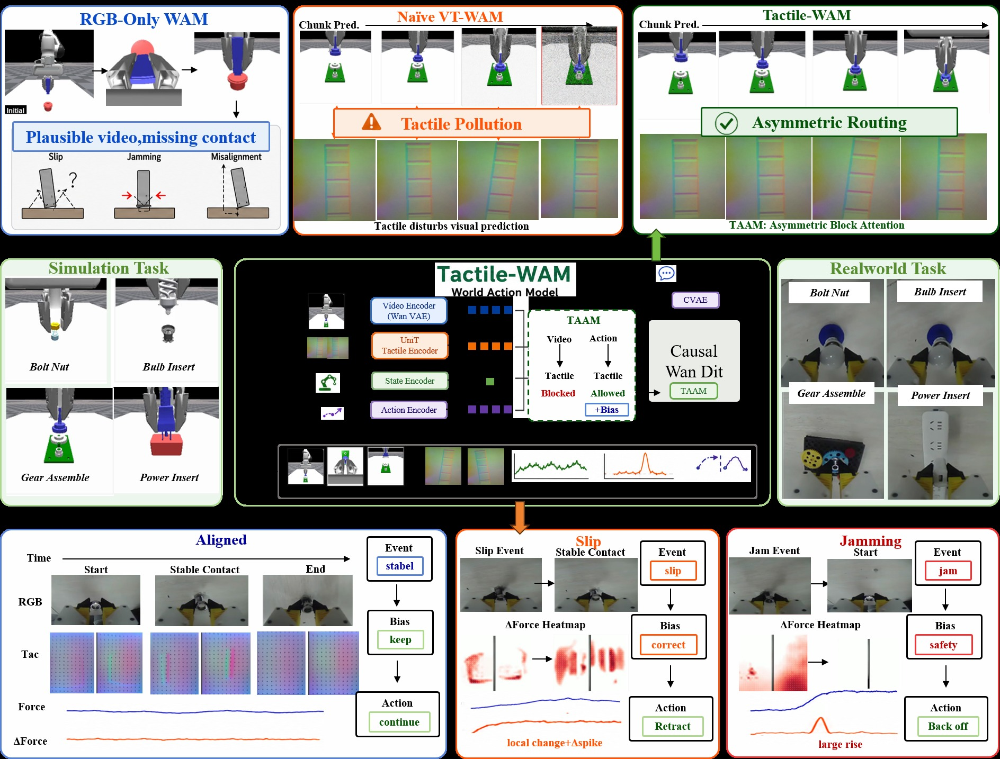
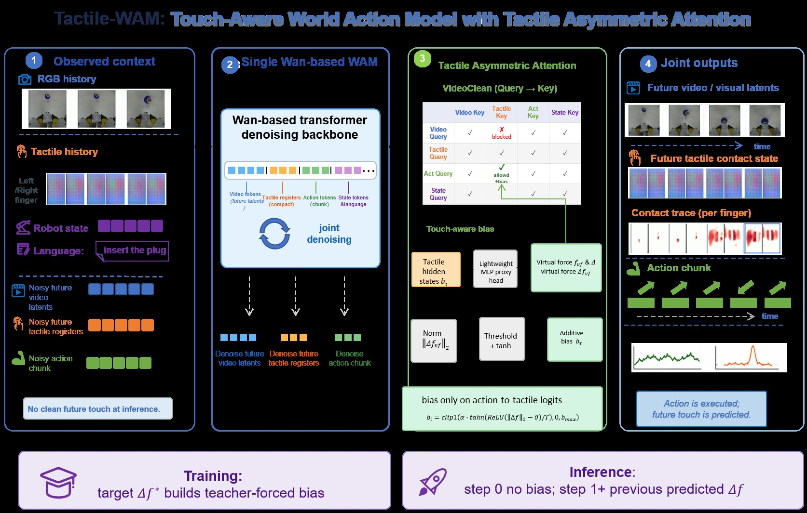
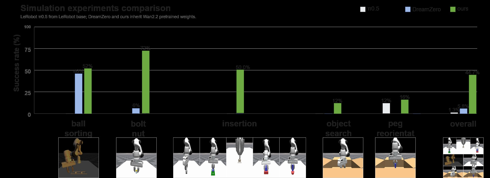
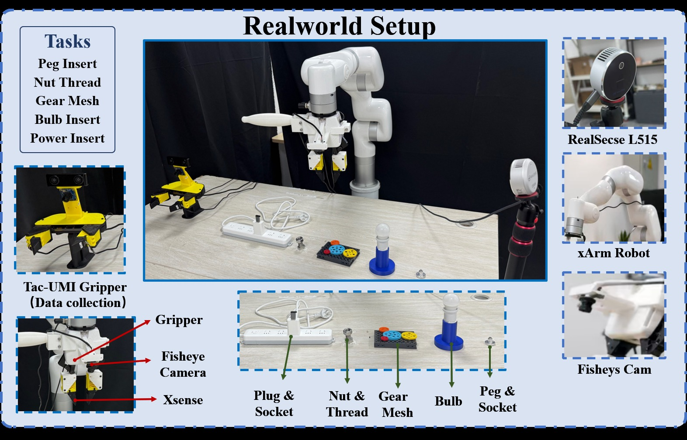

<!-- arxiv: 2606.26663 -->
<!-- venue: arXiv 2026（投稿中） -->
<!-- tags: WAM, 触觉, 世界模型, 机器人操作, 扩散模型 -->

# Tactile-WAM: Touch-Aware World Action Modeling with Tactile Asymmetric Attention

> **论文信息**
> - 作者：Siyu Wu\*<sup>1,2</sup>, Linjing You\*<sup>1,3,4</sup>, Junjie Zhu<sup>†1</sup>, Yaozu Liu<sup>5</sup>, Changhao Zhang<sup>1</sup>, Jian Liu<sup>1</sup>, Weiqiang Wang<sup>1</sup>, Qi Li<sup>5</sup>, Jituo Li<sup>2</sup>, Hengshuang Zhao<sup>3,4</sup>
> - 通讯作者：Junjie Zhu (yuxue.zjj@antgroup.com)
> - 机构：Ant Group / Zhejiang University / The University of Hong Kong / Shenzhen Loop Area Institute / CAS Institute of Automation
> - 投稿方向：arXiv 2026（投稿中）
> - arXiv ID：2606.26663
>
> 本文基于以下本地材料整理：
>
> - 论文 TeX 源码：`arXiv-2606.26663v1/`（主文件：`paper_template.tex`）
> - 论文插图：`arXiv-2606.26663v1/figures/fig1_arxiv.png`（teaser）、`fig2.png`（方法总览）、`fig3_arxiv.png`（实验结果）、`fig_real_setup.png`（真机设置），以及 `sim_figs/`、`real_figs/`、`clean_figs/` 子目录中的过程可视化
> - 本文图片导出目录：`assets/tactile-wam/`

---

## 一、核心问题

**RGB-only 的 World Action Models（WAMs）预测的未来"看起来合理，但物理上不完整"。**

现代 WAM（如 DreamZero）从预训练视频生成模型继承视觉动力学先验，能生成逼真的未来帧。但在插入、装配、搜索、重定向等接触密集任务中，决定成败的物理变量——**滑移（slip）、卡阻（jamming）、接触法向量、毫米级对齐误差**——在 RGB 中几乎不可见。

直观方案是把触觉 token 加入 WAM 的联合去噪序列。但作者发现了一个关键问题：

> **Tactile Pollution（触觉污染）**：触觉信号稀疏、局部、事件驱动，与视觉信号的统计特性完全不同。允许触觉 token 无条件参与所有 attention 路径，会强制视觉动力学模型吸收对未来视频预测弱相关的信号。实验证明：naively 加入触觉后，成功率从 5.8% **暴跌到 1.3%**——比纯视觉还差。


*图1：Tactile-WAM 核心概念图（Teaser）。**上半部分（RGB-only WAM）**：RGB-only WAM 能生成视觉上合理的未来帧（如夹爪靠近物体的轨迹），但接触状态在 RGB 中不可见——滑移方向、卡阻位置、局部对齐误差、接触法向量等信息是"隐形的"，导致动作缺乏物理层面的可执行性。**下半部分（Tactile-WAM）**：在 RGB 预测的基础上，增加对未来触觉接触状态的预测和选择性路由。TAAM（Tactile Asymmetric Attention Mechanism）通过两个互补组件处理触觉信息：(1) VideoClean Mask 阻止触觉 token 干扰视觉预测路径，(2) Touch-Aware Bias 在接触状态发生变化的时刻增强 action 对触觉的注意力。图片左侧展示了触觉传感器的局部变形模式（接触→滑移→卡阻），右侧展示了 WAM 的三种预测输出——未来视觉帧、未来接触状态、未来动作。*

---

## 二、核心思路 / 方法

### 2.1 问题形式化

标准视觉 WAM 预测未来视觉 latent 和 action chunk：

$$p_\theta\left(z^v_{t+1:t+T}, a_{t:t+H-1} \mid o^v_{\leq t}, s_{\leq t}, l\right)$$

Tactile-WAM 在此基础上增加**未来触觉接触状态 latent 的联合去噪**：

$$p_\theta\left(z^v_{t+1:t+T}, z^\tau_{t+1:t+K}, a_{t:t+H-1} \mid o^v_{\leq t}, o^\tau_{\leq t}, s_{\leq t}, l\right)$$

### 2.2 总体架构


*图2：方法总览。该图展示了 Tactile-WAM 的完整数据流和 TAAM 的两种注意力路由机制。**左侧输入**：RGB 观测历史、左右视触觉传感器图像、语言指令和本体感知状态分别经过各自的编码器处理。**中间 (a) TAAM 的两种注意力模式**：上图展示 VideoClean Mask——视觉 token 作为 query 时被屏蔽对触觉 key/value 的访问（红色叉号），而 action token 作为 query 时可以正常访问触觉信息（绿色箭头），这保护了预训练的视觉动力学路径。下图展示 Touch-Aware Bias——当预测的触觉变化信号（touch-change proxy）超过阈值时，action 对触觉 token 的注意力被增强（绿色粗箭头），使模型在接触状态发生变化的时刻更关注触觉信息。**右侧输出**：WAM 联合去噪输出三种预测——(b) 未来视觉 latents、(c) 未来触觉接触状态、(d) 未来动作 chunk。整个系统在单一的 Wan/WAM 兼容 denoising backbone 上运行，触觉寄存器与 action horizon 时间对齐。*

触觉寄存器的 token 结构为 $L_\tau = ASQ$，其中 $A$ 是 anchor 数量、$S=2$ 是传感器数量（左右各一）、$Q$ 是每个传感器-锚点对被压缩到的 token 数。

### 2.3 TAAM：触觉非对称注意力机制

TAAM 包含两个互补的 attention 层面组件：

#### (1) VideoClean Mask —— 决定触觉"不该去哪"

$$M^{\mathrm{vc}}_{q,k} = \begin{cases} -\infty, & G(q)=V,\ G(k)=\tau \\ 0, & \text{otherwise} \end{cases}$$

| Token 交互方向 | VideoClean |
|---------------|-----------|
| Visual Q → Visual K/V | ✅ 正常 |
| Visual Q → Tactile K/V | ❌ 屏蔽（$-\infty$） |
| Action Q → Tactile K/V | ✅ 正常 |
| Tactile Q → Tactile K/V | ✅ 正常 |

> **直觉**：触觉是"局部的、事件驱动的"，对预测大范围视觉外观几乎无帮助。强制视觉路径吸收触觉信号就像让画家根据手指触摸的纹理画远处风景——不仅无益，还有害。

#### (2) Touch-Aware Bias —— 决定触觉"何时该引导 action"

最有价值的触觉信号不是"接触存在"，而是**"接触状态正在变化"**——首次接触、滑移开始、压力变化、卡阻。为此设计了两个运动导出的触觉代理：

- **Touch-State Proxy $c^\tau$**：局部接触负载大小
- **Touch-Change Proxy $\Delta c^\tau = c_i^\tau - c_{i-1}^\tau$**：接触状态的阶跃式变化

Touch-aware bias **仅作用于 action-query → tactile-key 的 attention logit**：

$$B_{q,k} = \bar B_{q,k} + \mathbb{I}[G(q)=A,\ G(k)=\tau] \cdot b^\tau_{a(k)}$$

$$b^\tau_i = \mathrm{clip}(\alpha \cdot s_i, 0, b_{\max}), \quad s_i = \mathrm{clip}_{[0,1]}\left[\tanh\left(\frac{\mathrm{ReLU}(d_i-\theta)}{T_c}\right)\right]$$

> **训练 vs 推理**：训练时用 teacher forcing（ground-truth touch-change proxy）；推理时第一步无 bias，后续步骤用上一步预测的 proxy。

---

## 三、训练目标

触觉 token 和 action chunk 都通过流匹配式插值加入噪声：

$$\tilde z^\tau_\lambda = (1-\lambda)z^\tau_0 + \lambda\epsilon^\tau, \quad \tilde a_\lambda = (1-\lambda)a_0 + \lambda\epsilon^a$$

总损失由五部分组成：

$$\mathcal{L} = \mathcal{L}_{\mathrm{video}} + \lambda_a\mathcal{L}_{\mathrm{action}} + \lambda_\tau\mathcal{L}_{\mathrm{tactile}} + \lambda_s\mathcal{L}_{\mathrm{state}} + \lambda_c\mathcal{L}_{\mathrm{change}}$$

| 损失项 | 目标 | 损失函数 |
|--------|------|----------|
| $\mathcal{L}_{\mathrm{video}}$ | 去噪后的未来视觉 latent | MSE |
| $\mathcal{L}_{\mathrm{action}}$ | 去噪后的 action chunk | MSE |
| $\mathcal{L}_{\mathrm{tactile}}$ | 去噪后的未来触觉状态 | MSE |
| $\mathcal{L}_{\mathrm{state}}$ | Touch-state proxy 回归 | SmoothL1 |
| $\mathcal{L}_{\mathrm{change}}$ | Touch-change proxy 回归 | SmoothL1 |

---

## 四、实验与结果

### 4.1 实验设置

| 维度 | 设置 |
|------|------|
| 仿真基准 | ManiFeel，9 个任务，每任务 50 次 rollout |
| 真机基准 | 5 个接触密集任务，每任务 20 次 trial，xArm + Tac-UMI 夹爪 |
| Baseline | LeRobot $\pi_{0.5}$（通用 action policy）、DreamZero（RGB-only WAM） |
| 接触密集子集 | bolt-nut assembly、gear insertion、power insertion、USB insertion |

### 4.2 仿真与真机结果


*图3：(a) ManiFeel 仿真 9 任务结果。柱状图按任务分组，每组三根柱子分别对应 LeRobot π₀.₅（灰色）、DreamZero（蓝色）、Tactile-WAM（橙色）。纵轴为成功率（0–100%），横轴列出 9 个任务名称。最右侧两组为"Overall"（所有 9 任务平均）和"Contact-Centric Subset"（bolt-nut、gear、power、USB 四个接触密集任务平均）。Tactile-WAM 在 bolt-nut assembly（72% vs 6%）、gear insertion（100% vs 0%）、power insertion（78% vs 0%）、USB insertion（100% vs 0%）四个接触密集任务上大幅领先，总体成功率从 5.8% 提升到 44.7%，接触密集子集从 1.5% 提升到 87.5%。ball sorting 上三者差距较小（52% vs 46% vs 0%），说明视觉引导任务上触觉帮助有限。bulb insertion、object search、peg insertion、peg reorientation 四个任务所有方法均接近 0%，说明这些任务对当前所有方法都极具挑战。(b) 真机 5 任务结果。同样三组柱子：π₀.₅（10%）、DreamZero（18%）、Tactile-WAM（51%）。趋势与仿真高度一致——Tactile-WAM 在需要接触敏感对齐和纠正插入行为的真机任务上提升最大。*

| Task | $\pi_{0.5}$ | DreamZero | **Tactile-WAM** |
|------|------------|-----------|----------------|
| ball sorting | 0/50 (0%) | 23/50 (46%) | 26/50 (52%) |
| bolt-nut assembly | 0/50 (0%) | 3/50 (6%) | **36/50 (72%)** |
| gear insertion | 0/50 (0%) | 0/50 (0%) | **50/50 (100%)** |
| power insertion | 0/50 (0%) | 0/50 (0%) | **39/50 (78%)** |
| USB insertion | 0/50 (0%) | 0/50 (0%) | **50/50 (100%)** |
| **Overall** | **6/450 (1.3%)** | **26/450 (5.8%)** | **201/450 (44.7%)** |
| **Contact-centric** | 0/200 (0%) | 3/200 (1.5%) | **175/200 (87.5%)** |

### 4.3 组件消融分析

| 方法 | 未来触觉 | VideoClean | Proxies & Bias | 成功率 |
|------|---------|-----------|----------------|--------|
| RGB-only WAM | ✗ | ✗ | ✗ | 5.8% |
| Naive VT-WAM | ✓ | ✗ | ✗ | **1.3%** ⬇ |
| + VideoClean | ✓ | ✓ | ✗ | 4.9% |
| **Full Tactile-WAM** | ✓ | ✓ | ✓ | **44.7%** |

> 这个消融表是整篇论文最重要的发现：naively 加触觉让性能从 5.8% 崩到 1.3%，直接验证了 tactile pollution 假说。VideoClean 把性能恢复到 baseline 附近（4.9%），说明保护视觉路径是必要的。最后 touch-aware bias 让性能跃升到 44.7%，说明仅仅"不污染"还不够——触觉必须被正确地路由到 action。

### 4.4 VideoClean 对视觉预测质量的保护

| Metric | Non-clean | VideoClean | 改善 |
|--------|----------|-----------|------|
| RGB MSE ↓ | 0.01524 | 0.01457 | -4.42% |
| RGB MAE ↓ | 0.05813 | 0.05732 | -1.39% |
| PSNR ↑ | 18.91 | 19.05 | +0.14 dB |
| Global SSIM ↑ | 0.9054 | 0.9072 | +0.0017 |

### 4.5 真机实验设置


*图4：真机实验设置。该图展示了 Tactile-WAM 的真机评估平台和五个接触密集任务。**硬件配置**：xArm 7-DoF 机械臂配备 Tac-UMI 风格夹爪，夹爪上集成了左右两个视触觉传感器（GelSight 类）和一个鱼眼相机用于局部观测，外部使用 RealSense L515 深度相机提供场景级 RGB-D 观测。**五个任务**（从左到右、从上到下）：peg insertion（销钉插入）、nut threading（螺母螺纹装配）、gear meshing（齿轮啮合）、bulb insertion（灯泡插入）、power insertion（电源插头插入）。这些任务覆盖了 peg-and-socket 对齐、螺纹装配、齿轮-夹具对齐、灯泡插拔、插头-插座插入等典型的接触敏感操作，所有任务都需要在局部可观测性受限（部分遮挡、外部视角不充分）的条件下进行局部纠正行为。*

---

## 五、关键洞察与技术亮点

### 5.1 "Tactile Pollution" 是真问题

组件消融表最有力：naively 加触觉让性能崩到 1.3%，比纯视觉（5.8%）还差。**不是每个模态都应该平等参与每个 attention 路径。**

### 5.2 触觉最有价值的信号是"变化"而非"存在"

Touch-aware bias 仅用 touch-change proxy（$\Delta c^\tau$），明确选择"变化"而非"大小"。持续接触可能只是静态抓握，阶跃变化才需要 action 调整。

### 5.3 VideoClean + Touch-Aware Bias = 完整路由

- **VideoClean**（空间维度）→ 触觉"不该去哪"
- **Touch-Aware Bias**（时间维度）→ 触觉"何时该被关注"

与"所有 token 全连接 attention"形成鲜明对比。

### 5.4 性能分化揭示方法边界

ball sorting（视觉引导）改进有限，object search 等所有方法均失败。Tactile-WAM 的价值集中在**接触敏感的纠正行为**，不解决视觉搜索或探索。

---

## 六、代码实现解读

> 论文代码暂未公开，但 TeX 源码中包含了详细的架构描述和 reproducibility contract。

```
┌─────────────────────────────────────────────────────────────┐
│                   Tactile-WAM 推理流程                        │
├─────────────────────────────────────────────────────────────┤
│  RGB Obs ──→ Visual Encoder ──→ Xv ──┐                      │
│  Tactile(L/R) ──→ Frozen Tactile Encoder ──→ Cross-Attn    │
│                  Token Adapter ──→ Xτ ──┤                    │
│  Language + State ──→ Context Tokens ──→ Xs ──┤             │
│                                               │              │
│     ┌─────────────────────────────────────────┘              │
│     ▼                                                        │
│  ┌──────────────────────────────────────────┐               │
│  │  Joint Token Sequence [Xv | Xτ | Xa | Xs] │              │
│  └──────────────────┬───────────────────────┘               │
│                     ▼                                         │
│  ┌──────────────────────────────────────────┐               │
│  │  WAM Denoising Backbone (Wan/DiT)        │               │
│  │  ┌────────────────────────────────────┐  │               │
│  │  │ TAAM:                              │  │               │
│  │  │  • VideoClean: V↛τ, A→τ           │  │               │
│  │  │  • Touch-Aware Bias: A→τ weighted  │  │               │
│  │  │    by Δcτ when contact changes     │  │               │
│  │  └────────────────────────────────────┘  │               │
│  └──────────────────┬───────────────────────┘               │
│         ┌───────────┼───────────┐                            │
│         ▼           ▼           ▼                            │
│    Visual      Tactile      Action                            │
│    Latents     Latents      Chunk                             │
│                     │                                         │
│                     ▼                                         │
│              Proxy Head → (ĉτ, Δĉτ)                          │
└─────────────────────────────────────────────────────────────┘
```

---

## 七、局限性

1. **时间对齐假设**：依赖时间对齐的 RGB、触觉、动作流，在高频灵巧操作中可能不够
2. **触觉代理非标定力**：从图像运动导出，非真实力/扭矩。传感器漂移、丢帧、标定误差影响性能
3. **VideoClean 是保守路由**：对从大量成对视触觉数据从头训练的模型，自适应路由可能更优
4. **部分任务仍完全失败**：bulb insertion、object search、peg insertion/reorientation 上无改进
5. **未评估**：多指灵巧手、多样传感器几何、不同材料/柔顺性、长时序恢复

---

## 八、关键概念速查

| 概念 | 说明 |
|------|------|
| **WAM** | World Action Model，联合预测未来状态和动作的生成模型 |
| **Tactile Pollution** | 触觉 token 无条件参与视觉 attention 导致的预测退化 |
| **TAAM** | Tactile Asymmetric Attention Mechanism，触觉非对称注意力 |
| **VideoClean Mask** | 屏蔽 Visual Q → Tactile K/V，保护视觉预测路径 |
| **Touch-Aware Bias** | 由 touch-change proxy 导出的加性 bias，增强 Action → Tactile |
| **Touch-Change Proxy $\Delta c^\tau$** | 从触觉图像运动提取的接触变化代理信号 |
| **ManiFeel** | 视触觉机器人操作仿真 benchmark，9 个接触密集任务 |
