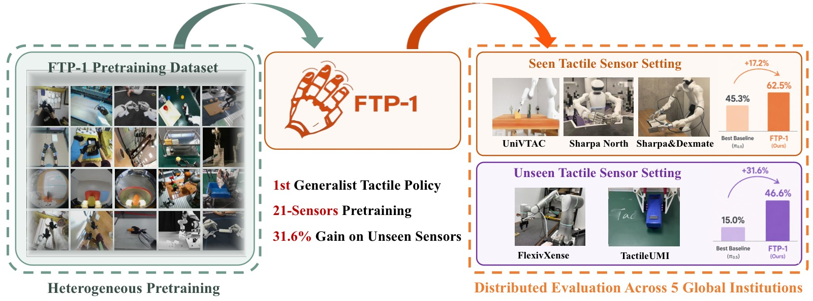
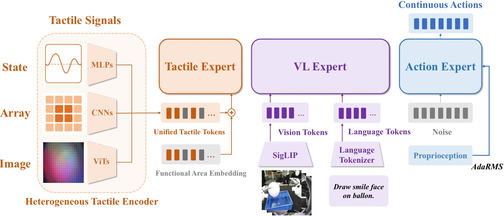
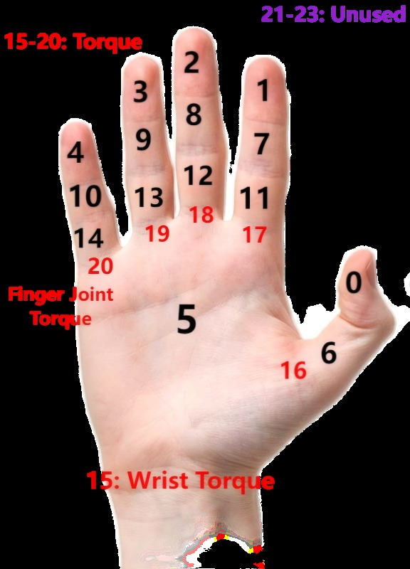
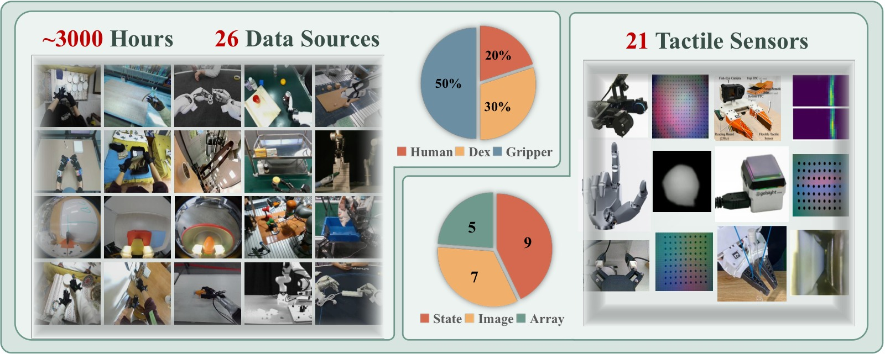
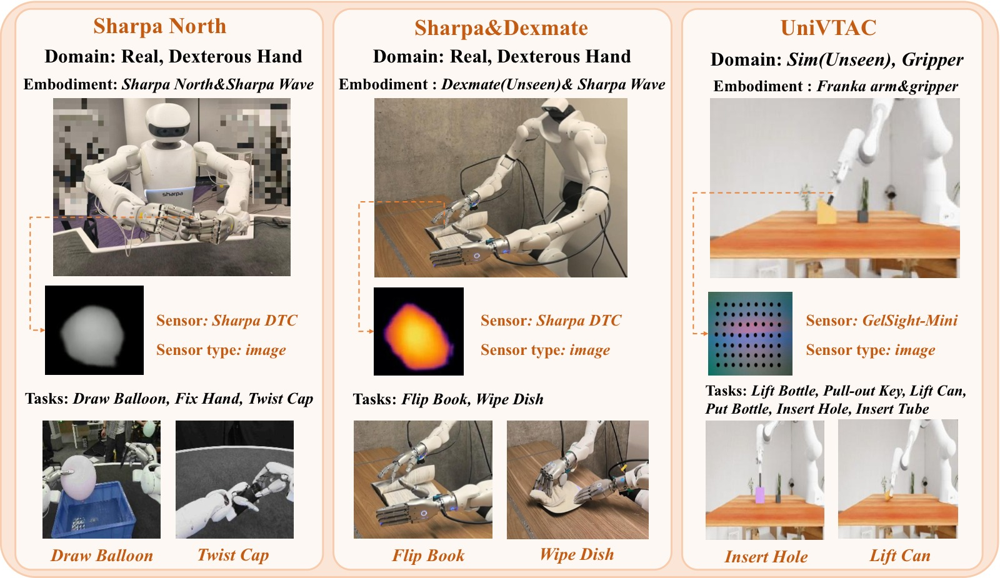
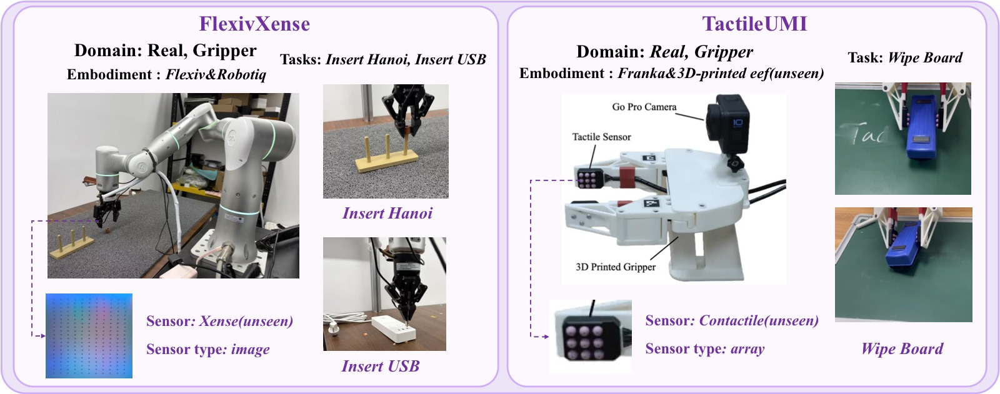
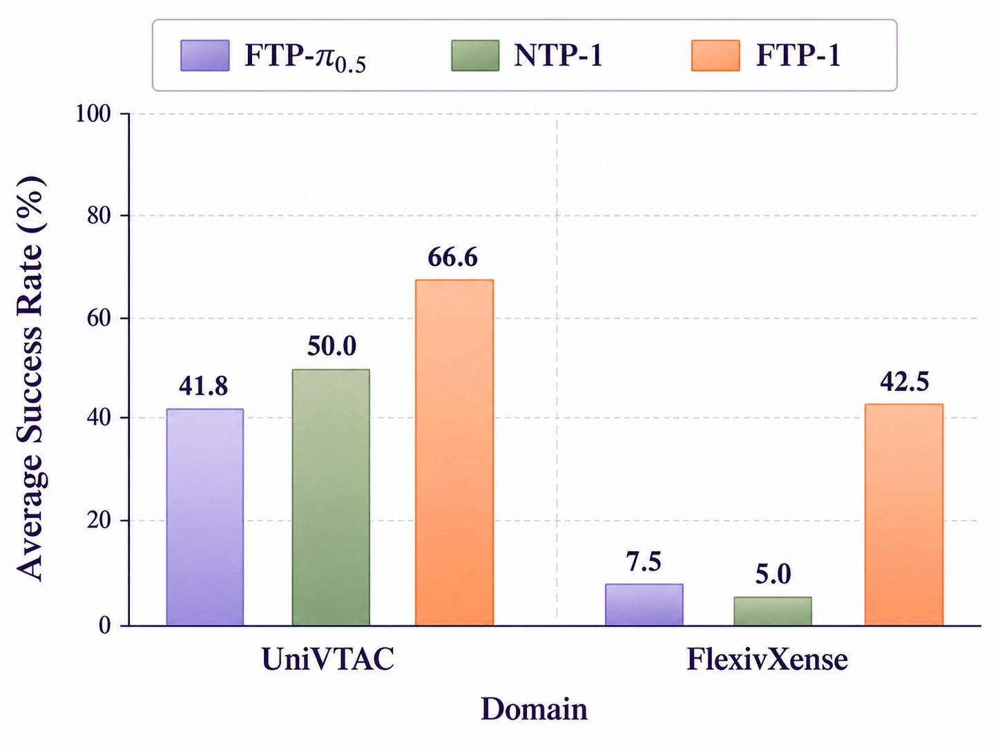

<!-- arxiv: 2606.13102 -->
<!-- venue: CoRL 2026 -->
<!-- tags: 触觉, 通用策略, 机器人操作, 表征学习, WAM -->

# FTP-1: A Generalist Foundation Tactile Policy Across Tactile Sensors for Contact-Rich Manipulation

> **论文信息**
> - 作者：Chengbo Yuan, Zicheng Zhang, Mingjie Zhou, Wendi Chen, Yi Wang, Zhuoyang Liu, Dantong Niu, Shuo Wang, Hui Zhang, Wenkang Zhang, Yingdong Hu, Yuanqing Gong, Wanli Xing, Chuan Wen, Cewu Lu, Kaifeng Zhang, Yang Gao
> - 通讯作者：Yang Gao (Tsinghua University / Shanghai Qi Zhi Institute)
> - 投稿方向：CoRL 2026
> - arXiv ID：2606.13102
> - 代码/模型/数据：https://ftp1-policy.github.io/
>
> 本文基于以下本地材料整理：
>
> - 论文 TeX 源码：`arXiv-2606.13102v2/`（主文件：`example.tex`）
> - 论文插图：`figure/*.pdf`（14 张图）+ `figure_app/detailed_faas.png`
> - 本文图片导出目录：`assets/ftp1/`

---

## 一、核心问题

通用机器人策略（如 π₀.₅、GR00T、OpenVLA）通过大规模异构数据预训练，已在下游操作任务中展现了强大的迁移能力。然而，**这一通用范式在触觉策略学习中几乎未被探索**。

当前触觉策略面临的核心挑战：

1. **触觉信号高度异构**：不同触觉传感器在模态（图像/阵列/状态）、分辨率、形态和接触响应上差异巨大，跨传感器泛化困难。
2. **传感器绑定设计**：现有触觉策略被限制在特定传感器配置和机器人形态上，无法迁移到新的触觉硬件。
3. **缺乏统一基础模型**：视觉策略已有 π₀.₅、OpenVLA 等基础模型，触觉领域仍缺乏一个共享的模型级起点。

> 本文的核心问题：触觉操作能否在通用基础策略范式下学习？即，**一个单一的触觉策略能否吸收异构触觉经验，并迁移到预训练中未见过的传感器和机器人形态？**

---

## 二、核心思路 / 方法

FTP-1 包含三个关键技术设计：

### 2.1 Morphology-Aware Tactile Token Space (MTTS)

将触觉信号组织为 **24 个功能区域 token**，作为跨传感器的统一接口：

- **Slot 0–14**：手内触觉区域（对应人手的不同功能区域，如拇指尖、食指尖等）
- **Slot 15–20**：手腕/手指力-力矩信号
- **Slot 21–23**：预留给未来用途

对于平行夹爪，两个夹爪侧面的传感器分别映射到拇指尖（slot 0）和食指尖（slot 1），反映其两指抓取功能。每个 token 附加一个**跨传感器共享的可学习功能区域嵌入**，左右手使用独立的嵌入以区分其触觉 token。



*图1：FTP-1 总览——第一个面向多样传感器和机器人形态的通用基础触觉策略。在大规模异构触觉操作数据集上预训练后，FTP-1 在下游未见传感器上提升 31.6 个百分点。*

### 2.2 异构触觉编码器

虽然 MTTS 提供了统一的 token 接口，但不同传感器的原始输入仍然不同。FTP-1 使用**三类异构编码器**：

| 输入类型 | 典型传感器 | 编码器架构 |
|---------|-----------|-----------|
| **图像型** (H×W×C) | GelSight, Sharpa DTC | 传感器专用轻量 ViT (depth=3) → 共享预训练 T3 Transformer 编码器 (depth=9) → `[CLS]` token |
| **阵列型** (H×W×D) | Contactile, AetherGlove | Fourier 编码 + 3层 CNN + 2层 MLP |
| **状态型** (D,) | 力-力矩传感器 | Fourier 编码 + 3层 MLP |

对于同一传感器中同类型、不同功能区域的信号，**共享编码器参数**以减少传感器特定参数量并鼓励一致的触觉动力学建模。

### 2.3 共享触觉 Expert + 多专家架构

FTP-1 基于 π₀.₅ 的多专家架构：

- **视觉-语言 Expert**：预训练 PaliGemma，处理图像和语言指令
- **触觉 Expert**：300M 参数 Transformer（width=1024, depth=18），独立处理 MTTS token
- **动作 Expert**：Flow-matching Transformer，同时 attend 视觉-语言和触觉 expert 的输出



*图2：FTP-1 架构总览。异构触觉观测通过传感器专用编码器映射到统一触觉 token 空间，由共享触觉 expert 处理后，与视觉-语言和本体感知信息融合生成动作。*

关键设计选择：
- **独立触觉 expert**（而非通过轻量 adapter 注入视觉-语言 expert）：避免干扰预训练的视觉-语言知识，支持在未见传感器上复用预训练触觉 expert
- **自适应 RMSNorm 注入本体感知**：比独立 proprioception token 效果更好
- **动作 expert → attend 触觉 expert，但反之不然**：保持单向信息流



*图3：MTTS 的触觉功能区域定义。24 个功能区域覆盖人手主要触觉区域，提供跨传感器统一的触觉接口。*

### 2.4 FTP-1-Dataset

从 **26 个数据源**聚合的大规模异构触觉操作数据集：

| 维度 | 规模 |
|------|------|
| 总时长 | ~3,000 小时 |
| 触觉传感器 | 21 种（7 图像型 + 5 阵列型 + 9 状态型） |
| 数据来源 | 人手演示 + 灵巧手 + 平行夹爪 + UMI |
| 重采样后比例 | 人手 20% / 灵巧手 30% / 夹爪 50% |

此外，还收集了 **Sharpa North-FTP-1**，包含约 4,000 条长时序灵巧手操作演示。



*图4：FTP-1-Dataset 总览。数据集聚合 26 个来源，涵盖人手和机器人操作，覆盖 21 种触觉传感器，所有数据通过 MTTS 接口统一组织。*

### 2.5 Unified Action Space (UAS)

采用 UniDex 的 FAAS（Function-Actuator-Aligned Space）统一不同末端执行器的动作空间：
- 左右臂各 32 维手部关节（共 64 维）
- 手腕平移 3 维 + 旋转 6 维（各臂）
- 头部姿态 9 维
- 总计 D 维稀疏向量，仅填充被支持的维度，loss 中 mask 掉不支持的维度

---

## 三、训练目标

FTP-1 采用 Flow Matching 作为动作生成目标。给定语言指令 ℓ、RGB 观测 I_t、本体感知 s_t、触觉观测 X_t，模型预测动作块：

$$\hat{\mathbf{A}}_{t:t+H-1} = \pi_\theta(\ell, \mathcal{I}_t, \mathbf{s}_t, \mathcal{X}_t)$$

**预训练配置**：
- 48×NVIDIA H20 GPU，全局 batch size 768
- 50k steps，学习率从 1×10⁻⁴ 衰减到 5×10⁻⁵
- 视觉编码器/分词器/VL expert/动作 expert 从 π₀.₅ 初始化
- 触觉编码器、触觉 expert、RMSNorm proprioception injector、动作投影层从头训练
- 优化器：AdamW（Muon 在离线指标上更好，但在真机 rollout 中泛化性下降）

**微调配置**：
- 8×NVIDIA A800 GPU，batch size 64
- 20k steps，学习率 5×10⁻⁵ → 5×10⁻⁶

---

## 四、实验与结果

### 4.1 评估设置

**5 个硬件配置，14 个任务**，由 5 个独立机构执行：

| 设置 | 域 | 传感器 | 传感器状态 |
|------|---|--------|----------|
| UniVTAC | 仿真，夹爪 | GelSight-Mini | 已见 |
| Sharpa North | 真机，灵巧手 | Sharpa DTC | 已见 |
| Sharpa&Dexmate | 真机，灵巧手 | Sharpa DTC | 已见 |
| FlexivXense | 真机，夹爪 | Xense | **未见** |
| TactileUMI | 真机，夹爪 | Contactile | **未见** |



*图5：预训练中已见传感器的微调实验总览。涵盖 UniVTAC 仿真、Sharpa North 和 Sharpa&Dexmate 真机设置。*

对比基线：
- **π₀.₅**：SOTA 开源 VLA 模型（无触觉输入），评估触觉带来的增益
- **Tactile-VLA**：通过 adapter 将触觉 token 注入 VLM expert（无独立触觉 expert）
- **FTP-π₀.₅**：FTP-1 架构 + π₀.₅ 权重初始化，但无 FTP-1 预训练 → 隔离大规模触觉预训练的贡献

### 4.2 已见传感器结果

**UniVTAC 仿真**（6 个任务，成功率 %）：

| 方法 | Lift Bottle | Pull-out Key | Lift Can | Put Bottle | Insert Hole | Insert Tube | Avg. | Avg. w/o Lifts |
|------|:----------:|:-----------:|:--------:|:----------:|:-----------:|:-----------:|:----:|:--------------:|
| VITaL* | 72 | 47 | 8 | 32 | 25 | 34 | 36.3 | 34.5 |
| UniVTAC-ACT* | 71 | 46 | 29 | 31 | 25 | 56 | 43.0 | 39.5 |
| π₀.₅ | 97 | 38 | 72 | 16 | 31 | 41 | 49.2 | 31.5 |
| Tactile-VLA | 97 | 32 | 15 | 10 | 41 | 56 | 41.8 | 34.8 |
| FTP-π₀.₅ | 77 | 30 | 26 | 19 | 47 | 72 | 45.2 | 42.0 |
| **FTP-1** | **97** | **48** | **65** | **47** | **64** | **79** | **66.7** | **59.5** |

> FTP-1 在整体平均（66.7%）和排除 Lift 任务（59.5%）两项指标上均最优，比第二名提升约 +17.5 个百分点。

**关键发现**：Lift Bottle 和 Lift Can 在仿真中几乎不需要触觉就能解决（π₀.₅ 分别达到 97% 和 72%），因此在排除这两个任务后的 Avg. w/o Lifts 更能反映触觉的实际贡献。

**真机结果**（6 个任务，成功率 %）：

| 方法 | Draw Balloon | Fix Hand (Tear) | Fix Hand (Finish) | Twist Cap | Flip Book | Wipe Dish | Avg. |
|------|:-----------:|:---------------:|:-----------------:|:---------:|:---------:|:---------:|:----:|
| π₀.₅ | 35 | 70 | 35 | 40 | 65 | 30 | 45.3 |
| Tactile-VLA | 20 | 80 | 25 | 10 | 45 | 35 | 35.8 |
| FTP-π₀.₅ | 25 | 65 | 25 | 20 | 70 | 45 | 41.6 |
| **FTP-1** | **45** | **80** | **40** | **65** | **85** | **60** | **62.5** |

> FTP-1 在真机实验中平均成功率 62.5%，比 π₀.₅ 提升 +17.2 个百分点。

**真机关键行为分析**：
- Tactile-VLA 和 FTP-π₀.₅ 在接触条件变化时产生不稳定动作
- π₀.₅ 在按压/擦拭任务中无法维持稳定的接触力
- FTP-1 在所有任务上产生更稳定、平滑的动作，展现出**反应式接触控制**能力

### 4.3 未见传感器迁移



*图6：预训练中未见传感器的微调实验总览。涵盖 FlexivXense（Xense 图像触觉）和 TactileUMI（Contactile 阵列触觉）。*

| 方法 | Insert Hanoi | Insert USB | Wipe Board | Avg. |
|------|:-----------:|:----------:|:----------:|:----:|
| π₀.₅ | 25 | 0 | 20 | 15.0 |
| Tactile-VLA | 0 | 10 | 15 | 8.3 |
| FTP-π₀.₅ | 5 | 10 | 30 | 15.0 |
| **FTP-1** | **55** | **30** | **55** | **46.6** |

> FTP-1 比 FTP-π₀.₅ 提升 **+31.6 个百分点**，证明大规模异构触觉预训练有效迁移到未见传感器。

**未见传感器上的行为特征**：
- Insert Hanoi：FTP-1 和 π₀.₅ 展现**恢复行为**，其他基线没有；FTP-1 展示**反应式插入控制**——当 Hanoi 圆环与柱子未对齐时，基于触觉反馈减速
- Insert USB：仅 100 条演示下，其他模型产生小幅度抖动，成功率低；FTP-1 展现了更高的数据效率
- Wipe Board：FTP-1 能维持稳定的按压接触力，其他模型在擦拭过程中失去紧密接触

### 4.4 消融：增益来自预训练触觉知识

为验证增益确实来自触觉预训练知识（而非数据分布更接近下游任务），训练 **NTP-1**（No-Tactile-Pretraining）作为对照：

- 预训练阶段：与 FTP-1 相同的数据和优化设置，但**移除触觉输入和触觉相关架构**
- 微调阶段：添加与 FTP-1 相同的触觉架构，从头训练



*图7：FTP-1 vs NTP-1 在 UniVTAC 和 FlexivXense 上的对比。在未见传感器上，FTP-1 远超 NTP-1（+37.5%），证明触觉分支的预训练知识是关键。*

| 设置 | FTP-π₀.₅ | NTP-1 | FTP-1 |
|------|:--------:|:-----:|:-----:|
| UniVTAC (Avg. w/o Lifts) | 42.0 | 36.5 | **59.5** |
| FlexivXense (Avg.) | 7.5 | ~5 | **42.5** |

- UniVTAC：NTP-1 > FTP-π₀.₅ 说明 FTP-1-Dataset 分布可能更接近 UniVTAC；但 NTP-1 < FTP-1，说明触觉预训练提供了有效初始化
- FlexivXense：FTP-1 比 NTP-1 提升 **+37.5%**，证明无触觉预训练时，在未见传感器上表现极差

> 结论：支持**假设 2（可迁移知识）**——FTP-1 的触觉分支从预训练中编码了通用触觉操作知识，可以在下游接触-rich 任务中迁移。

---

## 五、关键洞察与技术亮点

1. **触觉领域的"GPT 时刻"**：FTP-1 是第一个将通用基础策略范式扩展到触觉操作的工作，证明触觉技能可以像视觉技能一样被大规模预训练并跨传感器迁移。

2. **MTTS 作为跨传感器"通用语言"**：24 个功能区域 token 的定义巧妙地将异构触觉信号对齐到人类手部功能语义空间，是一个设计优雅的统一接口。

3. **独立触觉 Expert > Adapter 注入**：与 Tactile-VLA 等通过轻量 adapter 将触觉注入 VLM 的方法相比，独立触觉 expert（300M 参数）避免了干扰视觉-语言知识，同时支持在未见传感器上复用。

4. **无触觉预训练根本无法迁移**：NTP-1 在未见传感器上几乎不如随机（5%），说明没有触觉预训练的"触觉分支"在微调时是一个负资产。

5. **触觉预训练带来反应式控制**：FTP-1 是唯一在 Hanoi 插入任务中展现"检测到未对齐 → 自动减速"行为的模型，这是一种**涌现的接触-反应能力**。

6. **真机上触觉可能反而有害**：Tactile-VLA 和 FTP-π₀.₅ 在部分真机任务上不如无触觉的 π₀.₅（45.3% vs 41.6%/35.8%），说明不恰当的触觉融合方式可能**干扰**视觉-语言感知。

---

## 六、代码实现解读

本论文未提供独立代码仓库，但基于 π₀.₅ 代码库实现。以下是架构的关键实现映射：

```
┌─────────────────────────────────────────────────────┐
│                  FTP-1 Architecture                  │
├─────────────────────────────────────────────────────┤
│  Language ℓ  ──►  PaliGemma (VL Expert)             │
│  Vision I_t  ──►  (Frozen/Finetuned)               │
│                      │                              │
│  Tactile X_t ──►  Hetero Encoders ──► Tactile Expert│
│  ┌──────────────┐   ┌─────────────┐   ┌───────────┐ │
│  │ Image: ViT    │   │ MTTS Tokens │   │ Transformer│ │
│  │ Array: CNN    │──►│ (24 slots)  │──►│ W=1024    │ │
│  │ State: MLP    │   │ + FA Embed  │   │ D=18      │ │
│  └──────────────┘   └─────────────┘   │ H=8       │ │
│                                       └─────┬─────┘ │
│  Proprio s_t ──► RMSNorm Injector ──────────┼───    │
│                                              │       │
│                    ┌─────────────────────────┘       │
│                    ▼                                  │
│            Action Expert (Flow Matching)              │
│            attend VL + Tactile experts                │
│                    │                                  │
│                    ▼                                  │
│           Â_{t:t+H-1} ∈ R^{H×D} (UAS)               │
└─────────────────────────────────────────────────────┘
```

**推理流程**：
```
t ─► Encode(I_t, ℓ) via VL Expert
  │
  ├─► Tokenize(X_t) via Hetero Encoders → MTTS tokens
  │   (per functional area, per sensor type)
  │
  ├─► Tactile Expert(MTTS tokens) → tactile features
  │
  ├─► Adaptive RMSNorm(s_t) → proprio features
  │
  └─► Action Expert attends VL + Tactile → predict chunk
```

关键实现细节：
- 触觉 token 先经 LayerNorm，加上功能区域嵌入，再经 2 层 GELU MLP 投影到触觉 expert 输入维度
- 本体感知经 Fourier 编码后与 flow-matching timestep 特征拼接，通过自适应 RMSNorm 注入
- 状态和动作归一化使用 z-score（比 π₀.₅ 的 quantile-based 在细粒度操作上更好）
- 异构数据训练基础设施：按数据域自动分配不同 GPU，同 batch 内保持相同数据格式

---

## 七、局限性

1. **仅限于触觉感知**：主要关注通用触觉感知，尚未涉及触觉/力伺服和控制。未来可扩展到触觉预测和基于预测的低级控制。

2. **数据集规模和多样性有限**：~3,000 小时、26 个来源仍然不足以支撑持续的性能提升（预训练 50k steps 后性能饱和）。

3. **未协同训练视觉数据**：仅使用触觉操作数据预训练，未与 π₀.₅ 的视觉数据集协同训练，可能是性能饱和的原因之一。

---

## 八、关键概念速查

| 概念 | 解释 |
|------|------|
| **MTTS** | Morphology-Aware Tactile Token Space，24 个功能区域 token 的统一触觉接口 |
| **FAAS** | Function-Actuator-Aligned Space，UniDex 提出的统一手部动作空间 |
| **UAS** | Unified Action Space，FTP-1 的 D 维稀疏统一动作空间 |
| **T3 Encoder** | Transferable Tactile Transformer，共享的触觉图像预训练编码器 |
| **Flow Matching** | π₀.₅ 使用的连续归一化流动作生成方法 |
| **NTP-1** | No-Tactile-Pretraining 消融对照模型 |
| **FTP-π₀.₅** | FTP-1 架构 + π₀.₅ 权重但不含触觉预训练的基线 |
