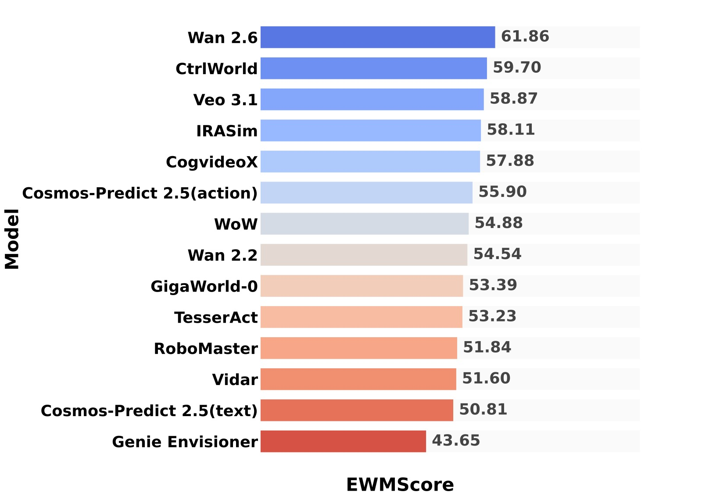
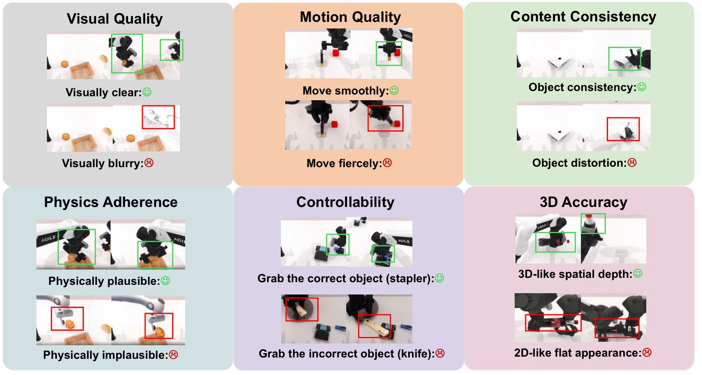
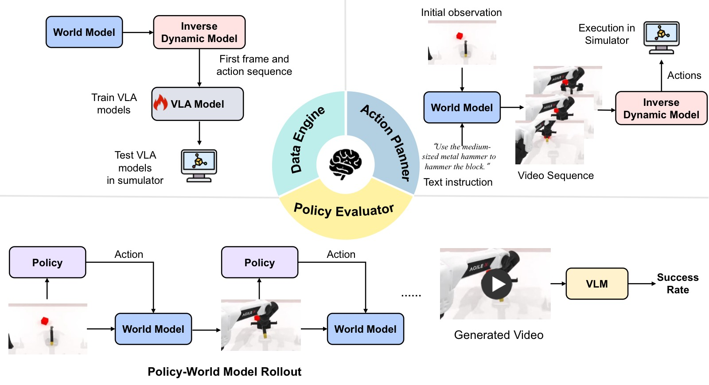
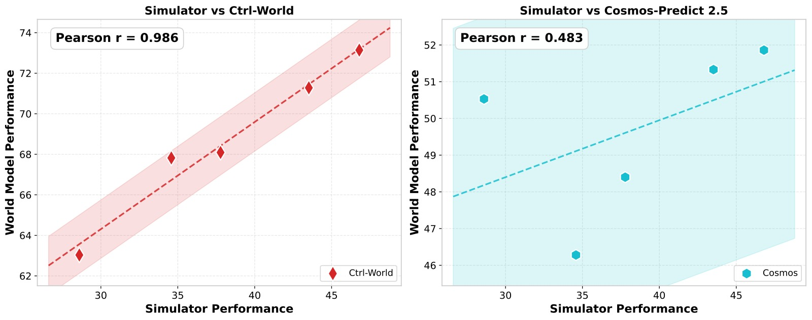
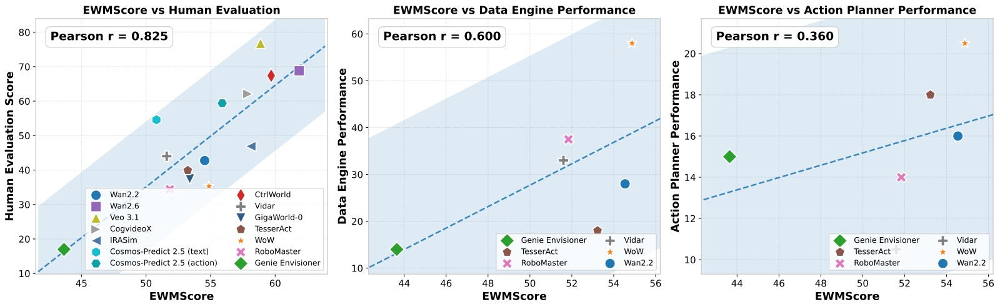

<!-- arxiv: 2602.08971 -->
<!-- venue: ICML 2026 -->
<!-- tags: 世界模型, 综述, 视频生成, 机器人操作 -->

# WorldArena: A Unified Benchmark for Evaluating Perception and Functional Utility of Embodied World Models

> **论文信息**
> - 作者：Yu Shang, Zhuohang Li, Yiding Ma, Weikang Su, Xin Jin, Ziyou Wang, Lei Jin, Xin Zhang, Yinzhou Tang, Haisheng Su, Chen Gao, Wei Wu, Xihui Liu, Dhruv Shah, Zhaoxiang Zhang, Zhibo Chen, Jun Zhu, Yonghong Tian, Tat-Seng Chua, Wenwu Zhu, Yong Li
> - 通讯作者：Yong Li (Tsinghua University)
> - 投稿方向：ICML 2026（preprint）
> - arXiv ID：2602.08971
> - 代码/排行榜：https://world-arena.ai
>
> 本文基于以下本地材料整理：
>
> - 论文 TeX 源码：`arXiv-2602.08971v2/`（主文件：`example_paper.tex`）
> - 论文插图：`fig/*.pdf`（12 张图）
> - 本文图片导出目录：`assets/worldarena/`

---

## 一、核心问题

世界模型（World Model）已成为具身智能的基石——通过学习环境动态并预测未来状态，它们让智能体能够在行动前"想象"交互结果。但现有评估体系存在两个关键缺陷：

1. **评估维度碎片化**：现有 benchmark 几乎只关注视频生成的感知质量（PSNR、FVD 等），忽略了下游具身任务中的功能效用。世界模型作为数据引擎、策略评估器和动作规划器这三个关键角色几乎从未被系统评估。

2. **模型覆盖不足**：大多数 benchmark 仅评估通用文本到视频模型（如 CogVideoX、Wan），许多机器人专用世界模型（如 GigaWorld、WoW、TesserAct、CtrlWorld）未被纳入。

> 核心问题：**当前的 embodied world model 是否能同时做到"看起来逼真"和"用起来有效"？这两个维度之间的差距有多大？**



*图1：(a) 14 个模型的 EWMScore 统一评分；(b) 各模型在视频质量六个子维度和具身任务上的雷达图对比。注意商业通用视频模型（Veo 3.1、Wan 2.6）在视觉维度领先，但具身专用模型在物理遵循和内容一致性上更具优势。*

---

## 二、WorldArena 评估框架

### 2.1 总览

WorldArena 从三个维度系统评估 embodied world model：

| 维度 | 说明 | 指标数 |
|------|------|--------|
| **视频质量** | 开放环预测的感知质量 | 6 子维度 × 16 指标 |
| **具身任务** | 作为数据引擎/策略评估器/动作规划器的闭环能力 | 3 种角色 |
| **人类评估** | 整体质量、指令遵循、物理遵循的主观评分 | 2 种方式 |

数据集基于 **RoboTwin 2.0**（50 个双手操作场景，2500 个视频），评估 14 个代表性模型。

### 2.2 视频质量评估（6 维度 × 16 指标）



*图2：视频质量评估的六个维度示意——从视觉质量、运动质量、内容一致性、物理遵循、3D 精度到可控性，覆盖感知评估的完整谱系。*

#### 视觉质量（Visual Quality）

| 指标 | 方法 | 评估目标 |
|------|------|---------|
| **Image Quality** | MUSIQ 无参考质量评估 | 帧清晰度，检测过曝/噪声/压缩伪影 |
| **Aesthetic Quality** | LAION 美学预测器 | 光照与色彩构图的视觉吸引力 |
| **JEPA Similarity** | V-JEPA 特征分布 MMD | 与真实视频的特征分布相似度 |

#### 运动质量（Motion Quality）

| 指标 | 方法 |
|------|------|
| **Dynamic Degree** | RAFT 光流，top 5% 活跃像素的运动强度 |
| **Flow Score** | 光流幅度时间平均 |
| **Motion Smoothness** | 帧插值模型预测中间帧 → 与真实帧比较 |

#### 内容一致性（Content Consistency）

| 指标 | 方法 |
|------|------|
| **Subject Consistency** | DINO 特征跨帧余弦相似度 |
| **Background Consistency** | CLIP 特征场景稳定性 |
| **Photometric Consistency** | 光流 AEPE 像素级纹理对齐 |

#### 物理遵循（Physics Adherence）

| 指标 | 方法 |
|------|------|
| **Interaction Quality** | Qwen3-VL 评估接触行为与力传递的物理合理性（1-5 分） |
| **Trajectory Accuracy** | SAM 3 提取机械臂轨迹 → NDTW 距离对齐 |

#### 3D 精度（3D Accuracy）

| 指标 | 方法 |
|------|------|
| **Depth Accuracy** | 单目深度估计 + 中位数尺度对齐 |
| **Perspectivity** | Qwen3-VL 评估透视合理性（深度缩放、光照一致性、遮挡） |

#### 可控性（Controllability）

| 指标 | 方法 |
|------|------|
| **Instruction Following** | Qwen3-VL 评估动作类型/目标物体/任务状态的对齐 |
| **Semantic Alignment** | Qwen2.5-VL 生成视频描述 → 语义相似度 |
| **Action Following** | 同一初始帧 × 3 种指令 → 生成多样性（成对特征差异） |

### 2.3 具身任务评估



*图3：具身任务评估系统。世界模型扮演三种角色：(1) 数据引擎——生成合成数据训练下游策略；(2) 策略评估器——作为环境代理评估策略表现；(3) 动作规划器——端到端预测动作序列并在模拟器中执行。*

#### 角色一：具身数据引擎（Data Engine）

- 世界模型基于初始帧和指令生成合成视频
- 逆动力学模型（IDM）从视频特征中提取动作 → 视频-动作对
- 用生成数据训练 π₀.₅ 策略，测量成功率增益
- 与纯真实数据训练的 π₀.₅ 对比

#### 角色二：策略评估器（Policy Evaluator）

- 训练 5 个不同能力的 π₀.₅ 策略模型
- 各策略与世界模型交互生成 rollout → VLM 判断任务成功
- 测量世界模型评估结果与真实模拟器的相关性

#### 角色三：动作规划器（Action Planner）

- 世界模型 + IDM 端到端预测动作序列
- 在 RoboTwin 模拟器中执行，测量任务成功率
- 直接与 π₀.₅ VLA 策略对比

### 2.4 EWMScore 统一指标

将 16 个视频质量指标线性归一化到 [0, 100]，取算术平均得到单一综合分数：

$$\text{EWMScore} = \frac{1}{16} \sum_{i=1}^{16} \text{norm}(m_i)$$

其中 $\text{norm}(\cdot)$ 基于经验确定的指标上下界进行线性归一化。

---

## 三、实验与结果

### 3.1 评估设置

**数据集**：RoboTwin 2.0，50 个任务场景，2500 个视频（2000 训练 / 500 测试）

**评估模型**（14 个）：

| 类型 | 模型 |
|------|------|
| 通用视频模型 | CogVideoX, Wan 2.2, Wan 2.6, Veo 3.1 |
| 文本条件具身模型 | Genie Envisioner, GigaWorld, TesserAct, Cosmos-Predict 2.5 (text), WoW, RoboMaster, Vidar |
| 动作条件具身模型 | IRASim, Cosmos-Predict 2.5 (action), CtrlWorld |

### 3.2 视频质量结果

**视觉质量 & 运动质量 & 内容一致性（部分结果）**：

| 模型 | Image Quality ↑ | Dynamic Degree ↑ | Subject Consist. ↑ |
|------|:--------------:|:---------------:|:-----------------:|
| Wan 2.6 | **0.682** | **0.742** | 0.752 |
| Veo 3.1 | 0.661 | 0.545 | 0.788 |
| Cosmos-Predict 2.5 (text) | 0.667 | 0.591 | 0.749 |
| CogVideoX | 0.358 | 0.317 | 0.808 |
| CtrlWorld | 0.352 | 0.426 | **0.841** |
| TesserAct | 0.332 | 0.515 | 0.825 |

**物理遵循 & 3D 精度 & 可控性（部分结果）**：

| 模型 | Interaction Quality ↑ | Trajectory Acc. ↑ | Depth Acc. ↑ | Instruction Following ↑ |
|------|:--------------------:|:----------------:|:-----------:|:-----------------------:|
| Veo 3.1 | **0.787** | 0.123 | 0.742 | **0.933** |
| Wan 2.6 | 0.728 | 0.118 | 0.714 | 0.854 |
| CtrlWorld | 0.621 | **0.477** | 0.930 | 0.727 |
| CogVideoX | 0.594 | 0.353 | **0.910** | 0.727 |
| IRASim | 0.566 | 0.364 | **0.931** | 0.660 |

> **关键发现**：具身专用模型在结构/交互相关指标（轨迹精度、深度精度）上更强，通用视频模型在感知质量（图像/美学）上领先。商业模型 Veo 3.1 在交互质量和指令遵循上均排名第一，但在轨迹精度上意外地差（0.123），说明它生成的视频"看起来合理"但机械臂运动轨迹并不准确。

### 3.3 具身任务结果

**数据引擎**（用世界模型生成的数据训练 π₀.₅）：

| 数据来源 | Task 1 (adjust bottle) | Task 2 (click bell) |
|---------|:---------------------:|:-------------------:|
| π₀.₅ (zero-shot) | 2% | 5% |
| π₀.₅ (real data) | 77% | 66% |
| WoW | 45% | **71%** |
| RoboMaster | 7% | 68% |
| Vidar | 13% | 53% |
| Wan 2.2 | 15% | 41% |
| Genie Envisioner | 7% | 21% |

> WoW 在 Task 2 上甚至超过了真实数据训练的 π₀.₅（71% vs 66%），但所有模型的合成数据仍无法全面替代真实数据。

**策略评估器**：



*图4：CtrlWorld 与 RoboTwin 模拟器的策略评估结果呈强相关，说明它能有效捕捉环境转移动态；Cosmos-Predict 2.5 相关性较弱。但两者都系统性高估成功率，存在对成功轨迹的过拟合。*

**动作规划器**：

| 模型 | Task 1 | Task 2 |
|------|:------:|:------:|
| π₀.₅ (VLA 策略) | 77% | 66% |
| WoW | 20% | 21% |
| Genie Envisioner | 10% | 20% |
| Wan 2.2 | 12% | 20% |

> 当前世界模型作为动作规划器的能力与 VLA 策略差距巨大（20% vs 77%），特别是在长时序闭环任务中仍不可靠。

### 3.4 跨维度分析



*图5：EWMScore 与三个维度的相关性：(a) 人类评估：Pearson r=0.825，高度一致；(b) 数据引擎性能：r=0.600，中等相关；(c) 动作规划性能：r=0.360，弱相关。揭示感知→功能之间存在显著鸿沟。*

| 相关性 | Pearson r | 解释 |
|--------|:---------:|------|
| EWMScore ↔ 人类评估 | **0.825** | 客观指标与主观判断高度一致 |
| EWMScore ↔ 数据合成 | **0.600** | 中等相关，视觉质量对数据增益有帮助但有限 |
| EWMScore ↔ 动作规划 | **0.360** | 弱相关，高视觉保真度不转化为可靠的决策信号 |

---

## 四、关键洞察与技术亮点

1. **感知-功能鸿沟（Perception-Functionality Gap）**：这是本文最核心的发现——视觉质量最好的模型（Veo 3.1、Wan 2.6）在具身任务上并不领先。EWMScore 与动作规划仅 r=0.360 的弱相关，表明"看起来好"远不等于"用起来好"。

2. **动作条件建模的独特价值**：CtrlWorld（动作条件）在轨迹精度（0.477）和策略评估相关性上显著优于文本条件模型，说明显式动作建模对物理合理交互至关重要。

3. **合成数据有潜力但不成熟**：WoW 在 Task 2 上超过真实数据（71% vs 66%），证明世界模型作为数据引擎是可行的；但当前整体水平仍远低于真实数据训练。

4. **EWMScore 作为可靠自动化指标**：与人类评估 r=0.825 的高度相关，使其可作为快速筛选和模型迭代的 proxy metric，降低对昂贵人工评估的依赖。

5. **评估框架的完整性**：相比现有 benchmark（表 1 的详细对比），WorldArena 是第一个同时覆盖视频质量 6 子维度 + 3 种具身角色 + 人类评估的综合性 benchmark。

---

## 五、代码实现解读

WorldArena 本身是 benchmark 框架，没有训练代码。其评估管线架构如下：

```
┌─────────────────────────────────────────────────────────┐
│                  WorldArena Pipeline                     │
├─────────────────────────────────────────────────────────┤
│                                                         │
│  ┌──────────────┐    ┌──────────────────────┐           │
│  │ RoboTwin 2.0 │───►│ World Model Finetune  │           │
│  │ (50 tasks)   │    │ (per-model post-train)│           │
│  └──────────────┘    └──────────┬───────────┘           │
│                                 │                        │
│         ┌───────────────────────┼───────────────────────┐│
│         │                       ▼                       ││
│         │  ┌──────────┐  ┌──────────┐  ┌────────────┐  ││
│         │  │ Video    │  │ Embodied │  │ Human      │  ││
│         │  │ Quality  │  │ Tasks    │  │ Evaluation │  ││
│         │  │ (16 metrics)│ │ (3 roles) │  │ (70 ppl)  │  ││
│         │  └────┬─────┘  └────┬─────┘  └─────┬──────┘  ││
│         │       │             │              │          ││
│         │       ▼             ▼              ▼          ││
│         │  ┌──────────────────────────────────────┐    ││
│         │  │           EWMScore (unified)          │    ││
│         │  └──────────────────────────────────────┘    ││
│         └───────────────────────────────────────────────┘│
│                                                         │
│  Evaluation Outputs:                                     │
│  ├── Radar chart (6 dims)                                │
│  ├── Embodied task scores (data/policy/action)           │
│  ├── Human win-rate matrix                               │
│  └── EWMScore leaderboard                                │
└─────────────────────────────────────────────────────────┘
```

**关键评估工具链**：

| 组件 | 依赖工具/模型 |
|------|-------------|
| 图像质量 | MUSIQ (no-reference IQA) |
| 美学质量 | LAION Aesthetic Predictor |
| 特征相似度 | V-JEPA, DINO, CLIP |
| 光流分析 | RAFT, 帧插值模型 |
| 深度估计 | 单目深度估计模型 |
| VLM 评判 | Qwen3-VL, Qwen2.5-VL |
| 轨迹提取 | SAM 3 (bounding box tracking) |
| 逆动力学 | VPP-style diffusion policy head |
| 策略模型 | π₀.₅ |

---

## 六、局限性

1. **任务领域局限**：仅使用 RoboTwin 2.0 的双手操作场景，未覆盖导航、移动操作等其他具身领域。
2. **模型覆盖**：14 个模型虽已是同类 benchmark 中最多的，但仍未涵盖所有具身世界模型（如 RoboScape、HunyuanVideo 等）。
3. **合成数据评估仅用 25 条轨迹**：数据引擎评估的规模较小，可能低估了大批量合成数据的潜力。
4. **仅使用 VLM 进行任务成功判断**：自动化评判可能存在偏差，特别是在复杂/长时序任务中。
5. **EWMScore 是线性组合**：简单的算术平均可能无法完全捕捉各维度间的非线性交互。

---

## 七、关键概念速查

| 概念 | 解释 |
|------|------|
| **EWMScore** | 16 个视频质量指标的线性归一化算术平均，范围 [0, 100] |
| **Perception-Functionality Gap** | 视觉质量与具身任务性能之间的系统性差距 |
| **Embodied Data Engine** | 世界模型生成合成数据以增强策略训练 |
| **Embodied Policy Evaluator** | 世界模型作为环境代理评估策略表现 |
| **Embodied Action Planner** | 世界模型 + IDM 端到端输出可执行动作 |
| **RoboTwin 2.0** | 50 个双手操作任务的数据集与模拟器 |
| **NDTW** | Normalized Dynamic Time Warping，轨迹对齐指标 |
| **MUSIQ** | Multi-scale Image Quality Transformer，无参考图像质量评估 |
