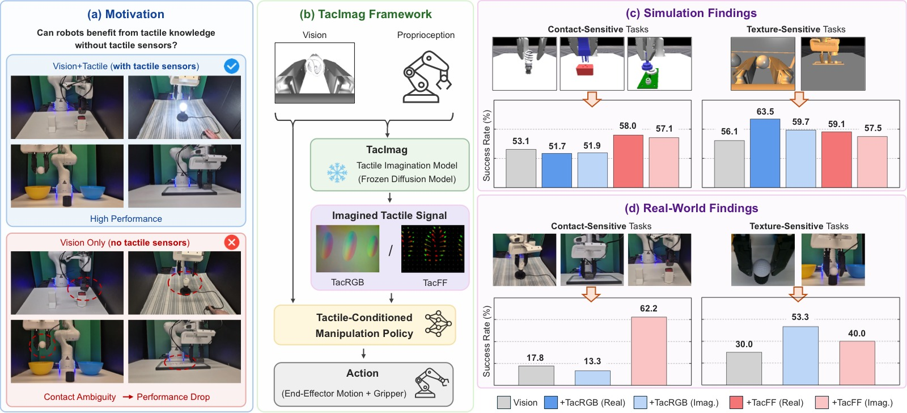
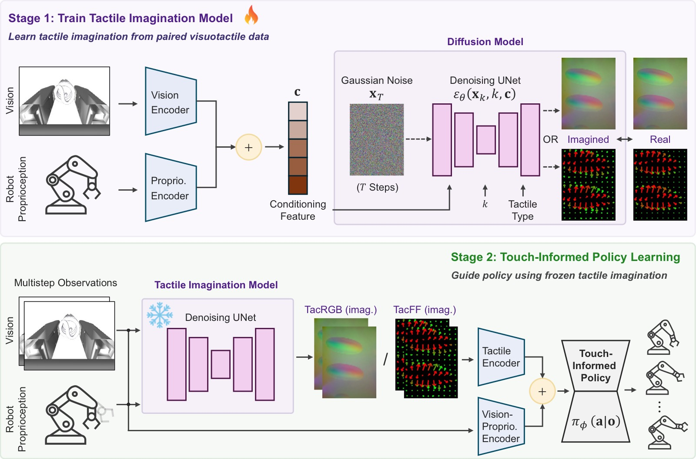
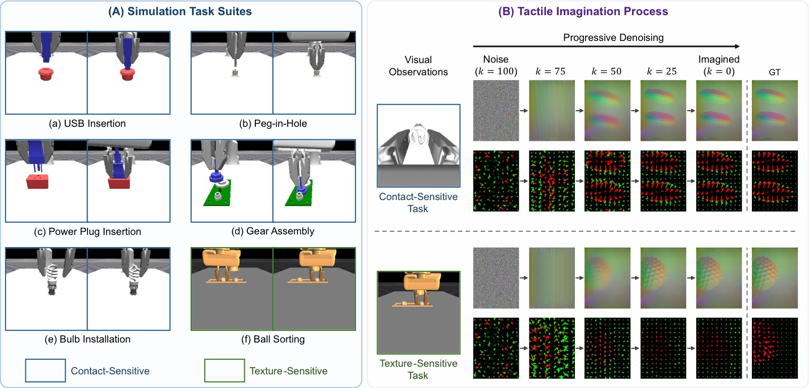
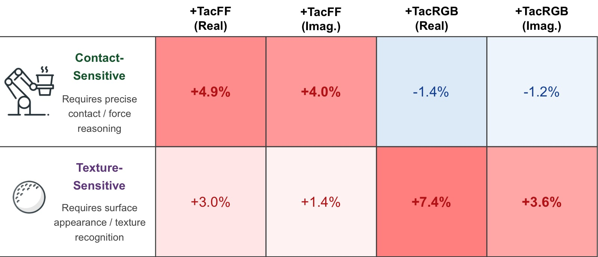
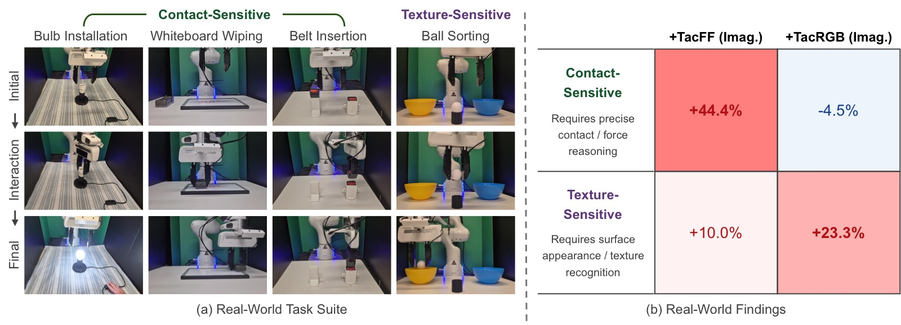
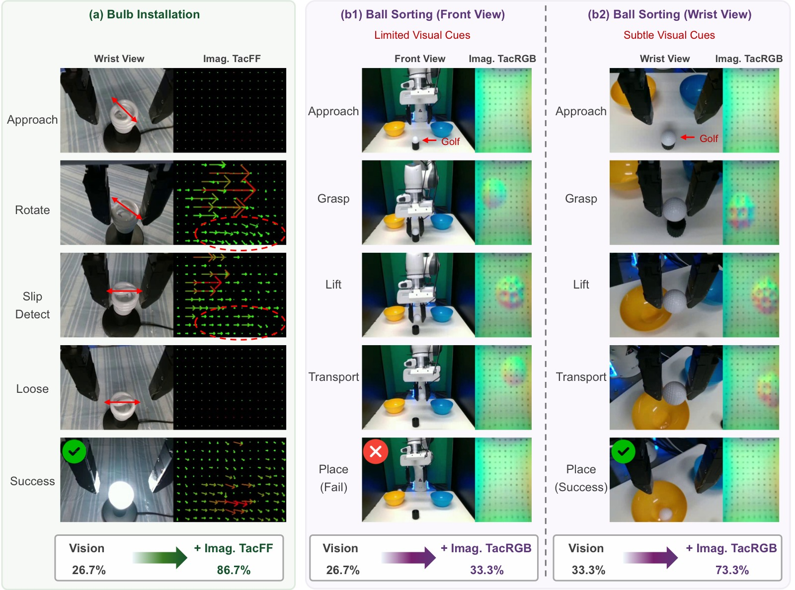
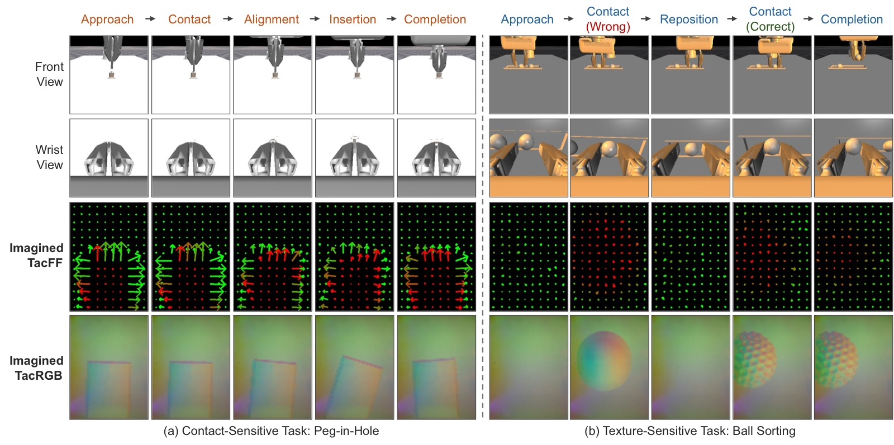

<!-- arxiv: 2607.01684 -->
<!-- venue: ICRA 2026（投稿中） -->
<!-- tags: 触觉, 机器人操作, 扩散模型, 表征学习 -->

# Imagining the Sense of Touch: Touch-Informed Manipulation via Imagined Tactile Representations

> **论文信息**
> - 作者：Zhiyuan Zhang, Adeesh Desai, Jyun-Chi Hu, Yosuke Saka, Quan Khanh Luu, Jiuzhou Lei, Davood Soleymanzadeh, Bihao Zhang, Minghui Zheng, Yu She
> - 通讯作者：Yu She (Purdue University)
> - 投稿方向：IEEE 会议（ICRA/IROS 级别）
> - arXiv ID：2607.01684
> - 代码：https://tacimag.github.io/
>
> 本文基于以下本地材料整理：
>
> - 论文 TeX 源码：`arXiv-2607.01684v1/`（主文件：`root.tex`）
> - 论文插图：`figures/*.pdf`（7 张图）
> - 本文图片导出目录：`assets/tacimag/`

---

## 一、核心问题

触觉传感器显著提升接触-rich 操作的性能，但实际部署面临硬件脆弱、需要标定、易磨损等痛点。这引出一个根本性问题：

> **机器人能否在不部署触觉传感器的情况下，仍然受益于触觉知识？**

现有 visuotactile 策略在训练和部署时都依赖物理触觉传感器。而 TacImag 提出了一种新范式：**训练时用视觉+触觉数据学习"触觉想象力"，部署时只靠视觉生成触觉信号**。



*图1：TacImag 总览。(a) 纯视觉策略在接触-rich 操作中因遮挡和视觉歧义而失败；(b) TacImag 两阶段框架——先训练视觉→触觉的扩散想象模型，再冻结后训练触觉条件策略；(c) 仿真发现：TacFF 对接触敏感任务最有效，TacRGB 对纹理敏感任务最有效；(d) 真机实验验证了相同趋势。*

---

## 二、核心思路 / 方法

### 2.1 TacImag 两阶段框架



*图2：TacImag 两阶段框架。Stage 1：用条件扩散模型从视觉+本体感知预测触觉观测；Stage 2：冻结想象模型，将其生成的触觉信号与视觉/本体感知融合训练操作策略。部署时无需物理触觉传感器。*

**Stage 1 — 触觉想象**：

用条件 DDPM 建模 $p(\mathbf{o}^{\mathrm{tac}}_t \mid \mathbf{o}^{\mathrm{vis}}_t, \mathbf{o}^{\mathrm{prop}}_t)$：

$$\mathcal{L}_{\mathrm{diff}} = \mathbb{E}_{\mathbf{x}^{\mathrm{tac}}_0,k,\boldsymbol{\epsilon}} \left[ \|\boldsymbol{\epsilon} - \boldsymbol{\epsilon}_{\phi}(\mathbf{x}^{\mathrm{tac}}_k, k, \mathbf{o}^{\mathrm{vis}}_t, \mathbf{o}^{\mathrm{prop}}_t)\|_2^2 \right]$$

推理时通过 10 步 DDIM 迭代去噪生成触觉观测。

**Stage 2 — 触觉条件策略**：

冻结想象模型后，用 Diffusion Policy 训练操作策略，各模态独立编码后融合：

$$\mathbf{z}_t = \{\mathbf{z}^{\mathrm{vis}}_t \oplus \mathbf{z}^{\mathrm{tac}}_t \oplus \mathbf{z}^{\mathrm{prop}}_t\}$$

> 关键设计：梯度不回传到想象模型，触觉生成器保持冻结，隔离触觉想象的效果。

### 2.2 两种触觉表示

| 表示 | 维度 | 编码内容 | 适用场景 |
|------|------|---------|---------|
| **TacRGB** | 240×320×3 | 接触外观、表面纹理 | 纹理敏感的物体分类/识别 |
| **TacFF** | 10×14×3 | 空间网格上的法向力+剪切力分布 | 接触力敏感的插入/装配 |

---

## 三、核心假设

本文的核心假设不是"想象触觉补全了视觉缺失的信息"，而是：

> 接触相关信息并非完全不在视觉中——它可能以微弱的外观变化、物体变形、相对运动等形式存在，但难以被端到端策略直接利用。**触觉想象本质上是一种接触感知监督信号**，帮助策略识别和利用视觉中已有的、但难以直接提取的接触相关特征。

这意味着 TacImag 不是"凭空生成"触觉信息，而是"转换表示形式"——将视觉中难以利用的交互线索转化为策略更容易消费的触觉表示。

---

## 四、实验与结果

### 4.1 仿真实验（ManiFeel Benchmark, 6 个任务）



*图3：(A) 六个仿真任务——USB 插入、电源插入、peg-in-hole、齿轮装配、灯泡安装（接触敏感）；球分类（纹理敏感）。(B) 扩散模型从高斯噪声迭代去噪生成触觉表示的过程，生成的 TacRGB/TacFF 与真实触觉信号高度一致。*

| 配置 | USB | Power | PIH | Gear | Bulb | Sorting | **Avg.** |
|------|:---:|:-----:|:---:|:----:|:----:|:-------:|:--------:|
| Vision | 52.7 | 52.5 | 24.4 | **60.7** | 75.2 | 56.1 | 53.6 |
| Vision + TacRGB | 51.8 | 59.4 | 16.3 | 53.4 | 77.8 | **63.5** | 53.7 |
| Vision + TacFF | **57.5** | **63.0** | 29.2 | 57.8 | **82.4** | 59.1 | **58.2** |
| Vision + TacRGB (imag.) | 53.3 | 52.3 | 23.8 | 55.1 | 75.0 | 59.7 | 53.2 |
| Vision + TacFF (imag.) | 56.2 | 61.2 | **31.3** | 58.7 | 80.2 | 57.5 | **57.5** |

> 想象 TacFF 平均 57.5%，仅比物理 TacFF (58.2%) 低 0.7 个百分点，比纯视觉 (53.6%) 高 3.9 个百分点。在 peg-in-hole 上想象 TacFF 甚至略超物理 TacFF。

### 4.2 想象质量评估

| 任务 | TacFF Cos↑ | TacRGB SSIM↑ | TacRGB LPIPS↓ |
|------|:---------:|:-----------:|:------------:|
| USB Insertion | 0.854 | 0.952 | 0.138 |
| Power Insertion | 0.963 | 0.972 | 0.107 |
| Peg-in-Hole | 0.937 | 0.960 | 0.158 |
| Gear Assembly | 0.897 | 0.920 | 0.178 |
| Bulb Installation | 0.793 | 0.973 | 0.153 |
| Ball Sorting | 0.896 | 0.942 | 0.207 |
| **Average** | **0.890** | **0.953** | **0.157** |

> TacFF 力方向余弦相似度平均 0.890，TacRGB SSIM 平均 0.953，LPIPS 仅 0.157，说明扩散模型能准确从视觉重建触觉信号。

### 4.3 任务-表示匹配规律



*图4：接触敏感任务（USB/电源/PIH/齿轮/灯泡）vs 纹理敏感任务（球分类）的增益热力图。TacFF → 接触敏感任务 +4.0%；TacRGB → 纹理敏感任务 +3.6%。想象触觉与物理触觉呈现完全一致的任务依赖性。*

### 4.4 真机实验（4 个任务，Franka Panda）



*图5：真机实验。(a) 灯泡安装、白板擦拭、皮带插入（接触敏感）和球分类（纹理敏感）四个任务；(b) 接触敏感任务上想象 TacFF 平均提升 +44.4 个百分点，纹理敏感上想象 TacRGB 提升 +23.3 个百分点。*

| 配置 | Bulb | Wipe | Belt | Sort(F) | Sort(W) |
|------|:----:|:----:|:----:|:-------:|:-------:|
| Vision | 26.7 | 20.0 | 6.7 | 26.7 | 33.3 |
| + TacRGB (imag.) | 33.3 | 6.7 | 0.0 | 33.3 | **73.3** |
| + TacFF (imag.) | **86.7** | **60.0** | **40.0** | 33.3 | 46.7 |

> 灯泡安装从 26.7% → 86.7%（+60pp），白板擦拭从 20% → 60%（+40pp）。球分类上 TacRGB 手腕视角从 33.3% → 73.3%（+40pp）。

### 4.5 视角依赖性



*图6：(a) 灯泡安装中想象 TacFF 在接触后才逐渐结构化，揭示对齐/旋转/滑移的力方向；(b1-b2) 球分类中，前视视角纹理线索弱（26.7%→33.3%），手腕视角能捕捉局部表面纹理（33.3%→73.3%）。证明 TacImag 不是凭空生成信息，而是将视觉中微弱但存在的线索转化为更易消费的触觉表示。*



*图7：典型案例。(a) peg-in-hole：想象 TacFF 在接触前几乎没有结构，接触后逐渐形成力方向图；(b) 球分类：当夹爪接触错误物体（乒乓球），TacRGB 显示光滑表面；重新夹取目标（高尔夫球）后，TacRGB 呈现特征性凹坑纹理。*

---

## 五、关键洞察与技术亮点

1. **触觉想象 ≠ 补全缺失信息**：TacImag 不是生成视觉中不存在的东西，而是将视觉中难以利用的交互线索"转译"为策略更容易消费的触觉表示。证据：手腕视角在球分类上远超前视视角，因为手腕视角本身含有更多局部表面纹理线索。

2. **表示类型与任务类型严格匹配**：TacFF 对接触敏感任务有效、TacRGB 对纹理敏感任务有效——这个规律在仿真和真机中完全一致，且想象触觉与物理触觉呈现相同的匹配模式。

3. **冻结想象模型是关键设计**：梯度不回传确保想象模型不会在策略训练中被"内化"，从而可以单独分析触觉想象的贡献。这也避免了端到端训练中触觉生成被策略目标扭曲。

4. **扩散模型作为触觉想象器的优势**：条件 DDPM 生成多样化的触觉观测，比确定性预测更能捕获视觉→触觉的一对多映射关系。

5. **部署零硬件成本**：训练时收集一次 visuotactile 数据，部署后 GelSight 传感器可被几何相同的假手指替换——策略仅靠视觉和想象力运行。

---

## 六、代码实现解读

TacImag 基于 Diffusion Policy + DDPM，无独立代码仓库。架构如下：

```
┌─────────────────────────────────────────────────────────────┐
│                    TacImag Pipeline                          │
├─────────────────────────────────────────────────────────────┤
│  Stage 1: Tactile Imagination (DDPM)                        │
│  ┌──────────┐    ┌──────────────────┐    ┌───────────────┐  │
│  │ Vision   │───►│  Diffusion UNet   │───►│ TacRGB (img)  │  │
│  │ (256×256)│    │  (100 steps train │    │ 240×320×3    │  │
│  │ Proprio  │    │   10 steps infer) │───►│ TacFF (grid)  │  │
│  └──────────┘    └──────────────────┘    │ 10×14×3      │  │
│                                          └───────────────┘  │
│  Stage 2: Policy Learning (Diffusion Policy)                │
│  ┌──────────┐  ┌──────────┐  ┌──────────┐                  │
│  │ Vision   │  │ TacImag  │  │ Proprio  │                  │
│  │ Encoder  │  │ (Frozen) │  │ Encoder  │                  │
│  └────┬─────┘  └────┬─────┘  └────┬─────┘                  │
│       │             │             │                          │
│       └─────────────┼─────────────┘                          │
│                     │ Concatenate                             │
│                     ▼                                        │
│              Action Decoder (CNN)                             │
│                     │                                        │
│                     ▼                                        │
│              Δx ∈ R^Ta×Da (action chunk)                     │
└─────────────────────────────────────────────────────────────┘

Inference (no tactile sensor):
  Camera → CNN → feature ─┬─► Frozen TacImag → imagined touch ─┐
                          │                                     │
  Proprio → MLP ─────────┼─────────────────────────────────────┤
                          └─────────────────────────────────────┤
                                            Policy → action chunk
```

**关键参数**：
- 观测/动作/预测 horizon：$T_o=2, T_a=8, T_p=16$
- 扩散步数：训练 100 步，推理 DDIM 10 步
- 每任务 50 条演示（灯泡安装 20 条），1500 rollouts/策略

---

## 七、局限性

1. **仅在两指夹爪上验证**：未涉及多指灵巧手或更复杂的末端执行器形态。
2. **静态场景假设**：每次接触交互后视觉条件相对稳定，未测试动态物体或非刚性环境。
3. **需要 paired visuotactile 数据**：每更换一个任务都需要重新采集视觉-触觉配对演示来训练想象模型。
4. **球分类任务 Tactile-VLA/TacRGB 在皮带插入上反而有害**（0.0%），说明 TacRGB 想象在接触敏感任务上可能引入噪声。

---

## 八、关键概念速查

| 概念 | 解释 |
|------|------|
| **TacImag** | 两阶段触觉想象框架：DDPM 预测触觉 → 冻结后训练触觉条件策略 |
| **TacRGB** | 高维触觉 RGB 图像（240×320×3），编码表面纹理和接触外观 |
| **TacFF** | 紧凑触觉力场（10×14×3），编码空间网格上的法向力+剪切力 |
| **DDPM + DDIM** | 训练用 100 步去噪扩散，推理用 10 步 DDIM 加速 |
| **Contact-sensitive vs Texture-sensitive** | 接触敏感任务依赖力/几何反馈，纹理敏感任务依赖表面外观 |
| **ManiFeel** | 基于 TacSL + IsaacGym 的 visuotactile 操作 benchmark |
