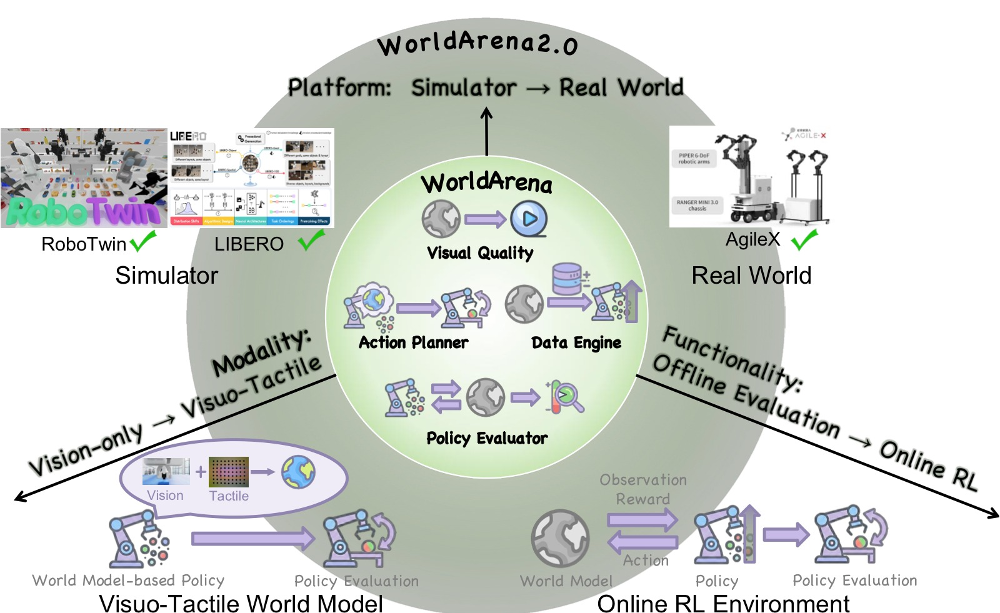
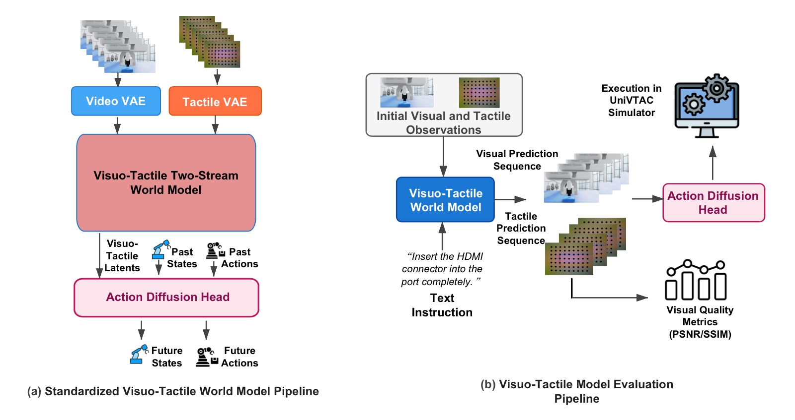
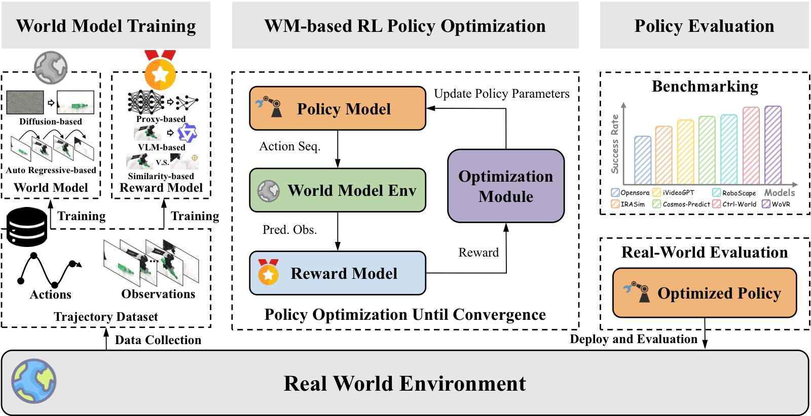
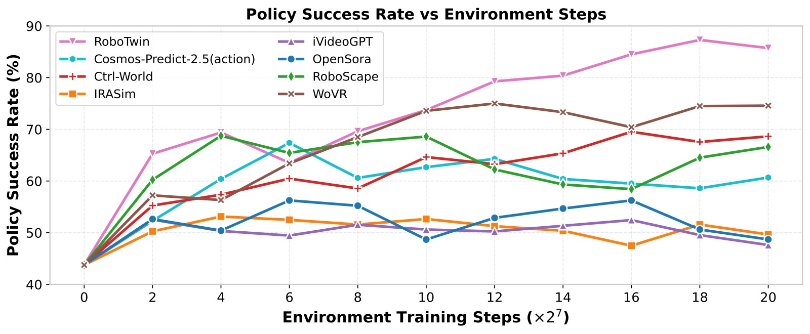
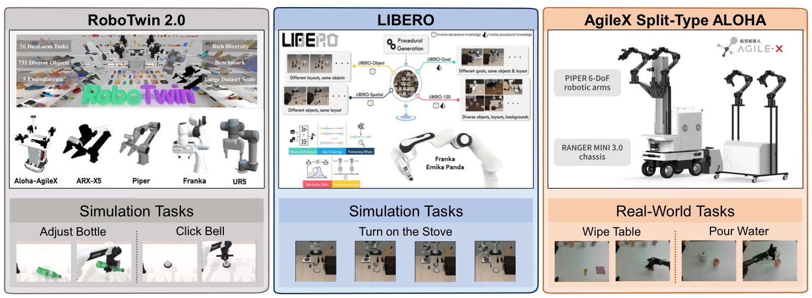

<!-- arxiv: 2605.17912 -->
<!-- venue: NeurIPS 2026 (E&D Track) -->
<!-- tags: 世界模型, 综述, 触觉, 强化学习, 视频生成 -->

# WorldArena 2.0: Extending Embodied World Model Benchmarking on Modality, Functionality and Platform

> **论文信息**
> - 作者：Yu Shang, Yinzhou Tang, Yiding Ma, Zhuohang Li, Lei Jin, Weikang Su, Xin Jin, Zhaolu Wang, Ziyou Wang, Xin Zhang, Haisheng Su, Weizhen He, Wei Wu, Haoyi Duan, Gordon Wetzstein, Xihui Liu, Dhruv Shah, Zhaoxiang Zhang, Zhibo Chen, Jun Zhu, Yonghong Tian, Tat-Seng Chua, Wenwu Zhu, Chen Gao, Yong Li
> - 通讯作者：Yong Li (Tsinghua University)
> - 投稿方向：NeurIPS 2026 (Evaluations & Datasets Track, camera-ready)
> - arXiv ID：2605.17912
> - 代码：https://world-arena.ai
>
> 本文基于以下本地材料整理：
>
> - 论文 TeX 源码：`arXiv-2605.17912v1/`（主文件：`main.tex`）
> - 论文插图：`figs/*.pdf`（9 张图）
> - 本文图片导出目录：`assets/worldarena2/`

---

## 一、核心问题

WorldArena（ICML 2026）建立了具身世界模型的统一评估框架。但它仍有三个关键局限：

1. **模态局限**：仅评估视觉预测，忽略触觉——而触觉对接触-rich 操作的物理交互至关重要
2. **功能局限**：仅评估开环规划/静态策略评估，未测试世界模型能否作为**在线交互式 RL 环境**支持策略优化
3. **平台局限**：仅在仿真中评估，sim-to-real 差距完全未触及

> WorldArena 2.0 从这三个维度系统性扩展了 WorldArena。



*图1：从 WorldArena 到 WorldArena 2.0 的三维扩展——模态（视觉→visuotactile）、功能（开环→在线 RL 环境）、平台（单一仿真→多平台 sim+real）。*

---

## 二、三大扩展

### 2.1 模态扩展：Visuotactile 世界模型

设计了标准化的"触觉注入"管线，将视觉世界模型升级为 visuotactile 世界模型：

```
视觉世界模型 (WoW/Vidar/Wan/Genie)
        │
        ├── Tactile VAE: 编码触觉形变图 → 对齐到视频 latent space
        ├── Visuotactile Two-Stream WM: 视频+触觉同步去噪预测
        └── Action Diffusion Head: 从预测的 visuotactile latent 推断动作
```



*图2：(a) 标准化 visuotactile 世界模型架构——Tactile VAE + 双流去噪 + 动作扩散头；(b) 基于 UniVTAC 模拟器的评估管线。*

基于 UniVTAC 模拟器的两个接触-rich 任务评估：

| 模型 | Tactile PSNR↑ | Tactile SSIM↑ | Insert HDMI | Lift Bottle | Avg. |
|------|:------------:|:------------:|:-----------:|:-----------:|:----:|
| ACT (baseline) | -- | -- | 20 | **80** | **50** |
| Vidar | 13.97 | 0.278 | 70 | 0 | 35 |
| Genie Envisioner | 13.36 | 0.456 | 0 | 0 | 0 |
| **Wan 2.2** | **21.26** | **0.746** | **100** | 0 | **50** |

> Wan 2.2 在 Insert HDMI 上达到 100%——通用视频模型的跨模态知识迁移能力优于专用具身模型。但 Lift Bottle 上所有世界模型都是 0%，因为长时序力控任务需要世界模型目前还不具备的持续规划能力。

### 2.2 功能扩展：世界模型作为 RL 环境



*图3：世界模型作为 RL 环境的标准化框架——世界模型训练 → WM-based RL 策略优化 → 真机评估。支持 proxy-based/VLM-based/similarity-based 三种 reward 模型。*

在 RoboTwin 2.0 上评估 7 个世界模型作为 RL 环境，训练 π₀.₅ 策略。三种 reward 模型设计：

| Reward 类型 | 方法 | 特点 |
|-----------|------|------|
| **Proxy-based** | ResNet 端到端预测 reward | 最稳健 |
| **VLM-based** | Qwen-3.5 细粒度评分 | 未在此任务上微调 |
| **Similarity-based** | 视觉特征相似度 | 依赖观测预测质量 |

RL 训练结果（Click Bell / Adjust Bottle）：

| 方法 | Proxy Click Bell | Proxy Adjust Bottle | VLM Click Bell | Sim Click Bell |
|------|:---------------:|:-------------------:|:------------:|:------------:|
| SFT (baseline) | 43.75 | 55.08 | -- | -- |
| Simulator (oracle) | 87.30 | 78.90 | 87.45 | 87.45 |
| **WoVR** | **75.00** | 67.19 | **69.38** | **72.07** |
| **Ctrl-World** | 69.53 | **70.70** | 66.80 | 69.92 |
| Cosmos-Predict 2.5 | 67.38 | 63.48 | -- | 63.09 |
| RoboScape | 68.75 | 60.74 | -- | 63.48 |

> WoVR 在短时序 Click Bell 上最优，Ctrl-World 在长时序 Adjust Bottle 上最优。世界模型训练的 RL 策略虽不及模拟器 oracle，但 top model 已接近。



*图4：Click Bell 任务中，策略成功率随 RL 环境交互步数的增长曲线。几乎所有世界模型都能在不同程度上引导策略改进。*

### 2.3 平台扩展：跨具身 Sim-to-Real



*图5：三个测试平台——RoboTwin 2.0（域随机化双臂操作）、LIBERO（结构化知识迁移诊断）、AgileX Split-Type ALOHA（真实物理部署）。覆盖从域随机化到结构诊断到真实物理的完整评估谱系。*

跨平台 Data Engine + Action Planner 成功率：

| 模型 | RoboTwin Task 1/2 | LIBERO Engine | Real Task 1/2 |
|------|:-----------------:|:-----------:|:-------------:|
| Vidar | 13/53 (DE), 2/19 (AP) | 22 (DE) | 40/0 (DE), 30/10 (AP) |
| GigaWorld | 2/13, 6/19 | 0 | 0/0 |
| TesserAct | 1/35, 1/35 | 34 (DE) | 0/0 |
| CogVideoX | 3/28, 8/16 | 0 (DE) | 10/10 (DE), 0/50 (AP) |

关键发现：
- **Sim-to-Real 鸿沟巨大**：仿真排名与真机表现相关性弱，仿真 performance 不能预测真实部署效果
- 真机上仅少数模型有非零成功率，全部远低于实际部署要求

---

## 三、关键洞察与技术亮点

1. **通用视频模型的跨模态优势**：Wan 2.2 在触觉预测上超过专用具身模型（SSIM 0.746 vs 0.278/0.456），说明大规模预训练的跨模态知识对齐触觉模态更有效。

2. **世界模型作为 RL 环境已初步可行**：WoVR 训练的 π₀.₅ 达到 75%（vs oracle 87%），说明世界模型驱动的 RL 训练正接近实用门槛。

3. **Proxy-based reward 最稳健**：VLM reward 未微调时精度不足，similarity reward 依赖预测质量，端到端 proxy reward 在三个设置中表现最一致。

4. **Sim-to-Real 鸿沟首次被量化**：跨平台相关性分析揭示——感知质量（视觉/运动/3D）跨平台相关性高，但内容一致性和可控性弱，功能性能的相关性更差。真机评估不可替代。

---

## 四、与 WorldArena v1 的关系

| 维度 | WorldArena (ICML 2026) | WorldArena 2.0 (NeurIPS 2026) |
|------|----------------------|---------------------------|
| 模态 | 视觉 | 视觉 + 触觉 |
| 功能 | 数据引擎、策略评估器、动作规划器 | + 在线 RL 环境 |
| 平台 | RoboTwin 2.0 | RoboTwin 2.0 + LIBERO + 真机 ALOHA |
| 评估模型数 | 14 | 12 |

---

## 五、局限性

1. **触觉评估基于仿真**：UniVTAC 的触觉信号可能不完全反映真实接触动力学的多样性
2. **RL 环境评估覆盖有限**：仅 2 个任务、3 种 reward 设计，长时序/多智能体场景未评估
3. **真机仅 ALOHA 一个平台**：不同机器人形态的泛化性未验证
4. **长时序世界模型能力仍不足**：Lift Bottle 任务上所有世界模型 0%，揭示了持续力控+长时序规划的根本性瓶颈
