<!-- arxiv: 2603.19201 -->
<!-- venue: IEEE T-RO 2026（投稿中） -->
<!-- tags: 触觉, WAM, 世界模型, 机器人操作, 表征学习 -->

# OmniVTA: Visuo-Tactile World Modeling for Contact-Rich Robotic Manipulation

> **论文信息**
> - 作者：Yuhang Zheng, Songen Gu, Weize Li, Yupeng Zheng, Yujie Zang, Shuai Tian, Xiang Li, Ce Hao, Chen Gao, Si Liu, Haoran Li, Yilun Chen, Shuicheng Yan, Wenchao Ding
> - 通讯作者：Yupeng Zheng, Shuicheng Yan, Wenchao Ding (TARS Robotics / NUS / CASIA)
> - 投稿方向：IEEE Transactions on Robotics
> - arXiv ID：2603.19201
> - 项目：https://mrsecant.github.io/OmniVTA
>
> 本文基于以下本地材料整理：
>
> - 论文 TeX 源码：`arXiv-2603.19201v2/`（主文件：`main.tex`，按 `sections/` 分章节）
> - 论文插图：`fig/*.pdf/png`（16 张图）
> - 本文图片导出目录：`assets/omnivta/`

---

## 一、核心问题

接触-rich 操作（擦拭、削皮、切割、装配等）需要精确感知接触力、摩擦变化和状态转移——这是纯视觉无法可靠推断的。当前 visuotactile 研究面临两个根本瓶颈：

1. **数据瓶颈**：现有数据集规模小、任务覆盖窄。相比视觉操作数据集动辄数万条轨迹，visuotactile 数据集往往只有几百条。
2. **方法瓶颈**：现有方法将触觉信号视为被动观测附加在策略输入中，而非主动建模接触动力学或支持闭环控制。

> OmniVTA 同时解决这两个瓶颈：构建了 OmniViTac——21,000+ 轨迹的大规模 visuotactile 数据集，并提出了基于世界模型的 Slow-Fast 分层操作框架。

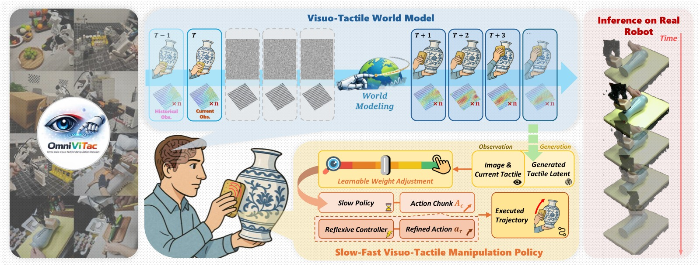

*图1：OmniVTA 总览。(左) OmniViTac 数据集——21,000+ 条 visuotactile-action 对齐轨迹，86 个任务，按 6 种物理交互模式组织；(中) OmniVTA 框架——TactileVAE + Visuo-Tactile World Model + Adaptive Fusion Policy + 60Hz Reflexive Controller；(右) 真机实验在所有 6 个类别上超越 baseline。*

---

## 二、OmniViTac 数据集

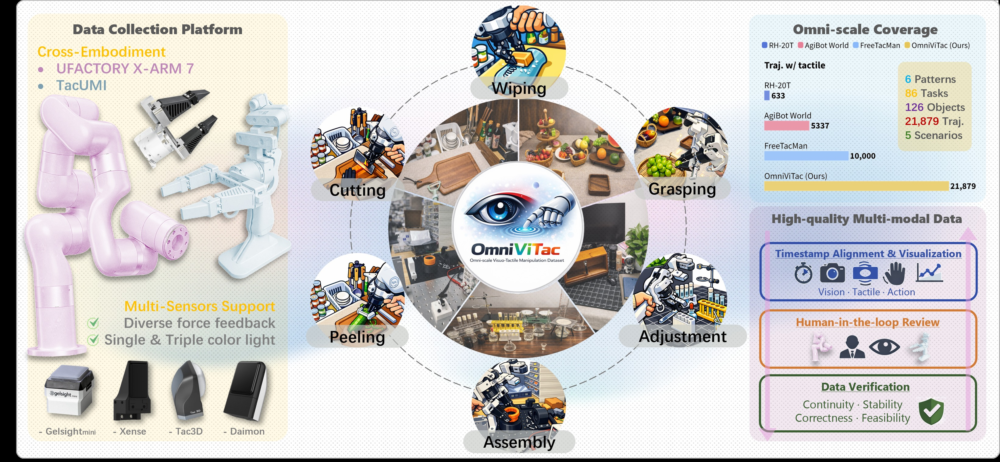

*图2：OmniViTac 数据集覆盖 100+ 物体、86 个接触-rich 任务，按 6 种物理交互模式分类——Wipe、Peel、Cut、Assembly、Grasp、Adjustment。每类 5-6 个物体，各 150 条轨迹。*

### 2.1 数据规模

| 维度 | 规模 |
|------|------|
| 总轨迹数 | 21,000+ |
| 任务数 | 86 |
| 物体数 | 100+ |
| 交互模式 | 6（Wipe / Peel / Cut / Assembly / Grasp / Adjustment） |
| 传感器 | TacUMI + xArm7, 15Hz 视觉 + 60Hz 触觉（Xense, 35×20×3 marker displacement） |

### 2.2 两条结构性质

分析数据集揭示了两条指导 OmniVTA 架构设计的触觉信号性质：

1. **空间局部性**（Spatial Locality）：触觉信号在接触点周围变化剧烈，远离接触点几乎不变。这启发了 TactileVAE 使用 INR 解码器建模连续形变场。

2. **接触驱动动力学**（Contact-Driven Dynamics）：触觉信号主要在接触状态变化时活跃，非接触阶段几乎静止。这启发了 Dynamic-Aware Loss 强调高频接触变化区域。

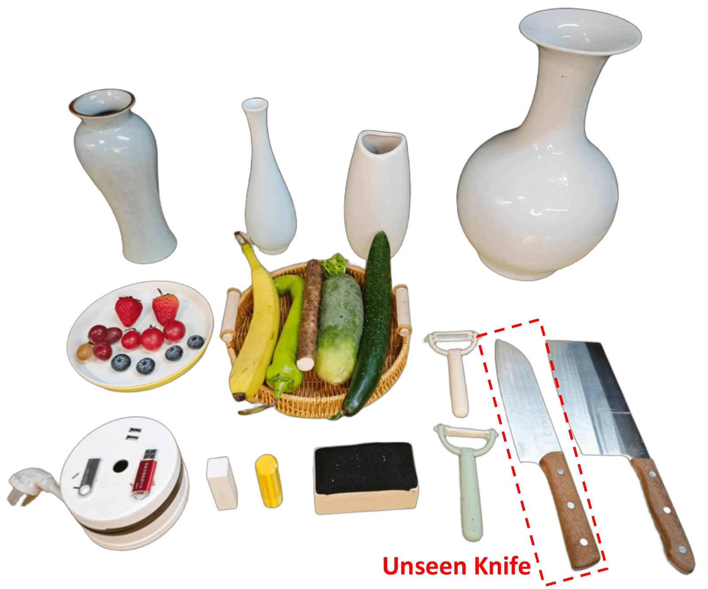

*图3：六类操作任务中使用的训练和评估物体。每类包含 4-5 种物体用于训练，2-4 种用于操纵评估。*

---

## 三、OmniVTA 方法

### 3.1 系统架构：Slow-Fast 分层策略

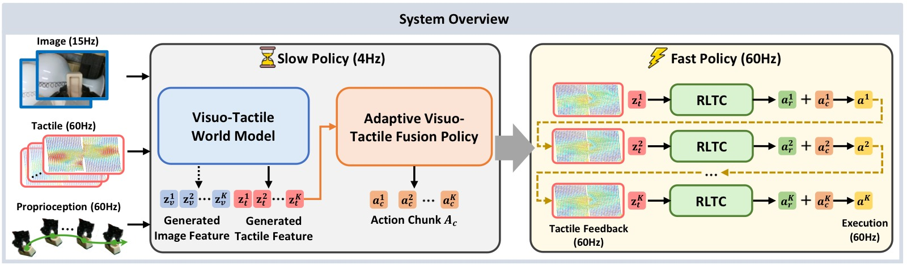

*图4：OmniVTA 的分层 slow-fast 架构。Slow Policy 包含 TactileVAE + Visuo-Tactile World Model + Adaptive Fusion Policy；Fast Policy 为 60Hz Reflexive Latent Tactile Controller。最终动作为两者的加权求和。*

OmniVTA 将操作显式分解为 Slow Planning（15Hz）和 Fast Reflexive Control（60Hz）：

$$\mathbf{a}_{\mathrm{final}} = \mathbf{a}_{\mathrm{slow}} + \alpha \cdot \Delta\mathbf{a}_{\mathrm{fast}}$$

```
┌─────────────────────────────────────────────────────────────────┐
│                        OmniVTA Pipeline                           │
├─────────────────────────────────────────────────────────────────┤
│                                                                  │
│  ┌─────────────────── SLOW POLICY (15Hz) ───────────────────┐   │
│  │                                                           │   │
│  │  Vision (RGB, 15Hz)  ──► SD-VAE ──► z_v                  │   │
│  │  Tactile (60Hz)      ──► TactileVAE ──► z_t (sparse)     │   │
│  │                                                           │   │
│  │  ┌─────────────────────────────────────────────────────┐ │   │
│  │  │        Visuo-Tactile World Model (VTWM)              │ │   │
│  │  │  ┌──────────────┐   ┌──────────────┐               │ │   │
│  │  │  │ Visual Stream│   │ Tactile Stream│               │ │   │
│  │  │  │ (DiT)        │   │ (DiT)         │               │ │   │
│  │  │  │ predict z_v  │   │ predict z_t   │               │ │   │
│  │  │  └──────┬───────┘   └──────┬────────┘               │ │   │
│  │  │         └──────────────────┘                          │ │   │
│  │  │     Shared Multimodal Conditioner                     │ │   │
│  │  │     (vision + tactile + action 2D projection)         │ │   │
│  │  └─────────────────────────────────────────────────────┘ │   │
│  │                           │                               │   │
│  │                           ▼                               │   │
│  │  ┌─────────────────────────────────────────────────────┐ │   │
│  │  │    Adaptive Visuo-Tactile Fusion Policy (AFP)        │ │   │
│  │  │    ┌──────────────────┐   ┌──────────────────┐     │ │   │
│  │  │    │ LTD Encoder      │   │ Gating Mechanism  │     │ │   │
│  │  │    │ (observed-pred   │──►│ adaptive balance  │     │ │   │
│  │  │    │  tactile diff)   │   │ visual ↔ tactile  │     │ │   │
│  │  │    └──────────────────┘   └──────────────────┘     │ │   │
│  │  └─────────────────────────────────────────────────────┘ │   │
│  │                           │                               │   │
│  │                           ▼                               │   │
│  │              Action Chunk (6 steps @ 15Hz)                │   │
│  └───────────────────────────────────────────────────────────┘   │
│                              │                                    │
│  ┌─────────── FAST POLICY (60Hz) ───────────────────────────┐   │
│  │  Reflexive Latent Tactile Controller (RLTC)               │   │
│  │  Δa = MLP( predicted_tac_latent - observed_tac_latent )   │   │
│  │  → corrective delta actions @ 60Hz                        │   │
│  └───────────────────────────────────────────────────────────┘   │
│                              │                                    │
│         a_final = a_slow + α × Δa_fast                            │
└─────────────────────────────────────────────────────────────────┘
```

### 3.2 TactileVAE：隐式神经表示触觉编码器

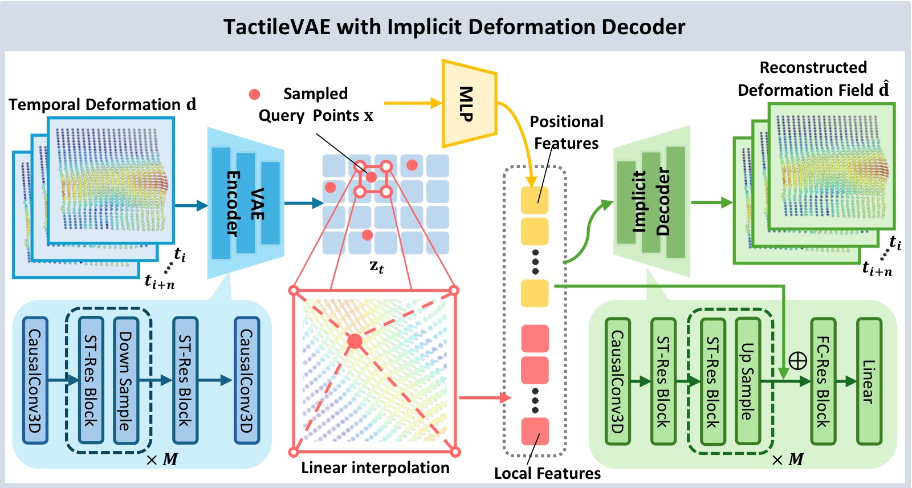

*图5：TactileVAE 架构。编码器：因果 3D 卷积（project-in + M 个下采样模块 + project-out）；解码器：INR MLP，将空间坐标 + 局部潜特征映射为连续 3D 形变向量。*

**动机**：替代高分辨率触觉图像，使用 3D marker displacement（如 Xense: 35×20×3）作为输入——捕捉接触形变同时保持低分辨率。120 万触觉样本预训练（来自 20% 操作轨迹 + 额外 10 个物体的交互数据）。

**编码器**：因果 3D 卷积 VAE
- Project-in → M 个下采样模块 → Project-out（均为 causal 3D conv）
- 因果约束：时刻 t 的特征仅依赖当前及过去观测，确保训练-推理一致性
- 输出：$\frac{H}{s} \times \frac{W}{s} \times C$ 的潜特征图（$s = 2^M$ 为空间下采样因子）

**解码器**：INR（隐式神经表示）
$$\mathbf{d}(\mathbf{x}) = \mathcal{D}_{\theta}(\gamma(\mathbf{x}), \Phi(\mathbf{z}_t, \mathbf{x}))$$

- $\mathbf{x} \in \mathbb{R}^2$：空间坐标
- $\mathbf{z}_t$：潜特征图
- $\gamma(\cdot)$：位置编码
- $\Phi(\mathbf{z}_t, \mathbf{x})$：空间插值提取局部特征
- $\mathcal{D}_{\theta}$：MLP 解码器，预测 3D 形变 $\mathbf{d}(\mathbf{x}) \in \mathbb{R}^3$

**训练损失**：
$$\mathcal{L}_{\text{TacVAE}} = \|\mathbf{d}(\mathbf{x}) - \hat{\mathbf{d}}(\mathbf{x})\|_2^2 + \lambda_{\mathrm{KL}} \mathcal{L}_{\mathrm{KL}}, \quad \lambda_{\mathrm{KL}}=10^{-6}$$

**关键消融发现**（从 t-SNE 可视化）：
- 去掉 INR 解码器 → 跨传感器和力模式的聚类消失
- 去掉位置编码 → 聚类退化
- 隐式解码器 + 位置编码 = 跨传感器（GelSight Mini/Tac3D/Xense）和力模式（press/twist/slide）的清晰聚类

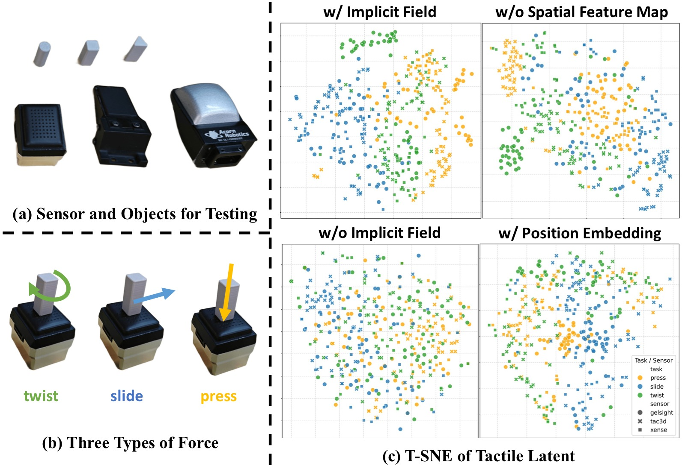

*图6：TactileVAE 消融。(a) 测试传感器和物体；(b) 三种力加载模式；(c) t-SNE 可视化——完整模型在跨传感器设置下产生按力模式清晰聚类的特征，而去掉位置编码或 INR 解码器的变体无法产生良好分离的聚类。*

### 3.3 Visuo-Tactile World Model (VTWM)

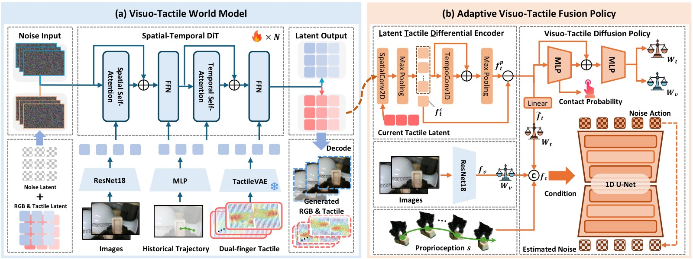

*图7：(a) VTWM 双流架构——视觉和触觉分支使用独立的时空 DiT，共享条件编码器对齐；(b) Adaptive Fusion Policy——LTD Encoder 编码观察-预测触觉差分，Gating 机制自适应平衡模态。*

**Two-Stream World Model**：
- 视觉流：SD-VAE 压缩图像 → $z_v$，送入时空 DiT
- 触觉流：TactileVAE 压缩形变 → $z_t $，送入独立的时空 DiT
- 两流并行去噪，共享条件向量（来自 Multimodal Conditioner）

**扩散目标**：
$$\mathcal{L}_{\text{diffusion}} = \mathbb{E}_{\mathbf{z}_o, \boldsymbol{\epsilon}, t}\left[\sum_{i=1}^K (1-m_i) \odot \|\epsilon_i - \boldsymbol{\epsilon}_\theta(\mathbf{z}_o, t)_i\|_2^2\right]$$

其中 mask $m$ 提供时序条件（历史帧 clean → 预测帧 pure noise）。

**Multimodal Observation Conditioner**：
- 分别对视觉、触觉、动作进行特征提取和时序聚合
- 动作表示为末端执行器 3D 位姿在 2D 图像平面的投影 → 提升位置变化鲁棒性
- 三模态融合为共享线性投影空间 → 统一条件向量注入两流

**Dynamic-Aware Weighted Loss**：
$$w_{\text{dyn}^i} = \operatorname{resize}\left(\operatorname{clip}_{[0,1]}(\|X_{i+1} - X_i\|_2)\right)$$

$$w_{\text{amp}^i} = \operatorname{resize}\left(\operatorname{clip}_{[0,1]}(\|X_i\|_2)\right)$$

$$\mathcal{L}_{\text{dyn}} = \mathbb{E}\left[\sum_{i=2}^K w_{\text{dyn}}^i \odot (1-m_i) \odot \|\epsilon_i - \boldsymbol{\epsilon}_\theta(\mathbf{z}_o, t)_i\|_2^2\right]$$

- 动态权重图基于局部时序差分 → 强调快速变化区域
- 幅值权重图基于触觉响应幅值 → 强调强接触区域
- 两项 loss 权重均设为 1.0

**推理优化**：不生成视觉观测——世界模型仅预测未来触觉信号，实现更高频率 rollout。

### 3.4 Adaptive Visuo-Tactile Fusion Policy (AFP)

**LTD (Latent Tactile Differential) Encoder**：
- 编码"当前观察到触觉 - 世界模型预测触觉"的**差分信号**
- 相比于直接拼接原始触觉值，差分表示让策略感知接触状态**变化**而非绝对值
- 消融验证：LTD Encoder 显著优于简单拼接

**Gating Mechanism**：
$$\mathbf{f}_{\mathrm{fused}} = \mathbf{g} \odot \mathbf{f}_v + (1 - \mathbf{g}) \odot \mathbf{f}_t$$

- 门控权重 $\mathbf{g}$ 由当前视觉和触觉特征联合预测
- 接触阶段触觉权重高，非接触阶段视觉权重高
- 消融验证：自适应门控优于固定融合权重

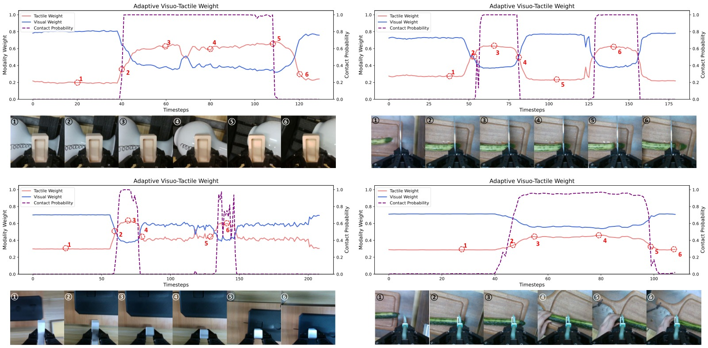

*图8：门控权重的时序演化。接触阶段触觉权重上升，非接触阶段视觉权重主导。门控权重与接触状态高度相关。*

### 3.5 Reflexive Latent Tactile Controller (RLTC)

**核心思想**：将世界模型预测的触觉信号作为"期望接触状态"，实际触觉作为反馈，在 latent space 中计算偏差并生成 60Hz 修正动作。

$$\Delta \mathbf{a}_{\tau} = \text{MLP}\left(\mathbf{z}_t^{\text{pred}} - \mathbf{z}_t^{\text{obs}}, \mathbf{z}_t^{\text{obs}}, \mathbf{s}_{\tau}\right)$$

**关键效果**：
- OmniVTA 平均切向形变 0.35（最大 0.72）——维持可靠接触
- RDP 平均切向形变 0.56（最大 1.1）——产生过大接触力，损坏传感器
- RLTC 在扰动实验中贡献约 20pp 成功率提升

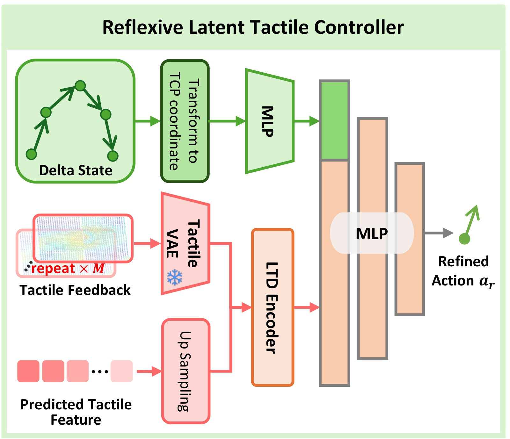

*图9：RLTC 在扰动下的恢复行为。当物体被突然下移破坏接触时，RLTC 在一个生成块内恢复接触状态。红线=预测，蓝线=真值。*

---

## 四、实验与结果

### 4.1 真机操作性能

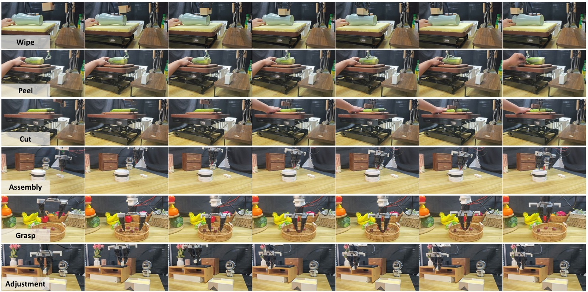

*图10：六类任务的真机 rollout 可视化。每类展示三个关键帧——初始、交互、完成。*

**完整实验结果表**（O=物体多样性, G=泛化, P=扰动鲁棒性，成功率 %）：

| 方法 | Wipe(O/G/P) | Peel(O/G/P) | Cut(O/G/P) | Assembly(O/G/P) | Grasp(O) | Adjust(O/G) |
|------|:---:|:---:|:---:|:---:|:---:|:---:|
| DP | 12/5/0 | 6/0/0 | 28/10/0 | 10/0/5 | 20 | 0/0 |
| DP+tactile | 36/28/0 | 32/20/8 | 33/15/13 | 30/10/10 | 48 | 25/15 |
| KineDex | 40/25/0 | 24/13/5 | 38/30/20 | 30/15/15 | 65 | 30/20 |
| ForceMimic | 33/20/0 | 27/18/0 | 50/25/5 | 35/15/10 | 60 | 10/0 |
| RDP | 50/38/42 | 48/36/45 | 65/50/43 | **60/50**/35 | **88** | 50/50 |
| OmniVTA w/o RLTC | 66/40/25 | 40/30/20 | 50/50/20 | 40/35/20 | 70 | 40/30 |
| **OmniVTA** | **80/58/60** | **55/48/63** | **85/83/60** | 60/**50/40** | **90** | **65/65** |

> 3 种评估 × 6 个任务 = 15 个指标，OmniVTA 在 13 个上排第一。Assembly 的物体多样性上 RDP 持平（60 vs 60）。

### 4.2 世界模型预测

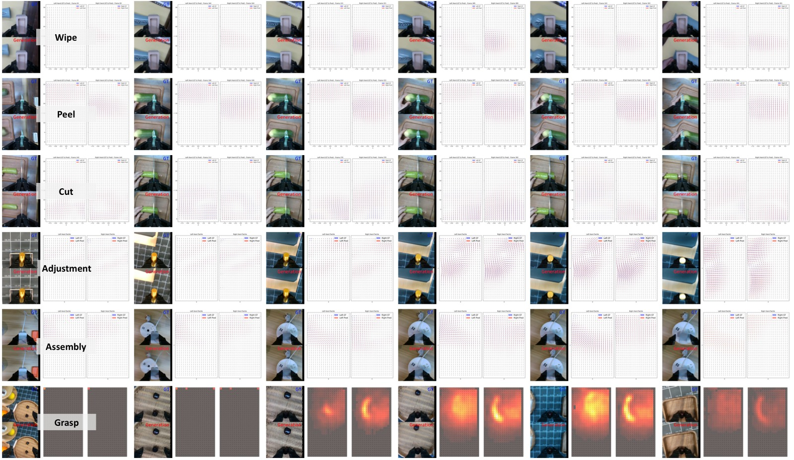

*图11：VTWM 在六类任务上的预测可视化。红色箭头=预测切向形变，蓝色=真值。模型准确预测接触区域的方向和幅值。*

| 对比维度 | 结果 |
|---------|------|
| vs exUMI / UVA / ForceMimic | 在所有预测 horizon（8/16/24 帧）上超越 baseline |
| 联合生成视觉特征 | 提升触觉预测精度——视觉提供互补全局动力学线索 |
| 2D vs 3D vs Relative Action | 2D 动作表示（末端图像平面投影）泛化性最优 |
| Dynamic-Aware Loss | 对高频触觉变化预测精度有明显增益 |

### 4.3 TactileVAE 重建质量

| 方法 | L2 ↓ (全部形变场) | Cos ↑ (非零形变区域) |
|------|:---------------:|:-----------------:|
| PCA | 基线 | 基线 |
| Point Cloud AE | 中等 | 中等 |
| **TactileVAE (ours)** | **最优** | **最优** |

> 跨 6 种交互模式均一致最优。INR 解码器对跨传感器泛化至关重要。

### 4.4 组件消融

| 消融 | 关键发现 |
|------|---------|
| 预测触觉 vs 仅当前触觉 | 预测未来触觉显著提升策略性能 |
| LTD Encoder vs 简单拼接 | LTD 编码差分信号 > 直接拼接原始触觉 |
| Gating vs 固定权重 | 自适应门控 > 固定融合权重 |
| RLTC vs w/o RLTC | 60Hz 反射控制器在所有扰动任务上约 +20pp |
| 2D Action vs 3D Absolute vs 3D Relative | 2D 动作表示泛化性最优 |

### 4.5 扰动恢复

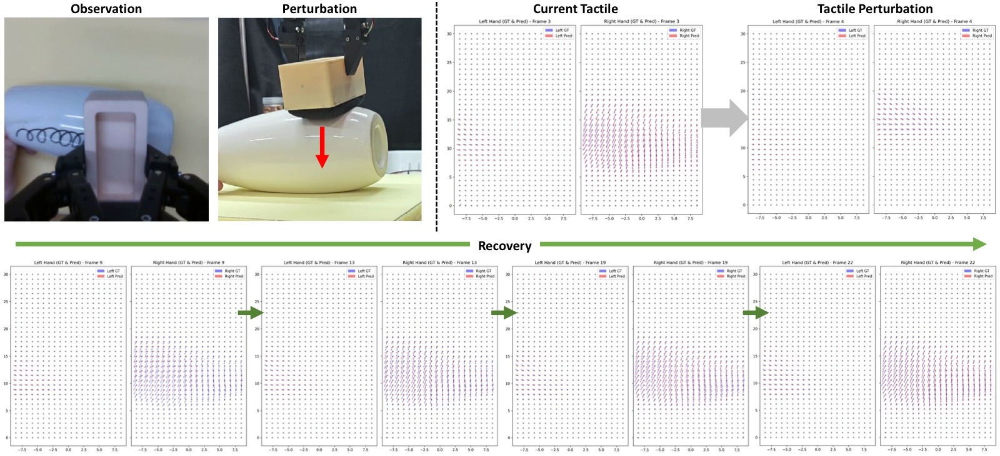

*图12：接触扰动与恢复。第一行：物体被下推，触觉信号转为无接触状态。第二行：在一个生成块内恢复到接触状态。*

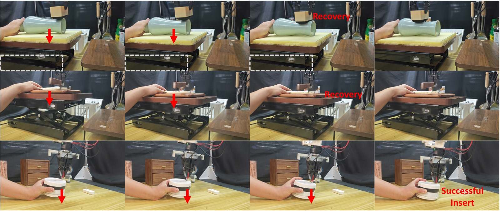

*图13：多步扰动下的触觉预测与恢复。模型展现出一定程度的扰动恢复能力。*

---

## 五、关键洞察与技术亮点

1. **触觉信号的物理性质驱动架构设计**：空间局部性 → INR 解码器；接触驱动动力学 → Dynamic-Aware Loss。这不是凭空设计的 trick，而是从数据分析中推导出的架构选择。

2. **世界模型在推理时不生成视觉**：仅预测未来触觉信号供策略和控制器使用——这是被低估的效率优化。视觉生成是最耗时的部分，跳过它使世界模型可以 support 更高频率的推理。

3. **预测触觉作为"期望接触状态"**：RLTC 将世界模型预测的触觉作为控制目标——这是一种创新的 reflexive control 范式：不需要手工设计期望接触力轨迹，世界模型自动从数据中学习。

4. **LTD Encoder 的差分设计**：编码"观察-预测"的触觉差异而非绝对值——策略不需要知道绝对接触力是多少，只需要知道偏离了多少。

5. **2D 动作表示优于 3D**：将末端执行器位置投影到图像平面作为动作条件——与视觉观测天然对齐，提供位置变化的 invariance。

6. **OmniViTac 是当前最大的 visuotactile 数据集**：21k+ 轨迹 × 6 类交互模式 = 未来工作的坚实基础。

---

## 六、代码实现解读

### 训练管线

| 阶段 | 组件 | 数据 | 配置 |
|------|------|------|------|
| 1 | TactileVAE | 120 万触觉样本 (20% trj + 10 extra objects) | 8×A100, 50 epochs, λ_KL=1e-6 |
| 2 | VT World Model | 每类 5-6 物体, 各 150 轨迹, 90/10 split | AdamW lr=1e-4, 100k steps, grad clip 0.1 |
| 3 | Fusion Policy | 同上 + combined across categories | 250k steps, λ_ct=0.2 |
| 4 | RLTC | 同上 | 独立训练 |

### 推理流程

```
t ─► TactileVAE(obs_tac) → z_t
  │ SD-VAE(obs_vis) → z_v
  │
  ├─► VTWM(z_v, z_t, action_2D) → predicted_z_t (future)
  │
  ├─► LTD_Encoder(observed_z_t - predicted_z_t) → tactile_diff_features
  │
  ├─► Gating(visual_features, tactile_diff_features) → fused_features
  │
  ├─► Diffusion Policy Head → a_slow (6-step chunk @ 15Hz)
  │
  └─► RLTC(predicted_z_t - observed_z_t) → Δa (60Hz correction)
      a_final = a_slow + α × Δa
```

### 关键参数

| 参数 | 值 |
|------|-----|
| 视觉频率 | 15Hz (当前帧 + 前 1 帧, 共 2 帧) |
| 触觉频率 | 60Hz (8 帧/时间窗口, 对齐到视觉窗口) |
| 动作输出 | 15FPS chunk（预测 6 步, 插值到 60Hz） |
| Xense 触觉分辨率 | 35×20×3 marker displacement |
| 世界模型预测 horizon | 24 触觉帧 (对应 6 个 latent frames) |

---

## 七、局限性

1. 仅限单臂平行夹爪——未涉及双臂或灵巧手设置
2. 世界模型规模和数据多样性有限——更大规模预训练的效果未知
3. 跨具身迁移：触觉表示和世界模型能否迁移到不同机器人形态尚未验证
4. 触觉评估基于 Xense，不同触觉传感器的泛化性待验证

---

## 八、关键概念速查

| 概念 | 解释 |
|------|------|
| **TactileVAE** | 因果 3D 卷积编码器 + INR 解码器的触觉 VAE，建模连续形变场 |
| **VTWM** | Visuo-Tactile World Model，双流 DiT 并行预测视觉+触觉未来 |
| **Dynamic-Aware Loss** | 基于触觉时序差分+响应幅值的加权扩散 loss |
| **LTD Encoder** | 编码观察-预测触觉差分，让策略感知接触状态变化 |
| **Gating** | 自适应平衡视觉/触觉特征权重的门控融合 |
| **RLTC** | Reflexive Latent Tactile Controller，60Hz 残差修正 |
| **INR** | Implicit Neural Representation，建模连续形变场的解码器 |
| **OmniViTac** | 21,000+ 轨迹的 visuotactile-action 对齐大规模数据集 |
