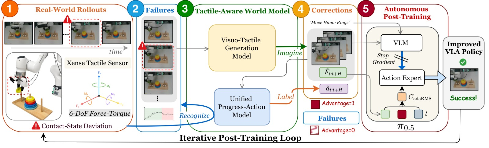
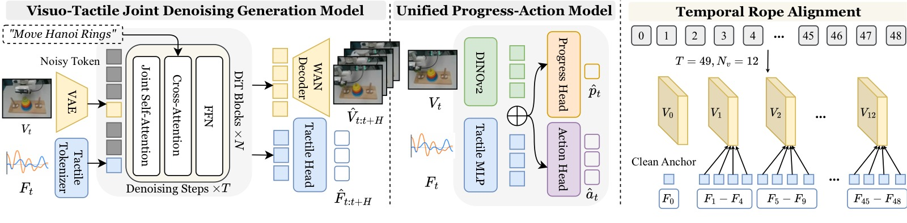
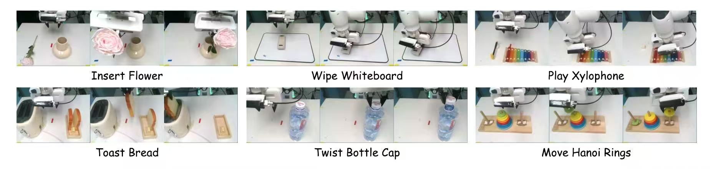
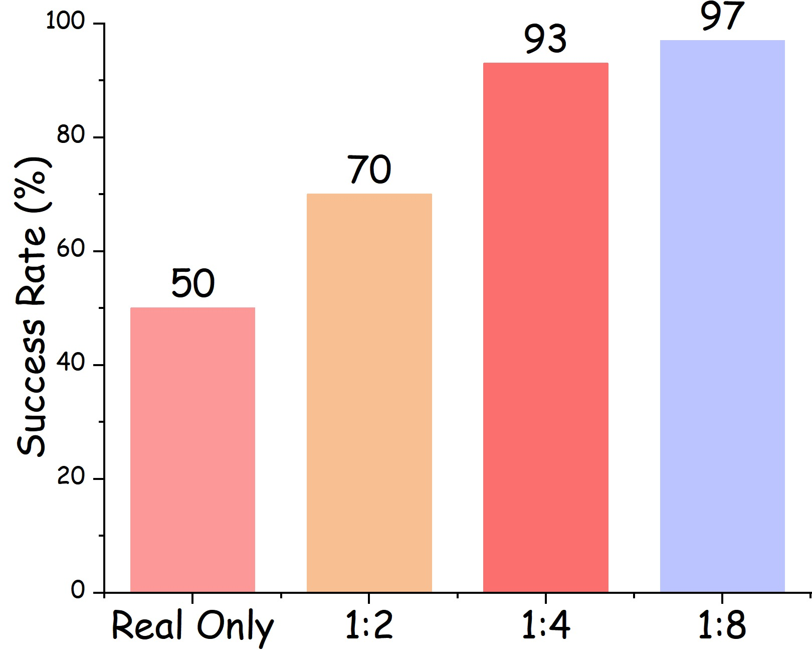

<!-- arxiv: 2607.02840 -->
<!-- venue: CoRL 2026 -->
<!-- tags: WAM, 触觉, VLA, 世界模型, 知识蒸馏 -->

# TACO: TActile World Model as a Self-COrrector for Scalable VLA Post-Training

> **论文信息**
> - 作者：Yuxing Qin, Shuai Tian, Yupeng Zheng, Yuhang Zheng, Kechun Xu, Ce Hao, Yujie Zang, Weize Li, Haoran Li, Wenchao Ding, Dongbin Zhao
> - 通讯作者：Haoran Li, Wenchao Ding (CASIA / TARS Robotics)
> - 投稿方向：CoRL 2026（preprint）
> - arXiv ID：2607.02840
>
> 本文基于以下本地材料整理：
>
> - 论文 TeX 源码：`arXiv-2607.02840v1/`（主文件：`main.tex`，按 `sec/` 分章节）
> - 论文插图：`image/*.pdf/png/jpg`（14 张图）
> - 本文图片导出目录：`assets/taco/`

---

## 一、核心问题

VLA 模型在接触-rich 操作中的失败往往是局部的——对齐偏差、力不足、滑移——而非任务级语义错误。从视觉看，机器人似乎在正确的位置；但触觉上说，接触已经失败了。

**规模化纠正的挑战**：
- 人工标注每一段失败 + 提供正确纠正 → 成本太高
- 纯视觉世界模型想象纠正 → 可能"看起来对但接触不对"
- 触觉世界模型可以想象 contact-consistent 的纠正——**但如何将这个"想象"转化为可执行的动作监督来训练 VLA？**

> TACO = TActile world model as self-COrrector。三层循环：Recognize（进度模型找出失败临界状态）→ Imagine（visuo-tactile 世界模型生成局部纠正片段）→ Label（标注纠正动作）→ Post-train VLA with knowledge-insulated adaptation。



*图1：TACO 的 Recognize-Imagine-Label 循环 + Knowledge-Insulated 触觉适配后训练。将真实失败转化为想象触觉纠正，迭代改进 VLA。*

---

## 二、核心方法

### 2.1 触觉感知世界模型



*图2：(左) Visuo-Tactile Generation Model——Wan2.2-TI2V-5B 联合去噪视频+力信号；(右) Unified Progress-Action Model——DINOv2 视觉 + MLP 力感知，联合预测纠正动作和任务进度。*

**Visuo-Tactile Generation Model**：
- 基于 Wan2.2-TI2V-5B，先在大规模机器人数据上微调视频 fidelity，再在 contact-rich 演示上微调
- 联合去噪：视频 latent $X^v$ + 力序列 $F \in \mathbb{R}^{T \times 12}$（12 维 = 左右指各 6-DoF）
- 力 tokenization：$X^f = T_\eta(F) \in \mathbb{R}^{T \times d}$，与视频 token 拼接为 $X = [X^v; X^f]$
- **Temporal RoPE Alignment**：力 token 对齐到视频 latent 时间轴 $\rho(i) = \mathrm{round}(\frac{i}{T-1}(f-1))$
- **First-Frame Force Anchor**：保持 $F_0$ 干净作为参考，减少接触状态歧义

联合 flow-matching loss：
$$\mathcal{L}_{\mathrm{joint}} = \|u_\psi^v - (\xi_1^v - \xi_0^v)\|_2^2 + \lambda_f \|u_\psi^f - (\xi_1^f - \xi_0^f)\|_2^2$$

**Unified Progress-Action Model**：
- 视觉通路：DINOv2 + 方向感知解码器（空间 grounding）
- 触觉通路：MLP 编码归一化 12D 力-力矩
- 联合嵌入：$[z_t^v; z_t^f]$ → 动作头 $\hat{a}_t = h_a([z_t^v; z_t^f])$ + 进度头 $\hat{p}_t = \sigma(h_p([z_t^v; z_t^f]))$
- 训练目标：$\mathcal{L}_{\mathrm{UPA}} = \mathrm{SmoothL1}(\hat{a}_t, a_t) + m_t \|\hat{p}_t - p_t\|_2^2$

进度标签 $p_t$ 来自人工标注的任务阶段——每帧赋一个归一化的完成值（0.0→1.0），提供密集的阶段感知监督。

### 2.2 Recognize-Imagine-Label 循环

```
For iteration k = 0, 1, 2, ...:
  1. Deploy π_θ^(k) → collect rollout τ
  2. Recognize: Progress model → find states where p_t stagnates/declines
     Correction anchors = {t: p_t - p_{t-w} < ε, or p_t < threshold}
  3. Imagine: For each anchor state (I_t, F_t):
     → Tactile-aware world model generates correction segment
     → Output: visual-tactile segment + action trajectory
  4. Label: Progress-action model labels imagined segments
     → Each frame: (a_t, p_t) pairs
  5. Select positive advantage segments:
     Δ = p_end - p_start > 0 → add to corrective dataset D_c
  6. Post-train: π_θ^(k+1) = π_θ^(k) + knowledge-insulated adaptation on D_c
```

**关键设计选择**：
- 识别"进度停滞"而非"完全失败"——更早、更多的纠正机会
- Advantage 条件过滤——只选择想象纠正后进度改善的片段
- 迭代——两轮后收益递减（+28% → +4%）

### 2.3 Knowledge-Insulated (KI) 触觉适配

**问题**：直接端到端 post-training 会覆盖预训练的视觉-语言先验 → 策略在见过的纠正上过拟合，但泛化到新物体时退化。

**KI 方案**：
1. 冻结 VLA 的视觉-语言 backbone
2. 仅在 attention 层之间插入轻量触觉 adapter（类似 LoRA 但用于触觉特征注入）
3. 训练时条件于 advantage——$a \sim \pi_\theta(\cdot \mid o, \ell, \text{adv})$，鼓励策略模仿高 advantage 的纠正动作

**消融验证**：
- TACO w/o KI（直接端到端 post-training）：SR 从 0.66 → 0.49（**退化**）
- TACO with KI：SR 从 0.38 → 0.66（**+74%**）
- 差距达 17 个百分点——证明 KI 不是锦上添花而是必要条件

---

## 三、实验

### 3.1 任务与设置



6 个真机接触-rich 任务，基于 π₀.₅ base policy：

| 任务 | 接触类型 | Base SR |
|------|---------|:------:|
| Insert Flower | 紧密对齐，柔顺力 | 0.50 |
| Wipe Whiteboard | 持续接触，区域覆盖 | 0.51 |
| Twist Bottle Cap | 旋转力控，多步 | 0.45 |
| Play Xylophone | 冲击力控，精确定位 | 0.46 |
| Toast Bread | 滑动接触，加热区域 | 0.30 |
| Move Hanoi Rings | 精细操作，多步重排 | 0.08 |

### 3.2 核心结果

| 方法 | SR | Contact Steps |
|------|:--:|:------------:|
| Base Policy | 0.38 | 185.5 |
| **Iteration 1** | | |
| Filtered BC | 0.41 | 148.8 |
| TACO (w/o KI) | 0.49 | 154.8 |
| TACO (w/ KI) | **0.66** | 141.8 |
| **Iteration 2** | | |
| TACO (w/ KI) | **0.70** | 131.0 |

> Base → Iter2: **+32% 绝对提升，+84% 相对提升**。Contact Steps 从 185.5 → 131.0（-29%）说明策略变得更高效——不需要那么多接触步骤就能完成任务。

### 3.3 各任务详情

| 任务 | Base | Iter1 (w/o KI) | Iter1 (TACO) | Iter2 (TACO) |
|------|:---:|:-------------:|:----------:|:----------:|
| Insert Flower | 0.50 | 0.55 | **0.70** | **0.75** |
| Wipe Whiteboard | 0.51 | 0.33 | 0.55 | **0.60** |
| Twist Bottle Cap | 0.45 | 0.55 | **0.85** | **0.90** |
| Play Xylophone | 0.46 | 0.58 | 0.63 | **0.70** |
| Toast Bread | 0.30 | 0.48 | **0.70** | **0.78** |
| Move Hanoi Rings | 0.08 | 0.42 | 0.51 | **0.55** |

> 最显著的改进在 Move Hanoi Rings（0.08 → 0.55, +47pp）和 Twist Bottle Cap（0.45 → 0.90, +45pp）。Hanoi Rings 的极低 baseline (0.08) 说明原策略几乎不会做多步精细重排——想象纠正提供了关键的行为模式。

### 3.4 迭代收益曲线

| 迭代 | Avg SR | 增量 |
|:---:|:------:|:---:|
| 0 (Base) | 0.38 | - |
| 1 | 0.66 | +0.28 |
| 2 | 0.70 | +0.04 |
| 3+ | (饱和) | ~0 |

> 第一轮收益最大（+28pp），第二轮递减（+4pp）。饱和的可能原因：(a) 纠正数据集中于失败模式已被覆盖；(b) 世界模型质量限制；（c）KI 适配容量的上限。

### 3.5 消融



*图4：关键消融。(a) KI vs 端到端；(b) 触觉 vs 纯视觉世界模型；(c) 进度识别 vs 随机采样纠正锚点。*

| 消融 | SR | 关键发现 |
|------|:--:|---------|
| w/o KI (端到端) | 0.49 | 预训练先验被破坏 |
| w/o Tactile (仅视觉 WM) | ~0.55 | 视觉想象纠正的接触一致性差 |
| w/o Progress Recognition | ~0.58 | 随机采样纠正锚点效率低 |
| Full TACO | **0.66** | KI + 触觉 WM + 进度识别缺一不可 |

---

## 四、关键洞察

1. **触觉世界模型的独特价值**：纯视觉世界模型可以想象"看起来正确"的纠正，但无法保证接触一致性。触觉世界模型的 force 预测作为额外的物理约束——这是视觉无法提供的。

2. **KI 既简单又关键**：冻结 backbone + 轻量触觉 adapter 就保护了价值数十亿美元的预训练权重。去掉 KI，所有想象纠正的优势几乎消失。

3. **进度识别 > 失败检测**：识别"进度停滞"状态（而非等完全失败）提供了更丰富、更早期的纠正数据——这解释了为什么 TACO 能从仅 250 条 rollout 中提取有效纠正信号。

4. **迭代递减是信息论必然的**：第一轮收集到"最容易纠正"的失败模式，第二轮的收益递减说明剩下的失败模式更难——可能需要更好的世界模型或更长的想象 horizon。

5. **Temporal RoPE + Force Anchor**：这项工程创新很小但关键——没有它，力 token 与视频 token 的时序不匹配导致联合去噪退化。

---

## 五、训练细节

**预训练流程**：
1. Wan2.2-TI2V-5B 在大规模机器人数据上微调 → 保证视频 fidelity
2. 在 contact-rich 演示上滑动窗口微调 → 适应局部纠正生成
3. 联合去噪训练：$\lambda_f = 1.0$（力 loss 权重与视频 loss 等比）
4. Progress-action model 在人类标注的任务阶段数据上训练

**后训练**：
- π₀.₅ base，KI tactile adapter（轻量 attention 旁路）
- 每迭代收集 rollout → 生成纠正数据 → 训练 adapter → 重新部署
- 两轮迭代后饱和
