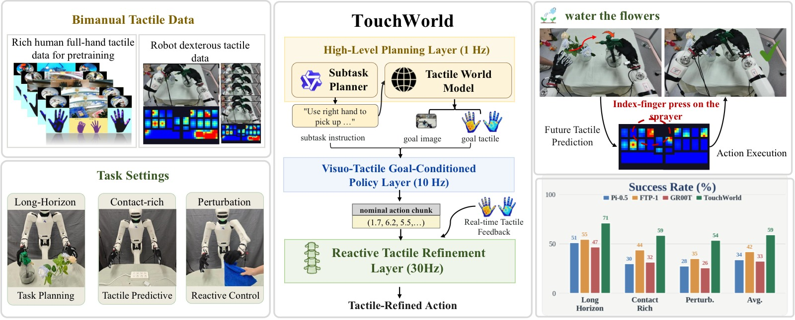
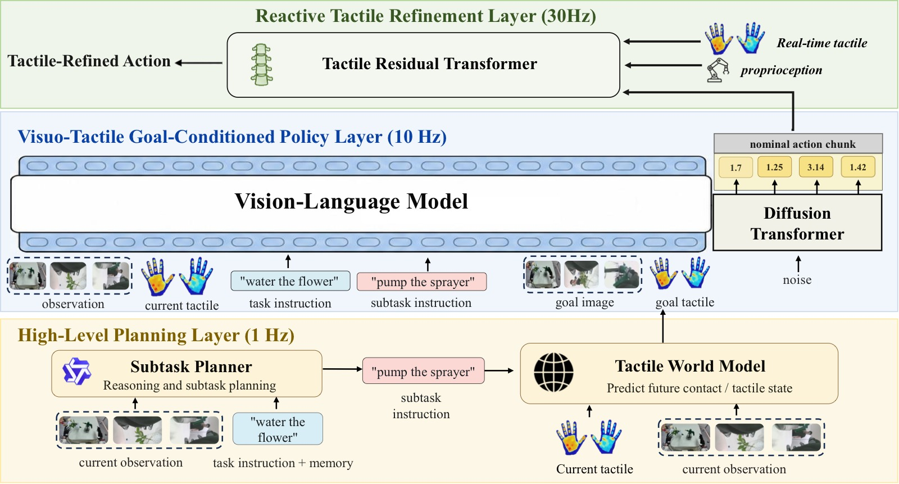
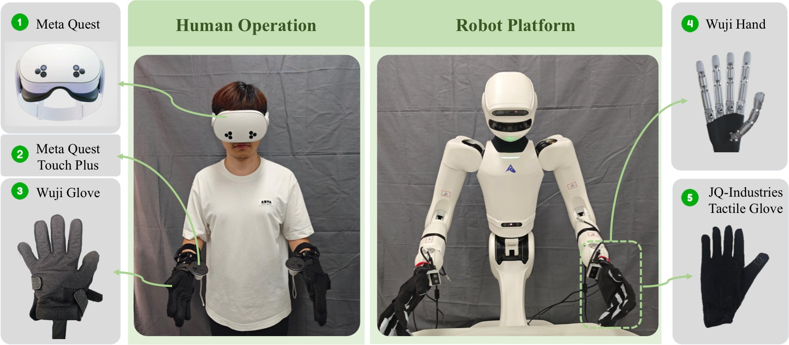
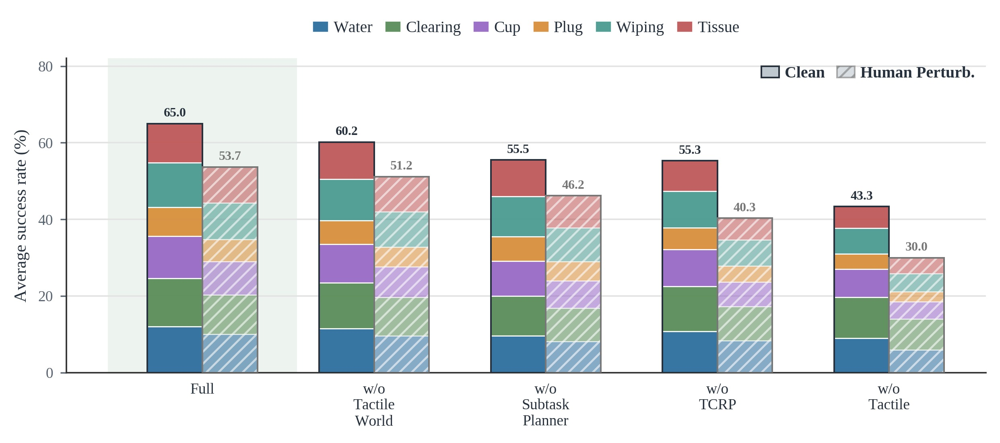

<!-- arxiv: 2607.07287 -->
<!-- venue: Tech Report 2026 -->
<!-- tags: 触觉, WAM, 世界模型, VLA, 机器人操作 -->

# TouchWorld: A Predictive and Reactive Tactile Foundation Model for Dexterous Manipulation

> **论文信息**
> - 作者：Jianyi Zhou, Feiyang Hong, Yunhao Li, Yicheng Zhao, Yongjue Cen, Zirui Liu, Jiakang Huang, Zirui Chen, Ruiyang Zhang, Weizhuo Zhu, Xuhua Song, Shuo Yang
> - 通讯作者：Shuo Yang (HIT Shenzhen / PHANES AI)
> - 投稿方向：Tech Report
> - arXiv ID：2607.07287
> - 项目：https://phanes-lab.github.io/TouchWorld-website/
>
> 本文基于以下本地材料整理：
>
> - 论文 TeX 源码：`arXiv-2607.07287v2/`（主文件：`paper.tex`）
> - 论文插图：`figures/*.pdf/png`（6 张图）
> - 本文图片导出目录：`assets/touchworld/`

---

## 一、核心问题

灵巧操作（watering、plug insertion、tissue pulling 等）需要双重能力：

1. **预测（Anticipation）**——接触应该如何演化？从当前状态预测接下来的接触模式
2. **反应（Reaction）**——当实际接触偏离预期时快速纠正

这是两个时间尺度的问题。但现有触觉策略将它们耦合在单一模型中——慢的语义推理、中的动作生成、快的接触反馈被迫竞争模型容量。结果：策略"知道"任务目标，但在抓取滑移、力控不稳、插入未对齐时缺乏快速回应。

> TouchWorld 关键主张：**触觉应该同时是预测信号和反馈信号**。战术世界模型预测 subgoal（"你应该感受到什么样的接触"），触觉 refinement policy 纠正偏差（"你没有感受到，调整一下"）。

*图1：TouchWorld 概念总览。(a) 触觉的预测路径（predict future contact goals）+ 反应路径（correct local errors online）；(b) 触觉标记位移图——不同接触模式产生不同形变特征；(c) 六个真机任务的示例帧。*

---

## 二、架构：三时间尺度层次

*图2：三层架构。L1 运行在慢速语义率，L2 在中间动作块率，L3 在快速控制环内。触觉同时出现在 L1（用于 subgoal 生成）和 L3（用于在线残差修正）。*

### 2.1 数学形式化

给定任务指令 $\ell$，多视图图像 $\mathcal{I}_t$，本体感知 $\mathbf{s}_t$，触觉观测 $\mathcal{X}_t$，高层次记忆 $m_t$：

**L1 — High-Level Planning Layer**（~1Hz）：
$$\ell_t^{\mathrm{sub}} = \pi_{\mathrm{subtask}}(\ell, \mathcal{I}_t, m_t) \quad \text{(Subtask Planner)}$$
$$g_t = \pi_{\mathrm{world}}(\ell, \ell_t^{\mathrm{sub}}, \mathcal{I}_t, \mathcal{X}_t) \quad \text{(Tactile World Model)}$$

**L2 — Visuo-Tactile Goal-Conditioned Policy**（~15Hz）：
$$(\hat{\mathbf{A}}_{t:t+H-1}, \mathbf{c}_t) = \pi_{\mathrm{goal}}(\ell, \ell_t^{\mathrm{sub}}, g_t, \mathcal{I}_t, \mathbf{s}_t, \mathcal{X}_t)$$

**L3 — Tactile-Conditioned Refinement Policy**（~60Hz）：
$$\tilde{\mathbf{A}}_{\tau:\tau+W-1} = \pi_{\mathrm{tactile}}(\hat{\mathbf{A}}_{\tau:\tau+W-1}, \mathbf{s}_{\tau-k:\tau}, \mathcal{X}_{\tau-k:\tau}, \mathbf{c}_t)$$

其中 $m_t$ 存储之前的 subtask、预测 subgoal 和执行状态；$\mathbf{c}_t$ 是上下文 token；$H$ 和 $W$ 分别是名义动作 horizon 和 refinement 滑动窗口。

### 2.2 组件详解

#### Subtask Planner

- 接收任务指令 + 当前视觉 + 高维记忆 $m_t$
- 不以高频率产生低层级命令——在慢速语义率下更新任务阶段
- 发射可执行的 subtask $\ell_t^{\mathrm{sub}}$（如 "approach cup" → "grasp cup" → "pour water"）
- 记忆 $m_t$ 携带先前 subtask、预测 subgoal 和执行状态，允许基于单帧观测进行任务进度推理

#### Tactile World Model

- 预测当前 subtask 的 **visual-tactile subgoal** $g_t$
- subgoal 包含"期望的视觉状态 + 期望的触觉接触模式"
- 训练：从演示数据中提取 subtask 边界 → 学习从 subtask 描述 + 当前观测预测对应的 visual-tactile 目标状态
- 这是"触觉的预测路径"——告诉 L2 策略"你应该感受到什么样的接触"

#### Visuo-Tactile Goal-Conditioned Policy

- 输入：subtask $\ell_t^{\mathrm{sub}}$、tactile subgoal $g_t$、RGB、本体感知、触觉观测
- 输出：名义动作块 $\hat{\mathbf{A}}_{t:t+H-1}$ + 上下文 token $\mathbf{c}_t$
- 上下文 token 编码当前执行的语义/接触上下文，传递给 L3 用于 refinement

#### Tactile-Conditioned Refinement Policy

- 运行在快速控制环内（~60Hz）
- 输入：名义动作滑动窗口 $\hat{\mathbf{A}}_{\tau:\tau+W-1}$（来自 L2）、近期本体感知 $\mathbf{s}_{\tau-k:\tau}$、近期触觉 $\mathcal{X}_{\tau-k:\tau}$、语义上下文 $\mathbf{c}_t$
- 输出：在线残差修正 $\tilde{\mathbf{A}}_{\tau:\tau+W-1}$
- 执行的动作：当前 refine 窗口中的 $\mathbf{a}_\tau$

**关键设计**：L3 不是独立的策略——它在 L2 生成的名义动作上进行**残差修正**。这使得 L3 可以非常轻量（小型 MLP），而 L2 承担复杂的动作生成。

### 2.3 时间尺度分离的好处

| 层 | 频率 | 更新方式 | 解决的问题 |
|---|:---:|---------|-----------|
| L1 | ~1Hz | 任务阶段变化时 | 长时序语义结构 |
| L2 | ~15Hz | 每动作块 | 动作块生成 |
| L3 | ~60Hz | 每控制周期 | 局部接触偏差纠正 |

三层在不同时间尺度上运作，各司其职：
- L3 不需要理解任务——只需要判断"实际接触 vs 期望接触的偏差"
- L2 不需要高频运行——名义动作在 ~1 秒内是有效的
- L1 只在任务阶段切换时重新规划——大幅减少不必要的语义推理

---

## 三、实验

### 3.1 设置

6 个长时序灵巧操作真机任务，双场景（clean + human perturbation）：

| 任务 | 灵巧要求 | 接触类型 |
|------|---------|---------|
| Water Flower | 力控浇水，避免损坏花朵 | 精细力控制 |
| Tabletop Clearing | 多物体大范围操作 | 多样抓取+移动 |
| Cup Insertion | 紧密公差对齐 | 约束插入 |
| Power Plug Insertion | 力反馈定位 | 盲插+力觉 |
| Pot Wiping | 持续接触，曲面 | 非均匀接触运动 |
| Tissue Pulling | 柔顺力+变形预测 | 变形体操作 |

双评估场景：
- **Clean**：标准初始条件，无外部干扰
- **Human Perturbation**：在操作过程中，人随机推动/拉动被抓物体——测试策略能否恢复

### 3.2 核心结果

**Clean Setting**：

| 方法 | Water Flower | Tabletop | Cup Ins. | Plug Ins. | Pot Wipe | Tissue | Avg |
|------|:----------:|:--------:|:--------:|:---------:|:--------:|:------:|:---:|
| VLA baseline | -- | -- | -- | -- | -- | -- | ~49.3 |
| **TouchWorld** | **72** | **76** | **66** | **45** | **70** | **61** | **65.0** |

> +15.7pp over strongest baseline

**Human Perturbation Setting**：

| 方法 | Water Flower | Tabletop | Cup Ins. | Plug Ins. | Pot Wipe | Tissue | Avg |
|------|:----------:|:--------:|:--------:|:---------:|:--------:|:------:|:---:|
| VLA baseline | -- | -- | -- | -- | -- | -- | ~35.2 |
| **TouchWorld** | **60** | **62** | **52** | **35** | **57** | **56** | **53.7** |

> +18.5pp over strongest baseline

**扰动下的提升更大（+18.5 > +15.7）**——证明 Tactile Refinement Policy (L3) 在接触被外部打破后快速恢复的能力是 TouchWorld 最核心的贡献。

### 3.3 消融

*图4：TouchWorld vs 消融变体的堆叠柱状图。(a) w/o Tactile WM——无 L1 触觉 subgoal；(b) w/o Refinement——无 L3 快速修正；(c) w/o Hierarchical——单层 monolithic 策略；(d) Full TouchWorld。*

| 消融 | Avg SR (Clean) | vs Full | 关键发现 |
|------|:------------:|:------:|---------|
| w/o Tactile WM (L1) | ~50% | -15pp | 无触觉 subgoal → 策略不知"应该感受什么" |
| w/o Refinement (L3) | ~48% | -17pp | 无 60Hz 修正 → 接触偏差无法快速纠正 |
| w/o Hierarchy (monolithic) | ~42% | -23pp | 单层耦合三类任务 → 模型容量竞争，三者皆失 |
| Full TouchWorld | **65.0%** | -- | 预测+反应+层次 = 全面的接触 robustness |

---

## 四、关键洞察

1. **触觉的双重角色是核心创新**：同一触觉信号在 L1 中用于预测 subgoal（"你应该感受什么"），在 L3 中用于反馈修正（"你偏离了多少"）。这不是两个独立的触觉使用方式，而是同一触觉信号在不同时间尺度上的两种解释。

2. **预测+反应 = 灵巧操作的必要条件**：去掉 Tactile WM（仅剩反应）降 15pp，去掉 Refinement（仅剩预测）降 17pp。两者缺一不可——灵巧操作需要完整的感知-动作闭环。

3. **三层解耦 vs 单层 monolithic**：单层模型将所有东西塞进一个网络中——语义推理、动作生成、接触修正竞争模型容量。TouchWorld 的 -23pp 优势来自于"各司其职"的设计哲学。

4. **扰动下的优势大于清洁环境**（+18.5 > +15.7）：Tactile Refinement 在接触被打破后的恢复是增量所在。清洁环境下所有方法表现更好，但扰动下只有 TouchWorld 保持稳健。

5. **Subgoal 是一个被低估的中间表示**：大多数工作直接从感知到动作。TouchWorld 在中间插入了"tactile subgoal"层——这是一种**接触空间的规划**，相比于直接在动作空间中规划更稳定、更容易从演示中学习。

---

## 五、局限

1. Subtask Planner 依赖预定义的任务分解模板——无法自适应地发现新的子任务结构
2. Tactile World Model 的 subgoal 预测质量受限于演示数据的覆盖
3. 真实部署中三层的时间同步是一个工程挑战
4. 仅在两指夹爪上验证——多指灵巧手的扩展将是更复杂的触觉预测问题
