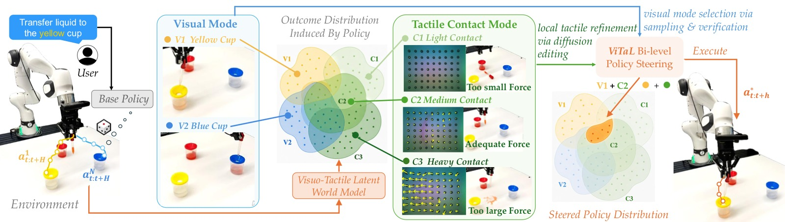
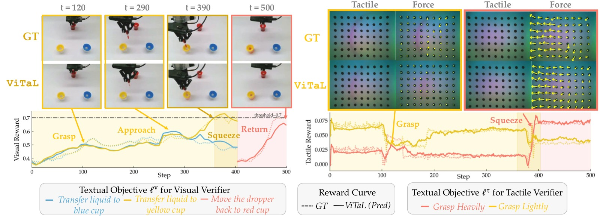
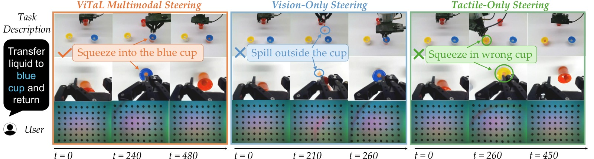
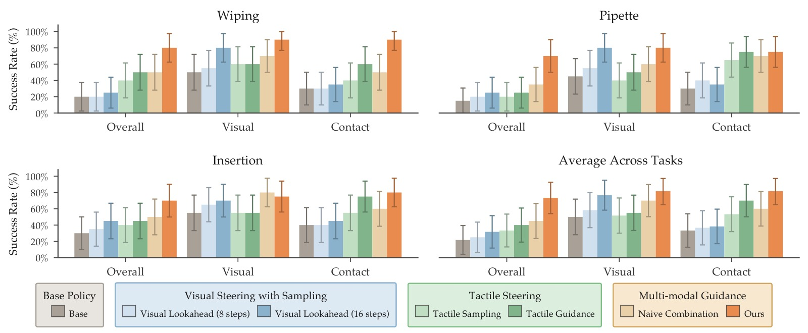
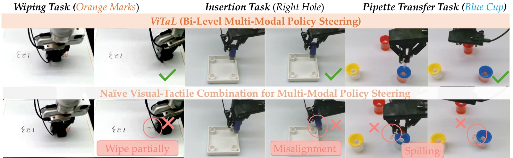

<!-- arxiv: 2606.14981 -->
<!-- venue: CoRL 2026 -->
<!-- tags: 触觉, VLA, 机器人操作, 世界模型, 表征学习 -->

# Inference-time Policy Steering via Vision and Touch

> **论文信息**
> - 作者：Yilin Wu, Zilin Si, Zeynep Temel, Oliver Kroemer, Andrea Bajcsy
> - 通讯作者：Andrea Bajcsy (CMU)
> - 投稿方向：CoRL 2026（preprint）
> - arXiv ID：2606.14981
> - 项目：https://yilin-wu98.github.io/vital_website/
>
> 本文基于以下本地材料整理：
>
> - 论文 TeX 源码：`arXiv-2606.14981v1/`（主文件：`main.tex`，按 `sections/` 分章节）
> - 论文插图：`figures/*.pdf`（31 张图）
> - 本文图片导出目录：`assets/vital/`

---

## 一、核心问题

Inference-time steering 通过在部署时验证候选动作，使预训练策略无需重新训练即可适应新任务。但现有方法仅用视觉验证——视觉能判断"我到了正确的地方吗"，但无法判断"我的接触力对吗"。

接触-rich 操作的成败往往取决于后者：

- **Wiping**：视觉看到标记被擦除了吗？触觉感受到足够的接触压力吗？
- **Insertion**：视觉看到对准了吗？触觉检测到插入成功了吗？
- **Pipette Transfer**：视觉看到移液管在目标杯上方吗？触觉检测到稳定抓取和合适的挤压力度吗？

> VITAL 提出了一种多模态 inference-time steering 框架：**视觉负责"What to do"（模式选择），触觉负责"How well"（接触精化）**。两者通过一个共享的 visuo-tactile 潜在世界模型在潜在空间中预测未来并验证——无需部署时的高频触觉传感器之外的额外硬件。



*图1：VITAL 框架总览。视觉 steering（蓝色）进行 16 步长时序模式选择，触觉 steering（绿色）进行 8 步短时序接触精化。两者共享一个 latent visuo-tactile world model 在潜在空间中预测未来状态并评估 reward。*

---

## 二、核心方法

### 2.1 双层级 Visuo-Tactile Steering 形式化

VITAL 将多模态 steering 形式化为一个双层优化问题——匹配视觉和触觉的互补时间尺度：

$$\mathbf{a}^*_{t:t+h} = \arg\max_{\mathbf{a}_{t:t+h}} \underbrace{\log p_\theta(\mathbf{a}_{t:t+h} \mid \bar{\mathbf{a}}_{t:t+h}, o_t)}_{\text{visual prior around selected mode}} + \beta \cdot \underbrace{R^\tau(\hat{\mathbf{z}}^\tau_{t:t+h}; \mathcal{L})}_{\text{tactile: local contact reward}}$$

其中视觉选模：

$$\bar{\mathbf{a}}_{t:t+H} = \arg\max_{\mathbf{a}_{t:t+H}\sim\pi_\theta(\cdot\mid o_t)} R^v(\hat{\mathbf{z}}^v_{t:t+H}; \mathcal{L})$$

**两层的作用和直觉**：

| 层级 | Horizon | 采样子 | 奖励函数 | 决策类型 |
|------|:------:|--------|---------|---------|
| 视觉 (inner) | H=16 | 从 base policy 采样 N=10 个候选 | ROBOMETER 视觉 reward | "去哪"（选模式） |
| 触觉 (outer) | h=8 | 在视觉选定模式附近精化 | 文本条件触觉 cosine reward | "多稳"（精接触） |

**为什么朴素融合会失败**：直接将视觉和触觉 reward 线性组合 $\alpha R^v + (1-\alpha)R^\tau$ 在所有三个任务上成功率为 0。原因：两种 reward 的量级、噪声特性和稀疏性不同，线性组合无法解耦全局模式选择与局部精化。

### 2.2 Visuo-Tactile 潜在世界模型



*图2：世界模型在 Pipette 任务上的预测。(左) 视觉 reward——识别目标杯选择和阶段切换；(右) 触觉 reward——捕获从轻柔到稳固抓取的转变，与 marker-tracking 力估计一致。*

| 组件 | 实现细节 |
|------|---------|
| 视觉编码器 | DINOv3（冻结），结构化潜在空间用于场景理解 |
| 触觉编码器 | AnyTouch2（冻结），语义对齐的触觉潜在空间 |
| 动态模型 | Transformer，从 $(\hat{\mathbf{z}}_t, \mathbf{a}_{t:t+h})$ 递归预测 $\hat{\mathbf{z}}_{t+h}$ |
| 训练数据 | 50 条专家演示 + 250 条中间 checkpoint rollout |
| 解码器 | 分别训练视觉和触觉解码器用于可视化 |

**多步潜在预测目标**：模型递归预测未来多步的联合 visuo-tactile latent，训练时同时优化单步和多步预测精度。

### 2.3 阶段依赖的文本验证目标

单一任务指令（如 "transfer liquid to blue cup and return"）对长时序操作太粗糙。VITAL 使用 **VLM (GPT-4o) 离线分解任务为阶段**：

```
Task: "transfer liquid to the blue cup and return"
  ├── Phase 1: move to red cup
  │   ├── visual: "gripper approaching red cup"
  │   └── tactile: "gentle grasp on cup, no liquid dispensing yet"
  ├── Phase 2: transfer to blue cup
  │   ├── visual: "moving from red cup to blue cup"
  │   └── tactile: "firm grasp, squeeze to dispense liquid"
  └── Phase 3: return to red cup
      ├── visual: "returning to red cup position"
      └── tactile: "release grasp, no squeezing"
```

每个阶段 $\ell_p$ 有独立的视觉子目标 $\ell_p^v$ 和触觉子目标 $\ell_p^\tau$。

### 2.4 多模态 Verifier 设计

**视觉 Verifier**：ROBOMETER（zero-shot 通用 VLM reward model）
- 将预测的视觉 latent 解码为 RGB $\hat{\mathcal{O}}^v_{t+H}$，与历史观测 $\mathcal{O}_{\leq t}$ 拼接
- 输入 ROBOMETER，输出视觉 reward
- 用于长时序模式选择——区分全局有意义的任务进展

**触觉 Verifier**（创新设计）：文本条件的潜在空间 cosine 奖励
$$R^\tau(\hat{\mathbf{z}}^\tau_{t+h}, \ell_p^\tau) = \cos(\hat{\mathbf{z}}^\tau_{t+h}, \text{enc}^{\ell}(\ell_p^\tau))$$

- 使用 AnyTouch2 的语义对齐潜在空间
- 将触觉嵌入与 CLIP 文本嵌入直接计算 cosine 相似度
- **零样本**：不需训练任何触觉分类器
- 对微妙接触结果（稳定抓取 vs 初始滑移）具有判别性


### 2.5 推理时的执行流程

```
At each timestep t:
1. Sample N=10 action candidates from base policy π_θ
2. Rollout each candidate through latent world model → predicted visuo-tactile futures
3. Evaluate visual reward R^v for each → select best mode ā_{t:t+16}
4. Around ā, sample/refine with tactile reward R^τ for first 8 steps
5. Execute refined a*_{t:t+8}
6. Repeat from new observation

Steering frequency: once per action chunk execution
Total inference overhead: N × world_model_rollout + reward_evaluations per steering step
```

---

## 三、实验与结果

### 3.1 任务与设置

Franka Emika + GelSight，3 个接触-rich 真机任务：



| 任务 | 视觉目标 | 触觉要求 | 演示数 |
|------|---------|---------|:-----:|
| Wiping | 选择正确标记区域 | 维持接触力、覆盖整个区域 | 50 |
| Insertion | 选择正确孔位 | 精确对齐、插入力控制 | 50 |
| Pipette Transfer | 选择目标杯 + 返回 | 抓取稳定性、挤压力度 | 50 |

每任务额外 250 条 rollout 训练世界模型。

### 3.2 策略性能



*图5：(a) 总体成功率——VITAL +51% over base；(b) 视觉/接触成功率拆解——VITAL 是唯一同时在两个维度都提升的方法。*

| 方法 | Overall | Visual Success | Contact Success |
|------|:------:|:------------:|:-------------:|
| Base Policy | baseline | - | - |
| Visual Lookahead (H=8) | +limited | ✓ 提升 | 0 |
| Visual Lookahead (H=16) | +limited | ✓ 提升 | 0 |
| Tactile Sampling (N=10) | +limited | 0 | ✓ 提升 |
| Tactile Guidance (classifier) | +limited | 0 | ✓ 提升 |
| **VITAL (ours)** | **+51%** | ✓✓ | ✓✓ |

> 视觉单独提升视觉成功率但对整体完成帮助有限；触觉单独改善接触但无法满足任务目标。VITAL 是唯一同时在两者上都显著提升的方法。

### 3.3 Verifier 质量

**偏好顺序准确率**（正确排序 rollout 对的比例，%）：

| Verifier | Wiping | Insertion | Pipette | Avg. |
|----------|:------:|:---------:|:-------:|:----:|
| Visual (GT obs) | 80.0±6.3 | 70.0±7.2 | 100.0±0.0 | 83.3±5.9 |
| Visual (Pred obs) | **82.5±6.0** | **72.5±7.1** | 100.0±0.0 | **85.0±5.6** |
| Tactile (GT obs) | 85.0±5.6 | 70.0±7.2 | 80.0±6.3 | 78.3±6.5 |
| Tactile (Pred obs) | **90.0±4.7** | **77.5±6.6** | 77.5±6.6 | **81.7±6.1** |

> 预测观测上的 reward 精度反而略高于真实观测——潜在世界模型平滑了观测噪声，使得 rollout 排序更容易。视觉 verifier 在 Pipette 上达到 100% 准确率。

### 3.4 失效模式分析


*图6：Pipette 任务中三种 steering 模式对比。(左) VITAL 成功——夹具对准黄杯、稳定挤压力度；(中) 视觉-only 失败——洒出液体（不精确的挤压力度）；(右) 触觉-only 失败——接触良好但夹具对准了错误的杯子。*

**视觉-only steering 的失效**：选择了全局看起来合理的动作（vs 未对齐杯口），但无法感知接触精度——可能挤压过猛导致溢出或挤压不足导致液体不够。

**触觉-only steering 的失效**：可以改善局部接触（如抓取力合适），但无法区分两个视觉上不同的目标杯——容易在多个视觉模式间迷失。

### 3.5 双层级 vs 朴素融合



*图7：(上) 双层级 steering 在三任务上都成功；(下) 朴素融合（视觉+触觉 reward 线性组合）在三任务上都失败。证明双层解耦是必要条件而非锦上添花。*

**朴素融合失败的原因**：
1. 视觉和触觉 reward 的量级和稀疏性不同——视觉在整个 trajectory 上都提供信号，触觉仅在接触时活跃
2. 直接相加会淹没触觉信号（量级通常远小于视觉）
3. 无法体现"先用视觉选模式、再用触觉精化"的层级决策结构

---

## 四、关键洞察与技术亮点

1. **双层级解耦是核心创新**：视觉负责"What"（H=16，全局模式选择），触觉负责"How well"（h=8，局部精化）。两者在同一优化框架中但作用不同——这不是多模态融合，而是模态间的分工协作。

2. **潜在世界模型在推理时不需要解码**：视觉和触觉 reward 都在潜在空间中计算——不需要 decode 回像素空间。这是效率保证的关键。

3. **文本条件的零样本触觉 reward**：$R^\tau = \cos(\hat{\mathbf{z}}^\tau, \text{enc}^{\ell}(\ell_p^\tau))$ 利用了 AnyTouch2 与 CLIP 的对齐——无需训练任何触觉分类器，对任意接触描述直接可用。

4. **VLM 任务分解是隐式的 curricululm learning**：将抽象指令分解为阶段级子目标——每个阶段的视觉/触觉目标更具体、更容易验证。

5. **预测 reward 精度超过真实 reward**：因为潜在空间平滑了噪声——这是使用潜在世界模型的意外收益。

6. **朴素多模态融合完全失败**：在所有 3 个任务上成功率为 0——证明视觉+触觉的互补性需要通过专业化分工而非简单组合来利用。

---

## 五、局限性与讨论

1. VLM 任务分解是离线进行的——无法适应部署中的意外情况（如新物体出现）
2. 双层级优化增加了推理计算——每次 steering 需 N×world_model_rollout
3. 仅在两指夹爪 + GelSight 上验证
4. 触觉 verifier 依赖 AnyTouch2 预训练 encoder 的质量
